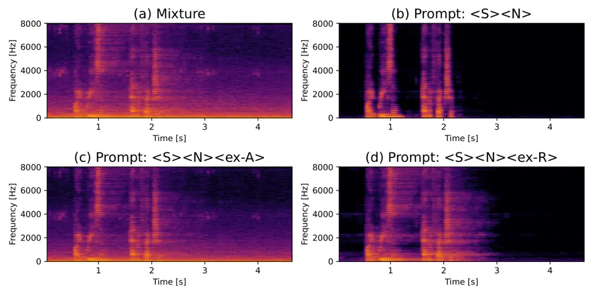

\robustify

# Downstream-Task-Aware Unified Source Separation

###### Abstract

Task-aware unified source separation (TUSS) enables a single model to
handle diverse separation tasks by conditioning on input prompts.
However, conventional TUSS does not account for downstream task
requirements, such as whether the enhanced speech will be used for human
listening or automatic speech recognition (ASR). In this paper, we
propose a prompt extension framework for TUSS that incorporates
downstream task information into the input prompts and switches the loss
function according to the given prompt during training, enabling outputs
with different signal characteristics at inference time. Specifically,
we introduce an ASR-dedicated prompt paired with a regularized loss
function that reduces speech artifacts to improve ASR robustness, while
the standard prompt is paired with the conventional SNR loss function.
Experiments on the LibriSpeech and JNAS corpora demonstrate that the
proposed joint-training scheme enables a single model to improve ASR
performance over noisy input across a wide range of SNR conditions by
selecting the ASR-dedicated prompt, while maintaining general speech
enhancement quality when the standard prompt is used.

[TABLE]

Index Terms—  source separation, speech enhancement, task-aware, prompt
extension

## 1 Introduction

Source separation is widely used in various applications, especially as
an acoustic front-end for automatic speech recognition (ASR).
Deep-learning-based single-channel source separation methods \[2, 22,
10, 9, 18, 19\] play an important role in single-channel, low-cost input
devices.

Task-aware unified source separation (TUSS) \[16, 13\] can be used as a
unified model for various purposes, such as speech separation, speech
enhancement, music source separation, and cinematic source separation,
by conditioning the model on different prompts. However, even when the
input signal contains the same source types, the desirable outputs may
differ depending on the user’s objective. For example, speech
enhancement for human listening typically aims to minimize residual
noise, whereas for ASR, single-microphone enhancement can degrade
performance relative to using the original noisy input \[12\]. To
address this issue, ASR-oriented objective functions have been proposed
(e.g., \[6, 8\]), but they tend to sacrifice perceptual quality for
human listening. Furthermore, directly optimizing for a specific ASR
system ties the enhancement model to that backend and requires a
differentiable ASR pipeline during training, increasing both complexity
and inflexibility. Observation adding (OA) \[4, 20, 1\] is a simpler
postprocessing alternative that improves ASR performance by blending the
enhanced signal back with the noisy input. However, because OA is
applied only at inference time, it cannot incorporate downstream-task
requirements into the training objective. This limitation motivates us
to explore a unified training framework that can adapt output
characteristics according to downstream-task requirements.

In this paper, we propose a prompt-extension framework for TUSS that
incorporates downstream-task information and uses prompt-dependent loss
functions, enabling a single model to generate task-appropriate outputs.
A similar prompt-based control method has been explored for
reverberation control \[23\], but our approach readily extends to
multiple prompts. Our experiments demonstrate that this framework
enables a single model to realize more flexible source separation across
diverse purposes and conditions.

## 2 Conventional TUSS

We assume that an observed signal $`\bm{x}\in\mathbb{R}^{L}`$ of length
$`L`$ is a mixture $`\bm{x}=\sum_{n=1}^{N}\bm{s}_{n}`$ of $`N`$ sources
$`\bm{s}_{n}\in\mathbb{R}^{L}`$. The goal of source separation is to
estimate the source signals $`\bm{s}_{n}`$ from the observed signal
$`\bm{x}`$. In the case of speech enhancement, we typically consider
$`N=2`$, where $`\bm{s}_{1}`$ is the speech signal and $`\bm{s}_{2}`$ is
the noise signal.

TUSS \[16\] is a universal source separation framework capable of
handling multiple source separation tasks by changing the input prompt
of a single model. For example, we can use the TUSS model for speech
enhancement by using the prompts \<Speech\> and \<SFX-mix\>, while the
same model can be used for music source separation with \<Drums\>,
\<Bass\>, \<Vocals\> and \<Other inst.\>. Here, each prompt (e.g.,
\<Speech\>, \<SFX-mix\>) represents a different source type in the input
audio.

The TUSS model takes as inputs the mixture signal $`\bm{x}`$ and
prompts. First, we apply a short-time Fourier transform (STFT) and a
band-split encoder \[11, 21\] to the input signal $`\bm{x}`$, resulting
in a 3D tensor $`\bm{Z}\in\mathbb{R}^{D\times T\times F}`$, where $`D`$
and $`F`$ are the number of channels and bands of intermediate
representation respectively. Then, the input prompt is embedded via the
learnable prompt vector $`\bm{p}_{n}\in\mathbb{R}^{D\times 1\times 1}`$,
which is copied across all $`F`$ bands and concatenated with $`\bm{Z}`$
along the $`T`$ axis, forming
$`\bm{Z}^{\prime}=[\bm{p}_{1},...,\bm{p}_{N},\bm{Z}]\in\mathbb{R}^{D\times(N+T)\times F}`$.
A cross-prompt module transforms $`\bm{Z}^{\prime}`$ into intermediate
features
$`\tilde{\bm{Z}}^{\prime}=[\tilde{\bm{p}}_{1},...,\tilde{\bm{p}}_{N},\tilde{\bm{Z}}]`$,
where $`\tilde{\bm{p}}_{n}\in\mathbb{R}^{D\times 1\times F}`$ denotes
each updated prompt embedding, by jointly processing all input prompts,
allowing cross-prompt information exchange. Prompt-conditioned
intermediate features $`\tilde{\bm{Z}}_{n}`$ are created by replicating
$`\tilde{\bm{p}}_{n}`$ along the $`T`$ axis and applying element-wise
multiplication with $`\tilde{\bm{Z}}`$, i.e.,
$`\tilde{\bm{Z}}_{n}=\tilde{\bm{p}}_{n}\odot\tilde{\bm{Z}}`$. A target
source extraction (TSE) module then refines these into separated source
features $`\hat{\bm{Z}}_{n}`$. Finally, we obtain the separated source
signals $`\hat{\bm{s}}_{n}`$ by applying a band-split decoder and
inverse STFT to the separated features $`\hat{\bm{Z}}_{n}`$. The
cross-prompt and TSE modules consist of TF-Locoformer blocks as
described in \[17\]. The TUSS model is optimized using negative
signal-to-noise ratio (SNR) loss.

## 3 Prompt Extension for Multiple Conditions

### 3.1 Overview of Prompt Extension

We aim to obtain separated signals that reflect additional information,
such as usage scenarios and acoustic conditions. We propose to introduce
new prompts that are trained with downstream-task-specific loss
functions, whereas existing prompts follow the conventional TUSS
objective. This design enables switching between
downstream-task-specific outputs at inference time.

We introduce two types of downstream-task-specific prompts:
source-conditioned prompts are new independently learned prompt tokens
associated with a specific source type and downstream-task (e.g., ASR)
requirement, e.g., \<Speech-XXXX\>; downstream-task-only prompts encode
solely downstream-task information independent of source identity as an
extra (“ex”) token, e.g., \<ex-XXXX\>. Downstream-task-only prompts are
used only in the cross-prompt module for conditioning and are not passed
to the TSE module, as they do not correspond to explicit output sources.
Figure 1 illustrates the proposed framework. Source-conditioned prompts
are generally more suitable for source-specific output requirements,
since each prompt is used to extract a particular source. By contrast,
downstream-task-only prompts are often more effective for global
conditions independent of source identity, such as recording environment
and reverberation control \[23\]. Multiple downstream-task-only prompts
can also be combined to represent multiple conditions simultaneously.

Fig. 1: Overview of prompt extension for task-aware source separation:
(a) extended prompts incorporating additional downstream task
information, and (b) additional downstream-task-specific prompts.

### 3.2 Application to ASR Frontend

For ASR frontend use, preserving target speech with minimal distortion
is more important than aggressive noise reduction. In conventional TUSS,
the SNR loss does not explicitly enforce these constraints, which can
degrade ASR performance. MAP-based training \[8\] is an ASR-oriented
speech-enhancement training method that adds an L1- or L2-based
regularization term between enhanced speech and a noise-reduced mixture,
inspired by maximum a posteriori (MAP) estimation. The loss function is
given by

```math
\mathcal{L}_{\mathrm{L1,R}}(\bm{s}_{n},\hat{\bm{s}}_{n})=\|\bm{s}_{n}-\hat{\bm{s}}_{n}\|_{1}+\lambda\|\bm{y}_{n}-\hat{\bm{s}}_{n}\|_{1}, \tag{1}
```

where $`\lambda`$ is a regularization weight, and $`\bm{y}_{n}`$ denotes
a noisy reference signal whose SNR is increased by $`\alpha`$ dB
relative to the original mixture, i.e.

```math
\bm{y}_{n}=\bm{s}_{n}+10^{-\frac{\alpha}{20}}(\bm{x}-\bm{s}_{n}). \tag{2}
```

The regularization term introduces a trade-off between matching the
clean reference $`\bm{s}_{n}`$ and the noise-reduced mixture
$`\bm{y}_{n}`$, which can improve ASR performance by avoiding overly
aggressive noise suppression. We set the regularization hyperparameters
$`\lambda`$ and $`\alpha`$ to 1 and 5.0, respectively, which showed good
performance in \[8\]. However, MAP-based training is designed for a
dedicated ASR-oriented model and does not provide a mechanism to support
both general and ASR-oriented enhancement within a single unified model
such as TUSS. To address this limitation, we introduce new TUSS prompts,
\<Speech-ForASR\> (source-conditioned) and \<ex-ForASR\>
(downstream-task-only), which enables a single TUSS model to switch
between general and ASR-oriented enhancement by allowing users to select
the appropriate prompt at inference time according to application
requirements. When the \<Speech-ForASR\> or \<ex-ForASR\> prompt is
used, we compute the loss function with regularization to prioritize ASR
performance. When downstream-task-specific prompts are not used, we
compute the standard loss function to prioritize general waveform
reconstruction quality. Since the original TUSS is trained with an
SNR-based objective, we further propose an SNR-based regularized
objective, inspired by MAP-based training:

```math
\mathcal{L}_{\mathrm{SNR,R}}(\bm{s}_{n},\hat{\bm{s}}_{n})=-\mathrm{SNR}(\bm{s}_{n},\hat{\bm{s}}_{n})-\lambda\cdot\mathrm{SNR}(\bm{y}_{n},\hat{\bm{s}}_{n}). \tag{3}
```

### 3.3 Application to Reverberation Control

Input mixtures for source separation are often reverberant, and the
desirable amount of reverberation depends on the application: removing
reverberation may be preferable for downstream tasks such as ASR,
whereas retaining some reverberation may be more desirable for human
listening. To control this behavior, we introduce a new
downstream-task-only prompt, \<ex-KeepRev\>. A similar control mechanism
was introduced in USES \[23\] as a memory token.

During model training, we generate reverberant speech by convolving room
impulse responses (RIRs) with dry speech and then adding noise. When
\<ex-KeepRev\> is included, we compute the loss against the reference
reverberant speech. Otherwise, we compute it against the target speech
obtained with the earlier 50 ms of the RIR to exclude late
reverberation \[5\]. This differs from usual TUSS training, where both
mixture and target are without reverberation.

## 4 Experiments

### 4.1 Experimental Conditions

To evaluate the effectiveness of the proposed prompt-based TUSS control
method, we conducted experiments on ASR-oriented speech enhancement and
reverberation control.

We trained the following TUSS models. Model A1 was trained with the
standard SNR loss using \<Speech\> and \<SFX-mix\> as prompts. Model A2
was trained with the regularized SNR loss in 3 using the
\<Speech-ForASR\> and \<SFX-mix\> prompts. Models A3 and A4 jointly
optimize both objectives at 50% probability: A3 uses source-conditioned
prompts (\<Speech\> with SNR loss, \<Speech-ForASR\> with the loss in
3), while A4 applies 3 when the downstream-task-only prompt
\<ex-ForASR\> is present and the SNR loss otherwise. In addition to
these four settings, we trained three other models (B1–B3), in which we
replaced the SNR losses by their L1 equivalents (e.g., 3 with 1). In the
results, we distinguish the two output types of A3, A4, and B3 by
appending suffixes: -H denotes outputs for high-quality enhancement, and
-A denotes outputs for ASR-oriented enhancement (using \<Speech-ForASR\>
for A3/B3 and \<ex-ForASR\> for A4). For Model A5, -XD and -XR denote
outputs without and with the \<ex-KeepRev\> prompt, respectively, where
X is either H or A, carrying the same meaning as the suffixes defined
above. In all training settings, each mixture contained one speech
source and one noise source. To evaluate joint training for ASR-oriented
speech enhancement and reverberation control, we trained Model A5 with
the prompts \<Speech\>, \<SFX-mix\>, \<ex-ForASR\>, and \<ex-KeepRev\>.
During training, the inclusion of each downstream-task-only prompt
(\<ex-ForASR\> and \<ex-KeepRev\>) was independently toggled with 50%
probability, yielding four prompt combinations sampled uniformly at 25%
each. Models A1–A4 and B1–B3 were trained on anechoic noisy mixtures,
whereas Model A5 was trained on an equal mixture of anechoic and
reverberant noisy data.

We extracted spectrograms from 16 kHz input mixture signal using STFT
with a 32 ms window length and 8 ms hop length. Next, we applied a
band-split module based on the same frequency partitioning as in \[21\]
(this allocation strategy differs from the original TUSS, which targets
48 kHz input signals). All other parameters were set as in the
open-sourced TUSS Medium configuration¹¹ 1
[https://github.com/merlresearch/unified-source-separation](https://github.com/merlresearch/unified-source-separation).
We used $`D=64`$, $`K=4`$, $`S=1`$, $`H=4`$ and $`G=8`$ (notations
follow \[17\]). We set $`(B,E,C)`$ to $`(4,128,384)`$ for cross-prompt
modules and to $`(2,96,256)`$ for TSE modules, where $`B`$, $`E`$, and
$`C`$ denote the number of TF-Locoformer blocks, attention hidden size,
and Conv-SwiGLU hidden dimension, respectively. We trained all models
for 150 epochs, with 2000 update steps per epoch and a batch size of 4.
We used the AdamW optimizer with linear warm-up of the learning rate to
0.001 over 10k steps. If the validation loss did not improve for five
epochs, we restarted model training from the current best model after
halving the learning rate.

For model training and evaluation, we used speech samples from the
LibriSpeech \[14\] corpus and noise samples from the ATR Ambient Noise
Sound Database II (ATRANS-II)²² 2
[https://www.atr-p.com/products/esd.html](https://www.atr-p.com/products/esd.html)
(in Japanese). For the speech data, we used 460 hours from the
train-clean-100 and train-clean-360 sets for training, 5 hours from the
dev-clean set for validation, and 5 hours from the test-clean set for
evaluation. For training the model A5, we made reverberant speech by
convolving the anechoic speech with simulated RIRs from the SLR26
database³³ 3 [https://www.openslr.org/26/](https://www.openslr.org/26/).
The RIRs were split into training, validation, and test sets in a 7:2:1
ratio. For the noise data, we split 77 noise types into 54 for training,
16 for validation, and 7 for evaluation. We removed segments containing
clear speech from the noise data using Silero-VAD⁴⁴ 4
[https://github.com/snakers4/silero-vad](https://github.com/snakers4/silero-vad).
At the training and validation stage, we generated anechoic and
reverberant noisy mixtures dynamically. The loudness values in LUFS of
speech and noise were uniformly sampled from (-35, -27) and (-33, -25),
respectively, for training and validation. Note that we adopted a lower
loudness range for speech sources than noise because we assumed that the
model would be used mainly in severely noisy environments. We applied
speed perturbation to both speech and noise with factors uniformly
sampled from (0.9, 1.1). At the evaluation stage, we generated
evaluation mixtures by setting noise loudness to speech +5 LUFS and
combined 2,620 speech samples with 7 test noise types (18,340 mixtures
in total). We evaluated speech enhancement quality using SI-SDR \[10,
7\], which measures the overall waveform reconstruction accuracy,
UTMOS \[15\], which evaluates the perceptual audio quality for human
listeners, and word error rate (WER) with the Whisper-turbo model, which
evaluates ASR performance. For baseline comparison, we applied OA with a
ratio of 0.4, optimized through preliminary tuning.

To investigate performance trends across a wider SNR range with a
different corpus, we created additional evaluation data for evaluating
Japanese ASR performance in noisy conditions. Five male and five female
speakers were chosen from the ASJ Japanese Newspaper Article Sentences
(JNAS) Corpus \[3\]. We used the same 7 ATRANS-II noise types reserved
for evaluation. We mixed the speech and noise signals with loudness
differences ranging from 5 dB to -15 dB in 5 dB steps. We refer to the
loudness difference as SNR. In contrast to the English evaluation with
WER, we evaluated Japanese ASR performance using character error rate
(CER).

### 4.2 Results

ID TUSS Obj. Style Prompt OA SI-SDR UTMOS WER C Clean - - - -
$`4.084\,131`$ 3.0 N Noisy - - - $`-10.5`$ $`1.41`$ 4.5/29.7 A1 SNR -
\<S\>\<N\> - $`10.7`$ $`3.17`$ 4.7/21.5 A2 SNR_R - \<S-A\>\<N\> -
$`-6.0`$ $`1.68`$ 4.2/20.1 A3-H SNR+SNR_R Source \<S\>\<N\> - 10.8 3.21
4.6/21.1 A3-A SNR+SNR_R Source \<S-A\>\<N\> - $`-5.9`$ $`1.68`$ 4.2/19.9
A4-H SNR+SNR_R Task \<S\>\<N\> - $`10.6`$ $`3.13`$ 4.9/22.6 A4-A
SNR+SNR_R Task \<S\>\<N\>\<ex-A\> - $`-6.0`$ $`1.68`$ 4.2/20.5 B1 L1 -
\<S\>\<N\> - $`10.0`$ $`3.07`$ 4.9/25.9 B2 L1_R - \<S-A\>\<N\> -
$`-3.5`$ $`1.84`$ 4.3/21.0 B3-H L1+L1_R Source \<S\>\<N\> - $`10.0`$
$`3.07`$ 4.9/26.3 B3-A L1+L1_R Source \<S-A\>\<N\> - $`-3.5`$ $`1.84`$
4.3/21.0 A1’ SNR - \<S\>\<N\> $`\checkmark`$ $`-3.4`$ $`1.86`$ 4.2/18.9
B1’ L1 - \<S\>\<N\> $`\checkmark`$ $`-3.4`$ $`1.84`$ 4.3/21.3

Table 1: Speech enhancement and ASR performance (SI-SDR \[dB\], UTMOS,
WER \[%\]) on LibriSpeech+ATRANS-II. SNR_R and L1_R are the regularized
SNR and L1 losses. Source and Task in the Style column denote
source-conditioned and downstream-task-only prompts. \<S\>, \<N\>,
\<S-A\>, \<ex-A\> abbreviate \<Speech\>, \<SFX-mix\>, \<Speech-ForASR\>,
\<ex-ForASR\>, and the bold prompt’s output is evaluated. $`\checkmark`$
indicates that OA with a ratio of 0.4 was applied at inference. WER
values left/right of the slash are for the 3 easiest/4 hardest noise
types.

ID TUSS Objective Style Prompt OA +5dB 0dB -5dB -10dB -15dB C
Clean - - - 5.1 N Noisy - - - 5.3/7.1 5.6/12.5 7.2/40.3 13.1/263.4
33.2/423.1 A1 SNR - \<S\>\<N\> - 5.5/7.1 5.8/11.5 7.0/34.8 11.7/170.3
29.2/233.2 A2 SNR_R - \<S-A\>\<N\> - 5.3/6.3 5.5/09.7 6.2/24.5
09.5/146.2 23.2/384.7 A3-A SNR+SNR_R Source \<S-A\>\<N\> - 5.3/6.3
5.5/09.5 6.4/23.4 10.0/137.6 21.5/378.5 A4-A SNR+SNR_R Task
\<S\>\<N\>\<ex-A\> - 5.3/6.3 5.5/09.7 6.2/24.6 09.4/145.9 22.1/391.3 B1
L1 - \<S\>\<N\> - 5.5/7.7 5.9/12.6 7.1/35.2 12.2/124.1 31.2/146.8 B2
L1_R - \<S-A\>\<N\> - 5.3/6.4 5.5/09.8 6.3/25.7 09.1/138.2 24.2/353.6
B3-A L1+L1_R Source \<S-A\>\<N\> - 5.3/6.4 5.5/09.9 6.3/25.0 09.3/133.9
23.0/351.5 A1’ SNR - \<S\>\<N\> $`\checkmark`$ 5.3/6.3 5.5/09.4 6.2/23.3
09.2/117.5 22.9/359.7 B1’ L1 - \<S\>\<N\> $`\checkmark`$ 5.3/6.4
5.5/09.9 6.3/26.8 09.3/135.1 23.9/354.8

Table 2: Character error rates (CER) \[%\] on JNAS+ATRANS-II. CER values
left/right of the slash are for the 3 easiest and 4 hardest noise types,
respectively. Underlined scores indicate improvements over A1 (for
SNR-loss variants) or B1 (for L1-loss variants). Boldfaced scores
indicate the best performance among all conditions except Clean.

ID Training Data Prompt SI-SDR$`{}_{\text{A}}`$ WER
SI-SDR$`{}_{\text{NR}}`$ SI-SDR$`{}_{\text{R}}`$ N (Noisy) - $`-10.5`$
4.5/29.7 $`-11.6`$ $`-11.0`$ A1 Anechoic \<S\>\<N\> 10.7 4.7/21.5
$`5.6`$ $`6.1`$ A5-HD Both \<S\>\<N\> $`10.2`$ 4.8/24.1 7.5 $`6.8`$
A5-HR Both \<S\>\<N\>\<ex-R\> $`10.2`$ 4.9/24.0 $`6.6`$ 7.9 A5-AD Both
\<S\>\<N\>\<ex-A\> $`-6.0`$ 4.2/21.5 $`-7.4`$ $`-7.0`$ A5-AR Both
\<S\>\<N\>\<ex-A\>\<ex-R\> $`-6.0`$ 4.2/21.7 $`-7.3`$ $`-6.8`$

Table 3: Anechoic and reverberant speech enhancement and ASR performance
(SI-SDR \[dB\], WER \[%\]) on LibriSpeech+SLR26+ATRANS-II dataset.
\<ex-R\> denotes \<ex-KeepRev\>. SI-SDR$`{}_{\text{A}}`$ evaluates
outputs from anechoic noisy mixtures using anechoic speech references,
whereas SI-SDR$`{}_{\text{NR}}`$ and SI-SDR$`{}_{\text{R}}`$ evaluate
outputs from reverberant noisy mixtures using early-RIR convolved speech
and full-RIR convolved speech as references, respectively. WERs are
computed from anechoic noisy mixtures as in Table 1.

Table 1 shows the speech enhancement and ASR performance. Comparing A1
and A3-H/A4-H, for the output signal from the high-quality enhancement
branch, the model achieves almost the same SI-SDR and UTMOS as A1. On
the other hand, comparing A2 and A3-A/A4-A, the output signal from the
ASR-oriented enhancement branch preserves noticeable noise, leading to
lower SI-SDR and UTMOS while prioritizing ASR robustness through the
regularization term, which intentionally balances residual noise against
speech distortion. Overall, changing the input prompt and loss function
enables the model to generate signals with different characteristics,
while the jointly trained models A3-H/A and A4-H/A maintain nearly the
same output quality as the single-objective models A1 and A2. The
results for B1–B3, in which the loss function was changed from SNR to
L1, showed similar trends to those for A1–A3 that used the SNR loss, but
the overall performance was lower. In the ASR evaluation, we report WER
separately for the three easiest (running car, running lorry, airport)
and four hardest (station, supermarket, rugby stadium, train) noise
types, because averaging across all seven can obscure meaningful
differences. For A2, despite significantly lower SI-SDR and UTMOS
values, the WER is lower than that of A1. This suggests that
regularization using the SNR loss against a noise-suppressed reference
contributes to improved ASR performance. Furthermore, jointly optimized
models A3-H/A4-H and A3-A/A4-A show almost identical performances to the
single-objective models A1 and A2, respectively. This implies that the
proposed joint-training scheme enables a single speech-enhancement model
to support both objectives without performance degradation, as the
cross-prompt module is designed to flexibly process multiple prompts
simultaneously. However, compared with A1’ (obtained by applying OA),
the WERs of A2, A3-A, and A4-A remain higher, suggesting that OA may
still better preserve ASR-relevant cues. Similar trends were observed
when replacing the SNR-based objective with an L1-based objective.

Table 2 presents the Japanese ASR performance in terms of CER. Overall,
the Japanese CER results follow the same trends as the LibriSpeech-based
English evaluation, suggesting that the findings generalize across
languages and corpora. For the three easiest noise types, comparing N
(no speech enhancement) and A1 (standard TUSS-based enhancement), we
observe that ASR performance degrades relative to the no-enhancement
baseline, particularly under relatively favorable conditions (SNR $`>0`$
dB). This confirms that speech enhancement improves perceptual quality
but does not necessarily improve ASR performance. Comparing the CERs for
the three easiest and four hardest noise types, the CERs for the hardest
noises are roughly consistent with those for the easiest noises when the
SNR is shifted by approximately 10 dB. An exception was observed at
$`-15`$ dB SNR for the harder noise types: B1 achieved the best CERs,
while models with the regularized objective such as A3-A performed
worse. Inspection of the ASR outputs revealed frequent repetition errors
in the latter models but not in B1, likely because the L1-based loss
suppresses more speech-like artifacts, thereby reducing such errors.



Fig. 2: Examples of output signals generated by Model A5 for different
input prompts.

Table 3 shows the anechoic and reverberant speech enhancement
performance. Here, SI-SDR$`{}_{\text{A}}`$, SI-SDR$`{}_{\text{NR}}`$,
and SI-SDR$`{}_{\text{R}}`$ denote the three evaluation settings defined
in Table 3. The SI-SDR$`{}_{\text{A}}`$ values of A5-HD and A5-HR are
slightly lower, but still nearly comparable, to that of A1, which was
trained only on anechoic data. A5-HD performs best in
SI-SDR$`{}_{\text{NR}}`$, whereas A5-HR performs best in
SI-SDR$`{}_{\text{R}}`$, showing that reverberation control can be
achieved by introducing the \<ex-KeepRev\> prompt. Among the listed
conditions, A5-AD shows better WER performance, demonstrating that the
regularization successfully maintains the model’s ASR-oriented
characteristics. Together, these results suggest that the proposed
framework can jointly support ASR-oriented speech enhancement and
reverberation control within a single model. Comparing A5-AD and A5-AR,
SI-SDR$`{}_{\text{A}}`$ and SI-SDR$`{}_{\text{NR}}`$ remain nearly
unchanged. This may be because the \<ex-ForASR\> prompt also has the
effect of retaining residual reverberation, similar to the
\<ex-KeepRev\> prompt. However, SI-SDR$`{}_{\text{R}}`$ shows a modest
improvement, suggesting additive benefits from combining the two
downstream-task-only prompts. Figure 2 illustrates examples of output
signals obtained with Model A5. These examples show that the model can
generate signals with different characteristics depending on the input
prompt.

## 5 Conclusion

We proposed a prompt extension method for TUSS that incorporates
additional information into the prompts and enables the use of different
loss functions during model training, thereby generating outputs with
different signal characteristics. Our experiments demonstrated that the
TUSS model trained with extended prompts achieves comparable speech
enhancement performance while improving ASR robustness, validating the
effectiveness of the proposed method. Furthermore, we demonstrated that
the proposed framework can be extended to handle multiple downstream
tasks simultaneously, such as ASR-oriented speech enhancement and
reverberation control. However, our regularized objective still
underperforms the baseline OA method, suggesting that future work should
investigate better loss functions for ASR-oriented speech enhancement.

## References

- \[1\] Z. Cui, C. Cui, T. Wang, M. He, H. Shi, M. Ge, C. Gong, L. Wang,
  and J. Dang (2025) Reducing the gap between pretrained speech
  enhancement and recognition models using a real speech-trained
  bridging module. In Proc. ICASSP, Cited by: §1.
- \[2\] J. R. Hershey, Z. Chen, J. Le Roux, and S. Watanabe (2016) Deep
  clustering: discriminative embeddings for segmentation and separation.
  In Proc. ICASSP, Cited by: §1.
- \[3\] K. Itou, M. Yamamoto, K. Takeda, T. Takezawa, T. Matsuoka, T.
  Kobayashi, K. Shikano, and S. Itahashi (1999) JNAS: japanese speech
  corpus for large vocabulary continuous speech recognition research.
  Journal of the Acoustical Society of Japan (E) 20 (3), pp. 199–206.
  Cited by: §4.1.
- \[4\] K. Iwamoto, T. Ochiai, M. Delcroix, R. Ikeshita, H. Sato, S.
  Araki, and S. Katagiri (2022) How bad are artifacts?: analyzing the
  impact of speech enhancement errors on ASR. In Proc. Interspeech,
  Cited by: §1.
- \[5\] K. Kinoshita, M. Delcroix, T. Yoshioka, T. Nakatani, E.
  Habets, R. Haeb-Umbach, V. Leutnant, A. Sehr, W. Kellermann, R. Maas,
  et al. (2013) The REVERB challenge: a common evaluation framework for
  dereverberation and recognition of reverberant speech. In Proc.
  WASPAA, pp. 1–4. Cited by: §3.3.
- \[6\] Y. Koizumi, S. Karita, A. Narayanan, S. Panchapagesan, and M.
  Bacchiani (2022) SNRi target training for joint speech enhancement and
  recognition. In Proc. Interspeech, Cited by: §1.
- \[7\] J. Le Roux, S. Wisdom, H. Erdogan, and J. R. Hershey (2019)
  SDR–half-baked or well done?. In Proc. ICASSP, Cited by: §4.1.
- \[8\] Y. Li, R. Chao, B. Su, and Y. Tsao (2025) Speech enhancement
  with MAP-based training for robust asr. In Proc. ICASSP, Cited by: §1,
  §3.2, §3.2.
- \[9\] Y. Luo, Z. Chen, and T. Yoshioka (2020) Dual-path RNN: efficient
  long sequence modeling for time-domain single-channel speech
  separation. In Proc. ICASSP, pp. 46–50. Cited by: §1.
- \[10\] Y. Luo and N. Mesgarani (2019) Conv-TasNet: surpassing ideal
  time–frequency magnitude masking for speech separation. IEEE/ACM
  Trans. Audio, Speech, Lang. Process. 27 (8), pp. 1256–1266. Cited by:
  §1, §4.1.
- \[11\] Y. Luo and J. Yu (2023) Music source separation with band-split
  RNN. IEEE/ACM Trans. Audio, Speech, Lang. Process. 31, pp. 1893–1901.
  Cited by: §2.
- \[12\] T. Ochiai, K. Iwamoto, M. Delcroix, R. Ikeshita, H. Sato, S.
  Araki, and S. Katagiri (2024) Rethinking processing distortions:
  disentangling the impact of speech enhancement errors on speech
  recognition performance. IEEE/ACM Trans. Audio, Speech, Lang. Process.
  32, pp. 3589–3602. Cited by: §1.
- \[13\] F. Paissan, G. Wichern, Y. Masuyama, R. Aihara, F. G.
  Germain, K. Saijo, and J. Le Roux (2025) FasTUSS: faster task-aware
  unified source separation. In Proc. WASPAA, Cited by: §1.
- \[14\] V. Panayotov, G. Chen, D. Povey, and S. Khudanpur (2015)
  LibriSpeech: an asr corpus based on public domain audio books. In
  Proc. ICASSP, Cited by: §4.1.
- \[15\] T. Saeki, D. Xin, W. Nakata, T. Koriyama, S. Takamichi, and H.
  Saruwatari (2022) UTMOS: UTokyo-SaruLab system for VoiceMOS Challenge 2022. In Proc. Interspeech, Cited by: §4.1.
- \[16\] K. Saijo, J. Ebbers, F. G. Germain, G. Wichern, and J. Le
  Roux (2025) Task-aware unified source separation. In Proc. ICASSP,
  Cited by: §1, §2.
- \[17\] K. Saijo, G. Wichern, F. G. Germain, Z. Pan, and J. Le
  Roux (2024) TF-Locoformer: transformer with local modeling by
  convolution for speech separation and enhancement. In Proc. IWAENC,
  Cited by: §2, §4.1.
- \[18\] C. Subakan, M. Ravanelli, S. Cornell, M. Bronzi, and J.
  Zhong (2021) Attention is all you need in speech separation. In Proc.
  ICASSP, pp. 21–25. Cited by: §1.
- \[19\] D. Wang and J. Chen (2018) Supervised speech separation based
  on deep learning: an overview. IEEE/ACM Trans. Audio, Speech, Lang.
  Process. 26 (10), pp. 1702–1726. Cited by: §1.
- \[20\] K. Wang, Y. Li, W. Chen, Y. Chen, Y. Wang, P. Yeh, C. Zhang,
  and Y. Tsao (2024) Bridging the gap: integrating pre-trained speech
  enhancement and recognition models for robust speech recognition. In
  Proc. EUSIPCO, Cited by: §1.
- \[21\] M. Xu, K. Li, G. Chen, and X. Hu (2025) TIGER: time-frequency
  interleaved gain extraction and reconstruction for efficient speech
  separation. In Proc. ICLR, Cited by: §2, §4.1.
- \[22\] D. Yu, M. Kolbæk, Z. Tan, and J. Jensen (2017) Permutation
  invariant training of deep models for speaker-independent multi-talker
  speech separation. In Proc. ICASSP, pp. 241–245. Cited by: §1.
- \[23\] W. Zhang, K. Saijo, Z. Wang, S. Watanabe, and Y. Qian (2023)
  Toward universal speech enhancement for diverse input conditions. In
  Proc. ASRU, pp. 1–6. Cited by: §1, §3.1, §3.3.
