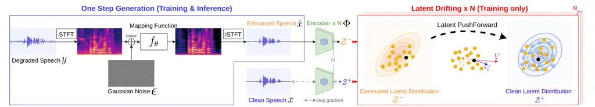
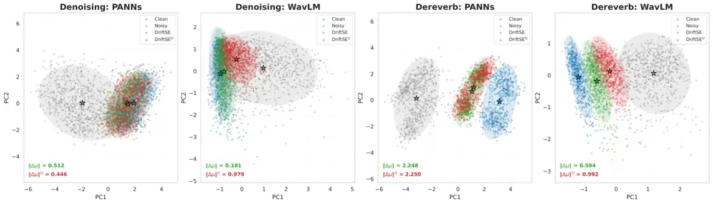

SGM  
score-based generative model

SNR  
signal-to-noise ratio

STFT  
short-time Fourier transform

PR  
phase retrieval

iSTFT  
inverse short-time Fourier transform

SDE  
stochastic differential equation

ODE  
ordinary differential equation

PESQ  
Perceptual Evaluation of Speech Quality

SE  
speech enhancement

T-F  
time-frequency

RIR  
room impulse response

SNR  
signal-to-noise ratio

BWE  
bandwidth extension

LSTM  
long short-term memory

POLQA  
Perceptual Objective Listening Quality Analysis

SDR  
signal-to-distortion ratio

LSD  
log-spectral distance

SI-SDR  
scale invariant signal-to-distortion ratio

ESTOI  
Extended Short-Term Objective Intelligibility

DRR  
direct-to-reverberant ratio

NFE  
number of function evaluations

RTF  
real-time factor

MOS  
mean opinion scores

EMA  
exponential moving average

ViSQOL  
Virtual Speech Quality Objective Listener

RK  
Runge-Kutta

SVD  
singular value decomposition

DNN  
deep neural network

MSE  
mean squared error

SE  
speech enhancement

BWE  
bandwidth extension

FM  
flow matching

CFM  
conditional flow matching

JFM  
joint flow matching

WER  
word error rate

FLOP  
floating-point operation

API  
application programming interface

VB-DMD  
VoiceBank-DEMAND

EWv2  
EARS-WHAM v2

LRK  
Learned Runge-Kutta

DB  
Diffusion Buffer

SFM  
Stream.FM

# DriftSE: Speech Enhancement with Generative DriftingThanks: Liang Xu and W. Bastiaan Kleijn are with Victoria University of Wellington, New Zealand (e-mail: {liang.xu,bastiaan.kleijn}@vuw.ac.nz). Diego Caviedes-Nozal and Rasmus Kongsgaard Olsson are with GN Advanced Science, Denmark (e-mail: {dcnozal,rkolsson}@gn.com). Longfei Felix Yan is with Lincoln University (e-mail: felix.yan@lincoln.ac.nz).

Liang
Xu [](https://orcid.org/0009-0008-8302-437X)
   Diego
Caviedes-Nozal [](https://orcid.org/0000-0001-6756-3375)
   W. Bastiaan
Kleijn [](https://orcid.org/0000-0002-1973-3920)
Affiliation: Longfei Felix
Yan [](https://orcid.org/0000-0003-4273-198X), ,
and Rasmus Kongsgaard Olsson

###### Abstract

We propose DriftSE, a novel one-step generative framework for speech
enhancement formulated as a latent distribution equilibrium problem.
During training, the drifting field aligns the generator’s pushforward
distribution with the clean speech manifold through drifting in a latent
domain. During inference, the drifting process is discarded, enabling
one-step generation. We establish that its enhancement quality depends
fundamentally on the choice of latent representation. Semantic latents
preserve phonetic structure but fail to capture physical acoustic cues,
whereas acoustic latents reconstruct the physical signal but risk
linguistic hallucination. Therefore, we introduce dual-latent drifting,
performing parallel drifting in both semantic and acoustic latents to
simultaneously preserve phonetic intelligibility and acoustic fidelity.
Additionally, we demonstrate that DriftSE enables fully unpaired
training by aligning latent distributions rather than exact point-wise
targets. Consequently, DriftSE facilitates cross-dataset learning in the
absence of paired noisy-clean samples. Moreover, DriftSE exhibits broad
architectural flexibility across different generator backbones.
Extensive evaluations on additive denoising and convolutive
dereverberation demonstrate robust one-step enhancement across both
offline and real-time causal settings. Notably, DriftSE achieves
state-of-the-art word error rates across all four evaluated datasets
while strictly operating at 1 NFE. Code and audio examples are available
online¹¹ 1
[https://github.com/LiangXu123/DriftSE](https://github.com/LiangXu123/DriftSE).

###### Index Terms: 

speech enhancement, speech dereverberation, generative models, drifting
models

## I Introduction

Speech enhancement (SE) aims to recover clean and intelligible speech
while preserving talker identity across a wide range of acoustic
degradations. The design of practical SE systems is largely determined
by the latency requirements of the target application, leading to
offline \[1, 2\] and streaming \[3, 4\] paradigms. Offline frameworks
leverage the complete audio signal to maximize restoration fidelity.
Conversely, streaming models rely on causal processing to enable
real-time interaction.

Over the past few decades, speech enhancement has progressed from
classical statistical methods, such as Wiener filtering \[5\], to modern
neural-network-based techniques \[6\]. Discriminative approaches \[7, 8,
9, 10\] can effectively suppress additive noise, but their
regression-based objectives often lead to perceptually unnatural
artifacts and overly smooth spectrogram patterns that lack the fine
details of natural speech. To overcome this, generative models \[11, 2,
3, 12\] were introduced. Early approaches utilized GANs \[11\] to
synthesize realistic speech but often suffered from training
instabilities and mode collapse. More recently, Score-based Generative
Models (SGMs) \[13, 2\] have established a new state-of-the-art by
learning the data distribution of clean speech. SGMs \[2\] define a
forward process that gradually corrupts speech with Stochastic
Differential Equations and a reverse-time process that reconstructs
clean speech along a continuous sampling trajectory. While this
framework excels at both additive denoising and dereverberation,
inference is inherently iterative. Numerically integrating this highly
curved reverse trajectory requires a high number of function evaluations
(NFEs, typically 10–100), causing prohibitive latency for real-time SE.

Efforts to accelerate generation generally fall into either cascaded
frameworks or distillation-based methods. Cascaded approaches \[3, 14\]
introduce a predictive method to initialize the generation, reducing the
second-stage generation process to as few as four inference steps.
Alternatively, distillation-based approaches, such as Consistency
Models \[15, 16, 17\], and trajectory linearization techniques like Flow
Matching \[18, 19, 12\], attempt to compress or straighten the
generative path itself. Nevertheless, these approaches remain
constrained by continuous trajectory modeling, motivating
trajectory-free paradigms that natively enable 1-NFE generation.

Recently, Drifting Models \[20\] emerged as a powerful paradigm that
avoids explicit trajectory tracking by formulating generation as a
distribution equilibrium problem. Building on this, DriftSE \[21\]
applied drifting models to speech enhancement through a frame-wise
drifting field defined in a single semantic latent space, which steers
the generator’s pushforward distribution toward the clean distribution
during training. By discarding the drifting field at inference, DriftSE
enables native 1-NFE enhancement for offline additive denoising.

In this work, we extend DriftSE beyond single-latent offline denoising
to address both additive noise and convolutive reverberation. We make
three primary contributions. First, we introduce dual-latent drifting,
demonstrating that combining semantic and acoustic representations
preserves both phonetic intelligibility and acoustic fidelity. Second,
we explore the potential of fully unpaired training with frame-wise
latent drifting. Through cross-dataset training, we successfully recover
acoustic structure in the absence of paired noisy-clean data. Third, we
verify architectural flexibility by training with different generator
backbones. Extensive evaluations show that DriftSE generalizes across
different backbones, achieving robust one-step speech enhancement in
both offline and real-time causal configurations. Notably, with all
drifting computations confined to training, DriftSE operates strictly at
1 NFE while delivering new state-of-the-art word error rates (WERs)
across all four evaluated datasets under both causal and non-causal
backbones.

## II Background

Drifting Models \[20\] cast generative modeling as a dynamic equilibrium
process that steers a pushforward distribution toward the target data
distribution. This evolution has been formalized as a continuous
Wasserstein gradient flow \[22, 23\], with its underlying mechanics
compared against established generative \[24, 25\] paradigms.

### II-A Pushforward Distribution

Generative modeling can be formulated as learning a mapping
$`f_{\theta}`$ that transports a source distribution $`p_{\epsilon}`$
(e.g., standard Gaussian noise) to a target data distribution
$`p_{\text{data}}`$. Given a sample $`\epsilon\sim p_{\epsilon}`$, the
generator produces an observation $`\mathbf{x}=f_{\theta}(\epsilon)`$,
and this mapping induces a pushforward distribution defined by

```math
q_{\theta}:=(f_{\theta})_{\#}p_{\epsilon}. \tag{1}
```

The objective of generative modeling is to optimize the parameters
$`\theta`$ such that $`q_{\theta}`$ converges to $`p_{\text{data}}`$.
For simplicity, we write $`q_{\theta}`$ as $`q`$ and $`p_{\text{data}}`$
as $`p`$ in subsequent sections.

In speech enhancement, noisy speech serves as the source distribution,
while the mapping network transports the generated speech distribution
toward the clean speech distribution.

### II-B Wasserstein Gradient Flow

Generative drifting frames the transport of the generated distribution
toward the target data distribution as a continuous evolution of
probability mass. Let $`q_{t}`$ denote the pushforward distribution at
continuous time $`t\geq 0`$. In the 2-Wasserstein space
$`\mathcal{P}_{2}(\mathbb{R}^{d})`$, this evolution follows the steepest
descent of the smoothed Kullback-Leibler (KL) energy functional \[22\]:

```math
F_{\sigma}[q]:=\sigma^{2}D_{\mathrm{KL}}(q_{\sigma}\,\|\,p_{\sigma}), \tag{2}
```

where $`q_{\sigma}`$ and $`p_{\sigma}`$ denote the model and target
distributions smoothed by a Gaussian kernel with bandwidth $`\sigma`$ to
prevent infinite KL divergence across disjoint supports. The continuous
transport is governed by the optimal transport velocity field
$`\mathbf{v}_{\sigma}[q_{t}]=-\nabla_{W_{2}}F_{\sigma}[q_{t}]`$, where
$`\nabla_{W_{2}}`$ is the Wasserstein gradient of $`F_{\sigma}`$.

To simulate this continuous evolution over discrete time steps, the JKO
scheme \[26, 27, 28\] provides the rigorous variational discretization,
yielding an implicit update

```math
q_{k+1}^{h}\in\arg\min_{q\in\mathcal{P}_{2}(\mathbb{R}^{d})}\left\{F_{\sigma}[q]+\frac{1}{2h}W_{2}^{2}(q,q_{k}^{h})\right\}, \tag{3}
```

where $`q_{k}^{h}`$ is the discrete distribution at step $`k`$, and
$`h`$ represents the step size. This implicit optimization evaluates the
transport velocity at the unknown future state $`q_{k+1}^{h}`$, making
it computationally intractable.

### II-C Generative Drifting

Generative drifting bypasses the intractable JKO limitation with a
tractable explicit Euler approximation. Freezing the transport velocity
at the current state $`q_{k}^{h}`$ yields the direct pushforward update
formulated as

```math
\tilde{q}_{k+1}^{h}=\bigl(I+h\,\mathbf{v}_{\sigma}[q_{k}^{h}]\bigr)_{\#}q_{k}^{h}, \tag{4}
```

where $`I`$ is the identity map and $`\tilde{q}_{k+1}^{h}`$ denotes the
approximate successor distribution obtained by shifting the mass of
$`q_{k}^{h}`$ by a step size $`h`$ along the frozen velocity
$`\mathbf{v}_{\sigma}[q_{k}^{h}]`$.

Drifting Models \[20\] realize the update by training the generator to
move each generated sample toward its corresponding transport target in
a latent space. Let
$`\mathbf{z}_{k}=\Phi\!\left(f_{\theta_{k}}(\epsilon)\right)`$ denote
the latent representation of the generated observation under a
pretrained encoder $`\Phi(\cdot)`$. The corresponding latent update is

```math
\mathbf{z}_{k+1}=\mathbf{z}_{k}+h\,\mathbf{v}_{\sigma}[q_{k}^{h}](\mathbf{z}_{k}), \tag{5}
```

transporting $`\mathbf{z}_{k}`$ along the velocity field evaluated at
$`q_{k}^{h}`$. To make this computable, drifting models introduce an
empirical drifting field $`\widehat{\mathbf{v}}(\mathbf{z}_{k})`$
computed over sample mini-batches (as defined in Section II-D),
optimizing the generator parameters $`\theta`$ such that the output
$`\Phi(f_{\theta}(\epsilon))`$ matches the drifted target:

```math
\mathcal{L}_{\mathrm{drift}}(\theta)=\mathbb{E}_{\epsilon\sim p_{\epsilon}}\left[\left\|\Phi(f_{\theta}(\epsilon))-\mathop{\mathrm{sg}}\nolimits\!\left(\mathbf{z}_{k}+h\,\widehat{\mathbf{v}}(\mathbf{z}_{k})\right)\right\|_{2}^{2}\right], \tag{6}
```

where $`\mathop{\mathrm{sg}}\nolimits(\cdot)`$ denotes the stop-gradient
operator. In practice, the empirical field absorbs the step size, so
$`h=1`$.

### II-D The Empirical Drifting Field

The drifting objective in  (6) requires an empirical estimator
$`\widehat{\mathbf{v}}`$ that defines a meaningful transport direction
and vanishes at equilibrium. To reflect its explicit dependence on the
target distribution $`p`$ and the model’s pushforward distribution
$`q`$, this field is denoted as
$`\widehat{\mathbf{v}}(\mathbf{z})=\mathbf{V}_{p,q}(\mathbf{z})`$.
Specifically, a valid drifting field must satisfy the equilibrium
condition:

```math
p=q\quad\Longrightarrow\quad\mathbf{V}_{p,q}(\mathbf{z})=\mathbf{0},\qquad\forall\mathbf{z}. \tag{7}
```

This condition is elegantly satisfied by constructing an antisymmetric
field (i.e., $`\mathbf{V}_{p,q}=-\mathbf{V}_{q,p}`$). Inspired by mean
shift theory \[29\], Drifting Models introduce

```math
\mathbf{V}_{p,q}(\mathbf{z})=\mathbf{V}_{p}^{+}(\mathbf{z})-\mathbf{V}_{q}^{-}(\mathbf{z}), \tag{8}
```

where $`\mathbf{V}_{p}^{+}`$ serves as the attractive force pulling
$`\mathbf{z}`$ toward high-density data regions of $`p`$, and
$`\mathbf{V}_{q}^{-}`$ serves as the repulsive force pushing it away
from model-clustered regions of $`q`$.

Evaluating forces $`\mathbf{V}_{p}^{+}`$ and $`\mathbf{V}_{q}^{-}`$ in
raw waveform space is problematic as Euclidean distance can be dominated
by signal energy. It may therefore poorly reflect linguistic or acoustic
similarity. To enable meaningful structural transport, the drifting
field is instead evaluated within a latent space. Let
$`\mathbf{z}\in\mathbb{R}^{d}`$ denote an arbitrary query point in the
latent space. Furthermore, let $`\mathbf{z}^{+}=\Phi(\mathbf{y}^{+})`$
denote the latent representation of a target data sample
$`\mathbf{y}^{+}\sim p`$, and $`\mathbf{z}^{-}=\Phi(\mathbf{y}^{-})`$
denote that of a generated model sample $`\mathbf{y}^{-}\sim q`$. Both
drifting forces act as kernel-weighted mean shift operators \[29\],
drifting $`\mathbf{z}`$ toward the local center of mass in latent space:

```math
\displaystyle\mathbf{V}_{p}^{+}(\mathbf{z}) \displaystyle=\frac{1}{Z_{p}(\mathbf{z})}\mathbb{E}_{\mathbf{y}^{+}\sim p}\left[k_{\tau}(\mathbf{z},\mathbf{z}^{+})(\mathbf{z}^{+}-\mathbf{z})\right], \tag{9}
```

```math
\displaystyle\mathbf{V}_{q}^{-}(\mathbf{z}) \displaystyle=\frac{1}{Z_{q}(\mathbf{z})}\mathbb{E}_{\mathbf{y}^{-}\sim q}\left[k_{\tau}(\mathbf{z},\mathbf{z}^{-})(\mathbf{z}^{-}-\mathbf{z})\right], \tag{10}
```

with local normalizers preventing the drift field from vanishing in
low-density regions:

```math
\displaystyle Z_{p}(\mathbf{z}) \displaystyle=\mathbb{E}_{\mathbf{y}^{+}\sim p}\left[k_{\tau}(\mathbf{z},\mathbf{z}^{+})\right], \tag{11}
```

```math
\displaystyle Z_{q}(\mathbf{z}) \displaystyle=\mathbb{E}_{\mathbf{y}^{-}\sim q}\left[k_{\tau}(\mathbf{z},\mathbf{z}^{-})\right]. \tag{12}
```

Following \[20\], local affinity is measured by the multiscale
exponential kernel

```math
k_{\tau}(\mathbf{z},\mathbf{z}^{\prime})=\exp\left(-\frac{\left\|\mathbf{z}-\mathbf{z}^{\prime}\right\|_{2}}{\tau}\right), \tag{13}
```

with temperature $`\tau`$. Combining the attractive and repulsive terms
yields the unified field:

```math
\resizebox{22609920}{}{$\displaystyle\mathbf{V}_{p,q}(\mathbf{z})=\frac{1}{Z_{p}(\mathbf{z})Z_{q}(\mathbf{z})}\mathbb{E}_{\mathbf{y}^{+}\sim p,\,\mathbf{y}^{-}\sim q}\left[k_{\tau}(\mathbf{z},\mathbf{z}^{+})k_{\tau}(\mathbf{z},\mathbf{z}^{-})(\mathbf{z}^{+}-\mathbf{z}^{-})\right]$}. \tag{14}
```

### II-E Drifting as Score Matching

In score-based generative modeling \[24, 30\], the score function
$`\nabla_{\mathbf{z}}\log p(\mathbf{z})`$ defines a vector field that
points in the direction of increasing probability density. Therefore,
the score difference between the target data distribution and the model
distribution provides an instantaneous corrective velocity that guides
generated samples toward higher density regions. When replacing the
kernel in (13) with a Gaussian kernel of bandwidth $`\sigma`$, the drift
operator admits a closed-form identity that recovers this scaled score
difference \[22\]:

```math
\mathbf{V}_{p,q}^{(\sigma)}(\mathbf{z})=\sigma^{2}\nabla_{\mathbf{z}}\log p_{\sigma}(\mathbf{z})-\sigma^{2}\nabla_{\mathbf{z}}\log q_{\sigma}(\mathbf{z})=\mathbf{v}_{\sigma}[q](\mathbf{z}). \tag{15}
```

This mathematical identity shows that the drifting field aligns with an
instantaneous score-based corrective direction on smoothed densities.

The score matching interpretation conceptually mirrors Distribution
Matching Distillation (DMD) \[25\], which also steers generation by
evaluating a score difference. However, DMD parameterizes this with a
fake score network and a pretrained diffusion teacher:

```math
\mathbf{V}_{\text{DMD}}(\mathbf{z})=\mathbb{E}_{t,\epsilon}\left[\omega(t)\left(s_{\text{teacher}}(\mathbf{z}_{t},t)-s_{\text{fake}}(\mathbf{z}_{t},t)\right)\right]. \tag{16}
```

In contrast, generative drifting eliminates the reliance on
time-conditioned diffusion teachers by estimating the score difference
directly from clean data and model samples in the latent space.

## III Method

We propose DriftSE, a generative framework that formulates speech
enhancement as a latent distribution equilibrium problem, extending our
previous work \[21\]. An overview is illustrated in Fig. 1.



Fig. 1: Overview of the DriftSE framework, illustrating its
architectural and training flexibility. One-step generation is performed
by the mapping network $`f_{\theta}`$ in a single forward pass by
concatenating the degraded speech $`\mathbf{y}`$ with a fresh Gaussian
noise $`\bm{\epsilon}`$. During training, the generated speech
$`\hat{\mathbf{x}}`$ and clean speech $`\mathbf{x}`$ are projected
through $`N`$ encoders (typically $`N=2`$) into their respective latent
spaces to facilitate latent drifting. Within each latent space, an
empirical drifting field $`\mathbf{V}`$ drives the generated
distribution $`\mathcal{Z}^{-}`$ toward the clean distribution
$`\mathcal{Z}^{+}`$. During inference, the encoders and drifting fields
are discarded, yielding strictly 1-NFE generation. Crucially, DriftSE
natively supports multi-latent drifting and unpaired training.

### III-A One-Step Generation

Let $`\mathbf{y}`$ and $`\hat{\mathbf{x}}`$ denote the degraded input
and enhanced output waveforms, respectively. Following \[9, 2, 3\], the
mapping network $`f_{\theta}`$ operates in the complex Short-Time
Fourier Transform (STFT) domain to jointly model magnitude and phase.
Let $`\mathcal{S}(\cdot)`$ and $`\mathcal{S}^{-1}(\cdot)`$ denote the
STFT and inverse STFT operations. The generation process is formulated
as

```math
\hat{\mathbf{x}}=\mathcal{S}^{-1}\Big(f_{\theta}\big([\gamma\bm{\epsilon};\mathcal{S}(\mathbf{y})]\big)\Big),\qquad\bm{\epsilon}\sim\mathcal{N}(\mathbf{0},\mathbf{I}), \tag{17}
```

where $`\bm{\epsilon}`$ is a fresh Gaussian noise sample scaled by a
noise level $`\gamma`$, and $`[\cdot;\cdot]`$ denotes channel-wise
concatenation. The mapping network $`f_{\theta}`$ therefore receives the
scaled noise and degraded complex spectrum as a single input tensor and
generates the enhanced complex spectrum in one forward pass.

### III-B Generative Latent Drifting

To optimize $`f_{\theta}`$, the drifting field must provide perceptually
and acoustically meaningful transport directions. As established in
Section II, evaluating this field directly in raw waveform or STFT
domains is ill-defined. We therefore perform distribution alignment
entirely within latent spaces, where local neighborhoods capture the
underlying speech structure.

#### III-B1 Latent Representations

To ensure the generated speech is both linguistically intact and
physically natural, DriftSE natively aligns distributions across $`N`$
parallel latent spaces to capture complementary speech properties. We
examine semantic latents \[31, 32, 33\] for phonetic integrity and
acoustic latents \[34, 35\] for physical environmental cues. To benefit
from both domains, we propose dual-latent drifting to align the two
spaces in parallel, and additionally benchmark against joint
semantic-acoustic latents \[36\].

Let $`\Phi_{n}(\cdot)`$ denote the $`n`$-th pretrained encoder, where
$`n\in\{1,\dots,N\}`$. For an enhanced waveform $`\hat{\mathbf{x}}`$ and
a clean reference $`\mathbf{x}`$, the encoder extracts sequences of
$`M_{n}`$ frame-level features formulated as

```math
\mathbf{z}^{-}_{n}=\Phi_{n}(\hat{\mathbf{x}}),\qquad\mathbf{z}^{+}_{n}=\Phi_{n}(\mathbf{x}). \tag{18}
```

Let $`\mathbf{z}^{-}_{n,b,m}`$ and $`\mathbf{z}^{+}_{n,b,m}`$ denote the
$`m`$-th frame of the $`b`$-th utterance. Aggregating across a
mini-batch of size $`B`$, we pool all $`B\times M_{n}`$ frames to
construct the global generated and clean latent sets
$`\mathcal{Z}^{-}_{n}`$ and $`\mathcal{Z}^{+}_{n}`$. These sets serve as
the discrete empirical distributions $`q_{n}`$ and $`p_{n}`$ required to
compute the latent drifting field.

#### III-B2 Empirical Latent Drifting

For each latent space, DriftSE computes an empirical estimator of the
theoretical drifting field in (14) by replacing the expectations with
sample averages over the pooled mini-batch frames:

```math
\displaystyle\mathbf{V}_{n}(\mathbf{z})=\frac{1}{Z_{p,n}(\mathbf{z})Z_{q,n}(\mathbf{z})}\sum_{\mathbf{z}^{+}\in\mathcal{Z}^{+}_{n}}\sum_{\mathbf{z}^{-}\in\mathcal{Z}^{-}_{n}}k_{\tau}(\mathbf{z},\mathbf{z}^{+})k_{\tau}(\mathbf{z},\mathbf{z}^{-})(\mathbf{z}^{+}-\mathbf{z}^{-}) \tag{19}
```

where $`Z_{p,n}(\mathbf{z})`$ and $`Z_{q,n}(\mathbf{z})`$ are the
empirical normalizers over $`\mathcal{Z}^{+}_{n}`$ and
$`\mathcal{Z}^{-}_{n}`$. This kernel-weighted mean-shift force
explicitly repels the query frame from the empirical frame-wise density
of the current model outputs $`\mathcal{Z}^{-}_{n}`$ and attracts it
toward high-density regions of the clean manifold
$`\mathcal{Z}^{+}_{n}`$.

Instantiating the general latent update in (5) at the frame level, we
set the query point to each generated frame,
$`\mathbf{z}_{n,b,m}=\mathbf{z}^{-}_{n,b,m}\in\mathcal{Z}^{-}_{n}`$. The
corresponding drifted target is given by

```math
\tilde{\mathbf{z}}_{n,b,m}=\mathbf{z}_{n,b,m}+\mathbf{V}_{n}(\mathbf{z}_{n,b,m}), \tag{20}
```

where the empirical velocity field $`\mathbf{V}_{n}(\cdot)`$ absorbs the
step size $`h`$. The training objective minimizes the discrepancy
between each generated frame and its drifted target, averaged across all
pooled frames and balanced by a latent weight $`\lambda_{n}`$:

```math
\mathcal{L}_{\mathrm{drift}}=\sum_{n=1}^{N}\frac{\lambda_{n}}{BM_{n}}\sum_{b=1}^{B}\sum_{m=1}^{M_{n}}\left\|\mathbf{z}_{n,b,m}-\mathop{\mathrm{sg}}\nolimits\!\left(\tilde{\mathbf{z}}_{n,b,m}\right)\right\|_{2}^{2}, \tag{21}
```

where $`M_{n}`$ denotes the number of latent frames extracted by encoder
$`\Phi_{n}`$ from each utterance. For $`N=1`$, this objective reduces to
single-latent drifting \[21\]. For $`N>1`$, it generalizes to
multi-latent drifting, aligning distributions across different latents.
In this work, we specifically employ dual-latent drifting to
simultaneously match distributions within semantic and acoustic spaces.
Although in practice the drifting loss is calculated across multiple
layers and temperatures, for clarity the training procedure is
summarized in Algorithm 1 for the single-layer, single-temperature case.

1: Input: Clean dataset $`\mathcal{D}_{x}`$, degraded
$`\mathcal{D}_{y}`$, STFT $`S(\cdot)`$, iSTFT $`S^{-1}(\cdot)`$, mapping
network $`f_{\theta}`$, $`N`$ encoders $`\{\Phi_{n}\}_{n=1}^{N}`$,
weights $`\{\lambda_{n}\}_{n=1}^{N}`$, temperature $`\tau`$, scale prior
$`p_{\gamma}`$

2: Output: Enhanced speech $`\hat{x}_{\mathrm{test}}`$

3: // Training Phase

4: repeat

5:   // 1. Data Sampling and Generation

6:   Sample batches $`x\sim\mathcal{D}_{x}`$ and
$`y\sim\mathcal{D}_{y}`$

7:   Sample noise $`\epsilon\sim\mathcal{N}(0,I)`$ and noise level
$`\gamma\sim p_{\gamma}`$

8:   Generate batch
$`\hat{x}\leftarrow S^{-1}\big(f_{\theta}([\gamma\epsilon;S(y)])\big)`$

9:   // 2. Latent Extraction and Drifting

10:   $`\mathcal{L}_{\mathrm{drift}}\leftarrow 0`$

11:   for $`n=1,\dots,N`$ do

12:    $`\{z^{+}_{n,b,m}\}\leftarrow\Phi_{n}(x)`$ and
$`\{z^{-}_{n,b,m}\}\leftarrow\Phi_{n}(\hat{x})`$

13:    Pool $`B\times M_{n}`$ frames into
$`\mathcal{Z}^{+},\mathcal{Z}^{-}\in\mathbb{R}^{BM_{n}\times d_{n}}`$

14:    $`\mathcal{Z}\leftarrow\mathcal{Z}^{-}`$ $`\triangleright`$
Current distribution

15:
   $`V_{n}\leftarrow\mathrm{Compute\_V}(\mathcal{Z},\mathcal{Z}^{+},\mathcal{Z}^{-},\tau)`$
$`\triangleright`$ See (19)

16:    Drift target $`\tilde{\mathcal{Z}}\leftarrow\mathcal{Z}+V_{n}`$

17:
   $`\mathcal{L}_{\mathrm{drift}}\leftarrow\mathcal{L}_{\mathrm{drift}}+\frac{\lambda_{n}}{BM_{n}}\big\|\mathcal{Z}-\mathrm{sg}(\tilde{\mathcal{Z}})\big\|_{F}^{2}`$

18:   end for

19:   // 3. Optimization (learning rate $`\alpha`$)

20:   Update
$`\theta\leftarrow\theta-\alpha\nabla_{\theta}\mathcal{L}_{\mathrm{drift}}`$

21: until convergence

22: // Inference Phase

23: for each test batch
$`y_{\mathrm{test}}\sim\mathcal{D}_{\mathrm{test}}`$ do

24:   Sample noise $`\epsilon\sim\mathcal{N}(0,I)`$ and set fixed
$`\gamma_{\mathrm{inf}}`$

25:   Generate
$`\hat{x}_{\mathrm{test}}\leftarrow S^{-1}\big(f_{\theta}([\gamma_{\mathrm{inf}}\epsilon;S(y_{\mathrm{test}})])\big)`$

26: end for

Algorithm 1 DriftSE Training and Inference

### III-C Unpaired Training

DriftSE natively supports fully unpaired training. The empirical
drifting field $`\mathbf{V}_{n}`$ in (19) is computed over batch-wise
latent sets $`\mathcal{Z}^{-}_{n}`$ and $`\mathcal{Z}^{+}_{n}`$ without
requiring time-aligned utterance pairs $`(\mathbf{y},\mathbf{x})`$.
Because evaluating kernel similarities across pooled frames requires no
index-level or temporal correspondence, degraded inputs
$`\mathbf{y}\sim\mathcal{D}_{y}`$ and clean targets
$`\mathbf{x}\sim\mathcal{D}_{x}`$ can be drawn independently from
different speech datasets during training.

## IV Experiments

### IV-A Latent Representations

DriftSE can incorporate arbitrary pretrained encoders to construct the
parallel latent spaces $`\mathcal{Z}_{n}`$. Based on their pretraining
objectives, we categorize the evaluated encoders into _semantic_,
_acoustic_, and _joint_ representations (Table I).

##### Semantic latents

Semantic latents are trained on human speech to capture meaning-bearing
units like phonemes and high-level structure. By prioritizing phonetic
integrity, they reduce sensitivity to local acoustic variations.
HuBERT \[32\] predicts masked cluster IDs obtained from MFCC
features \[37\], then iteratively refines these targets using
representations from a preceding model. DistilHuBERT \[33\] inherits
this semantic geometry with multilayer knowledge distillation from a
HuBERT teacher. WavLM \[31\] extends the objective by predicting the
cluster IDs of a clean utterance from inputs mixed with noise or
overlapping speech. While we use semantic and linguistic interchangeably
throughout this work, the distinction between structural speech
representations and lexical semantic meaning is discussed in \[38\].

##### Acoustic latents

The acoustic latents employed in this work are trained on general audio
targets rather than speech-specific units. Consequently, they emphasize
broad environmental patterns without imposing a phonetic organization.
PANNs \[35\] is trained through weakly supervised multilabel audio
tagging, which requires its representations to identify discrete sound
events. BEATs \[34\] predicts masked self distilled token IDs from
general audio. This objective encourages the network to capture stable
acoustic identities.

##### Joint latent

Joint latent representations explicitly combine phonetic structure with
fine acoustic detail. WavCube \[36\] first compresses WavLM \[31\]
features into a semantic bottleneck, then injects acoustic detail
through end-to-end fine-tuning.

|                     |          |                                                            |                    |            |                         |
| ------------------- | -------- | ---------------------------------------------------------- | ------------------ | ---------- | ----------------------- |
| Encoder             | Type     | Pretraining Objective                                      | Drifting Layers    | Dim.       | Temperatures ($`\tau`$) |
| HuBERT \[32\]       | Semantic | Masked prediction of intermediate latent cluster IDs       | $`\{6,12,24\}`$    | 1024       | $`\{0.005,0.01\}`$      |
| DistilHuBERT \[33\] | Semantic | Knowledge distillation from HuBERT                         | $`\{0,1,2\}`$      | 768        | $`\{0.02,0.05,0.1\}`$   |
| WavLM \[31\]        | Semantic | Masked prediction of clean pseudo-labels from noisy speech | $`\{6,12,24\}`$    | 1024       | $`\{0.005,0.01\}`$      |
| PANNs \[35\]        | Acoustic | Weakly-supervised multi-label audio tagging                | Blocks $`\{5,6\}`$ | 1024, 2048 | $`\{0.005,0.01\}`$      |
| BEATs \[34\]        | Acoustic | Masked prediction of self-distilled token IDs from audio   | $`\{6,12\}`$       | 768        | $`\{0.005,0.01\}`$      |
| WavCube Pro \[36\]  | Joint    | WavLM semantic compression + acoustic injection            | Final layer        | 128        | $`\{0.02,0.05,0.1\}`$   |

TABLE I: Pretrained encoders, pretraining objectives, and
hyperparameters². Each model extracts frame features from the drifting
layers to construct the empirical latent distributions. All extracted
layers are weighted equally.

²²footnotetext: Official checkpoints: HuBERT
([https://huggingface.co/facebook/hubert-large-ll60k](https://huggingface.co/facebook/hubert-large-ll60k)),
DistilHuBERT
([https://huggingface.co/ntu-spml/distilhubert](https://huggingface.co/ntu-spml/distilhubert)),
WavLM
([https://huggingface.co/microsoft/wavlm-large](https://huggingface.co/microsoft/wavlm-large)),
PANNs
([https://github.com/qiuqiangkong/audioset_tagging_cnn](https://github.com/qiuqiangkong/audioset_tagging_cnn)),
BEATs
([https://github.com/microsoft/unilm/tree/master/beats](https://github.com/microsoft/unilm/tree/master/beats)),
and WavCube Pro
([https://huggingface.co/yhaha/WavCube/tree/main/WavCube-pro](https://huggingface.co/yhaha/WavCube/tree/main/WavCube-pro)).

### IV-B Datasets

We evaluate DriftSE across four standard benchmarks spanning two primary
tasks: speech denoising and dereverberation. Throughout our experiments,
all speech signals are downsampled to 16 kHz.

##### Speech Denoising

The EARS-WHAM dataset mixed clean speech from the EARS \[39\] with
non-stationary noise from the WHAM! \[40\] at SNRs computed from
K-weighted loudness levels uniformly sampled from $`[-2.5,17.5]`$ dB.

VoiceBank-DEMAND (VB-DMD): The training set comprises clean
utterances \[41\] mixed with eight real-world noises from the DEMAND
database \[42\] and two synthetic noises (babble and speech-shaped) at
SNRs of 0, 5, 10, and 15 dB. The test set is generated using unseen
noise types at SNRs of 2.5, 7.5, 12.5, and 17.5 dB. We hold out speakers
p226 and p287 from the training data to serve as a validation set as
used in \[2\].

##### Speech Dereverberation

The EARS-Reverb dataset \[39\] is simulated using 2,313 RIRs with
diverse characteristics sourced from seven datasets ($`RT_{60}\leq 2`$
s).

WSJ0-REVERB: Following \[2\], clean WSJ0 utterances \[43\] are convolved
with simulated room impulse responses (RIRs) \[44\]
($`T_{60}\in[0.4,1.0]`$ s), yielding an average direct-to-reverberant
ratio of $`\approx-9`$ dB. Anechoic targets are synthesized using
matched room geometries with near-total absorption.

##### Unpaired Clean Corpus

To validate the unpaired training capability described in Section III-C,
we employ the training set from the Deep Noise Suppression Challenge
2020 (DNS2020) \[45\] as a completely mismatched clean corpus. DNS2020
comprises 500 hours of clean speech from 2,150 speakers, sourced from
the LibriVox \[46\] audiobook corpus. When conducting unpaired
experiments, noisy utterances $`\mathbf{y}`$ are drawn from the training
sets of VB-DMD or WSJ0-REVERB, while the clean targets $`\mathbf{x}`$
are drawn from DNS2020.

### IV-C Evaluation Metrics

To comprehensively assess enhancement quality, we employ both intrusive
(reference-based) and non-intrusive (reference-free) metrics. Our
intrusive evaluation captures downstream linguistic preservation (WER),
perceptual quality (PESQ), time-domain signal fidelity (SI-SDR), and
speech intelligibility (ESTOI). To evaluate without clean references, we
further report a suite of non-intrusive perceptual predictors (DiMOS,
WVMOS, NISQA, and SCOREQ). Finally, beyond acoustic quality, we report
the computational efficiency through strict system-level profiling.

##### Intrusive Metrics

Intrusive metrics require a time-aligned clean reference to evaluate the
enhanced speech.

- •
  WER: Word Error Rate evaluates the preservation of downstream
  linguistic content. We compute WER using the QuartzNet15x5Base-En
  model \[47\] from the NVIDIA NeMo toolkit \[48\], utilizing
  transcripts derived from the clean reference audio as ground truth, as
  proposed in \[3\].
- •
  PESQ: Perceptual Evaluation of Speech Quality \[49\] evaluates overall
  speech quality, scaled within the range \[1, 4.5\].
- •
  SI-SDR: Scale-Invariant Signal-to-Distortion Ratio \[50\] quantifies
  time-domain waveform reconstruction fidelity while remaining robust to
  scaling mismatches.
- •
  ESTOI: Extended Short-Time Objective Intelligibility \[51\] evaluates
  human speech intelligibility, scaled within the range \[0, 1\].

##### Non-Intrusive Metrics

Non-intrusive metrics directly predict human perceptual quality on a
standard $`[1,5]`$ Mean Opinion Score (MOS) scale without requiring a
ground-truth reference. We employ these predictors to provide a holistic
assessment of the enhanced speech, bypassing the strict time-alignment
and phase-matching constraints of intrusive metrics like SI-SDR that
heavily penalize the natural structural variations produced by
generative models.

- •
  DiMOS: A distilled MOS predictor \[52\] that leverages scalable
  self-supervised representations for robust speech quality assessment.
- •
  WVMOS: A MOS predictor \[53\] built on fine-tuned wav2vec 2.0
  representations \[54\], shown to correlate strongly with subjective
  human quality ratings across diverse acoustic degradations.
- •
  NISQA: A deep learning model \[55\] utilizing CNNs and self-attention
  to predict overall mean opinion scores.
- •
  SCOREQ: A contrastive-regression-based quality predictor \[56\] that
  achieves exceptional domain generalization, ensuring accurate speech
  evaluation across diverse, unseen acoustic environments.

##### Computational Metrics

To evaluate the computational efficiency and real-time viability of
DriftSE, we report the following system-level profiles:

- •
  Model Parameters (Para): The total number of trainable network
  weights, reported in millions (M).
- •
  Number of Function Evaluations (NFE): The number of neural network
  forward passes required to generate the enhanced speech.
- •
  Multiply-Accumulate Operations (GMACs): The number of multiply-add
  operations required to process a 1-second audio segment, reported in
  billions (giga-MACs). For iterative models, this is calculated as the
  baseline GMACs per step multiplied by the NFE.

### IV-D Implementation Details

##### Backbone architectures

We instantiate $`f_{\theta}`$ by adapting three commonly used backbones
in SE to verify flexibility across causal and non-causal settings. For
offline evaluation, we employ the NCSN++ U-Net \[2\] and a non-causal
TF-GridNet \[57\]. To demonstrate compatibility with low-latency
requirements, we adapt causal backbones using the SFMUnet \[3\] and a
causal TF-GridNet with a 32 ms algorithmic delay.

Following \[2, 3\], we also employ channel-wise early fusion by
concatenating the real and imaginary components of the scaled Gaussian
noise $`\gamma\bm{\epsilon}`$ and the degraded STFT observation
$`\mathcal{S}(\mathbf{y})`$. The hierarchical U-Net architectures
(NCSN++ and SFMUnet) further re-inject downsampled inputs at each
resolution for progressive conditioning.

##### Training configuration

The mapping network operates in the complex STFT domain with a 512-point
FFT, a hop size of 256, and a Hann window. During training, the noise
level $`\gamma`$ is sampled from
$`\log\gamma\sim\mathcal{N}(-3.0,1.2^{2})`$, truncated at a maximum of
$`\gamma_{\text{max}}=0.15`$. At inference,
$`\gamma_{\mathrm{inf}}=0.05`$. All pretrained encoders remain strictly
frozen during training. To capture multiscale representations, features
extracted from multiple layers (Table I) are $`L_{2}`$-normalized prior
to drift computation and evaluated across multiple drifting
temperatures. All extracted layers and latent spaces are weighted
uniformly, with multi-latent weights set to $`\lambda_{n}=1.0`$.
Although the WavCube family releases both standard and Pro checkpoints,
we exclusively utilize the WavCube Pro checkpoint and denote it as
WavCube in all subsequent results for brevity. We randomly crop
utterances to 2 seconds during training, yielding $`M=100`$ frames per
clip for most encoders. Note that due to its architectural downsampling,
PANNs CNN14 yields $`M=6`$ frames for the same 2-second clip. All models
are optimized using AdamW at a learning rate of $`5\times 10^{-4}`$ and
trained for 100 epochs with a mini-batch size of $`B=8`$ on an NVIDIA
A6000 GPU.

## V Results and Discussion

|                                      |            |                    |            |                    |                    |      |        |       |                       |       |       |        |
| ------------------------------------ | ---------- | ------------------ | ---------- | ------------------ | ------------------ | ---- | ------ | ----- | --------------------- | ----- | ----- | ------ |
|                                      |            |                    | Complexity |                    | Intrusive Metrics  |      |        |       | Non-Intrusive Metrics |       |       |        |
| Model                                | Causal     | Latent             | Para       | GMACs              | WER $`\downarrow`$ | PESQ | SI-SDR | ESTOI | DiMOS                 | WVMOS | NISQA | SCOREQ |
| EARS-WHAM (speech denoising)         |            |                    |            |                    |                    |      |        |       |                       |       |       |        |
| Noisy                                | \-         | \-                 | \-         | \-                 | 32.80%             | 1.24 | 5.4    | 0.64  | 2.58                  | 1.20  | 1.95  | 2.13   |
| SGMSE+ \[2\]                         | $`\times`$ | \-                 | 65M        | 132.89$`\times`$60 | 18.65%             | 2.20 | 14.2   | 0.84  | 3.93                  | 2.86  | 3.66  | 3.48   |
| ROSE-CD \[16\]                       | $`\times`$ | \-                 | 59.62M     | 132.88$`\times`$1  | 18.19%             | 2.81 | 15.3   | 0.85  | 3.92                  | 2.60  | 3.61  | 3.50   |
| DM-IERM \[1\]                        | $`\times`$ | \-                 | 67M        | 129.7$`\times`$31  | \-                 | 2.67 | 17.4   | 0.74  | \-                    | \-    | \-    | \-     |
| FM-Euler4 \[3\]                      | $`\times`$ | \-                 | 73.7M      | 107.18$`\times`$5  | 18.40%             | 2.41 | 16.1   | 0.86  | 4.34                  | 2.82  | 4.50  | \-     |
| DriftSE (NCSN++)                     | $`\times`$ | PANNs              | 59.62M     | 132.88$`\times`$1  | 24.34%             | 2.09 | 0.8    | 0.79  | 3.23                  | 2.34  | 3.12  | 2.72   |
| DriftSE (NCSN++)                     | $`\times`$ | DistilHuBERT       | 59.62M     | 132.88$`\times`$1  | 15.19%             | 2.39 | 12.1   | 0.84  | 4.22                  | 3.07  | 4.07  | 3.82   |
| DriftSE (NCSN++)                     | $`\times`$ | DistilHuBERT+PANNs | 59.62M     | 132.88$`\times`$1  | 14.33%             | 2.46 | 13.5   | 0.85  | 4.11                  | 3.13  | 3.96  | 3.85   |
| DriftSE (NCSN++)                     | $`\times`$ | WavCube            | 59.62M     | 132.88$`\times`$1  | 15.35%             | 2.42 | 12.0   | 0.84  | 4.25                  | 3.07  | 4.05  | 3.85   |
| DriftSE (TF-GridNet)                 | $`\times`$ | WavCube            | 1.69M      | 58.88$`\times`$1   | 15.48%             | 2.48 | 11.2   | 0.84  | 4.11                  | 3.05  | 3.92  | 3.85   |
| SFM-LRK4 \[3\]                       | ✓          | \-                 | 52.5M      | 144.11$`\times`$5  | 20.10%             | 2.30 | 14.1   | 0.83  | 3.70                  | 2.79  | 4.04  | \-     |
| DriftSE (SFMUnet)                    | ✓          | PANNs              | 24.6M      | 144.07$`\times`$1  | 27.15%             | 1.82 | -41.6  | 0.10  | 3.39                  | 2.34  | 3.11  | 2.58   |
| DriftSE (SFMUnet)                    | ✓          | DistilHuBERT       | 24.6M      | 144.07$`\times`$1  | 19.21%             | 2.05 | -31.5  | 0.51  | 4.08                  | 3.05  | 3.70  | 3.33   |
| DriftSE (SFMUnet)                    | ✓          | DistilHuBERT+PANNs | 24.6M      | 144.07$`\times`$1  | 18.67%             | 2.13 | -31.6  | 0.52  | 4.04                  | 3.03  | 3.77  | 3.30   |
| DriftSE (SFMUnet)                    | ✓          | WavCube            | 24.6M      | 144.07$`\times`$1  | 18.94%             | 2.21 | -33.9  | 0.51  | 3.71                  | 3.00  | 3.80  | 3.35   |
| DriftSE (TF-GridNet)                 | ✓          | WavCube            | 1.24M      | 41.43$`\times`$1   | 18.11%             | 2.26 | -33.8  | 0.53  | 3.80                  | 3.01  | 3.92  | 3.47   |
| EARS-REVERB (speech dereverberation) |            |                    |            |                    |                    |      |        |       |                       |       |       |        |
| Reverberant                          | \-         | \-                 | \-         | \-                 | 20.10%             | 1.32 | -16.6  | 0.58  | 3.02                  | 2.02  | 2.11  | 3.12   |
| SGMSE+ \[2\]                         | $`\times`$ | \-                 | 65.59M     | 132.89$`\times`$60 | 17.32%             | 1.95 | -12.6  | 0.76  | 3.48                  | 2.16  | 3.58  | 2.69   |
| ROSE-CD \[16\]                       | $`\times`$ | \-                 | 59.62M     | 132.88$`\times`$1  | 15.78%             | 2.69 | -13.9  | 0.82  | 3.75                  | 2.70  | 3.14  | 2.66   |
| DM-IERM \[1\]                        | $`\times`$ | \-                 | 67M        | 129.7$`\times`$31  | \-                 | 3.52 | 14.2   | 0.92  | \-                    | \-    | \-    | \-     |
| FM-Euler5 \[3\]                      | $`\times`$ | \-                 | 38.7M      | 107.18$`\times`$5  | 11.40%             | 2.31 | -11.7  | 0.85  | 3.77                  | 2.43  | 3.47  | \-     |
| DriftSE (NCSN++)                     | $`\times`$ | WavLM+PANNs        | 59.62M     | 132.88$`\times`$1  | 8.91%              | 2.35 | -9.3   | 0.83  | 4.13                  | 3.04  | 3.89  | 3.61   |
| DriftSE (NCSN++)                     | $`\times`$ | WavCube            | 59.62M     | 132.88$`\times`$1  | 10.28%             | 2.33 | -10.5  | 0.82  | 4.04                  | 2.72  | 4.11  | 3.30   |
| DriftSE (TF-GridNet)                 | $`\times`$ | WavLM+PANNs        | 1.69M      | 58.88$`\times`$1   | 15.59%             | 2.07 | -8.2   | 0.78  | 3.52                  | 2.45  | 3.04  | 3.34   |
| DriftSE (TF-GridNet)                 | $`\times`$ | WavCube            | 1.69M      | 58.88$`\times`$1   | 9.93%              | 2.43 | -6.8   | 0.84  | 3.92                  | 2.69  | 3.92  | 3.17   |
| SFM-LRK5 \[3\]                       | ✓          | \-                 | 27.9M      | 144.11$`\times`$5  | 15.90%             | 2.05 | -13.5  | 0.79  | 3.68                  | 2.48  | 3.67  | \-     |
| DriftSE (SFMUnet)                    | ✓          | WavLM+PANNs        | 24.6M      | 144.07$`\times`$1  | 10.97%             | 2.11 | -33.3  | 0.58  | 3.93                  | 2.84  | 3.56  | 3.28   |
| DriftSE (SFMUnet)                    | ✓          | WavCube            | 24.6M      | 144.07$`\times`$1  | 11.17%             | 2.32 | -34.3  | 0.54  | 4.09                  | 2.79  | 4.03  | 3.30   |
| DriftSE (TF-GridNet)                 | ✓          | WavLM+PANNs        | 1.24M      | 41.43$`\times`$1   | 9.00%              | 2.33 | -33.8  | 0.56  | 3.93                  | 2.80  | 3.48  | 3.33   |
| DriftSE (TF-GridNet)                 | ✓          | WavCube            | 1.24M      | 41.43$`\times`$1   | 8.85%              | 2.71 | -34.5  | 0.56  | 4.16                  | 2.96  | 4.07  | 3.58   |

TABLE II: Mean metrics on EARS-WHAM and EARS-REVERB. Causal indicates a
causal architecture, Para denotes parameters in millions, and GMACs
denotes total operations (per-step $`\times`$ NFE). Best within a group
in bold.

### V-A Main Results

Table II benchmarks DriftSE against state-of-the-art generative
baselines on the EARS \[39\] datasets. We retrain SGMSE+ \[2\] and
ROSE-CD \[16\], while directly reporting results for DM-IERM \[1\], as
well as the offline (FM-Euler) and streaming (SFM-LRK) variants
from \[3\].

##### Speech Denoising (EARS-WHAM)

Linguistic Integrity (WER). Downstream linguistic preservation is
fundamentally dictated by the latent space. Drifting with purely
acoustic latents (PANNs) causes severe linguistic collapse, yielding
WERs of 24.34% offline and 27.15% in the causal setting. Single semantic
drifting (DistilHuBERT) substantially recovers phonetic content,
reducing the WER to 15.19% offline and 19.21% causally. Crucially,
dual-latent drifting (DistilHuBERT+PANNs) outperforms both single-latent
configurations across both U-Net backbones, establishing a new
state-of-the-art WER of 14.33% on offline NCSN++ and lowering the causal
WER to 18.67% on SFMUnet. Furthermore, the joint WavCube latent delivers
comparable linguistic preservation, while achieving the lowest causal
WER of 18.11% with the causal TF-GridNet backbone.

Perceptual Quality. Dual-latent drifting consistently improves the PESQ
over single semantic drifting, increasing from 2.39 to 2.46 on offline
NCSN++ and from 2.05 to 2.13 on causal SFMUnet, alongside modest gains
in ESTOI. Compared with prior offline approaches, dual-latent drifting
outperforms iterative baselines SGMSE+ (2.20) and FM-Euler4 (2.41).
While the distilled baseline ROSE-CD attains a higher PESQ (2.81),
DriftSE achieves a superior SCOREQ of 3.85 compared to the former’s
3.50. For causal backbones, the joint latent WavCube delivers the
highest perceptual quality, where both SFMUnet (PESQ of 2.21) and
TF-GridNet (PESQ of 2.26) achieve strong, competitive results across
distinct architectures.

##### Speech Dereverberation

Linguistic Integrity (WER). We report both dual-latent drifting (WavLM
and PANNs) and joint latent drifting (WavCube) for dereverberation. In
the offline setting, the NCSN++ backbone with dual latents achieves an
8.91% WER, surpassing FM-Euler5 (11.40%). For the causal backbone,
TF-GridNet with WavCube latent attains an 8.85% WER, outperforming the
SFM-LRK5 baseline (15.90%).

Perceptual Quality. For offline backbones, the TF-GridNet model with
WavCube latent achieves a PESQ of 2.43, outperforming SGMSE+ (1.95) and
FM-Euler5 (2.31), while the NCSN++ model with dual latents achieves a
SCOREQ of 3.61 compared to 2.69 for SGMSE+ and 2.66 for ROSE-CD.
Although the 31-step DM-IERM yields a PESQ of 3.52 with a cascaded
regression stage, DriftSE remains highly competitive as a single-step
model. This robust performance extends seamlessly to the causal models,
where TF-GridNet with the WavCube latent outperforms SFM-LRK5 in all
non-intrusive metrics, achieving a NISQA of 4.07 and a DiMOS of 4.16
compared to the latter’s 3.67 and 3.68.

### V-B Latent Ablation

##### Speech Denoising

We report the latent ablation for speech denoising on VB-DMD in
Table III. By evaluating distinct encoders using the offline NCSN++
backbone, a clear dichotomy emerges. Acoustic encoders lack linguistic
constraints and are vulnerable to content hallucination, yielding the
two highest WERs of the group (11.44% for PANNs and 9.33% for BEATs)
alongside the poorest waveform fidelity ($`-24.3`$ dB and 10.3 dB
SI-SDR, versus 15.6 dB for DistilHuBERT). Conversely, semantic encoders
like DistilHuBERT and joint representations like WavCube excel at
preserving phonetic structures. Dual-latent drifting improves fidelity
over its semantic component, raising PESQ from 3.00 to 3.07 and SI-SDR
from 15.6 dB to 16.3 dB with BEATs, on par with the joint latent WavCube
(3.05 PESQ, 14.5 dB). However, it yields no WER improvement over
DistilHuBERT (7.80%). This is expected on a high-SNR benchmark such as
VB-DMD, where the phonetic content is already largely intact and the
acoustic latent contributes fidelity rather than linguistic constraint.
The benefit of dual drifting is therefore clearer under heavier
degradation, as in dereverberation. In the causal setting, our SFMUnet
backbone with the DistilHuBERT latent attains a comparable PESQ (2.70
vs. 2.72) and a higher DiMOS (4.05 vs. 3.88) than SFM-Euler4, using
24.6M parameters at 1 NFE against 52.5M at 5 NFE. Finally, because
DistilHuBERT achieves performance highly comparable to HuBERT across
intrusive and non-intrusive metrics (e.g., WER 7.80% vs. 7.85%; PESQ
3.00 vs. 2.94) with $`13\times`$ fewer parameters, we omit HuBERT from
subsequent evaluations.

|                                                                                                                                                                      |            |                    |            |     |                    |      |        |       |                       |       |       |        |
| -------------------------------------------------------------------------------------------------------------------------------------------------------------------- | ---------- | ------------------ | ---------- | --- | ------------------ | ---- | ------ | ----- | --------------------- | ----- | ----- | ------ |
|                                                                                                                                                                      |            |                    | Complexity |     | Intrusive Metrics  |      |        |       | Non-Intrusive Metrics |       |       |        |
| Method                                                                                                                                                               | Causal     | Latent             | Para       | NFE | WER $`\downarrow`$ | PESQ | SI-SDR | ESTOI | DiMOS                 | WVMOS | NISQA | SCOREQ |
| Noisy                                                                                                                                                                | \-         | \-                 | \-         | \-  | 9.36%              | 1.99 | 8.4    | 0.78  | 3.56                  | 2.83  | 2.76  | 3.07   |
| MetricGAN+ \[58\]                                                                                                                                                    | $`\times`$ | \-                 | 1.8M       | 1   | 9.56%              | 3.02 | 5.9    | 0.80  | 3.50                  | 3.62  | 3.93  | 3.81   |
| UNIVERSE++ \[59\]                                                                                                                                                    | $`\times`$ | \-                 | 107.5M     | 8   | 8.72%              | 2.91 | 18.0   | 0.85  | 3.74                  | 4.39  | 4.55  | 4.35   |
| SGMSE+ \[2\]                                                                                                                                                         | $`\times`$ | \-                 | 65M        | 60  | 8.83%              | 2.90 | 16.9   | 0.85  | 3.99                  | 4.20  | 4.18  | 4.01   |
| StoRM \[14\]                                                                                                                                                         | $`\times`$ | \-                 | 55M        | 101 | 9.17%              | 2.93 | 18.8   | 0.88  | 4.00                  | 4.26  | 4.54  | 4.17   |
| Thunder \[60\]                                                                                                                                                       | $`\times`$ | \-                 | 65M        | 2   | 7.35%              | 2.97 | 19.3   | 0.88  | 3.94                  | 4.23  | 4.55  | 4.24   |
| ROSE-CD \[16\]                                                                                                                                                       | $`\times`$ | \-                 | 59.62M     | 1   | 7.40%              | 3.49 | 17.8   | 0.87  | 3.76                  | 4.40  | 4.33  | 4.23   |
| SBCTM \[17\]                                                                                                                                                         | $`\times`$ | \-                 | 65M        | 1   | 7.80%              | 3.56 | 12.7   | 0.87  | 3.73                  | 4.40  | 4.55  | 4.34   |
| MeanFlowSE \[61\]                                                                                                                                                    | $`\times`$ | \-                 | 65M        | 1   | 7.46%              | 2.81 | 19.9   | 0.88  | 3.88                  | 4.30  | 4.47  | 4.25   |
| FM-Euler4 \[3\]                                                                                                                                                      | $`\times`$ | \-                 | 73.7M      | 5   | \-                 | 2.86 | 14.1   | 0.86  | 4.34                  | \-    | \-    | \-     |
| DriftSE (NCSN++)                                                                                                                                                     | $`\times`$ | PANNs              | 59.62M     | 1   | 11.44%             | 2.49 | -24.3  | 0.59  | 3.56                  | 3.91  | 3.74  | 3.50   |
| DriftSE (NCSN++)                                                                                                                                                     | $`\times`$ | BEATs              | 59.62M     | 1   | 9.33%              | 2.84 | 10.3   | 0.85  | 3.90                  | 4.27  | 4.12  | 3.79   |
| DriftSE (NCSN++)                                                                                                                                                     | $`\times`$ | DistilHuBERT       | 59.62M     | 1   | 7.80%              | 3.00 | 15.6   | 0.85  | 3.99                  | 4.41  | 4.33  | 4.15   |
| DriftSE (NCSN++)                                                                                                                                                     | $`\times`$ | HuBERT             | 59.62M     | 1   | 7.85%              | 2.94 | 12.5   | 0.84  | 4.01                  | 4.40  | 4.44  | 4.14   |
| DriftSE (NCSN++)                                                                                                                                                     | $`\times`$ | WavLM              | 59.62M     | 1   | 7.59%              | 3.03 | 14.0   | 0.85  | 4.04                  | 4.44  | 4.30  | 4.17   |
| DriftSE (NCSN++)                                                                                                                                                     | $`\times`$ | WavCube            | 59.62M     | 1   | 7.86%              | 3.05 | 14.5   | 0.85  | 4.02                  | 4.34  | 4.31  | 3.94   |
| DriftSE (NCSN++)                                                                                                                                                     | $`\times`$ | DistilHuBERT+BEATs | 59.62M     | 1   | 7.88%              | 3.07 | 16.3   | 0.85  | 3.94                  | 4.35  | 4.27  | 4.01   |
| DriftSE (NCSN++)                                                                                                                                                     | $`\times`$ | DistilHuBERT+PANNs | 59.62M     | 1   | 8.09%              | 3.06 | 15.8   | 0.85  | 3.89                  | 4.37  | 4.32  | 3.99   |
| DriftSE (TF-GridNet)                                                                                                                                                 | $`\times`$ | DistilHuBERT       | 1.69M      | 1   | 6.69%              | 3.18 | 16.2   | 0.86  | 4.00                  | 4.40  | 4.27  | 4.04   |
| DriftSE (TF-GridNet)                                                                                                                                                 | $`\times`$ | WavCube            | 1.69M      | 1   | 7.09%              | 3.18 | 13.7   | 0.86  | 4.03                  | 4.38  | 4.32  | 4.07   |
| DriftSE (TF-GridNet)^(U)                                                                                                                                             | $`\times`$ | WavCube            | 1.69M      | 1   | 20.55%             | 1.82 | 1.5    | 0.70  | 3.47                  | 4.04  | 4.22  | 3.77   |
| SGMSE+^(U)                                                                                                                                                           | $`\times`$ | \-                 | 65M        | 60  | 99.44%             | 1.10 | -42.4  | 0.00  | 2.05                  | 1.00  | 1.18  | 1.53   |
| DriftSE (TF-GridNet)^(∗)                                                                                                                                             | $`\times`$ | DistilHuBERT       | 1.69M      | 1   | 7.59%              | 3.32 | 19.7   | 0.87  | 4.02                  | 4.33  | 4.14  | 3.77   |
| RegressSE (TF-GridNet)^(†)                                                                                                                                           | $`\times`$ | DistilHuBERT       | 1.69M      | 1   | 6.38%              | 3.31 | 16.9   | 0.87  | 3.97                  | 4.48  | 4.25  | 4.21   |
| SFM-Euler4 \[3\]                                                                                                                                                     | ✓          | \-                 | 52.5M      | 5   | \-                 | 2.72 | 13.4   | 0.85  | 3.88                  | \-    | \-    | \-     |
| SFM-LRK4 \[3\]                                                                                                                                                       | ✓          | \-                 | 52.5M      | 5   | \-                 | 2.72 | 13.0   | 0.84  | 3.70                  | \-    | \-    | \-     |
| DriftSE (SFMUnet)                                                                                                                                                    | ✓          | DistilHuBERT       | 24.6M      | 1   | 7.48%              | 2.70 | -21.7  | 0.44  | 4.05                  | 4.39  | 4.27  | 3.97   |
| DriftSE (TF-GridNet)                                                                                                                                                 | ✓          | DistilHuBERT       | 1.24M      | 1   | 7.95%              | 2.77 | -25.7  | 0.46  | 4.04                  | 4.35  | 4.26  | 3.94   |
| DriftSE (TF-GridNet)                                                                                                                                                 | ✓          | WavCube            | 1.24M      | 1   | 9.61%              | 2.40 | -30.3  | 0.21  | 3.73                  | 4.06  | 4.04  | 3.49   |
| DriftSE (TF-GridNet)^(∗)                                                                                                                                             | ✓          | DistilHuBERT       | 1.24M      | 1   | 8.24%              | 3.19 | 19.1   | 0.85  | 3.94                  | 4.33  | 4.21  | 3.82   |
| RegressSE (TF-GridNet)^(†)                                                                                                                                           | ✓          | DistilHuBERT       | 1.24M      | 1   | 7.11%              | 3.27 | 15.8   | 0.86  | 3.90                  | 4.37  | 4.14  | 4.11   |
| ^(U) Unpaired-training variant. ^(∗) Model trained jointly with auxiliary time-domain PESQ and SI-SDR losses \[16\]. ^(†) Pure frame-wise latent regression variant. |            |                    |            |     |                    |      |        |       |                       |       |       |        |

TABLE III: Mean metrics on VoiceBank-DEMAND for speech denoising. Best
within a group in bold.

##### Complex Dereverberation

Table V details latent ablations for complex dereverberation on
WSJ0-REVERB. Single-domain latent configurations (purely acoustic or
purely semantic) exhibit complementary limitations. Acoustic encoders
(PANNs, BEATs) fail to enforce linguistic constraints, resulting in
severe content hallucination (17.72% WER for PANNs, underperforming the
unprocessed reverberant speech at 15.53%). Among single semantic
encoders, WavLM outperforms DistilHuBERT (5.31% vs. 5.49% WER; 2.18 vs.
2.03 PESQ), so we choose it as the semantic component for dual-latent
drifting, serving as our primary semantic anchor. In contrast to
additive denoising, dual-latent drifting here delivers substantial WER
reductions over WavLM alone, dropping from 5.31% to 4.21% (+BEATs) and
4.01% (+PANNs), while consistently boosting physical fidelity (PESQ
increases from 2.18 to 2.37 and SI-SDR from $`-5.2`$ dB to $`-3.8`$ dB).
This demonstrates that under convolutive smearing, the acoustic latent
provides critical physical constraints that assist phonetic recovery.
Across backbones, offline TF-GridNet with dual-latent drifting
(WavLM+PANNs) achieves 2.14% WER and 2.53 PESQ with only 1.69M
parameters, performing on par with joint WavCube (2.59 PESQ, 3.20% WER)
and outperforming the 60-step SGMSE+ baseline (4.38% WER). In the causal
setting, the dual-latent strategy remains robust. The TF-GridNet
backbone attains 3.69% WER, surpassing all offline diffusion baseline
that reports WER.

##### Latent Probing

To measure the intrinsic phonetic separability of different latents, we
train a frame-wise linear phoneme classifier \[62\] on frozen clean
WSJ0-REVERB frames, using 51-class pseudo-phoneme labels generated by a
frozen wav2vec 2.0 CTC recognizer \[54\]. Fig. 2 maps this intrinsic
linear phoneme accuracy against the downstream WER of the single-latent
DriftSE models in Table V.

As illustrated in Fig. 2, intrinsic separability inversely predicts
downstream error. Acoustic latents suffer from low phoneme accuracy and
high WER, quantitatively confirming their lack of linguistic information
and vulnerability to content hallucination. Conversely, semantic latents
exhibit high probe accuracy and low WER, demonstrating that their robust
phonetic boundaries preserve linguistic integrity. Notably, the joint
latent WavCube attains the lowest WER of 5.02% despite moderate
intrinsic separability, suggesting that augmenting semantic structure
with acoustic information is beneficial. We validate this by introducing
dual-latent drifting in Table V, where both the WavLM+BEATs and
WavLM+PANNs variants surpass WavLM of 5.31% and WavCube of 5.02%, with
WavLM+PANNs achieving the best NCSN++ WER of 4.01%.

Fig. 2: Phoneme accuracy and DriftSE WER.

### V-C From Memorization to Generalization

We compare DriftSE with two regression variants using DistilHuBERT
latents and TF-GridNet backbone. DriftSE^(∗) is jointly trained with
utterance-wise time-domain PESQ and SI-SDR losses \[16\], while
RegressSE^(†) uses pure frame-wise latent regression. Table III shows
that regression improves intrusive metrics. Offline, DriftSE^(∗) and
RegressSE^(†) increase PESQ from $`3.18`$ to $`3.32`$ and $`3.31`$,
respectively. Causally, they increase SI-SDR from $`-25.7`$ dB to
$`19.1`$ dB and $`15.8`$ dB. These gains are expected because intrusive
metrics reward exact point-to-point memorization, whereas drifting
prioritizes latent generalization.

To verify this trade-off \[63\], we evaluate frame-wise memorization of
the VB-DMD training set, alongside generalization on both in-domain
(VB-DMD) and cross-domain (EARS-WHAM) test sets. A generated sample
$`\hat{x}`$ is classified as memorized if
$`M(\hat{x})=\frac{\|\hat{x}-x^{(1)}\|}{\|\hat{x}-x^{(2)}\|}\leq\frac{1}{3}`$ \[64\],
where $`x^{(1)}`$ and $`x^{(2)}`$ are its first and second nearest
neighbors in the training set. Generalization is measured with the
frame-wise latent Fréchet Audio Distance (FAD) against the respective
clean test sets. Table IV shows RegressSE^(†) memorizes most and
generalizes worst. DriftSE performs best, confirming latent drifting
shifts the objective from target memorization to true distribution
generalization.

| Method        | Memorization $`\downarrow`$ | Generalization (FAD) $`\downarrow`$ |              |
| ------------- | --------------------------- | ----------------------------------- | ------------ |
|               |                             | In-domain                           | Cross-domain |
| RegressSE^(†) | 17.22%                      | 1.65                                | 8.11         |
| DriftSE^(∗)   | 13.33%                      | 1.34                                | 7.67         |
| DriftSE       | 10.68%                      | 1.16                                | 6.96         |

TABLE IV: Frame-wise memorization and generalization evaluated on the
last-layer representations of DistilHuBERT.

|                                 |            |              |            |     |                    |      |        |       |                       |       |       |        |
| ------------------------------- | ---------- | ------------ | ---------- | --- | ------------------ | ---- | ------ | ----- | --------------------- | ----- | ----- | ------ |
|                                 |            |              | Complexity |     | Intrusive Metrics  |      |        |       | Non-Intrusive Metrics |       |       |        |
| Method                          | Causal     | Latent       | Para       | NFE | WER $`\downarrow`$ | PESQ | SI-SDR | ESTOI | DiMOS                 | WVMOS | NISQA | SCOREQ |
| Reverberant                     | \-         | \-           | \-         | \-  | 15.53%             | 1.31 | -8.6   | 0.45  | 2.76                  | 1.49  | 1.78  | 2.69   |
| SGMSE+ \[2\]                    | $`\times`$ | \-           | 65M        | 60  | 4.38%              | 2.53 | 3.9    | 0.84  | 4.38                  | 3.45  | 4.40  | 3.59   |
| StoRM \[14\]                    | $`\times`$ | \-           | 55M        | 101 | 3.76%              | 2.51 | 6.4    | 0.86  | 4.29                  | 3.69  | 4.35  | 3.66   |
| ROSE-CD \[16\]                  | $`\times`$ | \-           | 59.62M     | 1   | 3.75%              | 2.88 | -1.2   | 0.82  | 4.09                  | 3.59  | 3.77  | 3.54   |
| DM-IERM \[1\]                   | $`\times`$ | \-           | 67M        | 31  | \-                 | 3.09 | 9.9    | 0.90  | \-                    | \-    | \-    | \-     |
| DriftSE (NCSN++)                | $`\times`$ | PANNs        | 59.62M     | 1   | 17.72%             | 1.61 | -12.3  | 0.68  | 2.71                  | 2.51  | 2.90  | 2.20   |
| DriftSE (NCSN++)                | $`\times`$ | BEATs        | 59.62M     | 1   | 9.86%              | 1.84 | -31.7  | 0.73  | 3.94                  | 2.72  | 3.69  | 2.88   |
| DriftSE (NCSN++)                | $`\times`$ | DistilHuBERT | 59.62M     | 1   | 5.49%              | 2.03 | -5.3   | 0.77  | 4.38                  | 3.63  | 3.59  | 3.54   |
| DriftSE (NCSN++)                | $`\times`$ | WavLM        | 59.62M     | 1   | 5.31%              | 2.18 | -5.2   | 0.77  | 4.34                  | 3.63  | 3.39  | 3.69   |
| DriftSE (NCSN++)                | $`\times`$ | WavLM+BEATs  | 59.62M     | 1   | 4.21%              | 2.37 | -4.1   | 0.82  | 4.39                  | 3.64  | 3.96  | 3.54   |
| DriftSE (NCSN++)                | $`\times`$ | WavLM+PANNs  | 59.62M     | 1   | 4.01%              | 2.36 | -3.8   | 0.80  | 4.39                  | 3.61  | 3.93  | 3.49   |
| DriftSE (NCSN++)                | $`\times`$ | WavCube      | 59.62M     | 1   | 5.02%              | 2.30 | -4.3   | 0.80  | 4.34                  | 3.32  | 4.20  | 3.28   |
| DriftSE (TF-GridNet)            | $`\times`$ | WavLM+BEATs  | 1.69M      | 1   | 2.90%              | 2.43 | -3.4   | 0.83  | 4.35                  | 3.68  | 3.97  | 3.31   |
| DriftSE (TF-GridNet)            | $`\times`$ | WavLM+PANNs  | 1.69M      | 1   | 2.14%              | 2.53 | -3.4   | 0.83  | 4.25                  | 3.58  | 3.80  | 3.43   |
| DriftSE (TF-GridNet)            | $`\times`$ | WavCube      | 1.69M      | 1   | 3.20%              | 2.59 | -1.2   | 0.83  | 4.25                  | 3.41  | 4.18  | 3.34   |
| DriftSE (TF-GridNet)^(U)        | $`\times`$ | WavCube      | 1.69M      | 1   | 15.27%             | 1.62 | -7.7   | 0.67  | 3.93                  | 3.42  | 4.35  | 3.05   |
| SGMSE+^(U)                      | $`\times`$ | \-           | 65M        | 60  | 99.81%             | 1.20 | -41.6  | 0.00  | 1.75                  | 1.00  | 1.10  | 1.69   |
| DriftSE (SFMUnet)               | ✓          | WavLM+PANNs  | 24.6M      | 1   | 5.34%              | 2.04 | -33.0  | 0.53  | 3.91                  | 3.40  | 3.35  | 2.95   |
| DriftSE (TF-GridNet)            | ✓          | WavLM+PANNs  | 1.24M      | 1   | 3.69%              | 2.18 | -33.3  | 0.52  | 3.94                  | 3.67  | 3.71  | 3.00   |
| ^(U) Unpaired-training variant. |            |              |            |     |                    |      |        |       |                       |       |       |        |

TABLE V: Mean metrics on WSJ0-REVERB for speech dereverberation. Best
within a group in bold.



Fig. 3: Utterance-level PCA visualizations of DriftSE and DriftSE^(U)
for denoising (left) and dereverberation (right). Both models align
closely in the acoustic PANNs space, but the unpaired variant diverges
significantly in the semantic WavLM space. $`\star`$ denotes cluster
centroids, and $`|\Delta\mu|`$ quantifies the distance between generated
and clean centroids.

### V-D Unpaired Training

To validate the generative nature of drifting, we conduct fully unpaired
training mapping degraded speech (VB-DMD for denoising, WSJ0-REVERB for
dereverberation) to an independent clean speech distribution (DNS2020).
We report two models in Tables III and  V:

- •
  DriftSE^(U): Trained by independently sampling degraded audio
  $`y\sim\mathcal{D}_{\mathrm{degraded}}`$ to generate
  $`\mathcal{Z}^{-}=\Phi(\hat{x})`$ and clean audio
  $`x\sim\mathcal{D}_{\mathrm{DNS2020}}`$ to extract
  $`\mathcal{Z}^{+}=\Phi(x)`$, with a frame batch size of 10,240 for
  stable estimation.
- •
  SGMSE+^(U): Trained using randomly paired degraded $`y`$ and clean
  utterances $`x_{0}`$ sampled from different datasets.

##### Paired Diffusion versus Drifting

SGMSE+ defines its forward process using a paired perturbation kernel
that interpolates between $`\mathbf{x}_{0}`$ and $`\mathbf{y}`$ \[2,
eq. (8)\]. For SGMSE+^(U), randomly pairing unrelated $`x_{0}`$ and
$`y`$ renders these diffusion trajectories inconsistent, leading to
model collapse. In contrast, DriftSE^(U) enables unpaired learning
because the empirical drifting field aligns aggregate frame
distributions rather than enforcing point-to-point temporal
trajectories. Even when paired clean utterances are unavailable in the
current mini-batch, pooling frame-level latents allows each generated
frame to compute kernel affinities across $`\mathcal{Z}^{+}`$, providing
valid mean-shift gradients toward local centers of mass on the clean
manifold.

##### Acoustic Generalization

DriftSE^(U) attains high non-intrusive perceptual scores, achieving a
NISQA of 4.22 and a SCOREQ of 3.77 for denoising, and a NISQA of 4.35
and a SCOREQ of 3.05 for dereverberation. As illustrated in Fig. 3,
vanilla DriftSE and DriftSE^(U) align closely with clean speech in the
acoustic PANNs space for denoising ($`|\Delta\mu|\leq 0.512`$). For
dereverberation, although both models exhibit a larger offset from the
clean centroid ($`|\Delta\mu|\approx 2.25`$), DriftSE^(U) tracks DriftSE
almost identically ($`2.250`$ vs. $`2.248`$). This demonstrates that
unpaired clean latent drifting still provides meaningful gradient to
capture universal acoustic characteristics.

##### Semantic Limitation

Unpaired training severely degrades intrusive metrics like WER,
increasing from 7.09% to 20.55% for denoising and from 3.20% to 15.27%
for dereverberation. As illustrated in Fig. 3, DriftSE^(U) diverges
significantly from the clean distribution in the semantic WavLM space.
Because the independent clean mini-batch $`\mathcal{Z}^{+}`$ lacks
corresponding phonetic ground truth, the model drifts frames toward the
nearest but incorrect neighbors, inducing severe semantic
hallucinations. Thus, while unpaired drifting successfully recovers
global acoustic structures, utterance-level pairing remains essential
for semantic fidelity.

## VI Conclusion

This paper presented DriftSE, which formulates speech enhancement as a
latent distribution equilibrium problem, achieving strict one-step
generation by discarding the drifting field at inference. DriftSE
supports both single-latent and dual-latent drifting, and validation
confirms that dual-latent drifting across semantic and acoustic
representations preserves both speech intelligibility and acoustic
quality. Furthermore, the frame-wise drifting objective supports
unpaired training without paired noisy-clean data. Experimental
evaluations on both additive noise and convolutive reverberation show
that DriftSE generalizes across offline and causal backbones, achieving
state-of-the-art word error rates alongside competitive perceptual
quality.

## References

- \[1\] Z. Guo, S. M. Siniscalchi, J. Du, K. Shen, J. Pan, and J.
  Gao (2026) Closing the ELBO Gap in Diffusion Models for Speech
  Enhancement and Dereverberation. IEEE Trans. on Audio, Speech, and
  Lang. Proc. (TASLP) 34, pp. 1966–1979. Cited by: §I, §V-A, TABLE II,
  TABLE II, TABLE V.
- \[2\] J. Richter, S. Welker, J. Lemercier, B. Lay, and T.
  Gerkmann (2023) Speech Enhancement and Dereverberation With
  Diffusion-Based Generative Models. IEEE Trans. on Audio, Speech, and
  Lang. Proc. (TASLP) 31, pp. 2351–2364. External Links:
  [Document](https://dx.doi.org/10.1109/TASLP.2023.3285241) Cited by:
  §I, §I, §III-A, §IV-B, §IV-B, §IV-D, §IV-D, §V-A, §V-D, TABLE II,
  TABLE II, TABLE III, TABLE V.
- \[3\] S. Welker, B. Lay, M. Hillemann, T. Peer, and T. Gerkmann (2026)
  Real-Time Streamable Generative Speech Restoration with Flow Matching.
  IEEE Trans. on Audio, Speech, and Lang. Proc. (TASLP). Cited by: §I,
  §I, §I, §III-A, 1st item, §IV-D, §IV-D, §V-A, TABLE II, TABLE II,
  TABLE II, TABLE II, TABLE III, TABLE III, TABLE III.
- \[4\] S. Lu, H. Huang, J. Yao, K. Wang, Q. Hong, and L. Li (2025) A
  Two-Stage Hierarchical Deep Filtering Framework for Real-Time Speech
  Enhancement. In Interspeech, pp. 56–60. Cited by: §I.
- \[5\] J. Meyer and K. U. Simmer (1997) Multi-channel Speech
  Enhancement in a Car Environment Using Wiener Filtering and Spectral
  Subtraction. In IEEE Int. Conf. on Acoustics, Speech and Signal Proc.
  (ICASSP), Vol. 2, pp. 1167–1170. Cited by: §I.
- \[6\] D. Wang and J. Chen (2018) Supervised Speech Separation Based on
  Deep Learning: An Overview. IEEE Trans. on Audio, Speech, and Lang.
  Proc. (TASLP) 26 (10), pp. 1702–1726. Cited by: §I.
- \[7\] F. Weninger, J. R. Hershey, J. L. Roux, and B. Schuller (2015)
  Speech Enhancement with LSTM Recurrent Neural Networks and Its
  Application to Noise-Robust ASR. In Latent Variable Analysis and
  Signal Separation (LVA/ICA), Vol. 9237, pp. 91–99. External Links:
  [Document](https://dx.doi.org/10.1007/978-3-319-22482-4%5F11) Cited
  by: §I.
- \[8\] K. Tan and D. Wang (2018) A Convolutional Recurrent Neural
  Network for Real-Time Speech Enhancement. In Interspeech,
  pp. 3229–3233. External Links:
  [Document](https://dx.doi.org/10.21437/Interspeech.2018-1405), ISSN
  2958-1796 Cited by: §I.
- \[9\] D. S. Williamson, Y. Wang, and D. Wang (2016) Complex Ratio
  Masking for Monaural Speech Separation. IEEE Trans. on Audio, Speech,
  and Lang. Proc. (TASLP) 24 (3), pp. 483–492. Cited by: §I, §III-A.
- \[10\] S. Fu, Y. Tsao, X. Lu, and H. Kawai (2017) Raw Waveform-based
  Speech Enhancement by Fully Convolutional Networks. In IEEE
  Asia-Pacific Signal and Inf. Proc. Assoc. Annual Summit and Conf.
  (APSIPA ASC), pp. 006–012. Cited by: §I.
- \[11\] S. Pascual, A. Bonafonte, and J. Serrà (2017) SEGAN: Speech
  Enhancement Generative Adversarial Network. In Interspeech,
  pp. 3642–3646. External Links:
  [Document](https://dx.doi.org/10.21437/Interspeech.2017-1428) Cited
  by: §I.
- \[12\] Z. Wang, Z. Liu, X. Zhu, Y. Zhu, M. Liu, J. Chen, L. Xiao, C.
  Weng, and L. Xie (2025) FlowSE: Efficient and High-Quality Speech
  Enhancement via Flow Matching. In Interspeech, Cited by: §I, §I.
- \[13\] Y. Song, J. Sohl-Dickstein, D. P. Kingma, A. Kumar, S. Ermon,
  and B. Poole (2021) Score-Based Generative Modeling through Stochastic
  Differential Equations. In Int. Conf. on Learning Repres. (ICLR),
  Cited by: §I.
- \[14\] J. Lemercier, J. Richter, S. Welker, and T. Gerkmann (2023)
  StoRM: A Diffusion-Based Stochastic Regeneration Model for Speech
  Enhancement and Dereverberation. IEEE Trans. on Audio, Speech, and
  Lang. Proc. (TASLP) 31, pp. 2724–2737. External Links: ISSN 2329-9304,
  [Document](https://dx.doi.org/10.1109/taslp.2023.3294692) Cited by:
  §I, TABLE III, TABLE V.
- \[15\] Y. Song, P. Dhariwal, M. Chen, and I. Sutskever (2023)
  Consistency Models. In Int. Conf. on Machine Learning (ICML),
  Proceedings of Machine Learning Research, Vol. 202, pp. 32211–32252.
  Cited by: §I.
- \[16\] L. Xu, L. F. Yan, and W. B. Kleijn (2025) Robust One-Step
  Speech Enhancement via Consistency Distillation. In IEEE Workshop on
  Applications of Signal Proc. to Audio and Acoustics (WASPAA), Tahoe
  City, CA, USA. Cited by: §I, §V-A, §V-C, TABLE II, TABLE II, TABLE
  III, TABLE III, TABLE V.
- \[17\] S. Nishigori, K. Saito, N. Murata, M. Hirano, S. Takahashi,
  and Y. Mitsufuji (2025) Schrödinger Bridge Consistency Trajectory
  Models for Speech Enhancement. In IEEE Workshop on Applications of
  Signal Proc. to Audio and Acoustics (WASPAA), pp. 1–5. Cited by: §I,
  TABLE III.
- \[18\] Y. Lipman, R. T. Q. Chen, H. Ben-Hamu, M. Nickel, and M.
  Le (2023) Flow Matching for Generative Modeling. In Int. Conf. on
  Learning Repres. (ICLR), Cited by: §I.
- \[19\] X. Liu, C. Gong, and Q. Liu (2023) Flow Straight and Fast:
  Learning to Generate and Transfer Data with Rectified Flow. In Int.
  Conf. on Learning Repres. (ICLR), Cited by: §I.
- \[20\] M. Deng, H. Li, T. Li, Y. Du, and K. He (2026) Generative
  Modeling via Drifting. arXiv preprint arXiv:2602.04770. Cited by: §I,
  §II-C, §II-D, §II.
- \[21\] L. Xu, D. Caviedes-Nozal, W. B. Kleijn, L. F. Yan, and R. K.
  Olsson (2026) Speech Enhancement Based on Drifting Models. In
  Interspeech, Cited by: §I, §III-B2, §III.
- \[22\] E. Turan, N. Dufour, and M. Ovsjanikov (2026) Generative
  Drifting is Secretly Score Matching: a Spectral and Variational
  Perspective. arXiv preprint arXiv:2603.09936. Cited by: §II-B, §II-E,
  §II.
- \[23\] J. Han, P. Li, Q. Guo, R. Xu, S. Ermon, and E. J. Candès (2026)
  One-Step Generative Modeling via Wasserstein Gradient Flows. arXiv
  preprint arXiv:2605.11755. Cited by: §II.
- \[24\] Y. Song and S. Ermon (2019) Generative Modeling by Estimating
  Gradients of the Data Distribution. Advances in Neural Inf. Proc.
  Systems (NeurIPS) 32. Cited by: §II-E, §II.
- \[25\] T. Yin, M. Gharbi, R. Zhang, E. Shechtman, F. Durand, W. T.
  Freeman, and T. Park (2024) One-step Diffusion with Distribution
  Matching Distillation. In IEEE/CVF Conf. on Computer Vision and
  Pattern Recognition (CVPR), pp. 6613–6623. Cited by: §II-E, §II.
- \[26\] R. Jordan, D. Kinderlehrer, and F. Otto (1998) The Variational
  Formulation of the Fokker–Planck Equation. SIAM journal on
  mathematical analysis 29 (1), pp. 1–17. Cited by: §II-B.
- \[27\] L. Ambrosio and G. Savaré (2007) Gradient Flows of Probability
  Measures. In Handbook of differential equations: evolutionary
  equations, Vol. 3, pp. 1–136. Cited by: §II-B.
- \[28\] F. Santambrogio (2015) $`L^{1}`$ and $`L^{\infty}`$ theory. In
  Optimal Transport for Applied Mathematicians: Calculus of Variations,
  PDEs, and Modeling, pp. 87–119. Cited by: §II-B.
- \[29\] Y. Cheng (1995) Mean Shift, Mode Seeking, and Clustering. IEEE
  Trans. Pattern Anal. Mach. Intell. 17 (8), pp. 790–799. External
  Links: [Document](https://dx.doi.org/10.1109/34.400568) Cited by:
  §II-D, §II-D.
- \[30\] R. M. Weber (2023) The Score-Difference Flow for Implicit
  Generative Modeling. Trans. on Machine Learning Research. External
  Links: ISSN 2835-8856 Cited by: §II-E.
- \[31\] S. Chen, C. Wang, Z. Chen, Y. Wu, S. Liu, Z. Chen, J. Li, N.
  Kanda, T. Yoshioka, X. Xiao, et al. (2022) WavLM: Large-Scale
  Self-Supervised Pre-Training for Full Stack Speech Processing. IEEE J.
  Sel. Top. Signal Proc. (JSTSP) 16 (6), pp. 1505–1518. Cited by:
  §III-B1, §IV-A, §IV-A, TABLE I.
- \[32\] W. Hsu, B. Bolte, Y. H. Tsai, K. Lakhotia, R. Salakhutdinov,
  and A. Mohamed (2021) HuBERT: Self-Supervised Speech Representation
  Learning by Masked Prediction of Hidden Units. IEEE Trans. on Audio,
  Speech, and Lang. Proc. (TASLP) 29, pp. 3451–3460. Cited by: §III-B1,
  §IV-A, TABLE I.
- \[33\] H. Chang, S. Yang, and H. Lee (2022) DistilHuBERT: Speech
  Representation Learning by Layer-wise Distillation of Hidden-unit
  BERT. In IEEE Int. Conf. on Acoustics, Speech and Signal Proc.
  (ICASSP), pp. 7087–7091. Cited by: §III-B1, §IV-A, TABLE I.
- \[34\] S. Chen, Y. Wu, C. Wang, S. Liu, D. Tompkins, Z. Chen, W.
  Che, X. Yu, and F. Wei (2023) BEATs: Audio Pre-Training with Acoustic
  Tokenizers. In Int. Conf. on Machine Learning (ICML), Proceedings of
  Machine Learning Research, Vol. 202, pp. 5178–5193. Cited by: §III-B1,
  §IV-A, TABLE I.
- \[35\] Q. Kong, Y. Cao, T. Iqbal, Y. Wang, W. Wang, and M. D.
  Plumbley (2020) PANNs: Large-Scale Pretrained Audio Neural Networks
  for Audio Pattern Recognition. IEEE Trans. on Audio, Speech, and Lang.
  Proc. (TASLP) 28, pp. 2880–2894. Cited by: §III-B1, §IV-A, TABLE I.
- \[36\] G. Yang, T. Tan, Q. Chen, Z. Niu, Y. Song, Z. Ma, Y. Chen, Z.
  Xie, T. Wang, Y. Yang, et al. (2026) WavCube: Unifying Speech
  Representation for Understanding and Generation via Semantic-Acoustic
  Joint Modeling. arXiv preprint arXiv:2605.06407. Cited by: §III-B1,
  §IV-A, TABLE I.
- \[37\] S. B. Davis and P. Mermelstein (1980) Comparison of Parametric
  Representations for Monosyllabic Word Recognition in Continuously
  Spoken Sentences. IEEE Trans. Acoust., Speech, Signal Process. 28 (4),
  pp. 357–366. Cited by: §IV-A.
- \[38\] X. Shi, C. Zeng, T. Feng, S. Wang, J. Ma, and S.
  Narayanan (2026) Speech Codec Probing from Semantic and Phonetic
  Perspectives. In Interspeech, Cited by: §IV-A.
- \[39\] J. Richter, Y. Wu, S. Krenn, S. Welker, B. Lay, S. Watanabe, A.
  Richard, and T. Gerkmann (2024) EARS: An Anechoic Fullband Speech
  Dataset Benchmarked for Speech Enhancement and Dereverberation. In
  Interspeech, pp. 4873–4877. External Links:
  [Document](https://dx.doi.org/10.21437/Interspeech.2024-153), ISSN
  2958-1796 Cited by: §IV-B, §IV-B, §V-A.
- \[40\] G. Wichern, J. Antognini, M. Flynn, L. R. Zhu, E. McQuinn, D.
  Crow, E. Manilow, and J. Le Roux (2019) WHAM!: Extending Speech
  Separation to Noisy Environments. In Interspeech, pp. 1368–1372. Cited
  by: §IV-B.
- \[41\] C. Valentini-Botinhao, X. Wang, S. Takaki, and J.
  Yamagishi (2016) Investigating RNN-based speech enhancement methods
  for noise-robust Text-to-Speech. In ISCA Speech Synthesis Workshop
  (SSW), pp. 146–152. External Links:
  [Document](https://dx.doi.org/10.21437/SSW.2016-24) Cited by: §IV-B.
- \[42\] J. Thiemann, N. Ito, and E. Vincent (2013) The Diverse
  Environments Multi-channel Acoustic Noise Database (DEMAND): A
  database of multichannel environmental noise recordings. In
  Proceedings of Meetings on Acoustics, Vol. 19. Cited by: §IV-B.
- \[43\] J. S. Garofolo, D. Graff, J. M. Baker, D. Paul, and D.
  Pallett (1993) CSR-I (WSJ0) Complete. Linguistic Data Consortium.
  Note: ISLRN: 296-840-353-630-9 External Links:
  [Document](https://dx.doi.org/10.35111/ewkm-cg47), ISBN 1-58563-006-3
  Cited by: §IV-B.
- \[44\] R. Scheibler, E. Bezzam, and I. Dokmanić (2018)
  Pyroomacoustics: A Python Package for Audio Room Simulation and Array
  Processing Algorithms. In IEEE Int. Conf. on Acoustics, Speech and
  Signal Proc. (ICASSP), pp. 351–355. Cited by: §IV-B.
- \[45\] C. K. A. Reddy, V. Gopal, R. Cutler, E. Beyrami, R. Cheng, H.
  Dubey, S. Matusevych, R. Aichner, A. Aazami, S. Braun, P. Rana, S.
  Srinivasan, and J. Gehrke (2020) The Interspeech 2020 Deep Noise
  Suppression Challenge: Datasets, Subjective Testing Framework, and
  Challenge Results. In Interspeech, pp. 2492–2496. External Links:
  [Document](https://dx.doi.org/10.21437/Interspeech.2020-2833), ISSN
  2958-1796 Cited by: §IV-B.
- \[46\] V. Panayotov, G. Chen, D. Povey, and S. Khudanpur (2015)
  LibriSpeech: An ASR corpus based on public domain audio books. In IEEE
  Int. Conf. on Acoustics, Speech and Signal Proc. (ICASSP),
  pp. 5206–5210. External Links:
  [Document](https://dx.doi.org/10.1109/ICASSP.2015.7178964) Cited by:
  §IV-B.
- \[47\] S. Kriman, S. Beliaev, B. Ginsburg, J. Huang, O. Kuchaiev, V.
  Lavrukhin, R. Leary, J. Li, and Y. Zhang (2020) QuartzNet: Deep
  Automatic Speech Recognition with 1D Time-Channel Separable
  Convolutions. In IEEE Int. Conf. on Acoustics, Speech and Signal Proc.
  (ICASSP), pp. 6124–6128. Cited by: 1st item.
- \[48\] O. Kuchaiev, J. Li, H. Nguyen, O. Hrinchuk, R. Leary, B.
  Ginsburg, S. Kriman, S. Beliaev, V. Lavrukhin, J. Cook, et al. (2019)
  NeMo: a toolkit for building AI applications using Neural Modules.
  arXiv preprint arXiv:1909.09577. Cited by: 1st item.
- \[49\] A. W. Rix, J. G. Beerends, M. P. Hollier, and A. P.
  Hekstra (2001) Perceptual Evaluation of Speech Quality (PESQ): A New
  Method for Speech Quality Assessment of Telephone Networks and Codecs.
  In IEEE Int. Conf. on Acoustics, Speech and Signal Proc. (ICASSP),
  Vol. 2, pp. 749–752. Cited by: 2nd item.
- \[50\] J. Le Roux, S. Wisdom, H. Erdogan, and J. R. Hershey (2019) SDR
  – Half-baked or Well Done?. In IEEE Int. Conf. on Acoustics, Speech
  and Signal Proc. (ICASSP), pp. 626–630. External Links:
  [Document](https://dx.doi.org/10.1109/ICASSP.2019.8683855) Cited by:
  3rd item.
- \[51\] J. Jensen and C. H. Taal (2016) An Algorithm for Predicting the
  Intelligibility of Speech Masked by Modulated Noise Maskers. IEEE
  Trans. on Audio, Speech, and Lang. Proc. (TASLP) 24 (11),
  pp. 2009–2022. Cited by: 4th item.
- \[52\] B. Stahl and H. Gamper (2025) Distillation and Pruning for
  Scalable Self-Supervised Representation-Based Speech Quality
  Assessment. In IEEE Int. Conf. on Acoustics, Speech and Signal Proc.
  (ICASSP), External Links:
  [Document](https://dx.doi.org/10.1109/ICASSP49660.2025.10888007),
  2502.05356 Cited by: 1st item.
- \[53\] P. Andreev, A. Alanov, O. Ivanov, and D. Vetrov (2023) HiFi++:
  a Unified Framework for Bandwidth Extension and Speech Enhancement. In
  IEEE Int. Conf. on Acoustics, Speech and Signal Proc. (ICASSP),
  pp. 1–5. Cited by: 2nd item.
- \[54\] A. Baevski, Y. Zhou, A. Mohamed, and M. Auli (2020) wav2vec
  2.0: A Framework for Self-Supervised Learning of Speech
  Representations. Advances in Neural Inf. Proc. Systems (NeurIPS) 33,
  pp. 12449–12460. Cited by: 2nd item, §V-B.
- \[55\] G. Mittag, B. Naderi, A. Chehadi, and S. Möller (2021) NISQA: A
  Deep CNN-Self-Attention Model for Multidimensional Speech Quality
  Prediction with Crowdsourced Datasets. In Interspeech, pp. 2127–2131.
  Cited by: 3rd item.
- \[56\] A. Ragano, J. Skoglund, and A. Hines (2024) SCOREQ: Speech
  Quality Assessment with Contrastive Regression. In Advances in Neural
  Inf. Proc. Systems (NeurIPS), Vol. 37, pp. 105702–105729. Cited by:
  4th item.
- \[57\] Z. Wang, S. Cornell, S. Choi, Y. Lee, B. Kim, and S.
  Watanabe (2023) TF-GridNet: Making Time-Frequency Domain Models Great
  Again for Monaural Speaker Separation. In IEEE Int. Conf. on
  Acoustics, Speech and Signal Proc. (ICASSP), pp. 1–5. Cited by: §IV-D.
- \[58\] S. Fu, C. Yu, Y. Tsao, X. Lu, and H. Kawahara (2021)
  MetricGAN+: An Improved Version of MetricGAN for Speech Enhancement.
  In Interspeech, pp. 201–205. Cited by: TABLE III.
- \[59\] R. Scheibler, Y. Fujita, Y. Shirahata, and T. Komatsu (2024)
  UNIVERSE++: Universal Score-based Speech Enhancement with High Content
  Preservation. In Interspeech, pp. 1165–1169. Cited by: TABLE III.
- \[60\] T. Trachu, C. Piansaddhayanon, and E. Chuangsuwanich (2024)
  Thunder: Unified Regression-Diffusion Speech Enhancement with a Single
  Reverse Step using Brownian Bridge. In Interspeech, pp. 1180–1184.
  External Links:
  [Document](https://dx.doi.org/10.21437/Interspeech.2024-841), ISSN
  2958-1796 Cited by: TABLE III.
- \[61\] D. Li, S. Lu, H. Pan, Z. Zhan, Q. Hong, and L. Li (2026)
  MeanFlowSE: One-Step Generative Speech Enhancement via Conditional
  Mean Flow. In IEEE Int. Conf. on Acoustics, Speech and Signal Proc.
  (ICASSP), External Links: 2509.14858 Cited by: TABLE III.
- \[62\] A. Pasad, J. Chou, and K. Livescu (2021) Layer-Wise Analysis of
  a Self-Supervised Speech Representation Model. In IEEE Workshop on
  Automatic Speech Recognition and Understanding (ASRU), pp. 914–921.
  Cited by: §V-B.
- \[63\] J. Bamberger, I. Jones, D. Duncan, M. M. Bronstein, P.
  Vandergheynst, and A. Gosztolai (2026) Carré du Champ Flow Matching:
  Better Quality-Generalisation Tradeoff in Generative Models. In Int.
  Conf. on Learning Repres. (ICLR), Cited by: §V-C.
- \[64\] T. Yoon, J. Y. Choi, S. Kwon, and E. K. Ryu (2023) Diffusion
  Probabilistic Models Generalize when They Fail to Memorize. In ICML
  Workshop on Structured Probabilistic Inference & Generative Modeling,
  Cited by: §V-C.

|                                                                                |                                                                                                                                                                                                                                                                                                                                                                                                                                                                                                                                         |
| ------------------------------------------------------------------------------ | --------------------------------------------------------------------------------------------------------------------------------------------------------------------------------------------------------------------------------------------------------------------------------------------------------------------------------------------------------------------------------------------------------------------------------------------------------------------------------------------------------------------------------------- |
| ![[Uncaptioned image]](arxiv-2609-12252v1--a63396494981.figures/figure-3.webp) | Liang Xu (Student Member, IEEE) received the B.S. degree in Biomedical Engineering from Xidian University, China, in 2016, and the M.S. degree in Information and Communication Engineering from Huazhong University of Science and Technology (HUST), China, in 2019. He is currently pursuing the Ph.D. degree with the School of Engineering and Computer Science, Victoria University of Wellington, New Zealand. His research interests include signal processing, machine learning, and generative models for speech enhancement. |

|                                                                                |                                                                                                                                                                                                                                                                                                                                                                                                                                                                                                             |
| ------------------------------------------------------------------------------ | ----------------------------------------------------------------------------------------------------------------------------------------------------------------------------------------------------------------------------------------------------------------------------------------------------------------------------------------------------------------------------------------------------------------------------------------------------------------------------------------------------------- |
| ![[Uncaptioned image]](arxiv-2609-12252v1--a63396494981.figures/figure-4.webp) | Diego Caviedes-Nozal is a Senior Research Scientist at GN Advanced Science, Denmark, where he works on machine learning and generative models for speech and audio. He received the B.Sc. and M.Sc. degrees in telecommunications engineering from the University of Valladolid, Spain, in 2014, and the M.Sc. and Ph.D. degrees in engineering acoustics from the Technical University of Denmark (DTU), in 2016 and 2020, and was a Postdoctoral Researcher with DTU’s Acoustic Technology Group in 2021. |

|                                                                                |                                                                                                                                                                                                                                                                                                                                                                                                                                                                                                                                                                                                                                                                                                                                                                                                         |
| ------------------------------------------------------------------------------ | ------------------------------------------------------------------------------------------------------------------------------------------------------------------------------------------------------------------------------------------------------------------------------------------------------------------------------------------------------------------------------------------------------------------------------------------------------------------------------------------------------------------------------------------------------------------------------------------------------------------------------------------------------------------------------------------------------------------------------------------------------------------------------------------------------- |
| ![[Uncaptioned image]](arxiv-2609-12252v1--a63396494981.figures/figure-5.webp) | W. Bastiaan Kleijn (Life Fellow, IEEE) received the Ph.D. degree in soil science and the M.Sc. degree in physics from the University of California, Riverside, CA, USA, the M.S.E.E. degree from Stanford University, Stanford, CA, USA, and the Ph.D. degree in electrical engineering from TU Delft, Delft, Netherlands. He was a Member of Technical Staff in the Research Division, AT&T Bell Laboratories. Since 2010, he has been a Professor with Victoria University of Wellington, Wellington, New Zealand, and has also been a Research Scientist with Google since 2011. From 2011 to 2021, he was a Professor with TU Delft, and he was also a Professor at KTH Stockholm from 1996 until 2014. He is a Fellow of the Royal Society of New Zealand and a Fellow of Engineering New Zealand. |

|                                                                                |                                                                                                                                                                                                                                                                                                                                                                                                                                                    |
| ------------------------------------------------------------------------------ | -------------------------------------------------------------------------------------------------------------------------------------------------------------------------------------------------------------------------------------------------------------------------------------------------------------------------------------------------------------------------------------------------------------------------------------------------- |
| ![[Uncaptioned image]](arxiv-2609-12252v1--a63396494981.figures/figure-6.webp) | Longfei Felix Yan (Member, IEEE) received the B.Sc. (with Hons.) degree from Victoria University of Wellington (VUW), Wellington, New Zealand, in 2017, and the dual Ph.D. degree from VUW and Australian National University, Canberra, ACT, Australia, in 2024. He is currently a Lecturer with Lincoln University, New Zealand. His research interests include statistical signal processing, machine learning, and combinatorial optimization. |

|                                                                                |                                                                                                                                                                                                                                                                                              |
| ------------------------------------------------------------------------------ | -------------------------------------------------------------------------------------------------------------------------------------------------------------------------------------------------------------------------------------------------------------------------------------------- |
| ![[Uncaptioned image]](arxiv-2609-12252v1--a63396494981.figures/figure-7.webp) | Rasmus Kongsgaard Olsson received the Ph.D. degree from the Technical University of Denmark (DTU). He is currently a Principal Research Scientist with GN Advanced Science, Denmark. His research interests include the application of machine learning to acoustic signal-processing tasks. |
