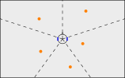

# Directivity-Conditioned Low-Latency Neural Filtering for Speech Enhancement in Hearing Aids

For this work the HPC-cluster Hummel-2 at the University of Hamburg was
used. The cluster was funded by Deutsche Forschungsgemeinschaft (DFG,
German Research Foundation) – 498394658.

###### Abstract

Latest advances in neural directional filtering show exceptional results
in adapting the direction and shape of directivity patterns during the
inference phase. However, in the existing methods for adapting
directivity patterns during inference, important real-world constraints
have been disregarded. Particularly for hearing devices, scenarios are
often much more dynamic, microphone positions vary with head diameter
and hearing aid placement, head-shadow effects occur, and strict latency
constraints apply.

In this work, we propose a novel low-latency (10 ms) deep neural network
(DNN) taking the above requirements of hearing devices into account. As
in recent work, we use feature-wise linear modulation (FiLM) to steer
the directivity patterns during testing. To preserve the desired
directivity pattern, a loss function is proposed that maintains the
spectral cross-channel relationships. Interestingly, we are able to
achieve similar results to methods with relaxed latency constraints.

| Lennart Uphaus¹, André Merboldt² , Markus Hofbauer³ , Timo Gerkmann¹ |
| -------------------------------------------------------------------- |
| ¹ Signal Processing (SP), University of Hamburg, Germany             |
| ² Audatic GmbH, Berlin, Germany ³ Sonova, Stäfa, Switzerland         |

Index Terms—  directivity pattern, hearing device, binaural speech
enhancement

## 1 Introduction

Due to the cocktail-party effect, normal hearing people are able to
follow conversations with multiple people and background noise easily by
dynamically shifting the attention to the desired source \[1\]. However,
this changes for hearing-impaired people. Common speech enhancement
algorithms concentrate on the preservation of a single target speaker
while interfering sources are attenuated \[10, 23\]. But especially in
hearing device scenarios with multiple or changing targets, other
objectives are required. A complete suppression of interfering noises is
not preferred, but merely a reduction, such that an awareness of the
spatial situation is maintained. Furthermore, an adaptable directivity
pattern is desirable for more effective signal enhancement in dynamic
multi-source scenarios. Classical approaches such as minimum-variance
distortionless response (MVDR) beamformer depend on the estimation of
the steering vector \[5\]. Since the direction-of-arrival (DoA)
estimation can be challenging in low signal-to-noise ratios (SNRs) with
non-speech signals, the application of such a method is therefore
disadvantageous \[19\].

As a possible solution, many neural directional filtering (NDF)
approaches have been released in recent years \[17, 21, 4, 6\]. While in
frequency-time joint nonlinear filter (FT-JNF) \[18\] the NDF is
conditioned on a target direction, in \[4\] specified zones can be
extracted by using region queries (e.g angular width, distance or
shape). An extension of the FT-JNF \[18\], called the FiLM Joint
Nonlinear Filter (FiLM-JNF), is proposed in \[6\]. It uses a
conditioning layer to train a DNN directly on different directivity
patterns that can be adjusted during inference. Both approaches employ
circular arrays and produce an enhanced single-channel speech estimate.

Another challenge when developing hearing device algorithms is the
constraint regarding latency ($`\leq 10~`$ms) \[16\]. The total latency
in this paper consists of algorithmic latency and processing latency.
For an STFT-based algorithm the algorithmic latency is given by the STFT
synthesis window length. The processing latency is the time required to
process one signal segment. For real-time processing, this must be lower
or equal to the STFT hop size \[22\]. To reduce the algorithmic latency,
shorter short-time Fourier transform (STFT) windows can be employed,
which results in lower frequency resolution and may deteriorate the
performance. Many low-latency approaches for speech enhancement and
separation have been proposed and investigated recently \[9, 7, 24\].
Nevertheless the recent NDF approaches exhibit higher total latencies of
40 ms to 50 ms that are prohibitive for hearing devices.

This article examines how reducing algorithmic latency affects the
performance of FiLM-JNF in terms of speech quality and directivity
pattern estimation. We propose a low-latency NDF approach that leverages
a FiLM layer based on the findings in \[6\], which also serves as our
baseline. To tackle more realistic environments, moderate
RT$`{}_{\text{60}}`$ of $`0.2-0.5`$ s are considered. Furthermore, we
show that phase regularization in the loss function is essential for
accurately reconstructing the model’s directivity pattern.

## 2 Problem definition

We consider an acoustic scene with $`P`$ speakers surrounding a head
with behind-the-ear (BTE) hearing devices in a reverberant environment.
Since most available datasets for BTE hearing devices \[11\] consist of
two microphones per device, we use a microphone array with a total of
$`Q=4`$ channels. The impulse response between the $`p`$-th speaker’s
position and the $`q`$-th microphone can be disentangled into the direct
path $`h_{q,p}^{\mathrm{direct}}`$ and the reverberant path
$`h_{q,p}^{\mathrm{reverb}}`$. In the time domain, the $`q`$-th
microphone signal can be written as

```math
\displaystyle y_{q}(t) \displaystyle=\sum_{p=1}^{P}s_{p}(t)\ast(h_{q,p}^{\mathrm{direct}}(t)+h_{q,p}^{\mathrm{reverb}}(t)) \tag{1}
```

```math
\displaystyle=\sum_{p=1}^{P}(x_{q,p}(t)+v_{q,p}(t)), \tag{2}
```

with the convolution operator $`\ast`$, the direct-path signal
$`x_{q,p}=s_{p}\ast h_{q,p}^{\mathrm{direct}}`$ and reverberation
$`v_{q,p}=s_{p}\ast h_{q,p}^{\mathrm{reverb}}`$. We aim to reconstruct
an anechoic binaural speech signal that follows the attenuation
constraints given by a defined directivity pattern
$`\Lambda_{t}(\theta)`$ at time index $`t`$, which depends on the DoA
angle $`\theta`$ of the $`p`$-th speaker relative to the microphone
array. This is given by

```math
z_{q}(t)=\sum_{p=1}^{P}\Lambda_{t}(\theta_{p})x_{q,p}(t)\quad q=\{0,2\}. \tag{3}
```

## 3 Proposed method

### 3.1 Low-latency architecture

The approach of \[6\] shows exceptional results in the field of neural
directional beamforming based on the FT-JNF architecture proposed in
\[18\]. We found that reducing the algorithmic latency by taking short
8 ms STFT segments in the FT-JNF architecture significantly decreases
the performance. Therefore, we propose the FiLM-OnlineSpatialNet
(FiLM-OSN), in which we extend the OnlineSpatialNet (OSN) \[13\] with
the FiLM mechanism \[12\] to ensure directional conditioning while
increasing speech quality in a low-latency setup (see Figure 1).


Fig. 1: FiLM-OSN architecture for neural directional beamforming.

Complex STFT coefficients of the input mixture are concatenated, as

```math
Y_{\text{in}}=[\Re\{Y_{1},Y_{2},...,Y_{Q}\},\Im\{Y_{1},Y_{2},...,Y_{Q}\}]\in\mathbb{R}^{2Q} \tag{4}
```

and serve as inputs to the FiLM-OSN network. Here, $`\Re\{\cdot\}`$ and
$`\Im\{\cdot\}`$ denote the real and imaginary part. The core of the
FiLM-OSN architecture consists of $`L`$ interleaved cross-band blocks,
FiLM, and narrow-band blocks, each with an output dimension of
$`F\times T\times C`$, where $`C=96`$. The cross-band blocks facilitate
spectral and spatial information processing through two
frequency-convolution modules and one full-band linear module, operating
independently across time frames. The FiLM layer employs linear mapping
from the directivity pattern vector to the channel size $`C`$, thereby
conditioning the narrow-band block toward the desired pattern. The
narrow-band blocks integrate a state-space model (Mamba) \[3\] and a
time-convolutional module, which process each frequency bin
independently. The channel dimension of the time-convolutional module is
increased to $`C^{\prime}=196`$. The two channels output of the FiLM-OSN
is produced via a linear layer and represents the predicted STFT
coefficients, which are transformed by the inverse short-time Fourier
transform (iSTFT) to reconstruct the estimated time-domain target signal
$`\hat{z}_{left}`$ and $`\hat{z}_{right}`$. Further details about the
causal implementation as well as the base network architecture can be
found in \[13\] and \[14\].

When considering low-latency approaches, convolutional layers play a
significant role \[7\]. U-Net structures are also utilized, where
encoders and decoders are characterized by convolutional layers \[20\].
As for FT-JNF, the lower frequency resolution consequently results in a
shorter sequence length for the spectral long short-term memory (LSTM),
which could affect performance. In contrast to the temporal LSTM layer
for narrow-band processing in FT-JNF, a dynamic state-space model
(Mamba) is used in OSN, which can model long-term dependencies better.

During training, we employ the batch-aggregated normalized
$`\mathcal{L}_{1}`$-loss shown in \[6\], which is defined as

```math
\mathcal{L}_{1}=\frac{\sum_{b=1}^{B}\left\lVert z_{l,r}^{b}-\hat{z}_{l,r}^{\,b}\right\rVert_{1}}{\sum_{b=1}^{B}\left\lVert z_{l,r}^{b}\right\rVert_{1}+\epsilon}, \tag{5}
```

where $`\epsilon`$ is a small constant value, B represents the
batch-size and the indices $`l,r`$ indicate the binaural signal. To
promote convergence to the desired directivity pattern, we adapt the
loss function by adding a phase preservation term that penalizes
interaural phase difference (IPD) deviations between the target and the
prediction, as given by

```math
\mathcal{L}_{\mathrm{IPD}}=\frac{\sum_{f,t}\left|Y_{0}(f,t)\right|^{2}\left[1-\cos\!\left(\hat{\Phi}(f,t)-\Phi(f,t)\right)\right]}{\sum_{f,t}\left|Y_{0}(f,t)\right|^{2}+\epsilon}, \tag{6}
```

where $`\hat{\Phi}(f,t)`$ and $`\Phi(f,t)`$ are the cross-channel phase
differences of the prediction and the target. We make use of the cosine
to avoid phase ambiguities \[8\]. To reduce the contribution of the
low-energy components, we use $`Y_{0}`$ as a weighting factor. A loss
weighting $`\alpha=0.03`$ is applied, which leads to

```math
\mathcal{L}_{1,\text{IPD}}=\mathcal{L}_{1}+\alpha\mathcal{L}_{\text{IPD}}. \tag{7}
```

### 3.2 Directivity pattern strategy

Recent methods \[21, 6\] use differential microphone array (DMA)
patterns as training objectives. However, the width of the main-lobe for
these patterns cannot be precisely specified by an angular width.
Therefore, we propose a cosine-based directivity pattern with a
configurable main-lobe width $`W`$. To ensure spatial awareness for the
user, we limit the maximum attenuation. The directivity pattern is
defined as

```math
\Lambda(\theta)=\begin{cases}|\cos(\frac{\pi}{W}\angle e^{j(\theta-\theta_{d})})|,\quad{\text{if }|\angle e^{j(\theta-\theta_{d})}|\leq\frac{W}{2}}\\
M,\qquad\qquad\quad\quad\text{ else}\end{cases} \tag{8}
```

where $`M`$ is the attenuation limit. $`\theta_{d}`$ represents the
orientation of the directivity pattern relative to the head orientation.

## 4 Experiments

### 4.1 Dataset

For training and testing purposes, we simulate rooms consisting of
$`P=5`$ speakers. As a speech dataset, we use the Wall Street Journal
(WSJ0) corpus. The impulse responses for simulating the binaural signal
captured by a BTE hearing device are provided by the dataset in \[2\].
It comprises a 3-channel microphone configuration per hearing device. To
meet our requirements for a dual-microphone configuration, we omit the
middle microphone. The dataset contains 19 Hearing Aid Related Transfer
Function (HARTF) files, including four KEMAR heads and 15 HARTF s from
individual subjects. 13, 5 and 2 HARTF s are used for training,
validation and testing, respectively. All sets contain both individual
heads as well as at least one KEMAR head. The speakers are evenly
distributed around the microphone array. For this, the room is divided
into areas of 72° angular width. Per area, one speaker is placed
randomly with a distance of 1.20$`\pm`$0.20 m relative to the microphone
array, where the minimum angular distance between speakers is set to
10°. Room characteristics, as well as a visualization of a room sample,
are given in Figure 2.



| Room characteristics |               |
| -------------------- | ------------- |
| Width                | $`3-9`$ m     |
| Length               | $`2.5-5`$ m   |
| Height               | $`2.2-3.5`$ m |
| $`T_{60}`$           | $`0.2-0.5`$ s |

Fig. 2: Visualization of the dataset setup together with important room
characteristics. The orange and blue dots represent the sources and the
BTE hearing device setup.

While the mouths of the speakers are set to a height of 1.60 m with a
standard deviation of 0.08, the microphone array is fixed at 1.5 m. The
selection of the location and orientation of the listener’s head is
random for each room, ensuring that it is at least 1.2 m away from the
walls. Each source is set to a random loudness between -25 LUFS and
-20 LUFS. All in all, 6000, 1200 and 600 binaural room impulse responses
(BRIRs) are simulated for training, validation and testing. Audio
examples can be found on our webpage^(†)^(†)
https://sp-uhh.github.io/film-osn/.

### 4.2 Network architectures and training details

As our baseline, we use the FiLM-JNF. We adapt the spectral mask to
output two channels instead of only one to produce a binaural signal.
Throughout the experiments, $`\sqrt{\text{Hann}}`$ windows with two
different STFT window configurations are used. As an upper limit, we
utilize a length of 32 ms with a hop size of 8 ms. To meet the
low-latency constraints, the window size is reduced to 8 ms with a hop
size of 2 ms. The employed window sizes are indicated in the network
index for clarity.

FiLM-OnlineSpatialNet Our proposed FiLM-OSN $`{}_{\text{8ms}}`$ is
trained with a STFT window size of 8 ms and a hop size of 2 ms, which
results in a total latency of 10 ms. We utilize the parameters of the
SpatialNet-small in \[14\] while using only $`L=4`$ for complexity
reduction and faster training process. The FiLM layer output size is
reduced from 512 to 96 channels to align it with OSN configurations.

Training configuration The used directivity patterns are restricted to
the positions of the sources relative to the microphone array of each
sample. This ensures that at least one source in the target signal is
not attenuated. This restriction leads to five possible directivity
patterns per dataset sample, which results in $`6000\times 5`$,
$`1200\times 5`$ and $`600\times 5`$ samples for training, validation
and testing. The directivity pattern is represented by a 72-dimensional
vector sampled at 5° intervals and used as input to the FiLM layer. For
training and testing, we employ 3-second speech signals. The maximum
number of epochs is set to 100, with the model being early-stopped if
the validation loss does not decrease for 8 consecutive epochs. For the
FiLM-JNF, we use a scheduler that reduces the learning rate by a factor
of 0.5 when the validation loss plateaus for 3 epochs. For the FiLM-OSN,
a scheduler with exponential learning rate decay is used, with a decay
of $`\gamma=0.99`$. Batch size and learning rate are set to 6 and
$`10^{-3}`$. The low-latency FiLM-JNF is trained with smaller learning
rate ($`10^{-4}`$) to avoid instabilities. $`M`$, and $`W`$ are set to
$`-20`$ dB and 90°.

## 5 Results

As evaluation metrics, we employ scale-invariant signal-to-distortion
ratio (SI-SDR), extended short-time objective intelligibility (ESTOI)
and Perceptual Evaluation of Speech Quality (PESQ) \[15\] to cover
distortions, speech intelligibility and perceptual quality. To compute
the directivity patterns, 50 speech signals from the test set are
spatialized at three-degree intervals via the KEMAR HARTF of the test
set with no reverberation. The pattern is then computed via the
wide-band power ratio $`\xi`$, defined as

```math
\xi(\theta)=\frac{\sum_{q,f,t}|\hat{Z}_{q}(f,t)|^{2}}{\sum_{q,f,t}|X_{q}(f,t)|^{2}}, \tag{9}
```

and averaged over time $`T`$, frequency $`F`$ and number of output
channels $`Q`$. The pattern is computed independently for each speech
signal while keeping the input directivity pattern fixed.

Table 1 provides results for the original FiLM-JNF architecture with
32 ms STFT windows \[6\], our adaptation to low-latency processing with
8 ms STFT windows, and the proposed FiLM-OSN, evaluated on both loss
functions.

|                                                        | Params    | PESQ $`\uparrow`$ | ESTOI \[%\] $`\uparrow`$ | SI-SDR \[dB\]$`\uparrow`$ |
| ------------------------------------------------------ | --------- | ----------------- | ------------------------ | ------------------------- |
| Unprocessed                                            |           | $`1.17\pm 0.10`$  | $`0.44\pm 0.08`$         | $`-4.88\pm 3.13`$         |
| FiLM-JNF$`{}_{\text{32ms}}`$                           | $`950`$ k | $`2.10\pm 0.46`$  | $`0.74\pm 0.08`$         | $`4.70\pm 2.91`$          |
| FiLM-JNF$`{}_{\text{8ms}}`$                            | $`950`$ k | $`1.72\pm 0.36`$  | $`0.66\pm 0.10`$         | $`2.98\pm 2.98`$          |
| FiLM-OSN$`{}_{\text{8ms},\mathcal{L}_{1}}`$ (ours)     | $`700`$ k | $`2.04\pm 0.46`$  | $`0.77\pm 0.08`$         | $`5.66\pm 2.77`$          |
| FiLM-OSN$`{}_{\text{8ms},\mathcal{L}_{1+IPD}}`$ (ours) | $`700`$ k | $`2.06\pm 0.46`$  | $`0.77\pm 0.08`$         | $`5.72\pm 2.73`$          |

Table 1: Comparison of low-latency implementations of FiLM-JNF and
FiLM-OSN with the baseline regarding speech quality, intelligibility and
distortions.

For the FiLM-JNF$`{}_{\text{8ms}}`$, a performance drop is observed,
which is attributable to the reduced sequence length of the wide-band
LSTM. Both FiLM-OSN variants achieve superior performance relative to
the low-latency baseline, indicating that the OSN is more suitable for
these conditions. Notably, training with the incorporated IPD
penalization results in marginal increase in PESQ and SI-SDR compared to
the training on the $`\mathcal{L}_{1}`$.

Figure 3 illustrates the estimated directivity patterns for the FiLM-JNF
$`{}_{\text{32ms}}`$ as well as the proposed FiLM-OSN variants, in
comparison to the target directivity pattern. In particular, behavioral
differences are observed between
FiLM-OSN$`{}_{\text{8ms},\mathcal{L}_{1}}`$ and
FiLM-OSN$`{}_{\text{8ms},\mathcal{L}_{1+\text{IPD}}}`$.

Fig. 3: Estimated directivity patterns computed as the output-to-target
power ratio averaged over 50 test speech signals spatialized using the
KEMAR HARTF.

While the FiLM-OSN$`{}_{\text{8ms},\mathcal{L}_{1}}`$ outperforms the
baseline across all metrics, it entirely disregards the desired
directivity pattern as depicted in Figure 3. A further analysis of the
coherence, shown in Figure 4, reveals distinctly different behavior of
the FiLM-OSN$`{}_{\text{8ms},\mathcal{L}_{1}}`$ compared with the actual
coherence. In contrast,
FiLM-OSN$`{}_{\text{8ms},\mathcal{L}_{1+\text{IPD}}}`$ exhibits a
coherence behavior more closely aligned with the target, which suggests
an improved preservation of cross-channel spectral coherence.
Additionally, both approaches maintain the interaural time difference
(ITD) to a large extent, as evidenced by the ITD comparison in Figure 4.

Fig. 4: Comparison of ITD (top) and coherence (bottom) between
FiLM-OSN$`{}_{\text{8ms},\mathcal{L}_{1+IPD}}`$
(),
FiLM-OSN$`{}_{\text{8ms},\mathcal{L}_{1}}`$
()
and the target
().
Coherence is computed from a random test sample, and ITD from a random
spatialized speech sample.

These findings suggest that, due to the $`\mathcal{L}_{1}`$ time-domain
loss, the FiLM-OSN primarily learns to preserve the ITD, while
neglecting cross-channel coherence. Incorporating the IPD enables the
preservation of spectral relations, which leads to more accurate
guidance towards the desired directivity pattern.

## 6 Conclusion

In this article, we show that current neural directional filtering (NDF)
approaches can be applied to hearing device scenarios. We propose a
steerable low-latency NDF method for a behind-the-ear (BTE) hearing
device setup, which allows users to adjust the focus in multi-talker
scenarios. We also propose an additional phase difference deviation loss
for our approach and show that this is crucial for achieving the desired
directivity patterns. We suggest taking advantage of a state-space
sequence-model architecture (Mamba) to achieve increased performance on
the speech enhancement task under low-latency assumptions. The results
on the diverse dataset show that our approach is also able to generalize
to different microphone setups, since the training and testing set
consists of various head diameters.

## References

- \[1\] E. C. Cherry (1953) Some experiments on the recognition of
  speech, with one and with two ears. JASA 25 (5), pp. 975–979. External
  Links: ISSN 0001-4966,
  [Document](https://dx.doi.org/10.1121/1.1907229),
  [Link](https://doi.org/10.1121/1.1907229),
  https://pubs.aip.org/asa/jasa/article-pdf/25/5/975/18731769/975_1_online.pdf
  Cited by: §1.
- \[2\] F. Denk, S. M. A. Ernst, S. D. Ewert, and B. Kollmeier (2018)
  Adapting hearing devices to the individual ear acoustics: database and
  target response correction functions for various device styles. Trends
  in Hearing 22 (). External Links:
  [Document](https://dx.doi.org/10.1177/2331216518779313) Cited by:
  §4.1.
- \[3\] A. Gu and T. Dao (2023) Mamba: linear-time sequence modeling
  with selective state spaces. In arXiv preprint arXiv:2312.00752,
  External Links:
  [Document](https://dx.doi.org/10.48550/ARXIV.2312.00752) Cited by:
  §3.1.
- \[4\] R. Gu and Y. Luo (2024) ReZero: region-customizable sound
  extraction. IEEE/ACM TASLP 32 (), pp. 2576–2589. External Links:
  [Document](https://dx.doi.org/10.1109/TASLP.2024.3393713) Cited by:
  §1.
- \[5\] E. A. P. Habets, J. Benesty, S. Gannot, and I. Cohen (2010) The
  MVDR beamformer for speech enhancement. In Speech Processing in Modern
  Communication: Challenges and Perspectives, pp. 225–254. External
  Links: ISBN 978-3-642-11130-3,
  [Document](https://dx.doi.org/10.1007/978-3-642-11130-3%5F9),
  [Link](https://doi.org/10.1007/978-3-642-11130-3_9) Cited by: §1.
- \[6\] W. Huang, S. R. Chetupalli, and E. A. P. Habets (2025) Neural
  directional filtering with configurable directivity pattern at
  inference. arXiv preprint arXiv:2510.20253. External Links:
  2510.20253, [Link](https://arxiv.org/abs/2510.20253) Cited by: §1, §1,
  §3.1, §3.1, §3.2, §5.
- \[7\] Y. Luo and N. Mesgarani (2019) Conv-TasNet: surpassing ideal
  time–frequency magnitude masking for speech separation. IEEE/ACM TASLP
  27 (8), pp. 1256–1266. External Links:
  [Document](https://dx.doi.org/10.1109/TASLP.2019.2915167) Cited by:
  §1, §3.1.
- \[8\] K. V. Mardia and P. E. Jupp (1999) Summary statistics. In
  Directional Statistics, pp. 13–24. External Links: ISBN 9780470316979,
  [Document](https://dx.doi.org/https%3A//doi.org/10.1002/9780470316979.ch2)
  Cited by: §3.1.
- \[9\] A. Pandey, K. Tan, and B. Xu (2023) A Simple RNN Model for
  Lightweight, Low-compute and Low-latency Multichannel Speech
  Enhancement in the Time Domain. In Interspeech, pp. 2478–2482.
  External Links:
  [Document](https://dx.doi.org/10.21437/Interspeech.2023-2418), ISSN
  2958-1796 Cited by: §1.
- \[10\] A. Pandey, B. Xu, A. Kumar, J. Donley, P. Calamia, and D.
  Wang (2022) Multichannel speech enhancement without beamforming. In
  ICASSP, Vol. , pp. 6502–6506. External Links:
  [Document](https://dx.doi.org/10.1109/ICASSP43922.2022.9746704) Cited
  by: §1.
- \[11\] F. Pausch, S. A. B. A. Doma, and J. Fels (2022) IHTA-indHARTF -
  database of individual behind-the-ear hearing-aid-related transfer
  functions with high spatial resolution. RWTH Aachen University (en).
  External Links:
  [Document](https://dx.doi.org/10.18154/RWTH-2022-04267) Cited by: §2.
- \[12\] E. Perez, F. Strub, H. De Vries, V. Dumoulin, and A.
  Courville (2018) FiLM: visual reasoning with a general conditioning
  layer. Proceedings of the AAAI Conference on Artificial Intelligence
  32 (1). External Links: ISSN 2159-5399,
  [Document](https://dx.doi.org/10.1609/aaai.v32i1.11671) Cited by:
  §3.1.
- \[13\] C. Quan and X. Li (2024) Multichannel long-term streaming
  neural speech enhancement for static and moving speakers. IEEE Signal
  Processing Letters 31 (), pp. 2295–2299. External Links:
  [Document](https://dx.doi.org/10.1109/LSP.2024.3418714) Cited by:
  §3.1, §3.1.
- \[14\] C. Quan and X. Li (2024) SpatialNet: extensively learning
  spatial information for multichannel joint speech separation,
  denoising and dereverberation. IEEE/ACM TASLP 32 (), pp. 1310–1323.
  External Links:
  [Document](https://dx.doi.org/10.1109/TASLP.2024.3357036) Cited by:
  §3.1, §4.2.
- \[15\] A.W. Rix, J.G. Beerends, M.P. Hollier, and A.P. Hekstra (2001)
  Perceptual evaluation of speech quality (PESQ) – a new method for
  speech quality assessment of telephone networks and codecs. In ICASSP,
  Vol. 2, pp. 749–752 vol.2. External Links:
  [Document](https://dx.doi.org/10.1109/ICASSP.2001.941023) Cited by:
  §5.
- \[16\] M. A. Stone and B. C. J. Moore (2003) Tolerable hearing aid
  delays. iii. effects on speech production and perception of
  across-frequency variation in delay. Ear and Hearing 24 (2),
  pp. 175–183. External Links: ISSN 0196-0202,
  [Document](https://dx.doi.org/10.1097/01.aud.0000058106.68049.9c)
  Cited by: §1.
- \[17\] K. Tesch and T. Gerkmann (2023) Insights into deep non-linear
  filters for improved multi-channel speech enhancement. IEEE/ACM TASLP
  31 (), pp. 563–575. External Links:
  [Document](https://dx.doi.org/10.1109/TASLP.2022.3221046) Cited by:
  §1.
- \[18\] K. Tesch and T. Gerkmann (2024) Multi-channel speech separation
  using spatially selective deep non-linear filters. IEEE/ACM TASLP 32
  (), pp. 542–553. External Links:
  [Document](https://dx.doi.org/10.1109/TASLP.2023.3334101) Cited by:
  §1, §3.1.
- \[19\] O. Thiergart and E. A. P. Habets (2012) Sound field model
  violations in parametric spatial sound processing. In IWAENC, Cited
  by: §1.
- \[20\] Z. Wang, G. Wichern, S. Watanabe, and J. Le Roux (2023)
  STFT-domain neural speech enhancement with very low algorithmic
  latency. IEEE/ACM TASLP 31 (), pp. 397–410. External Links:
  [Document](https://dx.doi.org/10.1109/TASLP.2022.3224285) Cited by:
  §3.1.
- \[21\] J. Wechsler, S. R. Chetupalli, M. M. Halimeh, O. Thiergart,
  and E. A. P. Habets (2024) Neural directional filtering: far-field
  directivity control with a small microphone array. In IWAENC, Vol. ,
  pp. 459–463. External Links:
  [Document](https://dx.doi.org/10.1109/IWAENC61483.2024.10693965) Cited
  by: §1, §3.2.
- \[22\] S. Welker, B. Lay, M. Hillemann, T. Peer, and T.
  Gerkmann (2025) Real-time streamable generative speech restoration
  with flow matching. arXiv preprint arXiv:2512.19442. External Links:
  [Link](https://arxiv.org/abs/2512.19442) Cited by: §1.
- \[23\] N. L. Westhausen, H. Kayser, T. Jansen, and B. T. Meyer (2024)
  Real-time multichannel deep speech enhancement in hearing aids:
  comparing monaural and binaural processing in complex acoustic
  scenarios. IEEE/ACM TASLP 32 (), pp. 4596–4606. External Links:
  [Document](https://dx.doi.org/10.1109/TASLP.2024.3473315) Cited by:
  §1.
- \[24\] H. Wu and S. Braun (2025) Ultra-low latency speech enhancement
  -a comprehensive study. In ICASSP, External Links:
  [Document](https://dx.doi.org/10.1109/ICASSP49660.2025.10889823) Cited
  by: §1.
