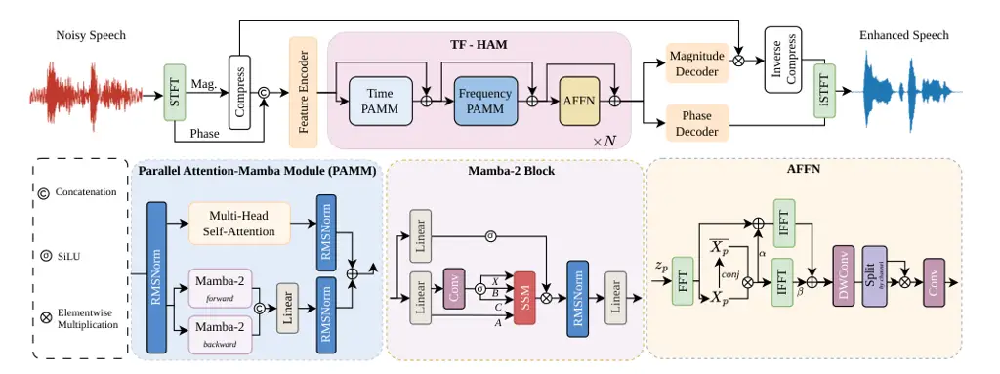

# HAMMER: Harmonic-Aware Parallel Context Modeling and Discriminator-Free Perceptual Optimization for Speech Enhancement

###### Abstract

Recent speech enhancement systems combine self-attention and Mamba to
capture global interactions and long-range dependencies. Yet these
hybrids usually operate as sequence mixers and do not explicitly exploit
harmonic periodicity, a strong cue for preserving voiced speech under
noise. Perceptual optimization poses another challenge. PESQ is
non-differentiable, so many methods train auxiliary metric
discriminators that increase complexity and introduce adversarial
instability. We propose HAMMER, a harmonic-aware and discriminator-free
speech enhancer built around two components. (i) The Time-Frequency
Harmonic-aware Attention-Mamba (TF-HAM) block runs self-attention and
bidirectional Mamba in parallel along both spectrogram axes, then
applies a speech-adapted autocorrelation feed-forward network to encode
local periodic structure. (ii) Metric-explicit perceptual refinement
(MEPR) combines differentiable PESQ and log-likelihood-ratio losses to
expose perceptual metric structure without a learned surrogate. On
VoiceBank+DEMAND, HAMMER achieves 3.69 PESQ and 4.41 COVL with only
2.39 M parameters, outperforming or matching discriminator-based
systems. Inference-time perceptual contrast stretching further raises
PESQ to 3.79 without retraining. The source code will be available at
[https://github.com/shangfuu/HAMMER.git](https://github.com/shangfuu/HAMMER.git).

Shang-Fu Chen^(1,2), Szu-Wei Fu³, Sung-Feng Huang³, Rong Chao^(1,2),
Wen-Huang Cheng^(1,4), Yu Tsao²

¹National Taiwan University, ²Academia Sinica, ³Nvidia, ⁴VinUniversity

chenshangfu@cmlab.csie.ntu.edu.tw, szuweif@nvidia.com,
sungfengh@nvidia.com, roychao19477@gmail.com, wenhuang@csie.ntu.edu.tw,
yutsao@as.edu.tw

Index Terms: speech enhancement, speech quality, perceptual loss, state
space model, attention mechanism

## 1 Introduction

Single-channel speech enhancement (SE) aims to recover clean speech from
noisy recordings and supports telephony, hearing aids, and automatic
speech recognition. Recent time–frequency systems jointly estimate
magnitude and phase in the short-time Fourier transform (STFT) domain.
MP-SENet \[1\] established an effective dual-decoder architecture for
this setting, while SEMamba \[2\] replaced its Transformer backbone with
bidirectional Mamba for compact sequence modeling. Self-attention and
Mamba offer complementary capabilities. Self-attention captures global
interactions, whereas Mamba propagates long-range information
efficiently through a selective state space. Recent hybrids combine both
mechanisms \[3, 4, 5\], but usually stack them sequentially and still
act as generic sequence mixers. They model dependencies among
time–frequency tokens without explicitly encoding the quasi-periodicity
of voiced speech, whose regularly spaced harmonics and repeated temporal
patterns remain informative under noise. Representing this structure can
help preserve harmonically related speech components while suppressing
unstructured interference.

A separate challenge is aligning reconstruction with perceived quality.
PESQ is widely used but non-differentiable \[6\], so MetricGAN-style
methods \[7, 8, 9, 2, 10, 4, 3\] train auxiliary predictors as surrogate
objectives, adding complexity and adversarial instability.
Differentiable PESQ approximations avoid the discriminator, but
replacing hard perceptual operators with smooth alternatives can make
their scores deviate from the exact PESQ value, while hard thresholds
and piecewise operations can still suppress gradients for near-clean
speech \[11\]. A discriminator-free objective should therefore preserve
useful optimization directions without relying on either an exact
non-differentiable metric or a learned metric proxy.

Motivated by these observations, we propose HAMMER (Harmonic-aware
Attention-Mamba with Metric-Explicit Refinement), a harmonic-aware and
discriminator-free speech enhancer. The proposed HAMMER have two core
components. First, the _Time-Frequency Harmonic-aware Attention-Mamba
(TF-HAM)_ block couples self-attention and bidirectional Mamba in
parallel along both spectrogram axes rather than stacking them
sequentially, allowing global token interactions and efficient
state-space context to be computed as complementary views. It then
applies an autocorrelation feed forward network adapted from
Flickerformer \[12\] to local time–frequency speech patches, bringing
periodicity modeling into each block. Second, we introduce
_Metric-Explicit Perceptual Refinement (MEPR)_. MEPR combines a
differentiable soft-PESQ loss that turns hard perceptual operators into
informative training gradients with a differentiable
log-likelihood-ratio (LLR) loss targeting LPC spectral distortion
associated with composite speech-quality measures. This objective
incorporates perceptual supervision without a metric-prediction
discriminator. On VoiceBank+DEMAND, HAMMER achieves 3.69 PESQ, 4.83
CSIG, 3.97 CBAK, and 4.41 COVL with only 2.39 M parameters. It
outperforms or matches the discriminator-based systems across all
reported metrics. Ablations show complementary gains from parallel
hybrid modeling and metric-explicit refinement.

## 2 Related Work

Speech Enhancement Models. MP-SENet \[1\] established the dual
magnitude/phase-decoder codec that most recent systems build on.
SEMamba \[2\] replaced its Transformer core with bidirectional Mamba,
Mamba-SEUNet \[13\] scaled the idea into a multi-level U-Net, and
hybrids that pair state-space models with attention are emerging in
SE \[3\]. We adopt the parallel-fusion design of Hymba \[14\] from
language modelling, merging both mixers inside every time–frequency
block. None of these backbones contains a module specialised for
harmonicity, which our speech-adapted Autocorrelation Feed-Forward
Network (AFFN) explicitly models.



Figure 1: Overview of HAMMER. Compressed magnitude and phase spectra are
encoded, refined by stacked TF-HAM blocks, and decoded for waveform
reconstruction. Each TF-HAM block applies time- and frequency-axis
Parallel Attention-Mamba modules followed by a speech-adapted AFFN,
combining parallel self-attention, bidirectional Mamba2, and local
periodicity modeling.

Optimizing perceptual metrics. Because PESQ \[6\] is non-differentiable,
MetricGAN+ \[8\] and CMGAN \[9\] learn discriminators as metric
surrogates, while MetricGAN-OKD \[15\] extends this idea to multiple
metrics. Differentiable surrogates such as PMSQE \[11\], PESQ-inspired
losses \[16\], and torch-pesq \[17\] avoid adversarial training but
still require care around hard perceptual operators and metric-specific
artifacts \[18\]. We instead combine softened PESQ-style supervision
with a differentiable LLR term related to composite speech-quality
measures \[19, 20\].

## 3 Method

### 3.1 Overview

As shown in Fig. 1, HAMMER follows the complex-spectral, dual-decoder
design \[1, 2, 21\]. Given a noisy waveform, we compute its STFT
magnitude and phase, apply power-law magnitude compression, and stack
them as a two-channel time–frequency input. A DenseEncoder maps this
representation to a compact feature map, which is refined by TF-HAM
blocks before separate magnitude and phase decoders reconstruct the
enhanced waveform through inverse STFT. The encoder and decoders are
kept unchanged from the SEMamba \[2\], so the proposed design focuses on
two parts of the pipeline: (i) the TF-HAM backbone, which combines
parallel Attention-Mamba mixing with a speech-adapted autocorrelation
feed-forward network (Sec. 3.2); and (ii) metric-explicit perceptual
refinement (MEPR), which combines Soft-PESQ and differentiable LLR
without a learned discriminator (Sec. 3.3).

### 3.2 Time-Frequency Harmonic-aware Attention-Mamba

Enhancing speech spectrograms requires complementary forms of context.
Nonlocal spectral evidence helps recover speech components masked by
noise, content-selective long-range propagation supports temporal and
spectral continuity, and local periodic structure provides cues for
voiced speech. TF-HAM is designed to couple these factors within each
block. It first applies a parallel Attention-Mamba mixer along each
spectrogram axis, followed by a speech-adapted AFFN. Following the
hybrid-head principle of Hymba \[14\], the attention and state-space
branches process the same normalized features rather than being stacked
sequentially. This avoids imposing a fixed ordering in which one mixer
must operate on a representation already filtered by the other. Instead,
nonlocal attention and content-selective state-space propagation produce
complementary views at the same depth before fusion. The AFFN then
provides channel mixing and local periodic-structure modeling.

Parallel Attention-Mamba module. Given an axis-wise token sequence
$`x\in\mathbb{R}^{L\times C}`$ with $`L`$ tokens and $`C`$ channels,
TF-HAM applies one pre-normalization and sends the same representation
to attention and Mamba2. The attention branch $`A`$ uses rotary
positional embeddings (RoPE) \[22\], which rotate queries and keys by
their axis positions so that self-attention encodes relative offsets.
This branch is computed as:

```math
\begin{gathered}\tilde{x}=\operatorname{RMSNorm}(x),\hskip 9.24994ptQ,K,V=\tilde{x}W_{qkv},\\
A=\operatorname{softmax}\!\left(\frac{\mathcal{R}(Q)\mathcal{R}(K)^{\top}}{\sqrt{d}}\right)V.\end{gathered} \tag{1}
```

where $`\mathcal{R}(\cdot)`$ denotes the per-head RoPE rotation,
$`\sqrt{d}`$ is the scaling factor, and $`W_{qkv}`$ denotes linear
projection of query, key and value. In parallel, the Mamba branch $`M`$
applies bidirectional Mamba2 \[23\] to summarize content-selective
context:

```math
M=[\,\operatorname{SSM}_{\rightarrow}(\tilde{x})\,\|\,\operatorname{SSM}_{\leftarrow}(\tilde{x})\,]W_{m}, \tag{2}
```

where $`\|`$ denotes channel-wise concatenation,
$`\operatorname{SSM}_{\rightarrow}`$ and
$`\operatorname{SSM}_{\leftarrow}`$ are the forward and backward Mamba2
scans and $`W_{m}`$ is a learnable projection. The outputs of the two
branches are then combined to produce:

```math
y=\tfrac{1}{2}\big(\operatorname{RMSNorm}(A)+\operatorname{RMSNorm}(M)\big)W_{o}. \tag{3}
```

Here, $`W_{o}`$ is also a learnable linear projection. The mixer output
is added to the input by the residual update. This mixer is applied
along the temporal and spectral axes in succession, with the residual
update performed after each axis-wise pass.

| Model                                       | Venue            | PESQ | CSIG | CBAK | COVL | STOI | Params |
| ------------------------------------------- | ---------------- | ---- | ---- | ---- | ---- | ---- | ------ |
| Noisy                                       | –                | 1.97 | 3.35 | 2.44 | 2.63 | 0.92 | –      |
| SEGAN \[24\]                                | Interspeech 2017 | 2.16 | 3.48 | 2.94 | 2.80 | –    | 43.18M |
| Demucs \[25\]                               | Interspeech 2020 | 3.07 | 4.31 | 3.40 | 3.63 | 0.95 | 33.53M |
| MetricGAN+ \[8\]                            | Interspeech 2021 | 3.15 | 4.14 | 3.16 | 3.64 | 0.93 | –      |
| SE-Conformer \[26\]                         | Interspeech 2021 | 3.13 | 4.45 | 3.55 | 3.82 | 0.95 | –      |
| TSTNN \[27\]                                | ICASSP 2021      | 2.96 | 4.33 | 3.53 | 3.67 | 0.95 | 0.92M  |
| DPT \[28\]                                  | ICASSP 2022      | 3.33 | 4.58 | 3.72 | 4.00 | 0.96 | –      |
| DPCFCS-Net \[29\]                           | Interspeech 2023 | 3.42 | 4.71 | 3.88 | 4.15 | 0.96 | 2.86M  |
| S4ND-UNet \[30\]                            | Interspeech 2023 | 3.15 | 4.52 | 3.62 | 3.85 | –    | 0.75M  |
| MP-SENet \[1\]                              | Interspeech 2023 | 3.50 | 4.73 | 3.95 | 4.22 | 0.96 | 2.05M  |
| MUSE \[31\]                                 | Interspeech 2024 | 3.37 | 4.63 | 3.80 | 4.10 | 0.95 | 0.51M  |
| CMGAN \[9\]                                 | T-ASLP 2024      | 3.41 | 4.63 | 3.94 | 4.12 | 0.96 | 1.83M  |
| SEMamba \[2\]                               | SLT 2024         | 3.55 | 4.77 | 3.95 | 4.29 | 0.96 | 2.25M  |
| ZipEnhancer (S, $`\lambda_{6}=0.2`$) \[10\] | ICASSP 2025      | 3.61 | 4.81 | 3.97 | 4.35 | 0.96 | 2.04M  |
| Mamba-SEUNet (M) \[13\]                     | ICASSP 2025      | 3.57 | 4.79 | 4.00 | 4.30 | 0.96 | 3.78M  |
| Mamba-SEUNet (S) \[13\]                     | ICASSP 2025      | 3.54 | 4.77 | 3.98 | 4.28 | 0.96 | 1.88M  |
| MH-SENet \[4\]                              | Interspeech 2025 | 3.62 | 4.79 | 4.01 | 4.34 | 0.96 | 0.99M  |
| Mamba-Former (S, $`\lambda_{6}=0.2`$) \[3\] | ICASSP 2026      | 3.64 | 4.83 | 4.02 | 4.39 | 0.96 | 2.14M  |
| HAMMER                                      | –                | 3.69 | 4.83 | 3.97 | 4.41 | 0.96 | 2.39M  |

Table 1: Comparison of speech enhancement models on VoiceBank+DEMAND.
Best value per column in bold; underline marks our best result where a
baseline holds the column best.

Speech-adapted AFFN. We adapt the AFFN of Flickerformer \[12\] to
provide channel mixing and a periodic inductive bias for speech
spectrograms. While the original module targets image flicker, we apply
it to local time–frequency patches, where voiced speech exhibits
harmonic repetition. Given features
$`Z\in\mathbb{R}^{C\times T\times F}`$, we first apply a point-wise
convolution and partition the normalized features into $`P{\times}P`$
patches $`z_{p}`$ and computes:

```math
\begin{gathered}\mathcal{X}_{p}=\mathcal{W}\odot\mathcal{FFT}_{2}(z_{p}),\hskip 9.24994ptS_{p}=\mathcal{X}_{p}\odot\overline{\mathcal{X}_{p}},\\
R_{p}=\mathcal{FFT}_{2}^{-1}(S_{p}),\end{gathered} \tag{4}
```

where $`p`$ indexes a patch, $`\mathcal{FFT}_{2}`$ is the 2-D FFT,
$`\mathcal{W}`$ is a learnable spectral filter, $`\odot`$ denotes
element-wise multiplication, $`\overline{\mathcal{X}_{p}}`$ is the
complex conjugate of $`\mathcal{X}_{p}`$, $`S_{p}`$ is the power
spectrum, and $`R_{p}`$ is the autocorrelation obtained by the
Wiener–Khinchin theorem \[32\]. To make this periodic cue explicit in
each local patch, AFFN reinforces periodic structure through:

```math
\begin{gathered}\widetilde{z}_{p}=\mathcal{FFT}_{2}^{-1}(\mathcal{X}_{p}+\alpha S_{p})+\beta R_{p},\end{gathered} \tag{5}
```

where $`\alpha`$ and $`\beta`$ are learnable scalars. The first term can
be viewed as a spectrum-enhanced reconstruction. Here,
$`\mathcal{X}_{p}`$ preserves the learned complex spectrum, while
$`\alpha S_{p}`$ emphasizes high-power periodic components before
mapping back to the patch domain. The patches $`\{\widetilde{z}_{p}\}`$
are reassembled and passed through gated FFN layers, producing the AFFN
output $`\widetilde{Z}`$. This branch is injected with a
zero-initialized residual scale $`\gamma`$:

```math
Z^{\prime}=Z+\gamma\,\widetilde{Z}. \tag{6}
```

### 3.3 Metric-Explicit Perceptual Refinement

PESQ-oriented training is often implemented through learned metric
discriminators \[8, 9, 2, 10, 4, 3\], because the reference PESQ
implementation is non-differentiable. This introduces an extra network,
additional computation, and adversarial training instability. MEPR
instead keeps the standard losses as the training anchor and adds two
direct differentiable metric losses: Soft-PESQ for perceptual
disturbance and log-likelihood-ratio (LLR) loss for linear predictive
coding (LPC) spectral distortion. Both are computed from clean and
enhanced waveforms, without a learned discriminator.

Soft-PESQ. Although the official PESQ implementation is not
differentiable, most of its perceptual pipeline consists of
deterministic signal-processing operations, such as filtering,
time–frequency transforms, Bark-scale mapping, loudness conversion, and
disturbance aggregation, that can be written as tensor operations with
autograd. Such a graph is a training surrogate rather than the exact
evaluation metric: its absolute score may differ from the reference PESQ
implementation, but its perceptual disturbance signal is still useful
for guiding enhancement. However, directly differentiating this
surrogate still inherits hard dead-zones, thresholds, and saturation
operations from the original PESQ pipeline, which can yield zero or
abrupt gradients and cause learning to stall or become unstable. We
therefore start from the differentiable P.862-style \[17\] and soften
the hard operators that create gradient dead zones or discontinuities.

Inside the differentiable PESQ pipeline, a non-smooth step is the
dead-zone applied to each signed loudness disturbance $`d`$ with masking
threshold $`z`$. Instead of setting all sub-threshold disturbances to
zero, we use a leaky dead-zone:

```math
\widetilde{d}=\operatorname{sgn}(d)\left[\max(|d|-z,0)+\lambda\min(|d|,z)\right], \tag{7}
```

where $`\operatorname{sgn}(\cdot)`$ returns the sign of its argument,
and $`\lambda{=}0.05`$ keeps a small gradient inside the dead-zone. We
apply the same principle to the other hard decisions: the asymmetry
threshold on the disturbance ratio $`r`$ is replaced by a sigmoid gate
$`\sigma((r-3)/\tau_{g})`$ with $`\tau_{g}{=}0.5`$, and each hard upper
cap $`\min(u,c)`$ is replaced by
$`u-\tau_{s}\log(1+\exp((u-c)/\tau_{s}))`$, where $`u`$ is the input,
$`c`$ is the saturation limit, and $`\tau_{s}{=}2`$ controls the
transition smoothness. The softened PESQ pipeline directly computes the
Soft-PESQ loss $`\mathcal{L}_{\text{pesq}}`$ from clean waveform $`x`$
and enhanced waveform $`\hat{x}`$, using a loss scaling factor of
$`0.5`$. Other numerical stabilizers remain unchanged.

Differentiable LLR. Soft-PESQ measures perceptual disturbance after
auditory-domain processing, but it does not explicitly constrain the
speech spectral envelope. We therefore add a log-likelihood ratio (LLR)
term \[19\] on linear predictive coding (LPC) spectra, which penalizes
mismatches in the all-pole envelope that captures formant structure and
vocal-tract coloration. We implement the LLR computation with
autograd-compatible tensor operations. Clean and enhanced waveforms are
framed at 16 kHz using 480-sample windows and 120-sample hops,
multiplied by a Hann window, and converted to order-$`P{=}16`$
autocorrelations. A batched Levinson–Durbin recursion, following the
same reference implementation, produces LPC coefficient vectors
$`a_{x},a_{\hat{x}}\in\mathbb{R}^{P+1}`$ (including the leading unity
tap) for the clean and enhanced frames, respectively, and the
frame-level distortion is:

```math
d_{\text{LLR}}=\log\frac{a_{\hat{x}}^{\top}R_{x}\,a_{\hat{x}}+\epsilon}{a_{x}^{\top}R_{x}\,a_{x}+\epsilon}, \tag{8}
```

where $`R_{x}\in\mathbb{R}^{(P+1)\times(P+1)}`$ is the Toeplitz
autocorrelation matrix of the clean frame and $`\epsilon=10^{-10}`$
stabilizes the logarithm. As in the composite objective measure \[19\],
we sort frame-level distortions per utterance, keep the lowest $`95\%`$,
and average them to obtain $`\mathcal{L}_{\text{llr}}`$. Sorting acts as
an index permutation with a well-defined subgradient almost everywhere,
so the truncated average remains differentiable with respect to the
enhanced waveform.

Total objective. We follow the SEMamba reconstruction objective \[2\]
and add the Soft-PESQ and differentiable LLR losses:

```math
\displaystyle\mathcal{L}=\; \displaystyle 0.9\,\mathcal{L}_{\text{mag}}+0.3\,\mathcal{L}_{\text{pha}}+0.1\,\mathcal{L}_{\text{com}}+0.2\,\mathcal{L}_{\text{time}}
```

```math
\displaystyle+0.1\,\mathcal{L}_{\text{con}}+0.2\,\mathcal{L}_{\text{pesq}}+0.1\,\mathcal{L}_{\text{llr}}, \tag{9}
```

where $`\mathcal{L}_{\text{mag}}`$, $`\mathcal{L}_{\text{pha}}`$,
$`\mathcal{L}_{\text{com}}`$, $`\mathcal{L}_{\text{time}}`$, and
$`\mathcal{L}_{\text{con}}`$ are the SEMamba reconstruction losses, and
$`\mathcal{L}_{\text{pesq}}`$ and $`\mathcal{L}_{\text{llr}}`$ are the
metric-explicit terms defined above. No adversarial term is used.

## 4 Experiments

| TF-HAMA        | Soft-PESQ      | LLR            | PESQ | CSIG | CBAK | COVL |
| -------------- | -------------- | -------------- | ---- | ---- | ---- | ---- |
| $`\times`$     | $`\times`$     | $`\times`$     | 3.55 | 4.77 | 3.95 | 4.29 |
| $`\times`$     | $`\checkmark`$ | $`\times`$     | 3.58 | 4.77 | 3.98 | 4.31 |
| $`\checkmark`$ | $`\checkmark`$ | $`\times`$     | 3.69 | 4.81 | 4.00 | 4.39 |
| $`\checkmark`$ | $`\checkmark`$ | $`\checkmark`$ | 3.69 | 4.83 | 3.97 | 4.41 |

Table 2: Ablation study on VoiceBank+DEMAND. MEPR is decomposed into
soft-PESQ and LLR.

### 4.1 Experimental Detail

Dataset. We evaluate on VoiceBank+DEMAND \[33\], the standard
single-channel benchmark. The training set pairs $`11{,}572`$ utterances
from $`28`$ speakers with DEMAND noise at signal-to-noise ratios of
$`\{0,5,10,15\}`$ dB, and the test set contains $`824`$ utterances from
$`2`$ unseen speakers mixed at $`\{2.5,7.5,12.5,17.5\}`$ dB. All audio
is resampled to $`16`$ kHz.

Configuration. STFT features use a 400-sample Hann window, 100-sample
hop, $`n_{\text{fft}}{=}400`$, and power-law magnitude compression with
$`c{=}0.3`$. We use $`C{=}64`$ channels, $`N{=}4`$ TF-HAM blocks,
$`H{=}4`$ attention heads, and Mamba2 settings
$`d_{\text{state}}{=}16`$, $`d_{\text{conv}}{=}4`$,
$`\text{expand}{=}4`$, totaling $`2.39`$ M parameters. We train 2-second
segments with AdamW ($`\beta_{1}{=}0.8`$, $`\beta_{2}{=}0.99`$, learning
rate $`5\!\times\!10^{-4}`$ decayed by $`0.99`$ per epoch), bf16 mixed
precision, and batch size $`4`$ per GPU on two GPUs. Perceptual-loss
models use gradient clipping at norm $`1.0`$ and an EMA generator (decay
$`0.999`$), converging within $`70`$ epochs. Following prior work \[2\],
we also report perceptual contrast stretching (PCS) \[34\], applied at
inference rather than retraining.

Evaluation Metrics. We report wide-band PESQ, the composite predictors
CSIG, CBAK, and COVL \[35\] and STOI. Higher is better for all. Enhanced
utterances are decompressed and inverse-transformed before scoring with
the reference implementations, so the numbers are directly comparable to
published results.

### 4.2 Comparison with State of the Art

Table 1 compares HAMMER with representative time-domain, GAN-based,
Transformer, state-space, and sequential hybrid attention-Mamba systems.
HAMMER attains $`3.69`$ PESQ and $`4.41`$ COVL with only $`2.39`$ M
parameters, giving the best overall quality while remaining close to the
strongest background-quality scores. Notably, this performance is
achieved without a metric discriminator, indicating that direct
differentiable perceptual optimization can be competitive with
adversarial metric prediction. Together, the results show that HAMMER
offers a favorable quality–complexity trade-off among compact
speech-enhancement models.

|                                 |      |      |      |      |      |
| ------------------------------- | ---- | ---- | ---- | ---- | ---- |
| Model                           | PESQ | CSIG | CBAK | COVL | STOI |
| SEMamba +PCS \[2\]              | 3.69 | 4.79 | 3.63 | 4.37 | 0.96 |
| Mamba-SEUNet (S) +PCS \[13\]    | 3.70 | 4.79 | 3.64 | 4.37 | 0.96 |
| Mamba-SEUNet (L) +PCS \[13\]    | 3.73 | 4.82 | 3.67 | 4.40 | 0.96 |
| HAMMER + PCS($`\alpha{=}0.3`$)  | 3.75 | 4.84 | 3.87 | 4.46 | 0.95 |
| HAMMER + PCS($`\alpha{=}0.5`$)  | 3.78 | 4.85 | 3.80 | 4.47 | 0.95 |
| HAMMER + PCS($`\alpha{=}0.65`$) | 3.79 | 4.85 | 3.76 | 4.47 | 0.95 |
| HAMMER + PCS($`\alpha{=}1.0`$)  | 3.77 | 4.83 | 3.67 | 4.45 | 0.95 |

Table 3: Perceptual contrast stretching (PCS) on VoiceBank+DEMAND.
Baselines use PCS retraining, while HAMMER applies PCS at inference.
Best values are in bold.

### 4.3 Ablation Study

Table 2 isolates the contribution of TF-HAMA and MEPR using SEMamba as
the closest baseline. Soft-PESQ alone provides a modest but consistent
gain, indicating that direct perceptual gradients are useful even
without changing the backbone. Replacing the backbone with TF-HAMA
yields the largest improvement, suggesting that harmonic-aware parallel
Mamba-attention contributes more than simply adding a perceptual loss.
Adding LLR further improves CSIG and COVL, consistent with its role in
constraining LPC spectral distortion rather than directly maximizing
PESQ. A sequential Mamba-to-attention variant with the same losses
obtains 3.67 PESQ and 4.40 COVL, slightly below TF-HAMA, supporting
parallel fusion over fixed-order stacking. Overall, the ablation shows
that architecture and optimization are complementary: TF-HAMA improves
the representation, while MEPR refines it toward perceptual quality.

### 4.4 Inference-Time Perceptual Contrast Stretching

Prior systems obtain PCS gains by _retraining_ on PCS-processed targets,
fixing one PESQ–CBAK trade-off in the weights. We instead apply PCS
directly at inference, using $`\alpha`$ to control the operating point.
Table 3 shows that increasing $`\alpha`$ improves PESQ/COVL up to
moderate strengths but monotonically reduces CBAK. Thus, one HAMMER
checkpoint traces multiple quality–background trade-offs, reaching
$`3.79`$ PESQ at $`\alpha{=}0.65`$ or the strongest CBAK ($`3.87`$) at
$`\alpha{=}0.3`$, without retraining.

## 5 Conclusion

We presented HAMMER, a 2.39 M-parameter speech enhancer that addresses
two common forms of indirection in modern SE, namely generic sequence
mixing and learned metric prediction. TF-HAM brings harmonic-aware
parallel Attention-Mamba and local periodicity modeling into each
time–frequency block, while MEPR turns perceptual metric structure into
direct differentiable supervision without an auxiliary discriminator. On
VoiceBank+DEMAND, HAMMER reaches $`3.69`$ PESQ and $`4.41`$ COVL
($`3.79`$ PESQ with inference-time PCS), comparing favorably with larger
systems and adversarial metric optimizers. Ablations confirm
complementary gains from the proposed components, and a single
checkpoint supports a controllable PESQ–CBAK trade-off through the PCS
strength $`\alpha`$. These results suggest that speech enhancement can
benefit from making both speech structure and perceptual objectives
explicit, rather than asking generic backbones and learned proxies to
discover them implicitly.

## References

- \[1\] Y. Lu, Y. Ai, and Z. Ling (2023) MP-SENet: a speech enhancement
  model with parallel denoising of magnitude and phase spectra. In Proc.
  Interspeech, Cited by: §1, §2, §3.1, Table 1.
- \[2\] R. Chao, W. Cheng, M. La Quatra, S. M. Siniscalchi, C. H.
  Yang, S. Fu, and Y. Tsao (2024) An investigation of incorporating
  Mamba for speech enhancement. In Proc. IEEE Spoken Language Technology
  Workshop (SLT), Cited by: §1, §1, §2, §3.1, §3.3, §3.3, Table 1, §4.1,
  Table 3.
- \[3\] S. Zhao, H. Wang, Z. Pan, Y. Jiang, B. Tian, B. Ma, and X.
  Li (2026) Mambaformer: state-space augmented self-attention with
  downup sampling for monaural speech enhancement. In ICASSP 2026-2026
  IEEE International Conference on Acoustics, Speech and Signal
  Processing (ICASSP), pp. 16332–16336. Cited by: §1, §1, §2, §3.3,
  Table 1.
- \[4\] S. Kim, T. Kim, and C. Chun (2025) Mamba-based Hybrid Model for
  Speech Enhancement. In Proc. Interspeech, pp. 5163–5167. Cited by: §1,
  §1, §3.3, Table 1.
- \[5\] N. L. Kühne, J. Jensen, J. Østergaard, and Z. Tan (2026)
  MambAttention: mamba with multi-head attention for generalizable
  single-channel speech enhancement. IEEE Transactions on Audio, Speech
  and Language Processing. Cited by: §1.
- \[6\] A. W. Rix, J. G. Beerends, M. P. Hollier, and A. P.
  Hekstra (2001) Perceptual evaluation of speech quality (PESQ)—a new
  method for speech quality assessment of telephone networks and codecs.
  In Proc. IEEE International Conference on Acoustics, Speech and Signal
  Processing (ICASSP), Cited by: §1, §2.
- \[7\] S. Fu, C. Liao, Y. Tsao, and S. Lin (2019) Metricgan: generative
  adversarial networks based black-box metric scores optimization for
  speech enhancement. In International Conference on Machine Learning,
  pp. 2031–2041. Cited by: §1.
- \[8\] S. Fu, C. Yu, T. Hsieh, P. Plantinga, M. Ravanelli, X. Lu,
  and Y. Tsao (2021) MetricGAN+: an improved version of MetricGAN for
  speech enhancement. In Proc. Interspeech, Cited by: §1, §2, §3.3,
  Table 1.
- \[9\] S. Abdulatif, R. Cao, and B. Yang (2024) CMGAN: conformer-based
  metric-GAN for monaural speech enhancement. IEEE/ACM Transactions on
  Audio, Speech, and Language Processing 32, pp. 2477–2493. Cited by:
  §1, §2, §3.3, Table 1.
- \[10\] H. Wang and B. Tian (2025) ZipEnhancer: dual-path down-up
  sampling-based zipformer for monaural speech enhancement. In ICASSP
  2025-2025 IEEE International Conference on Acoustics, Speech and
  Signal Processing (ICASSP), pp. 1–5. Cited by: §1, §3.3, Table 1.
- \[11\] J. M. Martín-Doñas, A. M. Gomez, J. A. Gonzalez, and A. M.
  Peinado (2018) A deep learning loss function based on the perceptual
  evaluation of the speech quality. IEEE Signal Processing Letters 25
  (11), pp. 1680–1684. Cited by: §1, §2.
- \[12\] L. Qu, S. Zhou, J. Liang, H. Zeng, L. Zhang, and J. Yang (2026)
  It takes two: a duet of periodicity and directionality for burst
  flicker removal. In Proc. IEEE/CVF Conference on Computer Vision and
  Pattern Recognition (CVPR), Cited by: §1, §3.2.
- \[13\] J. Wang, Z. Lin, T. Wang, M. Ge, L. Wang, and J. Dang (2025)
  Mamba-seunet: mamba unet for monaural speech enhancement. In ICASSP
  2025-2025 IEEE International Conference on Acoustics, Speech and
  Signal Processing (ICASSP), pp. 1–5. Cited by: §2, Table 1, Table 1,
  Table 3, Table 3.
- \[14\] X. Dong, Y. Fu, S. Diao, W. Byeon, Z. Chen, A. S.
  Mahabaleshwarkar, S. Liu, M. Van Keirsbilck, M. Chen, Y. Suhara, Y.
  Lin, J. Kautz, and P. Molchanov (2025) Hymba: a hybrid-head
  architecture for small language models. In Proc. International
  Conference on Learning Representations (ICLR), Cited by: §2, §3.2.
- \[15\] W. Shin, B. H. Lee, J. S. Kim, H. J. Park, and S. W. Han (2023)
  MetricGAN-OKD: multi-metric optimization of MetricGAN via online
  knowledge distillation for speech enhancement. In Proc. International
  Conference on Machine Learning (ICML), pp. 31521–31538. Cited by: §2.
- \[16\] J. Kim, M. El-Khamy, and J. Lee (2019) End-to-end multi-task
  denoising for joint SDR and PESQ optimization. arXiv preprint
  arXiv:1901.09146. Cited by: §2.
- \[17\] L. Schmidt (2022) torch-pesq: a pytorch implementation of the
  perceptual evaluation of speech quality. Note:
  [https://github.com/audiolabs/torch-pesq](https://github.com/audiolabs/torch-pesq)Version
  0.1.2 Cited by: §2, §3.3.
- \[18\] D. de Oliveira, S. Welker, J. Richter, and T. Gerkmann (2024)
  The PESQetarian: on the relevance of Goodhart’s law for speech
  enhancement. In Proc. Interspeech, pp. 3854–3858. Cited by: §2.
- \[19\] Y. Hu and P. C. Loizou (2008) Evaluation of objective quality
  measures for speech enhancement. IEEE Transactions on Audio, Speech,
  and Language Processing 16 (1), pp. 229–238. Cited by: §2, §3.3, §3.3.
- \[20\] Z. Jin, B. Zeng, and F. Zhang (2022) A multi-objective
  perceptual aware loss function for end-to-end target speaker
  separation. In Proc. Asia-Pacific Signal and Information Processing
  Association Annual Summit and Conference (APSIPA ASC), pp. 658–662.
  Cited by: §2.
- \[21\] Y. Lu, Y. Ai, and Z. Ling (2025) Explicit estimation of
  magnitude and phase spectra in parallel for high-quality speech
  enhancement. Neural Networks 189, pp. 107562. Cited by: §3.1.
- \[22\] J. Su, M. Ahmed, Y. Lu, S. Pan, W. Bo, and Y. Liu (2024)
  RoFormer: enhanced transformer with rotary position embedding.
  Neurocomputing 568. Cited by: §3.2.
- \[23\] T. Dao and A. Gu (2024) Transformers are SSMs: generalized
  models and efficient algorithms through structured state space
  duality. In Proc. International Conference on Machine Learning (ICML),
  Cited by: §3.2.
- \[24\] S. Pascual, A. Bonafonte, and J. Serrà (2017) SEGAN: speech
  enhancement generative adversarial network. In Proc. Interspeech,
  Cited by: Table 1.
- \[25\] A. Défossez, G. Synnaeve, and Y. Adi (2020) Real time speech
  enhancement in the waveform domain. In Proc. Interspeech, Cited by:
  Table 1.
- \[26\] E. Kim and H. Seo (2021) SE-Conformer: time-domain speech
  enhancement using conformer. In Proc. Interspeech, Cited by: Table 1.
- \[27\] K. Wang, B. He, and W. Zhu (2021) TSTNN: two-stage transformer
  based neural network for speech enhancement in the time domain. In
  Proc. IEEE International Conference on Acoustics, Speech and Signal
  Processing (ICASSP), Cited by: Table 1.
- \[28\] F. Dang, H. Chen, and P. Zhang (2022) DPT-FSNet: dual-path
  transformer based full-band and sub-band fusion network for speech
  enhancement. In Proc. IEEE International Conference on Acoustics,
  Speech and Signal Processing (ICASSP), pp. 6857–6861. Cited by: Table
  1.
- \[29\] J. Wang (2023) Efficient encoder-decoder and dual-path
  conformer for comprehensive feature learning in speech enhancement. In
  Proc. Interspeech, pp. 2853–2857. Cited by: Table 1.
- \[30\] P. Ku, C. H. Yang, S. M. Siniscalchi, and C. Lee (2023) A
  multi-dimensional deep structured state space approach to speech
  enhancement using small-footprint models. In Proc. Interspeech,
  pp. 2453–2457. Cited by: Table 1.
- \[31\] Z. Lin, X. Chen, and J. Wang (2024) MUSE: flexible voiceprint
  receptive fields and multi-path fusion enhanced Taylor transformer for
  U-Net-based speech enhancement. In Proc. Interspeech, pp. 672–676.
  Cited by: Table 1.
- \[32\] L. Cohen (1998) The generalization of the wiener-khinchin
  theorem. In Proceedings of the 1998 IEEE International Conference on
  Acoustics, Speech and Signal Processing, ICASSP’98 (Cat. No.
  98CH36181), Vol. 3, pp. 1577–1580. Cited by: §3.2.
- \[33\] C. Valentini-Botinhao, X. Wang, S. Takaki, and J.
  Yamagishi (2016) Investigating RNN-based speech enhancement methods
  for noise-robust text-to-speech. In Proc. 9th ISCA Workshop on Speech
  Synthesis Workshop (SSW), Cited by: §4.1.
- \[34\] R. Chao, C. Yu, S. Fu, X. Lu, and Y. Tsao (2022) Perceptual
  contrast stretching on target feature for speech enhancement. In Proc.
  Interspeech, Cited by: §4.1.
- \[35\] Y. Hu and P. C. Loizou (2008) Evaluation of objective quality
  measures for speech enhancement. IEEE Transactions on Audio, Speech,
  and Language Processing 16 (1), pp. 229–238. Cited by: §4.1.
