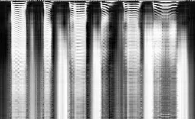
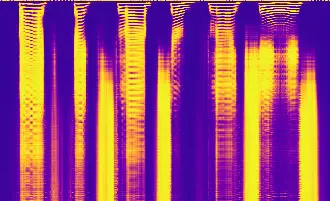
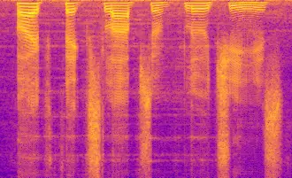
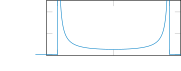
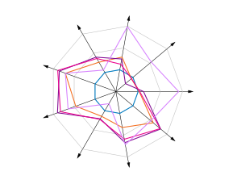

# BLINC: BLIND CALIBRATION FOR TRAINING-FREE SPEECH ENHANCEMENT ADAPTATION

Tobias Raichle    Ekaterina Gavrilko    Bin Yang

###### Abstract

Speech enhancement (SE) models degrade under domain shifts and have to
adapt to unseen target domains during deployment. Most existing
test-time adaptation (TTA) methods for SE do so by adapting a subset of
the model weights using a self-supervised loss, which requires
backpropagation at test-time and permanently alters the model. We
instead recalibrate the prediction itself and propose BLINC, a
training-free TTA method that remaps the predicted time-frequency mask
onto a bimodal target distribution by histogram matching. At test-time,
the target distribution is parameterized from blind features of the
noisy recording, so neither a reference distribution from a classical
algorithm nor online metric optimization is involved. BLINC improves the
overall quality of both evaluated SE models on almost every target
condition and matches or exceeds the loss-based TTA baselines at minimal
overhead.

###### Index Terms: 

Speech enhancement, test-time adaptation, training-free, deep learning

^(†)^(†)address: University of Stuttgart, Institute of Signal Processing
and System Theory, Stuttgart, Germany

## 1 INTRODUCTION

Deep learning has advanced speech enhancement (SE) to striking
performance, even in highly adverse noisy conditions \[1\]. However,
this performance rests on the assumption that test conditions resemble
those seen during training \[13\], which does not hold in practical
deployments. Since no training dataset can cover the full diversity of
speakers and acoustic environments, SE models inevitably encounter
domain shifts, causing them to degrade. To ensure consistent performance
under such shifts, models must adapt to the target domain. For many
tasks, target data is collected and annotated for this purpose. Such
annotation is impossible in SE, as the clean reference of a noisy
recording cannot be restored. Adaptation for SE must therefore be
unsupervised.

Test-time adaptation (TTA) adapts to the target domain simultaneously
with inference, using only the pre-trained model and unlabeled target
data. As opposed to unsupervised domain adaptation (UDA), TTA does not
assume access to source data, which is often unavailable at deployment
due to storage and privacy concerns. Most TTA methods for SE achieve
this by constructing a self-supervised loss to adapt a subset of the
model’s weights \[13, 17, 12, 6\]. However, this comes at the cost of
gradient computations, needs to ramp up, permanently alters the model
and can become unstable over time due to error accumulation.

Instead, the prediction can be corrected in place at test-time, leaving
the model weights untouched. In-place correction requires knowing what
the prediction should have been. Existing methods achieve this by
searching for the correction that maximizes a non-intrusive metric,
i.e., one that takes only the estimate as input \[11\]. For mask-based
SE models, we show that this can be established in advance.

Under domain shifts, the predicted time-frequency (TF) mask loses its
characteristic distribution, reducing enhancement performance \[12\]. We
find that the distribution it should follow is captured by a compact
parametric family, whose parameters are predictable from blind features
of the noisy recording, requiring no clean reference. We therefore
propose BLINC¹¹ 1 Code available at
[https://github.com/tobiaaa/SETTA](https://github.com/tobiaaa/SETTA).,
which recalibrates the predicted TF mask by histogram matching (cf.
Fig. 1). Whereas a self-supervised loss can be optimized in a background
task, direct correction must happen synchronously, so costly online
metric optimization introduces significant latency. As BLINC requires no
such search at test-time, it adds minimal overhead.


BLINC

$`\mathbf{Y}`$$`\widehat{\mathbf{X}}`$$`\theta`$$`\mathbf{Y}`$$`\widehat{\mathbf{X}}`$

Figure 1: Loss-based TTA minimizes a loss $`\mathcal{L}`$ at test-time,
adjusting either the model weights $`\theta`$ or the prediction
$`\widehat{\mathbf{X}}`$. BLINC instead recalibrates the prediction of
the frozen model in a single step without a loss.

Our contributions are as follows.

- •
  We propose BLINC, a training-free TTA method that adapts mask-based SE
  models by histogram matching, requiring neither weight updates nor
  online metric optimization.
- •
  We construct a signal-dependent target distribution from blind
  features of the noisy recording, with coefficients fitted offline
  against an SE metric.
- •
  We analyze what the distribution calibration can and cannot repair,
  separating the removable calibration error from the persistent ranking
  error. This also explains where our approach reaches its limits.


$`\mathbf{M}`$


$`F_{\mathrm{pred}}(\mathbf{M})`$


$`\widetilde{\mathbf{M}}`$Feature Extraction


Parametric
Distribution$`\mathbf{Y}`$$`Q_{\mathrm{target}}`$$`\odot`$$`\widehat{\mathbf{X}}`$

Figure 2: Overview of BLINC. The frozen SE model predicts the mask
$`\mathbf{M}`$, which $`F_{\mathrm{pred}}`$ and $`Q_{\mathrm{target}}`$
remap to $`\widetilde{\mathbf{M}}`$. $`Q_{\mathrm{target}}`$ is
parameterized from blind features of $`\mathbf{Y}`$.


(a) Quantile function $`Q_{\mathrm{target}}`$



(b) Induced density $`f_{\mathrm{target}}`$

Figure 3: $`F_{\mathrm{pred}}`$Parametric target $`Q_{\mathrm{target}}`$
with floor $`c`$, midpoint $`b`$ and sharpness $`a`$, and the density it
induces.$`\widetilde{\mathbf{M}}`$

## 2 RELATED WORK

Most TTA methods for SE adapt the model by minimizing a self-supervised
loss, and differ mainly in how that loss is constructed. The first
TTA-compatible approach to adapt SE models was RemixIT \[17\], which
uses a teacher model to construct a weakly labeled dataset that is used
to train a student model. LaDen \[13\] constructs pseudo-labels and
computes a loss in the embedding space of a large speech encoder.
In \[6\], the authors propose using a pre-trained clean speech prior as
the target for adaptation. In MPol \[12\], mask-based SE models are
adapted by comparing the predicted mask distribution to that of a more
robust, yet low-fidelity, classical reference. The predicted
distribution is therefore pulled toward that of a suboptimal reference,
bounding the adaptation. Adapting the model in this way requires
backpropagation at test-time and can become unstable as errors
accumulate over long deployments.

Instead, the rethink-and-refine correction module \[11\], denoted RaR,
refines the prediction directly. The predicted waveform is locally
interpolated with the noisy signal to reduce over-suppression by
optimizing the interpolation with respect to a non-intrusive SE metric.
The interpolation weights are chosen per speech unit, which requires an
automatic speech recognition (ASR) model to segment the recording. Both
the segmentation and the optimization run at test-time, which introduces
significant overhead and is confined to metrics that are non-intrusive
and differentiable. Moreover, interpolating toward the noisy recording
can only restore over-suppressed content, and reintroduces noise
proportionally to restoration.

## 3 METHODOLOGY

We consider mask-based SE, where a noisy recording in the TF domain is
modeled as $`\mathbf{Y}=\mathbf{X}+\mathbf{N}\in\mathbb{C}^{F\times T}`$
with clean speech $`\mathbf{X}`$ and additive noise $`\mathbf{N}`$. A
model predicts a real-valued mask
$`\mathbf{M}\in\mathbb{R}^{F\times T}`$ over $`F`$ frequency bins and
$`T`$ frames that weights each bin of $`\mathbf{Y}`$, forming the
estimate $`\widehat{\mathbf{X}}=\mathbf{M}\odot\mathbf{Y}`$, where
$`\odot`$ is the elementwise product.

In the source domain, the predicted mask $`\mathbf{M}`$ is bimodal, with
most entries close to either full attenuation or pass-through. Under
domain shifts this bimodality erodes and mask values accumulate at
intermediate levels, which degrades SE performance \[12\]. Since the
mask for each sample is available at inference, we recalibrate its
distribution directly, leaving the model weights untouched. The
recalibration requires two components, a mechanism that imposes a given
target distribution on the prediction (Sec. 3.1) and the target itself
(Secs. 3.2 and 3.3).

### 3.1 Histogram matching

Imposing a target distribution on the predicted mask is a histogram
matching problem, which the probability integral transform (PIT) solves
in closed form \[3\]. Let $`m`$ denote a generic entry of the predicted
mask $`\mathbf{M}`$. As illustrated in Fig. 4, applying the marginal
cumulative distribution function (CDF) $`F_{\mathrm{pred}}`$ of
$`\mathbf{M}`$ to its own entries maps them to a standard uniform
distribution, and a quantile function
$`Q_{\mathrm{target}}=F^{-1}_{\mathrm{target}}`$ maps them from there to
a target distribution

```math
\displaystyle\tilde{m}=Q_{\mathrm{target}}\bigl(F_{\mathrm{pred}}(m)\bigr). \tag{1}
```

The recalibrated mask
$`\widetilde{\mathbf{M}}\in\mathbb{R}^{F\times T}`$ follows
$`F_{\mathrm{target}}`$ instead of $`F_{\mathrm{pred}}`$.

Since the total remapping $`Q_{\mathrm{target}}\circ F_{\mathrm{pred}}`$
is non-decreasing, the $`k`$-th smallest entry remains the $`k`$-th
smallest after remapping. The recalibration therefore preserves the
ranking of the entries of $`\mathbf{M}`$ and replaces only their values,
i.e., their distribution. The ranking determines which TF bins are
attenuated more strongly than others and carries most of the structure
of the prediction. The distribution determines how much attenuation each
of the bins receives and thus the calibration of the mask.

As $`F_{\mathrm{pred}}`$ is unknown, we replace it by the empirical CDF
over the $`N=F\cdot T`$ entries of $`\mathbf{M}`$. The empirical PIT
assigns the $`k`$-th smallest entry the $`k`$-th target quantile

```math
\displaystyle\tilde{m}_{(k)}=Q_{\mathrm{target}}(k/N)\quad\forall k, \tag{2}
```

where $`\tilde{m}_{(k)}`$ denotes the $`k`$-th smallest entry of
$`\widetilde{\mathbf{M}}`$.

### 3.2 Bimodal target

Speech is spectrally more concentrated than ambient noise \[8\], so most
TF bins at signal-to-noise ratio (SNR) $`\gtrsim 0\,\text{dB}`$ are
dominated by a single source. A well-calibrated mask therefore
decisively separates attenuation from pass-through, concentrating its
value distribution into two modes \[12, 7\]. Since the remapping
consumes only the quantile function of the target (Eq. 1), we specify
this target directly via $`Q_{\mathrm{target}}`$ rather than through a
density. A bimodal distribution corresponds to a quantile function that
is flat near its ends and steep in between, which we model with the
sigmoid $`\sigma(x)=1/(1+\mathrm{e}^{-x})`$,

```math
\displaystyle Q_{\mathrm{target}}(x)=(1-c)\,\sigma\!\big(a(x-b)\big)+c. \tag{3}
```

The floor is set by $`c`$, the midpoint $`b`$ corresponds to the
fraction of bins assigned to the noise mode, and the sharpness $`a`$
controls the slope, as Fig. 4 illustrates. The floor attenuates the
noise mode rather than removing it, which retains speech misranked into
it and avoids the artifacts of complete suppression \[8\].

The bimodal shape fixes the family of the target $`Q_{\mathrm{target}}`$
but leaves its parameters open. A single quantile function cannot serve
every recording, since the exact distribution of a well-calibrated mask
differs between signals. The midpoint, for instance, varies with the
amount of speech the recording contains. We therefore construct a target
distribution for each input signal.

### 3.3 Blind parameter estimation

We propose that the calibration target can be constructed from simple,
blind features extracted from the respective noisy signal, that is,
features that require no clean reference. Since the midpoint $`b`$ is
the fraction of bins in the noise mode, its natural feature is the
speech-activity fraction $`P_{\mathrm{Sp}}`$ \[4\]. The floor and the
sharpness balance residual noise against lost speech, and that balance
also shifts with the speech content, so we model all three parameters,
$`a,b`$ and $`c`$, as affine functions of $`P_{\mathrm{Sp}}`$.

Deriving the coefficients of these affine functions requires an
objective for the calibration. For a correct ranking, an optimal
calibration could attenuate exactly the noise in each bin, restoring the
clean magnitude. In practice the ranking contains errors, so every
calibration passes noise or removes speech, and different use cases
weigh these errors differently. Optimality is therefore relative to a
criterion, for which we use an SE metric. Following \[1\], we use
PESQ \[15\], so the optimal target distribution for a signal is the one
that yields the highest PESQ for that signal. Fig. 4 illustrates the
relationship between $`P_{\mathrm{Sp}}`$ and the optimal midpoint $`b`$.


Figure 4: Signal-wise optimal midpoint $`b`$ over the blind
speech-activity fraction $`P_{\mathrm{Sp}}`$.

We fit the coefficients offline by maximizing the criterion averaged
over a validation dataset. As there are only six coefficients, a
black-box search suffices, so the criterion need not be differentiable.

At test-time, $`P_{\mathrm{Sp}}`$ is computed from the noisy mixture and
mapped to $`(\hat{a},\hat{b},\hat{c})`$, which define
$`Q_{\mathrm{target}}`$ through Eq. 3 and thus the remapping in Eq. 2.
The target $`Q_{\mathrm{target}}`$ contains no scale parameter, since a
global scale is unidentifiable under scale-invariant criteria like PESQ,
although it does affect signal-level metrics. We therefore rescale the
enhanced waveform to the estimated speech power

```math
\displaystyle P_{\mathrm{out}}=\frac{\mathrm{SNR}}{1+\mathrm{SNR}}\,P_{\mathrm{in}}, \tag{4}
```

where $`P_{\mathrm{in}}`$ is the power of the noisy mixture and the
$`\mathrm{SNR}`$ is estimated blindly according to \[4\] for each
recording.

## 4 EXPERIMENTS

### 4.1 Datasets

Following \[13, 12\], we train the source SE models on EARS+WHAM!
(EARS-W) \[14, 20\] and evaluate the TTA methods on various target
domains to isolate the effect of different domain shifts. EARS+DEMAND
(EARS-D) \[14, 16\] retains the source speech corpus and replaces the
noise, whereas VoiceBank+WHAM! (VBW) \[19, 20\] retains the noise and
replaces the speech. VoiceBank+DEMAND (VBD) \[19, 16, 18\] replaces
both, and the deep noise suppression (DNS) challenge test set \[2\]
additionally covers six languages.

Since the optimal calibration depends on how reliable the underlying
ranking is (cf. Sec. 3.3), coefficients fitted on the source domain
would be tuned to an unrealistically accurate ranking. We therefore fit
the coefficients on a separate validation domain, for which we mix the
studio recordings of DAPS \[10\] with the ambient noise of TAU \[9\].
Neither corpus overlaps with any of the target domains and the
coefficients are applied unchanged throughout.

### 4.2 Models

Since BLINC recalibrates the predicted mask, it applies to mask-based SE
models, which cover a large share of current architectures. To test
whether the method transfers across architectures, we evaluate on two
different models. To represent simple architectures, we use a
lightweight amplitude masking (AM) model \[13\] trained with an MSE
loss. CMGAN \[1\] represents the current state of the art with an
explicit perceptual focus and refines its magnitude mask with a complex
additive term, so it is mask-based only in a wider sense.

The six coefficients of Sec. 3.3 are fitted separately for each model,
as the models differ in ranking reliability under domain shifts and the
additive term changes the role of the CMGAN mask.

### 4.3 Experimental details

Perceptual quality is measured by PESQ \[15\] and the composite measures
CSIG, CBAK and COVL \[5\], signal-level quality by segmental
signal-to-noise ratio (SSNR) and scale-invariant signal-to-distortion
ratio (SI-SDR).

We compare against the unadapted source model and against
RemixIT \[17\], LaDen \[13\] and MPol \[12\], using the hyperparameters
reported by their authors. All TTA methods adapt the same source
checkpoints. No complete official implementation of RaR \[11\] is
available, so we re-implement it following the description in the paper.
As the re-implementation cannot be validated against the original, RaR
is compared on computational cost only, which depends on the steps of
the method rather than on their exact tuning. Tab. 1 shows the real-time
factors (RTFs) of the compared methods evaluated on an Nvidia RTX Pro
6000 GPU. As BLINC does not require backpropagation, parameter updates
or online metric optimization, its computational overhead is negligible.

|        |         |       |       |       |       |
| ------ | ------- | ----- | ----- | ----- | ----- |
| Source | RemixIT | LaDen | MPol  | RaR   | BLINC |
| 0.003  | 0.014   | 0.372 | 0.032 | 0.903 | 0.003 |

Table 1: RTF $`\downarrow`$ with the AM model on VBD. Factors $`\leq 1`$
indicate real-time capability.

|       |         |                                         |                                         |                                         |                                         |                                         |                                           |
| ----- | ------- | --------------------------------------- | --------------------------------------- | --------------------------------------- | --------------------------------------- | --------------------------------------- | ----------------------------------------- |
|       |         | $`\overline{\text{PESQ}}`$ $`\uparrow`$ | $`\overline{\text{CSIG}}`$ $`\uparrow`$ | $`\overline{\text{CBAK}}`$ $`\uparrow`$ | $`\overline{\text{COVL}}`$ $`\uparrow`$ | $`\overline{\text{SSNR}}`$ $`\uparrow`$ | $`\overline{\text{SI-SDR}}`$ $`\uparrow`$ |
| AM    | Source  | $`2.05`$                                | $`3.07`$                                | $`2.78`$                                | $`2.52`$                                | $`7.42`$                                | $`12.28`$                                 |
|       | RemixIT | $`2.06`$                                | $`3.10`$                                | $`2.80`$                                | $`2.54`$                                | 7.48                                    | 12.47                                     |
|       | LaDen   | $`2.13`$                                | $`3.13`$                                | $`2.80`$                                | $`2.59`$                                | $`7.01`$                                | $`12.33`$                                 |
|       | MPol    | $`2.10`$                                | $`3.17`$                                | 2.82                                    | $`2.60`$                                | $`7.40`$                                | $`12.35`$                                 |
|       | BLINC   | 2.17                                    | 3.21                                    | $`2.78`$                                | 2.66                                    | $`6.19`$                                | $`11.50`$                                 |
| CMGAN | Source  | $`2.60`$                                | $`3.75`$                                | $`3.02`$                                | $`3.15`$                                | $`6.00`$                                | $`11.32`$                                 |
|       | RemixIT | $`2.60`$                                | $`3.77`$                                | $`3.03`$                                | $`3.17`$                                | $`5.92`$                                | $`11.52`$                                 |
|       | LaDen   | $`2.62`$                                | 3.81                                    | 3.07                                    | $`3.20`$                                | 6.31                                    | 12.09                                     |
|       | MPol    | $`2.64`$                                | $`3.78`$                                | 3.07                                    | $`3.20`$                                | $`6.27`$                                | $`11.78`$                                 |
|       | BLINC   | 2.66                                    | 3.81                                    | $`3.02`$                                | 3.22                                    | $`5.17`$                                | $`9.42`$                                  |

Table 2: Evaluation results averaged over the target datasets. SSNR and
SI-SDR in dB.

## 5 RESULTS


(a) AM



(b) CMGAN


Figure 5: $`\Delta`$COVL per target domain relative to the source model.

BLINC achieves the highest PESQ, CSIG and COVL of all methods on both
models in Tab. 2, at nearly the RTF of the source model. As PESQ was
used as the criterion to derive the coefficients of Sec. 3.3, the
calibration retains speech at the cost of residual noise, which raises
CSIG, leaves CBAK flat and sacrifices signal-level quality.

On the AM model, Fig. 5 shows a gain on every target condition, which is
the largest of all methods on all but EARS-D and grows with the severity
of the shift. On CMGAN, BLINC leads on EARS-D, VBW and VBD, where the
loss-based baselines gain little or lose, but trails LaDen and MPol on
most of the DNS conditions and falls below the source model on one of
them. Since the remapping removes calibration error only, this suggests
that the DNS shift also degrades the ranking of the stronger model,
which recalibration cannot repair. As CMGAN complements its mask with an
additive term, the gains from recalibrating the mask alone suggest that
miscalibration is a general failure mode of TF masking under domain
shift.

### 5.1 Ablation study

| Target           | PESQ$`\uparrow`$ | SI-SDR$`\uparrow`$ |
| ---------------- | ---------------- | ------------------ |
| Source           | 2.42             | 11.49              |
| Constant target  | 2.45             | 10.73              |
| BLINC            | 2.55             | 11.24              |
| BLINC, SI-SDR    | 2.29             | 12.21              |
| BLINC, in-domain | 2.65             | 11.02              |
| Sigmoid oracle   | 2.75             | 11.02              |
| Free-form oracle | 2.79             | 10.93              |

Table 3: Ablation study with the AM model on VBD. The lower block uses
information unavailable at test-time. SI-SDR in dB.

Tab. 3 relaxes the construction of the target, from a signal-independent
one to oracles that use ground-truth information. A constant target
retains the bimodal shape but applies the same quantile function to
every recording. It achieves a small perceptual gain over the source
model at a large signal-level cost. The signal-dependent target of BLINC
improves on it in both metrics, gaining more perceptual quality while
recovering most of the signal-level loss.

Fitting the coefficients to SI-SDR instead of PESQ reverses the trade,
improving signal-level performance over the source model at a perceptual
cost. This illustrates the impact of the calibration criterion.

As described in Sec. 4.1, the optimal calibration parameters depend on
the model degradation and thus on the domain. Fitting the coefficients
on the target domain achieves further perceptual gain, quantifying the
cost of transferring them from the validation domain.

The last two rows of Tab. 3 compute the optimal quantile function for
each recording, either from the sigmoid family of Sec. 3.2 or as a
free-form piecewise linear function. Against the sigmoid oracle, the
in-domain fit shows what is lost by modeling the parameters as affine
functions of $`P_{\mathrm{Sp}}`$. The sigmoid oracle comes close to the
free-form oracle, indicating that the sigmoid family is sufficiently
expressive. The free-form oracle approximates the ceiling of any
rank-preserving correction, and the remaining error is attributable to
ranking error.

## 6 CONCLUSION

We presented BLINC, a training-free TTA method for SE that recalibrates
the predicted mask in place and matches or exceeds the loss-based
baselines at nearly the cost of the source model alone. Our key finding
is that the distribution the mask should follow is known in advance,
since a compact parametric family captures it and blind features of the
noisy recording predict its parameters. Histogram matching onto this
target leaves the model untouched and applies to any mask-based SE
model. The gains on CMGAN suggest that miscalibration is a general
failure mode of TF masking under domain shift. The distinction between
calibration and ranking error explains where these gains saturate and
where weight adaptation retains an advantage. By removing the online
metric search, this work makes in-place correction a practical
alternative to weight adaptation where backpropagation is prohibitive.

The focus of the calibration follows the criterion, and fitting against
PESQ incentivizes perceptual quality at a signal-level cost. Fitting
against several criteria jointly or regularizing the coefficients could
enable a broader focus. Future work should explore the use of additional
blind features to improve the blind parameter estimation. Additionally,
extending to corruptions beyond additive noise, such as reverberation,
is left for future research.

## References

- \[1\] S. Abdulatif, R. Cao, and B. Yang (2024) CMGAN: conformer-based
  Metric-GAN for monaural speech enhancement. IEEE/ACM Transactions on
  Audio, Speech, and Language Processing 32 (), pp. 2477–2493. External
  Links: [Document](https://dx.doi.org/10.1109/TASLP.2024.3393718) Cited
  by: §1, §3.3, §4.2.
- \[2\] H. Dubey, V. Gopal, R. Cutler, S. Matusevych, S. Braun, E. S.
  Eskimez, M. Thakker, T. Yoshioka, H. Gamper, and R. Aichner (2022)
  ICASSP 2022 deep noise suppression challenge. In ICASSP, Cited by:
  §4.1.
- \[3\] R. A. Fisher (1992) Statistical methods for research workers. In
  Breakthroughs in Statistics: Methodology and Distribution, S. Kotz
  and N. L. Johnson (Eds.), External Links: ISBN 978-1-4612-4380-9,
  [Document](https://dx.doi.org/10.1007/978-1-4612-4380-9%5F6),
  [Link](https://doi.org/10.1007/978-1-4612-4380-9_6) Cited by: §3.1.
- \[4\] T. Gerkmann and R. C. Hendriks (2011) Noise power estimation
  based on the probability of speech presence. In 2011 IEEE Workshop on
  Applications of Signal Processing to Audio and Acoustics (WASPAA),
  Vol. , pp. 145–148. External Links:
  [Document](https://dx.doi.org/10.1109/ASPAA.2011.6082266) Cited by:
  §3.3, §3.3.
- \[5\] Y. Hu and P. C. Loizou (2008) Evaluation of objective quality
  measures for speech enhancement. IEEE Transactions on Audio, Speech,
  and Language Processing 16 (1), pp. 229–238. External Links:
  [Document](https://dx.doi.org/10.1109/TASL.2007.911054) Cited by:
  §4.3.
- \[6\] S. Kammoun, S. Leglaive, X. Alameda-Pineda, and T.
  Gerkmann (2026) Test-time adaptation for speech enhancement with an
  autoregressive speech prior. arXiv preprint arXiv:2609.03622. External
  Links: [Link](https://arxiv.org/abs/2609.03622) Cited by: §1, §2.
- \[7\] Y. Li and D. Wang (2008) On the optimality of ideal binary
  time-frequency masks. In 2008 IEEE International Conference on
  Acoustics, Speech and Signal Processing, Vol. , pp. 3501–3504.
  External Links:
  [Document](https://dx.doi.org/10.1109/ICASSP.2008.4518406) Cited by:
  §3.2.
- \[8\] P. C. Loizou (2013) Speech enhancement: theory and practice. 2nd
  edition, CRC Press, Inc., USA. External Links: ISBN 1466504218 Cited
  by: §3.2, §3.2.
- \[9\] A. Mesaros, T. Heittola, and T. Virtanen (2018) A multi-device
  dataset for urban acoustic scene classification. In Proceedings of the
  Detection and Classification of Acoustic Scenes and Events 2018
  Workshop (DCASE2018), pp. 9–13. External Links:
  [Link](https://arxiv.org/abs/1807.09840) Cited by: §4.1.
- \[10\] G. J. Mysore (2015) Can we automatically transform speech
  recorded on common consumer devices in real-world environments into
  professional production quality speech?—a dataset, insights, and
  challenges. IEEE Signal Processing Letters 22 (8), pp. 1006–1010.
  External Links:
  [Document](https://dx.doi.org/10.1109/LSP.2014.2379648) Cited by:
  §4.1.
- \[11\] M. Qu, Y. Chen, and J. Hirschberg (2026) Mitigating
  over-suppression in speech enhancement via inference-time
  rethink-and-refine correction module. arXiv preprint arXiv:2608.07781.
  Cited by: §1, §2, §4.3.
- \[12\] T. Raichle, E. Amini, and B. Yang (2026) Test-time adaptation
  for speech enhancement via mask polarization. In ICASSP 2026 - 2026
  IEEE International Conference on Acoustics, Speech and Signal
  Processing (ICASSP), Vol. , pp. 18882–18886. External Links:
  [Document](https://dx.doi.org/10.1109/ICASSP55912.2026.11464881) Cited
  by: §1, §1, §2, §3.2, §3, §4.1, §4.3.
- \[13\] T. Raichle, N. Edinger, and B. Yang (2026) Test-time adaptation
  for speech enhancement via domain invariant embedding transformation.
  IEEE Open Journal of Signal Processing 7 (), pp. 134–143. External
  Links: [Document](https://dx.doi.org/10.1109/OJSP.2026.3656059) Cited
  by: §1, §1, §2, §4.1, §4.2, §4.3.
- \[14\] J. Richter, Y. Wu, S. Krenn, S. Welker, B. Lay, S. Watanabe, A.
  Richard, and T. Gerkmann (2024) EARS: an anechoic fullband speech
  dataset benchmarked for speech enhancement and dereverberation. In
  ISCA Interspeech, pp. 4873–4877. Cited by: §4.1.
- \[15\] A. W. Rix, J. G. Beerends, M. Hollier, and A. P. Hekstra (2001)
  Perceptual evaluation of speech quality (PESQ)-a new method for speech
  quality assessment of telephone networks and codecs. 2001 IEEE
  International Conference on Acoustics, Speech, and Signal Processing.
  Proceedings (Cat. No.01CH37221) 2, pp. 749–752 vol.2. External Links:
  [Link](https://api.semanticscholar.org/CorpusID:5325454) Cited by:
  §3.3, §4.3.
- \[16\] J. Thiemann, N. Ito, and E. Vincent (2013) The diverse
  environments multi-channel acoustic noise database (DEMAND): a
  database of multichannel environmental noise recordings. The Journal
  of the Acoustical Society of America 133, pp. 3591. External Links:
  [Document](https://dx.doi.org/10.1121/1.4806631) Cited by: §4.1.
- \[17\] E. Tzinis, Y. Adi, V. K. Ithapu, B. Xu, P. Smaragdis, and A.
  Kumar (2022) RemixIT: Continual self-training of speech enhancement
  models via bootstrapped remixing. IEEE Journal of Selected Topics in
  Signal Processing 16 (6), pp. 1329–1341. Cited by: §1, §2, §4.3.
- \[18\] C. Valentini-Botinhao, X. Wang, S. Takaki, and J.
  Yamagishi (2016) Investigating RNN-based speech enhancement methods
  for noise-robust Text-to-Speech. In 9th ISCA Speech Synthesis Workshop
  (SSW 9), pp. 146–152. External Links:
  [Document](https://dx.doi.org/10.21437/SSW.2016-24) Cited by: §4.1.
- \[19\] C. Veaux, J. Yamagishi, and S. King (2013) The voice bank
  corpus: design, collection and data analysis of a large regional
  accent speech database. In 2013 International Conference Oriental
  COCOSDA held jointly with 2013 Conference on Asian Spoken Language
  Research and Evaluation (O-COCOSDA/CASLRE), Vol. , pp. 1–4. External
  Links: [Document](https://dx.doi.org/10.1109/ICSDA.2013.6709856) Cited
  by: §4.1.
- \[20\] G. Wichern, J. Antognini, M. Flynn, L. R. Zhu, E. McQuinn, D.
  Crow, E. Manilow, and J. L. Roux (2019) WHAM!: Extending speech
  separation to noisy environments. In Proc. Interspeech 2019,
  pp. 1368–1372. Cited by: §4.1.
