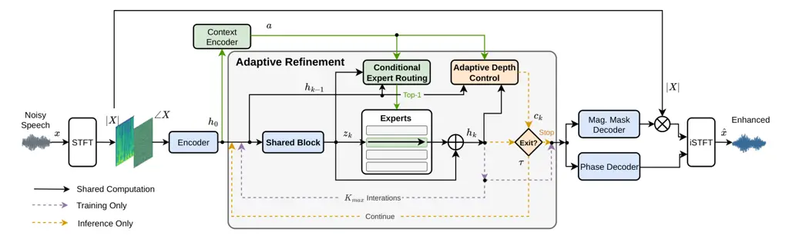

# Adaptive Depth and Expert Refinement for Efficient Speech Enhancement

Xikun
Lu[](https://orcid.org/0000-0003-0156-8805)
   Yujian
Ma[](https://orcid.org/0009-0006-1652-5903)
   Yunda
Chen[](https://orcid.org/0000-0003-4470-7262)
   Xianquan
Jiang[](https://orcid.org/0009-0009-4360-4836)
   Jinqiu
Sang[](https://orcid.org/0000-0002-4368-8787)
^(†)^(†)thanks: \$∗\$ Corresponding author: Jinqiu Sang
(jqsang@mail.ecnu.edu.cn).

###### Abstract

Most neural speech enhancement systems use a fixed processing depth for
all inputs, which can introduce unnecessary computation when fewer
refinement steps are sufficient. We propose _Adaptive Depth and Expert
Refinement_ (ADER), a parameter-shared progressive enhancement framework
with input-dependent computation. ADER combines an _Adaptive Depth
Controller_ (ADC) for hard early termination with a _Conditional Expert
Router_ (CER) that selects one lightweight residual adapter at each
executed refinement iteration. We further introduce _Exit-aware
Intermediate Supervision_ (EIS) to directly optimize candidate
intermediate outputs for early exit. On VCTK-DEMAND, ADER reduces the
parameter count and average computation of MP-SENet by 70.4% and 51.3%,
respectively, while achieving a WB-PESQ of 3.37. Overall, ADER enables
input-dependent refinement and reduces redundant computation during
inference.

###### Index Terms: 

Speech enhancement, adaptive computation, early exiting, parameter
sharing, conditional computation.

^(†)^(†)address: ¹ Shanghai Institute of Artificial Intelligence for
Education, East China Normal University, China  
² Guangdong Key Laboratory of Intelligent Information Processing,
Shenzhen University, China  
³ Boin Hearing Technology (Shanghai) Co., LTD, China  
⁴ School of Computer Science and Technology, East China Normal
University, China

## 1 Introduction

Deep learning has driven substantial progress in monaural speech
enhancement (SE), including complex-valued spectral modeling,
phase-aware estimation, and time–frequency (TF) sequence modeling \[7,
23, 4, 1, 13\]. Recent studies have further examined the effects of
network architecture, model size, and computational budget on SE
performance \[24\]. As SE systems are increasingly deployed under
real-time and resource constraints, computational efficiency has become
an important design consideration. A central problem is therefore to
reduce inference cost while retaining effective TF modeling for SE.

Existing studies have addressed this problem by designing more efficient
SE architectures. FullSubNet combines full-band and sub-band modeling
for real-time enhancement \[6\], while DeepFilterNet uses deep filtering
and grouped operations for low-complexity full-band processing \[17\].
BLOOM-Net further introduces blockwise optimization to produce scalable
intermediate enhancement outputs \[10\]. A different approach is to
reduce parameter redundancy through block reuse. Kim _et al._ proposed a
progressive SE framework that repeatedly applies a shared processing
block instead of stacking independently parameterized blocks \[9\]. This
design enables progressive refinement with substantially fewer
independent parameters. However, the repetition depth is predefined and
remains fixed during inference. Consequently, all utterances undergo the
same number of refinement iterations, even when fewer iterations may be
sufficient for some inputs.

Dynamic computation provides a direct way to adapt the number of
executed refinement steps. Adaptive Computation Time introduced
input-dependent computational depth in recurrent networks \[5\], and
related ideas have subsequently been applied to speech processing. Li
_et al._ introduced early exit into progressive SE using the difference
between consecutive enhancement outputs as a stopping criterion \[11\].
Dynamic nsNet2 incorporates multiple exits into a noise suppression
network to vary inference cost across inputs \[14\]. Early-exit
Transformers have also been studied for continuous speech separation
\[2\]. More recently, Olsen _et al._ introduced probabilistic stopping
criteria for speech separation and enhancement \[15\]. These studies
demonstrate that processing depth can be adapted to individual inputs.
For a block-reuse architecture, however, adaptive depth alone does not
address the limited flexibility of full parameter sharing. As refinement
proceeds, the latent representation evolves, whereas the same shared
block is applied at every iteration. Sparse expert routing can
complement the shared block with lightweight state-dependent adaptation
\[18, 3\]. This suggests that block-reuse models should adapt the
refinement depth to each input and the refinement operation to the
current state.



Figure 1: Overview of the proposed ADER framework. A shared refinement
block is repeatedly applied to the encoded TF representation. At each
iteration, the CER selects one residual expert adapter, and the ADC
determines whether another refinement iteration is required.

Inspired by the roles of cellular proliferation and differentiation,
which respectively correspond to continuing refinement when needed and
applying specialized processing to the current state, we propose
_Adaptive Depth and Expert Refinement_ (ADER)¹¹ 1 Our source codes are
available online:
[https://github.com/Luxikun669/ADER](https://github.com/Luxikun669/ADER),
which combines a shared refinement backbone with adaptive depth control
and conditional expert routing. Specifically, our contributions are
threefold. 1) We introduce an _Adaptive Depth Controller_ (ADC) that
determines whether another refinement iteration should be executed,
allowing the number of repeated refinement steps to vary across
utterances. 2) We introduce a _Conditional Expert Router_ (CER) that
selects one lightweight residual adapter at each executed iteration
through straight-through Top-1 routing. This provides state-dependent
adaptation while keeping the main refinement block shared. 3) We
introduce _Exit-aware Intermediate Supervision_ (EIS), which applies the
complete enhancement objective to a randomly sampled intermediate
iteration during training, making intermediate outputs more reliable for
hard early exit. Experiments on VCTK-DEMAND evaluate the resulting
adaptive computation, refinement-depth behavior, and iteration-dependent
expert routing.

## 2 Proposed method

Figure 1 presents the overall architecture of the proposed ADER
framework. ADER is built on a parameter-shared progressive refinement
backbone, with the CER and ADC controlling the expert transformation and
refinement depth, respectively.

### 2.1 Shared Progressive Refinement

Let $`x\in\mathbb{R}^{L}`$ denote a noisy speech waveform with $`L`$
samples. Following the magnitude–phase front end of MP-SENet \[12\], its
STFT magnitude and phase are processed by the encoder $`E(\cdot)`$ to
obtain an initial TF representation
$`h_{0}\in\mathbb{R}^{C\times T\times F}`$, where $`C`$, $`T`$, and
$`F`$ denote the feature-channel, time-frame, and frequency-bin
dimensions, respectively.

The encoded representation $`h_{0}`$ is used in two ways. First, it
serves as the initial state of the progressive refinement process.
Second, a lightweight context encoder extracts $`a=E_{\rm ctx}(h_{0})`$,
which provides conditioning information to both CER and ADC throughout
the refinement process. The context encoder $`E_{\rm ctx}`$ consists of
a $`1\times 1`$ convolution, instance normalization, and PReLU.

ADER performs progressive refinement using a single TS-Transformer block
adopted from MP-SENet \[12\] as the shared refinement block
$`C_{\theta}`$. The block models temporal and spectral dependencies in
the TF representation and is recursively reused across refinement
iterations. At iteration $`k`$,

```math
z_{k}=C_{\theta}(h_{k-1}),\qquad k=1,\ldots,K_{\max}, \tag{1}
```

where $`h_{k-1}`$ is the current refinement state, $`z_{k}`$ is the
shared-block output before expert adaptation, and $`K_{\max}`$ denotes
the maximum refinement depth. For $`k=1`$, $`h_{k-1}=h_{0}`$; subsequent
iterations use the refined representation from the preceding iteration.
Since the parameters of $`C_{\theta}`$ are reused across iterations,
increasing the refinement depth does not introduce additional copies of
the refinement block.

### 2.2 Conditional Expert Routing

Although the backbone parameters are shared, the representation evolves
after each refinement iteration. ADER therefore introduces a lightweight
conditional expert branch to adapt the shared-block output according to
the current refinement state.

At refinement iteration $`k`$, the CER forms its routing descriptor from
$`h_{k-1}`$, $`z_{k}`$, and the acoustic context $`a`$. After global
average pooling,

```math
q_{k}^{\rm CER}=\left[P(h_{k-1}),P(z_{k}),P(a)\right], \tag{2}
```

where $`P(\cdot)`$ denotes global average pooling and $`[\cdot]`$
denotes feature concatenation. The absolute-difference term reflects the
change introduced by the shared refinement block, while $`a`$ provides
utterance-level context throughout the refinement process.

The router $`R_{\rm CER}`$ maps $`q_{k}^{\rm CER}`$ to an expert
probability distribution

```math
\pi_{k}=\operatorname{softmax}\left(\frac{R_{\rm CER}(q_{k}^{\rm CER})}{T_{r}}\right), \tag{3}
```

where $`T_{r}`$ denotes the routing temperature. We use $`M`$
lightweight expert adapters $`\{A_{m}\}_{m=1}^{M}`$. Each adapter
contains a bottleneck $`1\times 1`$ projection, a depthwise
$`3\times 3`$ convolution, and a $`1\times 1`$ output projection,
together with a learnable residual scale. This design keeps the expert
branch small relative to the shared refinement block.

During training, straight-through Gumbel Top-1 routing produces a
one-hot routing vector $`r_{k}\in\{0,1\}^{M}`$. The output of the
$`k`$-th refinement iteration is

```math
h_{k}=z_{k}+\sum_{m=1}^{M}r_{k,m}A_{m}(z_{k}). \tag{4}
```

Thus, the shared block is executed at every refinement iteration, while
only one expert adapter contributes to the forward output. During
inference, the selected expert is
$`m_{k}^{\star}=\arg\max_{m}\pi_{k,m}`$, and only $`A_{m_{k}^{\star}}`$
is evaluated.

To avoid routing collapse, we apply a Switch-style load-balancing loss
independently at each refinement iteration. For expert $`m`$, let
$`p_{k,m}`$ denote its mean soft routing probability and $`\ell_{k,m}`$
its hard selection frequency within the current batch. The balancing
term is

```math
\mathcal{L}_{\rm bal}=\frac{M}{K_{\max}}\sum_{k=1}^{K_{\max}}\sum_{m=1}^{M}\operatorname{sg}(\ell_{k,m})p_{k,m}, \tag{5}
```

where $`\operatorname{sg}(\cdot)`$ denotes stop-gradient. Computing this
term separately for each iteration encourages routing diversity without
requiring different copies of the main refinement block.

### 2.3 Adaptive Depth Control

Conditional expert routing changes the residual transformation used at
each refinement iteration, but it does not determine how many iterations
should be executed. We therefore introduce an ADC to decide whether the
current representation requires further refinement.

After each refinement iteration, the ADC determines whether further
refinement is required using $`h_{k-1}`$, $`h_{k}`$, and the acoustic
context $`a`$. Its input descriptor is

```math
\displaystyle q_{k}^{\rm ADC} \displaystyle=\left[P(h_{k-1}),P(h_{k}),P(a)\right], \tag{6}
```

```math
\displaystyle c_{k} \displaystyle=\sigma\!\left(R_{\rm ADC}(q_{k}^{\rm ADC})\right), \tag{7}
```

where $`R_{\rm ADC}`$ denotes the depth controller, $`\sigma(\cdot)`$ is
the sigmoid function, and $`c_{k}\in[0,1]`$ is the probability of
continuing to another refinement iteration.

ADER executes at least $`K_{\min}`$ and at most $`K_{\max}`$ refinement
iterations, where $`K_{\min}`$ and $`K_{\max}`$ denote the minimum and
maximum refinement depths, respectively. Once $`k\geq K_{\min}`$,
inference terminates when $`c_{k}<\tau`$, where $`\tau`$ is the
continuation threshold; otherwise, refinement proceeds to iteration
$`k+1`$. The resulting input-dependent refinement depth is therefore
$`N(x)\in\{K_{\min},\ldots,K_{\max}\}`$.

The ADC requires a training target indicating whether one more
refinement iteration is useful. We derive this target from the
reconstruction quality along the full refinement trajectory. For the
$`k`$-th iteration, we use

```math
Q_{k}=0.9\mathcal{L}_{\rm mag}^{(k)}+0.3\mathcal{L}_{\rm pha}^{(k)}+0.1\mathcal{L}_{\rm com}^{(k)}, \tag{8}
```

where $`\mathcal{L}_{\rm mag}^{(k)}`$, $`\mathcal{L}_{\rm pha}^{(k)}`$,
and $`\mathcal{L}_{\rm com}^{(k)}`$ denote the magnitude, phase, and
complex-spectrum reconstruction losses obtained from the output at
iteration $`k`$.

Let $`Q_{\rm best}=\min_{j\geq K_{\min}}Q_{j}`$ denote the best
reconstruction quality among the valid exit iterations. Rather than
forcing every sample to reach the globally best iteration, we select the
earliest iteration whose quality is sufficiently close to this minimum:

```math
N^{\star}=\min\left\{k\geq K_{\min}\,\middle|\,Q_{k}\leq(1+\delta)Q_{\rm best}\right\}, \tag{9}
```

where $`\delta`$ controls the allowed reconstruction difference from the
best iteration. The continuation target is then
$`t_{k}=\mathbb{I}[k<N^{\star}]`$, where $`\mathbb{I}[\cdot]`$ is the
indicator function.

Only decisions that would be reached before the target exit are included
when training the ADC. For sample $`i`$, we use the reachability weight
$`w_{i,k}^{\rm reach}=\mathbb{I}[K_{\min}\leq k\leq N_{i}^{\star}]`$.
The depth-control objective is

```math
\mathcal{L}_{\rm ADC}=\frac{1}{|\mathcal{K}|}\sum_{k\in\mathcal{K}}\frac{\sum_{i}w_{i,k}^{\rm reach}\,\mathrm{BCE}(c_{i,k},t_{i,k})}{\sum_{i}w_{i,k}^{\rm reach}+\epsilon}, \tag{10}
```

where $`\mathcal{K}=\{K_{\min},\ldots,K_{\max}-1\}`$ is the set of
actionable decisions, $`\mathrm{BCE}(\cdot)`$ denotes binary cross
entropy, and $`\epsilon`$ is a small constant for numerical stability.

### 2.4 Exit-Aware Intermediate Supervision and Training

Reliable intermediate outputs are required for hard early exit. However,
under full-depth training, task supervision is applied primarily to the
final refinement output, while intermediate states are optimized mainly
through subsequent refinement. This creates a mismatch between training
and adaptive-depth inference.

To reduce this mismatch, we introduce EIS. During training, ADER always
unfolds all $`K_{\max}`$ refinement iterations and uniformly samples one
intermediate iteration $`d\in\{K_{\min},\ldots,K_{\max}-1\}`$. The
corresponding representation $`h_{d}`$ is decoded by the same
magnitude-mask and phase decoders used for the final iteration and is
directly supervised by the complete enhancement objective.

For compact notation, the enhancement objective at iteration $`k`$ is
defined as

```math
\displaystyle\mathcal{L}_{\rm enh}^{(k)}={} \displaystyle 0.9\mathcal{L}_{\rm mag}^{(k)}+0.3\mathcal{L}_{\rm pha}^{(k)}+0.1\mathcal{L}_{\rm com}^{(k)}
```

```math
\displaystyle+0.1\mathcal{L}_{\rm stft}^{(k)}+0.05\mathcal{L}_{\rm metric}^{(k)}+0.2\mathcal{L}_{\rm time}^{(k)}, \tag{11}
```

where $`\mathcal{L}_{\rm stft}`$, $`\mathcal{L}_{\rm metric}`$, and
$`\mathcal{L}_{\rm time}`$ denote the multi-resolution STFT,
metric-based perceptual, and time-domain reconstruction losses,
respectively. The final and intermediate supervision terms are
$`\mathcal{L}_{\rm MP}=\mathcal{L}_{\rm enh}^{(K_{\max})}`$ and
$`\mathcal{L}_{\rm EIS}=\mathcal{L}_{\rm enh}^{(d)}`$, respectively. The
deepest iteration is excluded from EIS sampling because it is already
optimized by $`\mathcal{L}_{\rm MP}`$.

The overall training objective is

```math
\mathcal{L}=\mathcal{L}_{\rm MP}+\lambda_{\rm EIS}\mathcal{L}_{\rm EIS}+\lambda_{\rm bal}\mathcal{L}_{\rm bal}+\lambda_{\rm ADC}\mathcal{L}_{\rm ADC}, \tag{12}
```

where $`\lambda_{\rm EIS}=0.1`$,
$`\lambda_{\rm bal}=2.5\times 10^{-4}`$, and $`\lambda_{\rm ADC}=0.05`$.

Training is conducted in two stages. An initial 40-epoch warm-up stage
optimizes the enhancement, intermediate-supervision, and
routing-balancing objectives without $`\mathcal{L}_{\rm ADC}`$. The
complete objective in Eq. (12) is subsequently used for joint
optimization. All $`K_{\max}=5`$ refinement iterations are unrolled
during training, whereas hard early exit is enabled only at inference.

| Method               | $`D`$ | $`\bar{N}`$ | Param. (M)                 | GMACs/s                     | WB-PESQ                   | STOI (%) | SSNR  | CSIG | CBAK | COVL |
| -------------------- | ----- | ----------- | -------------------------- | --------------------------- | ------------------------- | -------- | ----- | ---- | ---- | ---- |
| MP-SENet \[12\]      | 4     | 4.00        | 2.26                       | 42.59                       | 3.50                      | 96.15    | 10.64 | 4.73 | 3.95 | 4.22 |
| MP-SENet\* \[12\]    | 2     | 4.00        | 1.75 ($`\downarrow`$22.6%) | 31.43 ($`\downarrow`$26.2%) | 3.47 ($`\downarrow`$0.9%) | 96.05    | 10.60 | 4.71 | 3.93 | 4.20 |
| Fixed Shared-Block   | 2     | 3.00        | 0.65 ($`\downarrow`$71.2%) | 25.02 ($`\downarrow`$41.3%) | 3.46 ($`\downarrow`$1.1%) | 95.85    | 10.52 | 4.70 | 3.92 | 4.19 |
| ADER ($`\tau=0.20`$) | 2     | 2.33        | 0.67 ($`\downarrow`$70.4%) | 21.99 ($`\downarrow`$48.4%) | 3.39 ($`\downarrow`$3.1%) | 95.71    | 10.34 | 4.69 | 3.88 | 4.14 |
| ADER ($`\tau=0.50`$) | 2     | 2.15        | 0.67 ($`\downarrow`$70.4%) | 20.73 ($`\downarrow`$51.3%) | 3.37 ($`\downarrow`$3.7%) | 95.67    | 10.30 | 4.68 | 3.87 | 4.13 |

Table 1: Overall comparison on VCTK-DEMAND. MP-SENet\* denotes the
reduced-depth MP-SENet with $`D=2`$. $`D`$ denotes the dense encoder
(and decoder) depth, while $`\bar{N}`$ denotes the mean number of
executed refinement iterations for block-reuse models. BOLD indicates
the best score in each metric.

## 3 Experiments and Results

### 3.1 Experimental Setup

We evaluate the proposed ADER framework on the standard VCTK-DEMAND
corpus \[22, 21\], using its 824-utterance test set. All audio is
resampled to 16 kHz. STFT analysis uses a 400-sample window with a
100-sample hop. The dense channel dimension is set to 64 and the dense
encoder depth to $`D=2`$. For ADER, the minimum and maximum refinement
depths are set to $`K_{\min}=2`$ and $`K_{\max}=5`$, respectively. We
use four expert adapters, each with a bottleneck channel dimension of
$`C/4`$.

All models are trained for 100 epochs using AdamW with a learning rate
of $`5\times 10^{-4}`$, $`\beta_{1}=0.8`$, $`\beta_{2}=0.99`$, with a
global batch size of 4. The CER uses straight-through Gumbel Softmax
with hard Top-1 selection during training and deterministic Top-1
routing during inference. The ADC objective is activated after an
initial 40-epoch warm-up stage.

We report wideband PESQ (WB-PESQ) \[16\], STOI \[19, 20\], segmental SNR
(SSNR), and the composite measures CSIG (signal distortion), CBAK
(background noise intrusiveness), and COVL (overall quality) \[8\].
Model complexity is measured by the number of parameters and the mean
multiply–accumulate operations per second of input audio (MACs/s). For
ADER, the MAC count is computed from the refinement iterations actually
executed for each utterance and then averaged over the test set.

### 3.2 Overall Comparison

Table 1 compares ADER with the original MP-SENet, its reduced-depth
MP-SENet\*, and the fixed shared-block baseline. ADER contains 0.67 M
parameters, reducing the parameter count of MP-SENet by 70.4%. With
$`\tau=0.20`$, ADER executes 2.33 refinement iterations on average and
requires 21.99 GMACs/s, corresponding to a 48.4% reduction in
computation relative to MP-SENet. Increasing the threshold to
$`\tau=0.50`$ further reduces the mean refinement depth to 2.15 and the
average computation to 20.73 GMACs/s, a 51.3% reduction relative to
MP-SENet.

Compared with the fixed shared-block model at $`\bar{N}=3`$, ADER trades
a moderate decrease in enhancement quality for lower average
computation. At $`\tau=0.20`$, the computational cost decreases from
25.02 to 21.99 GMACs/s, a reduction of 12.1%, while WB-PESQ decreases by
about 2.0% from 3.46 to 3.39. With $`\tau=0.50`$, the computation is
further reduced by 17.1% to 20.73 GMACs/s, with a corresponding 2.6%
decrease in WB-PESQ. Unlike the fixed-depth model, ADER selects the
executed refinement depth for each utterance, allowing the average
computational cost to be adjusted through the continuation threshold.

### 3.3 Component Analysis

| ADC | CER | EIS | $`\bar{N}`$ | Param. (M) | GMACs/s | WB-PESQ | STOI (%) |
| --- | --- | --- | ----------- | ---------- | ------- | ------- | -------- |
| –   | –   | –   | 3.00        | 0.65       | 25.02   | 3.46    | 95.85    |
| ✓   | –   | –   | 2.92        | 0.66       | 25.95   | 3.32    | 95.74    |
| –   | ✓   | –   | 3.00        | 0.67       | 25.19   | 3.43    | 95.81    |
| ✓   | ✓   | –   | 2.93        | 0.67       | 26.71   | 3.40    | 95.77    |
| ✓   | ✓   | ✓   | 2.15        | 0.67       | 20.73   | 3.37    | 95.67    |

Table 2: Component analysis of ADC, CER, and EIS. Adaptive variants use
$`\tau=0.50`$. BOLD indicates the best score in each metric.

Table 2 further examines the contributions of ADC, CER, and EIS.
Introducing ADC alone reduces WB-PESQ from 3.46 to 3.32, indicating that
direct early termination makes intermediate representations a major
source of quality degradation. CER alone causes a smaller reduction,
yielding a WB-PESQ of 3.43. When CER is combined with ADC, WB-PESQ
increases from 3.32 to 3.40, showing that conditional expert routing
improves the adaptive-depth configuration without changing its mean
refinement depth substantially.

Adding EIS shifts the adaptive model toward substantially shallower
execution. The mean refinement depth decreases from 2.93 to 2.15, while
the average computation decreases from 26.71 to 20.73 GMACs/s.
Meanwhile, WB-PESQ changes from 3.40 to 3.37. These results indicate
that direct supervision of intermediate outputs enables the ADC to
select earlier exits with a limited additional quality loss.

Figure 2: Analysis of refinement depth and adaptive computation in ADER.
(a) WB-PESQ under different forced depths $`\bar{N}`$. (b)
Computation–quality trade-off under different ADC continuation threshold
$`\tau`$.

### 3.4 Refinement Depth and Adaptive Computation

Figure 2(a) evaluates the EIS-trained model with ADC disabled and a
fixed refinement depth for all test utterances. WB-PESQ increases from
3.36 at $`\bar{N}=2`$ to 3.43 at $`\bar{N}=3`$, while further refinement
produces little additional improvement. This result indicates that the
perceptual benefit of progressive refinement largely saturates after the
third iteration, supporting the use of input dependent termination
rather than a fixed maximum depth for every utterance.

Figure 2(b) shows the computation–quality trade-off obtained by varying
the ADC continuation threshold without changing the model parameters.
Increasing $`\tau`$ from 0.20 to 0.50 reduces the mean refinement depth
from 2.33 to 2.15 and the average computation from 21.99 to
20.73 GMACs/s, while WB-PESQ decreases from 3.387 to 3.372. Thus, the
continuation threshold provides a direct control over the average
inference cost through hard input-dependent termination.

## 4 Conclusion

We presented ADER for efficient SE with parameter-shared progressive
refinement and input-dependent execution. By combining ADC, CER, and
EIS, ADER supports hard early termination while retaining a compact
shared refinement backbone. Experiments on VCTK-DEMAND show that ADER
substantially reduces model size and average computation, with the
continuation threshold providing a controllable trade-off between
computational cost and enhancement quality. Forced-depth evaluation
further shows limited WB-PESQ gains beyond the third refinement
iteration, while the component analysis demonstrates the complementary
roles of CER and EIS under adaptive-depth inference. These results show
that adaptive block reuse can reduce redundant computation in SE. The
current evaluation is limited to VCTK-DEMAND and an MP-SENet backbone.
Future work will examine ADER on broader datasets and other SE
architectures to assess its general applicability.

## References

- \[1\] S. Abdulatif, R. Cao, and B. Yang (2024) CMGAN: Conformer-based
  metric-GAN for monaural speech enhancement. IEEE ACM Trans. Audio
  Speech Lang. Process. 32, pp. 2477–2493. External Links:
  [Link](https://doi.org/10.1109/TASLP.2024.3393718),
  [Document](https://dx.doi.org/10.1109/TASLP.2024.3393718) Cited by:
  §1.
- \[2\] S. Chen, Y. Wu, Z. Chen, T. Yoshioka, S. Liu, J. Li, and X.
  Yu (2021) Don’t shoot butterfly with rifles: multi-channel continuous
  speech separation with early exit transformer. In Proc. IEEE Int.
  Conf. Acoust., Speech Signal Process. (ICASSP), pp. 6139–6143.
  External Links:
  [Link](https://doi.org/10.1109/ICASSP39728.2021.9413933),
  [Document](https://dx.doi.org/10.1109/ICASSP39728.2021.9413933) Cited
  by: §1.
- \[3\] W. Fedus, B. Zoph, and N. Shazeer (2022) Switch transformers:
  scaling to trillion parameter models with simple and efficient
  sparsity. J. Mach. Learn. Res. 23, pp. 120:1–120:39. External Links:
  [Link](https://jmlr.org/papers/v23/21-0998.html) Cited by: §1.
- \[4\] S. Fu, C. Yu, T. Hsieh, P. Plantinga, M. Ravanelli, X. Lu,
  and Y. Tsao (2021) MetricGAN+: An improved version of MetricGAN for
  speech enhancement. In Proc. Interspeech, pp. 201–205. External Links:
  [Link](https://doi.org/10.21437/Interspeech.2021-599),
  [Document](https://dx.doi.org/10.21437/INTERSPEECH.2021-599) Cited by:
  §1.
- \[5\] A. Graves (2016) Adaptive computation time for recurrent neural
  networks. arXiv preprint arXiv:1603.08983. Cited by: §1.
- \[6\] X. Hao, X. Su, R. Horaud, and X. Li (2021) FullSubNet: a
  full-band and sub-band fusion model for real-time single-channel
  speech enhancement. In Proc. IEEE Int. Conf. Acoust., Speech Signal
  Process. (ICASSP), pp. 6633–6637. External Links:
  [Document](https://dx.doi.org/10.1109/ICASSP39728.2021.9414177) Cited
  by: §1.
- \[7\] Y. Hu, Y. Liu, S. Lv, M. Xing, S. Zhang, Y. Fu, J. Wu, B. Zhang,
  and L. Xie (2020) DCCRN: Deep complex convolution recurrent network
  for phase-aware speech enhancement. In Proc. Interspeech,
  pp. 2472–2476. External Links:
  [Link](https://doi.org/10.21437/Interspeech.2020-2537),
  [Document](https://dx.doi.org/10.21437/INTERSPEECH.2020-2537) Cited
  by: §1.
- \[8\] Y. Hu and P. C. Loizou (2008) Evaluation of objective quality
  measures for speech enhancement. IEEE Trans. Audio Speech Lang.
  Process. 16 (1), pp. 229–238. External Links:
  [Link](https://doi.org/10.1109/TASL.2007.911054),
  [Document](https://dx.doi.org/10.1109/TASL.2007.911054) Cited by:
  §3.1.
- \[9\] J. Kim, U. Shin, J. Ko, and H. Park (2025) Stack less, repeat
  more: A block reusing approach for progressive speech enhancement. In
  Proc. Interspeech, External Links:
  [Link](https://doi.org/10.21437/Interspeech.2025-376),
  [Document](https://dx.doi.org/10.21437/INTERSPEECH.2025-376) Cited by:
  §1.
- \[10\] S. Kim and M. Kim (2022) Bloom-Net: Blockwise optimization for
  masking networks toward scalable and efficient speech enhancement. In
  Proc. IEEE Int. Conf. Acoust., Speech Signal Process. (ICASSP),
  pp. 366–370. External Links:
  [Link](https://doi.org/10.1109/ICASSP43922.2022.9746767),
  [Document](https://dx.doi.org/10.1109/ICASSP43922.2022.9746767) Cited
  by: §1.
- \[11\] A. Li, C. Zheng, L. Zhang, and X. Li (2021) Learning to
  inference with early exit in the progressive speech enhancement. In
  Proc. Eur. Signal Process. Conf. (EUSIPCO), pp. 466–470. External
  Links: [Link](https://doi.org/10.23919/EUSIPCO54536.2021.9616248),
  [Document](https://dx.doi.org/10.23919/EUSIPCO54536.2021.9616248)
  Cited by: §1.
- \[12\] Y. Lu, Y. Ai, and Z. Ling (2023) MP-SENet: A speech enhancement
  model with parallel denoising of magnitude and phase spectra. In Proc.
  Interspeech, pp. 3834–3838. External Links:
  [Link](https://doi.org/10.21437/Interspeech.2023-1441),
  [Document](https://dx.doi.org/10.21437/INTERSPEECH.2023-1441) Cited
  by: §2.1, §2.1, Table 1, Table 1.
- \[13\] Y. Lu, Y. Ai, and Z. Ling (2025) Explicit estimation of
  magnitude and phase spectra in parallel for high-quality speech
  enhancement. Neural Networks 189, pp. 107562. External Links: ISSN
  0893-6080,
  [Document](https://dx.doi.org/https%3A//doi.org/10.1016/j.neunet.2025.107562),
  [Link](https://www.sciencedirect.com/science/article/pii/S0893608025004411)
  Cited by: §1.
- \[14\] R. Miccini, A. Zniber, C. Laroche, T. Piechowiak, M.
  Schoeberl, L. Pezzarossa, O. Karrakchou, J. Sparsø, and M.
  Ghogho (2023) Dynamic nsNET2: Efficient deep noise suppression with
  early exiting. In Proc. IEEE Int. Workshop Mach. Learn. Signal
  Process. (MLSP), pp. 1–6. External Links:
  [Link](https://doi.org/10.1109/MLSP55844.2023.10285925),
  [Document](https://dx.doi.org/10.1109/MLSP55844.2023.10285925) Cited
  by: §1.
- \[15\] K. Olsen, M. Østergaard, K. Ulbæk, S. F. Nielsen, R. M. Høegh
  Lindrup, B. Jensen, and M. Mørup (2026) Knowing when to quit:
  probabilistic early exits for speech separation networks. In Proc.
  Int. Conf. Learning Representations (ICLR), Vol. 2026,
  pp. 104332–104352. External Links:
  [Link](https://proceedings.iclr.cc/paper_files/paper/2026/file/aac30fb088760e65c125b36cb26b926a-Paper-Conference.pdf)
  Cited by: §1.
- \[16\] A. W. Rix, J. G. Beerends, M. P. Hollier, and A. P.
  Hekstra (2001) Perceptual evaluation of speech quality (PESQ)-a new
  method for speech quality assessment of telephone networks and codecs.
  In Proc. IEEE Int. Conf. Acoust., Speech Signal Process. (ICASSP),
  pp. 749–752. External Links:
  [Link](https://doi.org/10.1109/ICASSP.2001.941023),
  [Document](https://dx.doi.org/10.1109/ICASSP.2001.941023) Cited by:
  §3.1.
- \[17\] H. Schröter, A. N. Escalante-B., T. Rosenkranz, and A.
  Maier (2022) DeepFilterNet: A low complexity speech enhancement
  framework for full-band audio based on deep filtering. In Proc. IEEE
  Int. Conf. Acoust., Speech Signal Process. (ICASSP), pp. 7407–7411.
  External Links:
  [Document](https://dx.doi.org/10.1109/ICASSP43922.2022.9747055) Cited
  by: §1.
- \[18\] N. Shazeer, A. Mirhoseini, K. Maziarz, A. Davis, Q. V.
  Le, G. E. Hinton, and J. Dean (2017) Outrageously large neural
  networks: the sparsely-gated mixture-of-experts layer. In Proc. Int.
  Conf. Learning Representations (ICLR), External Links:
  [Link](https://openreview.net/forum?id=B1ckMDqlg) Cited by: §1.
- \[19\] C. H. Taal, R. C. Hendriks, R. Heusdens, and J. Jensen (2010) A
  short-time objective intelligibility measure for time-frequency
  weighted noisy speech. In Proc. IEEE Int. Conf. Acoust., Speech Signal
  Process. (ICASSP), pp. 4214–4217. External Links:
  [Link](https://doi.org/10.1109/ICASSP.2010.5495701),
  [Document](https://dx.doi.org/10.1109/ICASSP.2010.5495701) Cited by:
  §3.1.
- \[20\] C. H. Taal, R. C. Hendriks, R. Heusdens, and J. Jensen (2011)
  An algorithm for intelligibility prediction of time–frequency weighted
  noisy speech. IEEE Trans. Audio Speech Lang. Process. 19 (7),
  pp. 2125–2136. External Links:
  [Document](https://dx.doi.org/10.1109/TASL.2011.2114881) Cited by:
  §3.1.
- \[21\] J. Thiemann, N. Ito, and E. Vincent (2013) The diverse
  environments multi-channel acoustic noise database (DEMAND): a
  database of multichannel environmental noise recordings. Proceedings
  of Meetings on Acoustics 19 (1), pp. 035081. External Links: ISSN
  1939-800X, [Document](https://dx.doi.org/10.1121/1.4799597),
  [Link](https://doi.org/10.1121/1.4799597),
  https://pubs.aip.org/asa/poma/article-pdf/doi/10.1121/1.4799597/18243068/pma.v19.i1.035081_1.online.pdf
  Cited by: §3.1.
- \[22\] C. Valentini-Botinhao (2017) Noisy speech database for training
  speech enhancement algorithms and TTS models. Note: University of
  Edinburgh, School of Informatics, Centre for Speech Technology
  Research (CSTR) External Links:
  [Document](https://dx.doi.org/10.7488/ds/2117) Cited by: §3.1.
- \[23\] D. Yin, C. Luo, Z. Xiong, and W. Zeng (2020) PHASEN: A
  phase-and-harmonics-aware speech enhancement network. In Proc. AAAI
  Conf. Artificial Intelligence, pp. 9458–9465. External Links:
  [Link](https://doi.org/10.1609/aaai.v34i05.6489),
  [Document](https://dx.doi.org/10.1609/AAAI.V34I05.6489) Cited by: §1.
- \[24\] W. Zhang, K. Saijo, J. Jung, C. Li, S. Watanabe, and Y.
  Qian (2024) Beyond performance plateaus: A comprehensive study on
  scalability in speech enhancement. In Proc. Interspeech, External
  Links: [Link](https://doi.org/10.21437/Interspeech.2024-1266),
  [Document](https://dx.doi.org/10.21437/INTERSPEECH.2024-1266) Cited
  by: §1.
