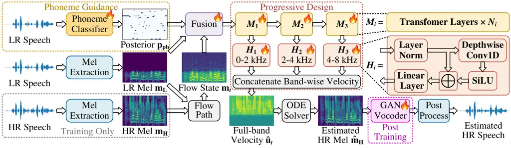
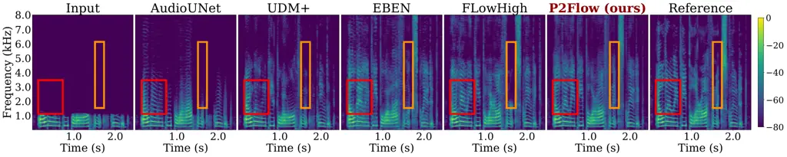

# P2Flow: Phoneme-aware Progressive Flow Matching for Extreme Speech Super-Resolution

Ningyuan Yang, Yize Li, Pu Zhao, Diego A. Cuji, Kanad Sarkar, Ryan M.
Corey, Xue Lin, Andrew C. Singer ^(†)^(†)thanks: ^(\*)Equal
contribution. Code is available
[here](https://github.com/ningyuan33/P2Flow).

###### Abstract

Generative models have recently demonstrated considerable promise in
speech super-resolution (SSR). Nevertheless, the majority of existing
work has concentrated on standard or versatile SSR configurations,
leaving the extreme setting with severely limited spectral inputs
largely unexplored. In this regime, current approaches exhibit marked
performance degradation, underscoring the need for dedicated solutions.
To bridge this gap, we introduce P2Flow, a phoneme-aware progressive
flow matching (FM) framework designed for extreme SSR with three main
strategies. First, our model leverages phonetic information to
reconstruct missing spectral components. Furthermore, it employs a
progressive architectural design that hierarchically restores distinct
frequency regions. Finally, we incorporate post-training of the vocoder
to enhance overall waveform fidelity. Extensive experiments are
conducted on the TIMIT and VCTK datasets under both 1 kHz to 16 kHz and
2 kHz to 16 kHz settings, demonstrating that P2Flow yields
state-of-the-art results across multiple evaluation metrics.

###### Index Terms: 

Flow Matching, Generative Models, Phoneme Awareness, Speech
Super-Resolution.

^(†)^(†)address: ¹Stony Brook University, NY, US   ²Northeastern
University, MA, US   ³UIUC, IL, US   ⁴UIC, IL, US

## 1 Introduction

ssr (ssr) \[40, 4\], historically termed as speech bandwidth
extension \[24\], aims to reconstruct hr (hr) speech from a lr (lr)
input. Early approaches \[16, 25, 1, 33, 35, 31\] have employed
discriminative models to learn direct lr-to-hr mappings, yet often
yielded over-smoothed spectra with limited hf (hf) details. More recent
generative paradigms  \[9, 26, 46\] have demonstrated superior hf
restoration: gan \[29, 8, 28, 20, 45\] improve perceptual realism via
adversarial training; diffusion models \[17, 7, 41, 27, 5\] achieve
high-fidelity reconstruction through iterative denoising; fm (fm) \[42,
3, 13, 11, 44\] offers efficient sampling via continuous-time dynamics;
and Schrödinger bridges \[15, 21, 22\] learn stochastic transport
between lr and hr distributions.

However, existing research has predominantly focused on standard ssr
settings, with moderately reduced input sampling rates (e.g.,
input$`\rightarrow`$output: 8 kHz$`\rightarrow`$16 kHz), or versatile
settings (e.g., arbitrary input rates$`\rightarrow`$48 kHz) \[7, 27,
3\]. In contrast, the problem of extreme ssr (e.g., 1 or
2 kHz$`\rightarrow`$16 kHz), wherein only severely limited spectral
information is available, has received considerably less attention,
despite its practical significance in applications such as
bone-conduction sensing \[8, 23\]. To systematically investigate the
limitations of current approaches, we first evaluate several
representative ssr methods on VCTK \[37\] with a fixed 16 kHz target
rate under varying input rates. As illustrated in Fig. 1, reconstruction
performance degrades notably as upsampling ratio increases, underscoring
the substantial difficulty of hf restoration when acoustic and phonetic
cues are largely insufficient for extreme ssr.

Figure 1: Perceptual Score for ssr on VCTK with target rate 16 kHz.



Figure 2: Overview of the proposed P2Flow framework for hr speech
restoration from lr speech. Training follows three steps: (1) phoneme
classifier training, (2) fm training with the other modules frozen, and
(3) vocoder post-training using estimated mel-spectrograms.

To address these limitations, we propose P2Flow, a Phoneme-aware
Progressive Flow matching framework for extreme ssr. Building upon
few-step FM \[42\], we introduce three key strategies: phoneme guidance,
progressive design, and vocoder post-training. (i) Specifically,
recognizing that phoneme identity encodes strong cues about harmonic
structure and spectral envelope \[10, 32\], we first integrate a
HuBERT-based phoneme classifier into the model. It conditions the FM
process on frame-level phoneme posterior distributions to guide hf
reconstruction. (ii) In the extreme SSR situation, direct recovery of
the largely missing spectral content is particularly difficult.
Motivated by image super-resolution \[36, 43\], we therefore adopt a
progressive modeling scheme that decomposes the reconstruction task
across frequency bands, enabling HF estimation to leverage
lower-frequency representations hierarchically. (iii) To mitigate errors
from mel estimation to waveform synthesis, we additionally post-train
the vocoder with adversarial learning. Thorough experiments on the
TIMIT \[6\] and VCTK \[37\] datasets show that P2Flow consistently
outperforms representative baselines in spectral fidelity, perceptual
speech quality, and intelligibility. Ablation studies further confirm
the individual contribution of each proposed component. Overall, P2Flow
has demonstrated superiority over other approaches in both standard and
extreme settings, as presented in Fig. 1. Our contributions are
summarized as follows:

- •
  We identify the overlooked performance degradation of existing ssr
  methods under extreme band-limited settings.
- •
  We introduce P2Flow, a phoneme-aware progressive fm framework for
  extreme ssr, comprising phoneme guidance, progressive frequency
  modeling, and vocoder post-training.
- •
  Comprehensive experiments on TIMIT and VCTK demonstrate
  state-of-the-art performance and validate each strategy.

## 2 Flow Matching Preliminaries

Let $`\mathbf{x}\in\mathbb{R}^{d}`$ denote a generic data
representation. fm \[26, 42\] defines a probability path $`p_{t}`$,
$`t\in[0,1]`$, that transports a source distribution $`p_{0}`$ to a
target distribution $`p_{1}`$. A flow state $`\mathbf{x}_{t}\sim p_{t}`$
evolves according to a time-dependent velocity field $`v_{\theta}`$ as
$`\frac{d\mathbf{x}_{t}}{dt}=v_{\theta}(\mathbf{x}_{t},t)`$. fm learns
this velocity field such that the induced trajectories follow the
prescribed probability path. For a Gaussian path with mean
$`\boldsymbol{\mu}_{t}`$ and standard deviation $`\sigma_{t}`$, the flow
state is sampled as
$`\mathbf{x}_{t}=\boldsymbol{\mu}_{t}+\sigma_{t}\boldsymbol{\epsilon},`$
where $`\boldsymbol{\epsilon}\sim\mathcal{N}(\mathbf{0},\mathbf{I})`$.
Differentiating with respect to $`t`$ gives the target velocity
$`\mathbf{u}_{t}=\dot{\boldsymbol{\mu}}_{t}+\dot{\sigma}_{t}\boldsymbol{\epsilon}.`$
The predicted velocity field $`v_{\theta}(\mathbf{x}_{t},t)`$ is trained
to match this target by

```math
\mathcal{L}_{\mathrm{FM}}=\mathbb{E}_{t,\boldsymbol{\epsilon}}\left[\left\|\mathbf{u}_{t}-v_{\theta}(\mathbf{x}_{t},t)\right\|_{2}^{2}\right]. \tag{1}
```

At inference, a sample $`\mathbf{x}_{0}\sim p_{0}`$ is transported
toward the target distribution by integrating the learned ordinary
differential equation (ODE)
$`\frac{d\mathbf{x}_{t}}{dt}=v_{\theta}(\mathbf{x}_{t},t)`$ from $`t=0`$
to $`t=1`$, yielding $`\mathbf{x}_{1}\sim p_{1}`$.

## 3 Proposed Method

P2Flow consists of three complementary components for extreme ssr: (i) a
phoneme-aware classifier for lingual conditioning; (ii) progressive
hierarchical design in fm to simplify wide-band reconstruction, and
(iii) vocoder post-training to reduce mel-to-waveform reconstruction
errors. The system pipeline is illustrated in Fig. 2.

|                  |                              |                       |                       |                     |                   |                              |                       |                       |                     |                   |
| ---------------- | ---------------------------- | --------------------- | --------------------- | ------------------- | ----------------- | ---------------------------- | --------------------- | --------------------- | ------------------- | ----------------- |
| Model            | 1 kHz $`\rightarrow`$ 16 kHz |                       |                       |                     |                   | 2 kHz $`\rightarrow`$ 16 kHz |                       |                       |                     |                   |
|                  | LSD $`\downarrow`$           | LSD-LF $`\downarrow`$ | LSD-HF $`\downarrow`$ | ViSQOL $`\uparrow`$ | STOI $`\uparrow`$ | LSD $`\downarrow`$           | LSD-LF $`\downarrow`$ | LSD-HF $`\downarrow`$ | ViSQOL $`\uparrow`$ | STOI $`\uparrow`$ |
| Input            | 4.550                        | 0.723                 | 4.694                 | 1.498               | 0.663             | 4.234                        | 0.195                 | 4.525                 | 2.355               | 0.791             |
| AudioUNet \[16\] | 2.549                        | 0.561                 | 2.626                 | 2.440               | 0.752             | 2.436                        | 0.242                 | 2.600                 | 3.036               | 0.834             |
| NU-Wave 2 \[7\]  | 2.129                        | 0.482                 | 2.193                 | 2.458               | 0.695             | 1.690                        | 0.354                 | 1.799                 | 3.049               | 0.797             |
| UDM+ \[41\]      | 1.656                        | 0.355                 | 1.707                 | 2.174               | 0.629             | 1.456                        | 0.254                 | 1.552                 | 2.910               | 0.782             |
| AERO \[29\]      | 1.440                        | 0.732                 | 1.476                 | 2.778               | 0.755             | 1.285                        | 0.557                 | 1.359                 | 3.268               | 0.847             |
| EBEN \[8\]       | 1.126                        | 0.569                 | 1.152                 | 3.139               | 0.796             | 1.057                        | 0.584                 | 1.105                 | 3.603               | 0.871             |
| AP-BWE \[28\]    | 1.069                        | 0.343                 | 1.110                 | 3.155               | 0.800             | 0.998                        | 0.274                 | 1.060                 | 3.647               | 0.875             |
| FLowHigh \[42\]  | 1.105                        | 0.724                 | 1.124                 | 3.149               | 0.799             | 1.017                        | 0.195                 | 1.084                 | 3.712               | 0.873             |
| UniverSR \[3\]   | 1.216                        | 0.365                 | 1.251                 | 2.841               | 0.761             | 1.114                        | 0.263                 | 1.186                 | 3.325               | 0.853             |
| P2Flow (ours)    | 1.026                        | 0.723                 | 1.041                 | 3.434               | 0.849             | 0.935                        | 0.195                 | 0.997                 | 3.954               | 0.908             |

Table 1: 16 kHz extreme SSR performance on TIMIT. Lower ($`\downarrow`$)
is better for LSD metrics; higher ($`\uparrow`$) is desirable for ViSQOL
and STOI.



Figure 3: Spectrogram comparison on TIMIT under the
2 kHz$`\rightarrow`$16 kHz ssr setting. Colored boxes highlight
noticeable spectral differences.

### 3.1 Phoneme Classifier

To provide linguistic guidance for hf restoration \[32\], we first train
a phoneme classifier consisting of a HuBERT encoder \[12\] and a linear
head for frame-level phoneme prediction. Following the standard TIMIT
61-to-39 phone mapping \[18\], we merge acoustically similar variants
into 39 classes. The classifier is trained on speech degraded
identically to the ssr input. Since the HuBERT encoder expects 16 kHz
waveforms, the lr signal $`\mathbf{s}_{\mathrm{L}}`$ is first resampled
to 16 kHz and normalized, yielding $`\tilde{\mathbf{s}}_{\mathrm{L}}`$
before feature extraction. We temporally interpolate the HuBERT features
from a 20 ms stride to match the 16 ms mel-spectrogram frame stride,
then apply the linear head to obtain frame-level phoneme posterior
probabilities by

```math
\mathbf{p}_{\mathrm{ph}}=\mathrm{softmax}\!\left(C_{\mathrm{ph}}\!\left(\mathcal{I}\!\left(Enc(\tilde{\mathbf{s}}_{\mathrm{L}})\right)\right)\right)\in\mathbb{R}^{B\times 39\times T}, \tag{2}
```

where $`Enc(\cdot)`$ denotes the HuBERT encoder, $`\mathcal{I}(\cdot)`$
represents temporal interpolation, $`C_{\mathrm{ph}}(\cdot)`$ is the
linear classification head, $`B`$ is the batch size, and $`T`$ is the
number of mel-spectrogram frames. The classifier is then frozen during
ssr training, while $`\mathbf{p}_{\mathrm{ph}}`$ provides frame-level
linguistic conditioning to the progressive fm model.

### 3.2 Progressive Modeling

Extreme ssr requires reconstructing a largely missing frequency range,
which is particularly challenging. We therefore decompose this difficult
mapping into progressive frequency-region modeling, allowing later
modules to build on increasingly refined representations. Let
$`\mathbf{m}_{\mathrm{L}},\mathbf{m}_{\mathrm{H}}\in\mathbb{R}^{B\times F\times T}`$
denote the LR and HR mel-spectrograms, where $`F`$ is the number of
mel-frequency bins. We define
$`\boldsymbol{\mu}_{t}=t\mathbf{m}_{\mathrm{H}}+(1-t)\mathbf{m}_{\mathrm{L}}`$
and $`\sigma_{t}=1-(1-\sigma_{\min})t`$, and sample the flow state as
$`\mathbf{m}_{t}=\boldsymbol{\mu}_{t}+\sigma_{t}\boldsymbol{\epsilon}`$,
where $`\boldsymbol{\epsilon}\sim\mathcal{N}(\mathbf{0},\mathbf{I})`$.
The corresponding target velocity is
$`\mathbf{u}_{t}=(\mathbf{m}_{\mathrm{H}}-\mathbf{m}_{\mathrm{L}})-(1-\sigma_{\min})\boldsymbol{\epsilon}`$.
The flow state, LR condition, and phoneme posterior are then
concatenated and linearly projected as
$`\mathbf{h}_{0}=W_{\mathrm{in}}[\mathbf{m}_{t};\mathbf{m}_{\mathrm{L}};\mathbf{p}_{\mathrm{ph}}]`$.
As shown in Fig. 2, our design is based on a few-step fm \[42\] with
progressive phoneme awareness in the mel-spectrogram domain.

Three sequential modules hierarchically refine the embedded
representation as $`\mathbf{h}_{k}=M_{k}(\mathbf{h}_{k-1})`$,
$`k\in\{1,2,3\}`$. We use the 4/2/2-layer Transformer for $`M_{1}`$,
$`M_{2}`$, and $`M_{3}`$, respectively, with a hidden dimension of 1024.
Each layer in the Transformer block consists of time-conditioned
adaptive RMS normalization, followed by a 16-head self-attention
(64-dimensional heads) incorporating query-key RMS normalization and
rotary positional embeddings, and then a GEGLU feed-forward network with
residual connections. The reversed pyramid design allocates more
capacity to $`M_{1}`$ since the first module initially infers spectral
structure from the most limited information, while subsequent modules
benefit from progressively abundant features. Each $`M_{k}`$ is followed
by a lightweight velocity head $`H_{k}`$ that predicts the target
velocity in the lower-frequency (0–2 kHz), middle-frequency (2–4 kHz),
or upper-frequency (4–8 kHz) mel region as
$`\hat{\mathbf{u}}_{t}^{(k)}=H_{k}(\mathbf{h}_{k})`$. Specifically, each
head first applies layer normalization, then a depthwise temporal
convolution followed by a SiLU activation with a residual connection,
and finally a linear projection, as shown in Fig. 2. The three
predictions form the full 80-bin velocity field, optimized via

```math
\mathcal{L}_{\mathrm{FM}}=\sum_{k=1}^{3}\left\|\hat{\mathbf{u}}_{t}^{(k)}-\mathbf{u}_{t}^{(k)}\right\|_{2}^{2}.\vskip-1.42262pt \tag{3}
```

During inference, we initialize
$`\mathbf{m}_{0}=\mathbf{m}_{\mathrm{L}}+\sigma\boldsymbol{\epsilon}`$
and integrate
$`\mathbf{v}_{\theta}(\mathbf{m}_{t},t,\mathbf{m}_{\mathrm{L}},\mathbf{p}_{\mathrm{ph}})`$
from $`t=0`$ to $`1`$ to estimate the hr mel-spectrogram
$`\hat{\mathbf{m}}_{\mathrm{H}}`$.

### 3.3 Vocoder Post-training

For 16 kHz extreme ssr, we adopt the SpeechBrain HiFi-GAN vocoder \[14\]
for mel-to-waveform synthesis. Since it is pretrained on natural
mel-spectrograms, a distribution mismatch arises when decoding
mel-spectrogram estimates from the fm model. We therefore post-train the
generator on fixed mel estimates while freezing the fm model. A
discriminator is jointly trained, while the generator is optimized using
standard GAN-vocoder objectives \[14, 19, 38, 39\], including
adversarial, feature-matching, and multi-resolution short-time Fourier
transform (MR-STFT) losses, as

```math
\mathcal{L}_{G}=\lambda_{\mathrm{adv}}\mathcal{L}_{\mathrm{adv}}+\lambda_{\mathrm{feat}}\mathcal{L}_{\mathrm{feat}}+\lambda_{\mathrm{STFT}}\mathcal{L}_{\mathrm{MR\text{-}STFT}}. \tag{4}
```

Specifically, the adversarial and feature-matching losses are given as

```math
\mathcal{L}_{\mathrm{adv}}=\sum_{k}\left\|D_{k}(\hat{\mathbf{y}})-1\right\|_{2}^{2}. \tag{5}
```

```math
\mathcal{L}_{\mathrm{feat}}=\frac{1}{N}\sum_{k,l}\left\|D_{k}^{(l)}(\hat{\mathbf{y}})-D_{k}^{(l)}(\mathbf{y})\right\|_{1}. \tag{6}
```

where $`\hat{\mathbf{y}}`$ and $`\mathbf{y}`$ are the generated and
target waveforms, $`D_{k}`$ is the $`k`$-th sub-discriminator,
$`D_{k}^{(l)}`$ its $`l`$-th intermediate feature map, and $`N`$ the
total number of feature maps. The MR-STFT loss is

```math
\mathcal{L}_{\mathrm{MR\text{-}STFT}}=\frac{1}{R}\sum_{r=1}^{R}\left(\mathcal{L}_{\mathrm{SC}}^{(r)}+\mathcal{L}_{\mathrm{MAG}}^{(r)}\right), \tag{7}
```

where $`\mathcal{L}_{\mathrm{SC}}^{(r)}`$ and
$`\mathcal{L}_{\mathrm{MAG}}^{(r)}`$ denote the spectral-convergence and
log-magnitude losses at resolution $`r`$, respectively. They are defined
as

```math
\mathcal{L}_{\mathrm{SC}}^{(r)}=\frac{\left\|S_{r}(\mathbf{y})-S_{r}(\hat{\mathbf{y}})\right\|_{F}}{\left\|S_{r}(\mathbf{y})\right\|_{F}}, \tag{8}
```

```math
\mathcal{L}_{\mathrm{MAG}}^{(r)}=\left\|\log S_{r}(\mathbf{y})-\log S_{r}(\hat{\mathbf{y}})\right\|_{1}, \tag{9}
```

where $`R`$ is the number of STFT resolutions, $`S_{r}(\cdot)`$ denotes
the STFT magnitude at resolution $`r`$, and $`\|\cdot\|_{F}`$ is the
Frobenius norm. The adversarial and feature-matching losses improve
waveform realism and training stability, while the MR-STFT loss
preserves spectral structure across multiple resolutions, together
reducing errors from mel estimation to vocoder waveform synthesis.

|                  |                              |                       |                       |                     |                   |                              |                       |                       |                     |                   |
| ---------------- | ---------------------------- | --------------------- | --------------------- | ------------------- | ----------------- | ---------------------------- | --------------------- | --------------------- | ------------------- | ----------------- |
| Model            | 1 kHz $`\rightarrow`$ 16 kHz |                       |                       |                     |                   | 2 kHz $`\rightarrow`$ 16 kHz |                       |                       |                     |                   |
|                  | LSD $`\downarrow`$           | LSD-LF $`\downarrow`$ | LSD-HF $`\downarrow`$ | ViSQOL $`\uparrow`$ | STOI $`\uparrow`$ | LSD $`\downarrow`$           | LSD-LF $`\downarrow`$ | LSD-HF $`\downarrow`$ | ViSQOL $`\uparrow`$ | STOI $`\uparrow`$ |
| Input            | 4.002                        | 0.273                 | 4.132                 | 1.779               | 0.685             | 3.778                        | 0.185                 | 4.037                 | 2.296               | 0.808             |
| AudioUNet \[16\] | 2.447                        | 0.228                 | 2.525                 | 2.374               | 0.774             | 2.323                        | 0.197                 | 2.482                 | 2.829               | 0.831             |
| NU-Wave 2 \[7\]  | 1.917                        | 0.286                 | 1.977                 | 2.525               | 0.725             | 1.681                        | 0.283                 | 1.793                 | 2.966               | 0.814             |
| AP-BWE \[28\]    | 1.172                        | 0.251                 | 1.208                 | 3.241               | 0.805             | 1.065                        | 0.231                 | 1.135                 | 3.677               | 0.876             |
| FLowHigh \[42\]  | 1.144                        | 0.273                 | 1.179                 | 3.391               | 0.826             | 1.054                        | 0.185                 | 1.124                 | 3.752               | 0.884             |
| P2Flow (ours)    | 1.056                        | 0.274                 | 1.088                 | 3.557               | 0.853             | 0.979                        | 0.185                 | 1.043                 | 3.913               | 0.906             |

Table 2: 16 kHz extreme SSR performance on VCTK. Lower ($`\downarrow`$)
is better for LSD metrics; higher ($`\uparrow`$) is desirable for ViSQOL
and STOI.

## 4 Experiments

### 4.1 Experimental Setup

#### 4.1.1 Training

All models are trained and evaluated under identical
1 kHz$`\rightarrow`$16 kHz and 2 kHz$`\rightarrow`$16 kHz ssr settings
on TIMIT \[6\] using the official train/test split and VCTK \[37\] using
a 100/8-speaker train/test split. VCTK phoneme labels are generated with
Montreal Forced Aligner (MFA) \[30\] and mapped to the TIMIT 39-phone
set. For each mel frame, we take its temporal midpoint and assign the
phoneme label whose aligned time interval contains that point. LR inputs
are generated by low-pass filtering the 16 kHz ground truth with a
Chebyshev Type-I filter and then downsampling to 1 or 2 kHz. We utilize
80-bin mel-spectrograms with a 1024-sample frame length and 256-sample
hop length. The phoneme classifier is trained for 20 epochs, while the
fm model is trained for 400k iterations with a batch size of 128 and a
learning rate of $`3\times 10^{-4}`$. The vocoder is fine-tuned for 20
epochs with
$`(\lambda_{\mathrm{adv}},\lambda_{\mathrm{feat}},\lambda_{\mathrm{STFT}})=(1,10,1)`$
using three MR-STFT resolutions specified by (FFT size, hop size, window
size): $`(512,128,512)`$, $`(1024,256,1024)`$, and $`(2048,512,2048)`$.
The fm model is evaluated using 5 sampling steps as the default. We
follow the same post-processing strategy in FLowHigh \[42\] to preserve
the reliable lf (lf) spectrum. All experiments are conducted on a single
NVIDIA RTX A6000 GPU.

#### 4.1.2 Evaluation

Overall spectral distortion is quantified using log-spectral distance
(LSD) \[27\] (lower is better). We further report LSD-LF and LSD-HF over
the preserved lf and missing hf regions. We adopt the virtual speech
quality objective listener (ViSQOL) \[2\] and short-time objective
intelligibility (STOI) \[34\] to evaluate perceptual speech quality and
intelligibility, respectively, where higher scores are better.

#### 4.1.3 Baseline

We compare P2Flow with a broad set of representative ssr methods,
including AudioUNet \[16\] as a discriminative model; AERO \[29\],
EBEN \[8\], and AP-BWE \[28\] as gan-based approaches; NU-Wave 2 \[7\]
and UDM+ \[41\] as diffusion-based baselines; and FLowHigh \[42\] and
UniverSR \[3\] as fm-based methods. For all baselines, we follow the
official implementations.

### 4.2 Main Results

Table 1 compares P2Flow with diverse baselines on TIMIT under two
extreme settings. P2Flow achieves the best overall performance across
both settings, with the lowest LSD/LSD-HF and the highest ViSQOL and
STOI. The pronounced gains demonstrate P2Flow’s effectiveness in
recovering severely missing hf spectral content while improving
perceptual speech quality and intelligibility. Furthermore, Fig. 3
provides a spectrogram comparison on TIMIT. Compared with
FLowHigh \[42\], P2Flow more closely matches the ground-truth spectral
structure: the red boxes show more accurate spectral-gap reconstruction,
while the orange boxes highlight hf components recovered by P2Flow but
largely missed by FLowHigh. Similar improvements are observed on VCTK in
Table 2, demonstrating consistent performance gains across datasets.
Additionally, P2Flow even maintains its superior performance under the
4 kHz$`\rightarrow`$16 kHz and 8 kHz$`\rightarrow`$16 kHz settings, as
shown in Fig. 1. More importantly, its advantage persists across various
sampling conditions, confirming its general effectiveness for both
standard and extreme SSR.

|             |         |            |                    |                     |                   |
| ----------- | ------- | ---------- | ------------------ | ------------------- | ----------------- |
| Progressive | Phoneme | Post-train | LSD $`\downarrow`$ | ViSQOL $`\uparrow`$ | STOI $`\uparrow`$ |
| ✗           | ✗       | ✗          | 0.989              | 3.831               | 0.888             |
| ✓           | ✗       | ✗          | 0.975              | 3.848               | 0.892             |
| ✓           | ✗       | ✓          | 0.962              | 3.856               | 0.893             |
| ✓           | ✓       | ✗          | 0.950              | 3.943               | 0.907             |
| ✓           | ✓       | ✓          | 0.935              | 3.954               | 0.908             |

Table 3: Ablation study of P2Flow on TIMIT (2 kHz$`\rightarrow`$16 kHz).

### 4.3 Ablation Study

To further verify the effectiveness of each proposed component, we
conduct an ablation study on TIMIT under the 2 kHz$`\rightarrow`$16 kHz
setting. In Table 3, progressive modeling consistently improves all
metrics, while phoneme conditioning yields the most distinct gains in
perceptual quality and intelligibility. Additionally, vocoder
post-training reduces spectral distortion and improves overall quality.
The optimal performance is achieved by combining all proposed designs.

Moreover, we investigate the layer allocation across the three
Transformer modules $`M_{k}`$, $`k\in\{1,2,3\}`$. As shown in Table 4,
the 4/2/2 design achieves the best performance, suggesting that devoting
more layers to the earlier module effectively mitigates the greater
ambiguity inherent in lower-frequency spectral reconstruction.

In addition, we report ViSQOL via different sampling steps, achieving
scores of 3.946 (1‑step), 3.954 (5‑step), and 3.954 (10‑step). It
demonstrates that P2Flow remains highly consistent across inference step
counts, thereby underscoring the favorable trade‑off between quality and
computational cost.

|           |           |           |                    |                     |                   |
| --------- | --------- | --------- | ------------------ | ------------------- | ----------------- |
| $`M_{1}`$ | $`M_{2}`$ | $`M_{3}`$ | LSD $`\downarrow`$ | ViSQOL $`\uparrow`$ | STOI $`\uparrow`$ |
| 2-layer   | 2-layer   | 4-layer   | 0.948              | 3.925               | 0.906             |
| 2-layer   | 4-layer   | 2-layer   | 0.941              | 3.947               | 0.907             |
| 4-layer   | 2-layer   | 2-layer   | 0.935              | 3.954               | 0.908             |

Table 4: Comparison of Transformer layer allocation across the
$`M_{1}`$, $`M_{2}`$, and $`M_{3}`$ modules in P2Flow on TIMIT
(2 kHz$`\rightarrow`$16 kHz).

### 4.4 Phoneme Analysis

We examine the reliability of phoneme guidance under severely
band-limited inputs. The phoneme classifier achieves 82.55% and 75.64%
test accuracy for 2 kHz and 1 kHz inputs on TIMIT, respectively. It
indicates that substantial phonetic information remains recoverable even
under extreme bandwidth reduction. As shown in Fig. 4, most errors occur
between acoustically similar phones, such as
$`\{\textit{ng},\textit{n}\}`$ and $`\{\textit{iy},\textit{y}\}`$, or
near phoneme boundaries where transitional cues make classification
ambiguous. Rather than relying on hard phoneme labels, our P2Flow
instead uses posterior probabilities to retain uncertainty among
plausible phones, providing robust phonetic guidance for reconstructing
missing hf content.

Figure 4: An example of temporal phoneme predictions on TIMIT.

## 5 Conclusion

This work investigates the underexplored problem of extreme ssr and
proposes P2Flow, a phoneme-aware progressive fm framework. P2Flow
combines phoneme guidance, progressive spectral generation, and vocoder
post-training to improve reconstruction under severe bandwidth
constraints. Evaluated on TIMIT and VCTK, P2Flow surpasses competitive
baselines by a clear margin in spectral, perceptual, and intelligibility
metrics. Moreover, our ablation and phoneme-based investigations confirm
the individual contribution and necessity of each proposed component.
Future work will investigate the extension of P2Flow to more diverse and
realistic bandwidth-degradation scenarios.

## References

- \[1\] S. Birnbaum V. Kuleshov et al. (2019) Temporal film: capturing
  long-range sequence dependencies with feature-wise modulations.. In
  NeurIPS, Cited by: §1.
- \[2\] M. Chinen F. S. Lim et al. (2020) ViSQOL v3: an open source
  production ready objective speech and audio metric. In IEEE QoMEX,
  Cited by: §4.1.2.
- \[3\] W. Choi S. Lee et al. (2026) Universr: unified and versatile
  audio super-resolution via vocoder-free flow matching. In IEEE ICASSP,
  Cited by: §1, §1, Table 1, §4.1.3.
- \[4\] S. E. Eskimez et al. (2019) Speech super resolution generative
  adversarial network. In IEEE ICASSP, Cited by: §1.
- \[5\] Y. Fang et al. (2025) Vector quantized diffusion model based
  speech bandwidth extension. In IEEE ICASSP, Cited by: §1.
- \[6\] J. S. Garofolo L. F. Lamel et al. (1988) Getting started with
  the darpa timit cd-rom: an acoustic phonetic continuous speech
  database. NIST, Gaithersburgh, MD. Cited by: §1, §4.1.1.
- \[7\] S. Han and J. Lee (2022) NU-wave 2: a general neural audio
  upsampling model for various sampling rates. In Proc. Interspeech,
  Cited by: §1, §1, Table 1, Table 2, §4.1.3.
- \[8\] J. Hauret et al. (2023) EBEN: extreme bandwidth extension
  network applied to speech signals captured with noise-resilient
  body-conduction microphones. In IEEE ICASSP, Cited by: §1, §1, Table
  1, §4.1.3.
- \[9\] J. Ho, A. Jain, and P. Abbeel (2020) Denoising diffusion
  probabilistic models. In NeurIPS, Cited by: §1.
- \[10\] N. Hou, C. Xu, V. T. Pham, et al. (2020) Speaker and
  phoneme-aware speech bandwidth extension with residual dual-path
  network. In Proc. Interspeech, Cited by: §1.
- \[11\] T. Hsieh et al. (2026) Towards real-time generative speech
  restoration with flow-matching. In IEEE ICASSP, Cited by: §1.
- \[12\] W. Hsu B. Bolte et al. (2021) Hubert: self-supervised speech
  representation learning by masked prediction of hidden units. IEEE/ACM
  TASLP. Cited by: §3.1.
- \[13\] J. Im et al. (2026) Saga-sr: semantically and acoustically
  guided audio super-resolution. In IEEE ICASSP, Cited by: §1.
- \[14\] J. Kong, J. Kim, and J. Bae (2020) Hifi-gan: generative
  adversarial networks for efficient and high fidelity speech synthesis.
  In NeurIPS, Cited by: §3.3.
- \[15\] Z. Kong et al. (2025) A2sb: audio-to-audio schrodinger bridges.
  arXiv preprint arXiv:2501.11311. Cited by: §1.
- \[16\] V. Kuleshov, S. Z. Enam, and S. Ermon (2017) Audio super
  resolution using neural networks. arXiv preprint arXiv:1708.00853.
  Cited by: §1, Table 1, Table 2, §4.1.3.
- \[17\] J. Lee and S. Han (2021) Nu-wave: a diffusion probabilistic
  model for neural audio upsampling. In Proc. Interspeech, Cited by: §1.
- \[18\] K. Lee et al. (1989) Speaker-independent phone recognition
  using hidden markov models. IEEE/ACM TASLP. Cited by: §3.1.
- \[19\] S. Lee W. Ping et al. (2023) Bigvgan: a universal neural
  vocoder with large-scale training. In ICLR, Cited by: §3.3.
- \[20\] Y. Lee and C. Kim (2025) Wave-u-mamba: an end-to-end framework
  for high-quality and efficient speech super resolution. In IEEE
  ICASSP, Cited by: §1.
- \[21\] C. Li Z. Chen et al. (2025) Bridge-sr: schrödinger bridge for
  efficient sr. In IEEE ICASSP, Cited by: §1.
- \[22\] C. Li Z. Chen et al. (2026) Audio super-resolution with latent
  bridge models. In NeurIPS, Cited by: §1.
- \[23\] C. Li et al. (2023) A two-stage approach to quality restoration
  of bone-conducted speech. IEEE/ACM TASLP. Cited by: §1.
- \[24\] K. Li et al. (2015) A deep neural network approach to speech
  bandwidth expansion. In IEEE ICASSP, Cited by: §1.
- \[25\] T. Y. Lim R. A. Yeh et al. (2018) Time-frequency networks for
  audio super-resolution. In IEEE ICASSP, Cited by: §1.
- \[26\] Y. Lipman R. T. Q. Chen et al. (2023) Flow matching for
  generative modeling. In ICLR, Cited by: §1, §2.
- \[27\] H. Liu K. Chen et al. (2024) AudioSR: versatile audio
  super-resolution at scale. In IEEE ICASSP, Cited by: §1, §1, §4.1.2.
- \[28\] Y. Lu et al. (2024) Towards high-quality and efficient speech
  bandwidth extension with parallel amplitude and phase prediction.
  IEEE/ACM TASLP. Cited by: §1, Table 1, Table 2, §4.1.3.
- \[29\] M. Mandel et al. (2023) Aero: audio super resolution in the
  spectral domain. In IEEE ICASSP, Cited by: §1, Table 1, §4.1.3.
- \[30\] M. McAuliffe et al. (2017) Montreal forced aligner: trainable
  text-speech alignment using kaldi. In Proc. Interspeech, Cited by:
  §4.1.1.
- \[31\] V. Nguyen et al. (2022) Tunet: a block-online bandwidth
  extension model based on transformers and self-supervised pretraining.
  In IEEE ICASSP, Cited by: §1.
- \[32\] M. Poli E. Chemla et al. (2024) Improving spoken language
  modeling with phoneme classification: a simple fine-tuning approach.
  In EMNLP, Cited by: §1, §3.1.
- \[33\] N. C. Rakotonirina (2021) Self-attention for audio
  super-resolution. In IEEE MLSP, Cited by: §1.
- \[34\] C. H. Taal R. C. Hendriks et al. (2010) A short-time objective
  intelligibility measure for time-frequency weighted noisy speech. In
  IEEE ICASSP, Cited by: §4.1.2.
- \[35\] H. Wang and D. Wang (2021) Towards robust speech
  super-resolution. IEEE/ACM TASLP. Cited by: §1.
- \[36\] Y. Wang et al. (2018) A fully progressive approach to
  single-image super-resolution. In CVPRW, Cited by: §1.
- \[37\] J. Yamagishi, C. Veaux, and K. MacDonald (2019) CSTR vctk
  corpus: english multi-speaker corpus for cstr voice cloning toolkit
  (version 0.92). University of Edinburgh, The Centre for Speech
  Technology Research (CSTR). Cited by: §1, §1, §4.1.1.
- \[38\] R. Yamamoto, E. Song, and J. Kim (2020) Parallel wavegan: a
  fast waveform generation model based on generative adversarial
  networks with multi-resolution spectrogram. In IEEE ICASSP, Cited by:
  §3.3.
- \[39\] G. Yang et al. (2021) Multi-band melgan: faster waveform
  generation for high-quality text-to-speech. In IEEE SLT, Cited by:
  §3.3.
- \[40\] N. Yang Y. Li et al. (2026) A survey of advancing audio
  super-resolution and bandwidth extension from discriminative to
  generative models. arXiv preprint arXiv:2605.16681. Cited by: §1.
- \[41\] C. Yu, S. Yeh, G. Fazekas, et al. (2023) Conditioning and
  sampling in variational diffusion models for speech super-resolution.
  In IEEE ICASSP, Cited by: §1, Table 1, §4.1.3.
- \[42\] J. Yun et al. (2025) Flowhigh: towards efficient and
  high-quality audio super-resolution with single-step flow matching. In
  IEEE ICASSP, Cited by: §1, §1, §2, §3.2, Table 1, Table 2, §4.1.1,
  §4.1.3, §4.2.
- \[43\] S. W. Zamir et al. (2021) Multi-stage progressive image
  restoration. In CVPR, Cited by: §1.
- \[44\] B. Zhang et al. (2026) Codecflow: efficient bandwidth extension
  via conditional flow matching in neural codec latent space. arXiv
  preprint arXiv:2603.02022. Cited by: §1.
- \[45\] T. Zhang and S. Ruan (2025) VM-asr: a lightweight dual-stream
  u-net model for efficient audio super-resolution. IEEE/ACM TASLP.
  Cited by: §1.
- \[46\] L. Zhou, A. Lou, S. Khanna, and S. Ermon (2024) Denoising
  diffusion bridge models. In ICLR, Cited by: §1.
