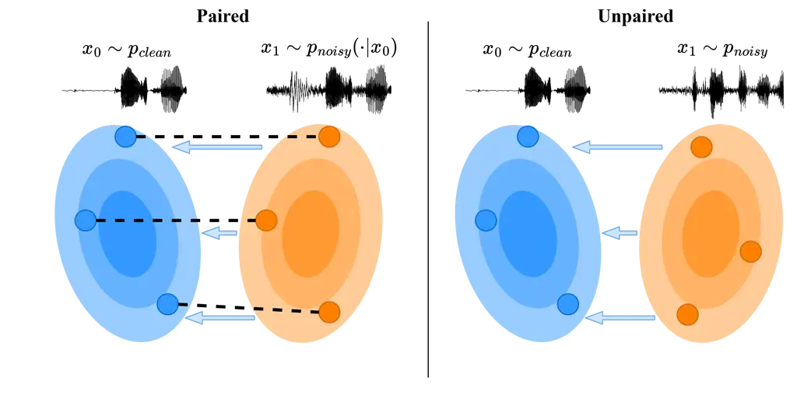
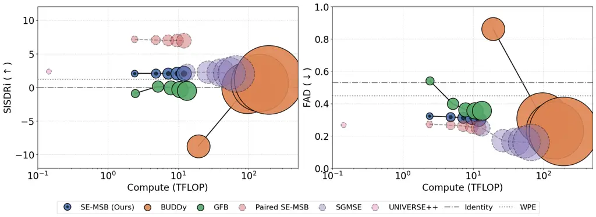
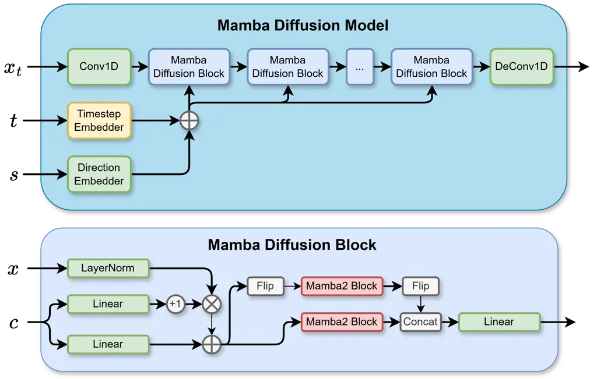
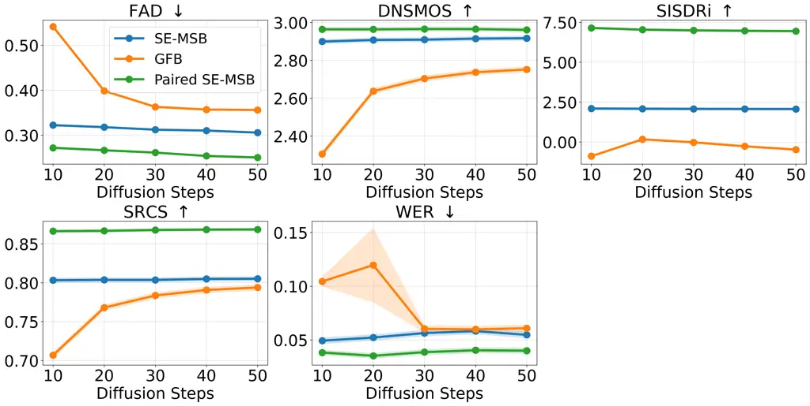

# SE-MSB: End-to-End Unpaired Speech Enhancement using Mamba Schrödinger Bridges

Andreas Bagge    Andreas Nymand    Michael Riis Andersen^(\*)    Bjørn
Sand Jensen^(\*\*)DTU Compute, Kgs. Lyngby, Denmark Affiliation:  WSA,
Lynge, Denmark{andreas.bagge,andreas.nymand}@wsa.com , {miri,
bjje}@dtu.dk

###### Abstract

Speech enhancement (SE) models typically rely on supervised learning
with paired data examples where clean speech is synthetically degraded.
This paradigm limits performance in real-world scenarios where the
target environment’s specific acoustic characteristics are unknown. We
propose a fully unpaired SE framework that uses principled Diffusion
Schrödinger Bridges (DSB) to learn a stochastic transport process
between a clean and a degraded speech distribution. Algorithms for
learning transport maps are computationally heavy since they require
simulating differential equations during training, usually at each
training step. Therefore, we propose using a high-efficiency Mamba
Diffusion Model designed for end-to-end waveform processing. We compare
against state-of-the-art methods for speech enhancement, both paired and
unpaired, as well as a classical signal processing algorithm.
Experimental results show that we are on par or better than the
baselines while being orders of magnitude faster during inference.
Furthermore, we show that the flexibility of the DSB formulation allows
our model to generalize across SE tasks, offering a robust and efficient
solution for real-world speech restoration.

## 1 Introduction

Speech enhancement (SE) problems, such as denoising, declipping, or
dereverberation, are classic problems in audio processing.
Traditionally, these are solved using supervised methods trained on
collections of paired instances of clean speech $`x_{0}`$ and degraded
speech $`x_{1}`$, where the degraded speech is typically simulated by
modifying the clean speech, e.g., by adding noise or clipping the
amplitude such that $`x_{1}\sim p_{\text{noisy}}(\cdot|x_{0})`$. Such
approaches are limited to training on simulated distortions and cannot
be applied to actual, in-the-wild degraded audio because large-scale
paired data collection is infeasible or, in some instances, even
impossible. Enabling model training on unpaired in-the-wild audio, i.e.,
where clean and degraded speech are drawn from separate distributions
$`x_{0}\sim p_{\text{clean}},x_{1}\sim p_{\text{noisy}}`$ independently
rather than paired samples $`(x_{0},x_{1})\sim p_{\text{joint}}`$, has
the potential to improve SE models in real-world conditions by adapting
the model to out-of-distribution (OOD) data, for example, by
personalizing the model to the user’s specific acoustic environment.
With the recent rise in personalized AI, especially through federated
learning \[13\], the ability to train models directly on observed, but
unpaired or unlabeled, data is becoming increasingly important for
adapting models to the specific needs of end-users. This is especially
true for SE models, where the end-user’s acoustic environment is often
unknown and can be highly variable and unpredictable. In some instances,
the degradation is not only unknown but also difficult to simulate to be
used in a paired setup, e.g., Lombard effect \[36\] or reconstructing
historical records \[16\]. Diffusion models constitute the
state-of-the-art for image and audio synthesis \[5, 11\], and they have
also shown great results for paired SE \[27\]. Diffusion models
generally consist of two processes, a forward and a backward process. In
traditional diffusion models, the forward process gradually turns data
samples into Gaussian noise, and the objective of the model is to learn
the backward process by effectively removing noise from the input. After
learning the reverse process, the models can then synthesize
high-quality samples from Gaussian noise. Though traditional diffusion
methods yield high-quality samples, they do not allow for mapping
between two arbitrary data distributions. In contrast, Schrödinger
Bridges (SB) \[30\] allow for high-quality sample generation and direct
transfer between two arbitrary data distributions through the
entropy-regularized optimal transport problem, also called the SB
problem, of finding the most likely random evolution between two
continuous probability distributions. That is, SBs allow learning
stochastic maps between clean and degraded audio from unpaired data
only, enabling training on in-the-wild data. SBs are formulated in terms
of stochastic differential equations (SDEs), which can be simulated with
SDE solvers, and solving the SB problem therefore allows for a
diffusion-based generative approach. Mamba is a selective state-space
model that serves as an efficient alternative to the popular transformer
architecture for long sequence modelling \[3\]. Mamba offers linear
scaling in sequence length and contains a constant state size during
inference. We propose the SE-MSB (Speech Enhancement Mamba Schrödinger
Bridges) model, which is a novel combination of Diffusion Schrödinger
Bridges (DSB) and modern state-space models for end-to-end SE using
completely unpaired data. We provide a fast and efficient implementation
of the DSB method for speech enhancement on raw audio waveforms using a
bespoke Mamba Diffusion model. Raw waveforms suffer from a higher
dimensionality, which is a problem solved by Mambas linear sequence
length scaling. We show that the combination of DSB and Mamba
outperforms or is on par with other state-of-the-art methods for
unpaired SE, while being orders of magnitude faster during inference,
both due to the efficiency of the network architecture and due to the
ability of the model to do few-step diffusion without sacrificing
performance. Audio examples and code are available at
[anonymous.4open.science/r/Latent-DSB](https://a). Our main
contributions are:



Figure 1: In traditional supervised speech enhancement (left), we assume
access to a clean sample $`x_{0}`$ from the clean target distribution
and a corresponding degraded sample from the degraded distribution to
learn the optimal pairing (blue arrows). In contrast, our method (right)
requires only independent samples from both distributions to learn the
optimal pairing.

- •
  We propose the SE-MSB model, which is the first fully unpaired and
  end-to-end model for speech enhancement on raw waveforms.
- •
  We evaluate SE-MSB using a rigorous experimental protocol and compare
  it against several state-of-the-art baselines on multiple tasks and
  compounded conditions.
- •
  We demonstrate that SE-MSB achieves strong speech enhancement
  performance, outperforming paired methods in some cases while
  exhibiting highly competitive efficiency.

## 2 Related Work

A²ASB (Audio-to-Audio Schrödinger Bridge) \[12\] is a tractable,
simulation-free method for learning maps between the distributions
$`p_{data}({\mathbf{X}}_{0})`$ and
$`p_{prior}({\mathbf{X}}_{1}|{\mathbf{X}}_{0})`$, i.e., a conditional
probability distribution that requires paired samples. A²ASB exhibits
state-of-the-art results on paired audio restoration tasks such as
bandwidth extension and inpainting. CycleGAN is a discriminative
generative model for learning a deterministic mapping between
distributions \[44\]. CycleGANs have also been used for style transfer
in the context of audio, for example, for whisper-to-normal speech
conversion \[24\]. However, CycleGANs are highly unstable during
training and require jointly optimizing 4 distinct neural networks.

|        | Unpaired | End-to-End | Task-flexible |
| ------ | -------- | ---------- | ------------- |
| SE-MSB | ✔       | ✔         | ✔            |
| GFB    | ✔       | ✖^(∗)     | ✔            |
| BUDDy  | ✔       | ✖         | ✖            |
| A²ASB  | ✖       | ✖         | ✔            |

Table 1: Comparison of current paired/unpaired diffusion models for
speech enhancement. ^(∗)GFB processes raw audio but employs an internal
STFT encoder and ISTFT decoder.

\[19\] proposes using Gaussian Flow Bridges for unpaired speech
enhancement, a diffusion-based approach where samples are first mapped
to an intermediate Gaussian distribution. The approach suffers from the
fact that the simulated trajectories first have to map to a third
distribution, a Gaussian, therefore yielding non-optimal transport. A
similar class of methods for unpaired speech enhancement uses diffusion
posterior sampling to solve the audio inverse problem in an unsupervised
manner \[8, 14, 20\]. Instead of training a task-specific model, these
methods utilize a pretrained diffusion model as a prior over the clean
data. During inference, the models then modify the reverse diffusion
process to guide the sampling trajectory. However, these methods also
require access to the mathematical structure of the degradation process,
which, in most cases, is not available for in-the-wild data. Diffusion
Schrödinger Bridge Matching \[4, 31\] is an algorithm for computing the
Schrödinger Bridge, a dynamic entropy-regularised version of optimal
transport. The algorithm can be used for learning a diffusion model for
mapping between arbitrary distributions using unpaired data samples.
Mamba, a selective state-space model architecture, has shown great
results in the field of paired speech enhancement \[43\] \[42\]. In
combination with diffusion Schrödinger bridges, Mamba has shown to
outperform Long Short-Term Memory and Multi-Head Self-Attention
backbones for Short Time Fourier Transform (STFT) based audio
representations for paired speech enhancement. However, STFT-based
methods are limited by fixed transformation hyperparameters, reducing
the model’s ability to capture the expressivity of raw audio.

## 3 Method

Our work builds upon the Diffusion Schrödinger Bridge Matching algorithm
\[4, 31\], DSB for short. Consider two distinct continuous probability
distributions on $`\mathbb{R}^{n}`$. In the literature, these
distributions are usually denoted as $`p_{data}`$ and $`p_{prior}`$.
However, for our application of speech enhancement, we will denote these
distributions as $`p_{clean}`$ and $`p_{noisy}`$, respectively, to
emphasize their role as the target and source distributions in the
speech enhancement problem. Therefore, $`p_{clean}`$ refers to the
distribution of clean speech, while $`p_{noisy}`$ refers to the
distribution of degraded speech, for example, noisy, reverberant, or
clipped speech. We will denote samples from $`p_{clean}`$ and
$`p_{noisy}`$ as $`{\mathbf{X}}_{0}`$ and $`{\mathbf{X}}_{1}`$,
respectively, i.e. $`{\mathbf{X}}_{0}\sim p_{clean}`$ and
$`{\mathbf{X}}_{1}\sim p_{noisy}`$, where
$`{\mathbf{X}}_{0},{\mathbf{X}}_{1}\in\mathbb{R}^{n}`$. We seek a
stochastic process, or a ’bridge’, that transports samples from
$`p_{clean}`$ to $`p_{noisy}`$ and vice versa. We will parameterize the
processes as two distinct SDEs, one for each direction, such that
simulating the SDEs with a sample as the initial value will transport
said sample from one domain to the other. We will denote the forward and
backward SDEs as:

```math
\displaystyle{\mathrm{d}}{\mathbf{X}}_{t} \displaystyle=f({\mathbf{X}}_{t},t){\mathrm{d}}t+g(t){\mathrm{d}}{\mathbf{W}}_{t},\hskip 14.22636pt{\mathbf{X}}_{0}\sim p_{clean},
```

```math
\displaystyle{\mathrm{d}}{\mathbf{X}}_{t} \displaystyle=b({\mathbf{X}}_{t},t){\mathrm{d}}t+g(t){\mathrm{d}}\bar{{\mathbf{W}}}_{t},\hskip 14.22636pt{\mathbf{X}}_{1}\sim p_{noisy},
```

where $`f`$ and $`b`$ are the drift terms, $`g(t)`$ is the diffusion
term, and $`{\mathbf{W}}`$ and $`\bar{{\mathbf{W}}}`$ are standard
Wiener processes. For simplicity, we will assume $`g(t)=\beta`$ is
constant. Therefore, the problem reduces to learning the drift terms for
each process, i.e., $`f`$ and $`b`$, such that simulating the backward
process from $`t=1`$ to $`t=0`$ starting from
$`{\mathbf{X}}_{1}\sim p_{noisy}`$ yields
$`{\mathbf{X}}_{0}\sim p_{clean}`$ at time $`t=0`$ (and vice versa for
the forward process). We will parameterize the forward and backward
drift with a single neural network $`v({\mathbf{X}}_{t},t,s)`$ with
parameters $`\theta`$ such that:

```math
f({\mathbf{X}}_{t},t)\approx v_{\theta}({\mathbf{X}}_{t},t,1),\hskip 14.22636ptb({\mathbf{X}}_{t},t)\approx v_{\theta}({\mathbf{X}}_{t},t,0),
```

where $`s\in\{0,1\}`$ is a binary indicator variable, indicating whether
the forward or backward drift is being approximated. Alternatively, one
could have parameterized each drift with a separate neural network.
Having obtained the optimal parameters $`\theta^{*}`$, we can
approximately simulate the forward and backward SDEs on the discrete
time interval $`0=t_{0}<t_{1}\dots<t_{N}=1`$, where
$`\Delta t_{k+1}=t_{k+1}-t_{k}`$, using the Euler-Maruyama method:

```math
\displaystyle p({\mathbf{X}}_{t_{k+1}}|{\mathbf{X}}_{t_{k}}) \displaystyle\approx p({\mathbf{X}}_{t_{k+1}}|{\mathbf{X}}_{t_{k}},{\mathbf{X}}_{1})=\mathcal{N}({\mathbf{X}}_{t_{k+1}};\tilde{\mu}_{k},\tilde{\sigma}^{2}_{k}\mathbf{I}),\hskip 14.22636pt\text{(forward process)} \tag{1}
```

```math
\displaystyle p({\mathbf{X}}_{t_{k}}|{\mathbf{X}}_{t_{k+1}}) \displaystyle\approx p({\mathbf{X}}_{t_{k}}|{\mathbf{X}}_{t_{k+1}},{\mathbf{X}}_{0})=\mathcal{N}({\mathbf{X}}_{t_{k}};\mu_{k+1},\sigma^{2}_{k+1}\mathbf{I}).\hskip 14.22636pt\text{(backward process)} \tag{2}
```

That is, the forward and backward processes can be simulated by sampling
from the respective Gaussian distributions, where the means and
variances are given by:

```math
\displaystyle\tilde{\mu}_{k} \displaystyle\approx{\mathbf{X}}_{t_{k}}+\Delta t_{k+1}\underbrace{({\mathbf{X}}_{1}-{\mathbf{X}}_{t_{k}})/(1-t_{k})}_{=f({\mathbf{X}}_{t_{k}},t_{k})}\approx{\mathbf{X}}_{t_{k}}+\Delta t_{k+1}v_{\theta}({\mathbf{X}}_{t_{k}},t_{k},1),
```

```math
\displaystyle\mu_{k+1} \displaystyle\approx{\mathbf{X}}_{t_{k+1}}+\Delta t_{k+1}\underbrace{({\mathbf{X}}_{0}-{\mathbf{X}}_{t_{k+1}})/t_{k+1}}_{=b({\mathbf{X}}_{t_{k+1}},t_{k+1})}\approx{\mathbf{X}}_{t_{k+1}}+\Delta t_{k+1}v_{\theta}({\mathbf{X}}_{t_{k+1}},t_{k+1},0),
```

```math
\displaystyle\tilde{\sigma}^{2}_{k}=\frac{\beta\Delta t_{k+1}(1-t_{k+1})}{1-t_{k}},\hskip 14.22636pt\sigma^{2}_{k+1}=\frac{\beta\Delta t_{k+1}t_{k}}{t_{k+1}}.
```

Additionally, it can be shown \[4\] that given $`{\mathbf{X}}_{0}`$ and
$`{\mathbf{X}}_{1}`$, then intermediate points in the bridge can be
sampled from the conditional distribution:

```math
p({\mathbf{X}}_{t_{k}}|{\mathbf{X}}_{0},{\mathbf{X}}_{1})=\mathcal{N}((1-t_{k}){\mathbf{X}}_{0}+t_{k}{\mathbf{X}}_{1},\beta t_{k}(1-t_{k})\mathbf{I}). \tag{3}
```

To train the neural network $`v_{\theta}`$, we will use the DSB Matching
algorithm \[4, 31\]. The algorithm contains two phases: pre-training and
fine-tuning. During the pre-training phase, i.i.d. samples from
$`p_{clean}`$ and $`p_{noisy}`$ are sampled independently. We will call
this pair a "random coupling" (i.e., unpaired). An intermediate point,
$`{\mathbf{X}}_{t_{k}}`$, is sampled from the conditional distribution
(3), and the objective of the network is to predict the forward and
backward drift at time $`t_{k}`$ and $`t_{k+1}`$ given by
$`({\mathbf{X}}_{1}-{\mathbf{X}}_{t_{k}})/(1-t_{k})`$ and
$`({\mathbf{X}}_{0}-{\mathbf{X}}_{t_{k+1}})/t_{k+1}`$, respectively.
After a number of pre-training steps, the fine-tuning phase begins.
Here, the initial samples $`{\mathbf{X}}_{0}`$ and $`{\mathbf{X}}_{1}`$
are once again obtained by sampling from $`p_{clean}`$ and
$`p_{noisy}`$, but they are no longer randomly coupled. Instead, the
couplings are obtained by simulating the processes on the interval from
$`t=0`$ to $`t=1`$ and from $`t=1`$ to $`t=0`$, respectively, using the
current parameters $`\theta`$ of the model. The objective of the model
is the same as in the pre-training phase. \[4\] shows that applying the
pre-training phase followed by the fine-tuning phase will eventually
yield the SB, i.e., the optimal stochastic process between $`p_{clean}`$
and $`p_{noisy}`$. The DSB Matching algorithm can be seen as a
stochastic version of the Reflow algorithm \[17\], which can be deduced
from DSB Matching by setting $`\beta=0`$, i.e., by removing the noise
from the SDEs. For the Reflow algorithm, the authors show that the
fine-tuning phase yields "straight flows", i.e. flows that transport
samples from $`p_{clean}`$ to $`p_{noisy}`$ along straight lines. This
is a desirable property for diffusion models, as it allows for few-step
diffusion sampling without compromising sample quality, therefore
requiring less compute during inference. Additionally, it can also be
shown that A²ASB is simply a paired version of the DSB Matching
algorithm that uses only the pre-training phase, and that only trains
the backward process, but instead of drawing random couplings, the
couplings are drawn according to the joint distribution and are
therefore paired, see Appendix C.

1: Initialize neural network $`v_{\theta}`$ and batch size $`2B`$

2: Let $`i\in\{1,2\dots B\}`$

3: while not converged do

4:   if Pre-training then

5:    $`{\mathbf{X}}_{0}^{1:B}\overset{\mathrm{iid}}{\sim}p_{clean}`$,
$`\tilde{{\mathbf{X}}}_{1}^{1:B}\overset{\mathrm{iid}}{\sim}p_{noisy}`$

6:    $`{\mathbf{X}}_{1}^{1:B}\overset{\mathrm{iid}}{\sim}p_{noisy}`$,
$`\tilde{{\mathbf{X}}}_{0}^{1:B}\overset{\mathrm{iid}}{\sim}p_{clean}`$

7:   else

8:    $`{\mathbf{X}}_{0}^{1:B}\overset{\mathrm{iid}}{\sim}p_{clean}`$,
$`\tilde{{\mathbf{X}}}_{1}^{1:B}\overset{\mathrm{iid}}{\sim}p_{noisy}`$

9:    Sample $`{\mathbf{X}}_{1}^{i}`$ using (1) and
$`v_{\theta}(\cdot,\cdot,1)`$ starting from $`{\mathbf{X}}_{0}^{i}`$

10:    Sample $`\tilde{{\mathbf{X}}}_{0}^{i}`$ using (2) and
$`v_{\theta}(\cdot,\cdot,0)`$ starting from
$`\tilde{{\mathbf{X}}}_{1}^{i}`$

11:   end if

12:
  $`t^{1:B},\tilde{t}^{1:B}\overset{\mathrm{iid}}{\sim}\mathcal{U}(0,1)`$

13:
  $`{\mathbf{X}}_{t}^{i}\sim\mathcal{N}((1-t^{i}){\mathbf{X}}_{0}^{i}+t^{i}{\mathbf{X}}_{1}^{i},\beta t^{i}(1-t^{i})\mathbf{I})`$

14:
  $`\tilde{{\mathbf{X}}}_{t}^{i}\sim\mathcal{N}((1-\tilde{t}^{i})\tilde{{\mathbf{X}}}_{0}^{i}+\tilde{t}^{i}\tilde{{\mathbf{X}}}_{1}^{i},\beta\tilde{t}^{i}(1-\tilde{t}^{i})\mathbf{I})`$

15:
  $`\mathcal{L}_{b}=\frac{1}{B}\sum_{i=1}^{B}\left\lVert v_{\theta}({\mathbf{X}}_{t}^{i},t^{i},0)-\frac{{\mathbf{X}}_{0}^{i}-{\mathbf{X}}_{t}^{i}}{t^{i}}\right\rVert`$

16:
  $`\mathcal{L}_{f}=\frac{1}{B}\sum_{i=1}^{B}\left\lVert v_{\theta}(\tilde{{\mathbf{X}}}_{t}^{i},\tilde{t}^{i},1)-\frac{\tilde{{\mathbf{X}}}_{1}^{i}-\tilde{{\mathbf{X}}}_{t}^{i}}{1-\tilde{t}^{i}}\right\rVert`$

17:   Take gradient step
$`\nabla_{\theta}\frac{1}{2}(\mathcal{L}_{b}+\mathcal{L}_{f})`$

18: end while

Algorithm 1 Training algorithm

### Mamba Diffusion Model architecture



Figure 2: Total compute vs SISDRi (left) and FAD (right). The area of
the points scales linearly with mean inference time, see table 3 and
appendix D. Our model outperforms unpaired state-of-the-art models with
the same compute budget. It is also seen that the model is robust to
changes in the number of diffusion steps, performing almost the same no
matter how many diffusion steps are taken. This is also shown in figure 4. The models with a dashed outline are trained on paired data. An
Equivalent plot for the CHiME-6 dataset can be seen in appendix D.

To the best of our knowledge, all existing unpaired speech enhancement
models operate on spectrograms \[8, 14, 20\]. This is done mostly to
enable the use of established convolutional neural networks, such as
U-Nets \[28\], on the resulting time-frequency representations. However,
such time-frequency representations impose a rigid, non-learnable
trade-off between temporal and frequency resolution, and, in the case of
magnitude representations, completely disregard the phase, therefore
requiring heuristic phase reconstruction algorithms or an additional
vocoder for waveform synthesis. Therefore, we propose combining DSB with
modern state-space architectures to operate in an end-to-end fashion on
raw audio waveforms, enabling the model to learn an internal
representation of the raw data, without relying on specific choices of
time-frequency representations. To this end, we use a bespoke, efficient
Mamba Diffusion model architecture based on Mamba blocks \[3\]. This
architecture uses an initial 1D convolutional layer to learn an internal
latent representation of the raw audio waveform, similar to a learnable
time-frequency representation. This latent is then processed by a number
of Mamba Diffusion blocks. Each Mamba Diffusion block uses Adaptive
LayerNorm \[40\] to inject the diffusion timestep $`t`$ and the
process-direction conditioning $`c`$. The model architecture is
visualized in Figure 3, and a more detailed description of the
architecture can be found in Appendix B. To compare the algorithmic
efficiency of the proposed SE-MSB model to the state-of-the-art
baselines, we have opted to count tera ($`10^{12}`$) floating-point
operations (TFLOPS) required to evaluate a sample output. Each of the
models processed a dummy audio input of $`2^{15}=32768`$ samples (2.048
seconds of audio at 16kHz). For counting the TFLOPs of the models,
PyTorch’s "FlopCounterMode" was used. As our implementation relied on
the mamba-ssm library, which uses custom Triton kernels for an efficient
implementation, the TFLOP count has been manually registered and is
counted as explained in chapter 6 of the Mamba2 paper \[3\]. The
majority of the Mamba2 TFLOP count comes from the 1D convolution and the
selective scan algorithms, which, according to the paper, consist of an
order $`O(TN^{2})`$ FLOPs, where $`T`$ is the sequence length and $`N`$
is the state dimension. This is under the assumption that $`N=P=Q`$
where $`P`$ is the head dimension and $`Q`$ is the chunk size. If we
assume a more general form, it can be shown that the FLOP count from the
selective scan equals $`FLOP_{scan}=2BTN(H\ Q+3D)`$, where $`B`$ is the
batch size, $`H`$ is the number of heads, and $`D`$ is total head
dimension, $`D=HP`$, see appendix D. Before the block decomposition, a
1D causal convolution across the inner dimension is performed with a
total cost of $`FLOP_{conv}=2BTDK`$, where $`K`$ is the convolution
kernel size. In addition to this, some elementwise operations are used
in the Triton kernels, and are, as such, invisible to Torch’s
"FlopCounterMode". The FLOP count is negligible compared to the
selective state scan, but for completeness, we include them in the
count. First, the SiLU activation layers take approximately $`5BTD`$
FLOPs. Secondly, the gated RMS-Norm takes $`11BTD`$ FLOPs, 5 from the
RMS norm, 5 for an attached SiLU, and 1 from an elementwise
multiplication. Lastly, a final elementwise multiplication takes
$`BTHQ`$ FLOPs. Further information on the FLOP count on non-torch
baselines can be seen in Appendix D.



Figure 3: The Mamba Diffusion Model architecture proposed for SE-MSB.
Each waveform is encoded using a 1D convolutional layer. The resulting
representation is mixed with the conditional signal and processed by a
stack of Mamba Diffusion Blocks.

## 4 Experiments

The proposed SE-MSB model is trained and evaluated on a dereverberation,
denoising, and declipping task. These tasks are traditionally solved
with supervised methods, but by artificially degrading the clean speech
data, we can evaluate distortion metrics that require paired data. The
clean speech data used throughout our experiments comes from
VCTK \[41\], see Appendix A.1. The VCTK dataset is both used as
$`p_{clean}`$ and to simulate $`p_{noisy}`$, but, importantly, the model
never sees pairs of clean and degraded audio during training.



Figure 4: Metrics as a function of the number of diffusion steps. The
SE-MSB model is almost unaffected by the number of steps, showing that
SE-MSB can do few-step generation.

The models are tested on the test split of VCTK using an unseen test set
of room impulse responses. Standard supervised speech enhancement models
are conventionally evaluated using isolated test sets to assess
generalizability to OOD shifts. In contrast, the primary advantage of
unpaired speech enhancement is the ability for in-domain training,
allowing the model to train directly on the observed target
distribution. Therefore, to verify that our model retains
generalizability, we also evaluate all models on a separate, independent
clean speech dataset, namely the Libri ASR Corpus \[22\].

- •
  Dereverberation: The degraded speech is generated by applying room
  impulse responses (RIRs) from various public RIR datasets \[37, 35,
  21, 23, 33\] to the clean speech.
- •
  Denoising and declipping: The degraded speech is generated via
  additive noise and, in a separate experiment, clipping the resulting
  mixture. The noise dataset is WHAM! noise \[38\] mixed at 5 dB SNR.
  Clipping is randomly applied to remove between 0 and 1 dB of the
  signal power.

|       |     |                         |                      |                       |                       |                      |                      |                         |
| ----- | --- | ----------------------- | -------------------- | --------------------- | --------------------- | -------------------- | -------------------- | ----------------------- |
|       |     | Model                   | FAD ($`\downarrow`$) | DNSMOS ($`\uparrow`$) | SISDRi ($`\uparrow`$) | WER ($`\downarrow`$) | SR-CS ($`\uparrow`$) | TFLOPS ($`\downarrow`$) |
|       | U   | SE-MSB (10)             | $`0.32`$             | $`2.90\pm\pm 0.01`$   | 2.09 $`\pm`$ 0.09     | $`0.05\pm\pm 0.00`$  | $`0.80\pm\pm 0.00`$  | $`2.3937`$              |
|       | U   | SE-MSB (50)             | $`0.31`$             | $`2.92\pm\pm 0.01`$   | $`2.06\pm\pm 0.09`$   | $`0.05\pm\pm 0.00`$  | $`0.81\pm\pm 0.00`$  | $`11.9687`$             |
|       | U   | BUDDy (10 $`\dagger`$)  | $`0.86`$             | $`2.30\pm\pm 0.01`$   | $`-8.75\pm\pm 0.11`$  | $`0.54\pm\pm 0.01`$  | $`0.47\pm\pm 0.01`$  | $`19.2127`$             |
|       | U   | BUDDy (100 $`\dagger`$) | 0.23                 | 3.08 $`\pm`$ 0.01     | $`1.15\pm\pm 0.12`$   | 0.02 $`\pm`$ 0.00    | 0.91 $`\pm`$ 0.00    | $`192.1273`$            |
|       | U   | GFB (10)                | $`0.54`$             | $`2.30\pm\pm 0.02`$   | $`-0.90\pm\pm 0.08`$  | $`0.10\pm\pm 0.00`$  | $`0.71\pm\pm 0.00`$  | $`2.4265`$              |
|       | U   | GFB (50)                | $`0.36`$             | $`2.75\pm\pm 0.02`$   | $`-0.48\pm\pm 0.04`$  | $`0.06\pm\pm 0.00`$  | $`0.79\pm\pm 0.00`$  | $`13.2112`$             |
|       | U   | WPE                     | $`0.45`$             | $`2.71\pm\pm 0.02`$   | $`1.24\pm\pm 0.07`$   | 0.02 $`\pm`$ 0.00    | $`0.84\pm\pm 0.00`$  | 0.0012                  |
|       | P   | SGMSE (10)              | $`0.25`$             | $`2.89\pm\pm 0.02`$   | $`2.27\pm\pm 0.09`$   | 0.02 $`\pm`$ 0.00    | $`0.90\pm\pm 0.00`$  | $`13.3338`$             |
|       | P   | SGMSE (50)              | 0.16                 | $`2.92\pm\pm 0.02`$   | $`2.01\pm\pm 0.11`$   | 0.02 $`\pm`$ 0.01    | 0.91 $`\pm`$ 0.00    | $`66.6690`$             |
|       | P   | Paired SE-MSB (10) ^(⋆) | $`0.27`$             | $`2.96\pm\pm 0.01`$   | 7.15 $`\pm`$ 0.08     | $`0.04\pm\pm 0.00`$  | $`0.87\pm\pm 0.00`$  | $`2.3937`$              |
|       | P   | Paired SE-MSB (50) ^(⋆) | $`0.25`$             | $`2.96\pm\pm 0.01`$   | $`6.95\pm\pm 0.08`$   | $`0.04\pm\pm 0.00`$  | $`0.87\pm\pm 0.00`$  | $`11.9687`$             |
|       | P   | UNIVERSE++              | $`0.27`$             | $`3.05\pm\pm 0.01`$   | $`2.35\pm\pm 0.09`$   | $`0.03\pm\pm 0.00`$  | $`0.90\pm\pm 0.00`$  | $`11.9687`$             |
| VCTK  |     | Identity                | $`0.53`$             | $`2.64\pm\pm 0.02`$   | $`0.00\pm\pm 0.00`$   | 0.02 $`\pm`$ 0.00    | $`0.79\pm\pm 0.00`$  | $`0.0000`$              |
|       | U   | SE-MSB (10)             | 0.15                 | $`2.90\pm\pm 0.02`$   | $`0.60\pm\pm 0.09`$   | $`0.11\pm\pm 0.02`$  | $`0.67\pm\pm 0.00`$  | $`2.3937`$              |
|       | U   | SE-MSB (50)             | $`0.16`$             | $`2.92\pm\pm 0.02`$   | $`0.52\pm\pm 0.09`$   | $`0.13\pm\pm 0.01`$  | $`0.66\pm\pm 0.00`$  | $`11.9687`$             |
|       | U   | BUDDy (10 $`\dagger`$)  | $`0.69`$             | $`2.21\pm\pm 0.02`$   | $`-9.95\pm\pm 0.15`$  | $`0.76\pm\pm 0.02`$  | $`0.38\pm\pm 0.01`$  | $`19.2127`$             |
|       | U   | BUDDy (100 $`\dagger`$) | $`0.17`$             | 3.18 $`\pm`$ 0.01     | $`-1.76\pm\pm 0.18`$  | $`0.04\pm\pm 0.00`$  | $`0.80\pm\pm 0.00`$  | $`192.1273`$            |
|       | U   | GFB (10)                | $`0.31`$             | $`2.59\pm\pm 0.02`$   | $`-1.14\pm\pm 0.07`$  | $`0.16\pm\pm 0.01`$  | $`0.59\pm\pm 0.01`$  | $`2.4265`$              |
|       | U   | GFB (50)                | $`0.29`$             | $`2.90\pm\pm 0.02`$   | $`-0.33\pm\pm 0.04`$  | $`0.08\pm\pm 0.00`$  | $`0.71\pm\pm 0.01`$  | $`13.2112`$             |
|       | U   | WPE                     | $`0.22`$             | $`2.71\pm\pm 0.03`$   | 1.40 $`\pm`$ 0.07     | 0.02 $`\pm`$ 0.00    | 0.89 $`\pm`$ 0.00    | 0.0012                  |
|       | P   | SGMSE (10)              | $`0.25`$             | $`2.89\pm\pm 0.02`$   | $`2.27\pm\pm 0.09`$   | 0.02 $`\pm`$ 0.00    | $`0.90\pm\pm 0.00`$  | $`13.3338`$             |
|       | P   | SGMSE (50)              | $`0.16`$             | $`2.92\pm\pm 0.02`$   | $`2.01\pm\pm 0.11`$   | 0.02 $`\pm`$ 0.01    | 0.91 $`\pm`$ 0.00    | $`66.6690`$             |
|       | P   | Paired SE-MSB (10) ^(⋆) | $`0.20`$             | $`3.01\pm\pm 0.02`$   | 2.75 $`\pm`$ 0.12     | $`0.08\pm\pm 0.00`$  | $`0.67\pm\pm 0.01`$  | $`2.3937`$              |
|       | P   | Paired SE-MSB (50) ^(⋆) | $`0.20`$             | $`3.03\pm\pm 0.02`$   | $`2.72\pm\pm 0.12`$   | $`0.08\pm\pm 0.00`$  | $`0.67\pm\pm 0.01`$  | $`11.9687`$             |
|       | P   | UNIVERSE++              | $`0.22`$             | $`2.96\pm\pm 0.02`$   | $`-1.08\pm\pm 0.17`$  | $`0.18\pm\pm 0.02`$  | $`0.66\pm\pm 0.01`$  | $`11.9687`$             |
| Libri |     | Identity                | $`0.28`$             | $`2.57\pm\pm 0.03`$   | $`0.00\pm\pm 0.00`$   | $`0.03\pm\pm 0.00`$  | $`0.82\pm\pm 0.00`$  | $`0.0000`$              |

Table 2: Evaluation metrics for the dereverberation task with 95%
confidence intervals. The Identity baseline corresponds to unprocessed
audio. The number of diffusion steps is denoted in parentheses when
relevant, except for $`\dagger`$, which denotes optimization steps. U =
unpaired, P = paired. Best unpaired model in each metric is bold, and
best model across paired and unpaired models is underlined.

|     | Model                   | TFLOPS                           | Inference Time (ms)      | Trainable Params ($`\times 10^{6}`$) |
| --- | ----------------------- | -------------------------------- | ------------------------ | ------------------------------------ |
| U   | SE-MSB (10)             | $`2.393\,739\,999\,999\,999\,8`$ | $`214.19\pm\pm 0.53`$    | $`45.56`$                            |
| U   | SE-MSB (50)             | $`11.9687`$                      | $`1042.29\pm\pm 6.59`$   | $`45.56`$                            |
| U   | BUDDy (10 $`\dagger`$)  | $`19.212\,73`$                   | $`2481.45\pm\pm 8.02`$   | $`27.74`$                            |
| U   | BUDDy (100 $`\dagger`$) | $`192.127\,31`$                  | $`22\,135.4\pm\pm 17.1`$ | $`27.74`$                            |
| U   | GFB (10)                | $`2.426\,54`$                    | $`314.67\pm\pm 0.44`$    | $`43.85`$                            |
| U   | GFB (50)                | $`13.211\,16`$                   | $`1713.99\pm\pm 3.99`$   | $`43.85`$                            |
| U   | WPE                     | $`0.0012`$                       | $`80.72\pm\pm 0.25`$     | $`0.0`$                              |
| P   | Sepformer               | $`0.472\,15`$                    | $`55.21\pm\pm 0.18`$     | $`25.61`$                            |
| P   | SGMSE (10)              | $`13.3338`$                      | $`1253.28\pm\pm 1.85`$   | $`65.59`$                            |
| P   | SGMSE (50)              | $`66.669\,01`$                   | $`6276.25\pm\pm 5.7`$    | $`65.59`$                            |
| P   | Paired SE-MSB (10)      | $`2.393\,739\,999\,999\,999\,8`$ | $`215.0\pm\pm 0.39`$     | $`45.56`$                            |
| P   | Paired SE-MSB (50)      | $`11.9687`$                      | $`1031.56\pm\pm 0.73`$   | $`45.56`$                            |
| P   | UNIVERSE++              | $`0.144\,606`$                   | $`124.95\pm\pm 2.36`$    | $`84.24`$                            |

Table 3: Computational efficiency: FLOPS, inference time, and number of
trainable parameters.

For each task, we train our SE-MSB model using the Mamba Diffusion Model
architecture on raw audio waveforms using $`\beta=0.1`$ following a
parameter sweep. The model is trained for 250k steps during pre-training
and 100k steps during fine-tuning for a total of 350k steps. We use a
batch size of 18 on audio samples of 1.00 seconds at a sample rate of 16
kHz. During the fine-tuning phase, each SDE is simulated using 20 steps
of the Euler-Maruyama method. For dereverberation, we compare the
performance of the SE-MSB model against both unpaired and paired
baselines. The unpaired baselines include a Gaussian Flow Bridge (GFB)
method \[19\], a diffusion posterior sampling method called
BUDDy \[14\], and the Weighted Prediction Error (WPE) method\[6\]. For
the paired baselines, we evaluate against a Score-based Generative Model
for Speech Enhancement (SGMSE)\[27\], and the supervised version of the
SE-MSB method called A²SB\[12\]. We also include an Identity baseline
corresponding to unprocessed reverberant audio. Baselines are described
in detail in Appendix C.

To showcase the flexibility of our method, we train an SE-MSB model on a
mixture of multiple degradations: reverberation, additive noise, and
clipping. We compare the performance of the SE-MSB model against BUDDy,
and the unprocessed baseline. BUDDy uses a diffusion posterior sampling
method,but BUDDy also assumes a specific degradation, namely a
convolution with some unknown RIR, and is therefore sensitive to these
assumptions being violated. For the tasks involving additive noise, we
also compare against a paired baseline, namely the Sepformer \[34\], a
state-of-the-art supervised speech enhancement model.

We test the few-step sampling capabilities of both the paired and
unpaired SE-MSB model compared to the unpaired diffusion baseline GFB on
the dereverberation task by evaluating metrics for different numbers of
sampling steps. The number of sampling steps can be changed at inference
time, and therefore, only a single trained model is required for each
task. Few-step sampling is a desirable property as it can reduce the
inference time of the model, and therefore increase the practicality of
the method for real-world applications. Lastly, we also measure the
computational efficiency of all models using FLOPS, inference time (wall
clock time), and the number of trainable parameters.

|                       |     |                         |                      |                       |                       |                      |                      |
| --------------------- | --- | ----------------------- | -------------------- | --------------------- | --------------------- | -------------------- | -------------------- |
|                       |     | Model                   | FAD ($`\downarrow`$) | DNSMOS ($`\uparrow`$) | SISDRi ($`\uparrow`$) | WER ($`\downarrow`$) | SR-CS ($`\uparrow`$) |
|                       | U   | SE-MSB (10)             | $`0.35`$             | $`2.72\pm\pm 0.01`$   | 4.95 $`\pm`$ 0.13     | $`0.08\pm\pm 0.00`$  | $`0.74\pm\pm 0.00`$  |
|                       | U   | SE-MSB (50)             | 0.33                 | 2.74 $`\pm`$ 0.01     | $`4.91\pm\pm 0.13`$   | $`0.09\pm\pm 0.00`$  | $`0.75\pm\pm 0.00`$  |
| Reverb + Noise        | U   | BUDDy (100 $`\dagger`$) | $`0.70`$             | $`2.66\pm\pm 0.01`$   | $`0.73\pm\pm 0.10`$   | 0.05 $`\pm`$ 0.00    | 0.83 $`\pm`$ 0.00    |
|                       | P   | Sepformer               | $`0.29`$             | $`2.90\pm\pm 0.01`$   | $`5.00\pm\pm 0.08`$   | 0.05 $`\pm`$ 0.00    | $`0.83\pm\pm 0.00`$  |
|                       | P   | SGMSE+                  | $`0.30`$             | $`2.80\pm\pm 0.01`$   | $`4.49\pm\pm 0.11`$   | 0.05 $`\pm`$ 0.01    | $`0.84\pm\pm 0.00`$  |
|                       | P   | UNIVERSE++              | 0.27                 | 3.01 $`\pm`$ 0.01     | 6.32 $`\pm`$ 0.09     | $`0.08\pm\pm 0.00`$  | 0.88 $`\pm`$ 0.00    |
|                       |     | Identity                | $`1.05`$             | $`1.66\pm\pm 0.03`$   | $`0.00\pm\pm 0.00`$   | $`0.04\pm\pm 0.00`$  | $`0.79\pm\pm 0.00`$  |
|                       | U   | SE-MSB (10)             | 0.30                 | 2.76 $`\pm`$ 0.01     | 3.47 $`\pm`$ 0.13     | $`0.10\pm\pm 0.00`$  | $`0.69\pm\pm 0.01`$  |
|                       | U   | SE-MSB (50)             | 0.30                 | 2.76 $`\pm`$ 0.01     | 3.47 $`\pm`$ 0.13     | $`0.10\pm\pm 0.00`$  | $`0.69\pm\pm 0.01`$  |
| Reverb + Noise + Clip | U   | BUDDy (100 $`\dagger`$) | $`0.71`$             | $`2.64\pm\pm 0.01`$   | $`0.79\pm\pm 0.10`$   | 0.05 $`\pm`$ 0.00    | 0.80 $`\pm`$ 0.00    |
|                       | P   | Sepformer               | $`0.31`$             | $`2.80\pm\pm 0.01`$   | $`5.16\pm\pm 0.08`$   | 0.05 $`\pm`$ 0.00    | $`0.79\pm\pm 0.00`$  |
|                       | P   | SGMSE+                  | $`0.33`$             | $`2.78\pm\pm 0.01`$   | $`4.64\pm\pm 0.09`$   | 0.05 $`\pm`$ 0.01    | $`0.80\pm\pm 0.00`$  |
|                       | P   | UNIVERSE++              | 0.28                 | 3.01 $`\pm`$ 0.01     | 6.34 $`\pm`$ 0.08     | $`0.09\pm\pm 0.00`$  | 0.86 $`\pm`$ 0.00    |
|                       |     | Identity                | $`1.06`$             | $`1.63\pm\pm 0.03`$   | $`0.00\pm\pm 0.00`$   | $`0.04\pm\pm 0.00`$  | $`0.76\pm\pm 0.00`$  |
|                       | U   | SE-MSB (10)             | $`0.48`$             | $`2.25\pm\pm 0.03`$   | –                     | –                    | –                    |
|                       | U   | SE-MSB (50)             | $`0.46`$             | 2.27 $`\pm`$ 0.03     | –                     | –                    | –                    |
| CHiME-6               | U   | BUDDy (100 $`\dagger`$) | 0.45                 | $`2.16\pm\pm 0.04`$   | –                     | –                    | –                    |
|                       | P   | Sepformer               | $`0.90`$             | $`1.19\pm\pm 0.02`$   | –                     | –                    | –                    |
|                       | P   | SGMSE+                  | $`0.64`$             | $`1.76\pm\pm 0.04`$   | –                     | –                    | –                    |
|                       | P   | UNIVERSE++              | $`0.66`$             | $`1.87\pm\pm 0.03`$   | –                     | –                    | –                    |
|                       |     | Identity                | $`1.09`$             | $`1.32\pm\pm 0.02`$   | –                     | –                    | –                    |

Table 4: Evaluation metrics for the mixed speech enhancement tasks,
namely WHAM! noise with reverb, and WHAM! noise with reverb and
amplitude clipping, with 95% confidence intervals. The Identity baseline
corresponds to unprocessed audio. The number of diffusion steps is
denoted in parentheses when relevant, except for $`\dagger`$, which
denotes optimization steps. U = unpaired, P = paired. Best unpaired
model is bold, and best model across paired and unpaired models is
underlined.

The generated samples are evaluated using WER (word error rate),
pMOS/DNSMOS (predicted mean opinion score using the DNSMOS model)
\[26\], SR-CS (speaker recognition cosine similarity), scale-invariant
signal-to-distortion ratio (SISDRi) \[29\], and FAD (Fréchet Audio
Distance) \[9\]. WER, SR-CS, and SISDRi can be interpreted as content
fidelity measures capturing how well content is preserved, while pMOS
and FAD can be interpreted as perceptual quality metrics. WER is
calculated using the small Whisper model \[25\] to obtain ground-truth
transcriptions of the reference (clean) speech. The transcription model
is robust towards distorted speech and is therefore not necessarily a
good measure of how well the audio is reconstructed. Nevertheless, WER
serves as a useful indicator of whether the semantic content of the
speech is preserved. SR-CS is calculated using a speaker embedding
model \[10\] to obtain speaker embeddings of the ground truth signal and
the generated signal. The metric is then calculated as the cosine
similarity between these embeddings. The samples used in the FAD metric
are encodings produced using a CLAP model \[39\].

## 5 Results

Results of the dereverberation task are shown in Table 2, results of the
mixed degradation task are shown in Table 4, and the results of the
few-step sampling experiment are shown in Figure 4. Computational
efficiency is shown in Table 3. The dereverberation and computational
efficiency results show that while SE-MSB is moderately outperformed by
BUDDy on most metrics, SE-MSB is around two orders of magnitude more
efficient than BUDDy in terms of FLOPS. This large computation
difference is made possible thanks to the linear time sequence scaling
of the Mamba diffusion model. Additionally, we see that while all
unpaired methods are outperformed by the paired methods (SGMSE and
Paired SE-MSB) on most metrics, the difference is negligible for some
metrics, showing that SE-MSB can achieve performance comparable to
paired methods.

The results of the mixed degradation task show that SE-MSB outperforms
BUDDy by a large margin when the degradation is no longer only a
convolution with a room impulse response, but also includes additive
noise and clipping. SE-MMSB achieves comparable performance to the
supervised Sepformer model on the mixed degradation task. Finally, the
few-step sampling results show that the performance of SE-MSB is almost
unaffected by the number of sampling steps, while the performance of GFB
degrades significantly when using fewer sampling steps. Interestingly,
WER and, to a lesser extent, SISDRi are negatively affected when using
more sampling SE-MSB, possibly hinting at a perception-distortion
trade-off \[1\]. Because SE-MSB maintains high performance at lower step
counts, it further reduces the necessary computational budget required
for effective speech enhancement.

## 6 Conclusion

We proposed an end-to-end unpaired speech enhancement model called
SE-MSB, which is a novel combination of Diffusion Schrödinger Bridges
and an efficient Mamba Diffusion model architecture operating in the raw
waveform domain. We demonstrated the utility of the SE-MSB approach in
the audio domain, and in particular speech enhancement, for mapping the
distribution of degraded speech to the distribution of clean speech from
raw waveforms. SE-MSB performs on par with or outperforms other
state-of-the-art methods for unpaired speech enhancement, while being
orders of magnitude faster during inference.

We also showed that while SE-MSB is moderately outperformed by paired
speech enhancement methods, the performance gap is, for some metrics,
negligible, meaning that SE-MSB is a compelling method for adapting
speech enhancement models to in-the-wild data without the need for
paired examples, thereby improving the overall performance of speech
enhancement models in unknown acoustic environments.

This shows renewed promise for efficient and robust speech enhancement
in domains where paired data are unavailable or prohibitively expensive
to obtain, such as Lombard speech, style transfer , and the
reconstruction of historical recordings.

## References

- \[1\] Y. Blau and T. Michaeli (2018) The perception-distortion
  tradeoff. In 2018 IEEE/CVF Conference on Computer Vision and Pattern
  Recognition, pp. 6228–6237. External Links:
  [Link](http://dx.doi.org/10.1109/CVPR.2018.00652),
  [Document](https://dx.doi.org/10.1109/cvpr.2018.00652) Cited by: §5.
- \[2\] (-) CSR-i (wsj0) complete - linguistic data consortium. Note:
  \[Online; accessed 2026-04-30\] External Links:
  [Link](https://catalog.ldc.upenn.edu/LDC93S6A) Cited by: Appendix C.
- \[3\] T. Dao and A. Gu (2024) Transformers are ssms: generalized
  models and efficient algorithms through structured state space
  duality. External Links: 2405.21060,
  [Link](https://arxiv.org/abs/2405.21060) Cited by: Appendix B,
  Appendix D, §1, §3.
- \[4\] V. De Bortoli, I. Korshunova, A. Mnih, and A. Doucet (2024)
  Schrodinger bridge flow for unpaired data translation. In Advances in
  Neural Information Processing Systems, Vol. 37, pp. 103384–103441.
  External Links:
  [Link](https://proceedings.neurips.cc/paper_files/paper/2024/file/bb3cfcb0284642a973dd631ec9184f2f-Paper-Conference.pdf)
  Cited by: §2, §3, §3, §3.
- \[5\] P. Dhariwal and A. Nichol (2021) Diffusion models beat GANs on
  image synthesis. External Links: 2105.05233,
  [Link](https://arxiv.org/abs/2105.05233) Cited by: Appendix B, §1.
- \[6\] L. Drude, J. Heymann, C. Boeddeker, and R. Haeb-Umbach (2018)
  NARA-WPE: a python package for weighted prediction error
  dereverberation in numpy and tensorflow for online and offline
  processing. In Speech Communication; 13th ITG-Symposium, Vol. .
  External Links: [Document](https://dx.doi.org/) Cited by: §4.
- \[7\] L. Drude, J. Heymann, C. Boeddeker, and R. Haeb-Umbach (2018)
  NARA-WPE: a python package for weighted prediction error
  dereverberation in Numpy and Tensorflow for online and offline
  processing. In 13. ITG Fachtagung Sprachkommunikation (ITG 2018),
  Cited by: Appendix C.
- \[8\] C. Hernandez-Olivan, K. Saito, N. Murata, C. Lai, M. A.
  Martínez-Ramirez, W. Liao, and Y. Mitsufuji (2023) VRDMG: vocal
  restoration via diffusion posterior sampling with multiple guidance.
  External Links: 2309.06934, [Link](https://arxiv.org/abs/2309.06934)
  Cited by: §2, §3.
- \[9\] K. Kilgour, M. Zuluaga, D. Roblek, and M. Sharifi (2019) Fréchet
  audio distance: a metric for evaluating music enhancement algorithms.
  External Links: 1812.08466, [Link](https://arxiv.org/abs/1812.08466)
  Cited by: §4.
- \[10\] N. R. Koluguri, T. Park, and B. Ginsburg (2022) TitaNet: neural
  model for speaker representation with 1d depth-wise separable
  convolutions and global context. In IEEE International Conference on
  Acoustics, Speech and Signal Processing (ICASSP), Vol. . External
  Links: [Document](https://dx.doi.org/10.1109/ICASSP43922.2022.9746806)
  Cited by: §4.
- \[11\] Z. Kong, W. Ping, J. Huang, K. Zhao, and B. Catanzaro (2021)
  DiffWave: a versatile diffusion model for audio synthesis. External
  Links: 2009.09761, [Link](https://arxiv.org/abs/2009.09761) Cited by:
  §1.
- \[12\] Z. Kong, K. J. Shih, W. Nie, A. Vahdat, S. Lee, J. F.
  Santos, A. Jukic, R. Valle, and B. Catanzaro (2025) A2SB:
  Audio-to-Audio Schrodinger bridges. External Links: 2501.11311,
  [Link](https://arxiv.org/abs/2501.11311) Cited by: Appendix C, §2, §4.
- \[13\] V. Kulkarni, M. Kulkarni, and A. Pant (2020) Survey of
  personalization techniques for federated learning. External Links:
  2003.08673, [Link](https://arxiv.org/abs/2003.08673) Cited by: §1.
- \[14\] J. Lemercier, E. Moliner, S. Welker, V. Välimäki, and T.
  Gerkmann (2025) Unsupervised blind joint dereverberation and room
  acoustics estimation with diffusion models. External Links:
  2408.07472, [Link](https://arxiv.org/abs/2408.07472) Cited by:
  Appendix C, §2, §3, §4.
- \[15\] J. Lemercier, J. Richter, S. Welker, and T. Gerkmann (2023)
  StoRM: a diffusion-based stochastic regeneration model for speech
  enhancement and dereverberation. IEEE/ACM Transactions on Audio,
  Speech, and Language Processing 31, pp. 2724–2737. External Links:
  ISSN 2329-9304, [Link](http://dx.doi.org/10.1109/TASLP.2023.3294692),
  [Document](https://dx.doi.org/10.1109/taslp.2023.3294692) Cited by:
  Appendix C.
- \[16\] J. Lemercier, J. Richter, S. Welker, E. Moliner, V. Välimäki,
  and T. Gerkmann (2024) Diffusion models for audio restoration.
  External Links: 2402.09821, [Link](https://arxiv.org/abs/2402.09821)
  Cited by: §1.
- \[17\] X. Liu, C. Gong, and Q. Liu (2022) Flow straight and fast:
  learning to generate and transfer data with rectified flow. External
  Links: 2209.03003, [Link](https://arxiv.org/abs/2209.03003) Cited by:
  §3.
- \[18\] I. Loshchilov and F. Hutter (2019) Decoupled weight decay
  regularization. External Links: 1711.05101,
  [Link](https://arxiv.org/abs/1711.05101) Cited by: Appendix A.
- \[19\] E. Moliner, S. Braun, and H. Gamper (2024) Gaussian flow
  bridges for audio domain transfer with unpaired data. External Links:
  2405.19497, [Link](https://arxiv.org/abs/2405.19497) Cited by:
  Appendix C, §2, §4.
- \[20\] E. Moliner, J. Lehtinen, and V. Välimäki (2023) Solving audio
  inverse problems with a diffusion model. External Links: 2210.15228,
  [Link](https://arxiv.org/abs/2210.15228) Cited by: §2, §3.
- \[21\] D. Murphy and F. Stevens (2025) Open Air Library 2025. External
  Links: [Link](https://www.openair.hosted.york.ac.uk/) Cited by: §A.1,
  1st item.
- \[22\] V. Panayotov, G. Chen, D. Povey, and S. Khudanpur (2015)
  Librispeech: An ASR corpus based on public domain audio books. In IEEE
  International Conference on Acoustics, Speech and Signal Processing
  (ICASSP), Vol. . External Links:
  [Document](https://dx.doi.org/10.1109/ICASSP.2015.7178964) Cited by:
  §A.1, §4.
- \[23\] R. W. C. Partnership (2007) RWCP (RWCP-SSD). Cited by: §A.1,
  1st item.
- \[24\] M. Patel, M. Purohit, J. Shah, and H. A. Patil (2020) CinC-gan
  for effective f0 prediction for whisper-to-normal speech conversion.
  External Links: 2008.07788, [Link](https://arxiv.org/abs/2008.07788)
  Cited by: §2.
- \[25\] A. Radford, J. W. Kim, T. Xu, G. Brockman, C. McLeavey, and I.
  Sutskever (2022) Robust speech recognition via large-scale weak
  supervision. External Links: 2212.04356,
  [Link](https://arxiv.org/abs/2212.04356) Cited by: §4.
- \[26\] C. K. A. Reddy, V. Gopal, and R. Cutler (2021) DNSMOS: a
  non-intrusive perceptual objective speech quality metric to evaluate
  noise suppressors. External Links: 2010.15258,
  [Link](https://arxiv.org/abs/2010.15258) Cited by: §4.
- \[27\] J. Richter, S. Welker, J. Lemercier, B. Lay, and T.
  Gerkmann (2023) Speech enhancement and dereverberation with
  diffusion-based generative models. External Links: 2208.05830,
  [Link](https://arxiv.org/abs/2208.05830) Cited by: Appendix C, §1, §4.
- \[28\] O. Ronneberger, P. Fischer, and T. Brox (2015) U-net:
  convolutional networks for biomedical image segmentation. External
  Links: 1505.04597, [Link](https://arxiv.org/abs/1505.04597) Cited by:
  §3.
- \[29\] J. L. Roux, S. Wisdom, H. Erdogan, and J. R. Hershey (2018)
  SDR - half-baked or well done?. External Links: 1811.02508,
  [Link](https://arxiv.org/abs/1811.02508) Cited by: §4.
- \[30\] E. Schrödinger (1932) Sur la théorie relativiste de l’électron
  et l’interprétation de la mécanique quantique. Annales de l’institut
  Henri Poincaré 2 (4), pp. 269–310 (fre). External Links:
  [Link](http://eudml.org/doc/78968) Cited by: §1.
- \[31\] Y. Shi, V. D. Bortoli, A. Campbell, and A. Doucet (2023)
  Diffusion schrödinger bridge matching. External Links: 2303.16852,
  [Link](https://arxiv.org/abs/2303.16852) Cited by: §2, §3, §3.
- \[32\] Y. Song, J. Sohl-Dickstein, D. P. Kingma, A. Kumar, S. Ermon,
  and B. Poole (2021) Score-based generative modeling through stochastic
  differential equations. External Links: 2011.13456,
  [Link](https://arxiv.org/abs/2011.13456) Cited by: Appendix C.
- \[33\] R. Stewart and M. Sandler (2010) Database of omnidirectional
  and b-format impulse responses. In IEEE International Conference on
  Acoustics, Speech, and Signal Processing (ICASSP), Dallas, Texas.
  Cited by: §A.1, 1st item.
- \[34\] C. Subakan, M. Ravanelli, S. Cornell, M. Bronzi, and J.
  Zhong (2021) Attention is all you need in speech separation. External
  Links: 2010.13154, [Link](https://arxiv.org/abs/2010.13154) Cited by:
  §4.
- \[35\] I. Szöke, M. Skácel, L. Mošner, J. Paliesek, and J.
  Černocký (2019) Building and evaluation of a real room impulse
  response dataset. IEEE Journal of Selected Topics in Signal Processing
  13 (4), pp. 863–876. External Links:
  [Document](https://dx.doi.org/10.1109/JSTSP.2019.2917582) Cited by:
  §A.1, 1st item.
- \[36\] (-) The lombard reflex and its role on human listeners and
  automatic speech recognizers - pubmed. Note: \[Online; accessed
  2026-05-06\] External Links:
  [Link](https://pubmed.ncbi.nlm.nih.gov/8423266/) Cited by: §1.
- \[37\] J. Traer and J. H. McDermott (2016) Statistics of natural
  reverberation enable perceptual separation of sound and space.
  Proceedings of the National Academy of Sciences 113 (48),
  pp. E7856–E7865. External Links:
  [Document](https://dx.doi.org/10.1073/pnas.1612524113),
  [Link](https://www.pnas.org/doi/abs/10.1073/pnas.1612524113),
  https://www.pnas.org/doi/pdf/10.1073/pnas.1612524113 Cited by: §A.1,
  1st item.
- \[38\] G. Wichern, J. Antognini, M. Flynn, L. R. Zhu, E. McQuinn, D.
  Crow, E. Manilow, and J. L. Roux (2019) WHAM!: extending speech
  separation to noisy environments. External Links: 1907.01160,
  [Link](https://arxiv.org/abs/1907.01160) Cited by: §A.1, 2nd item.
- \[39\] Y. Wu, K. Chen, T. Zhang, Y. Hui, M. Nezhurina, T.
  Berg-Kirkpatrick, and S. Dubnov (2024) Large-scale contrastive
  language-audio pretraining with feature fusion and keyword-to-caption
  augmentation. External Links: 2211.06687,
  [Link](https://arxiv.org/abs/2211.06687) Cited by: §4.
- \[40\] J. Xu, X. Sun, Z. Zhang, G. Zhao, and J. Lin (2019)
  Understanding and improving layer normalization. External Links:
  1911.07013, [Link](https://arxiv.org/abs/1911.07013) Cited by: §3.
- \[41\] J. Yamagishi, C. Veaux, and K. MacDonald (2019) CSTR VCTK
  Corpus: English multi-speaker corpus for CSTR voice cloning toolkit
  (version 0.92). External Links:
  [Link](https://doi.org/10.7488/ds/2645) Cited by: §A.1, §4.
- \[42\] J. Yang, S. Wang, C. Wu, L. Guo, and F. Fan (2026) Schrödinger
  bridge mamba for one-step speech enhancement. External Links:
  2510.16834, [Link](https://arxiv.org/abs/2510.16834) Cited by: §2.
- \[43\] X. Zhang, Q. Zhang, H. Liu, T. Xiao, X. Qian, B. Ahmed, E.
  Ambikairajah, H. Li, and J. Epps (2025) Mamba in speech: towards an
  alternative to self-attention. External Links: 2405.12609,
  [Link](https://arxiv.org/abs/2405.12609) Cited by: §2.
- \[44\] J. Zhu, T. Park, P. Isola, and A. A. Efros (2020) Unpaired
  image-to-image translation using cycle-consistent adversarial
  networks. External Links: 1703.10593,
  [Link](https://arxiv.org/abs/1703.10593) Cited by: §2.

## Appendix A Training

We use the AdamW optimizer \[18\] with a learning rate of $`10^{-4}`$,
$`\beta_{1}=0.9`$, $`\beta_{2}=0.999`$, and a weight decay of $`0.0`$.
We use a constant learning rate. The models are trained for 250k
iterations during pre-training and 100k iterations during fine-tuning.
During fine-tuning, we simulate the forward and backward processes using
20 diffusion steps. Data is resampled to 16 kHz and chopped/extended to
exactly 1.00 seconds during training, and exactly 5.12 seconds during
testing. All audio is normalized to -20 dBFS. After normalization, each
audio sample is multiplied by 20 to ensure gradients of a reasonable
scale during training, and we use an L1 loss between the model
prediction and the target output. Gradients are clipped to a maximum
norm of 1.0, and we use mixed precision training (BF16). Models are
compiled using PyTorch’s torch.compile for faster training. We use a
batch size of 8, meaning that the effective batch size is 16 since we
train the forward and backward processes simultaneously. We use EMA
parameters with a decay of 0.9999 and a warmup period of 89900 steps.
Each SE-MSB model is trained on a single NVIDIA GeForce RTX 4090 GPU
with 24GB of VRAM for approximately 1 day and 9 hours.

### A.1 Dataset descriptions

#### VCTK

We use the VCTK dataset \[41\] for clean speech samples during training
and evaluation. The dataset consists of 109 English speakers. Each
speaker utters approximately 400 sentences for a total of approximately
44 hours of speech data. The audio is recorded at 48 kHz but resampled
to 16 kHz during training and evaluation. We choose to use VCTK
specifically due to its prominence in the unpaired speech enhancement
literature, therefore enabling a fairer comparison to other methods. The
dataset is available online at
[huggingface.co/datasets/badayvedat/VCTK](https://huggingface.co/datasets/badayvedat/VCTK)

#### Room Impulse Responses (RIRs)

For the RIRs, we use a number of different datasets available online
\[37, 35, 21, 23, 33\]. We use the same RIR datasets as the GFB model
for a fairer comparison. In total, the RIR dataset consists of
approximately 50 minutes of audio data. The collection of all RIR
datasets is available online at
[huggingface.co/datasets/andnymand/RIR-datasets](https://huggingface.co/datasets/andnymand/RIR-datasets).

#### WSJ0 Hipster Ambient Mixtures (WHAM!)

For the noise samples, we use the WHAM! dataset \[38\]. The WHAM!
dataset consists of approximately 78 hours of noise samples recorded in
various real-world environments. The audio is sampled at 48 kHz but
resampled to 16 kHz during training and evaluation. The dataset is
available online at
[huggingface.co/datasets/philgzl/wham](https://huggingface.co/datasets/philgzl/wham).

#### Libri Speech

We also evaluate SE-MSB and baselines for the dereverberation task on
the LibriSpeech ASR corpus, a large-scale corpus of read English
speech \[22\]. Here, we use only the test-clean split for evaluation
with approximately 5.4 hours of clean speech from 40 different speakers.
The dataset is available online at
[huggingface.co/datasets/openslr/librispeech_asr](https://huggingface.co/datasets/openslr/librispeech_asr).

## Appendix B Model architecture

#### Mamba Diffusion Model

For model architecture, we use a custom Mamba Diffusion Model built on
top of the Mamba2 architecture¹¹ 1 https://github.com/state-spaces/mamba
\[3\]. The architecture is visualized in figure 3. The model takes as
input the raw waveform $`x_{t}`$, the current timestep $`t\in[0,1]`$,
and a binary conditioning variable $`c`$ indicating whether the model is
training the forward or backward process. The waveform $`x_{t}`$ is
processed by a 1D convolutional layer with a kernel size of 256, a
stride of 16, and a padding of 120. The timestep $`t`$ is processed by a
timestep embedder similar to the one used in \[5\]. The conditioning
variable $`c`$ is encoded using a learned embedding, one for each
direction, and added to the timestep embedding. The "flip" block refers
to a flip of the time dimension, and the "concat" block refers to a
concatenation along the channel dimension. Each Mamba block uses a model
dimension of 512 and a state space dimension of 128. The remaining
hyperparameters are the same as the default Mamba2 hyperparameters in
the mamba-ssm library. Our model uses 10 Mamba Diffusion Blocks, and the
total number of parameters is approximately 45 million. The inputs has
the following shapes: $`x_{t}\in\mathbb{R}^{B\times C\times T}`$,
$`t\in\mathbb{R}^{B}`$, and $`c\in\{0,1\}^{B}`$, where $`B`$ is the
batch size, $`C`$ is the number of channels (1 in all our cases), and
$`T`$ is the sequence length. The output of the model has the same shape
as the input waveform $`x_{t}`$. The input to the Mamba Diffusion Block,
$`x`$ and $`c`$, has shape
$`x\in\mathbb{R}^{B\times C^{\prime}\times T^{\prime}}`$ and
$`c\in\mathbb{R}^{B}`$, where $`C^{\prime}`$ and $`T^{\prime}`$ are the
number of channels and the sequence length after the initial
convolutional layer, respectively. For our specific convolutional layer,
$`C^{\prime}=512`$ and $`T^{\prime}=T/16`$. Here, $`c`$ is the
conditioning variable consisting of the embeddings of the current
timesteps $`t`$ and the indicator variable $`s`$, and $`x`$ is the
output of the initial convolutional layer or the output of the previous
Mamba Diffusion Block.

## Appendix C Baselines

#### Gaussian Flow Bridge (GFB)

We use the GFB implementation provided by the original authors \[19\].
Their code is available at
[github.com/microsoft/GFB-audio-control](https://github.com/microsoft/GFB-audio-control).
A Gaussian Flow Bridge is an unsupervised generative model that learns
to map two or more distributions to a shared latent space, namely a
Gaussian distribution. Then, during inference, the model can map samples
to and from the latent space, therefore enabling transformations between
the distributions that the model was trained on. We use the pre-trained
model checkpoint for reverberant speech enhancement with chunk size
$`N_{c}=128`$ available on the GitHub repository. For more info on the
chunk size, please refer to their paper and codebase. The GFB model is
also trained on clean speech from the VCTK dataset with the same
reverberation datasets as our model, also at 16 kHz. The GFB model uses
approximately 44 million parameters, which is comparable to our model’s
45 million parameters. Importantly, the GFB model is conditioned on
so-called reverberant descriptors, namely reverberation time
($`T_{60}`$) and clarity ($`C_{50}`$). These two descriptors are
explicitly provided to the model as a conditioning variable. Our model
is not conditioned on any explicit descriptors or any other auxiliary
information about the degradation.

#### Blind Unsupervised Dereverberation with Diffusion Models (BUDDy)

We use the BUDDy implementation provided by the original authors \[14\].
Their code is available at
[github.com/sp-uhh/buddy](https://github.com/sp-uhh/buddy). BUDDy is an
unsupervised dereverberation method that uses a pre-trained diffusion
model as a prior for the clean speech distribution. It works by jointly
estimating the acoustic parameters of the reverberation and the clean
speech signal. We use the pre-trained model checkpoint available
[online](https://drive.google.com/uc?id=1j-BHDqiKxbEfpDUpc1GHZXeoHIA1nIal).
The pre-trained diffusion model uses the NCSN++M model architecture
\[15\] with approximately 27.8 million parameters. The model is also
trained on clean speech from the VCTK dataset at 16 kHz. BUDDy is not
explicitly trained for dereverberation, but rather the model assumes
that the input is clean speech convolved with the acoustic
characteristics of the room.

#### Weighted Prediction Error (WPE)

We use the NARA-WPE implementation provided by \[7\]. The WPE algorithm
models late reverberation as a delayed linear autoregressive process of
previously observed signals in the STFT domain. The main assumption is
that each current audio frame can be split in two parts, one part for
desired early speech and one part for undesired late reverberation. WPE
estimates the late reverberant tail by applying a linear prediction
filter to past frames. It is a maximum likelihood method that requires
no prior knowledge of the room acoustics. We use the following
hyperparameters for the WPE algorithm: taps=20, delay=3, iterations=5,
stft_size=512, stft_shift=128, and statistics_mode="full".

### Score-based Generative Models for Speech Enhancement (SGMSE)

We use the SGMSE implementation provided by the original authors \[27\].
Their code is available at
[github.com/sp-uhh/sgmse](https://github.com/sp-uhh/sgmse). The model is
trained on clean speech samples from the WSJ0 dataset \[2\], and each
clean speech sample is convolved with a simulated room impulse response.
SGMSE is trained for paired dereverberation. We use their pre-trained
model checkpoint available
[online](https://drive.google.com/uc?id=1eiOy0VjHh9V9ZUFTxu1Pq2w19izl9ejD).
The model uses the NCSN++ model architecture \[32\] with approximately
65 million parameters.

#### Paired SE-MSB / Audio-to-Audio Schrödinger Bridge (A²ASB)

For the A²ASB baseline, in the paper called Paired SE-MSB, we adapt a
different implementation compared to the original authors \[12\]. The
original A²ASB implementation is trained for bandwidth extension and
inpainting on 44 kHz audio using an adapted frequency domain
representation. Instead, we train our own A²ASB model for
dereverberation using the same architecture, data, and parameters as the
unpaired SE-MSB model, see section A. Theoretically, the only difference
between SE-MSB and A²ASB is that the latter is trained on paired
examples, in addition to the network architecture and data
representation. Generally, A²ASB can be seen as the paired version of
the SE-MSB model. Formally, A²ASB only trains the backward process, and
intermediate samples are drawn from the distribution:

```math
{\mathbf{X}}_{t_{k}}\sim\mathcal{N}(\mu_{t},\Sigma_{t})
```

Where

```math
\mu_{t}=\frac{\bar{\sigma}_{t}^{2}+{\mathbf{X}}_{0}\sigma_{t}^{2}{\mathbf{X}}_{1}}{\bar{\sigma}_{t}^{2}+\sigma_{t}^{2}},\hskip 14.22636pt\Sigma_{t}=\frac{\bar{\sigma}_{t}^{2}\sigma_{t}^{2}\mathbf{I}}{\bar{\sigma}_{t}^{2}+\sigma_{t}^{2}}
```

and

```math
\sigma_{t}^{2}=\int_{0}^{t}\beta_{\tau}d\tau,\hskip 14.22636pt\bar{\sigma}_{t}^{2}=\int_{t}^{1}\beta_{\tau}d\tau
```

Assuming that $`\beta_{t}=\beta`$ is constant, we can simplify the above
to:

```math
\mu_{t}=(1-t){\mathbf{X}}_{0}+t{\mathbf{X}}_{1},\hskip 14.22636pt\Sigma_{t}=\beta t(1-t)\mathbf{I}
```

This formulation is mathematically equivalent to the DSB Matching
intermediate distribution in 3. Similarly, A²ASB uses the following
posterior distribution for the backward process:

```math
p({\mathbf{X}}_{t_{t-\Delta t}}|{\mathbf{X}}_{0},{\mathbf{X}}_{t})=\mathcal{N}\left(\frac{(\Delta\sigma_{t}^{2}){\mathbf{X}}_{0}+\sigma_{t}^{2}{\mathbf{X}}_{t}}{\Delta\sigma_{t}^{2}+\sigma_{t}^{2}},\frac{(\Delta\sigma_{t}^{2})\sigma_{t}^{2}}{\Delta\sigma_{t}^{2}+\sigma_{t}^{2}}\mathbf{I}\right)
```

Where $`\Delta\sigma_{t}^{2}=\sigma_{t}^{2}-\sigma_{t-\Delta t}^{2}`$.
This is mathematically equivalent to the posterior distribution in 2
assuming a constant $`\beta_{t}`$.

#### Sepformer (Separation Transformer)

We use a SepFormer model implemented with speechbrain available at
[huggingface.co](https://huggingface.co/speechbrain/sepformer-wham16k-enhancement).
The SepFormer is a transformer based neural network for speech
seperation, that learns short and long-term dependencies through a
learned encoded representation and iterative masking procedure done by
two Multi-Head Attention blocks called an IntraTransformer and
InterTransformer respectively. The model is trained on the WHAM!
dataset, which we also evaluate on for the mixed speech enhancment
tasks. The SepFormer is trained for denoising, and not mixed tasks.

## Appendix D Computational efficiency

In addition to TFLOPS, we also report inference time in milliseconds for
all dereverberation models and the number of trainable parameters in
Figure 3. TFLOPS vs Inference time is based on 100 forward passes on
samples of 2.048 seconds at 16 kHz using a batch size of 1 and inference
mode. Inference time is measured on a consumer-grade GPU and CPU, namely
an AMD Ryzen 7 7700 8-Core Processor CPU with 16GB of RAM, and an NVIDIA
RTX 4070 Super with 12GB of VRAM. To show that the selective scan of the
Mamba2 block has a flop count of $`FLOP_{scan}=2BTN(H\ Q+3D)`$, we refer
to chapter 6 of the original Mamba2 paper \[3\]. They introduce the
notation $`BMM(B,M,N,K)`$ to define a batched matrix multiplication with
a total computation cost of $`O(BMNK)`$ FLOPs per batch element per
head. The $`O()`$ notation here signifies a multiply and an add
function, so we use a factor $`2`$. According to the paper the
computational cost arises from a kernel matrix computation with cost
$`BMM(T/Q,Q,Q,N)=2\cdot B\cdot T\cdot Q\cdot N\cdot H`$, an input state
multiplication with a cost of
$`BMM(T/Q,Q,P,N)=2\cdot B\cdot T\cdot H\cdot P\cdot N`$. There are then
three low rank block processes, one right factor with a cost of
$`BMM(T/Q,N,P,Q)=2\cdot B\cdot T\cdot H\cdot P\cdot N`$, a left factor
with a cost of $`BMM(T/Q,Q,P,N)`$ with the same cost as the right
factor, and a central factor with a cost that is noted negligible by the
authors. Summing, we get a total cost of

```math
FLOP_{scan}=2\cdot B\cdot T\cdot N\left(Q\cdot H+3\cdot H\cdot P\right)=2\cdot B\cdot T\cdot N\left(Q\cdot H+3D\right),
```

where it has been used that $`D=H\cdot P`$ is the total inner dimension,
resulting from a head dimension $`P`$ times number of heads $`H`$.

#### WPE Flops

For WPE, the STFT-transformed input signal is split into $`F`$ frequency
bins over $`T`$ time frames. The signal is split into $`D_{c}`$
microphone channels and $`K_{t}`$ filter taps. The algorithm requires
calculating a covariance matrix $`R_{f}`$ by an outer product of two
$`D_{c}K_{t}\times 1`$ complex vectors for each frequency bin and time
frame, requiring $`8TF(D_{c}K_{t})^{2}`$ FLOPs. Next, a
cross-correlation vector $`P_{f}`$ is calculated from a complex
$`D_{c}K_{t}\times 1`$ vector, which is multiplied by a complex
$`D_{c}\times 1`$ vector, requiring $`8TFD_{c}^{2}K_{t}`$ FLOPs. These
are used to solve a linear system $`G_{f}=R_{f}^{-1}P_{f}`$, requiring
$`F\left(\frac{8}{3}(D_{c}K_{t})^{3}+8(D_{c}K_{t})^{2}D_{c}\right)`$
FLOPs, and finally this system is applied to the reverberation tail for
an additional $`8FTD_{c}^{2}K_{t}`$ FLOPs.
