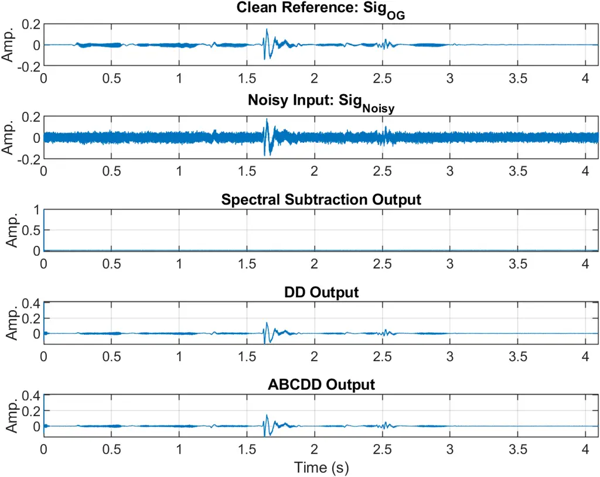
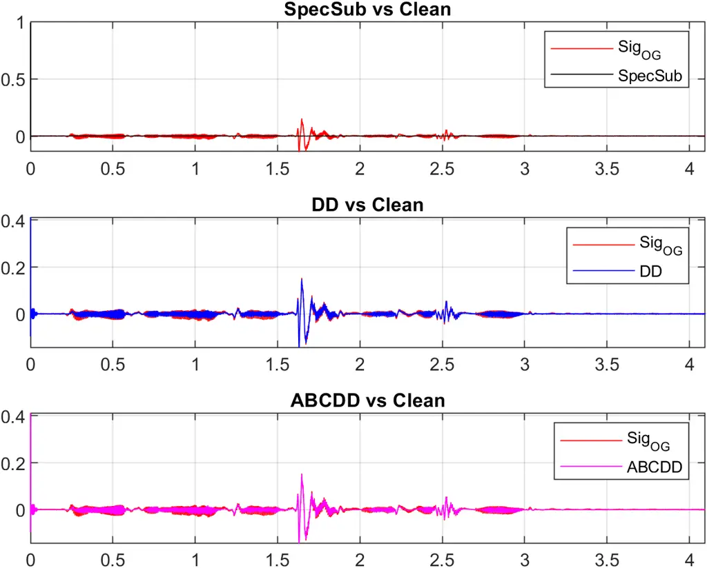
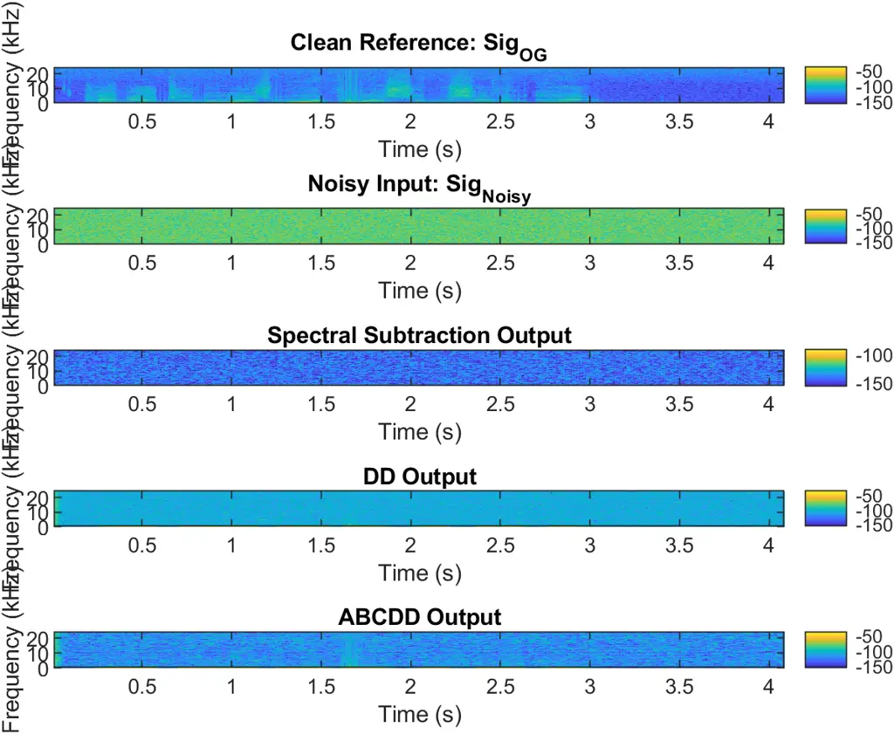
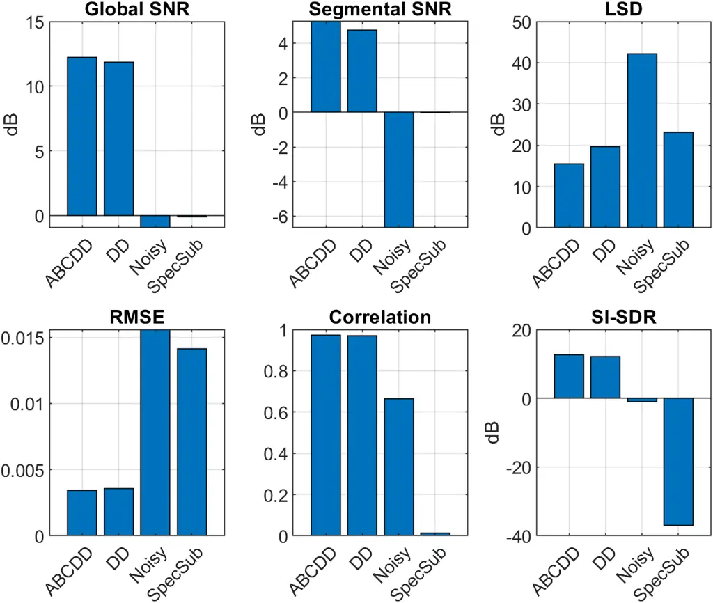
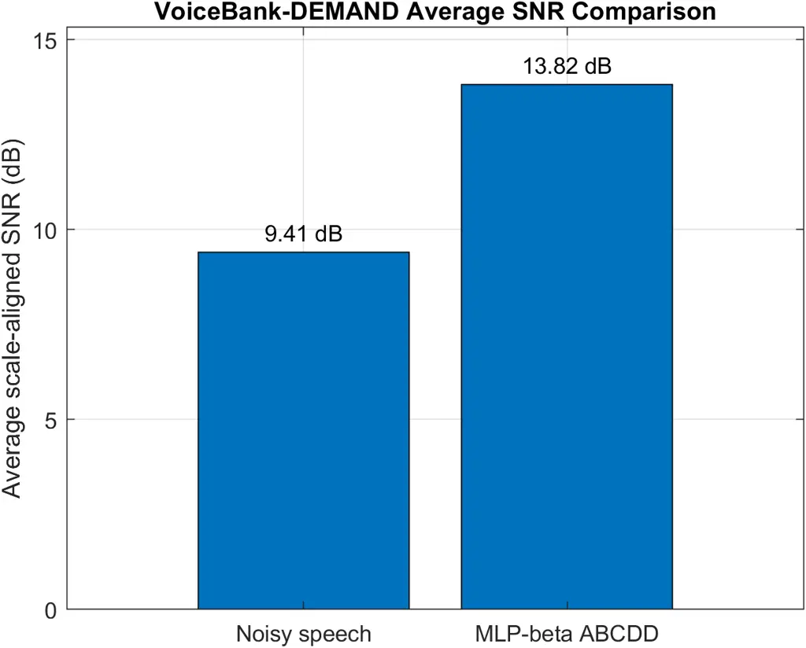

# A Hybrid Classical–Learning Framework for Adaptive Decision-Directed Speech Enhancement

Ali Rajabi    Xiangwei Zhou

###### Abstract

Speech enhancement aims to recover clean speech signals from noisy
observations while preserving speech quality and intelligibility.
Classical methods such as Spectral Subtraction and Decision-Directed
(DD) enhancement remain widely used because of their interpretability
and low computational complexity, but they may suffer from musical-noise
artifacts or excessive attenuation of weak speech components under low
signal-to-noise ratio (SNR) conditions. This paper proposes an Adaptive
Beta-Constrained Decision-Directed (ABCDD) speech enhancement framework
that extends the conventional DD method through a frame-dependent lower
gain bound. The introduced beta parameter controls the tradeoff between
noise suppression and speech preservation. To automate parameter
selection for large and diverse datasets, a lightweight multilayer
perceptron (MLP) model is further developed to predict frame-level beta
values directly from noisy-speech features. The proposed framework is
evaluated using both a representative speech example and large-scale
testing on the VoiceBank-DEMAND dataset. In the representative example,
ABCDD outperformed conventional Spectral Subtraction and classical DD
across multiple objective metrics, including SNR, Log-Spectral Distance
(LSD), Root-Mean-Square Error (RMSE), correlation, and Scale-Invariant
Signal-to-Distortion Ratio (SI-SDR). On 100 unseen VoiceBank-DEMAND test
files, the proposed MLP-beta ABCDD method improved average scale-aligned
SNR from 9.41 dB to 13.82 dB, corresponding to an average gain of 4.41
dB. The results indicate that combining interpretable classical
enhancement structure with lightweight machine-learning-based parameter
adaptation provides an effective and practical direction for robust
speech enhancement.

## I Introduction

Speech enhancement aims to recover a clean speech signal from
observations degraded by additive background noise. The problem remains
challenging because practical acoustic noise is often time-varying and
non-stationary. Reliable speech enhancement is important in
communication systems, hearing devices, speech recording,
teleconferencing, and robust automatic speech processing applications
\[13, 14\].

Because both speech and noise characteristics vary across time and
frequency, many enhancement methods operate in the short-time spectral
domain, where noisy speech is processed frame by frame after
time-frequency transformation. Early approaches in this category include
Spectral Subtraction, one of the earliest and most widely used speech
enhancement methods \[2\]. Later refinements introduced over-subtraction
and spectral flooring to reduce residual noise and improve robustness
\[1\]. These methods are widely used because of their conceptual
simplicity and low computational complexity. However, Spectral
Subtraction is sensitive to noise-estimation errors and may introduce
speech distortion or musical-noise artifacts \[2, 1\].

To address these limitations, gain-based statistical enhancement methods
such as Wiener filtering and minimum mean-square error (MMSE) estimators
were developed \[8, 5\]. Decision-directed (DD) enhancement further
improved temporal smoothness by recursively estimating the _a priori_
signal-to-noise ratio (SNR) from previous enhanced frames and current
observations \[12\]. Nevertheless, DD gains may become excessively small
in low-SNR regions, which can lead to over-attenuation of weak speech
components.

These limitations highlight the need for enhancement methods that
suppress noise effectively while adaptively preserving weak speech
content. Accurate noise estimation is also important in practical
systems. Minimum-statistics and recursive noise-tracking methods were
developed to estimate non-stationary noise power spectral density (PSD)
under realistic acoustic conditions \[10\]. Other approaches
incorporated speech-presence uncertainty to improve robustness in
changing environments \[4\]. Spectral-flooring strategies have also
remained useful in modern real-time systems because they help reduce
over-suppression and limit artifacts \[7\].

Broader prior studies in speech enhancement can be grouped into three
main directions. First, classical spectral-domain approaches focused on
subtraction rules and statistical gain estimation, including Spectral
Subtraction \[2\], Wiener filtering \[8\], MMSE estimators \[5\], and
DD-based enhancement \[12\]. Second, adaptive noise-estimation
techniques improved robustness under non-stationary acoustic
environments \[10, 4\]. Third, recent learning-based methods have
learned direct mappings from noisy speech to clean speech
representations using feedforward neural networks \[14\], recurrent
neural networks \[3\], convolutional time-domain models \[11\], and
lightweight real-time architectures \[13\]. Deep learning has also been
used to improve classical enhancement components such as noise PSD
estimation \[15\]. Hybrid approaches combining signal processing and
learning-based adaptation have likewise shown practical benefits \[6\].

Although modern neural approaches can achieve strong enhancement
performance, many purely data-driven models reduce interpretability and
may require greater computational resources than classical gain-based
methods. On the other hand, conventional DD enhancement preserves a
transparent and efficient structure, but its gain may over-suppress weak
speech when local SNR becomes low. This motivates adaptive frameworks
that retain classical interpretability while introducing data-driven
parameter control.

In this work, an Adaptive Beta-Constrained Decision-Directed (ABCDD)
enhancement framework is proposed. The method modifies the conventional
DD gain by imposing a frame-dependent lower gain bound controlled by a
beta parameter. This beta value governs the tradeoff between noise
suppression and speech preservation. Smaller beta values allow stronger
suppression but may distort weak speech, whereas larger beta values
preserve speech components but may leave residual noise.

Manual beta tuning may be feasible for a single speech example, but it
becomes impractical for large datasets containing many speakers,
utterances, and noise conditions. Therefore, this paper further proposes
a lightweight multilayer perceptron (MLP)-based beta prediction strategy
for ABCDD enhancement. Instead of manually selecting beta values, the
trained MLP predicts frame-dependent beta values from noisy-speech
features. The model is trained and evaluated using the VoiceBank-DEMAND
dataset, which provides paired clean and noisy speech examples for
speech enhancement experiments \[3\].

The main contributions of this work are summarized as follows. (1) An
ABCDD enhancement framework is developed to improve the tradeoff between
speech preservation and noise suppression. (2) A lightweight MLP model
is developed to predict frame-level beta values automatically from
noisy-speech features. (3) The proposed method is validated on a
representative speech example and on 100 unseen VoiceBank-DEMAND test
files, demonstrating improved enhancement performance.

## II Background and Preliminaries

This section reviews the fundamental signal-processing methods that
motivate the proposed framework. Since the objective of speech
enhancement is to estimate clean speech from noisy observations,
classical spectral-domain approaches such as spectral subtraction and
decision-directed (DD) estimation provide useful baselines. These
methods also form the foundation of the constrained decision-directed
(CDD) enhancement strategy developed later in this paper.

### II-A Noisy Speech Model and STFT Representation

The observed noisy speech signal is commonly modeled as the sum of clean
speech and additive noise:

```math
x(n)=s(n)+v(n) \tag{1}
```

where $`x(n)`$, $`s(n)`$, and $`v(n)`$ denote the noisy speech, clean
speech, and noise signals, respectively. This additive model is widely
used in speech enhancement studies \[2\].

Because speech and environmental noise are nonstationary, their
short-term energy and spectral content vary over time. Therefore,
enhancement is typically performed in the short-time Fourier transform
(STFT) domain \[8\]. The STFT of $`x(n)`$ is defined as

```math
X(k,m)=\sum_{r=0}^{L-1}x(r+mR)w(r)e^{-j2\pi kr/N} \tag{2}
```

where $`k`$ is the frequency-bin index, $`m`$ is the frame index,
$`w(r)`$ is the analysis window, $`L`$ is the frame length, $`R`$ is the
hop size, and $`N`$ is the FFT size.

Under the additive model, the noisy spectral coefficient can be written
as

```math
X(k,m)=S(k,m)+V(k,m) \tag{3}
```

where $`S(k,m)`$ and $`V(k,m)`$ represent the clean speech and noise
spectral components, respectively.

This time-frequency representation enables spectral subtraction to
attenuate estimated noise bins \[2\], Wiener filtering to perform
statistical gain control \[8\], and decision-directed methods to
recursively smooth spectral estimates \[5\].

After enhancement, the modified spectrum $`\hat{S}(k,m)`$ is converted
back to the time domain using the inverse STFT:

```math
\hat{s}_{m}(r)=\frac{1}{N}\sum_{k=0}^{N-1}\hat{S}(k,m)e^{j2\pi kr/N} \tag{4}
```

The reconstructed short-time frames are then shifted and summed using
overlap-add synthesis to produce the final enhanced waveform
$`\hat{s}(n)`$.

### II-B Spectral Subtraction Method

Spectral subtraction is one of the earliest and most widely used speech
enhancement techniques. The method estimates clean speech by subtracting
an estimate of the noise spectrum from the noisy speech spectrum in the
STFT domain \[2\]. Let the noisy spectrum satisfy

```math
X(k,m)=S(k,m)+V(k,m) \tag{5}
```

where $`X(k,m)`$, $`S(k,m)`$, and $`V(k,m)`$ denote the noisy speech,
clean speech, and noise spectral coefficients, respectively.

In practice, the noise magnitude spectrum $`|\hat{V}(k,m)|`$ is commonly
obtained from noise-only segments, low-energy frames, or recursive noise
power estimation methods \[10\]. Using this estimate, the enhanced
speech magnitude can be written as

```math
|\hat{S}(k,m)|=\max\left(|X(k,m)|-|\hat{V}(k,m)|,0\right) \tag{6}
```

where the nonnegative constraint avoids invalid negative magnitudes
after subtraction.

To improve robustness, an over-subtraction factor $`\alpha_{s}`$ and a
spectral floor parameter $`\beta_{s}`$ are often introduced \[1\]:

```math
|\hat{S}(k,m)|=\max\left(|X(k,m)|-\alpha_{s}|\hat{V}(k,m)|,\beta_{s}|X(k,m)|\right) \tag{7}
```

where $`\alpha_{s}>1`$ increases suppression strength and $`\beta_{s}`$
prevents excessive attenuation.

Because only the magnitude spectrum is modified, the noisy phase is
typically preserved:

```math
\hat{S}(k,m)=|\hat{S}(k,m)|e^{j\angle X(k,m)} \tag{8}
```

The enhanced time-domain signal is then recovered through the inverse
STFT and overlap-add synthesis in (4).

Spectral subtraction is still useful because it is computationally
efficient and straightforward to implement. However, inaccurate noise
estimation may generate residual tonal artifacts known as musical noise,
while aggressive subtraction can distort weak speech components \[9\].
These limitations motivate more adaptive gain-based methods such as
Wiener filtering and decision-directed enhancement.

### II-C Decision-Directed (DD) Enhancement

Decision-directed (DD) enhancement is a gain-based spectral-domain
method that improves speech continuity by recursively estimating the _a
priori_ signal-to-noise ratio (SNR). Compared to spectral subtraction
method, DD method generally reduce musical noise and provide smoother
frame-to-frame enhancement behavior \[5, 12\].

Let $`\lambda_{v}(k,m)`$ denote the noise power spectral density (PSD).
The _a posteriori_ SNR is computed from the noisy observation as

```math
\gamma(k,m)=\frac{|X(k,m)|^{2}}{\lambda_{v}(k,m)} \tag{9}
```

where $`X(k,m)`$ is the noisy speech STFT coefficient.

Instead of relying only on the current frame, the DD approach
recursively estimates the _a priori_ SNR using both the previous
enhanced frame and the present observation:

```math
\xi_{DD}(k,m)=\alpha\frac{|\hat{S}(k,m-1)|^{2}}{\lambda_{v}(k,m)}+(1-\alpha)\max\!\left(\gamma(k,m)-1,0\right) \tag{10}
```

where $`\xi_{DD}(k,m)`$ denotes the DD estimate of the a priori SNR,
$`\hat{S}(k,m-1)`$ is the enhanced speech spectrum from the previous
frame, and $`0<\alpha<1`$ is a smoothing parameter that controls the
tradeoff between relying on the previous enhanced frame and the current
noisy observation.

The first term preserves temporal continuity using past enhanced speech,
while the second term incorporates current-frame information. This
balance helps suppress rapid gain fluctuations that often create
residual artifacts.

Using the estimated _a priori_ SNR, a Wiener-type gain is obtained as

```math
G_{DD}(k,m)=\frac{\xi_{DD}(k,m)}{1+\xi_{DD}(k,m)} \tag{11}
```

The enhanced spectrum is then computed by

```math
\hat{S}(k,m)=G_{DD}(k,m)X(k,m) \tag{12}
```

Finally, the enhanced time-domain signal is reconstructed through the
inverse STFT and overlap-add synthesis in (4).

Decision-directed enhancement is effective because it provides smoother
suppression than basic spectral subtraction and usually preserves speech
quality more naturally. However, when $`\xi_{DD}(k,m)`$ becomes very
small in low-SNR regions, the gain in (11) may excessively attenuate
weak speech components. This limitation motivates the constrained
decision-directed method introduced next.

## III Proposed Methodology

This section presents the proposed enhancement framework developed in
this work. Starting from the conventional decision-directed (DD) method,
an adaptive beta-constrained formulation is introduced to improve the
tradeoff between noise suppression and speech preservation. Motivated by
the difficulty of manually selecting suitable beta values over large
datasets, a machine-learning-based strategy is then developed to predict
frame-dependent beta values for the proposed enhancement system.

### III-A Adaptive Beta-Constrained Decision-Directed (ABCDD) Enhancement

Although DD enhancement provides smoother suppression than spectral
subtraction, the gain in low-SNR regions may become excessively small
and attenuate weak speech components. To address this limitation, the
proposed Adaptive Beta-Constrained Decision-Directed (ABCDD) method
introduces a lower gain bound controlled by a frame-dependent parameter
$`\beta_{m}`$, where $`\beta_{m}\in[0,1]`$. Starting from the DD gain in
(11), the constrained gain is defined as

```math
G_{ABCDD}(k,m)=\max\left(G_{DD}(k,m),\beta_{m}\right) \tag{13}
```

where $`\beta_{m}`$ is the adaptive beta parameter associated with frame
$`m`$. This modification imposes a lower gain floor on the conventional
DD estimator. As a result, excessive attenuation in low-SNR regions can
be reduced, while a tunable balance between noise suppression and speech
preservation is maintained. The enhanced spectrum is then computed as

```math
\hat{S}(k,m)=G_{ABCDD}(k,m)X(k,m) \tag{14}
```

The reconstructed short-time frames are then shifted and summed using
overlap-add synthesis to produce the final enhanced waveform which is
reconstructed using the ISTFT and overlap-add synthesis in (4).

The parameter $`\beta_{m}`$ directly controls the behavior of the ABCDD
method. Smaller values allow stronger noise suppression but may distort
weak speech, whereas larger values preserve speech components while
reducing noise suppression strength. If $`\beta_{m}`$ becomes too large,
residual noise may remain audible. If $`\beta_{m}`$ becomes too small,
the method approaches conventional DD behavior and may over-suppress
low-energy speech components. Therefore, different beta settings may
lead to noticeably different output waveforms and signal-to-noise ratio
(SNR) values. Thus, selecting appropriate beta values is crucial to
ABCDD performance.

For a given speech signal, the beta parameter can be manually adjusted
to improve enhancement quality. By varying $`\beta_{m}`$, the balance
between residual noise and speech preservation can be controlled.
Although manual tuning may be effective for a single speech example, the
preferred beta value can vary across speakers, utterances (audio
samples), and noise conditions. As a result, manual beta selection is
impractical for large datasets and motivates automatic beta prediction.

### III-B MLP-Based Beta Prediction for ABCDD Enhancement

To automate beta selection for the proposed ABCDD method, a multilayer
perceptron (MLP) model is developed to predict frame-dependent beta
values directly from noisy-speech frame features. Instead of manually
tuning $`\beta_{m}`$ for each speech sample, the trained network
estimates suitable beta values in a data-driven manner.

For each frame $`m`$, a feature vector is extracted as

```math
\mathbf{f}_{m}=[f_{1},f_{2},\dots,f_{P}]^{T} \tag{15}
```

where $`P`$ denotes the number of selected features that include
posterior SNR statistics, DD gain statistics, frame energy, and spectral
flatness. These features provide information regarding noise level,
spectral structure, and enhancement behavior of the current frame.

The MLP learns a non-linear mapping between the input features and the
desired beta value:

```math
\beta_{m}=\Phi(\mathbf{f}_{m};\Theta) \tag{16}
```

where $`\Phi(\cdot)`$ denotes the neural network model and $`\Theta`$
represents the trainable parameters, including layer weights and biases.
The implemented MLP consists of two fully connected hidden layers with
64 and 32 neurons, respectively, followed by rectified linear unit
(ReLU) activations. A single-output regression node was used to predict
the beta value. L2 regularization with coefficient $`10^{-4}`$ was
applied to reduce overfitting, and the network was trained for up to 300
iterations using MATLAB’s built-in regression neural network optimizer.
These settings were selected to provide sufficient non-linear modeling
capacity while maintaining low computational complexity.

VoiceBank-DEMAND dataset was used to generate supervised training
examples under diverse speakers and noise conditions \[3\]. Noisy speech
files were processed frame by frame, and feature vectors were extracted
from each frame. Each speech recording was segmented into overlapping
short-time frames using a 25 ms analysis window and 10 ms frame shift.
The number of frames extracted from each file depended on signal
duration, with typical recordings producing several hundred frames. A
subset of 500 noisy-clean paired utterances from the VoiceBank-DEMAND
training dataset was used for model development. After frame
segmentation and feature extraction, these recordings generated 164,692
labeled frame-level examples.

For each training frame, candidate beta values were selected and
evaluated over a finite predefined uniform search grid in $`[0,1]`$. The
beta value that minimized the enhancement loss with respect to the
corresponding clean reference signal, such as reduced reconstruction
error or improved SNR, was selected as the oracle target label.
Therefore, each label represents the best beta value within the tested
search range. These oracle beta labels were then paired with the
extracted feature vectors to form the supervised training dataset.

The dataset was randomly divided into 80% training data (131,754 frames)
and 20% validation data (32,938 frames). The training subset was used to
optimize the network parameters, while the validation subset was used to
evaluate generalization performance and reduce overfitting. Model
training minimized mean squared error between predicted and oracle beta
labels. Hyperparameters such as the number of hidden layers, number of
neurons, learning iterations, regularization level, and activation type
were selected based on validation performance.

After training, the final model was evaluated on 100 unseen noisy speech
files. During enhancement, the trained model predicts $`\beta_{m}`$ for
each frame, and the predicted value is inserted into (13) to generate
the adaptive enhancement gain. This data-driven approach enables
scalable parameter adaptation while retaining the interpretable ABCDD
enhancement structure. The proposed framework was implemented in MATLAB
and evaluated using a single speech example and the VoiceBank-DEMAND
dataset. The following section presents the experimental setup and
comparative performance results.

## IV Experimental Setup and Results

This section evaluates the proposed ABCDD framework using a
representative speech example and large-scale dataset testing. First,
Spectral Subtraction (SpecSub), DD, and ABCDD are compared on a
controlled noisy signal. Then, the MLP-based beta prediction method is
evaluated on the VoiceBank-DEMAND dataset.

### IV-A Representative Speech Example Evaluation

Let $`Sig_{OG}`$ denote the clean reference signal, and let additive
noise generate the corrupted signal $`Sig_{Noisy}`$. SpecSub, DD, and
ABCDD were applied to the same noisy input using identical STFT settings
for fair comparison. Enhanced signals were reconstructed using the
ISTFT.

Performance was assessed using waveform inspection and objective metrics
relative to the clean reference. Global SNR measures overall noise
reduction, Segmental SNR averages frame-wise SNR, LSD measures spectral
distortion, RMSE measures sample-wise error, correlation measures
waveform similarity, and SI-SDR evaluates distortion after scale
alignment.

Fig. 1 summarizes the representative-example results.

| Method  | SNR   | SegSNR | LSD   | RMSE   | Corr.  | SI-SDR |
| ------- | ----- | ------ | ----- | ------ | ------ | ------ |
|         | (dB)  | (dB)   | (dB)  |        |        | (dB)   |
| Noisy   | -0.94 | -6.67  | 42.19 | 0.0156 | 0.6650 | -1.01  |
| SpecSub | -0.09 | -0.03  | 23.08 | 0.0141 | 0.0143 | -36.91 |
| DD      | 11.88 | 4.77   | 19.61 | 0.0036 | 0.9710 | 12.17  |
| ABCDD   | 12.22 | 5.25   | 15.46 | 0.0034 | 0.9739 | 12.65  |

TABLE I: Representative Speech Example Results for $`Sig_{Noisy}`$

Table I shows that ABCDD achieved the best performance for all reported
metrics. Compared to DD, ABCDD improved SNR, Segmental SNR, Log-Spectral
Distance (LSD), Root-Mean-Square Error (RMSE), correlation, and
Scale-Invariant Signal-to-Distortion Ratio (SI-SDR), confirming that the
adaptive beta floor improves the tradeoff between noise suppression and
speech preservation.

SpecSub reduced some noise energy and spectral distortion, but its low
correlation and poor SI-SDR indicate weak preservation of speech
structure. This behavior is consistent with known spectral-subtraction
artifacts such as speech distortion and musical noise.

DD substantially outperformed SpecSub through smoother recursive gain
adaptation. ABCDD further improved DD by preserving weak speech
components while maintaining effective suppression.



(a) Time-domain waveforms



(b) Overlay with clean reference



(c) Spectrogram comparison



(d) Objective metric comparison

Figure 1: Representative speech example evaluation for $`Sig_{Noisy}`$
using SpecSub, DD, and ABCDD.

### IV-B Large-Scale VoiceBank-DEMAND Evaluation

To evaluate scalability, the proposed MLP-based beta prediction
framework was tested on the VoiceBank-DEMAND dataset. A subset of 500
noisy-clean paired utterances was used for training, and the final model
was evaluated on 100 unseen noisy speech files.

For each test signal, frame-level features were extracted and used by
the trained MLP to predict adaptive beta values, which were then applied
within the ABCDD gain function.

Average scale-aligned SNR was used as the primary metric. The noisy test
files achieved an average SNR of 9.41 dB, while the proposed MLP-beta
ABCDD method achieved 13.82 dB, corresponding to an average SNR
improvement of 4.41 dB.

Fig. 2 presents the average SNR comparison for the 100 unseen test
utterances. The positive gain indicates that the trained model learned
effective beta adaptation across diverse noisy speech conditions.



(a) Average scale-aligned SNR comparison.

Figure 2: Large-scale VoiceBank-DEMAND evaluation of the proposed
MLP-beta ABCDD method.

## V Conclusion

This paper presented ABCDD speech enhancement framework that extends the
classical DD method through a frame-dependent lower gain bound. The
proposed gain-floor control improves the balance between noise
suppression and speech preservation, particularly for weak speech
components in low-SNR regions.

For large datasets such as VoiceBank-DEMAND, automatic parameter
selection is required. Therefore, an MLP model was developed and trained
on the dataset to predict frame-level beta values from noisy-speech
features. This enables scalable enhancement without manual tuning for
each utterance.

Experimental results on a representative speech example showed that
ABCDD outperformed conventional Spectral Subtraction and classical DD
across multiple objective metrics, including SNR, LSD, RMSE,
correlation, and SI-SDR. Large-scale evaluation on the VoiceBank-DEMAND
dataset further demonstrated that the proposed MLP-beta ABCDD method
improved average scale-aligned SNR by 4.41 dB over the noisy baseline
across 100 unseen test files.

Overall, the results indicate that combining interpretable classical
enhancement structure with lightweight machine-learning-based parameter
adaptation is a practical direction for robust speech enhancement.
Future work may consider deeper neural architectures, perceptual quality
metrics, real-time implementation, and evaluation under broader
non-stationary noise conditions.

## References

- \[1\] M. Berouti, R. Schwartz, and J. Makhoul (1979) Enhancement of
  speech corrupted by acoustic noise. In ICASSP’79. IEEE International
  Conference on Acoustics, Speech, and Signal Processing, Vol. 4,
  pp. 208–211. Cited by: §I, §II-B.
- \[2\] S. Boll (1979) Suppression of acoustic noise in speech using
  spectral subtraction. IEEE Transactions on acoustics, speech, and
  signal processing 27 (2), pp. 113–120. Cited by: §I, §I, §II-A, §II-A,
  §II-B.
- \[3\] C. V. Botinhao, X. Wang, S. Takaki, and J. Yamagishi (2016)
  Investigating rnn-based speech enhancement methods for noise-robust
  text-to-speech. In 9th ISCA speech synthesis workshop, pp. 159–165.
  Cited by: §I, §I, §III-B.
- \[4\] I. Cohen and B. Berdugo (2001) Speech enhancement for
  non-stationary noise environments. Signal processing 81 (11),
  pp. 2403–2418. Cited by: §I, §I.
- \[5\] Y. Ephraim and D. Malah (2003) Speech enhancement using a
  minimum-mean square error short-time spectral amplitude estimator.
  IEEE Transactions on acoustics, speech, and signal processing 32 (6),
  pp. 1109–1121. Cited by: §I, §I, §II-A, §II-C.
- \[6\] M. Gutiérrez-Muñoz and M. Coto-Jiménez (2022) An experimental
  study on speech enhancement based on a combination of wavelets and
  deep learning. Computation 10 (6), pp. 102. Cited by: §I.
- \[7\] G. Ioannides and V. Rallis (2023) Real-time speech enhancement
  using spectral subtraction with minimum statistics and spectral floor.
  arXiv preprint arXiv:2302.10313. Cited by: §I.
- \[8\] J. S. Lim and A. V. Oppenheim (1979) Enhancement and bandwidth
  compression of noisy speech. Proceedings of the IEEE 67 (12),
  pp. 1586–1604. Cited by: §I, §I, §II-A, §II-A.
- \[9\] Y. Lu and P. C. Loizou (2008) A geometric approach to spectral
  subtraction. Speech communication 50 (6), pp. 453–466. Cited by:
  §II-B.
- \[10\] R. Martin (2001) Noise power spectral density estimation based
  on optimal smoothing and minimum statistics. IEEE Transactions on
  speech and audio processing 9 (5), pp. 504–512. Cited by: §I, §I,
  §II-B.
- \[11\] A. Pandey and D. Wang (2019) A new framework for cnn-based
  speech enhancement in the time domain. IEEE/ACM Transactions on Audio,
  Speech, and Language Processing 27 (7), pp. 1179–1188. Cited by: §I.
- \[12\] P. Scalart and J. Vieira Filho (1996) Speech enhancement based
  on a priori signal to noise estimation. In Proceedings of IEEE
  International Conference on Acoustics, Speech, and Signal Processing
  (ICASSP), Vol. 2, pp. 629–632. Cited by: §I, §I, §II-C.
- \[13\] J. Valin, U. Isik, N. Phansalkar, R. Giri, K. Helwani, and A.
  Krishnaswamy (2020) A perceptually-motivated approach for
  low-complexity, real-time enhancement of fullband speech. arXiv
  preprint arXiv:2008.04259. Cited by: §I, §I.
- \[14\] Y. Xu, J. Du, L. Dai, and C. Lee (2013) An experimental study
  on speech enhancement based on deep neural networks. IEEE Signal
  processing letters 21 (1), pp. 65–68. Cited by: §I, §I.
- \[15\] Q. Zhang, A. Nicolson, M. Wang, K. K. Paliwal, and C.
  Wang (2020) DeepMMSE: a deep learning approach to mmse-based noise
  power spectral density estimation. IEEE/ACM Transactions on Audio,
  Speech, and Language Processing 28, pp. 1404–1415. Cited by: §I.
