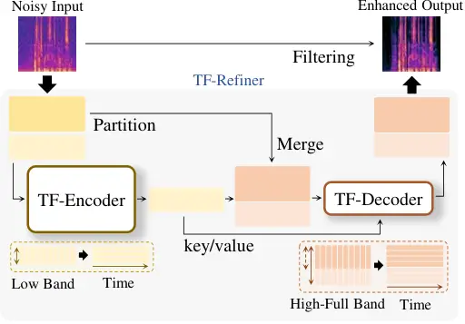
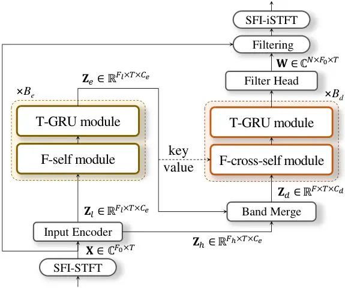
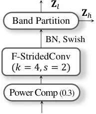
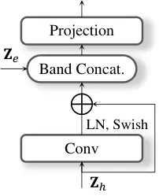
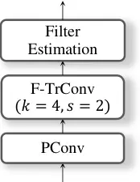
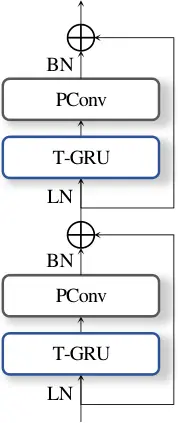
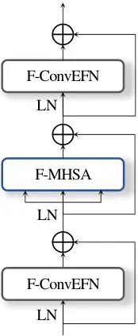
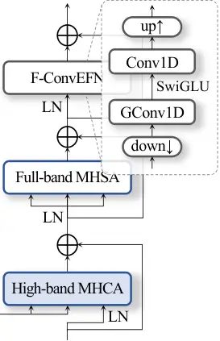

# CONFIGURABLE-BANDWIDTH TIME–FREQUENCY MODELING FOR EFFICIENT FULL-BAND SPEECH ENHANCEMENT ACROSS SAMPLING RATES

Ui-Hyeop Shin^(1,\*)    Wooseok Kim^(2,\*)    Hyung-Min Park^(1,2)
^(†)^(†)thanks: ^(\*)Equal contribution. The order is
alphabetical.^(†)^(†)thanks: This work was partly supported by Institute
of Information & communications Technology Planning & Evaluation (IITP)
grant funded by the Korea government (MSIT) (RS-2022-II220989,
Development of Artificial Intelligence Technology for Multi-speaker
Dialog Modeling) and National Research Foundation of Korea (NRF) grant
funded by the Korea government (MSIT) (RS-2026-25470024, Research on
Spatial Audio Reasoning with Large Language Models across Diverse
Microphone Arrays).

###### Abstract

Speech enhancement systems are often developed for a fixed sampling
rate, while time–frequency models become more expensive as the number of
frequency bins increases. We propose _TF-Refiner_, a
sampling-frequency-independent model that decouples the deep analysis
bandwidth from the full-band input and output. A deep encoder processes
the band below a configurable cutoff, while a shallow decoder combines
the encoded features with input-dependent high-band queries and predicts
local complex filters applied to the original noisy STFT. A single
parameter set trained at 16 and 48 kHz is evaluated at various sampling
rates. On VoiceBank+DEMAND, the _universal_ model outperforms the
rate-specific counterparts in PESQ, STOI, and log-spectral distance
across the evaluated rates, including rates unseen in training.
Random-cutoff training enables inference-time selection of cost–quality
operating points without retraining or changing the output bandwidth.
These results support configurable analysis bandwidth as a practical
design choice for multi-rate full-band enhancement.

###### Index Terms: 

speech enhancement, full-band audio, sampling-frequency independence,
configurable computation

^(†)^(†)address: ¹Department of Electronic Engineering, ²Department of
Artificial Intelligence  
Sogang University, Seoul, Republic of Korea  
{dmlguq123, wooseokkim, hpark}@sogang.ac.kr

## 1 Introduction

Speech enhancement (SE) is deployed at more than one sampling rate:
telephony and on-device pipelines operate at 16 kHz, whereas
conferencing and media applications increasingly require full-band
48-kHz audio \[3\], whose band above 8 kHz carries cues of naturalness
and intelligibility \[25, 11, 12\]. In practice, a separate model is
typically trained for each rate: lightweight streaming models \[15, 16,
1\] for 16 kHz and full-band systems \[30, 29, 20, 19, 33\] for 48 kHz.
Sampling-frequency-independent (SFI) processing removes this duplication
in principle by tying the network to physical frequency rather than to a
fixed bin index \[13, 18, 35\], and time–frequency (TF) dual-path
models \[2, 32, 17\], which treat the frequency axis as a sequence,
support this representation naturally. However, existing SFI enhancement
systems have relatively high computational demands \[35, 34, 4\], and
the cost of a TF dual-path model grows almost proportionally with the
number of bins, so that the same architecture becomes substantially more
expensive at 48 than at 16 kHz \[22\].

Figure 1: Overall flow of TF-Refiner: deep analysis of the band below
$`f_{c}`$, shallow full-band decoding with cross-attention to the
encoder output, and filtering of the original noisy STFT.

Practical full-band systems avoid this growth with hand-designed
frequency structures, such as perceptual-band envelopes \[30, 29\],
equivalent-rectangular-bandwidth (ERB) gains refined by complex
filtering only in the low band \[19\], or fixed sub-band networks \[33,
6\]. In these designs, however, the allocation of analysis effort across
frequency is fixed at design time and tied to one sampling rate.

These observations motivate a _configurable analysis bandwidth_: a
single SFI model whose deep analysis is confined to a band defined in
physical frequency, while its full-band input and output follow the
sampling rate. To this end, we propose _TF-Refiner_, an asymmetric
encoder–decoder for full-band SE, as shown in Figure 1. It builds on the
query-based asymmetric structure of TF-Restormer \[22\], which analyzes
only the observed band and synthesizes the unobserved band from
learnable extension queries, and moves the band partition from the edge
of the observed spectrum to a configurable cutoff $`f_{c}`$ inside it. A
deep TF-Encoder analyzes the band below $`f_{c}`$, whereas the
complementary observed band enters a shallow TF-Decoder as
input-dependent queries that attend to the encoder output \[7, 5\], so
that the encoder cost is set by $`f_{c}`$ rather than by the sampling
rate. Rather than mapping the spectrum directly, the decoder predicts
local complex filters applied to the original noisy STFT \[10, 21\],
preserving the observed resolution. Unlike the frequency projection of
TF-Restormer, which fixes a maximum bin count, no parameter of
TF-Refiner depends on the number of bins, enabling one parameter set to
serve any sampling rate.

Experiments show that a single _universal_ model trained at 16 and
48 kHz matches or exceeds rate-specific training in perceptual quality
and generalizes to unseen rates, while random-cutoff training lets
$`f_{c}`$ set the cost–quality trade-off at inference without
retraining.

## 2 TF-Refiner

Figure 2: Architecture of TF-Refiner. The $`F_{l}`$ positions below
$`f_{c}`$ form $`\mathbf{Z}_{l}`$ for the deep TF-Encoder and the
remaining $`F_{h}`$ positions form $`\mathbf{Z}_{h}`$. Band Merge
concatenates $`\mathbf{Z}_{h}`$ with the encoder output
$`\mathbf{Z}_{e}`$ for the shallow TF-Decoder, which also attends to
$`\mathbf{Z}_{e}`$ as key/value.

As shown in Figure 2, TF-Refiner realizes the configurable bandwidth
through an SFI representation that keeps $`f_{c}`$ at the same physical
frequency for every rate, a deep TF-Encoder for the analysis band only,
a shallow TF-Decoder that refines the complementary observed band
through cross-attention, and a Filter Head that predicts local complex
filters for the original noisy STFT. $`F_{l}`$ is fixed by $`f_{c}`$, so
for a given cutoff the sampling rate enters only through
$`F_{h}=F-F_{l}`$.

### 2.1 SFI representation and band partition

The SFI-STFT \[13, 22\] keeps a 40-ms square-root Hann window and a
20-ms hop at every sampling rate $`f_{s}`$, so the bin spacing is 25 Hz
and the one-sided spectrum $`\mathbf{X}`$ has $`F_{0}=0.02f_{s}+1`$
bins. The Input Encoder (Figure 3(a)) compresses the magnitude as
$`\mathbf{X}_{c}\hskip-2.84526pt=\hskip-2.84526pt|\mathbf{X}|^{c}\cdot e^{j\angle{\mathbf{X}}}`$,
where $`c=0.3`$, and embeds the spectrum with a frequency stride of 2,
giving $`\mathbf{Z}`$ with $`F=(F_{0}+1)/2`$. Band Partition splits the
grid at the position of $`f_{c}`$ into $`\mathbf{Z}_{l}`$ and
$`\mathbf{Z}_{h}`$ by $`F_{l}=0.02f_{c}+1`$. We draw $`f_{c}`$ at random
during training, so that one parameter set serves any cutoff at
inference (Section 4.2).

(a) Input Encoder

(b) Band Merge

(c) Filter Head

Figure 3: Components outside the TF modules.

(a) T-GRU module

(b) F-self module

(c) F-cross-self module

Figure 4: Unit modules of TF-Refiner with the ConvEFN structure.

### 2.2 Asymmetric encoder–decoder

The TF-Encoder applies $`B_{e}`$ blocks \[2, 17\], each an F-self module
based on multi-head self-attention (MHSA) with rotary position
encoding \[26\] and $`A_{e}`$ heads followed by a T-GRU module
(Figure 4), to $`\mathbf{Z}_{l}`$ and yields $`\mathbf{Z}_{e}`$. Band
Merge prepares the complementary band as input-dependent queries through
a residual convolution and normalization (Figure 3(b)), concatenates
them with $`\mathbf{Z}_{e}`$ along frequency, and projects the channels
from $`C_{e}`$ to $`C_{d}`$ to form $`\mathbf{Z}_{d}`$. The TF-Decoder
applies $`B_{d}`$ blocks, each an F-cross-self module followed by a
T-GRU module. In the cross-self module only the $`F_{h}`$ complementary
positions query $`\mathbf{Z}_{e}`$ through multi-head cross-attention
(high-band MHCA) with $`A_{d}`$ heads; the low-band positions bypass it.
A full-band MHSA with $`A_{d}`$ heads over all $`F`$ positions then
relates the two bands. Both modules follow TF-Restormer \[22\] and use
convolutional efficient feed-forward networks (ConvEFN) on a
length-reduced sequence \[23\]: MHSA between two ConvEFNs in the F-self
module, and high-band MHCA, full-band MHSA, and one ConvEFN in sequence
in the F-cross-self module, with hidden widths $`H_{e}`$ and $`H_{d}`$
and two-group convolutions. The T-GRU module stacks two unidirectional
GRU residual units.

### 2.3 Deep filtering

Let $`X_{tf}\in\mathbb{C}`$ denote the noisy STFT coefficient at frame
$`t`$ and bin $`f`$, and let $`\mathbf{x}_{tf}\in\mathbb{C}^{N}`$
collect its $`N`$ neighboring coefficients in time and frequency. The
Filter Head (Figure 3(c)) mixes the decoder channels with a pointwise
convolution, restores the STFT frequency resolution with a transposed
convolution along frequency, and estimates the complex filter tensor
$`\mathbf{W}`$ with a convolutional layer. Following the three-component
estimation structure of SR-CorrNet \[24\], three real vectors per bin
$`\mathbf{m}_{tf},\mathbf{a}_{tf},\mathbf{b}_{tf}\in\mathbb{R}^{N}`$
give
$`\mathbf{w}_{tf}=\operatorname{softplus}(\mathbf{m}_{tf})\odot[\tanh(\mathbf{a}_{tf})+j\tanh(\mathbf{b}_{tf})]`$.
As in deep filtering \[10, 21\], the enhanced STFT is
$`\widehat{S}_{tf}=\mathbf{w}_{tf}^{T}\mathbf{x}_{tf}`$, and the
SFI-iSTFT reconstructs the waveform. The compressed features determine
the filter, but the samples being combined are the uncompressed
observations.

| Rate (kHz) | MACs  | Model        | PESQ^(↑) | STOI^(↑) | SI-SDR^(↑) | LSD^(↓) | LSD$`{}_{>8\mathrm{k}}^{\downarrow}`$ |
| ---------- | ----- | ------------ | -------- | -------- | ---------- | ------- | ------------------------------------- |
| 16         | –     | Noisy        | 1.97     | 0.921    | 8.47       | 1.193   | –                                     |
|            | 2.17G | Universal    | 3.46     | 0.952    | 19.69      | 0.619   | –                                     |
|            |       | 16k only     | 3.35     | 0.950    | 19.20      | 0.624   | –                                     |
|            |       | 48k only^(∗) | 3.03     | 0.928    | 18.08      | 0.804   | –                                     |
| 24\*       | –     | Noisy        | 1.97     | 0.921    | 8.44       | 1.297   | 1.349                                 |
|            | 2.63G | Universal    | 3.44     | 0.952    | 19.62      | 0.651   | 0.560                                 |
|            |       | 16k only     | 3.34     | 0.949    | 19.13      | 0.660   | 0.549                                 |
|            |       | 48k only     | 3.18     | 0.939    | 18.58      | 0.758   | 0.702                                 |
| 32\*       | –     | Noisy        | 1.97     | 0.921    | 8.43       | 1.288   | 1.269                                 |
|            | 3.14G | Universal    | 3.47     | 0.953    | 19.47      | 0.660   | 0.595                                 |
|            |       | 16k only     | 3.31     | 0.949    | 19.07      | 0.691   | 0.628                                 |
|            |       | 48k only     | 3.29     | 0.946    | 18.60      | 0.725   | 0.691                                 |
| 44.1\*     | –     | Noisy        | 1.97     | 0.921    | 8.42       | 1.314   | 1.290                                 |
|            | 4.03G | Universal    | 3.47     | 0.952    | 18.27      | 0.721   | 0.705                                 |
|            |       | 16k only     | 3.23     | 0.949    | 18.96      | 0.748   | 0.722                                 |
|            |       | 48k only     | 3.34     | 0.949    | 17.61      | 0.751   | 0.752                                 |
| 48         | –     | Noisy        | 1.97     | 0.921    | 8.41       | 1.314   | 1.285                                 |
|            | 4.35G | Universal    | 3.47     | 0.951    | 18.27      | 0.729   | 0.720                                 |
|            |       | 16k only^(∗) | 3.22     | 0.949    | 18.99      | 0.785   | 0.777                                 |
|            |       | 48k only     | 3.35     | 0.949    | 17.74      | 0.735   | 0.730                                 |

Table 1: The universal model and the two rate-specific models on VBD at
the default cutoff $`f_{c}=5`$ kHz (\*: rates absent from training).

Figure 5: Changing the analysis cutoff $`f_{c}`$ at inference, for
48-kHz (top) and 16-kHz input (bottom). Colored curves: models trained
with $`f_{c}`$ fixed, one color per training cutoff, the circle marking
that cutoff (capped at 7 kHz for 16-kHz input, hence no circle for the
8-, 12-, and 16-kHz models there). Black: the universal model trained
with a randomly drawn cutoff. All curves come from one checkpoint per
model evaluated at each $`f_{c}`$; the cost depends only on the input
rate and $`f_{c}`$, and red marks the default $`f_{c}=5`$ kHz of
Table 1.

## 3 Experimental setup

### 3.1 Datasets and evaluation metrics

We evaluate on the 824-utterance VoiceBank+DEMAND (VBD) test set at 16
and 48 kHz \[28\]; its fixed mixtures use SNRs of
$`\{2.5,7.5,12.5,17.5\}`$ dB. The 16-kHz data are the official
28-speaker VBD training pairs at $`\{0,5,10,15\}`$ dB, divided into
10,413 training and 1,159 validation utterances. The 48-kHz training
data mix clean VCTK speech \[31\] from 98 training and seven validation
speakers, excluding both test speakers, with DNS full-band noise \[3\]
at an integer SNR drawn uniformly from $`\{0,\ldots,19\}`$ dB. VCTK
utterances overlapping the VBD validation set are removed from the
48-kHz pool.

We report wideband PESQ \[14\], STOI \[27\], SI-SDR \[9\], and
log-spectral distance (LSD) over the full input band and above 8 kHz
(LSD\_(\>8k), up to the input Nyquist frequency and hence undefined at
16 kHz). Inference runs at the input rate; SI-SDR and LSD are computed
at that rate against the original clean signal, whereas PESQ and STOI
are computed after resampling to 16 kHz. For the multi-rate evaluation
the same 48-kHz test pairs are resampled to 16, 24, 32, and 44.1 kHz. We
measure multiply–accumulate operations (MACs) for one second of input
using ptflops.

### 3.2 Training and model configuration

We train the universal model by alternating 16-kHz VBD and 48-kHz
VCTK+DNS batches. We use 20 epochs of 20,000 minibatches each (400,000
in total), batch size 2, 2-s crops, and AdamP \[8\] (weight decay 1e-2,
$`\beta=(0.95,0.999)`$). The learning rate is warmed up for 1,000 steps
to 2e-3 and then cosine-decayed to 1e-6. Training draws cutoffs
uniformly from $`\{2,\dots,8,12,16\}`$ kHz for 48-kHz batches and
$`\{2,\dots,7\}`$ kHz for 16-kHz batches. One checkpoint per model is
used for all reported input rates and inference cutoffs. We use the
objective of FastEnhancer \[1\],
$`\mathcal{L}=0.3\mathcal{L}_{\rm mag}+0.2\mathcal{L}_{\rm cplx}+0.3\mathcal{L}_{\rm cons}+0.2\mathcal{L}_{\rm wav}+0.001\mathcal{L}_{\rm pesq}`$,
with power-compressed spectral terms. We use the TF-Refiner-B
configuration in Table 3. The model applies deep filtering over a
$`3\times 3`$ TF neighborhood ($`N=9`$: one past and one future frame,
$`\pm 1`$ bin), with $`3\times 3`$ convolutions in Band Merge and filter
prediction. Each convolution adds one future frame, giving a 40-ms
look-ahead and, with the 40-ms window, an 80-ms algorithmic latency. The
default cutoff is $`f_{c}=5`$ kHz.

## 4 Results

### 4.1 Universal enhancement across sampling rates

Table 1 evaluates the universal model trained at 16 and 48 kHz. The two
rate-specific counterparts are trained only on data at their respective
rate. The universal model maintains comparable perceptual quality at the
unseen rates and improves every metric over the noisy input. It obtains
the best PESQ, STOI, and LSD at every rate and the best SI-SDR up to
32 kHz, whereas the 16-kHz model keeps the highest SI-SDR at 44.1 and
48 kHz, presumably because its training is confined to the
power-dominant low band. The rate-specific models also transfer to
unseen input rates without adaptation, although their PESQ decreases
gradually. With the default cutoff of $`f_{c}=5`$ kHz, the computational
cost grows by about 2.0 times from 16 to 48 kHz, whereas the number of
bins triples, because the encoder analysis band remains fixed while only
the shallow decoder processes the wider observed band.

Because the VBD speech is drawn from VCTK, the two training streams do
not provide disjoint clean-speech corpora; they differ mainly in
sampling bandwidth and corruption generation. Combining VBD pairs with
VCTK+DNS mixtures may therefore contribute to the universal model’s
advantage, but the 48-kHz-only model already uses the larger VCTK+DNS
pool yet remains below the universal model at its native rate. We note
that Table 1 does not isolate the contributions of data diversity and
joint sampling-rate exposure.

|                       |       |        |        |         |        |        |         |
| --------------------- | ----- | ------ | ------ | ------- | ------ | ------ | ------- |
| Method                | Param | 16 kHz |        |         | 48 kHz |        |         |
|                       |       | MACs   | PESQ   | SI-SDR  | MACs   | PESQ   | SI-SDR  |
| Noisy                 | –     | –      | 1.97   | 8.47    | –      | 1.97   | 8.41    |
| GTCRN \[15\]          | 0.02M | 0.04G  | 2.87   | 18.83   | –      | –      | –       |
| UL-UNAS \[16\]        | 0.17M | 0.03G  | 3.09   | 18.48   | –      | –      | –       |
| FastEnhancer-B \[1\]  | 0.09M | 0.26G  | 3.13   | 19.0    | –      | –      | –       |
| FastEnhancer-S \[1\]  | 0.20M | 0.66G  | 3.19   | 19.2    | –      | –      | –       |
| FastEnhancer-M \[1\]  | 0.49M | 2.90G  | 3.24   | 19.4    | –      | –      | –       |
| TF-Refiner-B (16k)    | 0.47M | 2.17G  | 3.35   | 19.20   | 4.35G  | 3.22\* | 18.99\* |
| PercepNet \[29\]      | 8.00M | –      | –      | –       | 0.80G  | 2.73   | –       |
| DeepFilterNet \[20\]  | 1.78M | –      | –      | –       | 0.35G  | 2.81   | 16.63   |
| DMF-Net \[33\]        | 7.84M | –      | –      | –       | –      | 2.97   | –       |
| DeepFilterNet2 \[19\] | 2.31M | –      | –      | –       | 0.36G  | 3.08   | –       |
| TF-Refiner-B (48k)    | 0.47M | 2.17G  | 3.03\* | 18.08\* | 4.35G  | 3.35   | 17.74   |
| TF-Refiner-B          | 0.47M | 2.17G  | 3.46   | 19.69   | 4.35G  | 3.47   | 18.27   |
| TF-Refiner-T^(†)      | 0.09M | 0.54G  | 3.20   | 19.07   | 1.27G  | 3.10   | 17.07   |
| TF-Refiner-S^(†)      | 0.19M | 0.97G  | 3.37   | 19.42   | 2.03G  | 3.36   | 18.36   |
| TF-Refiner-B^(†)      | 0.45M | 2.05G  | 3.30   | 19.42   | 3.85G  | 3.36   | 18.41   |

Table 2: Results on VBD at 16 and 48 kHz. Each TF-Refiner variant uses
the same parameter set for both rates. GTCRN and UL-UNAS report SI-SNR.
DeepFilterNet1/2 \[20, 19\] use DNS training data. \*: zero-shot results
for unseen rates. ^(†): no-look-ahead version.

### 4.2 Configurable computation

Figure 5 compares the universal model with fixed-cutoff controls while
changing $`f_{c}`$ at inference for every model. The controls use the
same 16/48-kHz training with $`f_{c}`$ fixed at 1, 2, 3, 5, 8, 12, or
16 kHz. The total MACs increase with $`f_{c}`$ because more positions
enter the deep encoder. Fixed-cutoff models degrade as the inference
cutoff moves far from their training cutoff. Random-cutoff training
keeps the universal model close to the best fixed-cutoff model in PESQ
and LSD over 2–8 kHz (2–7 kHz for 16-kHz input), while the fixed-cutoff
models retain an advantage at the extremes.

Lowering $`f_{c}`$ from the default 5 to 3 kHz reduces the cost by 29%
at 16 kHz and 16% at 48 kHz with a small PESQ decrease. At lower
cutoffs, the universal model also degrades more gradually than the model
trained at a fixed 5-kHz cutoff. At 48 kHz, the model trained and
evaluated at $`f_{c}=16`$ kHz costs about twice as much as the universal
model at the default cutoff without a higher PESQ.

| Model        | Encoder   |           |           |           | Decoder   |           |           |           |
| ------------ | --------- | --------- | --------- | --------- | --------- | --------- | --------- | --------- |
|              | $`B_{e}`$ | $`C_{e}`$ | $`H_{e}`$ | $`A_{e}`$ | $`B_{d}`$ | $`C_{d}`$ | $`H_{d}`$ | $`A_{d}`$ |
| TF-Refiner-T | 4         | 24        | 42        | 4         | 2         | 12        | 24        | 2         |
| TF-Refiner-S | 4         | 32        | 88        | 4         | 2         | 16        | 48        | 4         |
| TF-Refiner-B | 4         | 48        | 144       | 4         | 2         | 24        | 72        | 4         |

Table 3: Model configurations of the TF-Refiner variants.

### 4.3 Comparison with published systems

Table 2 compares published systems at their native rates with TF-Refiner
variants, each using one parameter set at both rates. For single-rate
comparisons, we include TF-Refiner-B (16k) and TF-Refiner-B (48k), the
rate-specific models of Table 1. At the default $`f_{c}=5`$ kHz,
TF-Refiner-B (16k) achieves a PESQ of 3.35 versus 3.24 for
FastEnhancer-M at 16 kHz, while its SI-SDR is 0.2 dB lower. TF-Refiner-B
(48k) achieves a PESQ of 3.35 versus 3.08 for DeepFilterNet2 \[19\] at
48 kHz. The universal TF-Refiner-B further increases PESQ to 3.46 and
3.47 at 16 and 48 kHz, respectively.

The no-look-ahead variants (^(†)) use frequency-only convolutions with
kernel size 3 in Band Merge and filter prediction, with $`N=3`$
same-frame frequency taps, giving a 40-ms algorithmic latency.
TF-Refiner-B^(†) also outperforms the published systems in PESQ at both
rates. For scaling, we evaluate the tiny and small no-look-ahead
variants using the configurations in Table 3. S^(†) maintains comparable
quality to B^(†) at substantially lower cost, while T^(†) trades some
quality for further savings.

### 4.4 Ablation study

| Model                | PESQ^(↑) | STOI^(↑) | SI-SDR^(↑) | LSD^(↓) | LSD$`{}_{>8\mathrm{k}}^{\downarrow}`$ |
| -------------------- | -------- | -------- | ---------- | ------- | ------------------------------------- |
| TF-Refiner-B (48k)   | 3.35     | 0.949    | 17.74      | 0.735   | 0.730                                 |
| w/o high-band MHCA   | 3.31     | 0.950    | 17.40      | 0.782   | 0.794                                 |
| w/o Band Merge conv. | 3.34     | 0.950    | 17.39      | 0.767   | 0.773                                 |
| w/ direct mapping    | 3.11     | 0.944    | 15.95      | 0.801   | 0.812                                 |

Table 4: Ablation of the rate-specific 48-kHz model.

Table 4 ablates the modules that connect the analysis band to the
full-band output. Removing high-band MHCA, through which the high-band
queries attend to the encoder output, or the Band Merge convolution that
forms those queries changes PESQ and STOI, which assess only the band
below 8 kHz, by at most 0.04 but costs about 0.3 dB of SI-SDR and raises
LSD\_(\>8k) from 0.730 to 0.794 and 0.773, respectively. Both modules
thus mainly serve the observed high band. Replacing local filtering with
direct complex mapping degrades every metric, lowering SI-SDR by 1.8 dB
and raising LSD by 0.07, consistent with the filter preserving the fine
structure of the observed STFT.

## 5 Conclusion

We presented TF-Refiner, a sampling-frequency-independent full-band
speech enhancement model whose deep analysis is confined to a
configurable band while a shallow decoder refines the observed remainder
and filters the original noisy STFT. One universal model enhances 16- to
48-kHz inputs, including unseen rates, and the analysis cutoff selects a
cost–quality operating point at inference without changing the
architecture or retraining. Future work includes evaluation on unseen
corpora and streaming latency measurement.

## References

- \[1\] S. Ahn, J. Han, B. J. Woo, and N. S. Kim (2026) FastEnhancer:
  speed-optimized streaming neural speech enhancement. In Proc. IEEE
  ICASSP, pp. 16847–16851. External Links:
  [Document](https://dx.doi.org/10.1109/ICASSP55912.2026.11464802) Cited
  by: §1, §3.2, Table 2, Table 2, Table 2.
- \[2\] F. Dang, H. Chen, and P. Zhang (2022) DPT-FSNet: dual-path
  transformer based full-band and sub-band fusion network for speech
  enhancement. In Proc. IEEE ICASSP, pp. 6857–6861. External Links:
  [Document](https://dx.doi.org/10.1109/ICASSP43922.2022.9746171) Cited
  by: §1, §2.2.
- \[3\] H. Dubey, V. Gopal, R. Cutler, A. Aazami, S. Matusevych, S.
  Braun, S. E. Eskimez, M. Thakker, T. Yoshioka, H. Gamper, and R.
  Aichner (2022) ICASSP 2022 deep noise suppression challenge. In Proc.
  IEEE ICASSP, pp. 9271–9275. External Links:
  [Document](https://dx.doi.org/10.1109/ICASSP43922.2022.9747230) Cited
  by: §1, §3.1.
- \[4\] S. Fu, R. Chao, X. Yang, S. Huang, A. Jukić, Y. Tsao, and Y. F.
  Wang (2026) One model, many latencies: universal speech enhancement
  for diverse real-time applications. Note: arXiv:2606.25621 External
  Links: 2606.25621 Cited by: §1.
- \[5\] A. Gupta, J. Wu, J. Deng, and L. Fei-Fei (2023) Siamese masked
  autoencoders. In Proc. NeurIPS, pp. 40676–40693. External Links:
  [Document](https://dx.doi.org/10.52202/075280-1771) Cited by: §1.
- \[6\] X. Hao, X. Su, R. Horaud, and X. Li (2021) FullSubNet: a
  full-band and sub-band fusion model for real-time single-channel
  speech enhancement. In Proc. IEEE ICASSP, pp. 6633–6637. External
  Links: [Document](https://dx.doi.org/10.1109/ICASSP39728.2021.9414177)
  Cited by: §1.
- \[7\] K. He, X. Chen, S. Xie, Y. Li, P. Dollár, and R. Girshick (2022)
  Masked autoencoders are scalable vision learners. In Proc. IEEE/CVF
  CVPR, pp. 15979–15988. External Links:
  [Document](https://dx.doi.org/10.1109/CVPR52688.2022.01553) Cited by:
  §1.
- \[8\] B. Heo, S. Chun, S. J. Oh, D. Han, S. Yun, G. Kim, Y. Uh, and J.
  Ha (2021) AdamP: slowing down the slowdown for momentum optimizers on
  scale-invariant weights. In Proc. ICLR, External Links:
  [Link](https://openreview.net/forum?id=Iz3zU3M316D) Cited by: §3.2.
- \[9\] J. Le Roux, S. Wisdom, H. Erdogan, and J. R. Hershey (2019) SDR
  – half-baked or well done?. In Proc. IEEE ICASSP, pp. 626–630.
  External Links:
  [Document](https://dx.doi.org/10.1109/ICASSP.2019.8683855) Cited by:
  §3.1.
- \[10\] W. Mack and E. A. P. Habets (2020) Deep filtering: signal
  extraction and reconstruction using complex time-frequency filters.
  IEEE SPL 27, pp. 61–65. External Links:
  [Document](https://dx.doi.org/10.1109/LSP.2019.2955818) Cited by: §1,
  §2.3.
- \[11\] B. B. Monson, A. J. Lotto, and B. H. Story (2014) Detection of
  high-frequency energy level changes in speech and singing. J. Acoust.
  Soc. Am. 135 (1), pp. 400–406. External Links:
  [Document](https://dx.doi.org/10.1121/1.4829525) Cited by: §1.
- \[12\] B. C. J. Moore (2016) A review of the perceptual effects of
  hearing loss for frequencies above 3 kHz. Int. J. Audiol. 55 (12),
  pp. 707–714. External Links:
  [Document](https://dx.doi.org/10.1080/14992027.2016.1204565) Cited by:
  §1.
- \[13\] J. Paulus and M. Torcoli (2022) Sampling frequency independent
  dialogue separation. In Proc. EUSIPCO, pp. 160–164. External Links:
  [Document](https://dx.doi.org/10.23919/EUSIPCO55093.2022.9909824)
  Cited by: §1, §2.1.
- \[14\] A. W. Rix, J. G. Beerends, M. P. Hollier, and A. P.
  Hekstra (2001) Perceptual evaluation of speech quality (PESQ)—a new
  method for speech quality assessment of telephone networks and codecs.
  In Proc. IEEE ICASSP, pp. 749–752. External Links:
  [Document](https://dx.doi.org/10.1109/ICASSP.2001.941023) Cited by:
  §3.1.
- \[15\] X. Rong, T. Sun, X. Zhang, Y. Hu, C. Zhu, and J. Lu (2024)
  GTCRN: a speech enhancement model requiring ultralow computational
  resources. In Proc. IEEE ICASSP, pp. 971–975. External Links:
  [Document](https://dx.doi.org/10.1109/ICASSP48485.2024.10448310) Cited
  by: §1, Table 2.
- \[16\] X. Rong, L. Yang, D. Wang, Y. Hu, C. Zhu, K. Chen, and J.
  Lu (2026) UL-UNAS: ultra-lightweight U-Nets for real-time speech
  enhancement via network architecture search. IEEE TASLP 34,
  pp. 1085–1096. External Links:
  [Document](https://dx.doi.org/10.1109/TASLPRO.2026.3661271) Cited by:
  §1, Table 2.
- \[17\] K. Saijo, G. Wichern, F. G. Germain, Z. Pan, and J. Le
  Roux (2024) TF-Locoformer: transformer with local modeling by
  convolution for speech separation and enhancement. In Proc. IWAENC,
  pp. 205–209. External Links:
  [Document](https://dx.doi.org/10.1109/IWAENC61483.2024.10694313) Cited
  by: §1, §2.2.
- \[18\] K. Saito, T. Nakamura, K. Yatabe, and H. Saruwatari (2022)
  Sampling-frequency-independent convolutional layer and its application
  to audio source separation. IEEE/ACM TASLP 30, pp. 2928–2943. External
  Links: [Document](https://dx.doi.org/10.1109/TASLP.2022.3203907) Cited
  by: §1.
- \[19\] H. Schröter, A. N. Escalante-B., T. Rosenkranz, and A.
  Maier (2022) DeepFilterNet2: towards real-time speech enhancement on
  embedded devices for full-band audio. In Proc. IWAENC, pp. 1–5.
  External Links:
  [Document](https://dx.doi.org/10.1109/IWAENC53105.2022.9914782) Cited
  by: §1, §1, §4.3, Table 2, Table 2.
- \[20\] H. Schröter, A. N. Escalante-B., T. Rosenkranz, and A.
  Maier (2022) DeepFilterNet: a low complexity speech enhancement
  framework for full-band audio based on deep filtering. In Proc. IEEE
  ICASSP, pp. 7407–7411. External Links:
  [Document](https://dx.doi.org/10.1109/ICASSP43922.2022.9747055) Cited
  by: §1, Table 2, Table 2.
- \[21\] U. Shin, J. H. Kim, J. Kim, W. Kim, and H. Park (2026) Deep
  filter estimation from inter-frame correlations for monaural speech
  dereverberation. Note: arXiv:2603.14986 External Links: 2603.14986
  Cited by: §1, §2.3.
- \[22\] U. Shin, J. Ko, W. Jeong, and H. Park (2026) Query-based
  asymmetric modeling with decoupled input-output rates for speech
  restoration. In Proc. ICML, External Links:
  [Link](https://openreview.net/forum?id=nzE9Ck5oLe) Cited by: §1, §1,
  §2.1, §2.2.
- \[23\] U. Shin, S. Lee, T. Kim, and H. Park (2024) Separate and
  reconstruct: asymmetric encoder-decoder for speech separation. In
  Proc. NeurIPS, External Links:
  [Link](https://openreview.net/forum?id=99y2EfLe3B) Cited by: §2.2.
- \[24\] U. Shin and H. Park (2026) Asymmetric encoder-decoder based on
  time-frequency correlation for speech separation. Note:
  arXiv:2603.29097 External Links: 2603.29097 Cited by: §2.3.
- \[25\] P. G. Stelmachowicz, A. L. Pittman, B. M. Hoover, and D. E.
  Lewis (2001) Effect of stimulus bandwidth on the perception of /s/ in
  normal- and hearing-impaired children and adults. J. Acoust. Soc. Am.
  110 (4), pp. 2183–2190. External Links:
  [Document](https://dx.doi.org/10.1121/1.1400757) Cited by: §1.
- \[26\] J. Su, M. Ahmed, Y. Lu, S. Pan, B. Wen, and Y. Liu (2024)
  RoFormer: enhanced transformer with rotary position embedding.
  Neurocomputing 568. Note: Art. no. 127063 External Links:
  [Document](https://dx.doi.org/10.1016/j.neucom.2023.127063) Cited by:
  §2.2.
- \[27\] C. H. Taal, R. C. Hendriks, R. Heusdens, and J. Jensen (2011)
  An algorithm for intelligibility prediction of time–frequency weighted
  noisy speech. IEEE TASLP 19 (7), pp. 2125–2136. External Links:
  [Document](https://dx.doi.org/10.1109/TASL.2011.2114881) Cited by:
  §3.1.
- \[28\] C. Valentini-Botinhao (2017) Noisy speech database for training
  speech enhancement algorithms and TTS models. Note: University of
  Edinburgh, doi:10.7488/ds/2117 External Links:
  [Document](https://dx.doi.org/10.7488/ds/2117),
  [Link](https://doi.org/10.7488/ds/2117) Cited by: §3.1.
- \[29\] J. Valin, U. Isik, N. Phansalkar, R. Giri, K. Helwani, and A.
  Krishnaswamy (2020) A perceptually-motivated approach for
  low-complexity, real-time enhancement of fullband speech. In Proc.
  Interspeech, pp. 2482–2486. External Links:
  [Document](https://dx.doi.org/10.21437/Interspeech.2020-2730) Cited
  by: §1, §1, Table 2.
- \[30\] J. Valin (2018) A hybrid DSP/deep learning approach to
  real-time full-band speech enhancement. In Proc. IEEE MMSP, pp. 1–5.
  External Links:
  [Document](https://dx.doi.org/10.1109/MMSP.2018.8547084) Cited by: §1,
  §1.
- \[31\] C. Veaux, J. Yamagishi, and K. MacDonald (2017) CSTR VCTK
  corpus: english multi-speaker corpus for CSTR voice cloning toolkit.
  Note: University of Edinburgh,
  [https://hdl.handle.net/10283/2950](https://hdl.handle.net/10283/2950)
  External Links: [Link](https://datashare.ed.ac.uk/handle/10283/2950)
  Cited by: §3.1.
- \[32\] Z. Wang, S. Cornell, S. Choi, Y. Lee, B. Kim, and S.
  Watanabe (2023) TF-GridNet: integrating full- and sub-band modeling
  for speech separation. IEEE/ACM TASLP 31, pp. 3221–3236. External
  Links: [Document](https://dx.doi.org/10.1109/TASLP.2023.3304482) Cited
  by: §1.
- \[33\] G. Yu, Y. Guan, W. Meng, C. Zheng, H. Wang, and Y. Wang (2022)
  DMF-Net: a decoupling-style multi-band fusion model for full-band
  speech enhancement. In Proc. APSIPA ASC, pp. 1382–1387. External
  Links:
  [Document](https://dx.doi.org/10.23919/APSIPAASC55919.2022.9980012)
  Cited by: §1, §1, Table 2.
- \[34\] W. Zhang, J. Jung, S. Watanabe, and Y. Qian (2024) Improving
  design of input condition invariant speech enhancement. In Proc. IEEE
  ICASSP, pp. 10696–10700. External Links:
  [Document](https://dx.doi.org/10.1109/ICASSP48485.2024.10448155) Cited
  by: §1.
- \[35\] W. Zhang, K. Saijo, Z. Wang, S. Watanabe, and Y. Qian (2023)
  Toward universal speech enhancement for diverse input conditions. In
  Proc. IEEE ASRU, pp. 1–6. External Links:
  [Document](https://dx.doi.org/10.1109/ASRU57964.2023.10389733) Cited
  by: §1.
