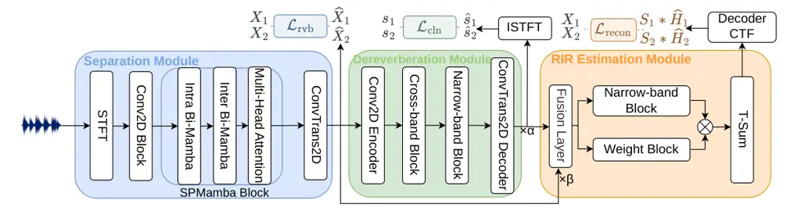

# DAMSEP: Distance-Aware Monaural Source Separation using Multi-RIR Estimation

Wen Wen    Qiang Zhou    Yu Xi    Haoyu Li    Bohan Li    Kai Yu
^(†)^(†)thanks: ^(\*)denotes the corresponding author.

###### Abstract

Although room impulse responses (RIRs) encode source-distance cues,
conventional monaural source separation focuses on recovering audio
content without estimating source-specific RIRs, losing the associated
spatial information. To address this limitation, we propose
Distance-Aware Monaural Source Separation using Multi-RIR Estimation
(DAMSEP), the first end-to-end framework that is jointly trained for
source separation and multi-source RIR estimation from a
single-microphone mixture. DAMSEP integrates a separation backbone with
shared dereverberation and RIR estimation modules to jointly recover
clean sources and source-specific complex convolutive transfer functions
under source estimation and reverberant reconstruction objectives,
enabling relative near/far ordering through the direct-to-reverberant
ratios of the corresponding RIRs. For comprehensive evaluation, we
introduce HETMIXR, which spans heterogeneous source content and diverse
simulated room conditions with source-specific RIRs and geometric
distance annotations. Experiments on HETMIXR demonstrate superior
performance in source separation, RIR estimation, and distance ordering.
Ablation studies reveal the complementary benefits of source supervision
and reverberant reconstruction, while additional evaluations show
generalization to single-speaker inputs and mixtures generated using
measured RIRs from an unseen room. Our code and dataset are available at
[https://github.com/Wenanzhi/DAMSEP](https://github.com/Wenanzhi/DAMSEP).

###### Index Terms: 

room impulse response estimation, source separation, multi-source signal
processing

^(†)^(†)address: ¹X-LANCE Lab, School of Computer Science, Shanghai Jiao
Tong University, Shanghai, China  
²AISpeech Ltd, Suzhou, China  
³Jiangsu Key Lab of Language Computing, Suzhou, China  
⁴ Nanjing University  
wenyideng@sjtu.edu.cn, kai.yu@sjtu.edu.cn

## 1 Introduction

Monaural source separation aims to recover individual sources from a
mixture recorded by a single microphone. Recent neural models have
achieved strong performance in monaural source separation \[1, 2, 3, 4,
5\], but typically focus on recovering audio content without explicitly
estimating the associated room responses or relative near/far order,
therefore losing the associated spatial information. In reverberant
cocktail-party environments \[6\], each source is filtered by a
different room impulse response (RIR), which describes sound propagation
from the source to the microphone and encodes spatial and acoustic
properties of the environment \[7, 8, 9\]. The direct-to-reverberant
ratios (DRRs) of these source-specific RIRs provide cues for determining
the relative near/far order in monaural recordings \[10, 11\],
supporting applications such as distance-based source selection \[12\].

Recovering this RIR-based distance information alongside separated audio
requires estimating a distinct room response for each source in the
mixture. Existing blind RIR estimators \[13, 14, 15, 16, 17\] operate on
single-speaker reverberant recordings and are not designed to recover
distinct responses directly from mixtures of overlapping sources. A
straightforward approach is to separate the reverberant sources first
and then estimate an RIR for each source, but separation errors can
propagate to the response estimates. Independent training also prevents
response-estimation supervision from guiding the separator. The
challenge is therefore to recover each source together with its
associated room response while maintaining separation quality.

To address this challenge, we propose Distance-Aware Monaural Source
Separation using Multi-RIR Estimation (DAMSEP), an end-to-end framework
that jointly recovers source signals and their associated RIRs from a
single-microphone mixture. The training objective combines explicit
source supervision with source-specific reverberant reconstruction,
requiring each predicted response to explain the reverberation of its
corresponding source. The RIR estimator is shared across sources and
builds on the complex convolutive transfer function (CTF) representation
and reconstruction approach of Rec-RIR \[13\]. By simultaneously
optimizing source estimation and reverberant reconstruction, DAMSEP
learns to separate the mixture and recover an RIR for each source, whose
DRR provides a cue for determining the relative near/far order of the
separated sources. To comprehensively evaluate source separation, RIR
estimation, and relative distance ordering, we construct HETMIXR. Each
mixture is paired with the individual source signals, RIRs, and
geometric source-microphone distances, providing references for
separation, response estimation, and near/far ordering. Experiments on
HETMIXR demonstrate that DAMSEP outperforms task-specific baselines in
separation, RIR estimation, and distance ordering. Additional
evaluations demonstrate that its RIR estimation capability generalizes
to single-speaker inputs and mixtures generated using measured RIRs from
an unseen room. Our main contributions are summarized as follows:

- •
  We develop the first monaural framework that estimates an RIR for each
  separated source and uses these responses to determine relative
  near/far order while maintaining separation quality.
- •
  We introduce HETMIXR, a comprehensive dataset of monaural reverberant
  mixtures spanning diverse source types and providing explicit
  geometric source-distance metadata.
- •
  Our experiments demonstrate that joint training improves separation
  and RIR estimation, with ablations clarifying the roles of training
  objectives and further evaluations validating generalization and
  RIR-based near/far ordering.



Figure 1: Architecture of DAMSEP. The SPMamba separation module
estimates source-specific reverberant spectra, which are directly
processed by a dereverberation module shared across sources. The shared
module predicts clean-source spectra, while the RIR estimation module
fuses the clean and reverberant branches to estimate source-specific
complex CTFs. The three objectives supervise reverberant-source
separation, clean-source estimation, and CTF-based reconstruction,
respectively.

## 2 Distance-Aware Separation via Multi-RIR Estimation

### 2.1 Problem Formulation

Given a multi-source monaural reverberant mixture, we have

```math
x(t)=\sum_{i=1}^{n}x_{i}(t),\qquad x_{i}(t)=h_{i}(t)*s_{i}(t), \tag{1}
```

where $`s_{i}(t)`$, $`h_{i}(t)`$, and $`x_{i}(t)`$ denote the clean
reference source, source-specific room impulse response (RIR), and
reverberant source image, respectively. Let
$`\mathbf{X}=\operatorname{STFT}(x)`$ denote the mixture spectrum.
DAMSEP estimates

```math
f_{\theta}(\mathbf{X})=\left\{\widehat{\mathbf{X}}_{i},\widehat{\mathbf{S}}_{i},\widehat{\mathbf{H}}_{i}\right\}_{i=1}^{n}, \tag{2}
```

where $`\widehat{\mathbf{X}}_{i}\in\mathbb{C}^{F\times T}`$ is the
separated reverberant spectrum,
$`\widehat{\mathbf{S}}_{i}\in\mathbb{C}^{F\times T}`$ is the
corresponding clean-source spectrum, and
$`\widehat{\mathbf{H}}_{i}\in\mathbb{C}^{F\times L}`$ is a complex
convolutive transfer function (CTF). The clean waveform is obtained as
$`\widehat{s}_{i}=\operatorname{iSTFT}(\widehat{\mathbf{S}}_{i})`$. The
time-domain RIR $`\widehat{h}_{i}`$ is recovered from
$`\widehat{\mathbf{H}}_{i}`$ by the fixed inference-time procedure
described below. In this work, we focus primarily on the two-source
setting ($`n=2`$).

### 2.2 DAMSEP Architecture

As illustrated in Fig. 1, DAMSEP first applies an SPMamba-based
separation module \[1\]. The real and imaginary components of the
mixture spectrum $`\mathbf{X}`$ are concatenated and projected by a
convolutional encoder. Stacked SPMamba blocks model spectral
dependencies within each frame and temporal dependencies within each
frequency bin using bidirectional Mamba modules, followed by temporal
multi-head self-attention. A transposed-convolutional decoder directly
predicts two separated complex spectra
$`\{\widehat{\mathbf{X}}_{i}\}_{i=1}^{2}`$.

Each $`\widehat{\mathbf{X}}_{i}`$ is processed by a dereverberation
module shared across sources, following the dereverberation design in
Rec-RIR. A convolutional encoder followed by cross-band and narrow-band
blocks extracts and refines the source-specific representation, and a
complex transposed-convolutional decoder predicts the clean spectrum
$`\widehat{\mathbf{S}}_{i}`$. Sharing this module across sources avoids
duplicating parameters while retaining a source-specific prediction for
each separated spectrum.

Let $`\mathbf{Z}_{i}^{\mathrm{cln}}`$ and
$`\mathbf{Z}_{i}^{\mathrm{rvb}}`$ denote the clean-branch and
separated-reverberant-branch representations supplied to the fusion
layer, respectively. Following the $`\alpha/\beta`$ paths in Fig. 1, the
fused representation is

```math
\mathbf{Z}_{i}^{\mathrm{fuse}}=\alpha\mathbf{Z}_{i}^{\mathrm{cln}}+\beta\mathbf{Z}_{i}^{\mathrm{rvb}}, \tag{3}
```

where $`\alpha`$ and $`\beta`$ are trainable scalars. The fused
representation is processed in parallel by a narrow-band block and a
weight block. The latter applies softmax over time to produce weights
that are multiplied element-wise with the narrow-band features.
Summation over time yields a fixed-dimensional response representation,
which the CTF decoder maps to the source-specific complex CTF
$`\widehat{\mathbf{H}}_{i}`$.

### 2.3 Joint Training and Distance-Aware Inference

Let $`\mathbf{S}_{i}=\operatorname{STFT}(s_{i})`$ and
$`\mathbf{X}_{i}=\operatorname{STFT}(x_{i})`$ denote the clean and
reverberant target spectra, respectively. The separation module directly
predicts $`\widehat{\mathbf{X}}_{i}`$. We adopt the RI+Mag spectral
loss \[18\], denoted by $`\mathcal{L}_{\mathrm{RI+Mag}}(\cdot,\cdot)`$.
We use permutation-invariant training (PIT), selecting the source
permutation from the clean-source waveform negative-SNR objective of
SPMamba:

```math
\pi^{\star}=\arg\min_{\pi\in\mathcal{P}_{2}}\left[-\frac{1}{2}\sum_{i=1}^{2}\operatorname{SNR}(\widehat{s}_{\pi(i)},s_{i})\right],
```

where $`\mathcal{P}_{2}`$ denotes the set of two-source permutations.
The clean-source, reverberant-source, and reconstruction losses share
the same permutation $`\pi^{\star}`$. Let
$`\widetilde{s}_{i}=\widehat{s}_{\pi^{\star}(i)}`$ and
$`\widetilde{\mathbf{X}}_{i}=\widehat{\mathbf{X}}_{\pi^{\star}(i)}`$.
The two source losses are defined as:

```math
\mathcal{L}_{\mathrm{cln}}=-\tfrac{1}{2}\sum_{i=1}^{2}\operatorname{SNR}(\widetilde{s}_{i},s_{i}),\quad\mathcal{L}_{\mathrm{rvb}}=\tfrac{1}{2}\sum_{i=1}^{2}\mathcal{L}_{\mathrm{RI+Mag}}(\widetilde{\mathbf{X}}_{i},\mathbf{X}_{i}). \tag{4}
```

The reconstruction loss directly compares the reverberant target
spectrum with the CTF filtering of the reference clean spectrum,

```math
\mathcal{L}_{\mathrm{recon}}=\frac{1}{2}\sum_{i=1}^{2}\mathcal{L}_{\mathrm{RI+Mag}}\left(\mathbf{S}_{i}*\widehat{\mathbf{H}}_{\pi^{\star}(i)},\mathbf{X}_{i}\right), \tag{5}
```

where $`*`$ denotes convolution along the STFT-frame dimension. The
complete training objective is

```math
\mathcal{L}=\mathcal{L}_{\mathrm{cln}}+\lambda_{\mathrm{rvb}}\mathcal{L}_{\mathrm{rvb}}+\lambda_{\mathrm{recon}}\mathcal{L}_{\mathrm{recon}}. \tag{6}
```

At inference, each predicted CTF is converted into a decoded time-domain
response using the fixed pseudo-intrusive measurement process. Let
$`e(n)`$ be a fixed logarithmic sine sweep and $`v(n)`$ its inverse
filter, such that

```math
e(n)*v(n)=\delta(n), \tag{7}
```

where $`\delta(n)`$ is the unit impulse. With
$`\mathbf{E}=\operatorname{STFT}(e)`$, the synthetic response to the
sweep for source $`i`$ is

```math
\mathbf{Z}_{i}\approx\widehat{\mathbf{H}}_{i}*\mathbf{E}. \tag{8}
```

Let $`z_{i}(n)=\operatorname{iSTFT}(\mathbf{Z}_{i})`$. Inverse filtering
then yields

```math
\widehat{h}_{i}(n)=z_{i}(n)*v(n). \tag{9}
```

For two sources, the direct-to-reverberant ratio (DRR) of each converted
RIR provides the relative-distance decision,

```math
\widehat{i}_{\mathrm{near}}=\arg\max_{i}\operatorname{DRR}(\widehat{h}_{i}),\qquad\widehat{i}_{\mathrm{far}}=\arg\min_{i}\operatorname{DRR}(\widehat{h}_{i}). \tag{10}
```

This comparison yields ordinal near/far ordering, adding an
interpretable relative-distance attribute to each separated output.

## 3 Experimental Setup

### 3.1 Datasets and Evaluation Scenarios

Joint evaluation of source separation, RIR estimation, and relative
distance ordering requires reference source signals, corresponding RIRs,
and geometric source-microphone distances. We therefore construct
HETMIXR, which combines heterogeneous source content to better reflect
the diversity of sounds coexisting in real acoustic scenes while
retaining the annotations required for all three tasks.

HETMIXR. We introduce HETMIXR (Heterogeneous MIXtures with
Reverberation), a dataset of monaural reverberant mixtures with
source-specific RIRs and spatial metadata. It includes WSJ0
speech \[19\], music¹¹ 1
[https://www.kaggle.com/datasets/limzhiminjessie/query-by-humming-qbh-audio-dataset/data](https://www.kaggle.com/datasets/limzhiminjessie/query-by-humming-qbh-audio-dataset/data),
TV audio \[20\], and NCSSD dialogue \[21\]. Each mixture is generated by
randomly adjusting the loudness of two source recordings, convolving
each with a separate simulated RIR, and summing the resulting signals.
The dataset provides the original recordings, reverberant source
signals, RIRs, and geometric source-microphone distances for joint
evaluation of source separation, RIR estimation, and relative distance
ordering. Reverberation times $`T_{60}`$ range from 0.1 to 1.0 s.
Source–microphone distances are sampled from 1.0–1.9 m and 2.0–4.0 m for
the two sources, respectively. We generate 20,000 training, 5,000
validation, and 3,000 test mixtures using disjoint source recordings
across splits. Excluding test mixtures shorter than 4 s leaves 2,801
mixtures for evaluation.

Measured-RIR Test Set. For zero-shot evaluation, we generate two-source
mixtures by convolving source recordings with RIRs measured using sine
sweeps in an unseen room. Measurements cover 13 source–microphone
distances from 0.8 to 2.0 m. Combining all distance pairs with five
source-content pairs yields 390 mixtures.

### 3.2 Baselines and Comparison Protocols

DAMSEP simultaneously performs monaural source separation,
source-specific RIR estimation, and relative distance ordering. Since
none of the selected standalone baselines provides all three
capabilities, we conduct task-specific comparisons. For source
separation, we consider TDANet \[2\], SPMamba \[1\], and
TF-Locoformer \[3\]. For RIR estimation, we compare with Rec-RIR \[13\],
FiNS \[17\], BUDDy \[15\], VINP \[14\], and Speech2RIR \[16\]. All
separation and RIR estimation baselines are retrained on our local
training data. In the multi-source comparison, these estimators receive
ground-truth reverberant source signals, whereas DAMSEP estimates
source-specific responses directly from the mixture. In the
single-speaker comparison, all methods receive identical single-source
reverberant inputs.

For distance ordering, we compare the DRRs of the estimated
source-specific RIRs under two input conditions. The oracle condition
provides external estimators with ground-truth reverberant source
signals, giving them an input advantage by eliminating competing sources
and separation errors. The cascade condition feeds DAMSEP-separated
reverberant signals into each external estimator, enabling direct
comparison between separation-RIR estimation cascades and DAMSEP’s
jointly trained response branch.

### 3.3 Implementation details

DAMSEP operates at 8 kHz and is trained on 4-s segments. The separation
module uses a 256-sample Hann window, a 64-sample hop, and a 256-point
FFT. Each predicted CTF contains 60 frame-domain taps. We train DAMSEP
using Adam with an initial learning rate of $`10^{-3}`$. Training uses a
ReduceLROnPlateau scheduler with a reduction factor of 0.5 and early
stopping with a patience of 5 epochs. The loss weights are
$`\lambda_{\mathrm{rvb}}=0.1`$ and $`\lambda_{\mathrm{recon}}=0.5`$,
with unit weight for the clean-source loss. Inputs to external RIR
estimators are resampled to their required sampling rates, and their
predicted RIRs are resampled to 8 kHz for evaluation.

### 3.4 Evaluation Metrics

For the two-source evaluations, we use PIT-based source matching. The
same source permutation is applied to the corresponding RIR estimates.

Separation metrics. SI-SDRi \[22\] and SDRi \[23\] measure improvement
over the mixture. SIR and SAR \[23\] quantify residual interference and
introduced artifacts. All separation metrics are reported in dB.

RIR fidelity metrics. RIR-50 is the waveform RMSE over the first 50 ms,
and LSD is the log-spectral distance. DRR and C50 errors are reported as
mean absolute errors in dB; LSD is also reported in dB. Corr. denotes
the Pearson correlation coefficient between temporally aligned predicted
and reference RIR waveforms.

Distance-ordering accuracy (D-Acc.). DRR is an established cue to source
distance in reverberant environments \[24\]. We compute DRR from each
predicted time-domain RIR and label the source with the higher DRR as
near. After source matching, D-Acc. measures the percentage of source
pairs whose predicted near/far order matches the reference order
determined by geometric source-microphone distances. DRR-based ordering
from ground-truth RIRs agrees with the geometric order for all source
pairs in both HETMIXR and the Measured-RIR Test Set.

## 4 Results and Analysis

### 4.1 Source Separation Performance

| Model         | Parameters | SI-SDRi $`\uparrow`$ | SDRi $`\uparrow`$ | SIR $`\uparrow`$ | SAR $`\uparrow`$ |
| ------------- | ---------- | -------------------- | ----------------- | ---------------- | ---------------- |
| TDANet        | 2.3M       | 8.08                 | 7.94              | 17.95            | 9.33             |
| SPMamba       | 6.1M       | 13.06                | 11.68             | 22.28            | 12.48            |
| TF-Locoformer | 15M        | 14.25                | 12.67             | 22.50            | 13.51            |
| DAMSEP        | 7.2M       | 14.90                | 13.24             | 24.29            | 13.91            |

Table 1: Source separation on HETMIXR. For DAMSEP, the metrics are
computed between the estimated clean-source waveforms
$`\widehat{s}_{i}`$ and the corresponding reference signals $`s_{i}`$
after PIT matching.

To assess separation performance while estimating an RIR for each
source, Table 1 compares DAMSEP with three monaural separation baselines
on HETMIXR. DAMSEP achieves the best performance across all four
separation metrics while jointly estimating source-specific RIRs.
Compared with TF-Locoformer, the strongest separation baseline, DAMSEP
improves SI-SDRi by 0.65 dB with fewer parameters. We also tested DAMSEP
on WHAMR! \[25\], where it achieved separation performance comparable to
SPMamba, indicating that adding source-specific RIR estimation does not
compromise separation quality.

### 4.2 Simulated RIR Estimation

| Model      | RIR-50$`\downarrow`$ | LSD$`\downarrow`$ | C50$`\downarrow`$ | DRR$`\downarrow`$ | D-Acc.$`{}_{\mathrm{ora}}\!\uparrow`$ | D-Acc.$`{}_{\mathrm{sep}}\!\uparrow`$ |
| ---------- | -------------------- | ----------------- | ----------------- | ----------------- | ------------------------------------- | ------------------------------------- |
| Speech2RIR | 0.186                | 21.03             | 16.23             | 9.49              | 46.84%                                | 46.66%                                |
| FiNS       | 0.103                | 11.09             | 12.24             | 7.07              | 82.68%                                | 72.55%                                |
| BUDDy      | 0.061                | 5.78              | 11.97             | 6.56              | 90.82%                                | 92.36%                                |
| VINP       | 0.056                | 4.48              | 12.92             | 7.30              | 88.11%                                | 80.79%                                |
| Rec-RIR    | 0.051                | 3.58              | 11.07             | 5.85              | 97.25%                                | 95.04%                                |
| DAMSEP     | 0.032                | 1.84              | 6.38              | 2.58              | 99.11%                                |                                       |

Table 2: Simulated RIR estimation on HETMIXR. For external estimators,
D-Acc._(sep) is evaluated using DAMSEP-separated reverberant inputs,
while RIR fidelity metrics and D-Acc._(ora) are evaluated using
ground-truth single-source reverberant inputs. This oracle-input setting
serves as an upper-bound reference for their performance under ideal
source separation. DAMSEP always receives the mixture.

Table 2 reports source-specific RIR estimation results on HETMIXR.
DAMSEP achieves lower RIR-50 and LSD values, as well as lower DRR and
C50 errors, than the compared estimators. These gains span response
reconstruction and acoustic parameter estimation, demonstrating DAMSEP’s
ability to recover source-specific room responses from the mixture.

DAMSEP also achieves the highest distance-ordering accuracy,
outperforming direct cascade baselines that apply external RIR
estimators to DAMSEP-separated signals. This comparison shows that the
jointly trained response branch provides more accurate relative
source-distance ordering than separate RIR estimation from the
separation outputs.

| Model      | RIR-50$`\downarrow`$ | LSD$`\downarrow`$ | Corr.$`\uparrow`$ | DRR$`\downarrow`$ | C50$`\downarrow`$ |
| ---------- | -------------------- | ----------------- | ----------------- | ----------------- | ----------------- |
| Speech2RIR | 0.185                | 20.25             | 0.185             | 9.60              | 16.80             |
| FiNS       | 0.110                | 12.08             | 0.320             | 6.42              | 9.64              |
| BUDDy      | 0.062                | 6.02              | 0.648             | 5.25              | 8.91              |
| VINP       | 0.056                | 4.54              | 0.689             | 5.76              | 11.16             |
| Rec-RIR    | 0.046                | 2.55              | 0.791             | 2.95              | 6.91              |
| DAMSEP     | 0.032                | 1.71              | 0.909             | 2.78              | 6.43              |

Table 3: Single-source RIR estimation. DAMSEP and the external
estimators receive the same single-source reverberant inputs. For
DAMSEP, we select the branch whose estimated clean-source waveform best
matches the reference signal and evaluate the RIR from that branch.

Table 3 compares all methods using identical reverberant single-source
inputs. Although trained exclusively on two-source mixtures, DAMSEP is
evaluated directly on single-source inputs without retraining or
fine-tuning. It achieves lower response and spectral errors, higher
waveform correlation, and more accurate DRR and C50 estimates than the
external estimators, demonstrating generalization from two-source
training to single-source RIR estimation.

### 4.3 Ablation Study

Table 4 assesses the contributions of the training objectives. Adding
reconstruction supervision improves separation, reduces DRR and C50
errors, and increases distance-ordering accuracy. With reconstruction
supervision retained, the reverberant-source objective provides further
gains, indicating that the two objectives are complementary. Without
reconstruction supervision, the CTF-specific parameters receive no task
gradients, although their inputs depend on shared representations
optimized by the source losses. The fixed CTF mapping may therefore
preserve statistical differences associated with near/far ordering,
potentially explaining the relatively high D-Acc. in the
clean-plus-reverberant configuration. The large DRR and C50 errors
nevertheless show that accurate ordering does not imply accurate
room-response recovery.

| $`\mathcal{L}_{\mkern-1.0mu\scalebox{0.92}{$\scriptstyle\mathrm{c\mkern-0.7mul\mkern-0.7mun}$}}`$ | $`\mathcal{L}_{\mkern-1.0mu\scalebox{0.92}{$\scriptstyle\mathrm{r\mkern-0.7muv\mkern-0.7mub}$}}`$ | $`\mathcal{L}_{\mkern-1.0mu\scalebox{0.92}{$\scriptstyle\mathrm{r\mkern-0.7mue\mkern-0.7muc\mkern-0.7muo\mkern-0.7mun}$}}`$ | SDRi $`\uparrow`$ | SI-SDRi $`\uparrow`$ | DRR $`\downarrow`$ | C50 $`\downarrow`$ | D-Acc. $`\uparrow`$ |
| ------------------------------------------------------------------------------------------------- | ------------------------------------------------------------------------------------------------- | --------------------------------------------------------------------------------------------------------------------------- | ----------------- | -------------------- | ------------------ | ------------------ | ------------------- |
| ✓                                                                                                 | –                                                                                                 | –                                                                                                                           | 11.80             | 13.05                | 10.79              | 25.0               | 52.34%              |
| ✓                                                                                                 | ✓                                                                                                 | –                                                                                                                           | 12.02             | 13.70                | 10.93              | 23.90              | 89.36%              |
| ✓                                                                                                 | –                                                                                                 | ✓                                                                                                                           | 12.74             | 14.26                | 3.74               | 7.19               | 97.72%              |
| ✓                                                                                                 | ✓                                                                                                 | ✓                                                                                                                           | 13.24             | 14.90                | 2.58               | 6.38               | 99.11%              |

Table 4: Ablation studies on HETMIXR. Each configuration is initialized
and trained independently; all metrics in a row come from the
corresponding model. SDRi, SI-SDRi, DRR MAE, and C50 MAE are in dB.

### 4.4 Zero-shot Evaluation on the Measured-RIR Test Set

Table 5 evaluates DAMSEP, trained exclusively on simulated data, on
mixtures rendered with measured RIRs from an unseen room. DAMSEP
achieves the lowest RIR-50 and LSD and the highest RIR correlation,
modestly outperforming Rec-RIR. Its gains are more pronounced in
distance ordering, particularly over cascade baselines using
DAMSEP-separated inputs. These results indicate that DAMSEP retains its
response estimation and distance-ordering capabilities under the
measured-RIR test conditions.

| Model      | RIR-50$`\downarrow`$ | Corr.$`\uparrow`$ | LSD$`\downarrow`$ | D-Acc.$`{}_{\mathrm{ora}}\!\uparrow`$ | D-Acc.$`{}_{\mathrm{sep}}\!\uparrow`$ |
| ---------- | -------------------- | ----------------- | ----------------- | ------------------------------------- | ------------------------------------- |
| Speech2RIR | 0.185                | 0.111             | 26.06             | 54.62%                                | 48.72%                                |
| FiNS       | 0.101                | 0.321             | 11.05             | 68.21%                                | 38.46%                                |
| BUDDy      | 0.063                | 0.619             | 7.07              | 85.38%                                | 56.15%                                |
| VINP       | 0.059                | 0.639             | 5.59              | 80.00%                                | 49.23%                                |
| Rec-RIR    | 0.057                | 0.674             | 5.09              | 87.18%                                | 42.56%                                |
| DAMSEP     | 0.055                | 0.696             | 4.71              | 99.74%                                |                                       |

Table 5: Zero-shot RIR estimation on the Measured-RIR Test Set. For
external estimators, D-Acc._(sep) is evaluated using DAMSEP-separated
reverberant inputs, while RIR fidelity metrics and D-Acc._(ora) are
evaluated using ground-truth single-source reverberant inputs. This
oracle-input setting serves as an upper-bound reference for their
performance under ideal source separation. DAMSEP always receives the
mixture.

## 5 Conclusions

In this paper, we propose DAMSEP, the first end-to-end framework that
simultaneously separates sources and estimates an RIR for each source
from a monaural mixture of multiple speakers. Joint source estimation
and reconstruction supervision enable source-specific response recovery,
while the DRRs of the estimated RIRs provide the near/far order of the
separated sources. Experiments on HETMIXR show that DAMSEP achieves
better separation performance, more accurate RIR estimation, and higher
distance-ordering accuracy than the evaluated baselines. Further
evaluations demonstrate strong RIR recovery with identical
single-speaker inputs and zero-shot transfer to mixtures generated using
measured RIRs from an unseen room.

## 6 Compliance with Ethical Standards

This study uses publicly available audio datasets together with
simulated and measured room impulse responses. The measured responses
were obtained from sine-sweep recordings collected by AISpeech Ltd.,
Suzhou, China. No new human participants were recruited or recorded, and
no animal experiments were conducted. The source datasets were used in
accordance with their respective access and licensing terms, and no
additional institutional ethical approval was required for the
experiments reported in this paper.

## 7 Acknowledgments

The authors declare no actual or potential conflicts of interest.

## References

- \[1\] K. Li, G. Chen, R. Yang, and X. Hu, “SPMamba: Leveraging
  long-sequence modeling with state space models for speech separation,”
  in 2025 IEEE International Conference on Multimedia and Expo (ICME),
  2025, pp. 1–6.
- \[2\] K. Li, R. Yang, and X. Hu, “An efficient encoder-decoder
  architecture with top-down attention for speech separation,” in The
  Eleventh International Conference on Learning Representations, 2023.
- \[3\] K. Saijo, G. Wichern, F. G. Germain, Z. Pan, and J. Le Roux,
  “TF-Locoformer: Transformer with local modeling by convolution for
  speech separation and enhancement,” in 2024 18th International
  Workshop on Acoustic Signal Enhancement (IWAENC), 2024, pp. 205–209.
- \[4\] T. H. Avenstrup, B. Elek, I. L. Mádi, A. B. Schin, M. Mørup,
  B. S. Jensen, and K. Olsen, “Sepmamba: State-space models for speaker
  separation using mamba,” in ICASSP 2025 - 2025 IEEE International
  Conference on Acoustics, Speech and Signal Processing (ICASSP), 2025,
  pp. 1–5.
- \[5\] Y. Masuyama, K. Saijo, F. Paissan, J. Han, M. Delcroix,
  R. Aihara, F. G. Germain, G. Wichern, and J. Le Roux, “FlexIO:
  Flexible single- and multi-channel speech separation and enhancement,”
  in Proc. IEEE International Conference on Acoustics, Speech and Signal
  Processing (ICASSP), 2026, pp. 14417–14421.
- \[6\] E. C. Cherry, “Some experiments on the recognition of speech,
  with one and with two ears,” J. Acoust. Soc. Am., vol. 25, no. 5, pp.
  975–979, Sept. 1953.
- \[7\] Y. He, A. Cherian, G. Wichern, and A. Markham, “Deep neural room
  acoustics primitive,” in ICML, 2024, pp. 17842–17857.
- \[8\] C. Ick, G. Wichern, Y. Masuyama, F. G. Germain, and J. Le Roux,
  “Direction-aware neural acoustic fields for few-shot interpolation of
  ambisonic impulse responses,” in Proc. Interspeech, 2025, pp. 933–937.
- \[9\] J. Zhao, H. Chen, Q. Wang, J. Du, Y. Tu, and F. Ma, “TA-RIR:
  Topology-aware neural modeling of acoustic propagation for room
  impulse response synthesis,” in Proc. Interspeech, 2025, pp.
  2485–2489.
- \[10\] D. Berghi and P. J. B. Jackson, “Reverberation-based features
  for sound event localization and detection with distance estimation,”
  IEEE Signal Processing Letters, vol. 33, pp. 1841–1845, 2026.
- \[11\] Y. Jiang, H. Wang, Y. Chen, G. Qiao, and B. Tian, “Exploring
  efficient directional and distance cues for regional speech
  separation,” in Proc. Interspeech, 2025, pp. 1478–1482.
- \[12\] K. Patterson, K. Wilson, S. Wisdom, and J. R. Hershey,
  “Distance-based sound separation,” in Proc. Interspeech, 2022, pp.
  901–905.
- \[13\] P. Wang and X. Li, “Blind room impulse response identification
  via reverberant speech spectrum reconstruction,” in Proc. Interspeech,
  2026, Accepted for publication.
- \[14\] P. Wang, Y. Fang, and X. Li, “VINP: Variational bayesian
  inference with neural speech prior for joint ASR-effective speech
  dereverberation and blind RIR identification,” IEEE Transactions on
  Audio, Speech and Language Processing, vol. 33, pp. 4387–4399, 2025.
- \[15\] E. Moliner, J.-M. Lemercier, S. Welker, T. Gerkmann, and
  V. Välimäki, “BUDDy: Single-channel blind unsupervised dereverberation
  with diffusion models,” in 2024 18th International Workshop on
  Acoustic Signal Enhancement (IWAENC), 2024, pp. 120–124.
- \[16\] A. Ratnarajah, I. Ananthabhotla, V. K. Ithapu, P. Hoffmann,
  D. Manocha, and P. Calamia, “Towards improved room impulse response
  estimation for speech recognition,” in 2023 IEEE International
  Conference on Acoustics, Speech and Signal Processing (ICASSP), 2023,
  pp. 1–5.
- \[17\] C. J. Steinmetz, V. K. Ithapu, and P. Calamia, “Filtered noise
  shaping for time domain room impulse response estimation from
  reverberant speech,” in 2021 IEEE Workshop on Applications of Signal
  Processing to Audio and Acoustics (WASPAA), 2021, pp. 221–225.
- \[18\] Z.-Q. Wang, P. Wang, and D. Wang, “Complex spectral mapping for
  single- and multi-channel speech enhancement and robust ASR,” IEEE/ACM
  Trans. Audio Speech Lang. Process., vol. 28, pp. 1778–1787, 2020.
- \[19\] J. S. Garofolo, D. Graff, J. M. Baker, D. Paul, and D. Pallett,
  “CSR-I (WSJ0) Complete,” Linguistic Data Consortium, LDC93S6A, 1993.
- \[20\] A. Nagrani, J. S. Chung, and A. Zisserman, “VoxCeleb: A
  large-scale speaker identification dataset,” in Proc. Interspeech,
  2017, pp. 2616–2620.
- \[21\] R. Liu, Y. Hu, Y. Ren, X. Yin, and H. Li, “Generative
  expressive conversational speech synthesis,” in Proceedings of the
  32nd ACM International Conference on Multimedia, 2024, pp. 4187–4196.
- \[22\] J. Le Roux, S. Wisdom, H. Erdogan, and J. R. Hershey,
  “SDR–half-baked or well done?,” in ICASSP 2019-2019 IEEE International
  Conference on Acoustics, Speech and Signal Processing (ICASSP). IEEE,
  2019, pp. 626–630.
- \[23\] E. Vincent, R. Gribonval, and C. Févotte, “Performance
  measurement in blind audio source separation,” IEEE transactions on
  audio, speech, and language processing, vol. 14, no. 4, pp.
  1462–1469, 2006.
- \[24\] E. Larsen, N. Iyer, C. R. Lansing, and A. S. Feng, “On the
  minimum audible difference in direct-to-reverberant energy ratio,” The
  Journal of the Acoustical Society of America, vol. 124, no. 1, pp.
  450–461, 2008.
- \[25\] M. Maciejewski, G. Wichern, E. McQuinn, and J. Le Roux,
  “WHAMR!: Noisy and reverberant single-channel speech separation,” in
  Proc. IEEE International Conference on Acoustics, Speech and Signal
  Processing (ICASSP), 2020, pp. 696–700.
