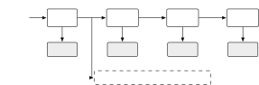
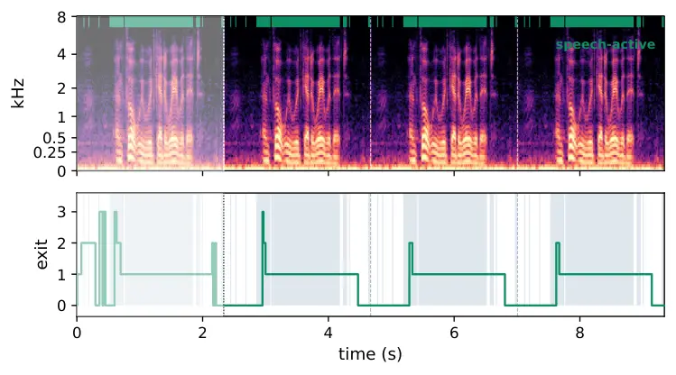

# Does per-frame early exit pay? A compute-matched study of dynamic depth for on-device speech enhancement

Clément Laroche^(⋆)    Riccardo Miccini^(†) ^(†)^(†)thanks: This project
has received funding from the European Union’s Horizon Europe research
and innovation programme under the HORIZON-JU-Chips-2024-1-IA grant
agreement No 101194172 (NeAIxt).

###### Abstract

Deep learning-based speech enhancement is increasingly deployed
on-device in hearing aids, headsets, and earbuds. Most of these devices,
however, can only accelerate static int8 graphs, so a depth-varying
network must be implemented as several graphs, orchestrated by a policy.
In this paper, we supervise every intermediate depth of one causal
model, then we fine-tune its output heads to guarantee that deeper
outputs are never worse than shallower ones. Using this training
protocol, we can derive a family of static models that are more
Pareto-efficient than their equivalently-sized counterparts trained from
scratch on the same budget. Specifically, we achieve up to $`0.11`$
higher PESQ for equivalent compute, and match the best PESQ at
$`30\text{\,}\mathrm{\%}`$ less compute. We then quantize the models to
int8 and measure the latency–quality frontier on an STM32N6
microcontroller. On VoiceBank–DEMAND, the dynamic enhancer lies on the
same frontier as the static models, rather than trading quality for
dynamic execution. Running the policy on the companion Cortex-M55 takes
only $`26\text{\,}\mathrm{\SIUnitSymbolMicro s}`$ per frame, while
splitting the enhancer into separate NPU graphs adds
$`2.2\text{\,}\mathrm{\%}`$ latency overhead. The cost of dynamic
execution is therefore small.

###### Index Terms: 

speech enhancement, dynamic neural networks, early exit, conditional
computation, resource-efficient machine learning

^(†)^(†)address: ^(⋆) GN A/S, Denmark   ^(†) Technical University of
Denmark, Denmark

## 1 Introduction

Speech enhancement (SE) systems are a crucial part of
telecommunications, teleconferencing, and assistive technology,
improving remote collaboration, user experience, and quality of life. In
recent years, lightweight causal SE architectures have made significant
progress, reaching competitive quality at just a few million
multiply-accumulate operations (MACs) \[1, 2\]. However, deploying these
systems on devices such as hearing aids, headsets, or earbuds requires a
careful trade-off between denoising performance and computational needs,
capable of satisfying real-time constraints within a shared battery
budget. Besides, device tiers and concurrent workloads ask for different
quality/compute operating points; thus, a product needs a family of
models \[3, 4\]. Because microcontroller-class accelerators support only
static int8 graphs, each member of that family is compiled ahead of
time. Consequently, a model that chooses its depth at run time is not
something mainstream edge toolchains suport natively: they lower one
static graph, leaving the selection policy and the dispatch between
separately compiled subgraphs to run outside the compiled model \[5,
6\].

Early-exiting dynamic neural networks place prediction heads along a
backbone and route each input to one of them \[5, 7\]; within SE,
multiple exits were introduced without a policy \[8\], later using a
probabilistic per-block criterion \[9\], while other dynamic approaches
include learned width and gating \[10, 11, 12, 13\].
Train-once-deploy-many instead extracts many static sub-networks from
one weight-shared run \[14, 15, 3, 16\], reportedly matching or
surpassing dedicated training in on-device ASR \[4\] and elastic music
separation \[17\]. Several questions remain at the intersection of
dynamic speech enhancement and embedded deployment. Dynamic SE is
usually compared with its own exits \[9\], while retrained static models
matched for compute are less often used as baselines \[18\]. Cost is
also usually reported in nominal MACs, which ignore routing and dispatch
overhead \[19\]. Finally, extracted static models have rarely been
quantized and carried through to measured accelerator latency, and
output quality has not been studied frame by frame. This leaves open
whether the benefits of early-exit training come from adapting
computation at runtime, from improving the static models extracted from
the network, or from both.

In this paper, we add a per-frame monotonicity regularization to a
causal Conv-TasNet-style network, so that deeper exits are encouraged to
improve over shallower ones. When training on the SE task loss alone,
this is not guaranteed: on nearly half of the frames, a deeper exit
performs worse than its previous one, confirming the “overthinking”
phenomenon observed in early work on early-exiting \[7\]. We address
this by fine-tuning only the exit heads and penalizing such regressions
during training, rather than correcting them after training as
previously done for classification \[20\].

Once deeper exits become consistently useful, the resulting
weight-shared model can serve two roles: it can be routed dynamically,
or split into a family of fixed-depth models. We compare both choices
against recipe-matched retrained static models and quantize the models
to int8, allowing them to run on the Neural-ART NPU integrated in an
STM32N6 microcontroller, thereby measuring the true on-device latency.
The main observation is that, once the fixed-depth models are compared
fairly, routing brings little advantage: indeed, the extracted static
models form a competitive quality–compute frontier, which holds when
considering measured latency instead of theoretical MACs. Our claims are
limited to speech-dense datasets (VoiceBank–DEMAND); while arguably more
realistic, workloads with long pauses are outside this study.

We contribute the following: 1) A per-frame monotonicity regularization
for regression exits, together with a heads-only fine-tuning strategy; 2) An analysis showing that much of the routing headroom comes from
frames where deeper exits reduce quality, and that repairing these
frames largely removes this advantage; 3) A compute-matched static
frontier retrained under the same recipe and evaluation harness, with
seed spreads and controls; 4) int8quantization and measured STM32N6
latency for every extracted fixed-depth model.

## 2 Early-exit Conv-FSENet



Figure 1: The exit ladder. Head 0 reads the frontend alone (the _bypass_
exit); head $`i`$ reads that plus stacks $`1..i`$. The one-shot router
feeds on frontend features before any stack runs.


Figure 2: One residual block $`B_{i}`$ within stack $`S_{i}`$.

### 2.1 Architecture and exits

Given a single-channel noisy signal $`x`$, composed of clean speech
$`s`$ and additive noise $`n`$, we estimate the speech as
$`\hat{s}=\mathcal{M}(x)`$ using Conv-FSENet \[10, 21\], a causal
STFT-domain masking network derived from Conv-TasNet \[22\]. The model
comprises a pointwise-convolutional frontend, $`R`$ stacks, each
featuring 3 causal dilated depthwise temporal-convolutional residual
blocks (shown in Fig. 2), and mask heads.

The frontend maps the compressed noisy magnitude $`|X|^{0.3}`$ onto a
$`B`$-channel inter-block representation, which is expanded into
$`H_{i}`$ channels within each $`i`$-th block before projecting back to
$`B`$.

To reduce MACs, we allow the network to stop at different depths instead
of evaluating all $`R`$ TCN stacks on every frame. Mask heads attach
after the frontend (the _bypass_ exit) and at each stack, estimating a
sigmoid-activated magnitude mask on the noisy complex STFT, such that
exit $`i`$ evaluates the frontend plus the first $`i`$ stacks (Fig. 1).
Their receptive fields are $`1`$, $`15`$, $`29`$ and $`43`$ frames,
while the bypass exit is memoryless. At each $`16\text{\,}\mathrm{ms}`$
frame, a one-shot policy router selects an exit before executing any of
the stacks; this consists of a 16-unit GRU, feeding on the frontend
output and producing a categorical decision $`k(t)\in\{0,\ldots,R\}`$
before any TCN stack is executed. Only stacks up to $`k(t)`$ are then
evaluated. The remaining stacks are skipped entirely. The resulting
compute for a frame is therefore approximately

```math
C_{k(t)}=C_{\mathrm{fe}}+\sum_{i=1}^{k(t)}C_{\mathrm{stack},i}+C_{\mathrm{head},k(t)}, \tag{1}
```

where

```math
C_{\mathrm{fe}}\approx FB,\quad C_{\mathrm{stack},i}\approx 3H_{i}(2B+3),\quad C_{\mathrm{head},k(t)}\approx BF. \tag{2}
```

Selecting an earlier exit therefore avoids the full cost of every
subsequent TCN stack, while the frontend and selected mask-head costs
remain fixed.

### 2.2 Training and exit policy

Our enhancement loss $`\mathcal{L}`$ is the power-law-compressed
spectral MSE of As in \[23, 8\], computed on
active-speech-level-normalized spectra. Magnitude and complex terms use
a compression exponent $`c{=}0.3`$ and are mixed with weight
$`\alpha{=}0.3`$.

```math
\displaystyle\mathcal{L}_{\mathrm{SE}}(\widehat{S},S)={} \displaystyle\alpha\sum_{l,f}\left||S|^{c}e^{j\angle S}-|\widehat{S}|^{c}e^{j\angle\widehat{S}}\right|^{2} \tag{3}
```

```math
\displaystyle+(1-\alpha)\sum_{l,f}\left(|S|^{c}-|\widehat{S}|^{c}\right)^{2}.
```

where $`l`$ and $`f`$ denote time and frequency bins. We use $`c{=}0.3`$
and $`\alpha{=}0.3`$, and compute the loss on
active-speech-level-normalized spectra.

For the early-exit model, $`\mathcal{L}_{\mathrm{SE}}`$ is applied to
the output selected by the router and, under deep supervision (DS) \[24,
25\], independently to every exit. The enhancement part of the objective
is therefore

```math
\mathcal{L}_{\mathrm{enh}}=\mathcal{L}_{\mathrm{SE}}(\widehat{S}_{k},S)+\frac{\lambda_{\mathrm{ds}}}{R+1}\sum_{j=0}^{R}\mathcal{L}_{\mathrm{SE}}(\widehat{S}_{j},S), \tag{4}
```

where $`\widehat{S}_{k}`$ is the routed output and $`\widehat{S}_{j}`$
is the output of exit $`j`$.

The policy is supervised with a clean-signal _knee target_, which
identifies the point of diminishing returns along the exit ladder. Using
the same compression exponent, we define the per-frame
compressed-magnitude error of exit $`j`$ as

```math
q_{j}(t)=\frac{1}{F}\sum_{f}\left(|\hat{S}_{j}(f,t)|^{c}-|S(f,t)|^{c}\right)^{2}.
```

The knee target then selects the cheapest exit whose error is within
$`\varepsilon`$ of the best achieved by any exit:

```math
k(t)=\min\left\{j:q_{j}(t)\leq\min_{i}q_{i}(t)+\varepsilon\right\}. \tag{5}
```

We train the policy by cross-entropy against this target, either jointly
with the full backbone or on a frozen enhancer. Routing is discretized
by straight-through Gumbel-softmax \[26\].

Combining enhancement, exit supervision, routing, and compute control
gives

```math
\mathcal{L}_{\mathrm{tot}}=\mathcal{L}_{\mathrm{enh}}+\lambda_{\mathrm{knee}}\mathcal{L}_{\mathrm{CE}}+\mathcal{L}_{\mathrm{cost}}. \tag{6}
```

We use $`\lambda_{\mathrm{ds}}{=}1`$ and
$`\lambda_{\mathrm{knee}}{=}0.1`$, while $`\mathcal{L}_{\mathrm{cost}}`$
controls the average routed compute through the target operating point
$`\tau`$.

### 2.3 Repairing the exits

Because the knee target is defined from the current exits, it does not
require quality to improve with depth. In practice, a deeper exit can
perform worse than the previous one (Sec. 2.2). This creates an
ambiguity when evaluating routing: a policy may appear useful simply
because it avoids harmful deeper exits, rather than because it assigns
less compute to frames that genuinely need less processing. We therefore
repair the exit ladder before assessing the value of dynamic depth.

To separate these effects, we apply a _monotonicity repair_ to the exits
themselves. We freeze the backbone stacks, frontend, and policy, and
fine-tune only the exit heads ($`4{\times}33`$k parameters) with deep
supervision and the following regularizer:

```math
\mathcal{L}_{\mathrm{mono}}=\frac{1}{TR}\sum_{t=1}^{T}\sum_{j=0}^{R-1}\max\bigl(0,\;q_{j+1}(t)-q_{j}(t)\bigr), \tag{7}
```

which penalizes every frame for which adding depth increases the error.
We fine-tune for $`2000`$ steps with the Adam optimizer with a learning
rate of $`10^{-4}`$ and a regularization weight of 50. Rather than
enforcing monotonicity post hoc, as Jazbec et al. \[20\] do for
classification, this term encourages it through a soft constraint during
training.

## 3 Results

### 3.1 Experimental setup

Data  
We use the 16-kHz VoiceBank–DEMAND dataset \[27\]. During training, we
randomly crop the audio into $`4\text{\,}\mathrm{s}`$ segments and apply
Remix/BandMask/Shift augmentation \[28\], together with the spectral
augmentation and level-invariance techniques from \[29\]. We compute the
STFT using a $`512`$-sample window with $`50\text{\,}\mathrm{\%}`$
overlap, yielding $`F{=}257`$ bins, and use $`|X|^{0.3}`$ as input to
all models.

Models and static baselines  
As a baseline for per-frame routing, we compare it with static models at
the same compute budget. We train a grid of Conv-FSENets varying TCM
width $`H\in{32,64,96,256}`$ and number of stacks $`R\in{1,2,3}`$, while
keeping $`B{=}128`$ fixed. The statics use the same backbone with the
routing and multi-exit machinery removed. The twelve models span
$`5.7`$–$`41.8`$ MMAC/s and bracket all routed points
($`6.6`$–$`20.2`$ MMAC/s). Three exactly cost-matched width–depth pairs
further show whether the same compute budget is better spent on width or
depth.

Training  
All models use the same enhancement objective and are trained with Adam
($`10^{-3}`$ learning rate, $`10^{-5}`$ weight decay, and $`0.99`$/epoch
decay), batch size 64, and early stopping. The static models follow the
same training protocol, with routing-specific losses removed.

Metrics  
We report whole-clip SI-SDR \[30\] and wideband PESQ \[31\] on all 824
test clips. Dynamic compute is the realized average MMAC/s over the
selected exits.

### 3.2 Quality–compute frontier

Figure 3 compares the quality–compute trade-off of the dedicated static
baselines, the routed models, and the mono-repaired exits. Against the
dedicated statics, routing gives a clear advantage over most of the
compute range. For example, the routed $`H{=}64`$ model reaches
$`2.719`$ PESQ at $`8.48`$ MMAC/s, while the static frontier is around
$`2.60`$ at the same cost. The gap becomes smaller as compute increases,
but the routed models remain above the dedicated-static frontier.

The picture changes once each exit is repaired as a static model. The
mono-repaired frontier almost overlaps the routed one: at matched
compute, their PESQ differs by less than $`0.01`$ over the common range.
For instance, the routed points at $`8.48`$, $`12.18`$, and
$`20.22`$ MMAC/s differ from the interpolated repaired frontier by only
$`+0.009`$, $`-0.001`$, and $`+0.007`$ PESQ, respectively.

The similar routed and repaired frontiers show that per-frame routing
does not raise the best quality attainable at a given compute budget,
but importantly it does not noticeably lower it either. This makes the
deployment choice workload-dependent. A repaired static model fixes one
operating point and pays the same cost on every frame, whereas the
routed model keeps the full exit scaffold and can move between operating
points over time. Figure 4 illustrates this behaviour on a repeated
VoiceBank–DEMAND utterance: during speech, the router mostly selects a
processing exit, while in speech-inactive regions it falls back to the
cheap bypass. Across the test set, bypass selection is
$`2.4`$–$`3.4\times`$ more frequent in silence than in speech. On dense
workloads with little variation, a static deployment is therefore
sufficient; on streams with pauses or changing difficulty, routing can
reduce average compute while remaining on essentially the same
quality–compute frontier. The benefit of dynamic deployment is thus not
a higher quality ceiling, but the ability to adapt where compute is
spent without sacrificing that ceiling.

Figure 3: Pareto front for Float32 deployments on the test set.



Figure 4: Example router behaviour on a difficult VoiceBank–DEMAND
utterance (0.46,dB input SNR, noisiest $`5.6\text{\,}\mathrm{\%}`$ of
the test set, $`65.5\text{\,}\mathrm{\%}`$ speech-active), repeated four
times; the faded first repeat warms the GRU and is discarded. The router
spends depth mainly during speech: $`74\text{\,}\mathrm{\%}`$ of
speech-inactive frames take the bypass, versus
$`12\text{\,}\mathrm{\%}`$ of speech frames, reducing compute by
$`58.7\text{\,}\mathrm{\%}`$ over the warmed repeats relative to always
running the deepest exit.

## 4 Measured Latency on a microcontroller

### 4.1 deployment platform

We evaluate deployment on the STM32N6570-DK, a microcontroller platform
combining an Arm Cortex-M55 host processor with STMicroelectronics’
Neural-ART neural accelerator. The NPU targets statically shaped,
integer-quantized workloads, while unsupported operations and graph
orchestration remain on the Cortex-M55. All networks are causal at a
$`16\text{\,}\mathrm{ms}`$ hop. We keep the STFT, iSTFT and masking on
the host (no NPU FFT) and export ring buffers as explicit state tensors,
making each graph a pure per-frame stateless function. The models are
exported to ONNX and post-training int8 quantized \[32\] with
per-channel scaling and entropy calibration, then compiled through ST
Edge AI Core v4.0 \[6\] with operator rewrites where needed. Compiler
reports provide the NPU/host partition and memory requirements. For the
experiments below, Neural-ART runs at $`1\text{\,}\mathrm{GHz}`$ and the
Cortex-M55 at $`800\text{\,}\mathrm{MHz}`$.

### 4.2 MACs versus measured latency

Hardware latency depends not only on the number of operations, but also
on how they are arranged. Table 1 shows this clearly on the STM32N6:
across ten measured topologies, execution time per analytic MMAC varies
by $`1.7\times`$, from $`82`$ to $`137,\mu`$s/MMAC. Depth is
particularly costly because each additional stack requires another
accelerator launch, while increasing width makes better use of the NPU.
For example, increasing $`H`$ from $`32`$ to $`256`$ raises the MACs
within a stack by $`8\times`$, but its measured latency by only
$`3.1\times`$. Consequently, models with the same nominal cost can have
different runtimes: $`(H{=}32,R{=}2)`$ and $`(H{=}64,R{=}1)`$ have the
same MACs and parameter count, yet take $`1.00`$ and $`0.75`$,ms per
frame, respectively. MAC count can even give the wrong ordering:
$`(H{=}96,R{=}1)`$ uses $`21\text{\,}\mathrm{\%}`$ more MACs than
$`(H{=}32,R{=}2)`$ but runs $`15\text{\,}\mathrm{\%}`$ faster. We
therefore do not use nominal MACs to estimate deployment cost, and
instead measure every static, repaired, and routed workload directly on
the STM32N6.

| Topology               | MMAC/s | ms/frame | $`\mu`$s/MMAC |
| ---------------------- | ------ | -------- | ------------- |
| $`H{=}32`$, $`R{=}1`$  | 5.73   | 0.640    | 112           |
| $`H{=}64`$, $`R{=}1`$  | 7.30   | 0.751    | 103           |
| $`H{=}32`$, $`R{=}2`$  | 7.30   | 1.001    | 137           |
| $`H{=}96`$, $`R{=}1`$  | 8.86   | 0.852    | 96            |
| $`H{=}64`$, $`R{=}2`$  | 10.43  | 1.215    | 117           |
| $`H{=}96`$, $`R{=}2`$  | 13.57  | 1.427    | 105           |
| $`H{=}256`$, $`R{=}1`$ | 16.70  | 1.364    | 82            |
| $`H{=}96`$, $`R{=}3`$  | 18.27  | 2.078    | 114           |
| $`H{=}256`$, $`R{=}2`$ | 29.25  | 2.472    | 85            |
| $`H{=}256`$, $`R{=}3`$ | 41.79  | 3.584    | 86            |

Table 1: Analytic MACs do not price graphs on the STM32N6 NPU. Ten
complete int8 single-graph measurements (same board and toolchain).

### 4.3 Dynamic execution

Model export  
As illustrated in Fig. 1, the dynamic models are deployed as nine
subgraphs for the frontend, router, three stacks, and four exit heads,
with the routing decision and dispatch handled by the host. Because
different depths share the same frontend and stack graphs, the full
family requires the same storage of a single ladder rather than several
separate models. Quantized outputs remain close to float with the shared
compressed-magnitude $`|X|^{0.3}`$ input: the repaired family changes by
only $`-0.03`$ to $`+0.01`$ PESQ, and quantization shifts routed compute
by at most $`2\text{\,}\mathrm{\%}`$. We report measured per-frame mean
latency on the STM32N6570; since the policy router runs on the dedicated
M55 core, we report its contribution from measured cycle counts at its
$`800\text{\,}\mathrm{MHz}`$ clock.

State under skipping  
Each stack maintains its own ring buffers for the dilated convolutions.
These buffers are updated only when that stack runs, so when a skipped
stack resumes, its state reflects the most recent frames processed by
that stack rather than the most recent input frames. This is far more
realistic than common offline evaluation protocols, which compute the
routed output as a gated sum, thereby effectively updating each exit
even when unused. Driving the exported graphs on the deployed path costs
$`-0.005{\pm}0.011`$ PESQ over 824 clips and $`0.14`$ dB SI-SDR, with
routing decisions bit-identical across arms. Neither zero-order hold nor
propagating the last computed state to deeper stacks \[33\] recovers the
lost quality. We therefore keep skipped-stack states unchanged, which is
already the behavior of the exported graphs and requires no firmware
modification.

### 4.4 On-Device results

Table 2 shows the deployed latency for a representative set of repaired
static and routed models. Within a fixed ladder, early exit provides a
clear reduction in average execution time. For example, repaired routed
$`H{=}64`$ at $`\varepsilon{=}2{\cdot}10^{-3}`$ runs at
$`0.930`$,ms/frame, compared with $`1.215`$ ms for the corresponding
$`H{=}64,R{=}2`$ static, while PESQ changes from $`2.716`$ to $`2.694`$.
At $`H{=}256`$, routing reduces latency from $`2.472`$ to
$`1.668`$,ms/frame while retaining $`2.773`$ versus $`2.781`$ PESQ.
Thus, when the backbone is fixed, routing can avoid substantial work
with little quality loss.

The advantage is much smaller once the static topology is also allowed
to change. Several routed points are matched or dominated by a different
static width/depth choice: routed $`H{=}32`$ gives $`2.639`$ PESQ at
$`0.769`$,ms/frame, while static $`H{=}64,R{=}1`$ reaches $`2.684`$ at
$`0.751`$,ms; routed $`H{=}96`$ similarly reaches $`2.683`$ at
$`1.040`$,ms. The more quality-oriented routed configurations show the
same trend: routed $`H{=}64`$ with asym4 reaches $`2.724`$ at
$`1.473`$,ms, whereas static $`H{=}256,R{=}1`$ reaches $`2.762`$ at
$`1.364`$,ms. Dynamic depth therefore mainly provides intermediate
operating points within one deployed ladder; it does not create a better
latency–quality frontier than architecture-matched statics.

|                                        |                                   |        |           |          |
| -------------------------------------- | --------------------------------- | ------ | --------- | -------- |
| Model                                  | Variant                           | MMAC/s | int8 PESQ | ms/frame |
| _Within a fixed ladder_                |                                   |        |           |          |
| Static $`H{=}64,R{=}2`$                | fixed                             | 10.4   | 2.716     | 1.215    |
| Routed $`H{=}64`$                      | $`\varepsilon{=}2{\cdot}10^{-3}`$ | 8.58   | 2.694     | 0.930    |
| Static $`H{=}256,R{=}2`$               | fixed                             | 29.3   | 2.781     | 2.472    |
| Routed $`H{=}256`$                     | $`\varepsilon{=}2{\cdot}10^{-3}`$ | 20.19  | 2.773     | 1.668    |
| _Across static and dynamic topologies_ |                                   |        |           |          |
| Static $`H{=}64,R{=}1`$                | fixed                             | 7.3    | 2.684     | 0.751    |
| Routed $`H{=}32`$                      | $`\varepsilon{=}2{\cdot}10^{-3}`$ | 6.34   | 2.639     | 0.769    |
| Routed $`H{=}96`$                      | $`\varepsilon{=}2{\cdot}10^{-3}`$ | 10.51  | 2.683     | 1.040    |
| Static $`H{=}256,R{=}1`$               | fixed                             | 16.7   | 2.762     | 1.364    |
| Routed $`H{=}64`$                      | $`\varepsilon{=}5{\cdot}10^{-4}`$ | 12.29  | 2.724     | 1.473    |

Table 2: Measured STM32N6 latency for representative repaired static and
routed models.

## 5 Conclusion

We presented a training recipe for early-exiting SE models that produces
a family of deployable int8 graphs from a single run, while retaining
the option of dynamic routing. Through the aforementioned regularization
strategy, we promote monotonically-increasing performance across the
exit latter, thereby achieving $`0.040.11`$ PESQ improvements under the
same training budget. We could also match the best model (in terms of
PESQ) with $`30\text{\,}\mathrm{\%}`$ less compute, although at a
$`1.0\text{\,}\mathrm{dB}`$ SI-SDR drop. We observe how these gains are
robust to quantization, and when deployed to the STM32N6 unit,
constitute a latency–quality front that subsequent routed models can
also match. On speech-dense datasets, however, per-frame depth selection
brings little additional benefit. The apparent routing opportunity
largely come from frames where deeper exits degrade the result, and the
monotonicity repair removes much of that signal. The early-exit ladder
can therefore serve both as useful training scaffolding for train-once
deploy-anywhere networks as well as deployable dynamic models that can
be operated without end-to-end routing. Whether automatic routing
becomes more valuable on sparser workloads, where long pauses and cheap
bypass opportunities are common, remains an important next step.

## References

- \[1\] S. Braun, H. Gamper, C. K. A. Reddy, and I. J. Tashev, “Towards
  efficient models for real-time deep noise suppression,” in Proc. IEEE
  ICASSP, 2021, pp. 656–660.
- \[2\] X. Rong, T. Sun, X. Zhang, Y. Hu, C. Zhu, and J. Lu, “GTCRN: A
  speech enhancement model requiring ultralow computational resources,”
  in Proc. IEEE ICASSP, 2024, pp. 10286–10290.
- \[3\] H. Cai, C. Gan, T. Wang, Z. Zhang, and S. Han, “Once-for-all:
  Train one network and specialize it for efficient deployment,” in
  Proc. ICLR, 2020.
- \[4\] Y. Shangguan, H. Yang, D. Li, C. Wu, Y. Fathullah, D. Wang,
  A. Dalmia, R. Krishnamoorthi, O. Kalinli, J. Jia, J. Mahadeokar,
  X. Lei, M. Seltzer, and V. Chandra, “TODM: Train once deploy many
  efficient supernet-based RNN-T compression for on-device ASR models,”
  in Proc. IEEE ICASSP, 2024, pp. 10216–10220.
- \[5\] Y. Han, G. Huang, S. Song, L. Yang, H. Wang, and Y. Wang,
  “Dynamic neural networks: A survey,” IEEE Trans. Pattern Anal. Mach.
  Intell., vol. 44, no. 11, pp. 7436–7456, 2022.
- \[6\] STMicroelectronics, “ST Edge AI Core v4.0,” 2025, \[Online\].
  Available: https://stedgeai-dc.st.com.
- \[7\] Y. Kaya, S. Hong, and T. Dumitraş, “Shallow-deep networks:
  Understanding and mitigating network overthinking,” in Proc. ICML,
  2019, vol. 97 of Proc. Mach. Learn. Res., pp. 3301–3310.
- \[8\] R. Miccini, A. Zniber, C. Laroche, T. Piechowiak, M. Schoeberl,
  L. Pezzarossa, O. Karrakchou, J. Sparsø, and M. Ghogho, “Dynamic
  NSNet2: Efficient deep noise suppression with early exiting,” in Proc.
  IEEE MLSP, 2023, pp. 1–6.
- \[9\] K. F. Olsen, M. Østergaard, K. Ulbæk, S. F. Nielsen, R. M. H.
  Lindrup, B. S. Jensen, and M. Mørup, “Knowing when to quit:
  Probabilistic early exits for speech separation networks,” in Proc.
  ICLR, 2026.
- \[10\] R. Miccini, C. Laroche, T. Piechowiak, and L. Pezzarossa,
  “Scalable speech enhancement with dynamic channel pruning,” in Proc.
  IEEE ICASSP, 2025, pp. 1–5.
- \[11\] R. Miccini, M. Kim, C. Laroche, L. Pezzarossa, and
  P. Smaragdis, “Adaptive slimming for scalable and efficient speech
  enhancement,” in Proc. IEEE WASPAA, 2025, pp. 1–5.
- \[12\] H. Zhao, K. Yang, and N. Madhu, “Dynamically slimmable speech
  enhancement network with metric-guided training,” in Proc. IEEE
  ICASSP, 2026, pp. 16347–16351.
- \[13\] V. Parvathala and K. S. R. Murty, “Dynamic layer gating for
  speech enhancement,” in Proc. Interspeech, 2025, pp. 2365–2369.
- \[14\] G. Huang, Y. Sun, Z. Liu, D. Sedra, and K. Q. Weinberger, “Deep
  networks with stochastic depth,” in Proc. ECCV, 2016, pp. 646–661.
- \[15\] A. Fan, E. Grave, and A. Joulin, “Reducing transformer depth on
  demand with structured dropout,” in Proc. ICLR, 2020.
- \[16\] J. Yu and T. S. Huang, “Universally slimmable networks and
  improved training techniques,” in Proc. IEEE ICCV, 2019, pp.
  1803–1811.
- \[17\] K. Li and Y. Luo, “Subnetwork-to-go: Elastic neural network
  with dynamic training and customizable inference,” in Proc. IEEE
  ICASSP, 2024, pp. 6775–6779.
- \[18\] M. Elminshawi, S. R. Chetupalli, and E. A. P. Habets, “Dynamic
  slimmable networks for efficient speech separation,” arXiv preprint
  arXiv:2507.06179, 2025.
- \[19\] N. Ma, X. Zhang, H.-T. Zheng, and J. Sun, “ShuffleNet V2:
  Practical guidelines for efficient CNN architecture design,” in Proc.
  ECCV, 2018, pp. 122–138.
- \[20\] M. Jazbec, J. U. Allingham, D. Zhang, and E. Nalisnick,
  “Towards anytime classification in early-exit architectures by
  enforcing conditional monotonicity,” in Proc. NeurIPS, 2023, vol. 36.
- \[21\] R. Miccini, C. Laroche, T. Piechowiak, X. Fafoutis, and
  L. Pezzarossa, “From diet to free lunch: Estimating auxiliary signal
  properties using dynamic pruning masks in speech enhancement
  networks,” in Proc. IEEE ICASSP, 2026.
- \[22\] Y. Luo and N. Mesgarani, “Conv-TasNet: Surpassing ideal
  time–frequency magnitude masking for speech separation,” IEEE/ACM
  Trans. Audio, Speech, Lang. Process., vol. 27, no. 8, pp.
  1256–1266, 2019.
- \[23\] S. Braun and I. Tashev, “A consolidated view of loss functions
  for supervised deep learning-based speech enhancement,” in Proc. 44th
  Int. Conf. Telecommun. Signal Process. (TSP), 2021, pp. 72–76.
- \[24\] C.-Y. Lee, S. Xie, P. Gallagher, Z. Zhang, and Z. Tu,
  “Deeply-supervised nets,” in Proc. AISTATS, 2015, vol. 38 of Proc.
  Mach. Learn. Res., pp. 562–570.
- \[25\] J. Llombart, D. Ribas, A. Miguel, L. Vicente, A. Ortega, and
  E. Lleida, “Progressive speech enhancement with residual connections,”
  in Proc. Interspeech, 2019, pp. 3193–3197.
- \[26\] E. Jang, S. Gu, and B. Poole, “Categorical reparameterization
  with Gumbel-Softmax,” in Proc. ICLR, 2017.
- \[27\] C. Valentini-Botinhao, X. Wang, S. Takaki, and J. Yamagishi,
  “Investigating RNN-based speech enhancement methods for noise-robust
  text-to-speech,” in Proc. 9th ISCA Speech Synthesis Workshop (SSW),
  2016, pp. 146–152.
- \[28\] A. Défossez, G. Synnaeve, and Y. Adi, “Real time speech
  enhancement in the waveform domain,” in Proc. Interspeech, 2020, pp.
  3291–3295.
- \[29\] S. Braun and I. Tashev, “Data augmentation and loss
  normalization for deep noise suppression,” in Speech and Computer,
  vol. 12335 of Lecture Notes in Computer Science, pp. 79–86.
  Springer, 2020.
- \[30\] J. Le Roux, S. Wisdom, H. Erdogan, and J. R. Hershey,
  “SDR—half-baked or well done?,” in Proc. IEEE ICASSP, 2019, pp.
  626–630.
- \[31\] ITU-T, “Perceptual evaluation of speech quality (PESQ): An
  objective method for end-to-end speech quality assessment of
  narrow-band telephone networks and speech codecs,” Tech. Rep.
  Recommendation P.862, International Telecommunication Union, 2001.
- \[32\] M. Nagel, M. Fournarakis, R. A. Amjad, Y. Bondarenko, M. van
  Baalen, and T. Blankevoort, “A white paper on neural network
  quantization,” arXiv preprint arXiv:2106.08295, 2021.
- \[33\] M. Elbayad, J. Gu, E. Grave, and M. Auli, “Depth-adaptive
  transformer,” in Proc. ICLR, 2020.
