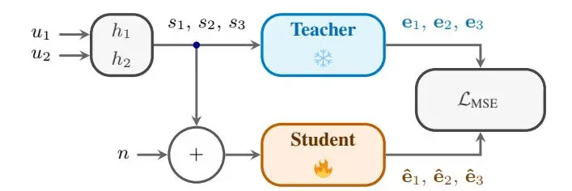
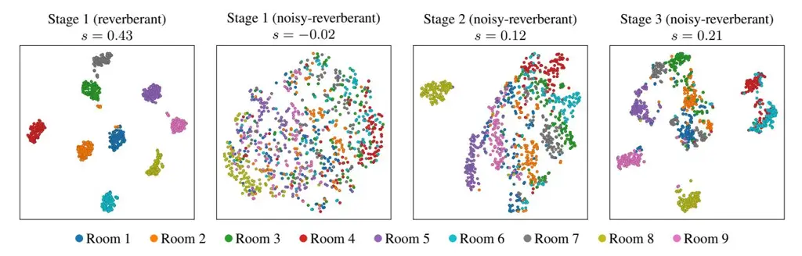

# ROOM IMPULSE RESPONSE EMBEDDINGS FOR SPEECH ENHANCEMENT IN NOISY AND REVERBERANT ENVIRONMENTS

_Adrian Meise, Reinhold Haeb-Umbach_

Paderborn University, Germany

#### ABSTRACT

We propose a self-supervised approach for learning room impulse response (RIR) representations from single-channel noisy-reverberant speech. It consists of first training on reverberant data, then on noisyreverberant data, and finally with a teacher-student approach, where the student learns to replicate the teacher's embeddings when given a noisy version of the reverberant input. We assess their representational capabilities by estimating acoustic room parameters from them. Conditioning a discriminative speech enhancement model on the derived embeddings yields consistent gains across all evaluated metrics, including downstream word error rate, for both reverberant and noisy-reverberant speech.

_Index Terms_— dereverberation, deep filtering, speech enhancement, embeddings, contrastive learning

## 1. INTRODUCTION

Speech dereverberation is beneficial both for human perception and for downstream tasks such as automatic speech recognition (ASR). Both for earlier model-based approaches and today's data-driven methods, it has been shown that using or estimating side information about the spatial signal propagation characteristics can help to improve dereverberation performance [\[1–](#page-4-0)[5\]](#page-4-1). Such information can be in the form of a room impulse response (RIR) or its short-time frequency-domain counterpart, the convolutive transfer function, or in the form of sound propagation parameters, such as sound decay times like T60. This enables the model to better account for the physics of the reverberant acoustic environment.

An alternative to estimating signal propagation characteristics with supervised learning algorithms or even assuming knowledge of them is the use of self-supervised learning (SSL) techniques. They have been very successful for capturing spectral signal properties, while spatial SSL representations are less well-researched. In [\[6\]](#page-4-2), representations from simulated reverberant input signals are extracted via contrastive learning and used for an acoustic parameter estimation task. Similarly, [\[7\]](#page-4-3) chose a predictive pretext task for SSL to capture universal spatial acoustic representations from twochannel input with a high signal-to-noise ratio (SNR), which are evaluated on an acoustic parameter estimation task as well. But also for room classification [\[8\]](#page-4-4), RIR estimation [\[9\]](#page-4-5) and for the generation of new RIRs [\[10\]](#page-4-6), embeddings extracted from an encoder trained in a contrastive framework have been proposed.

The usefulness of spatial SSL representations for speech enhancement tasks is less investigated. In [\[11\]](#page-4-7), RIR embeddings are used to improve ASR performance for degraded input signals, where self-supervision is achieved by predicting the indices of the RIR that generated reverberant input. Khanagha et al. showed that discriminative U-Net-based dereverberation models learn implicit representations of the RIR [\[12\]](#page-4-8). Based on this observation, it was proposed to condition a diffusion-based model on pretrained embeddings that are learnt in a contrastive fashion. Conditioning the model on these RIR embeddings allowed for reducing the number of diffusion steps while achieving improved speech enhancement scores compared to using no conditioning. However, the analysis only considered a generative, diffusion-based dereverberation approach.

In a realistic recording environment with a distant microphone, the recorded signal will be affected not only by multi-path propagation, but also by additive acoustic distortions, such as noise. In general, robustness of SSL features to noise or other perturbations is an ongoing research question and open challenge, both for speech [\[13\]](#page-4-9) and audio processing [\[14\]](#page-4-10). For RIR representations, this is also shown in [\[15\]](#page-4-11), where the uncertainty of RIR embeddings derived with a variational autoencoder is investigated, showing that noise leads to representation shift and embedding dispersion.

In this work, we investigate the learning of RIR representations in the presence of noise in challenging SNR conditions. We propose to directly infer self-supervised representations from noisy and reverberant input using a curriculum learning approach. In the first stage, following [\[12\]](#page-4-8), RIR embeddings are learnt from single-channel reverberant speech with a contrastive loss. In the second training stage, contrastive learning is continued, however, with noisy-reverberant speech input, while in the third stage a teacherstudent approach is used, where the student reproduces the teacher's embeddings from reverberant input using the corresponding noisyreverberant input. Evaluation on acoustic parameter estimation tasks demonstrates the representation capabilities of the noise-robust embeddings. Further, we assess the impact on speech enhancement of noisy-reverberant data, showing that the conditioning of a discriminative deep filtering-based enhancement model on those embeddings leads to consistent improvements for both reverberant and noisy-reverberant data.

In the next section, we explain the training stages. Section [3](#page-1-0) summarizes experimental details, and Section [4](#page-2-0) evaluates the representation quality of the embeddings, before the application for speech enhancement is evaluated in Section [5.](#page-2-1)

# 2. SSL RIR REPRESENTATION LEARNING

Speech enhancement in practical applications is not only confronted with reverberation, but also with additive noise signals emerging from the environment. Here, we aim to learn embeddings from noisy and reverberated input that reflect the information concerning the RIR, while the noise and source signal should be ignored. Therefore, noise-robust representations of the RIR should be derived that exhibit the same characteristics as embeddings obtained from reverberant-only input. To achieve this, one option is to first perform denoising of the input and then to derive the embedding from the denoised signal. However, this assumes that the reverberation is transparent to the denoising system, which is typically not the case [\[16\]](#page-4-12). Consequently, possible artifacts generated by the enhancement system will impact the training of the RIR encoder, and the computed embeddings will become dependent on the denoising system.

To facilitate native noise-robust SSL, we adopt a three-stage training approach, which will be detailed below and which can be summarized as follows: _1. Training on reverberant data_, _2. Training on noisy-reverberant data_ and _3. Teacher-student training_ with the teacher from stage 1 and the student from stage 2.

#### 2.1. Contrastive learning of RIR representations

The first stage is adopted from [\[12\]](#page-4-8). There, it is proposed to improve diffusion-based dereverberation via pretrained RIR-dependent representations obtained from an RIR encoder that is trained in a self-supervised fashion. The self-supervision is achieved via a contrastive learning task, where positive and negative pairs of the input data are generated. A positive pair consists of two different speech utterances that are convolved with the same room impulse response. These are encouraged to produce similar embeddings that are close in the embedding space, as they correspond to the same RIR, while the source signal is to be ignored. Consequently, samples belonging to different RIRs should be mapped to distinct regions. In the negative pair, the source utterances are the same, such that the input mixtures differ only in their spatial properties in terms of different RIRs, which should be pushed apart. Therefore, these negative pairs should explicitly encourage the model to ignore the source utterance and focus only on the reverberation characteristics caused by the RIR. Considering two utterances u1 and u2 and two room impulse responses h1 and h2, three relevant mixture types can be distinguished: s1 = u1 ∗ h1, s2 = u2 ∗ h1 and s3 = u1 ∗ h2, where s1 and s2 would be a positive pair and s1 and s3 would be a negative pair. The loss function consists of a weighted sum of the InfoNCE loss [\[17\]](#page-4-13) and cosine similarity for negative pairs.

## 2.2. Noise-robust RIR representation learning

To derive embeddings from noisy-reverberant input, we propose to continue training the model from the previous stage on noisyreverberant data with the same contrastive learning framework as before. This way, the system adapts to noise while building upon the pretrained capabilities already learned for less challenging reverberant input, where the desired structure of the embedding space is easier to obtain than when training from scratch on noisy-reverberant input. We encourage selecting different noise samples for the same RIR in the positive pair, so that the same RIR has to be identified despite different noise samples. For the negative pair with different RIRs, the noise is instead sampled to be the same with a higher probability. As with the source signal, the model is encouraged to ignore the noise and to learn that the difference between the samples lies in the different RIRs. This prevents the model from identifying different RIRs based on different noise samples. For the three considered mixtures s1, s2, s3 and three different noise samples n1, n2, n3, this can be summarized as

$$\begin{aligned} s_1 &= u_1 * h_1 + n_1 \\ s_2 &= u_2 * h_1 + n \end{aligned} \quad \text{with} \quad n = \begin{cases} n_2 \text{ with prob. } p \\ n_1 \text{ with prob. } 1 - p \end{cases}$$

$$s_3 &= u_1 * h_2 + n \quad \text{with} \quad n = \begin{cases} n_1 \text{ with prob. } p \\ n_3 \text{ with prob. } 1 - p, \end{cases}$$

where p = 0.7 is chosen in the following.

Fig. 1. Overview of the proposed teacher-student training, where the frozen teacher from stage 1 extracts embeddings from the reverberant input and the student from stage 2 has to replicate the embedding from the noisy and reverberant input.

#### 2.3. Teacher-student training

Following the previous stage, we propose a third stage of teacherstudent training to adapt the embedding space learnt on noisyreverberant data to the embedding space learnt from only reverberant data, see Figure [1.](#page-1-1) Here, the embeddings extracted from the reverberant-only input by the frozen teacher from stage 1 serve as the target, which should be replicated by the student from stage 2, which receives noisy and reverberant input. The teacher and student use the same model architecture. Therefore, the characteristics of the teacher embedding space are imprinted onto the student to avoid the pollution of the embedding space with noise information. The setup of positive and negative pairs among s1, s2 and s3 is maintained as in previous stages. Here, the reverberant mixture is fed into the frozen teacher model, which predicts the embedding ei from input si, while the noisy-reverberant mixture is input to the student model, which outputs the embedding ˆei, and the cost function in terms of the mean squared error (MSE) LMSE = ∥ei − ˆei∥ 2 is used to train the student. For validation, we keep the contrastive loss between the derived embeddings as the selection criterion, since it measures the desired characteristics of the embedding space, while the MSE loss is only a means to achieve this.

## 3. EXPERIMENTAL SETUP

For the experiments, we use data from the EARS [\[18\]](#page-4-14) dataset with 100 hours of clean speech and the corresponding variants EARS-WHAM v2 and EARS-Reverb v2. For the RIR encoder, we select the Conformer-based [\[19\]](#page-4-15) architecture, as it achieved the best results among the proposed architectures in [\[12\]](#page-4-8). It uses the logmagnitude of the reverberant signal as input and consists of 10 layers with 256 hidden units and 4 attention heads, and a two-layer MLP head that produces 256-dimensional ℓ2-normalized embeddings. We start training from the pretrained checkpoint[1](#page-1-2) to leverage the selfsupervised pretraining, and we fine-tune the model on the EARS-Reverb data in the first stage to adapt to the EARS source signal data, which exhibit a broader dynamic range, including emotional and highly dynamic speech. In the second stage, we add noise from the WHAM! [\[20\]](#page-4-16) database, which has a total duration of 80 hours. Here, noise is added with an SNR of −2.5 dB to 17.5 dB to the EARS-Reverb data, effectively generating noisy-reverberant EARS-WHAMR data [\[16\]](#page-4-12). In the third teacher-student training stage, we additionally use noise from CHiME-3 [\[21\]](#page-4-17), SINS [\[22\]](#page-4-18), and SMS-WSJ [\[23\]](#page-4-19) for a wider variety of noise samples and more robust noise performance.

To evaluate generalization to unseen noise types and rooms, we generate new degraded test sets from the clean EARS test split using

1https://github.com/ sp-uhh/rir-encoder

Table 1. Performance of acoustic-parameter estimation from the raw waveform or from the embeddings after each training stage. The number of parameters is denoted in parentheses. Bold results indicate best performance for each metric. The MAEs for T60 and DRR are reported in seconds and dB, respectively.

| Test condition       | Model           | Embedding             | Metric     | MAE ↓        | ρ ↑          |
| -------------------- | --------------- | --------------------- | ---------- | ------------ | ------------ |
| Reverb erant      | CNN (0.27M)  | –                     | T60 DRR | 0.30 7.36 | 0.45 0.28 |
|                      | Linear (514) | Stage 1 (Teacher)  | T60 DRR | 0.18 2.51 | 0.76 0.52 |
|                      |                 | Stage 2               | T60 DRR | 0.17 2.74 | 0.74 0.56 |
|                      |                 | Stage 3 (Student)  | T60 DRR | 0.21 2.65 | 0.73 0.56 |
| Noisy reverberant | CNN (0.27M)  | –                     | T60 DRR | 0.31 5.26 | 0.28 0.21 |
|                      | Linear (514) | Stage 1 (Teacher)  | T60 DRR | 0.25 3.37 | 0.46 0.24 |
|                      |                 | Denoised + Stage 1 | T60 DRR | 0.27 4.02 | 0.32 0.21 |
|                      |                 | Stage 2               | T60 DRR | 0.22 3.66 | 0.67 0.38 |
|                      |                 | Stage 3 (Student)  | T60 DRR | 0.23 2.56 | 0.68 0.51 |

noise and RIRs not seen during training of the models. For the _reverberant_ data, we select measured RIRs from the BUT-ReverbDB [\[24\]](#page-4-20) database. For the _noisy-reverberant_ version, we add noise from the DEMAND [\[25\]](#page-4-21) database with an SNR from 0 dB to 20 dB.

In order to gain insight into what has been learnt by the RIR embeddings, we train simple estimators that jointly estimate T60 and direct-to-reverberant energy ratio (DRR). Since these parameters are sufficient to sample a RIR [\[5\]](#page-4-1), they are likely to be represented in the estimated embeddings in order to discern different RIRs. On the one hand, this allows the evaluation of the representation capabilities and an assessment of whether room-related parameters are encoded. On the other hand, it is investigated whether the learnt student embeddings represent the same information as the teacher embeddings. We use a simple linear layer with 514 parameters to estimate T60 and DRR from the derived embeddings, where an individual estimator is trained for the embeddings at each training stage. This estimator is deliberately chosen to be lightweight, so that estimation performance is dependent on the representation capabilities instead of a powerful estimator. For comparison, a 1D-CNN-based estimator with 270,210 parameters is trained that directly operates on the waveform input. Results are reported in terms of mean absolute error (MAE) and Spearman correlation coefficient ρ to measure the monotonicity of the relationship for both estimated parameters.

# 4. EVALUATION

The results for T60 and DRR estimation performance are shown in Table [1.](#page-2-2) The evaluation on reverberant input indicates that the derived embeddings contain relevant information to estimate T60 and DRR. All embedding-based models achieve better parameter estimates compared to the CNN estimator, indicating that relevant features for the parameter estimation are more readily accessible from the embeddings. When comparing the representations from the embedding models at different training stages, it can be observed that although the models from stages 2 and 3 are trained on noisyreverberant input, they still contain information for reverberant-only test input. Note that the performance of this parameter estimation task could be improved by using more advanced estimators. However, for incorporation of the embeddings into downstream models, FiLM [\[26\]](#page-4-22) layers are often used for conditioning, where the embeddings are also processed by small networks.

On noisy-reverberant data, the model from stage 1 fails to represent T60 and DRR information and achieves performance not much better than the CNN-based estimator. For comparison, we also first denoised the input with [\[27\]](#page-4-23) before extracting the embeddings from the enhanced signals, but reverberation is not transparent to the denoising system, and correspondingly, the embeddings no longer contain relevant features. In contrast, the embeddings estimated by the model after the second stage contain relevant information on T60 and DRR. The student model from stage 3 is able to further increase estimation performance, especially on DRR estimation, outperforming the stage 2 model by more than 1 dB and achieving a correlation coefficient similar to the results obtained from reverberant input.

In Figure [2,](#page-3-0) we provide a qualitative comparison of the learnt embedding spaces at the different training stages. For clearer visualization, we use a modified version of the test dataset with only one RIR sampled per room, given the wide variety of recording setups for each room in [\[24\]](#page-4-20). The resulting embeddings are projected onto two dimensions using t-SNE [\[28\]](#page-4-24). Additionally, Silhouette Coefficients [\[29\]](#page-4-25) s ∈ [−1, 1] are reported, where 1 indicates the best result, which is reduced for overlapping clusters or wrong assignments. For the reverberant data, the embeddings from stage 1 form nine distinguishable clusters corresponding to the nine rooms occurring in the test data. However, if this model is directly applied to noisyreverberant data, no regularized embedding space is generated, and the grouping of embeddings of the same RIR into similar regions in the embedding space is lost, highlighting the need for noise-robust representations. After stage 2 of the training, embeddings belonging to the same room are placed closer together in the embedding space, but only the samples from room 8 form a cluster as desired, while the embeddings of one RIR scatter and intersperse with embeddings belonging to other RIRs. For the embeddings derived by the student network, distinguishable clusters that are also separate from clusters belonging to other rooms can again be identified. Here, the most structured embedding space is achieved, which resembles the desired embedding space of the teacher for reverberant input the most.

# 5. APPLICATION TO SPEECH ENHANCEMENT

#### 5.1. Deep filtering

In [\[27\]](#page-4-23), the lightweight and real-time-capable speech enhancement system DeepFilterNet ("DFN3") was proposed. Here, a filter vector is predicted and applied to the degraded input to obtain an enhanced output. Since it was originally proposed for denoising, its dereverberation capabilities are limited [\[30\]](#page-4-26), and we thus expect performance gains from additional conditioning on features that represent RIR information. In [\[30\]](#page-4-26), it is proposed to extend the functionality by introducing an additional second dereverberation step that estimates the late reverberation by filtering the delayed input vector ("two-step"). Here, we suspect that additional RIR features are promising for the estimation of these filter coefficients, to provide a better estimation of the late reverberation and better dereverberation.

Fig. 2. Comparison of t-SNE projections and Silhouette Coefficients s of RIR embeddings for reverberant and noisy-reverberant data after stage 1, after training on noisy and reverberant data in stage 2, and after training as the student network (from left to right).

For the training, the parameters and training setup are chosen as described in [\[30\]](#page-4-26). To condition these models on the RIR embeddings, we incorporate FiLM [\[26\]](#page-4-22) layers after every block in the decoder parts of the models. The embeddings are input to the FiLM layers, which estimate feature-wise scaling and shifting parameters with a small MLP. Thus, the embeddings can impact the estimation of the filter coefficients.

We evaluate performance on the generated reverberant and noisy-reverberant datasets. For the embeddings derived from reverberant data, the RIR encoder after the first training stage is used, and for noisy-reverberant data, the embeddings are obtained from the student after training stage 3. We select a set of metrics that encompasses two intrusive measures, STOI [\[31\]](#page-4-27) and cepstral distance (CD) [\[32\]](#page-4-28), as well as two non-intrusive ones, speech-toreverberation modulation energy ratio (SRMR) [\[33\]](#page-4-29), and DNS-MOS [\[34\]](#page-4-30). Additionally, we report the word error rate (WER) as an indicator of speech (machine) intelligibility. For ASR, we employ a lightweight QuartzNet-based model (18.9M param.) and a large Conformer-based model (1.1B param.) from the NeMo toolkit [\[35\]](#page-4-31). We use two models to check if performance improvements are obtained not only for a weak but also for a strong, potentially more robust recognizer.

#### 5.2. Enhancement results

The results for speech enhancement performance are shown in Table [2.](#page-3-1) As can be seen from the metrics on the input mixture signals, the data pose challenging conditions. For reverberant data, conditioning DFN3 and the two-step approach leads to small but consistent improvements in all metrics. Therefore, additional information on the RIRs encoded in the embeddings leads to more robust estimates of the filter coefficients that improve dereverberation performance compared to the non-conditioned models. Note that the WER results for the weak ASR model on the enhanced results even degrade compared to the input. The chosen deep filtering approach seems to introduce artifacts that the weak ASR system cannot handle, although dereverberation is applied, as seen in the other metrics. However, the use of additional conditioning leads to improvements compared to the non-conditioned systems, and for the strong ASR system it also improves upon the input signal WER.

For noisy-reverberant data, the results are similar, with consistent improvements for FiLM conditioning in all metrics. Interestingly, the gain through FiLM conditioning is even larger for the strong ASR model than for the weak one.

Table 2. Performance for reverberant and noisy-reverberant datasets for models with and without additional conditioning. Bold results indicate the best performance per model type. WER results are reported for the weak (left/) and strong (/right) ASR model.

| Model                   | Reverberant  |              |              |                             |                                |     |
| ----------------------- | ------------ | ------------ | ------------ | --------------------------- | ------------------------------ | --- |
|                         |              |              |              | STOI ↑ CD ↓ SRMR ↑ DNSMOS ↑ | WER ↓                          |     |
| Input                   | 0.64         | 4.30         | 3.77         | 2.87                        | 36.85 / 12.05                  |     |
| DFN3 [27] + FiLM     | 0.72 0.73 | 3.75 3.64 | 6.18 6.20 | 2.80 2.84                | 44.19 / 12.88 39.52 / 10.56 |     |
| Two-step [30] + FiLM | 0.73 0.74 | 3.81 3.55 | 7.41 8.39 | 2.83 2.85                | 42.91 / 12.06 38.81 / 11.13 |     |

| Model                   | Noisy-reverberant |              |              |                             |                                |     |
| ----------------------- | ----------------- | ------------ | ------------ | --------------------------- | ------------------------------ | --- |
|                         |                   |              |              | STOI ↑ CD ↓ SRMR ↑ DNSMOS ↑ | WER ↓                          |     |
| Input                   | 0.56              | 5.62         | 3.11         | 2.50                        | 63.47 / 41.32                  |     |
| DFN3 [27] + FiLM     | 0.61 0.62      | 4.46 4.34 | 5.90 6.14 | 2.65 2.66                | 67.98 / 41.01 67.81 / 39.41 |     |
| Two-step [30] + FiLM | 0.61 0.64      | 4.50 4.28 | 7.24 8.20 | 2.64 2.72                | 68.90 / 42.08 64.61 / 35.15 |     |

#### 6. CONCLUSIONS

In this work, we developed an approach to train noise-robust RIR embeddings. We adopted a three-stage approach, where the model is first trained in a contrastive framework on reverberant data, then on noisy and reverberant data, before finally a teacher-student approach is used, where the student is tasked with deriving the teacher embeddings from the noisy version of the reverberant input. Evaluations on the estimation of T60 and DRR showed that these parameters are linearly accessible from the embeddings and are maintained by the student model for both reverberant and noisy-reverberant input. The conditioning of deep filtering-based speech enhancement models on the RIR embeddings resulted in consistent gains in all considered metrics, including the word error rate of a weak and a strong ASR model. As future work, we are planning to investigate other discriminative approaches and multi-stage models. Further, we aim to extend the RIR representation to multi-channel input and frame-wise resolution for use in speech enhancement in dynamic scenarios.

# 7. REFERENCES

- [1] I. Kodrasi, T. Gerkmann, and S. Doclo, "Frequency-domain single-channel inverse filtering for speech dereverberation: Theory and practice," in _Proc. ICASSP_, 2014, pp. 5177–5181.
- [2] B. Wu, K. Li, M. Yang, and C.-H. Lee, "A reverberation-timeaware approach to speech dereverberation based on deep neural networks," _IEEE/ACM TASLP_, vol. 25, no. 1, pp. 102–111, 2017.
- [3] H. Wang _et al._, "TeCANet: Temporal-Contextual Attention Network for Environment-Aware Speech Dereverberation," in _Proc. Interspeech_, 2021, pp. 1109–1113.
- [4] Y. Li, Y. Liu, and D. S. Williamson, "A composite T60 regression and classification approach for speech dereverberation," _IEEE TASLP_, vol. 31, pp. 1013–1023, 2023.
- [5] L. Bahrman, M. Rodrigues, M. Fontaine, and G. Richard, "Udream: Unsupervised dereverberation guided by a reverberation model," _IEEE TASLP_, vol. 34, pp. 1552–1563, 2026.
- [6] P. Gotz, C. Tuna, A. Walther, and E. A. P. Habets, "Contrastive ¨ representation learning for acoustic parameter estimation," in _Proc. ICASSP_, 2023, pp. 1–5.
- [7] B. Yang and X. Li, "Self-supervised learning of spatial acoustic representation with cross-channel signal reconstruction and multi-channel conformer," _IEEE/ACM TASLP_, vol. 32, pp. 4211–4225, Sept. 2024.
- [8] J. Bitterman, D. Levi, H. H. Diamandi, S. Gannot, and T. Rosenwein, "RevRIR: Joint Reverberant Speech and Room Impulse Response Embedding using Contrastive Learning with Application to Room Shape Classification," in _Proc. Interspeech_, 2024, pp. 3280–3284.
- [9] A. Ratnarajah, S. Ghosh, S. Kumar, P. Chiniya, and D. Manocha, "Av-rir: Audio-visual room impulse response estimation," in _Proc. CVPR_, 2024, pp. 27154–27165.
- [10] F. Llu´ıs and N. Meyer-Kahlen, "Blind spatial impulse response generation from separate room- and scene-specific information," in _Proc. ICASSP_, 2025, pp. 1–5.
- [11] Y. Khokhlov _et al._, "R-Vectors: New Technique for Adaptation to Room Acoustics," in _Proc. Interspeech_, 2019, pp. 1243– 1247.
- [12] S. Khanagha and T. Gerkmann, "Your U-Net Dereverberation Model is Secretly an RIR Encoder," in _Proc. Interspeech_, 2026.
- [13] Y. Song, D. Kim, N. Madhu, and H.-G. Kang, "On the disentanglement and robustness of self-supervised speech representations," in _Proc. ICEIC_, 2024, pp. 1–4.
- [14] T. Fujimura _et al._, "NaBEATS: noise-aware audio representation learning," in _Proc. IWAENC_, 2026.
- [15] Y. Xiang _et al._, "Quantifying the uncertainty of blindly estimated room embeddings using a dispersion-calibrated score," in _Proc. Interspeech_, 2026.
- [16] A. Meise, T. Cord-Landwehr, and R. Haeb-Umbach, "On the application of diffusion models for simultaneous denoising and dereverberation," in _Proc. ITG Conference_, 2025, pp. 116–120.
- [17] A. van den Oord, Y. Li, and O. Vinyals, "Representation learning with contrastive predictive coding," _ArXiv_, 2019.
- [18] J. Richter _et al._, "EARS: An Anechoic Fullband Speech Dataset Benchmarked for Speech Enhancement and Dereverberation," in _Proc. Interspeech_, 2024, pp. 4873–4877.

- [19] A. Gulati _et al._, "Conformer: Convolution-augmented Transformer for Speech Recognition," in _Proc. Interspeech_, 2020, pp. 5036–5040.
- [20] G. Wichern _et al._, "WHAM!: Extending Speech Separation to Noisy Environments," in _Proc. Interspeech_, 2019, pp. 1368– 1372.
- [21] J. Barker, R. Marxer, E. Vincent, and S. Watanabe, "The third 'CHiME' Speech Separation and Recognition Challenge: Dataset, task and baselines," in _Proc. ASRU_, Scottsdale, AZ, United States, Dec. 2015.
- [22] G. Dekkers _et al._, "The sins database for detection of daily activities in a home environment using an acoustic sensor network," _Detection and Classification of Acoustic Scenes and Events_, 2017.
- [23] L. Drude, J. Heitkaemper, C. Boddeker, and R. Haeb-Umbach, ¨ "SMS-WSJ: database, performance measures, and baseline recipe for multi-channel source separation and recognition," _ArXiv_, vol. abs/1910.13934, 2019.
- [24] I. Szoke, M. Sk ¨ acel, L. Mo ´ sner, J. Paliesek, and J. ˇ Cernock ˇ y,´ "Building and evaluation of a real room impulse response dataset," _IEEE J. Sel. Top. Signal Process._, vol. 13, no. 4, pp. 863–876, 2019.
- [25] J. Thiemann, N. Ito, and E. Vincent, "The diverse environments multi-channel acoustic noise database (demand): A database of multichannel environmental noise recordings," _Proceedings of Meetings on Acoustics_, vol. 19, no. 1, pp. 035081, 05 2013.
- [26] E. Perez, F. Strub, H. de Vries, V. Dumoulin, and A. Courville, "Film: Visual reasoning with a general conditioning layer," _Proc. AAAI Conf. Artif. Intell._, vol. 32, no. 1, 2018.
- [27] H. Schroter, A. N. Escalante-B., T. Rosenkranz, and A. Maier, ¨ "DeepFilterNet: Perceptually Motivated Real-Time Speech Enhancement," in _Proc. Interspeech_, 2023.
- [28] L. van der Maaten and G. Hinton, "Visualizing data using tsne," _Journal of Machine Learning Research_, vol. 9, no. 86, pp. 2579–2605, 2008.
- [29] P. J. Rousseeuw, "Silhouettes: A graphical aid to the interpretation and validation of cluster analysis," _Journal of Computational and Applied Mathematics_, vol. 20, pp. 53–65, 1987.
- [30] T. Rosenbaum, E. Winebrand, O. Cohen, and I. Cohen, "Deeplearning framework for efficient real-time speech enhancement and dereverberation," _Sensors_, vol. 25, no. 3, 2025.
- [31] C. H. Taal, R. C. Hendriks, R. Heusdens, and J. Jensen, "A short-time objective intelligibility measure for time-frequency weighted noisy speech," in _Proc. ICASSP_, 2010, pp. 4214– 4217.
- [32] R. Kubichek, "Mel-cepstral distance measure for objective speech quality assessment," in _Proc. PACRIM_, 1993, vol. 1, pp. 125–128.
- [33] T. H. Falk, C. Zheng, and W.-Y. Chan, "A non-intrusive quality and intelligibility measure of reverberant and dereverberated speech," _IEEE TASLP_, vol. 18, no. 7, pp. 1766–1774, 2010.
- [34] C. K. A. Reddy, V. Gopal, and R. Cutler, "Dnsmos: A nonintrusive perceptual objective speech quality metric to evaluate noise suppressors," in _Proc. ICASSP_, 2021, pp. 6493–6497.
- [35] O. Kuchaiev _et al._, "Nemo: a toolkit for building AI applications using neural modules," _ArXiv_, 2019.
