# Optimal transport meets speech: a tutorial review

Xugang Lu¹, Yu Tsao² Affiliation: Affiliation: 1. National Institute of
Information and Communications Technology, Japan Affiliation:
Affiliation: 2. Research Center for Information Technology Innovation,
Academia Sinica, Taiwan Affiliation:

###### Abstract

Optimal Transport (OT) provides a principled framework for comparing and
transforming probability distributions while preserving geometric
structure. Recently, OT has gained significant attention in machine
learning due to its ability to measure discrepancies between
distributions, even when their supports do not overlap, making it
effective for tasks such as generative modeling, domain adaptation, and
transfer learning. Despite its success in fields such as computer vision
and natural language processing, OT remains relatively underexplored in
speech research. Speech signals present unique challenges, including
temporal dynamics, speaker variability, noise, reverberation, and
heterogeneous multimodal representations involving audio, text, and
visual information. These factors often lead to distribution mismatches,
where OT offers a natural framework for alignment and interpretation.
This work aims to promote broader adoption of OT in speech processing
by: (1) reviewing OT foundations through intuitive physical
interpretations and highlighting connections to modern generative
models; (2) presenting computational algorithms suitable for deep
learning frameworks; and (3) demonstrating OT applications in
cross-domain and cross-modal speech tasks, including speech enhancement,
automatic speech recognition, language and speaker recognition, and
audio spoof detection. We highlight OT’s strong potential for addressing
distributional variations in real-world speech applications.

###### Index Terms:

Optimal transport, Cross-domain adaptation, Cross-modal knowledge
transfer learning, Alignment and matching.

## I Introduction

Optimal transport (OT), also known as mass transport, can be simply
described as the search for the most efficient way to transform from one
mass distribution to another, considering a specified transform cost
\[120, 63\]. This theory which has been extensively studied by many
researchers has found extensive applications in operational research,
mathematics, economics, and physics \[120, 63\]. In particular, it has
garnered widespread attention in statistical machine learning (ML) in
recent years \[64, 96, 103\].

### I-A Optimal transport in machine learning

In statistical ML, whether dealing with pattern classification or
regression problems, numerous research tasks involve comparing or
manipulating the probability distributions of the underlying features or
objects. The role of applying OT in ML lies in its ability to furnish an
effective metric measure (e.g., discrepancy or distance measure) between
two probability distributions, establishing correspondences between sets
of samples with a geometric-aware distance between distributions. This
metric measure can then function as a learning objective or metric when
handling feature vectors within a probability space. OT-based learning
has been shown to be effective in measuring the distribution discrepancy
even when the compared distributions have disjoint supports \[101\].
Furthermore, this learning can incorporate the geometric structures of
datasets, demonstrating a form of geometric-aware learning \[26\]. In
addition to the increasing popularity of ML in recent years, especially
in computational ML theories (such as generative model learning, domain
adaptation, or transfer learning) \[26\], OT theory has been extensively
applied in real-world scenarios, particularly in the fields of
computational graph, image classification \[132\], and computer vision
\[130, 13\]. It has also gained recognition for a range of natural
language processing (NLP) tasks \[19, 123, 11\], including document
retrieval, semantic matching \[11\], machine translation \[141\], and
word embedding \[70\]. In contrast, the speech science community has
only recently begun to explore applications of OT. The inherently
sequential and temporal nature of speech signals poses significant
challenges in integrating OT into speech processing frameworks, which
has limited its exploration in this domain.

### I-B Optimal transport in speech

In speech tasks, various challenges need consideration, including
feature representation learning, feature and model fusion, domain
adaptation, knowledge transfer learning, etc. These learning algorithms
primarily manipulate probability distributions. A crucial aspect for
improving performance is the thoughtful selection of a meaningful
measurement metric, such as discrepancy, similarity, or distance. The
use of OT extends to estimating, comparing, and aligning the
distributions for feature aggregation, model fusion, cross-domain and
cross-modal adaptation, and transfer learning. Hence, the primary goal
of this review paper is to review fundamental knowledge about OT and its
computational algorithms, demonstrating their adaptability to deep
learning model frameworks with ease. Through this review, a clear
understanding emerges that OT can offer meaningful explanations in model
learning.

In real-world applications of speech technologies, the performance of
speech applications often experiences notable degradation due to various
factors. On the one hand, speech signals are susceptible to external or
extrinsic degradations such as noise, reverberation, and noise
suppression processing, significantly impacting speech quality and
intelligibility \[124, 75, 139\]. On the other hand, intrinsic
variations pose challenges as speech exhibits considerable diversity in
articulation styles among speakers and co-articulation effects
influenced by different contexts and domains. A co-occurring pattern
involves representing acoustic speech in multi-views, including text
content and visual information during speaking. Addressing these
challenges, learning representations that encompass all these multi-view
information sources can potentially mitigate uncertainty. Robust
representations learned through cross-modal feature learning have been
shown to enhance performance and adaptability in diverse speech
scenarios. The OT serves as a powerful mathematical tool for quantifying
and manipulating distribution variations. Thus, the second objective of
this review paper is to introduce ideas and techniques to seamlessly
integrate OT to describe the underlying distribution variations of
speech, with the aim of enhancing overall performance.

In summary, the purpose of this review is to introduce OT in speech
signal processing and to share our findings, offering our insights to
speech researchers seeking entry points into this promising area. In
this review paper, our aim is to: (1) Provide a historical review of the
OT problem, mathematical foundations, connections in transport modeling
to generative diffusion models, and computational algorithms,
particularly focusing on those integrated into deep learning model
frameworks. (2) Introduce potential applications of OT in ML and related
fields, particularly in domain adaptation tasks; (3) Explain how OT can
be seamlessly and effectively integrated into speech-related application
tasks. We will present research topics that integrate OT for speech
application problems, including speech translation, spoken document
retrieval, semantic analysis in NLP, and speech acoustic modeling.
Specifically, we will address cross-domain problems related to speech
enhancement (SE) \[77, 52\], speaker recognition or verification
(SR/SVR) \[133, 122\], spoken language identification/recognition
(SLID/SLR) \[87\], and multi-modal or cross-modal knowledge transfer and
adaptation for automatic speech recognition (ASR) \[88, 86, 90, 91\];
(4) Share our review and perspective on the potential usage of OT in
speech.

### I-C Notations and symbols

For a self-contained introduction of the main concepts of OT, we begin
by giving several fundamental mathematical notations, symbols and
operators that will be frequently used throughout this paper.

#### I-C1 Gradient

The gradient of a scalar function $`f:\mathbb{R}^{n}\to\mathbb{R}`$ is
the vector consisting of its partial derivatives with respect to each
coordinate direction. It points in the direction of the steepest
increase in the function and encodes how the function changes in space,
a vector field denoted by $`\nabla f`$ formulated as:

```math
{\rm grad}(f):\nabla f\mathop{=}\limits^{\Delta}\left({\frac{{\partial f}}{{\partial x_{1}}},\frac{{\partial f}}{{\partial x_{2}}},...,\frac{{\partial f}}{{\partial x_{n}}}}\right). \tag{1}
```

#### I-C2 Divergence

The divergence of a vector field is the scalar quantity obtained by
summing the partial derivatives of each vector component. It measures
the net rate at which “mass” or “flow” is expanding or contracting at a
given point. The divergence of a vector field
$`\mathbf{F}:\mathbb{R}^{n}\to\mathbb{R}^{n}`$ with
$`\mathbf{F}=(F_{1},F_{2},\ldots,F_{n})`$ is a scalar field denoted by
$`\nabla\cdot\mathbf{F}`$ and is defined as:

```math
{\rm div}({\bf F}):\nabla\cdot{\bf F}\mathop{=}\limits^{\Delta}\sum\limits_{i}{\frac{{\partial F_{i}}}{{\partial x_{i}}}}.
```

#### I-C3 Laplacian

The Laplacian operator is defined as the divergence of the gradient.
Applied to a scalar function, it produces a scalar quantity that
describes how the value of the function at a point compares to its
average value in a small neighborhood. The Laplacian plays a central
role in diffusion processes, heat equations, and many partial
differential equations (PDEs) relevant to OT. The Laplacian of a scalar
field $`f:\mathbb{R}^{n}\to\mathbb{R}`$ is a scalar field denoted by
$`\Delta f`$ or $`\nabla^{2}f`$ and is defined as the divergence of the
gradient of $`f`$:

```math
\Delta f=\nabla^{2}f=\nabla\cdot(\nabla f)=\rm{div}(\rm{grad}(f)).
```

Explicitly, in $`\mathbb{R}^{n}`$, it is given by:

```math
\Delta f\mathop{=}\limits^{\Delta}\frac{\partial^{2}f}{\partial x_{1}^{2}}+\frac{\partial^{2}f}{\partial x_{2}^{2}}+\cdots+\frac{\partial^{2}f}{\partial x_{n}^{2}}.
```

#### I-C4 Probability space and Push-Forward Measures

The notion of a probability space and the concept of a push-forward
measure \[71\] are fundamental in OT. A probability space (or a measure
space) is formally described as a triple $`(X,\mathcal{A},\mu)`$, where

- •
  $`X`$ is the sample space, representing all possible outcomes,
- •
  $`\mathcal{A}`$ is a $`\sigma`$-algebra of measurable subsets of
  $`X`$, representing the collection of admissible events,
- •
  $`\mu`$ is a probability measure that assigns a probability value to
  each event in $`\mathcal{A}`$.

Although these definitions arise from abstract measure theory (e.g.,
$`X`$ is often assumed to be a Polish space), our purpose here is
practical. Therefore, it suffices to consider a probability space as a
structured way to assign probabilities to events. Now consider a
measurable transformation $`T:X\to Y`$ that maps elements from one
probability space to another. This map naturally induces a new measure
in $`Y`$, called the push-forward measure, as shown in Fig. 1.

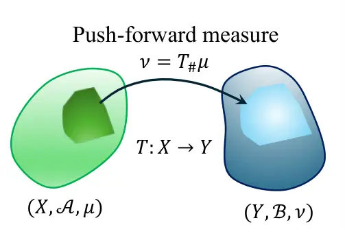

Figure 1: Push-forward measure in probability spaces.

Intuitively, the push-forward describes how the probability mass is
transported from $`X`$ to $`Y`$ through $`T`$. Formally, given a measure
space $`(X,\mathcal{A},\mu)`$ and a measurable space
$`(Y,\mathcal{B})`$, the push-forward measure $`\nu=T_{\#}\mu`$ in
$`(Y,\mathcal{B})`$ is defined by:

```math
T_{\#}\mu(B)=\mu\!\left(T^{-1}(B)\right),\qquad\forall\,B\in\mathcal{B}, \tag{2}
```

where $`T^{-1}(B)=\{x\in X\mid T(x)\in B\}`$.

The push-forward measure satisfies the usual change-of-variables
formula. For any measurable function $`\varphi:Y\to\mathbb{R}`$, we
have:

```math
\int_{Y}\varphi\,d(T_{\#}\mu)=\int_{X}\varphi\circ T\,d\mu. \tag{3}
```

This identity is used extensively in OT theory, particularly when
describing how probability distributions transform under transport maps.

## II Historic review of Optimal transport

This section provides a comprehensive and historical review of the
fundamental concept of OT and its connections to concepts used in other
disciplines.

### II-A Problems of OT

OT problems have been described through various intuitive examples in
different fields, for example, delivering baked goods to coffee shops,
moving sand or soil for construction, or relocating rubble for site
preparation \[120\]. In simple terms, OT seeks the most efficient way to
achieve a given goal, typically by minimizing the effort or cost
required to move the mass from one distribution to another. Despite the
simplicity of its underlying idea, solving OT problems is often highly
nontrivial. The field has a history spanning more than two centuries and
has been marked by extensive and ongoing research activities. Fig. 2
describes the important characters related to OT along the time line.

### II-B Historical figures in the development of OT theory

Over the past two centuries, many influential scholars have contributed
to the development of OT theory, which continues to thrive with vigorous
research activities, especially in the 21st century.

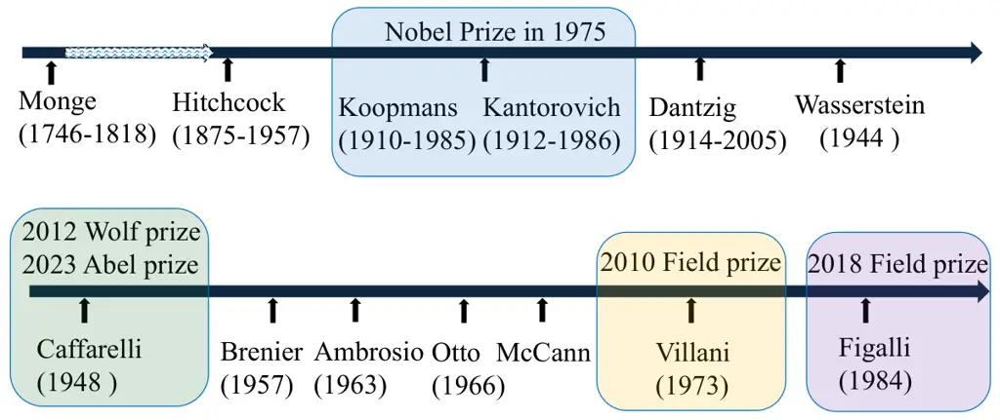

Figure 2: Historical figures in the development of OT theory.

As shown in Fig. 2, OT theory traces its origins back to 1781, when
Monge first posed the problem of determining the most efficient way to
transport mass between two locations. The development of this theory
progressed slowly until 1942, when Kantorovich introduced a relaxed
formulation of Monge’s problem by incorporating duality and linear
programming, thus establishing OT as a powerful tool for resource
allocation \[120, 38\]. In parallel, Dantzig-known as the “father of the
simplex algorithm” proposed efficient algorithms that further advanced
the solution of optimization problems in OT. Wasserstein later
formalized the Kantorovich problem through what is now known as the
Wasserstein distance \[1\]. This formulation opened the door to new
insights and methodologies that have influenced a wide range of
disciplines, including physics, probability theory, financial
mathematics, and economics. Toward the new century, significant
theoretical progress was made by mathematicians such as Brenier \[15\],
who addressed the existence of OT maps, and Otto and McCann, who
investigated the geometric structure underlying OT. In recent decades,
Villani has made profound contributions to OT theory, and his
influential books on OT are widely known \[120, 121\]. Figalli has also
advanced the field, particularly through applications to PDEs. The
historical trajectory of these contributions highlights not only the
brilliance of the researchers involved but also the recognition the
field has received through numerous prestigious awards. Together, these
developments underscore the importance and enduring vitality of OT as a
research area.

### II-C Landmark research activities

During the development of OT theory, several historical moments or
landmark activities have been recorded. A rough figure is shown in Fig. 3.

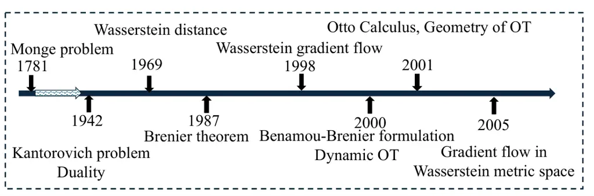

Figure 3: Landmark research activities.

The figure summarizes the major milestones in the development of OT
theory. The concept originated in 1781, when Monge introduced what is
now known as the Monge OT problem: finding an OT map that moves mass
from one distribution to another while minimizing a prescribed cost.
This formulation is elegant but difficult to solve, and, moreover, an
optimal map does not always exist. Substantial progress was made in 1942
when Kantorovich proposed a relaxed version of Monge’s formulation by
introducing the notion of a transport plan or coupling. This relaxation
transformed the OT problem into a LP framework and allowed solutions to
exist under far more general conditions. In the late 1960s, the concept
of the Wasserstein distance was articulated, revealing that the
Wasserstein metric is equivalent to the Kantorovich formulation. This
insight provided a geometric interpretation of OT and connected it to
probability theory, analysis, and geometry. However, for many years, the
existence of OT maps remained unclear. A breakthrough occurred around
1987, when Brenier established his celebrated theorem, proving the
existence and uniqueness of OT maps under suitable conditions, and
showing that such maps arise as gradients of convex functions \[15,
93\]. This result has become foundational for modern computational OT,
for example, many neural network-based OT methods such as an neural OT
models and algorithms based on the Input Convex Neural Network (ICNN)
model \[3, 94\], directly build on the structure revealed by Brenier’s
theorem. Further significant advances took place in the late 1990s.
Around 1998-1999, researchers demonstrated that the evolution from one
probability distribution to another can be interpreted as a Wasserstein
gradient flow, governed by a PDE \[35\]. Shortly thereafter, around
2000, OT was linked to fluid dynamic formulations, giving rise to a
dynamic viewpoint in which OT corresponds to minimizing kinetic energy
over time \[9\]. This dynamic formulation inspired numerous extensions,
including time-dependent OT models and applications in continuum
mechanics \[9\]. The study of gradient flows in the Wasserstein space
also led to the discovery of rich geometric properties of OT, most
notably the development of Otto’s Calculus \[57, 98\]. These geometric
insights have had far-reaching consequences: they connected OT to the
analysis of PDEs, informed variational approaches to diffusion
equations, and motivated modern interpretations of stochastic
differential equations (SDEs) through the lens of Wasserstein geometry
\[40\]. Together, these theoretical developments form the backbone of
both classical and modern OT theory, laying the foundation for its
widespread influence in mathematics \[57\], physics, engineering, data
science, and machine learning \[120\].

### II-D Wide concept connections to OT

Based on OT theory, many concepts and methods could be connected to OT.
Fig. 4 shows several concepts and methods we have ever met in different
research fields which have a close relationship to OT.

Figure 4: Wide concept connections to OT.

For example, fluid dynamics, diffusion model, flow matching, etc.,
particularly their connections with recent generative model based
machine learning algorithms. These concepts are original from physics
and mathematics, and there is a trend in the machine learning society
trying to apply these concepts to learning algorithms \[101\]. In
applications, a lot of tools have been derived from these research
fields and concepts. In the following sections, we will introduce the
mathematical formulations and properties related to OT.

## III Monge’s Optimal Transport Problem

Monge’s OT problem is one of the classical formulations in OT theory.
Given a probability measure $`\mu`$ in a measurable space
$`(X,\mathcal{A})`$, a probability measure $`\nu`$ in a measurable space
$`(Y,\mathcal{B})`$, and a cost function $`c:X\times Y\to[0,\infty)`$,
the goal is to find a measurable map $`T:X\to Y`$ that minimizes the
total transportation cost. The problem is formulated as \[120, 2\]:

```math
\inf_{T}\int_{X}c(x,T(x))\,d\mu(x), \tag{4}
```

subject to the constraint that the map $`T`$ pushes the measure $`\mu`$
onto $`\nu`$:

```math
T_{\#}\mu=\nu. \tag{5}
```

Several key components appear in this formulation:

- •
  Transport map $`T`$: A measurable map that transfers the mass from the
  source measure $`\mu`$ to the target measure $`\nu`$. The push-forward
  operation ensures that $`T`$ redistributes $`\mu`$-mass to match
  $`\nu`$.
- •
  Cost function $`c(x,y)`$: A nonnegative function defining the
  transportation cost between $`x\in X`$ and $`y\in Y`$. Common choices
  include the Euclidean distance, its powers, or more general
  Minkowski-type distances.
- •
  Total cost of transport: The integral $`\int_{X}c(x,T(x))\,d\mu(x)`$,
  representing the total cost of transporting the mass according to the
  map $`T`$.
- •
  Infimum: The problem seeks the minimum possible value of the total
  cost over all admissible transport maps (indicated as symbol “inf” in
  Eq. (4) ). Informally, this may be regarded simply as a minimization
  problem.

In summary, the Monge formulation asks for an OT map $`T`$ that moves
the mass of $`\mu`$ to match $`\nu`$ while achieving the smallest
possible transport cost.

## IV Kantorovich Relaxation of the Optimal Transport Problem

The formulation of the OT problem in Monge’s sense suffers from several
fundamental limitations. Monge’s formulation requires a transport map
$`T`$ that sends each point in the source domain to exactly one point in
the target domain. This prohibits any splitting of the mass and
implicitly assumes that $`\mu`$ and $`\nu`$ have the same total mass and
compatible structures. Consequently, the Monge problem may be ill-posed:
a minimizer may not exist, and even when a solution exists, it is
difficult to compute because the problem is inherently combinatorial
\[101\]. A major breakthrough occurred in 1942 due to Kantorovich, who
proposed a relaxed formulation of the transport problem. In
Kantorovich’s version, mass may be split and redistributed across
multiple destinations, making the transportation process stochastic
rather than deterministic. This relaxation replaces transport maps with
transport plans (also called couplings). With this modification, the
existence of minimizers is guaranteed under very mild conditions, and
the theory becomes substantially more tractable. This relaxation marks
the beginning of modern OT theory \[120, 2\].

### IV-A Kantorovich OT Problem

Kantorovich’s formulation generalizes Monge’s problem by replacing
measurable maps with joint measures. Given probability measures $`\mu`$
on $`(X,\mathcal{A})`$ and $`\nu`$ on $`(Y,\mathcal{B})`$, and a cost
function $`c`$ as defined in Monge’s problem, the objective is to find a
transport plan $`\gamma`$ that minimizes the total transportation cost.
A transport plan is a probability measure $`\gamma`$ in $`X\times Y`$
whose marginals are $`\mu`$ and $`\nu`$. The Kantorovich OT problem is
then defined as:

```math
\inf_{\gamma\in\Pi(\mu,\nu)}\int_{X\times Y}c(x,y)\,d\gamma(x,y), \tag{6}
```

where the admissible set of couplings is

```math
\begin{array}[]{l}\begin{aligned} \gamma(A\times Y)&=\mu(A),\qquad\forall A\in\mathcal{A},\\
\gamma(X\times B)&=\nu(B),\qquad\forall B\in\mathcal{B}.\\
\end{aligned}\end{array} \tag{7}
```

In this formulation, a transport plan $`\gamma`$ is a joint distribution
$`\prod{\left({\mu,\nu}\right)}`$ on $`X\times Y`$ that describes how
mass is transferred from $`X`$ to $`Y`$. Its marginals satisfy:

```math
\int_{Y}\gamma(x,dy)=\mu(dx),\qquad\int_{X}\gamma(dx,y)=\nu(dy). \tag{8}
```

Unlike Monge’s transport map, a transport plan allows the mass at a
single location $`x\in X`$ to be split and sent to multiple
destinations.

### IV-B Discrete Kantorovich OT

In the discrete setting, let $`X=\{x_{1},\ldots,x_{m}\}`$ and
$`Y=\{y_{1},\ldots,y_{n}\}`$ with corresponding probability
distributions $`\mu`$ and $`\nu`$. Let $`c(x_{i},y_{j})`$ denote the
transportation cost from $`x_{i}`$ to $`y_{j}`$. A discrete transport
plan is represented by a nonnegative matrix
$`\gamma=(\gamma_{ij})\in\mathbb{R}_{\geq 0}^{m\times n}`$, where
$`\gamma_{ij}`$ specifies the fraction of mass moved from $`x_{i}`$ to
$`y_{j}`$. The discrete Kantorovich OT problem becomes \[101\]:

```math
\min_{\gamma\in\Pi(\mu,\nu)}\sum_{i=1}^{m}\sum_{j=1}^{n}\gamma_{ij}\,c(x_{i},y_{j}), \tag{9}
```

subject to:

```math
\begin{array}[]{l}\begin{aligned} &\sum_{j=1}^{n}\gamma_{ij}=\mu(x_{i}),\qquad\forall i,\\
&\sum_{i=1}^{m}\gamma_{ij}=\nu(y_{j}),\qquad\forall j,\\
&\gamma_{ij}\geq 0,\qquad\qquad\quad\forall i,j.\\
\end{aligned}\end{array} \tag{10}
```

This discrete transport process is explained in Fig. 5.

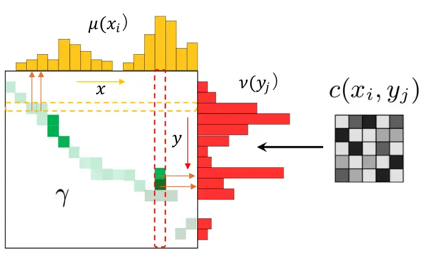

Figure 5: Mass splitting in discrete Kantorovich OT.

As shown in this figure, Kantorovich’s relaxation allows the mass at
each $`x_{i}`$ to be divided among multiple target points $`y_{j}`$,
making the coupling matrix $`\gamma`$ a probabilistic representation of
all permissible transport assignments. This relaxation not only
guaranties the existence of minimizers but also provides the foundation
for modern numerical OT algorithms and theoretical advancements.

## V Wasserstein Distance Metric

Based on the concepts and definitions explained in sections III and IV,
we now introduce an important notion that appears frequently in our
research, i.e., the Wasserstein distance. This distance is defined
between two probability measures and quantifies how far one distribution
$`\mu`$ is from another distribution $`\nu`$. The terminology
“Wasserstein” originates from the mathematician Leonid Vaseršteĭn, whose
name appeared in the literature in this transliterated form. The
$`p`$-Wasserstein distance is defined using the cost of transporting the
mass with respect to a ground distance metric $`d(x,y)`$. This
construction leads to a mathematically well-behaved notion of distance
with strong geometric and analytic properties. In particular, the
Wasserstein distance is a metric, which allows us to study probability
measures within the framework of metric geometry and functional
analysis. For $`p\geq 1`$, the $`p`$-Wasserstein distance between
probability measures $`\mu`$ and $`\nu`$ on a metric space $`(X,d)`$ is
defined as \[101, 120\]:

```math
W_{p}(\mu,\nu)\mathop{=}\limits^{\Delta}\left(\inf_{\gamma\in\prod(\mu,\nu)}\int_{X\times X}d(x,y)^{p}\,d\gamma(x,y)\right)^{1/p}, \tag{11}
```

where $`\prod(\mu,\nu)`$ denotes the set of all couplings of $`\mu`$ and
$`\nu`$, i.e., all joint probability measures in $`X\times X`$ whose
marginals coincide with $`\mu`$ and $`\nu`$, respectively. Several
properties are related to this Wasserstein distance:

- •
  Non-negativity: $`W_{p}(\mu,\nu)\geq 0`$ and $`W_{p}(\mu,\nu)=0`$ if
  and only if $`\mu=\nu`$.
- •
  Metric property: $`W_{p}`$ defines a metric in the space of
  probability measures with finite $`p`$-th moment.
- •
  Invariance: $`W_{p}(\mu,\nu)`$ is invariant under isometries of the
  underlying metric space.

Based on this definition, several special cases could be obtained:

- •
  When $`p=1`$, the Wasserstein distance $`W_{1}`$ is known as the Earth
  Mover’s Distance or the Kantorovich-Rubinstein metric. It is widely
  used in computer vision and machine learning, including the
  Wasserstein GAN framework \[6\].
- •
  When $`p=2`$, the Wasserstein distance $`W_{2}`$ corresponds to the
  quadratic Wasserstein metric, central in OT theory and geometric
  interpretations of PDEs.

Because the Wasserstein distance is a genuine metric, the induced space:

```math
\mathcal{W}_{p}(X):\mathop{=}\limits^{\Delta}\left(\mathcal{P}_{p}(X),\,W_{p}\right), \tag{12}
```

which is known as the Wasserstein space. This geometric structure
enables various operations on probability distributions, including
interpolation, computation of geodesics, and analysis of distributional
flows. Furthermore, the geometric viewpoint has deep connections to
PDEs. Many evolution equations, such as the continuity equation and
several SDEs, can be interpreted as gradient flows in the Wasserstein
space \[1\]. This perspective has become foundational in modern
generative modeling, for example in diffusion-based generative AI, where
stochastic diffusion processes admit gradient-flow formulations in
Wasserstein geometry. The broader theoretical development of Wasserstein
spaces is extensive and influential, although its details are beyond the
scope of this review paper \[1, 105, 93\].

## VI Dual Problem of Optimal Transport

OT theory, originating from Monge and later rigorously reformulated by
Kantorovich, aims to determine the most cost-efficient way to transport
the mass from one probability distribution to another. Kantorovich’s
relaxation naturally leads to a linear programming (LP) formulation,
which in turn provides access to its dual problem through LP duality. In
this section, we introduce the primal and dual problems and explain
their connections through the $`c`$-transform and Kantorovich potentials
\[101, 120\].

### VI-A Primal Problem

Given two probability measures $`\mu`$ and $`\nu`$, and a measurable
cost function $`c`$, the Kantorovich OT problem seeks a coupling
$`\gamma\in\Pi(\mu,\nu)`$ minimizing the total transportation cost as
defined in eqs. (6), (8) and (9), (10). Looking at their structures,
they are formulated the same as used in LP which structure implies the
existence of a corresponding dual problem. Intuitively, while the primal
minimizes transportation cost, the dual maximizes the “benefit”
associated with assigning potential values to the source and target
points, subject to feasibility constraints.

### VI-B Dual Problem

The dual of the Kantorovich OT problem introduces functions:

```math
\phi:X\to\mathbb{R},\qquad\psi:Y\to\mathbb{R}, \tag{13}
```

called the Kantorovich potentials, satisfying the inequality constraint:

```math
\phi(x)+\psi(y)\leq c(x,y),\qquad\forall(x,y)\in X\times Y. \tag{14}
```

The dual objective is then

```math
\sup_{\phi,\psi}\left\{\int_{X}\phi(x)\,d\mu(x)+\int_{Y}\psi(y)\,d\nu(y)\right\}. \tag{15}
```

#### $`c`$-transform and $`c`$-concavity

A key concept for understanding the dual problem is the $`c`$-transform
\[121\]. For a function $`\phi:X\to\mathbb{R}`$, define:

```math
\phi^{c}(y):\mathop{=}\limits^{\Delta}\inf_{x\in X}\left(c(x,y)-\phi(x)\right), \tag{16}
```

and similarly,

```math
\phi^{cc}(x):\mathop{=}\limits^{\Delta}\inf_{y\in Y}\left(c(x,y)-\phi^{c}(y)\right). \tag{17}
```

When $`\phi^{cc}=\phi`$, the function $`\phi`$ is called $`c`$-concave.
The dual potentials satisfy relations of the form \[121\]:

```math
\displaystyle\psi(y) \displaystyle=\phi^{c}(y), \tag{18}
```

```math
\displaystyle\phi(x) \displaystyle=\psi^{\bar{c}}(x):\mathop{=}\limits^{\Delta}\inf_{y\in Y}\left(c(x,y)-\psi(y)\right).
```

Thus, dual optimization may be recast as optimizing a single
$`c`$-concave function. This formulation is sometimes referred to as the
semi-dual problem.

#### Interpretation of Dual Variables

The dual functions $`\phi`$ and $`\psi`$ represent the marginal prices
or potentials associated with the transport of mass. The inequality
constraint ensures that no transport between $`x`$ and $`y`$ costs less
than the assigned potential difference. Geometrically, these potentials
describe the supporting hyperplanes of the cost function and play an
essential role in understanding optimal couplings \[121\].

### VI-C Relationship Between Primal and Dual Problems

A fundamental result in OT is strong duality:

```math
\begin{array}[]{l}{\rm inf}_{\gamma\in\prod{\left({\mu,\nu}\right)}}\int_{X\times Y}{c\left({x,y}\right)d\gamma\left({x,y}\right)}\\
\mathop{=}\limits^{\Delta}{\rm sup}_{\phi,\psi}\left\{{\int_{X}{\phi\left(x\right)d\mu\left(x\right)}+\int_{Y}{\psi\left(y\right)d\nu\left(y\right)}}\right\},\\
\end{array} \tag{19}
```

subject to:

```math
\phi(x)+\psi(y)\leq c(x,y). \tag{20}
```

Special cases include:

- •
  $`c(x,y)=-\langle x,y\rangle`$, in which case the dual takes a
  Legendre-transform-like form:

  ```math
  \psi(y)\mathop{=}\limits^{\Delta}\sup_{x\in X}\left(\langle x,y\rangle-\phi(x)\right). \tag{21}
  ```

- •
  $`c(x,y)=\|x-y\|^{2}`$, important in quadratic OT and Brenier’s
  theorem (will be introduced in section VII).

### VI-D Kantorovich-Rubinstein Distance from Duality

For the special case $`p=1`$, duality yields the classical
Kantorovich-Rubinstein formula:

```math
W_{1}(\mu,\nu)\mathop{=}\limits^{\Delta}\sup_{\phi\in\mathrm{Lip}_{1}}\left(\int_{X}\phi(x)\,d\mu(x)-\int_{Y}\phi(y)\,d\nu(y)\right), \tag{22}
```

where $`\mathrm{Lip}_{1}`$ is the set of 1-Lipschitz functions. This
dual form is widely used in machine learning, particularly in the
Wasserstein GAN (WGAN) framework \[6\].

### VI-E Applications based on the dual properties

The dual formulation plays a central role in economics, physics, PDE
theory, and modern machine learning. Entropic regularization, for
example, modifies the primal LP to yield smooth and computationally
efficient dual objectives, forming the basis of Sinkhorn algorithms.
When the ground cost $`c(x,y)`$ is metric or convex in its arguments,
alternating $`c`$- and $`\bar{c}`$-transforms naturally produces a pair
of $`c`$-concave potentials. Hence, the dual problem can often be
reduced to maximizing over a single $`c`$-concave potential,
significantly simplifying numerical optimization \[94\]. In summary, the
dual problem provides an elegant and powerful perspective on OT,
revealing the structure of optimal couplings through potential functions
and enabling efficient computational methods across diverse
applications.

## VII Brenier’s Theorem

Brenier’s theorem is a cornerstone of OT theory, particularly for the
quadratic cost function. It provides powerful conditions that guaranty
the existence and uniqueness of an OT map, and further shows that this
map is the gradient of a convex function \[15, 121\]. Up to this point,
we have introduced the basic concepts of Monge and Kantorovich
formulations and the associated dual problems. A natural and fundamental
question in OT is whether an OT map exists. If so, is it unique, and how
is it related to the OT plan? Historically, these questions have been
highly challenging to answer. For many decades it was unclear whether
solutions to Monge’s original formulation even existed, except in
special cases. In the late 20th century, Brenier resolved these issues
in Euclidean spaces for the quadratic cost, establishing the existence,
uniqueness, and structural form of the optimal map. This achievement is
one of the landmark results in modern OT theory \[120, 101\]. Later,
Gangbo and McCann extended Brenier’s result to Riemannian manifolds,
greatly broadening its applicability \[40\]. In this section, we
highlight the conclusions of Brenier’s theorem that are most relevant
for practical applications including machine learning, where the convex
potential is often approximated using ICNNs \[3, 94\].

### VII-A Theorem Statement

Let $`\mu`$ and $`\nu`$ be two probability measures in
$`\mathbb{R}^{n}`$. Assume that $`\mu`$ is absolutely continuous with
respect to the Lebesgue measure. Consider the quadratic cost function
$`c(x,y)=|x-y|^{2}`$, then there exists a convex function
$`\varphi:\mathbb{R}^{n}\to\mathbb{R}`$ such that the OT map
$`T:\mathbb{R}^{n}\to\mathbb{R}^{n}`$ is given by:

```math
T(x)=\nabla\varphi(x). \tag{23}
```

Furthermore, this map advances $`\mu`$ to $`\nu`$ with meaning
$`T_{\#}\mu=\nu`$, or equivalently for every measurable set
$`B\subseteq\mathbb{R}^{n}`$, $`\nu(B)=\mu(T^{-1}(B))`$.

### VII-B OT Map

The OT map $`T=\nabla\varphi`$ minimizes the cost of quadratic
transportation:

```math
\int_{\mathbb{R}^{n}}|x-T(x)|^{2}\,d\mu(x). \tag{24}
```

Because the cost is strictly convex, any mass at point $`x`$ is
optimally transported to a unique point $`T(x)`$.

### VII-C Existence and Uniqueness

The convex potential $`\varphi`$ is unique up to an additive constant.
Consequently, the OT map $`T=\nabla\varphi`$ is unique almost everywhere
with respect to $`\mu`$. This result gives a complete solution to
Monge’s formulation under the stated conditions. Based on the above
explanations, Brenier’s theorem gives the following implications:

- •
  Convex Potential Representation. For quadratic cost, the optimal map
  is always the gradient of a convex function. This greatly simplifies
  analysis and computation.
- •
  Regularity. If $`\mu`$ and $`\nu`$ have smooth, strictly positive
  densities and satisfy the appropriate convexity conditions, then
  $`\varphi`$ is smooth, and so is $`T`$.
- •
  Machine Learning. In modern applications, the convex potential
  $`\varphi`$ is often parameterized using ICNNs \[3, 94\], making
  Brenier’s theorem a foundation of neural OT methods.

The theorem answers two classical questions at once: (1) the existence
of an optimal map, and (2) its structural relationship with the optimal
plan. Moreover, whenever a Monge map exists, it always induces the
corresponding Kantorovich optimal plan.

### VII-D Relationship Between OT Map and Plan

OT theory distinguishes between two objects:

- •
  The OT map $`T:X\to Y`$, which gives a deterministic assignment.
- •
  The OT plan $`\gamma\in\Pi(\mu,\nu)`$, which is a joint probability
  distribution describing how mass is transported.

The two concepts are closely related but not always identical. Brenier’s
theorem clarifies this relationship in the quadratic-cost case. For a
strictly convex cost of the form: $`c(x,y)=h(x-y)`$ with $`h(\cdot)`$
convex, the optimal map has the form:

```math
T(x)=x-\nabla h^{-1}(\nabla\varphi(x)), \tag{25}
```

where $`\varphi`$ is a convex potential associated with the dual
problem. If a unique optimal map $`T`$ exists, the map will induce a
plan that is deterministic and given by:

```math
\gamma=(\mathrm{Id}\times T)_{\#}\mu, \tag{26}
```

where $`\mathrm{Id}`$ is an identity matrix. In most general cases, if
$`\mu`$ is not absolutely continuous, or if the cost is not strictly
convex, then an optimal map may not exist. In such cases, the mass may
split: the optimal plan $`\gamma`$ encodes probabilistic couplings
rather than deterministic assignments. For example, in the deterministic
case, if both $`\mu`$ and $`\nu`$ have continuous densities and the cost
is strictly convex (e.g., $`|x-y|^{2}`$), the optimal plan is induced by
a unique map $`T=\nabla\varphi`$. For discrete distributions, the OT
plan is typically a transport matrix $`\gamma`$. There is generally no
single map unless the problem reduces to a perfect matching. In summary,
the OT plan is the most general object, always guaranteed to exist. The
OT map is a special but highly valuable structure: it exists under
regularity and convexity assumptions, and when it exists, it fully
determines the plan. Brenier’s theorem provides the precise conditions
under which this powerful simplification holds.

## VIII Optimal Transport in Non-Comparable Spaces

In previous sections, we discussed OT in settings where the cost
function or distance metric is defined on a shared space, i.e., both
probability measures live on the same underlying domain, allowing
distances between samples to be computed directly. However, many
real-world applications involve probability distributions defined on
different, and often non-comparable feature spaces. In such situations,
the classical Wasserstein distance is no longer applicable because the
ground cost $`d(x,y)`$ (instead of using $`c(x,y)`$ as a distance
representation) cannot be defined meaningfully. This motivates the use
of Gromov-Wasserstein optimal transport (GWOT), which compares
distributions through the intrinsic structure of their own metric spaces
\[102, 119\]. Rather than comparing samples directly, GWOT aligns the
pairwise distances within each space. This concept is illustrated in
Fig. 6, where matching can be operated on either nodes (in comparable
spaces) or edges (in non-comparable spaces).

Figure 6: OT as graph matching on nodes (a) and edges (b) as
conventional definition of OT and GWOT, respectively.

GWOT is particularly useful for comparing heterogeneous modalities. For
instance, acoustic features, text embeddings, and video descriptors,
each lies in distinct feature spaces where cross-modal distances are
undefined. Yet, intra-modal distances (within each modality) remain
meaningful. GWOT constructs an optimal coupling by aligning these
intra-modal geometries across modalities. This is conceptually similar
to graph matching, where correspondences between nodes must also respect
the similarity between edges. Moreover, when temporal structure is
present (e.g., in speech or video), GWOT naturally relates to directed
graph matching, because temporal order introduces directionality into
the pairwise relationships.

In this section, we introduce the Gromov-Wasserstein distance (GWD) and
show how it leads to a more general hybrid formulation known as the
fused Gromov-Wasserstein distance (FGWD), which incorporates both the
intrinsic geometric discrepancy between spaces and the conventional
Wasserstein discrepancy between samples. These tools will later be used
for cross-modal graph matching and knowledge transfer in ASR
applications \[90\].

### VIII-A Gromov-Wasserstein OT

GWOT aligns two metric measurement spaces $`(X,d_{X},\mu)`$ and
$`(Y,d_{Y},\nu)`$ by minimizing the distortion between their respective
pairwise distances. In the discrete setting, let
$`\mathbf{D}^{X}\in\mathbb{R}^{n\times n}`$ and
$`\mathbf{D}^{Y}\in\mathbb{R}^{m\times m}`$ denote the intra-space
distance matrices. GWOT seeks a coupling $`\gamma\in\Pi(\mu,\nu)`$ such
that the relational structures (i.e., the edges) of the two spaces are
best aligned. The GWOT problem is defined as \[102, 119\]:

```math
\min_{\gamma\in\Pi(\mu,\nu)}\left\langle\mathcal{D}\!\left(\mathbf{D}^{X},\mathbf{D}^{Y}\right)\otimes\gamma,\gamma\right\rangle, \tag{27}
```

where $`\mathcal{D}(\cdot)`$ is a distance function. In fully discrete
form as:

```math
\min_{\gamma\in\Pi(\mu,\nu)}\sum_{i,j,k,l}d_{i,j,k,l}\,\gamma_{i,k}\gamma_{j,l}, \tag{28}
```

where the distortion tensor evaluates pairwise discrepancies:

```math
d_{i,j,k,l}:\mathop{=}\limits^{\Delta}\mathcal{D}\!\left({\mathbf{D}}^{X}_{i,j},\,{\mathbf{D}}^{Y}_{k,l}\right). \tag{29}
```

This formulation emphasizes that GWOT compares structures (edges) rather
than samples (nodes) as a graph matching schematic point of view
conceptually illustrated in Fig. 6. It is therefore well suited for
matching distributions whose supports are not directly comparable.

### VIII-B Fused Gromov-Wasserstein OT

In many applications, both node features and edge structures provide
complementary information. For example, in multimodal learning, acoustic
and text embeddings (node features) can be compared via a learned
cross-modal cost, while their temporal or relational structures (edges)
must also be considered. To capture both aspects simultaneously, the
fused Gromov-Wasserstein OT (FGWOT) combines the classical Wasserstein
alignment of node features with GW alignment of pairwise structures. The
fused objective is defined as:

```math
\min_{\gamma\in\Pi(\mu,\nu)}(1-\alpha)\,\left\langle\mathbf{D}^{X,Y},\,\gamma\right\rangle+\alpha\,\left\langle\mathcal{D}\!\left(\mathbf{D}^{X},\mathbf{D}^{Y}\right)\otimes\gamma,\gamma\right\rangle, \tag{30}
```

where $`\mathbf{D}^{X,Y}`$ is the ground cost comparing node features
across spaces (used in classical OT as $`\mathbf{C}^{X,Y}`$),
$`\alpha\in[0,1]`$ balances node-level vs. edge-level alignment, the
second term enforces relational (edge) consistency. When $`\alpha=0`$,
FGWOT reduces to classical OT; when $`\alpha=1`$, FGW reduces to pure
GWOT. Based on this formulation of the fused objective in Eq. (30), we
can observe the following.

- •
  The first term enforces point-wise similarity, aligning samples across
  modalities.
- •
  The second term enforces structural similarity, encouraging pairs of
  points with similar relationships in one space to correspond to pairs
  of similar relationships in the other.
- •
  The FGW distance thus behaves like a graph-matching distance that
  incorporates both node attributes and edge structures.

This makes FGWOT particularly suitable for:

- •
  Cross-modal learning (acoustic-text, text-vision, etc.),
- •
  Temporal sequence alignment (speech frames, video frames),
- •
  Knowledge transfer across heterogeneous architectures,
- •
  Graph matching and graph-based signal processing.

In a later section XIII-F6, we will show the application of GWOT and
FGWOT formulations to cross-modality knowledge transfer in ASR tasks,
where acoustic and text distributions lie in different feature spaces
but share structural relationships that can be exploited through OT.

## IX Unbalanced Optimal Transport

In the original definition of OT, marginal distribution constraints are
required to be kept (Eqs. (7), (8), (10)), i.e., the masses of source
and target should be equal in transport. These constraints can be
relaxed to increase the potential of OT applications. For example, in
cross-modal alignment between acoustic and linguistic distributions,
alignment for matching requires to identify meaningful and reliable
correspondences between acoustic and linguistic spaces, acoustic frames
with no corresponding linguistic transcriptions (e.g., noisy
backgrounds) could be ignored or discarded in matching to linguistic
transcriptions (tokens) \[91\]. Also in semantic interactions between
sentences through word alignment \[5\], it is natural that information
inequality exists between sentences. This requirement fits well to the
mathematical theory of un-balanced OT (UOT), i.e., controlling the
marginal distributions cross modalities during OT. The UOT has been
investigated in \[23, 109, 97\]. Suppose that the two discrete
probability distributions with weight coefficients are as follows:

```math
\begin{array}[]{l}{\mu}=\left({u_{1},u_{2},...,u_{m}}\right)^{\top}\in\mathbb{R}^{m},\\
{\nu}=\left({v_{1},v_{2},...,v_{n}}\right)^{\top}\in\mathbb{R}^{n},\\
\end{array} \tag{31}
```

with the pairwise cost matrix $`\mathbf{C}\in\mathbb{R}^{m\times n}`$,
the UOT is defined as:

```math
L_{{\rm UOT}}\mathop{=}\limits^{\Delta}\mathop{\min}\limits_{\gamma\in\mathbb{R}_{+}^{m\times n}}\sum\limits_{i,j}^{m,n}{\gamma_{i,j}C_{i,j}+\alpha_{1}\mathcal{D}(\gamma{\bf 1}_{n}||\mu)+\alpha_{2}\mathcal{D}(\gamma^{\top}{\bf 1}_{m}||\nu)}, \tag{32}
```

where $`\mathbf{1}_{m}\in\mathbb{R}^{m}`$ and
$`\mathbf{1}_{n}\in\mathbb{R}^{n}`$ are vectors of ones,
$`\gamma\mathbf{1}_{n}\in\mathbb{R}^{m}`$ and
$`\gamma^{\top}\mathbf{1}_{m}\in\mathbb{R}^{n}`$ are the marginals of
row and column of $`\gamma`$, $`\mathcal{D}(\cdot\|\cdot)`$ is a
Kullback-Leibler (KL)-divergence based distance function,
$`\alpha_{1},\alpha_{2}\geq 0`$ control the penalty on deviation from
the two original marginals, when $`\alpha_{1},\alpha_{2}\to\infty`$,
equal mass constraint is guaranteed which is the original definition of
OT. With setting a different threshold ratio to maintain the mass
transport, partial OT (POT) shares a similar function to the partial
alignment between two distributions which has also been investigated
\[18\].

## X Dynamic Optimal Transport

In the previous sections, OT was introduced in its static formulations,
where no temporal evolution is considered. Conceptually, the classical
OT problem seeks a transport map that moves an initial probability
distribution $`\rho_{0}(x)`$ to a target distribution $`\rho_{1}(y)`$
with minimal transportation cost. A natural extension of this idea is to
ask: how does a distribution evolve over time along an energetically
efficient path on the space of probability measures? This perspective
introduces an additional temporal dimension and leads to the framework
of dynamic OT as illustrated in Fig. 7, i.e., the distributions are
changed along a trajectory with time-variant distribution $`\rho_{t}`$.

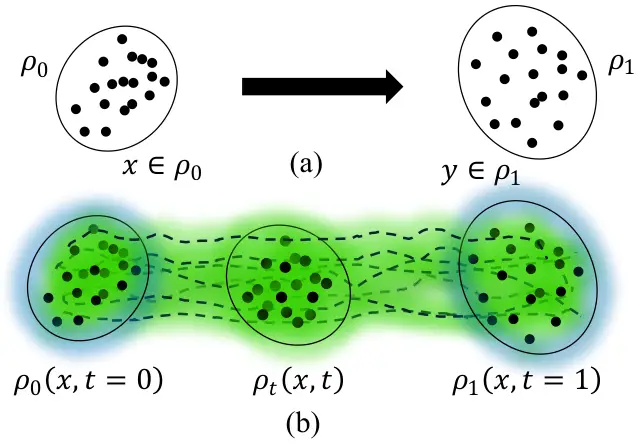

Figure 7: (a) Static OT; (b) Dynamic OT, distribution changes along an
efficient path.

In this sense, OT can be regarded as a transport problem on a manifold
of probability distributions, endowed with a well-defined geometry. The
dynamic formulation of OT has a strong connection to fluid mechanics and
optimal control theory \[22\]. The celebrated Benamou-Brenier
formulation interprets OT as a fluid flow problem, where the goal is to
determine both the evolution of the density and the velocity field that
together transport the fluid from the initial to the final configuration
with minimal kinetic energy \[9\].

### X-A Lagrangian and Eulerian Descriptions of Fluid Dynamics

The Benamou-Brenier formulation is based directly on the principles of
fluid dynamics, incorporating both spatial and temporal structures of
mass evolution \[9\]. In fluid mechanics, two complementary modeling
viewpoints are widely used, as shown in Fig. 8:

Figure 8: Lagrangian (a) and Eularian (b) point of views for fluid
dynamics.

- •
  Lagrangian description: tracks individual particles along their
  trajectories, where each particle is initially located at position
  $`x_{0}`$ at time $`t_{0}`$.
- •
  Eulerian description: studies the evolution of physical quantities
  (density, velocity, etc.) at fixed spatial locations described by a
  velocity field $`v_{t}`$.

These two descriptions can be formally linked by a flow map $`Z_{t}(x)`$
that satisfies the differential equation:

```math
\begin{cases}\dfrac{dZ_{t}(x)}{dt}=v_{t}\left(Z_{t}(x)\right),\\
Z_{0}(x)=x,\end{cases} \tag{33}
```

where $`v_{t}`$ denotes the velocity field at time $`t`$. The flow map
induces an evolution of densities through the push-forward operation:

```math
\rho_{t}=(Z_{t})_{\#}\rho_{0}. \tag{34}
```

Hence, a time-varying velocity field generates a corresponding temporal
evolution of the density. As further illustrated in Fig. 9, intuitively,
the velocity field describes the tangent direction along each streamline
of the flow, while the set of all streamlines describes the motion of a
large population of particles.

Figure 9: Velocity as tangent directions along a particle trajectory (a)
and on streamlines of population of particles (b).

### X-B Continuity Equation in Fluid Dynamics

In fluid dynamics, mass conservation is expressed through the continuity
equation, which governs the evolution of density $`\rho_{t}(x)`$ under a
velocity field $`v_{t}(x)`$ as \[120, 106\]:

```math
\frac{\partial\rho_{t}(x)}{\partial t}+\nabla\cdot\big(\rho_{t}(x)\,v_{t}(x)\big)=0. \tag{35}
```

Here, $`\partial_{t}\rho_{t}`$ represents the rate of change in density,
while $`\nabla\cdot(\rho_{t}v_{t})`$ describes the divergence of the
mass flux generated by the velocity field. This equation enforces the
principle of mass conservation: mass is neither created nor destroyed,
but is only redistributed in space. In the context of OT, the continuity
equation acts as a constraint linking the density evolution and the
velocity field. It ensures that feasible density paths $`\rho_{t}`$
correspond to physically valid mass flows. This continuity equation
forms the basis for understanding how densities evolve under OT
processes, ensuring that the fundamental conservation laws are satisfied
throughout the dynamics which is frequently mentioned in the later
sections.

### X-C Benamou-Brenier Formulation of Dynamic OT

Based on the above introduction, the dynamic OT problem aims to find
both the density path $`(\rho_{t})_{t\in[0,1]}`$ and the velocity field
$`(v_{t})_{t\in[0,1]}`$ that transport $`\rho_{0}`$ to $`\rho_{1}`$
while minimizing the kinetic energy. The Benamou-Brenier formulation
expresses the squared Wasserstein-2 distance as the optimal value of the
following variational problem \[9, 120\]:

```math
W_{2}^{2}(\rho_{0},\rho_{1})\mathop{=}\limits^{\Delta}\min_{\rho,\,v}\left\{\int_{0}^{1}\int_{X}L\!\left(v(x,t)\right)\,\rho(x,t)\,dx\,dt\right\}, \tag{36}
```

subject to the constraints:

```math
\rho(\cdot,0)=\rho_{0},\qquad\rho(\cdot,1)=\rho_{1}, \tag{37}
```

and the continuity equation (35). A common choice for the Lagrangian is
the kinetic energy $`L(v)=\frac{1}{2}\|v\|^{2}`$. This formulation
reveals that, rather than computing a static coupling, OT with a
quadratic cost is equivalent to finding a time-varying flow of
probability densities that smoothly interpolates between the two
measures along a minimal-energy path. The optimal path $`\rho_{t}`$
serves as the geodesic between $`\rho_{0}`$ and $`\rho_{1}`$ in the
Wasserstein space.

### X-D Benamou-Brenier Formula and Gradient Flows in Wasserstein Space

The Benamou-Brenier formulation also provides a geometric interpretation
of the Wasserstein distance and plays a fundamental role in the study of
gradient flows in the Wasserstein space. For two probability measures
$`\mu_{0}`$ and $`\mu_{1}`$, the dynamic formulation expresses the
Wasserstein distance as \[105, 2, 35\]:

```math
W_{2}^{2}(\mu_{0},\mu_{1})\mathop{=}\limits^{\Delta}\int_{0}^{1}\int_{\mathcal{X}}\|\nabla\phi_{t}(x)\|^{2}\,d\rho_{t}(x)\,dt, \tag{38}
```

where $`\phi_{t}`$ is the time-dependent OT potential and
$`(\rho_{t},\nabla\phi_{t})`$ satisfy the continuity equation

```math
\frac{\partial\rho_{t}}{\partial t}+\nabla\cdot(\rho_{t}\nabla\phi_{t})=0.
```

This dynamic formulation plays a central role in modern analysis and
machine learning, enabling:

- •
  Variational formulations of diffusion equations,
- •
  Schrödinger bridge problems,
- •
  Score-based generative modeling and diffusion models,
- •
  Optimal control formulations,
- •
  Continuous-time interpolation between probability distributions.

The Benamou-Brenier perspective therefore provides not only a physically
intuitive framework for OT but also a mathematically rich foundation for
dynamic modeling on the space of probability measures which plays a
crucial role in understanding the geometry of Wasserstein spaces and
provides a variational characterization of the Wasserstein distance,
connecting it directly to OT maps and gradient flows.

## XI Transport-Based Modeling

In the Benamou-Brenier formulation of OT, the transport trajectory is
described by a deterministic differential equation whose boundary
conditions are given by the initial and terminal distributions
$`\rho_{0}`$ and $`\rho_{1}`$. A natural extension of this idea is to
ask: what if the transport trajectory itself follows a stochastic
process? This question leads to the diffusion-bridge view of OT, most
notably expressed by the Schrödinger Bridge Problem (SBP) \[73, 20,
22\].

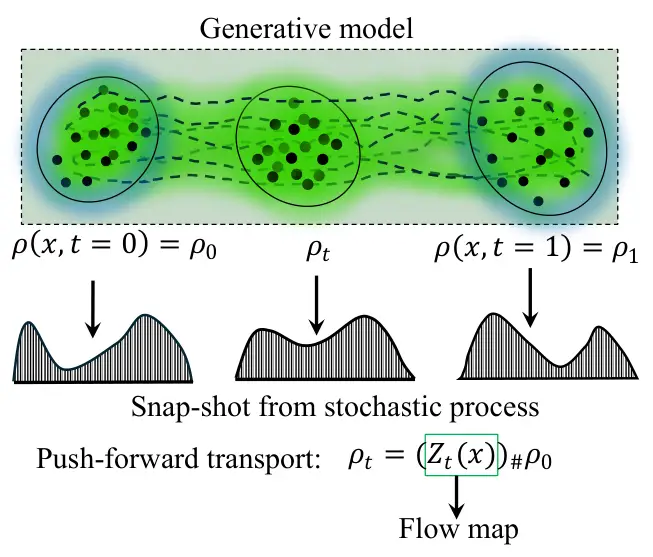

Figure 10: Transport-based modeling with a flow map.

In recent years, several generative modeling frameworks have
emerged-including diffusion models, score-based models, flow matching,
and normalizing flows that all describe transformations between
probability distributions through continuous-time dynamics. These
generative modeling frameworks can be simply described as in Fig. 10.
Observations or samples are regarded as snap-shots from different
distributions along time evolution $`\rho_{t}`$. Although their
algorithmic motivations differ, these approaches share a unified
structure: each specifies a transport mechanism (deterministic or
stochastic) that maps a source distribution to a target distribution
under suitable constraints. From this perspective, they can be
collectively viewed as transport-based modeling under a unified
stochastic differential equation (SDE) framework.

In this section, we introduce the key theoretical foundations underlying
these connections, beginning with the Schrödinger Bridge and diffusion
bridges, followed by SDE-based diffusion models and flow-matching
methods, and concluding with a transfer-operator perspective that
further unifies these viewpoints.

### XI-A Schrödinger Bridge Problem and Diffusion Bridges

The SBP is the most classical and influential example of a diffusion
bridge. Originally studied by Schrödinger in 1931-1932, the problem asks
for the most likely evolution of a cloud of particles observed at two
time points, with prescribed initial and terminal marginals. In modern
terms, the SBP seeks a probability law on the space of stochastic paths
that: (i) matches the two marginals, and (ii) is closest in relative
entropy to a given reference process. In Schrödinger’s original setting,
this reference was the standard Brownian motion. Formally, let
$`P_{0:T}`$ be the probability law of the reference process. The SBP
seeks a path measure $`Q_{0:T}`$ that satisfies the marginal constraints
$`Q_{0}=\rho_{0}`$ and $`Q_{T}=\rho_{1}`$ and minimizes the
KL-divergence \[22\]:

```math
Q_{0:T}^{\ast}:\mathop{=}\limits^{\Delta}\arg\min_{Q_{0:T}:Q_{0}=\rho_{0},\;Q_{T}=\rho_{1}}\mathrm{KL}(Q_{0:T}\,\|\,P_{0:T}). \tag{39}
```

Intuitively, the SBP constructs a stochastic “bridge” between the two
distributions by perturbing the reference process as little as possible
while still matching the desired marginals. Thus, SBP can be interpreted
as a stochastic analog of OT, where randomness is explicitly
incorporated through diffusion.

#### XI-A1 Reference Process in Schrödinger Bridge

Let the reference process be an Itô diffusion:

```math
dX_{t}=f(X_{t},t)\,dt+g(X_{t},t)\,dW_{t}, \tag{40}
```

where $`f(X_{t},t)`$ is a drift term, $`g(X_{t},t)`$ denotes diffusion
coefficient, and $`W_{t}`$ is a Wiener process. The SBP seeks an
alternative process $`\mathbb{Q}`$, absolutely continuous with respect
to the reference law $`\mathbb{P}`$, that minimizes:

```math
\inf_{\mathbb{Q}}\mathbb{E}_{\mathbb{Q}}\left[\log\frac{d\mathbb{Q}}{d\mathbb{P}}\right], \tag{41}
```

subject to

```math
\mathbb{Q}(X_{0})=P_{0},\qquad\mathbb{Q}(X_{T})=P_{T}.
```

From the viewpoint of stochastic optimal control, this minimization
induces a controlled SDE:

```math
dX_{t}=f(X_{t},t)\,dt+g(X_{t},t)\,dW_{t}+u(X_{t},t)\,dt, \tag{42}
```

where the control $`u`$ is the drift adjustment required to satisfy the
marginal constraints and minimize the relative entropy. This structure
yields a dynamic programming equation closely related to the
Monge-Ampère equation in deterministic OT \[17\].

#### XI-A2 Connection Between Static OT and SBP via KL-Divergence

Consider the entropy-regularized OT (entropic OT) problem defined as
(this will be further discussed in section XII-A for fast computational
algorithms):

```math
\min_{\gamma\in\Pi(\mu,\nu)}\left\{\int c(x,y)\,d\gamma(x,y)\;-\;\lambda\,H(\gamma)\right\}, \tag{43}
```

where $`H(\gamma)=-\!\int\gamma\log\gamma`$ is Shannon entropy of
transport plans. With re-arrangements, the entropic OT becomes:

```math
\min_{\gamma\in\Pi(\mu,\nu)}\lambda\,\mathrm{KL}\!\big(\gamma\;\|\;e^{-\tfrac{1}{\lambda}C}\big). \tag{44}
```

Thus, entropic OT is also a KL projection onto couplings, with the Gibbs
kernel $`e^{-\tfrac{1}{\lambda}C}`$ playing the role of a reference
measure. Comparing this with the SBP’s KL projection onto a path measure
$`Q_{0:T}`$ in Eq. (39) reveals a deep equivalence: SBP is the dynamic
version of entropy-regularized OT \[73\]. This analogy forms the basis
of many modern computational algorithms that unify SBP and entropic OT,
enabling tractable approximations of OT in high-dimensional spaces.

#### XI-A3 Connection Between Dynamic OT and SBP via SDEs

A general stochastic process is given by the Itô SDE as in Eq. (40), if
$`g=0`$, the dynamics reduce to a deterministic ODE and correspond to
the Benamou-Brenier formulation of OT. If only the diffusion term is
present (as in Brownian motion), the dynamics describe the original SBP.
In the general controlled-SDE form, SBP can also be expressed as the
minimization of drift energy \[20, 22\]:

```math
\min_{f\in\mathcal{U}}\mathbb{E}\left[\int_{0}^{T}\frac{1}{2}\|f(X_{t},t)\|^{2}\,dt\right], \tag{45}
```

subject to the marginal constraints

```math
X_{0}\sim P_{0},\qquad X_{T}\sim P_{T}.
```

Through the Fokker-Planck equation, these Lagrangian (path-space)
formulations have Eulerian (density-space) counterparts. This connection
places OT, SBP, and SDEs within a unified framework of stochastic
optimal control \[22\].

### XI-B Stochastic Differential Equations and Diffusion Models

In physics and applied mathematics, a fundamental question is how to
model interacting particles and describe their temporal evolution. Such
systems often exhibit both deterministic trends and random fluctuations,
motivating a probabilistic formulation of dynamics. SDEs provide a
natural and expressive framework for modeling these behaviors, where
particle ensembles evolve as probability distributions that change
continuously over time. The SDEs describe the evolution of a stochastic
process $`X_{t}`$ with dynamics of the form formulated in Eq. (40) with
two terms $`f`$ is the drift field, $`g`$ is the diffusion coefficient,
where $`\mathrm{d}W_{t}`$ denotes a Wiener process. These two terms
correspond respectively to deterministic flow and random perturbations.
The associated evolution of probability densities is governed by the
Fokker-Planck equation (FPE) \[106\]:

```math
\frac{\partial\rho_{t}(x)}{\partial t}=-\nabla\cdot(f_{t}(x)\rho_{t}(x))+\frac{1}{2}\nabla\cdot\nabla\!\left(D_{ij}(x,t)\rho_{t}(x)\right), \tag{46}
```

where $`D_{ij}(x,t)=[g_{t}(x)g_{t}^{\top}(x)]_{ij}`$. When the diffusion
term is spatially independent $`g_{t}(x)=\sigma(t)`$, the equation
reduces to:

```math
\frac{\partial\rho_{t}(x)}{\partial t}+\nabla\cdot(f_{t}(x)\rho_{t}(x))=\frac{\sigma^{2}(t)}{2}\Delta\rho_{t}(x). \tag{47}
```

This equation describes how the probability density function evolves
over time as a result of the combined effects of drift and diffusion in
the stochastic process. The term $`\nabla\cdot(f_{t}(x)\rho_{t}(x))`$
represents the drift-induced transport of probability density, while
$`\frac{{\sigma^{2}(t)}}{2}\Delta\rho_{t}(x)`$ accounts for the spread
of the diffusion of the density. In the stochastic process, if the drift
term is zero, i.e., no drift field, the FPE follows the diffusion
process only. If the drift term is not zero, the probability density
will shift from their original positions as well with diffusion.
Therefore, in a SDE, it can manipulate complex probability density
changes with controlling the drift and diffusion terms. That is why it
is convenient to use SDEs for generative modeling in machine learning.

The FPE, also known as the Kolmogorov forward equation, in the context
of OT theory, plays a crucial role in describing the evolution of
probability densities associated with stochastic processes underlying OT
problems. OT theory provides a natural framework to study how
probability distributions $`\mu_{t}`$ evolve under SDEs. The Wasserstein
distance $`W_{p}(\mu_{t},\nu_{t})`$ between two distributions
$`\mu_{t}`$ and $`\nu_{t}`$ quantifies the minimum cost of transforming
$`\mu_{t}`$ into $`\nu_{t}`$. This connection is essential because OT
seeks to find the most efficient way to transport one probability
distribution to another, and stochastic processes described by such
equations naturally arise in this context. The FPE thus provides a
mathematical framework for analyzing the evolution of probability
distributions and their relation to OT problems.

Modern diffusion-based generative models leverage SDEs to construct a
forward noising process and a learned reverse process. The forward SDE
gradually perturbs the data $`\mathbf{x}_{0}\sim p(\mathbf{x})`$
(usually the original data distribution) into a simple Gaussian
distribution over time $`T`$. The reverse-time SDE reconstructs the data
by denoising \[4, 115\]:

```math
\mathrm{d}\mathbf{x}_{t}=\left[f(\mathbf{x}_{t},t)-g(t)^{2}\nabla_{\mathbf{x}_{t}}\log p_{t}(\mathbf{x}_{t})\right]\mathrm{d}t+g(t)\,\mathrm{d}\mathbf{w}_{t}. \tag{48}
```

Here, $`p_{t}(\mathbf{x}_{t})`$ is the marginal distribution of
$`\mathbf{x}_{t}`$ at time $`t`$,
$`\nabla_{\mathbf{x}}\log p(\mathbf{x})`$ is a score function, the
gradient of the log-density of data distribution. The training objective
is often formulated as a variational bound on the negative
log-likelihood, which can be optimized using stochastic gradient descent
\[114, 115\]. However, these methods can be computationally expensive
and may struggle with high-dimensional data. Neural score matching
addresses these challenges by directly learning the score function using
a neural network \[54, 55, 115, 80, 50\]. This approach leverages the
expressive power of neural networks to model the score function across
various noise levels, allowing more accurate and efficient data
generation. The core idea behind neural score matching is to train a
neural network $`\mathbf{s}_{\theta}(\mathbf{x},t)`$ to approximate the
score function $`\nabla_{\mathbf{x}}\log p_{t}(\mathbf{x})`$ at each
time step $`t`$. Given a data set $`\{\mathbf{x}_{i}\}_{i=1}^{N}`$, the
training objective is to minimize the score matching loss defined as:

```math
\mathcal{L}(\theta)=\mathbb{E}_{{}_{\scriptstyle t\sim\mathcal{U}(0,T)\hfill\atop{\scriptstyle{\bf x}_{0}\sim p_{0}({\bf x}_{0})\hfill\atop\scriptstyle{\bf x}_{t}\sim p_{t}({\bf x}_{t}|{\bf x}_{0})\hfill}}}\left[{w(t)|{\bf s}_{\theta}({\bf x}_{t},t)-\nabla_{{\bf x}_{t}}\log p_{t}({\bf x}_{t}|{\bf x}_{0})|^{2}}\right], \tag{49}
```

where $`w(t)`$ is a weighting function that can be tuned to emphasize
different levels of noise during training, and
$`p_{t}(\mathbf{x}_{t}\mid\mathbf{x}_{0})`$ denotes the distribution of
noisy data at time $`t`$ conditioned on the original data
$`\mathbf{x}_{0}`$, $`t`$ belongs to a uniform distribution in the
interval as $`t\sim\mathcal{U}(0,T)`$. In practice, the true score
function
$`\nabla_{\mathbf{x}_{t}}\log p_{t}(\mathbf{x}_{t}\mid\mathbf{x}_{0})`$
is intractable. Instead, it can be estimated by adding Gaussian noise to
the data and using the score matching objective to learn a close
approximation. Once trained, this network can be used to perform
denoising at each time step, effectively reversing the diffusion process
\[115, 49\].

### XI-C Normalizing Flow and Flow Matching

Flow matching provides a simulation-free alternative to SDE-based
generative models developed from the idea of simplified normalizing
flow. When the diffusion term in the FPE (Eq.47) is zero, the density
evolution reduces to the continuity equation corresponding to an
ordinary differential equation (ODE):

```math
\frac{{dZ_{t}\left(x\right)}}{{dt}}=v_{t}\left({Z_{t}\left(x\right)}\right), \tag{50}
```

where $`Z_{t}`$ is a transport field or flow map generated by the ODE
with $`v_{t}(\cdot)`$ as its velocity field. The evolution of the
associated density is given by the change-of-variables formula as in a
normalizing flow \[79, 80, 50\]:

```math
\rho_{t}(x)=\rho_{0}\!\left(Z_{t}^{-1}(x)\right)\det\!\left(\frac{\partial Z_{t}^{-1}}{\partial x}\right). \tag{51}
```

In flow matching and normalizing flow models, the goal is to learn a
parameterized velocity field:

```math
v_{t}(Z_{t}(x))\ \rightarrow\ v_{t}(Z_{t}(x);\theta),
```

such that pushing forward a simple base distribution (e.g., a Gaussian)
along the learned flow produces a complex target distribution
$`\rho_{t}(x)`$, and learning model parameters with maximizing negative
log-likelihood of parameterized $`\rho_{t}(x;\theta)`$. This viewpoint
unifies several key concepts as shown in Fig. 11.

Figure 11: Unified concepts in flow mapping via ODEs.

As shown in this figure, the velocity field governs the evolution of
particles through an ODE, the flow map-solution of the ODE, pushing
forward probability mass, continuity equation links density evolution
and the velocity field. The push-forward operator maps the initial
densities to the future densities. Other transport-based methods can be
understood as instances of ODE/SDE-driven probabilistic transport
\[21\], for example, Diffusion Probabilistic Model (DPM), Denoising
Diffusion Probabilistic Model (DDPM) \[49\], Continuous Normalizing Flow
(CNF) \[62\], Conditional Flow Matching (CFM) \[79\], Rectified Flow
Matching (RFM) \[82\], etc., all share common tasks or purposes, and can
be explicitly unified as in Fig. 12. From this figure, we could figure
out the relationship between different generative model frameworks
proposed in recent years, as well as their relationship with OT \[65,
118, 82, 33\].

Figure 12: Unified concepts with diffusion and flow matching models via
SDEs/ODEs.

### XI-D Transfer Operator Perspective

In the previous subsections, dynamics was described via SDEs or ODEs,
which require knowledge of drift and diffusion terms. An alternative
viewpoint uses transfer operators with the mathematical insight that a
dynamic system intrinsically determined by a differential equation even
with complex nonlinearity might correspond to a linear operator, i.e.,
the Koopman operator, which characterizes system evolution without
explicitly referencing the underlying governing equations. The idea is
illustrated in Fig. 13.

Figure 13: Transfer operator point of view for state dynamics.

The evolution of the state $`X_{t}\in\mathbb{R}^{n}`$ under nonlinear
dynamics $`\Psi:\mathbb{R}^{n}\to\mathbb{R}^{n}`$ is formulated as:

```math
X_{t+1}=\Psi\left({X_{t}}\right). \tag{52}
```

For a space of measurement or observable functions defined as
$`\mathcal{G}:=\left\{{F:\mathbb{R}^{n}\to\mathbb{R}}\right\}`$, where
the element of the real-valued measurement function is
$`Y=F\left(X\right)`$ taking values in the state space, the Koopman
operator (composition operator) $`K_{\Psi}:\mathcal{G}\to\mathcal{G}`$
is defined as \[16\]:

```math
K_{\Psi}F:=F\circ\Psi. \tag{53}
```

By this Koopman operator, the evolution of dynamics in the whole lifting
space (an infinite-dimensional space of the collection of observable
functions) is linearly represented as:

```math
Y_{t+1}=K_{\Psi}Y_{t}. \tag{54}
```

That is to say, the Koopman operator captures the evolution of
observables under nonlinear dynamics through a linear
infinite-dimensional operator, and it is defined as the composition of
observable with the flow induced by the dynamic system (in practice,
Koopman operator can be approximated by a finite-dimensional matrix with
data-driven based algorithms, e.g., Extended Dynamic Mode Decomposition
(EDMD) algorithm \[129\]). A much more clear explanation is shown in the
bottom panel of Fig. 13 where the nonlinear dynamics could be analyzed
in a linear space with the Koopman operator acting on scalar-valued
functions driven based on the dynamics rather than on the original
states. The adjoint of the Koopeman operator, the Perron-Frobenius
operator, describes the evolution of probability densities with
uncertainty of the initial condition through the propagation of a
dynamic system \[71\]. It induces a measure-preserving transform of a
probability density as a push-forward map. This viewpoint connects
naturally to OT and SDE dynamics: the Perron-Frobenius operator
corresponds to density evolution (Eulerian point of view), the Koopman
operator corresponds to observable evolution (Lagrangian point of view),
the FPE is a PDE representation of the same evolution, and SBP and
entropic OT correspond to KL projections of path or density evolution.
Thus, OT, SBP, SDE-based generative models, and transfer-operator
approaches fit within a common theoretical framework for modeling the
transport and evolution of probability distributions. In summary,
optimal transport, diffusion processes, and transfer-operator analysis
form a coherent theoretical framework that connects probability flows,
stochastic control, and generative modeling via analysis of SDEs which
is an exciting field for further exploration.

## XII Computational Algorithms for Optimal Transport

The practical applications of OT in engineering, machine learning, and
data science require efficient numerical algorithms. Classical OT
formulations lead to large-scale linear programs, whose computational
cost can be prohibitive for modern datasets. We first recall that the
discrete Kantorovich OT problem is a linear program. Thus, many
classical LP solvers can be directly applied, for example:

- •
  Network Simplex Method: A variant of the simplex algorithm tailored
  for network flow, effective for medium-scale OT problems.
- •
  Interior Point Methods: Algorithms that traverse the interior of the
  feasible polytope, providing strong theoretical guaranties for solving
  large-scale LP problems.
- •
  Classical Simplex Solvers: Applicable but often prohibitively slow for
  dense OT matrices of large size.

Although theoretically sound, these methods scale poorly: the cost of
solving a $`n\times n`$ OT problem is typically $`O(n^{3})`$ \[101\],
which historically limited the use of OT in large-scale machine
learning. During the past decade, significant progress has been made in
designing fast, scalable OT solvers, which has greatly accelerated the
adoption of OT in machine learning, graphics, geometry processing,
domain adaptation, scalable OT, Wasserstein GANs, and statistical
modeling. Many researchers and studies have contributed foundational
algorithms and open-source tools that made OT widely usable in practice
\[101, 58\]. Among them, a major breakthrough came in 2013 when Cuturi
introduced entropy-regularized OT and the Sinkhorn algorithm \[112, 28,
56\]. This approach dramatically reduces computational cost and is often
referred to as “optimal transport at light speed” \[28\]. Since then,
entropic OT has become one of the most widely used computational
algorithms. First, let us introduce the concept of entropy-regularized
OT.

### XII-A Sinkhorn Algorithm for Entropy-Regularized OT

Given probability measures $`\mu`$ and $`\nu`$ in spaces $`X`$ and
$`Y`$, with transport plans $`\gamma\in\Pi(\mu,\nu)`$, the OT plan based
on the entropy-regularized OT problem (EOT) is defined as follows:

```math
\gamma^{\ast}\mathop{=}\limits^{\Delta}\arg\min_{\gamma\in\Pi(\mu,\nu)}\left\{\int c(x,y)\,d\gamma(x,y)-\lambda\,H(\gamma)\right\}. \tag{55}
```

Here $`H(\gamma)`$ is the Shannon entropy defined as:

```math
H(\gamma)=-\int\gamma(x,y)\log\gamma(x,y)\,dx\,dy. \tag{56}
```

Equivalently, it can be expressed using the KL-divergence:

```math
\gamma^{\ast}\mathop{=}\limits^{\Delta}\arg\min_{\gamma\in\Pi(\mu,\nu)}\left\{\langle\gamma,C\rangle+\lambda\,\mathrm{KL}(\gamma\mid\mu\otimes\nu)\right\}, \tag{57}
```

where the KL-divergence $`\mathrm{KL}(\gamma|\mu\otimes\nu)`$ is defined
as:

```math
\mathrm{KL}(\gamma|\mu\otimes\nu)\mathop{=}\limits^{\Delta}\int_{X\times Y}\gamma(x,y)\log\left(\frac{\gamma(x,y)}{\mu(x)\nu(y)}\right)\,dx\,dy. \tag{58}
```

The Sinkhorn algorithm is a powerful method for efficiently computing
approximate solutions to the entropy-regularized OT problem. This
formulation introduces an entropy term to the traditional OT cost
function, promoting sparsity and numerical stability in large-scale
applications \[28\]. For the discrete case in real implementation, the
formulation is given:

- •
  Two discrete measures $`\mu=\sum_{i=1}^{m}a_{i}\delta_{x_{i}}`$ and
  $`\nu=\sum_{j=1}^{n}b_{j}\delta_{y_{j}}`$ with positive masses
  $`a_{i}`$ and $`b_{j}`$, and locations $`x_{i}`$ and $`y_{j}`$.
- •
  Cost matrix $`C`$ where $`C_{ij}=c(x_{i},y_{j})`$, representing
  pairwise transportation costs.
- •
  Regularization parameter $`\lambda>0`$ to control the regularization
  strength of the entropy.

The EOT problem becomes:

```math
\mathrm{EOT}_{\lambda}(\mu,\nu)\mathop{=}\limits^{\Delta}\min_{\gamma\in\Pi(\mu,\nu)}\left(\langle\gamma,C\rangle-\lambda H(\gamma)\right), \tag{59}
```

where $`H(\gamma)=-\sum_{ij}\gamma_{ij}(\log\gamma_{ij}-1)`$. With
defining the Gibbs kernel as:

```math
{\bf K}=e^{-C/\lambda},
```

the Sinkhorn algorithm alternates between row and column
scaling/normalization:

```math
{\bf u}^{(k+1)}=\frac{\bf a}{{\bf K}{\bf v}^{(k)}},\qquad{\bf v}^{(k+1)}=\frac{\bf b}{{\bf K}^{\top}{\bf u}^{(k+1)}}, \tag{60}
```

where $`{\bf a}=\left[{a_{1},a_{1},\ldots a_{m}}\right]`$ and
$`{\bf b}=\left[{b_{1},b_{1},\ldots b_{n}}\right]`$ are the marginal
weight coefficients defined on sample locations in $`X`$ and $`Y`$. The
transport plan is then obtained as:

```math
\gamma^{\ast}=\mathrm{diag}({\bf u}){\bf K}\mathrm{diag}({\bf v}), \tag{61}
```

where $`{{\bf u}}`$ and $`{{\bf v}}`$ are two scaling (or
re-normalization) vectors. This procedure is equivalent to performing
iterated Bregman projections onto the marginal constraints. Sinkhorn’s
original scaling algorithm dates back to 1964, but its use for OT was
popularized only recently due to its remarkable efficiency, stability,
and compatibility with GPU acceleration \[28, 101\]. The advantages of
this Entropy regularization are summarized as follows:

- •
  Smoothness: Entropy spreads the mass across the support, avoiding
  degeneracy.
- •
  Strict convexity: Providing a unique solution.
- •
  Stability: Prevents numerical collapse of the transport plan.
- •
  Scalability: Transforming an OT into a diagonal matrix-scaling problem
  allows fast GPU parallelization.

Many computational OT algorithms are inspired by this
Entropy-regularized OT algorithm with algorithmic variants and
improvements, including Iterative Bregman Projections (IBP) \[10\],
Bregman ADMM \[127\], IPOT(Inexact Proximal Point OT) \[131\], etc. IPOT
is particularly useful when no entropic smoothing is desired, since it
approximates the exact OT solution via proximal iterations without
requiring extremely small $`\lambda`$. Moreover, a more general
regularization of OT beyond entropy can be formulated as:

```math
\gamma^{\ast}\mathop{=}\limits^{\Delta}\arg\min_{\gamma\in\Pi(\mu,\nu)}\left\{\langle C,\gamma\rangle+\lambda\,\mathrm{Reg}(\gamma)\right\}. \tag{62}
```

Depending on the prior structure, different regularizers
$`\mathrm{Reg}(\gamma)`$ may be used, for example, Low-rank OT \[107\],
Sparse OT \[12, 83\], Laplacian-regularized OT \[36\], Group-Lasso
regularized OT \[12\], etc. Regularization lets practitioners embed
structural priors (smoothness, sparsity, geometry) into the transport
plan, enabling OT to be adapted to specific application domains. In real
applications, we need to deal with the numerical instability problem. As
Sinkhorn iterations involve exponentials and divisions, making numerical
underflow or overflow common. Stability is often improved through
log-domain Sinkhorn iterations, cost scaling, stabilization through
absorbing constants (as in log-sum-exp), GPU-friendly normalization
\[101\].

### XII-B Neural Optimal Transport

Neural Optimal Transport (Neural OT) integrates deep learning with OT by
parameterizing potentials or transport maps using neural networks \[94,
66, 67\], particularly with neural solver algorithms by connecting deep
network architecture with ODE \[21\]. This makes OT feasible in
high-dimensional spaces where classical solvers struggle. A common
approach parameterizes the Kantorovich potential $`\phi(x;\theta)`$ via
a neural network. Based on $`c`$-transform, the dual OT problem becomes:

```math
\max_{\phi}\left[\int\phi(x;\theta)\,d\mu(x)+\int\phi^{c}(y;\theta)\,d\nu(y)\right], \tag{63}
```

where the $`c`$-transform is defined as (refer to the dual property of
OT in section VI):

```math
\phi^{c}(y;\theta)\mathop{=}\limits^{\Delta}\sup_{x\in X}\left(c(x,y)-\phi(x;\theta)\right). \tag{64}
```

Neural networks allow flexible, high-capacity approximations of optimal
potentials. For the quadratic cost $`c(x,y)=\frac{1}{2}\|x-y\|^{2}`$,
based on Brenier’s theorem: the optimal Kantorovich potential is convex,
the optimal OT map is the gradient of this potential. Thus, neural OT
often parameterizes $`f(x;\theta)`$ as an ICNN \[3, 94\]:

```math
\inf_{f\in\mathrm{cvx}(X)}\left[\int f(x;\theta)\,d\mu(x)+\int f^{*}(y;\theta)\,d\nu(y)\right], \tag{65}
```

where the convex conjugate $`f^{*}(y;\theta)`$ is defined as:

```math
f^{*}(y;\theta)\mathop{=}\limits^{\Delta}\sup_{x}\left(\langle x,y\rangle-f(x;\theta)\right). \tag{66}
```

The primal OT formulation is the following.

```math
\inf_{\gamma\in\Pi(\mu,\nu)}\int\frac{1}{2}\|x-y\|^{2}\,d\gamma(x,y), \tag{67}
```

and the dual formulation connects directly to the neural
parameterization above. Neural OT methods therefore provide scalable
tools for Wasserstein distance estimation, generative modeling, domain
adaptation, barycenter computation, and gradient-based optimization in
OT geometry.

## XIII Applications of optimal transport in speech

This section provides a comprehensive review of how OT has been applied
in modern speech-processing tasks. We first explain the use of OT in
speech signal processing with reference to its applications in machine
learning, where the applications can be broadly categorized into two
paradigms: (i) employing OT as a loss function to guide model training
and (ii) using OT for domain adaptation or distribution alignment.
Following this, we present a series of successful applications that
illustrate the effectiveness of OT in real-world scenarios. These
include cross-domain and multi-modal speech enhancement \[77, 52\],
cross-domain speaker and language recognition \[87, 133, 122, 136\],
cross-corpus or cross-language emotion recognition \[135\],
domain-adaptive audio spoof detection \[134, 138\], and cross-modal
knowledge transfer for ASR \[88, 86, 89, 90\]. Finally, we discuss
emerging research trends and potential future directions, highlighting
how OT may continue to advance speech processing in increasingly
complex, multi-domain, and multi-modal environments.

### XIII-A Recall of OT for Machine Learning

In machine learning, many problems can be viewed through the lens of
three fundamental operations: (i) estimating distributions from observed
data, (ii) sampling from these distributions, and (iii) transforming or
manipulating one distribution into another. OT is particularly relevant
to the third operation. For example, as illustrated in Fig. 14, given
observations from two distributions $`\rho_{0}`$ and $`\rho_{1}`$, how
can we evaluate their similarity either for classification or generation
tasks.

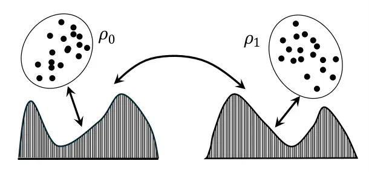

Figure 14: Distance measure and transform between distributions.

It provides both a principled geometric measure of discrepancy between
probability distributions and a framework for constructing transport
maps or interpolation paths between them. Because of this, OT shares
conceptual similarity with a wide class of generative modeling
techniques whose goal is to transform one distribution into another.
Examples include Generative Adversarial Networks (GANs) \[41\],
Variational Autoencoders (VAEs) \[60, 61\], normalizing flows \[62,
100\], diffusion models \[49\], diffusion Schrödinger bridges \[14,
110\], and flow matching approaches \[79\]. OT provides a geometrically
grounded alternative or complement to these methods.

In speech signal processing, the use of OT typically falls into two
major categories: OT as a loss function within the learning objective
and OT as a discrepancy metric for cross-domain or modality knowledge
transfer and adaptation. Traditional loss functions, such as sample-wise
metrics (e.g., Mean Square Error (MSE), Mean Absolute Error (MAE), or
task-specific measures, like Signal-to-Noise Ratio (SNR) and
Signal-to-Distortion Ratio (SDR), do not explicitly consider the
geometry of the underlying data distributions. In the following
subsection, we highlight the advantages of incorporating OT into
learning objectives.

### XIII-B Conventional Loss Functions vs. OT-Based Losses

A central objective in machine learning is to quantify the degree to
which the predicted distribution deviates from the true data
distribution. Conventional losses such as Cross-Entropy (CE),
KL-divergence, and Jensen–Shannon (JS)-divergence are widely used, but
they often fail to account for geometric relationships between target
outcomes. For example, misclassifying a car as a truck incurs the same
penalty as misclassifying a car as a dog (as illustrated in Fig. 15),
although the former error is semantically and geometrically much closer.

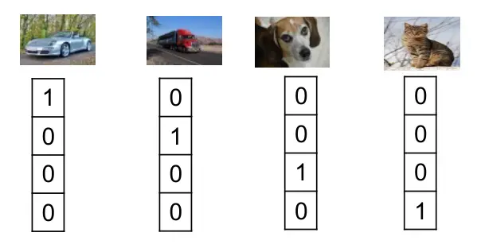

Figure 15: Equal distance between different categories (no information
of category geometric relationship).

A key advantage of OT is that it incorporates the geometry of the sample
space directly into the loss function as illustrated in Fig. 16.

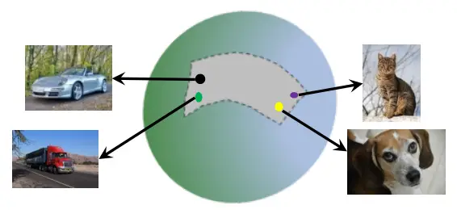

Figure 16: Geodesic distance in Wasserstein space.

Wasserstein distances, for example, compute the minimal cost of
transporting mass from one distribution to another along geodesic paths
in Wasserstein space. Unlike KL-divergence or JS-divergence, which are
not true metrics and require overlapping supports, OT defines a proper
distance even when the two distributions have disjoint supports. The
well-known OT distances used in ML include the Earth Mover’s Distance
(EMD) and the Wasserstein distance. A notable example demonstrating the
value of OT in representation learning is the Word Mover’s Distance
(WMD) \[70\], which computes the similarity of the document by measuring
the minimum amount of “work” required to move embedded words from one
document to another in the word2vec space. This approach effectively
aligns semantically related words before measuring their distance,
illustrating the geometric insight that OT introduces. In speech
processing, OT can also be used as an auxiliary alignment loss. For
example, instead of relying solely on the Connectionist Temporal
Classification (CTC) loss in speech translation, OT has been added to
enforce alignment between speech and text embeddings, yielding
significant improvements \[72\].

### XIII-C Cross-Domain Adaptation and Transfer Learning

The second major application of OT in machine learning is domain
adaptation. Domain mismatch is a widespread challenge in many learning
problems. In computer vision, for example, images collected under
different lighting or camera conditions often lead to severe degradation
when models trained in one domain are applied directly to another.
Similar issues arise in speech processing tasks. In speech enhancement,
mismatches between training and testing acoustic conditions frequently
occur; in spoken language or speaker recognition, channel, language, and
environmental variations all contribute to domain shift.

#### XIII-C1 Cross-domain adaptation

In domain adaptation, we assume that labeled data are available only in
the source domain, whereas in the target domain only unlabeled data are
observed. The model trained solely on the source domain is then expected
to generalize to the target domain. Classical learning theory implicitly
assumes that training (source) and test (target) samples are drawn from
the same underlying distribution. However, as conceptually illustrated
in Fig. 17, the source and target distributions can differ
significantly. Using a classifier trained on the source domain directly
on the target domain inevitably leads to performance degradation.

Figure 17: Domain adaptation: solid vertical line denotes the
classification boundary trained on source domain data (a), while the dot
vertical line represents the classification boundary on target domain
data (b).

To mitigate this issue, unsupervised domain adaptation (UDA) seeks to
reduce the discrepancy between source and target distributions. Let the
joint distribution of features $`\mathbf{x}`$ and labels $`\mathbf{y}`$
be denoted as $`p(\mathbf{x},\mathbf{y})`$. For a joint distribution:

```math
p(\mathbf{x},\mathbf{y})=p(\mathbf{x})p(\mathbf{y}|\mathbf{x})=p(\mathbf{y})p(\mathbf{x}|\mathbf{y}).
```

Depending on which part of the joint distribution changes across
domains, several types of domain shift can arise (with $`p^{s}(\cdot)`$
and $`p^{s}(\cdot)`$ representing distributions in the source and target
domains, respectively) \[68\]:

Label/target shift:

```math
p^{s}(\mathbf{y})\neq p^{t}(\mathbf{y}),\quad p^{s}(\mathbf{x}|\mathbf{y})=p^{t}(\mathbf{x}|\mathbf{y}).
```

Covariate/feature shift:

```math
p^{s}(\mathbf{x})\neq p^{t}(\mathbf{x}),\quad p^{s}(\mathbf{y}|\mathbf{x})=p^{t}(\mathbf{y}|\mathbf{x}).
```

Concept shift:

```math
p^{s}(\mathbf{y}|\mathbf{x})\neq p^{t}(\mathbf{y}|\mathbf{x}),\quad p^{s}(\mathbf{x})=p^{t}(\mathbf{x}).
```

Conditional shift:

```math
p^{s}(\mathbf{x}|\mathbf{y})\neq p^{t}(\mathbf{x}|\mathbf{y}),\quad p^{s}(\mathbf{y})=p^{t}(\mathbf{y}).
```

Conditional-target shift:

```math
p^{s}(\mathbf{x}|\mathbf{y})\neq p^{t}(\mathbf{x}|\mathbf{y}),\quad p^{s}(\mathbf{y})\neq p^{t}(\mathbf{y}).
```

OT provides a rigorous foundation for mitigating these types of shifts.
Let the source and target domains be associated with probability
measures $`\mu_{s}`$ and $`\mu_{t}`$, respectively, and for samples from
the source and target domains $`x_{s}\in X_{s}`$, $`x_{t}\in X_{t}`$,
let $`c(x_{s},x_{t})`$ be a cost function measuring sample
dissimilarity. OT seeks a transport plan $`\gamma`$ minimizing the total
transportation cost:

```math
\inf_{\gamma\in\Pi(\mu_{s},\mu_{t})}\int_{X_{s}\times X_{t}}c(x_{s},x_{t})\,d\gamma(x_{s},x_{t}), \tag{68}
```

where $`\Pi(\mu_{s},\mu_{t})`$ is the set of couplings with the
prescribed marginals. The resulting transport plan or map can be used
for:

- •
  Feature alignment: mapping features from the source to the target
  domain.
- •
  Instance reweighting: assigning importance weights to source samples
  to match target distribution.
- •
  Model adaptation: transformation of decision boundaries according to
  the aligned feature space.

OT offers several advantages for domain adaptation: (1) it provides a
mathematically principled discrepancy measure; (2) it incorporates
geometric structure of distributions; (3) it accommodates distributions
with partially overlapping support. However, challenges remain,
including computational cost, sensitivity to outliers, and the need to
select an appropriate cost function. Among the most influential works is
the OT-based domain adaptation pipeline proposed in \[26\]. The method
consists of three steps: (i) estimate the OT plan $`T(\cdot)`$ between
the source and target distributions; (ii) transport the labeled source
samples to the target domain; (iii) train a classifier in the
transformed space with labels preserved as:

```math
p^{s}(y|x^{s})=p^{t}(y|T(x^{s})). \tag{69}
```

#### XIII-C2 Domain adaptation in the deep learning framework

In deep learning, a model can be viewed as the composition of a feature
extractor and a classifier formulated as:

```math
y\left({\bf x}\right)=f\left({{\bf x};\theta_{f_{\rm c}},\theta_{f_{{\rm fea}}}}\right)=f_{\rm c}\circ f_{{\rm fea}}\left({\bf x}\right), \tag{70}
```

where $`f_{{\rm fea}}:\mathcal{X}\to\mathcal{Z}`$ extracts latent
features $`\mathbf{z}=f_{{\rm fea}}(\mathbf{x})`$, and
$`f_{\rm c}:\mathcal{Z}\to\mathcal{Y}`$ maps the features to the label
probabilities, where $`\theta_{f_{\rm c}}`$ and
$`\theta_{f_{{\rm fea}}}`$ are their corresponding model parameters.
Domain adaptation typically aims to find a latent space where the joint
distributions align:

```math
p^{s}(\mathbf{z},\mathbf{y})\approx p^{t}(\mathbf{z},\mathbf{y}), \tag{71}
```

where

```math
p^{m}(\mathbf{z},\mathbf{y})=p^{m}(\mathbf{y}|\mathbf{z})\,p^{m}(\mathbf{z}), \tag{72}
```

with $`m\in\{s,t\}`$ belongs to the source or target domains. The
expected risk in the target domain satisfies \[25, 81, 68\]:

```math
R^{t}(f)\leq R^{s}(f)+L_{f_{{\rm fea}}}(p^{s}_{\mathbf{z}},p^{t}_{\mathbf{z}})+R_{\mathbf{y}}, \tag{73}
```

where $`L_{f_{{\rm fea}}}`$ measures the distribution discrepancy in the
latent space, and $`R_{\mathbf{y}}`$ reflects the mismatch of labeling
functions. Most studies aim to reduce this upper bound by minimizing
both the source-domain classification error and the distribution
discrepancy.

### XIII-D Domain-Invariant Representation Learning

The goal of domain-invariant representation learning is to discover a
latent space where feature distributions of source and target domains
become similar. There are two families of approaches: discrepancy-based
methods and adversarial learning-based methods.

#### XIII-D1 Minimizing distribution discrepancy

In this framework, the model parameters are obtained by minimizing:

```math
L(\theta_{f_{{\rm fea}}},\theta_{f_{\rm c}})\mathop{=}\limits^{\Delta}\sum_{i}L_{\mathrm{CE}}^{s}(\mathbf{y}_{i}^{s},\hat{\mathbf{y}}_{i}^{s})+\lambda_{\rm fea}L_{f_{{\rm fea}}}(p_{\mathbf{z}}^{s},p_{\mathbf{z}}^{t}), \tag{74}
```

where the second term aligns the feature distributions with a weighting
coefficient $`\lambda_{\rm fea}`$. The methods based on Maximum Mean
Discrepancy (MMD)-based and Central Moment Discrepancy (CMD) belong to
this category \[99, 84, 108\].

#### XIII-D2 Domain adversarial learning

Another approach uses adversarial training, where a domain discriminator
$`f_{\rm d}(\cdot)`$ (with model parameters $`\theta_{f_{\rm d}}`$)
attempts to distinguish between the source and target features, while
the feature extractor attempts to make them indistinguishable \[39\].
The objective is as follows.

```math
\begin{array}[]{l}\begin{aligned} L(\theta_{f_{{\rm fea}}},\theta_{f_{\rm c}},\theta_{f_{\rm d}})&\mathop{=}\limits^{\Delta}\sum_{i}L_{\mathrm{CE}}^{s}(\mathbf{y}_{i}^{s},\hat{\mathbf{y}}_{i}^{s})\\
&-\lambda_{\rm d}\sum_{\mathbf{z}_{i}\in\{D^{s}\cup D^{t}\}}L_{f_{\rm d}}({f_{\rm d}}(\mathbf{z}_{i}),d_{i}),\\
\end{aligned}\end{array} \tag{75}
```

with the standard min–max optimization:

```math
(\theta_{f_{{\rm fea}}}^{*},\theta_{f_{\rm c}}^{*})\mathop{=}\limits^{\Delta}\arg\min_{\theta_{f_{{\rm fea}}},\theta_{f_{\rm c}}}L,\qquad\theta_{f_{\rm d}}^{*}\mathop{=}\limits^{\Delta}\arg\max_{\theta_{f_{\rm d}}}L. \tag{76}
```

#### XIII-D3 OT-guided learning in deep neural networks

Although moment-matching and adversarial approaches can align marginal
feature distributions, they typically ignore the geometric structure of
multimodal distributions, potentially degrading class discriminability.
OT-based approaches explicitly model geometric relationships and have
shown a strong performance in domain adaptation \[26\]. Using the
Kantorovich-Rubinstein duality, the Wasserstein distance becomes
\[111\]:

```math
L_{h}(p_{\mathbf{z}}^{s},p_{\mathbf{z}}^{t})\mathop{=}\limits^{\Delta}\sup_{h\in\mathcal{L}_{\rm{lip}}}E_{\mathbf{z}\sim p_{\mathbf{z}}^{s}}[h(\mathbf{z})]-E_{\mathbf{z}\sim p_{\mathbf{z}}^{t}}[h(\mathbf{z})], \tag{77}
```

where $`h\in\mathcal{L}_{\rm{lip}}`$ means $`h`$ belongs to the set of
1-Lipschitz functions. In practice, a neural network approximates $`h`$,
and the empirical loss is:

```math
L_{\rm wd}(\mathbf{z}^{s},\mathbf{z}^{t})\mathop{=}\limits^{\Delta}\frac{1}{|D^{s}|}\sum_{\mathbf{z}_{i}\in D^{s}}h(\mathbf{z}_{i})-\frac{1}{|D^{t}|}\sum_{\mathbf{z}_{i}\in D^{t}}h(\mathbf{z}_{i}), \tag{78}
```

with a gradient penalty enforcing the Lipschitz constraint:

```math
L_{\rm grad}(\tilde{\mathbf{z}})\mathop{=}\limits^{\Delta}(\|\nabla_{\tilde{\mathbf{z}}}h(\tilde{\mathbf{z}})\|_{2}-1)^{2}.
```

The resulting min–max optimization is:

```math
L_{h}\mathop{=}\limits^{\Delta}\min_{\theta_{f_{{\rm fea}}}}\max_{\theta_{h}}L_{\rm wd}(\mathbf{z}^{s},\mathbf{z}^{t})-\alpha_{\rm lip}L_{\rm grad}(\tilde{\mathbf{z}}), \tag{79}
```

where $`\alpha_{\rm lip}`$ is the weighting coefficient, $`|D^{s}|`$ and
$`|D^{t}|`$ denote the number of samples from source and target domains.
To additionally incorporate label information, Joint Distribution OT
(JDOT) framework has been proposed which aligns both features and labels
\[27, 29\]. Inspired by JDOT, an OT-based domain adaptation model has
been proposed for cross-domain speaker/language recognition, building
upon pre-trained x-vectors, achieving strong performance \[87\] (will be
introduced in more details in section XIII-G).

A summary of the overall computational pipeline is illustrated in Fig. 18.

Figure 18: General computational framework with an OT embedding layer.

As shown in this figure, there are two loss objectives to be estimated,
one is the source classification loss, and the other is domain feature
distribution discrepancy loss. The OT part is a layer in the forward
estimation. The Sinkhorn layer is used to estimate the optimal coupling
or plan, and then multiply with Cost matrix to obtain the domain
discrepancy loss. In the back propagation step, there is no parameter
updated in this OT layer, that is, the back propagation jump to the
front layers for feature representation learning.

### XIII-E OT for Speech enhancement

Speech enhancement (SE) aims to transform distorted or noisy speech to
clean ones. Deep learning-based model frameworks for SE try to estimate
the transform function with a large quantity of noisy-clean speech
pairs, and use the learned transform function for SE in various test
conditions. In real application, there is a mismatch between training
and testing conditions which results in degraded performance.
Cross-domain adaptation techniques are usually applied to mitigate
domain-gaps. Moreover, conventional learning frameworks only try to
learn the SE transform function from acoustic signal aspect, while
linguistic or semantic information, another modality of speech besides
acoustic aspect, should play an important role in speech intelligibility
or understanding in adversarial environments. Therefore, cross-modal
knowledge transfer during the SE transform function learning should be
considered, particularly when many pretrained large language models
encoding linguistic or semantic knowledge have already been available.
In both cases, OT takes a suitable position in designing loss function
or as a measure of domain/modal discrepancy measurement.

#### XIII-E1 Wasserstein distance-based Phone-Fortified Perceptual Loss for SE

Traditionally, deep learning-based SE is formulated as a
sample-to-sample mapping regression task, i.e., transforming a noisy
sample into a clean instance. On the other hand, OT formulates the SE as
a distribution mapping task, i.e., transforming the distribution of
noisy speech signal to a clean one. We may combine these two types of
mapping process to achieve better enhancement performance. Based on this
consideration, a learning framework has been proposed and explained in
Fig. 19 \[52\].

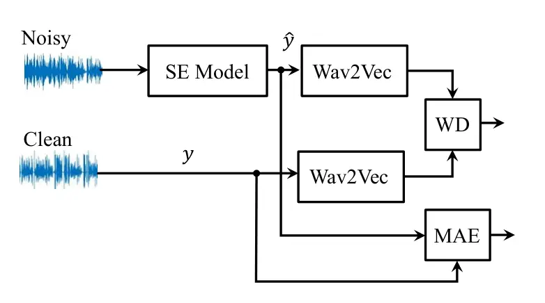

Figure 19: SE model framework enhanced with Phone-Fortified Perceptual
Loss (PFPL) in a transformed latent space, WD: Wasserstein distance,
MAE: mean absolute error.

In this figure, ‘wav2vec’ is a pretrained model block \[7\]. This block
is used to explore latent space which is supposed to encode rich
phonetic and semantic information for speech intelligibility. A loss
function shown in this figure ‘WD’, Kantorovich-Rubinstein dual form of
W-distance is specially designed as:

```math
L_{{\rm WD}}\mathop{=}\limits^{\Delta}\mathop{\sup}\limits_{\left\|h\right\|_{L}\leq 1}E_{z\sim\mu}\left[{h(z)}\right]-E_{\hat{z}\sim\nu}\left[{h(\hat{z})}\right], \tag{80}
```

where $`z=\phi_{{\rm wav2vec}}(y)`$,
$`\hat{z}=\phi_{{\rm wav2vec}}(\hat{y})`$, and
$`\phi_{{\rm wav2vec}}(\cdot)`$ is a transform function of the wav2vec
block, function $`h(\cdot)`$ belongs to a set of all 1-Lipschitz
functions. The conventional MAE loss is defined as:

```math
L_{{\rm MAE}}\mathop{=}\limits^{\Delta}||y-\hat{y}||_{1}. \tag{81}
```

The proposed Phone-Fortified Perceptual Loss (PFPL) for SE is defined
as:

```math
L_{{\rm PFPL}}(y,\hat{y})\mathop{=}\limits^{\Delta}L_{{\rm MAE}}+L_{{\rm WD}}. \tag{82}
```

In this definition, the OT loss (distribution-based mapping) and MAE
loss (sample-based mapping) are composed in the estimation of the SE
model. The OT-based loss defined on wav2vec explored latent feature
could help to capture rich discriminative power of different phones for
improving speech intelligibility. By implementing the SE model with
U-net, SE experiments were carried out and showed that the proposed PFPL
loss could enhance the SE performance, and has high correlations with
the evaluation metrics PESQ and STOI scores \[52\].

#### XIII-E2 Discriminator-constrained OT network for cross-domain SE

For mitigating domain mismatch, adversarial training is widely applied
in machine learning field. In adversarial training, adaptive distance
objective functions based on OT could be designed in adaptation.
However, most studies based on OT for domain adaptation are for
classification tasks, while adaptation in SE is a regression which is a
difficult task since we need to maintain accurate speech structures. In
the study \[77\], an OT-based learning framework for SE with an
discriminative training was designed, i.e., discriminator-constrained
optimal transport network (DOTN), for improving the speech quality. The
proposed model framework is showed in Fig. 20.

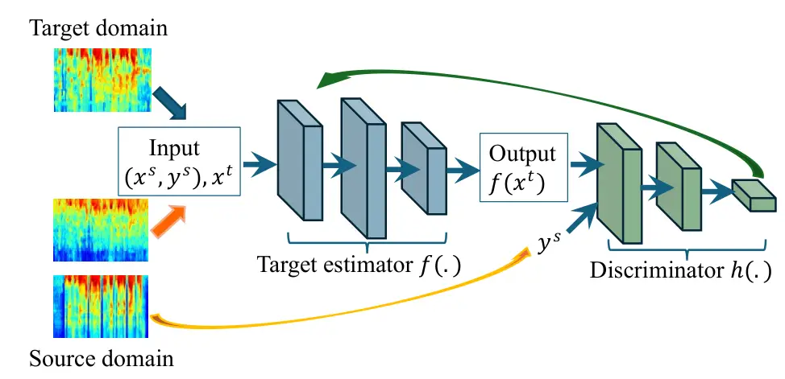

Figure 20: Discriminator-constrained OT network for SE.

As shown in this figure, the model framework consists of an OT-based
domain adaptation module and a discriminator. The adaptation module is
designed based on the following minimization process, where an OT-based
alignment objective function is involved in:

```math
\mathop{\min}\limits_{\gamma,f}(L_{{\rm Rec}}+L_{{\rm Align}}), \tag{83}
```

where target estimation loss and alignment losses are designed as:

```math
L_{{\rm Rec}}\mathop{=}\limits^{\Delta}\frac{1}{{N^{s}}}\sum\limits_{i}{||y_{i}^{s}-f(x_{i}^{s})||^{2}}, \tag{84}
```

and

```math
L_{{\rm Align}}\mathop{=}\limits^{\Delta}\sum\limits_{i,j}{\gamma_{i,j}(\alpha_{x}||x_{i}^{s}-x_{j}^{t}||^{2}+\beta_{y}||y_{i}^{s}-f(x_{j}^{t})||^{2})}, \tag{85}
```

where $`f(\cdot)`$ is a target estimator, $`\gamma_{i,j}`$ is OT
coupling, $`\alpha_{x}`$ and $`\beta_{y}`$ are the weighting coefficient
for feature and label. Minimization of $`L_{{\rm Rec}}`$ tries to remind
the source domain knowledge to avoid the catastrophic-forgetting issue,
while $`L_{{\rm Align}}`$ is used for domain alignment. The domain
discriminator is designed by following the algorithm of WGAN as \[6\]:

```math
\mathop{\min}\limits_{f}\mathop{\max}\limits_{h\in\mathcal{L}_{\rm lip}}\left\{{\mathbb{E}_{y\sim P_{Y^{s}}}(h(y))-\mathbb{E}_{x\sim P_{X^{t}}}(h(f(x))}\right\}, \tag{86}
```

where $`h\in\mathcal{L}_{\rm lip}`$ means $`h`$ belongs to the set of
1-Lipschitz functions. This proposed DOTN model combines OT and GAN is
the first work that performs purely unsupervised SE domain adaptation,
and obtained better performance than existing weakly-supervised domain
adaptation approaches \[77\].

#### XIII-E3 Cross-modal knowledge transfer for SE

During speech communications, besides acoustic speech, visual cues, body
gestures, and linguistic knowledge are also involved to remove confusion
in real communications, particularly in adversarial environments or
communication scenarios. Therefore, SE with multi-modality information,
i.e., visual, acoustic speech, and text for designing SE algorithms have
been intensively investigated in recent years. Conventional SE methods
try to estimate the mapping function based on speech signal only, it is
possible to encode the linguistic information in estimating the mapping
function for SE, particularly a lot of pretrained large language models
(LLMs) have been available. Here shows a multi-modal knowledge transfer
learning framework for SE \[78\] in Fig. 21. In this multi-modal SE
framework, besides integrating video information and audio from a camera
and microphone, linguistic information is provided during enhancement
model training stage. And the linguistic information, audio and video
information are integrated via a cross-model matching process where
cross-modal matching could be adopted \[78\]. Since the enhancement
model has already encoded the linguistic knowledge, text information is
not required in inference stage \[53\].

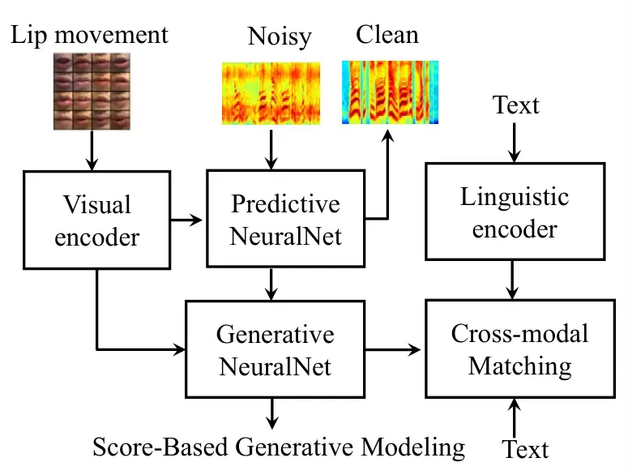

Figure 21: Multi-modal knowledge transfer learning for SE.

With this cross-modal learning paradigm, the performance of SE has
improved significantly \[78, 53\].

### XIII-F Cross-modal knowledge transfer for ASR

Linguistic knowledge information is one of the most important
information in ASR. Fig. 22 shows a conventional two-stage pipeline for
ASR where a language model (LM) encoding linguistic knowledge is
involved.

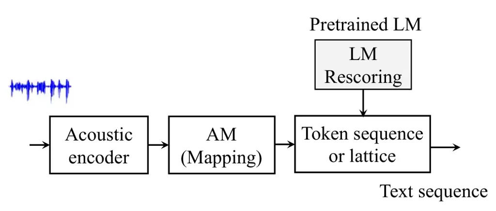

Figure 22: Conventional pipeline for ASR.

In this pipeline, LM is usually used as a rescoring process after
acoustic decoding as the first stage. This two-stage processing slows
recognition, and acoustic encoding could not take linguistic information
in feature exploration learning in the first stage. With rapid advance
and development of pretrained LLMs and end to end ASR models \[76\], it
is necessary to integrate or transfer knowledge of LLMs into ASR while
not increasing the complexity of decoding either with knowledge
distillation \[48\] or attention co-training \[59, 51\], particularly
the way with transferring the linguistic knowledge from LLMs during
acoustic encoding \[8, 125, 69, 24, 37, 47, 45, 46, 30, 31, 85, 128\].
In this way, when performing speech recognition, we do not need any
later usage of language model since the linguistic knowledge has been
distilled to acoustic encoding. This could be helpful for fast and
parallel decoding in ASR since there is no need for a second-pass
rescoring process.

#### XIII-F1 Cross-modal linguistic knowledge transfer for ASR

During speech communication or perception, usually multi-modalities are
involved in sensing and decision making, for example, in speech
communication, modalities corresponding to audio, video and text are
integrated. For knowledge transfer learning, multi-modal information
could be transferred among different modalities for improving
performance on tasks in a specific uni-modality. An example of
acoustic-linguistic knowledge transfer learning is shown in Fig. 23.

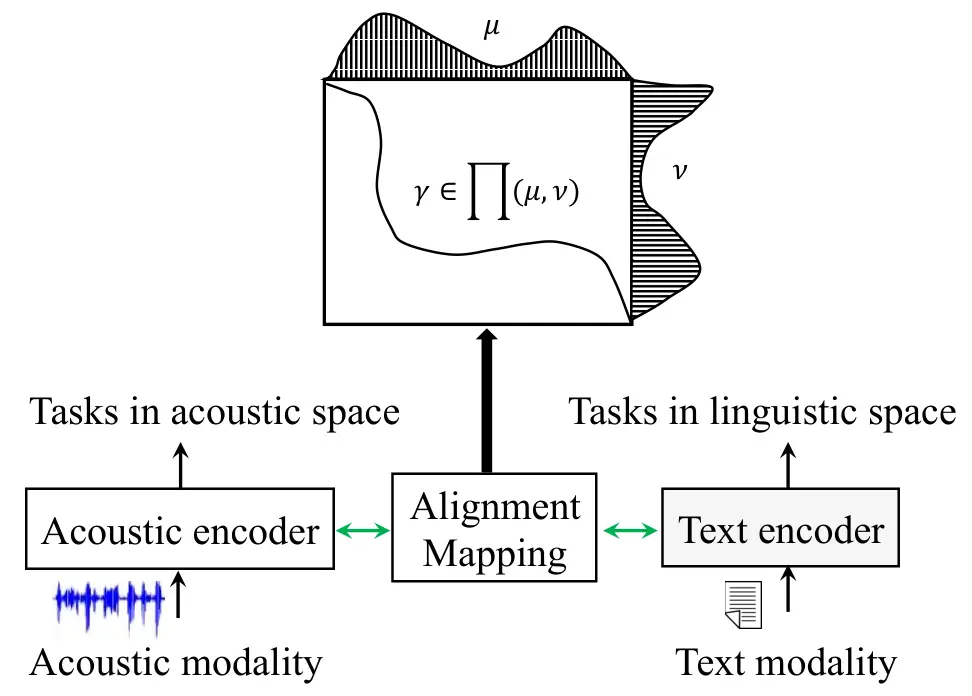

Figure 23: Cross-modal alignment and mapping for knowledge transfer
learning based on OT coupling (acoustic-linguistic modalities).

In this figure, there are two modalities, one is the acoustic modality,
the other is text modality, and they have shared or co-occurred
information since audio speech always has corresponding transcriptions.
In this sense, these two modalities can be regarded as two sides of a
coin during speech communication. However, the distributions of the
feature in these two modalities are different (or heterogeneous). For
efficient knowledge transfer learning, feature alignment and mapping
between acoustic and text modalities are required. If we regard the two
modalities follow two different probability distributions $`\mu`$ and
$`\nu`$, the alignment between the two modalities is naturally recast to
finding OT coupling $`\gamma\in\Pi(\mu,\nu)`$ as illustrated in Fig. 23.
Based on this idea, an OT-based knowledge transfer framework
(conformer-based acoustic model \[42\] and pretrained BERT model \[32\])
has been proposed as detailed in Fig. 24 \[88\].

Figure 24: Cross-modal knowledge transfer for ASR based on OT-matching.

In this framework, two uni-modal encoders, i.e., acoustic and linguistic
encoders, are used for exploring acoustic and linguistic feature
representations. Between these encoders, there is an ‘Adapter’ module
for feature transforms during knowledge transfer learning. In Fig. 24,
an ‘OT matching’ module is designed which serves as the key in
cross-modal knowledge transfer learning. The function of this OT
matching module is to align and match acoustic and linguistic
representations for efficient transfer learning. Further details are
provided in the following sections.

#### XIII-F2 Acoustic and linguistic feature representations

As illustrated in Fig. 24, the acoustic and linguistic representations
$`{\bf H}_{A}`$ and $`{\bf Z}_{L}`$ are extracted by:

```math
{\bf H}_{A}={\rm Encoder}_{A}({\bf X});\quad{\bf Z}_{L}={\rm Encoder}_{L}({\bf y}), \tag{87}
```

where $`{\bf X}`$ and $`{\bf y}`$ are acoustic and linguistic inputs,
$`{\rm Encoder}_{A}(\cdot)`$ and $`{\rm Encoder}_{L}(\cdot)`$ denote the
transforms of the two encoders, respectively. For paired speech-text
sequences, they are represented as
$`{\bf H}_{A}=[\mathbf{h}_{1},\dots,\mathbf{h}_{l_{a}}]\in\mathbb{R}^{l_{a}\times d_{a}}`$
and
$`{\bf Z}_{L}=[\mathbf{z}_{1},\dots,\mathbf{z}_{l_{t}}]\in\mathbb{R}^{l_{t}\times d_{t}}`$,
where $`d_{a}`$ and $`d_{l}`$ are dimensions of acoustic and linguistic
features, $`l_{a}`$ and $`l_{t}`$ are sequence lengths of acoustic and
linguistic features. In Fig. 24, the dimension matching transform from
acoustic to linguistic spaces $`{\rm FC}_{A\to L}(\cdot)`$ is obtained
as
$`{\bf\bar{H}}_{A}=\left[{{\bf\bar{h}}_{1},...,{\bf\bar{h}}_{l_{a}}}\right]\in R^{l_{a}\times d_{t}}`$
with element estimated from
$`{\bf\bar{h}}_{i}={\rm FC}_{A\to L}\left({{\bf h}_{i}}\right)`$.

#### XIII-F3 Sinkhorn-based OT for cross-modal alignment

Given acoustic and linguistic feature sequences $`{\bf\bar{H}}_{A}`$ and
$`{\bf Z}_{L}`$ (obtained from text encoder if no further process is
required), respectively, as:

```math
\begin{array}[]{l}{\bf\bar{H}}_{A}=\left[{{\bf\bar{h}}_{1},{\bf\bar{h}}_{2},...,{\bf\bar{h}}_{i},...,{\bf\bar{h}}_{l_{a}}}\right],\\
{\bf Z}_{L}=\left[{{\bf z}_{1},{\bf z}_{2},...,{\bf z}_{j},...,{\bf z}_{l_{t}}}\right].\\
\end{array}\vskip-2.84526pt \tag{88}
```

Suppose that the two sequences in Eq. (88) are sampled from two
probability distributions with weight vectors
$`{\bf a}=\left[{a_{1},a_{2},...,a_{i},...,a_{l_{a}}}\right]`$ and
$`{\bf b}=\left[{b_{1},b_{2},...,b_{j},...,b_{l_{t}}}\right]`$. (if no
prior information is available, set
$`a_{i}={1\mathord{\left/{\vphantom{1{l_{a}}}}\right.\kern-1.2pt}{l_{a}}}`$
and
$`b_{j}={1\mathord{\left/{\vphantom{1{l_{t}}}}\right.\kern-1.2pt}{l_{t}}}`$
as uniform distributions). The OT distance between the two sequences is
defined as:

```math
L_{\rm OT}\mathop{=}\limits^{\Delta}\mathop{\min}\limits_{\gamma\in\prod{\left({{{\bf\bar{H}}_{A}},{{\bf Z}_{L}}}\right)}}\left\langle{\gamma,{\bf C}}\right\rangle, \tag{89}
```

where $`{\gamma}`$ is a transport coupling set defined as:

```math
\prod{\left({{{\bf\bar{H}}_{A}},{{\bf Z}_{L}}}\right)}\mathop{=}\limits^{\Delta}\left\{{\gamma\in R_{+}^{l_{a}\times l_{t}}\left|{\gamma{\bf 1}_{l_{t}}={\bf a},\gamma^{T}{\bf 1}_{l_{a}}={\bf b}}\right.}\right\}. \tag{90}
```

In Eq. (90), $`{\bf 1}_{l_{a}}`$ and $`{\bf 1}_{l_{t}}`$ are vectors of
ones with dimensions $`l_{a}`$ and $`l_{t}`$, respectively. In Eq. (89),
$`\bf C`$ is a distance matrix (or ground cost metric) with element
$`{c_{i,j}}`$ defined as pairwise cosine distance:

```math
c_{i,j}={\bf C}\left({{\bf\bar{h}}_{i},{\bf z}_{j}}\right)\mathop{=}\limits^{\Delta}1-\cos\left({{\bf\bar{h}}_{i},{\bf z}_{j}}\right).\vskip-2.84526pt \tag{91}
```

A fast estimation of OT has been introduced through the celebrated EOT
\[28\] (See Section XII-A), where the EOT loss is defined as:

```math
L_{\rm EOT}\left({{\bf\bar{H}}_{A},{\bf Z}_{L}}\right)\mathop{=}\limits^{\Delta}\mathop{\min}\limits_{\gamma\in\prod{\left({{{\bf\bar{H}}_{A}},{{\bf Z}_{L}}}\right)}}\left\langle{\gamma,{\bf C}}\right\rangle-\lambda_{1}H\left(\gamma\right), \tag{92}
```

where $`\lambda_{1}`$ is a regularization coefficient, and
$`H\left(\gamma\right)=-\sum\limits_{i,j}{\gamma_{i,j}\log\gamma_{i,j}}`$
is the entropy of coupling matrix. The solution of Eq. (92) can be
implemented with the Sinkhorn algorithm as \[28\]:

```math
\gamma_{\lambda_{1}}=diag\left({{\bf u}}\right)*{\bf K}*diag\left({{\bf v}}\right), \tag{93}
```

where $`{\bf K}=\exp\left({-\frac{{\bf C}}{{\lambda_{1}}}}\right)`$,
$`{{\bf u}}`$ and $`{{\bf v}}`$ are two scaling (or re-normalization)
vectors.

#### XIII-F4 Temporal order preserved OT

In the original estimation of OT in Eq. (92), the two sequences in Eq.
(88) are treated as two sets without considering their temporal order
relationship. In speech, temporal order information is crucial in OT
coupling during cross-modal alignment, meaning that neighboring frames
in an acoustic sequence should be progressively coupled with neighboring
tokens in a linguistic sequence which has been investigated in \[89\].
For the sake of clarity, the two sequences in Eq. (88) can be further
represented with temporal order information as:

```math
\begin{array}[]{l}{\bf\bar{H}}_{A}=\left[{\left({{\bf\bar{h}}_{1},1}\right),\left({{\bf\bar{h}}_{2},2}\right),...,\left({{\bf\bar{h}}_{i},i}\right),...,\left({{\bf\bar{h}}_{l_{a}},l_{a}}\right)}\right],\\
{\bf Z}_{L}=\left[{\left({{\bf z}_{1},1}\right),\left({{\bf z}_{2},2}\right),...,\left({{\bf z}_{j},j}\right),...,\left({{\bf z}_{l_{t}},l_{t}}\right)}\right].\\
\end{array} \tag{94}
```

During the alignment of the two sequences for knowledge transfer, it is
crucial to consider that elements with significant cross temporal
distances might not be likely to be coupled. In other words, the
coupling pairs with high probabilities between the two sequences should
be distributed along the diagonal line of the temporal coherence
positions. Based on this consideration, the temporal coupling prior
could be defined as a two dimensional Gaussian distribution \[116\]. The
fundamental concept is that the coupled pairs should not deviate
significantly from the diagonal line of temporal coherence positions
between the two sequences, which can be defined as:

```math
p_{i,j}\mathop{=}\limits^{\Delta}\frac{1}{{\sigma\sqrt{2\pi}}}\exp\left({-\frac{{d_{i,j}^{2}}}{{2\sigma^{2}}}}\right), \tag{95}
```

where $`\sigma`$ is a variation variable controlling the impact of the
cross-temporal distance $`d_{i,j}`$ as defined in Eq. (96).

```math
d_{i,j}=\frac{{\left|{{\raise 2.15277pt\hbox{$\scriptstyle i$}\kern-1.00006pt/\kern-1.49994pt\lower 1.07639pt\hbox{$\scriptstyle{l_{a}}$}}-{\raise 2.15277pt\hbox{$\scriptstyle j$}\kern-1.00006pt/\kern-1.49994pt\lower 1.07639pt\hbox{$\scriptstyle{l_{t}}$}}}\right|}}{{\sqrt{{\raise 2.15277pt\hbox{$\scriptstyle 1$}\kern-1.00006pt/\kern-1.49994pt\lower 1.07639pt\hbox{$\scriptstyle{l_{a}^{2}}$}}+{\raise 2.15277pt\hbox{$\scriptstyle 1$}\kern-1.00006pt/\kern-1.49994pt\lower 1.07639pt\hbox{$\scriptstyle{l_{t}^{2}}$}}}}}. \tag{96}
```

In Eq. (96), the cross-temporal distance is defined on the normalized
sequence lengths in acoustic and linguistic spaces. In this definition,
it is evident that the farther the distance between a paired position
and the temporal diagonal line, the lower the possibility of their
correspondence in transport coupling. By incorporating this temporal
coherence prior as regularization, the new OT is defined as:

```math
L_{\rm{TOT}}({\bf\bar{H}}_{A},{\bf Z}_{L})\mathop{=}\limits^{\Delta}\mathop{\min}\limits_{\mathclap{\gamma\in\prod{({{\bf\bar{H}}_{A}},{{\bf Z}_{L}})}}}<\gamma,{\bf C}>-\lambda_{1}H(\gamma)+\lambda_{2}\mathrm{KL}(\gamma||P), \tag{97}
```

where $`\lambda_{1}`$ and $`\lambda_{2}`$ are two trade off parameters.
In Eq. (97), $`\mathrm{KL}(\gamma||P)`$ is the KL-divergence between the
transport coupling matrix $`\gamma`$ and the temporal prior
correspondence matrix $`P`$ with elements defined in Eq. (95). Building
upon the definitions of KL-divergence and entropy, Eq. (97) can be
further expressed to:

```math
L_{\rm{TOT}}({\bf\bar{H}}_{A},{\bf Z}_{L})\mathop{=}\limits^{\Delta}\mathop{\min}\limits_{\gamma\in\prod{({{\bf\bar{H}}_{A}},{{\bf Z}_{L}})}}<\gamma,{\bf\tilde{C}}>-\tilde{\lambda}H(\gamma), \tag{98}
```

where $`\tilde{\lambda}=\lambda_{1}+\lambda_{2}`$, and combined ground
cost matrix as

```math
{\bf\tilde{C}}={\bf C}-\lambda_{2}\log P, \tag{99}
```

where elements in $`P`$ are defined in Eq. (95). Following the
procedures outlined in \[28\], the solution of Eq. (98) is obtained
using the Sinkhorn algorithm as:

```math
\gamma_{\tilde{\lambda}}=diag\left({{\bf u}}\right)*{\bf\tilde{K}}*diag\left({{\bf v}}\right), \tag{100}
```

where
$`{\bf\tilde{K}}=\exp\left({-\frac{{{\bf\tilde{C}}}}{{\tilde{\lambda}}}}\right)`$.
Substituting variables in Eq. (99) into $`{\bf\tilde{K}}`$, we can
obtain the following:

```math
{\bf\tilde{K}}=P^{\frac{{\lambda_{2}}}{{\lambda_{1}+\lambda_{2}}}}\exp(-\frac{{\bf C}}{{\lambda_{1}+\lambda_{2}}}). \tag{101}
```

From this equation, we can see that the transport coupling between the
two sequences is further constrained by their temporal order
correspondence. Temporal order preserved OT involves several
hyper-parameters that can be challenging to control. For the sake of
simplification, their effects can be consolidated into a reduced number
of hyper-parameters. For example, considering Eq. (99), the impact of
variation $`\sigma`$ in Eq. (95) and $`\lambda_{2}`$ in Eq. (97) can be
combined into a single control parameter $`\beta_{\rm dist}`$, defined
as:

```math
{\bf\tilde{C}}={\bf C}+\beta_{\rm dist}d_{i,j}^{2}, \tag{102}
```

and the Sinkhorn algorithm is applied to this consolidated cost function
$`{\bf\tilde{C}}`$ for OT in real implementations.

#### XIII-F5 Loss function

In the transfer learning model as illustrated in Fig. 24, two loss
functions are involved: the cross-modal alignment and matching loss (in
the right branch of Fig. 24) and the recognition loss (either CTC-based
loss \[43, 44\] or CE-based classification loss). For cross-modal
alignment, the acoustic feature is first projected to the linguistic
space using OT transform as:

```math
\begin{array}[]{l}\begin{aligned} {\bf\tilde{Z}}_{L}&\mathop{=}\limits^{\Delta}{\rm OT}\left({{\bf\bar{H}}_{A}\to{\bf Z}_{L}}\right),\\
&=\left({\gamma^{*}}\right)^{T}\times{\bf\bar{H}}_{A}\in R^{l_{t}\times d_{t}},\\
\end{aligned}\end{array} \tag{103}
```

where $`\left({\gamma^{*}}\right)^{T}`$ is the transpose of the OT
coupling obtained from the solution of Sinkhorn-based OT. Subsequently,
the alignment loss is directly defined on the projected space as

```math
L_{{\rm align}}=\sum\limits_{j=1}^{l_{t}}{1-\cos\left({{\bf\tilde{z}}_{L}^{j},{\bf z}_{L}^{j}}\right)}, \tag{104}
```

where $`{\bf\tilde{z}}_{L}^{j}`$ and $`{\bf z}_{L}^{j}`$ are row vectors
of feature matrices $`{\bf\tilde{Z}}_{L}`$ and $`{\bf Z}_{L}`$
(according in temporal dimensions), respectively. For efficient transfer
of linguistic knowledge to acoustic encoding, the following transforms
are designed as indicated in Fig. 24:

```math
{\bf\tilde{H}}_{A}={\bf H}_{A}+{\rm LN(FC}_{L\to A}{\rm(LN(}{{\bf\bar{H}}_{A}}{\rm)))}\in\mathbb{R}^{l_{a}\times d_{a}}. \tag{105}
```

Based on this new representation $`{\bf\tilde{H}}_{A}`$, the probability
prediction for ASR is formulated as
$`{\bf\tilde{P}}={\rm Softmax}({{\rm FC}({\bf\tilde{H}}_{A})})`$, where
‘FC’ is a fully connected linear transform with output size the same as
that of vocabulary tokens. Finally, the total loss in model training is
defined as

```math
L\mathop{=}\limits^{\Delta}\eta L_{{\rm C}}({\bf\tilde{P}},{\bf y})+(1-\eta){L_{{\rm align}}}, \tag{106}
```

where $`L_{{\rm C}}({\bf\tilde{P}},{\bf y})`$ is a classification loss,
either CE or CTC loss (as shown in Fig. 24). After training the model,
only the branch of the acoustic modality of Fig. (24) is retained for
the inference of ASR. The alignment and matching are performed on the
final representations from encoders of the two modalities \[88, 89\], as
an extension, the alignment and matching also has been designed on
different layers of acoustic encoders in order to explore rich acoustic
information with consideration of linguistic knowledge \[86\]. Moreover,
the study in \[86\] also indicated the connection between conventional
transformer-based cross-attention and OT where OT-based transport can be
regarded as a double-side (row and column) normalization process;
therefore, the matching and alignment are also named as Sinkhorn
attention \[117, 95, 104\].

#### XIII-F6 Adding structure to OT in Cross-modal linguistic knowledge transfer for ASR

The original concept of OT is defined on sample points between two sets
as illustrated in Fig. 25-(a), either acoustic or linguistic space,
$`\left[{{\bf h}_{1},{\bf h}_{2},...,{\bf h}_{i},...,{\bf h}_{j},...}\right]`$
or
$`\left[{{\bf z}_{1},{\bf z}_{2},...,{\bf z}_{l},...,{\bf z}_{k},...}\right]`$,
can be regarded as samples and can be independently associated or
coupled during transportation between the two spaces, if we add
structure (e.g., topological structure) on points in a space, for
example, by defining the distance metric between two points in each
space as illustrated in Fig. 25-(b),
$`d^{\rm A}\left({{\bf h}_{i},{\bf h}_{j}}\right)`$ and
$`d^{\rm L}\left({{\bf z}_{l},{\bf z}_{k}}\right)`$ in acoustic and
linguistic spaces, the association or coupling can be designed on their
distance relationship between two points. Moreover, as it is known,
information in acoustic speech and text are sequentially encoded, that
is the temporal order information of points should be considered during
matching between the two sets. For example, as shown in Fig. 25-(c),
temporal order information is attached to each node. From these
explanations, we can see that during OT, we could add these kinds of
structured information. This idea has been addressed and named as graph
matching OT in cross-modal knowledge transfer for ASR in \[90\].

Figure 25: Graph matching OT in Cross-modal knowledge transfer learning
for ASR.

The behavior of adding different structures in OT for acoustic and
linguistic matching and alignment has been well analyzed with different
hyper-parameters. For example, as shown in Fig. 26, with adjusting
weighting importance between matching on nodes and edges (the trade-off
weighting coefficient $`\alpha`$ in Eq. (30) to control the importance
between WD and GWD). In this figure, horizontal and vertical are indexes
of acoustic embedding and its corresponding linguistic token embedding
sequences. With small $`\alpha`$, we can see that there are many small
segments of the matching or coupling, but when $`\alpha`$ increases, we
can see a clear structure of the matching or coupling segments between
the embedding of acoustic and linguistic feature embeddings.

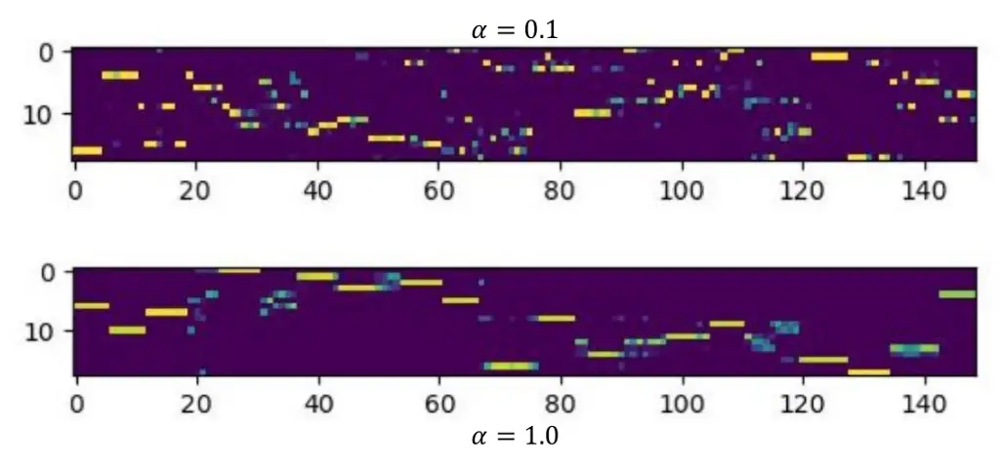

Figure 26: Segmental structure of speech in matching between acoustic
and linguistic features based on OT.

Changing the coefficient $`\beta_{\rm dist}`$ in Eq. (102), the
importance of the temporal order information can be controlled in
alignment and matching based on OT. The behavior is shown in Fig. 27. we
can see that the alignment between acoustic and linguistic
representations follows a strong monotonic corresponding relationship.

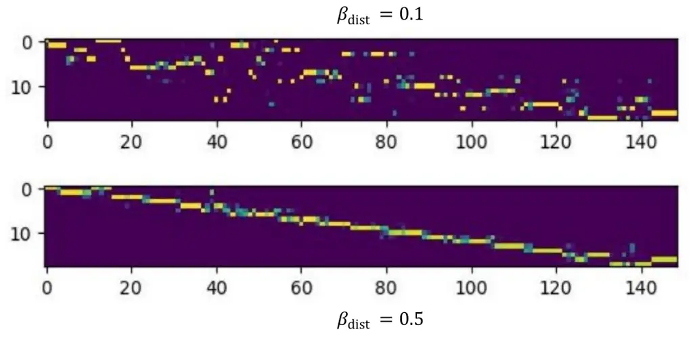

Figure 27: Temporal order structure of speech in matching between
acoustic and linguistic features based on OT.

Moreover, in the solution of the OT based on the Sinkhorn algorithm, the
regularization of the OT coupling is adopted. In the definition Eq.
(98), with controlling of the regularization coefficient
$`\hat{\lambda}`$, the expansion and smooth behavior can be observed as
shown in Fig. 28.

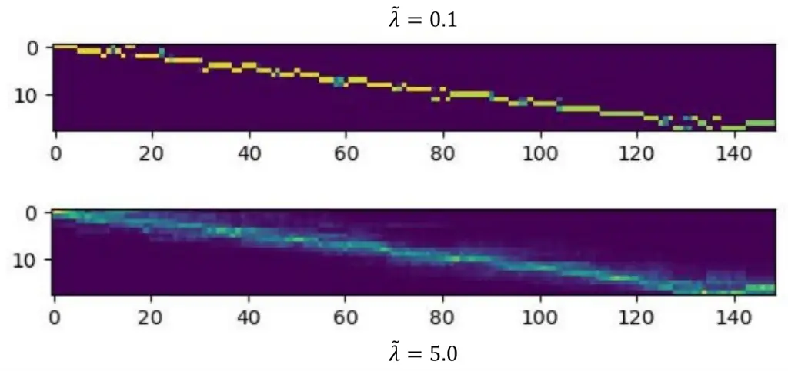

Figure 28: Entropy regularization of coupling in matching between
acoustic and linguistic features based on OT.

With properly setting these hyper-parameters, state of the art ASR
performance could be obtained which showed the advantages of cross-modal
alignment and matching \[88, 89\].

#### XIII-F7 Unbalanced OT in Cross-modal linguistic knowledge transfer for ASR

With different setting of $`\alpha_{1}`$ and $`\alpha_{2}`$ of UOT in
Eq. (32), the alignment behaviors between acoustic and linguistic
features can be well controlled: (a) Acoustic-to-Linguistic (A2L)
alignment: To ensure that every linguistic token is aligned, we set
$`\alpha_{2}>\alpha_{1}`$. This forces mass coverage over linguistic
units while permitting selective skipping or discarding of noisy and
outlier acoustic frames, including NULL acoustic matching; (b)
Linguistic-to-Acoustic (L2A) alignment: To account for as much of the
acoustic input as possible, we set $`\alpha_{1}>\alpha_{2}`$, ensuring
that the acoustic frames are matched even if some linguistic tokens are
less activated. This matching strategy in model training tries to
encourage bidirectional consistency, and the resulting optimal transport
plan $`\gamma^{\ast}`$ represents a soft alignment matrix that assigns
probabilistic mass between acoustic and linguistic elements, effectively
grounding linguistic tokens in observed speech while avoiding
overfitting to background noisy frames in transfer learning \[91\]. The
effect is shown in Fig. 29. From this figure, we can see that the
alignment between the acoustic and linguistic embeddings is well
controlled by properly setting the regularization parameters
$`\alpha_{1}`$ and $`\alpha_{2}`$ to meet the requirement of unbalanced
matching between them.

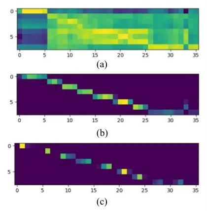

Figure 29: Alignment between acoustic and linguistic tokens (indexes of
acoustic (Horizontal) and linguistic (Vertical) embedding sequences):
(a) cosine similarity matrix; (b) $`\alpha_{1}=1.0`$,
$`\alpha_{2}=1.0`$; (c) $`\alpha_{1}=0.01`$, $`\alpha_{2}=1.0`$.

### XIII-G Cross-domain adaptation in various identification and detection tasks

In various speech tasks, for example LID and SR, the domain mismatch
problem is very common and challenging. Reducing domain mismatch for
improving domain generalization performance is necessary where the
distance metric between domain distributions is involved \[34\]. OT is
quite suitable for these tasks, as OT naturally defines the distance
metric between probability distributions. For the cross-domain LID task,
an OT-based adaptation neural model framework has been proposed \[87\].
The model framework is illustrated in Fig. 30 where both training and
test networks share the same set of weight parameters in a Siamese
network architecture. And the x-vector is adopted as input feature
\[113\] with fixed pretrained model parameters. The adaptation is
designed at both the feature and the classifier levels to reduce the
mismatch between the distributions of training and testing sets. A
similar idea has been proposed for SR \[136, 122\].

Figure 30: Cross-domain adaptation for LID based on a Siamese neural
network architecture for source (left) and target (right) domain
samples.

The effect of adaptation for LID and SR is shown in Figs. 31 and 32. In
these figures, the t-SNE visualizations \[92\] of the features of the
language and speaker clusters are plotted. From these figures, we can
see that there exist obvious gaps between the training/source and
test/target domains (two given language IDs marked lang1\_{tr, tt} and
lang7\_{tr, tt} in Fig. 31-a; Speaker IDs marked with {Source, Target}
speaker {1, 2, 3} in Fig. 32-a). After adaptation, distributions of
features in training (source) and test (target) domains are pushed to
neighboring regions while keeping their class discrimination structure.

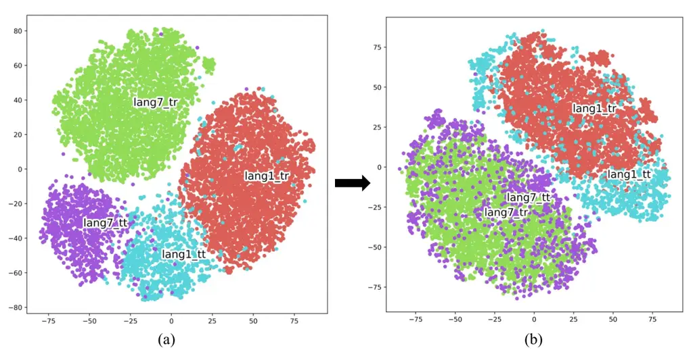

Figure 31: Visualization of feature representations via t-SNE in
cross-domain LID before (a) and after (b) adaptation, lang{1,7}\_tr,
lang{1,7}\_tt denote language IDs 1 and 7 for training and test.

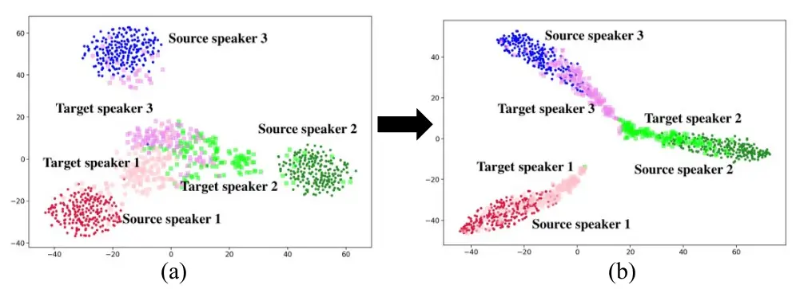

Figure 32: Feature representation in cross-domain speaker recognition
before (a) and after (b) adaptation.

OT-based domain alignment and adaptation have also been applied in
speech emotion recognition tasks \[134, 135\], where speech emotion
samples come from different languages and recording environments.

In recent years, due to the requirement of trust-worthy speech
communications, audio spoof detection (ASD) has been increasing its
importance in various applications. ASD, also known as anti-spoofing
refers to techniques designed to distinguish between bona fide speech
(genuine/real human speech) and artificially generated or manipulated
speech. Most ASD models are designed and trained with a large number of
training data samples. It is difficult to use the same models to deal
with all spoof speech generated with various algorithms and from
versatile domains \[74\]. Cross-domain ASD and OT-based adaptation
techniques have been developed under the same line of cross-domain tasks
in LID and SVR, and significant performance gains were obtained \[138,
137\].

## XIV Future directions

The application of OT to speech processing has shown promising results
across various tasks and applications, either for multi-modal
representation transfer learning, or cross-modal domain adaptation and
integration. However, several important directions remain open for
further exploration. First, scalability and efficiency remain critical
challenges. Classical OT formulations often incur high computational
cost, especially when applied to long speech sequences or
high-dimensional feature spaces. Developing more efficient computational
algorithms is essential in engineering implementations, such as
stochastic OT, mini-batch OT, and low-rank or sparsity-constrained
transport plans, to enable real-time and large-scale deployment in
speech applications systems. A particularly promising direction is the
integration of OT with SDE-based generative modeling frameworks. Recent
advances in diffusion models and flow matching methods have demonstrated
strong capabilities in modeling complex data distributions. OT provides
a natural perspective for describing the evolution of probability
distributions over time, which aligns closely with the dynamics defined
by SDEs. Moreover, with lifting the states of the dynamics in a
functional space, composition operator theory (e.g., Koopman operator)
may be applied to investigate the nonlinear dynamic properties with
linear operator analysis. Future work may explore the theoretical
connections between OT and diffusion bridges/processes, transfer
operator learning, as well as their practical implications for domain or
modality alignment and matching.

Multi-modal learning also remains a fertile area for OT-based methods.
Speech is often accompanied by complementary modalities, such as visual
information (e.g., lip movements), articulatory signals, and textual
context. Speech processing requires methods and algorithms for
multimodal feature learning or multimodal information fusion \[140,
126\]. OT offers a natural framework for aligning heterogeneous feature
distributions across these modalities. In particular, domain adaptation
and modality gap minimization should receive increased attention,
especially in scenarios involving mismatched distributions across audio,
visual, and textual streams. Future research may focus on conditional
and dynamic transport formulations that explicitly reduce cross-modal
discrepancies, handle temporal asynchrony, and improve robustness under
missing or noisy modalities. In addition, theoretical advances are
needed to better understand the role of OT in speech modeling. This
includes studying the properties of transport-based alignments in
sequential data, their relationship to probabilistic formulations such
as SDEs and diffusion models, and their implications for representation
learning and generalization. Such insights could guide the design of
more principled and effective OT-based loss or objective functions.

In summary, future research on OT for speech lies at the intersection of
efficiency, generative modeling, multi-modality, and robustness. In
particular, a deeper exploration of OT in conjunction with SDE-based
generative frameworks and transfer operator theory (as well as
composition operator theory), along with a stronger focus on domain
adaptation and modality gap minimization, will be crucial for advancing
next-generation speech technologies.

## References

- \[1\] Luigi Ambrosio, Nicola Gigli, Giuseppe Savaré, Gradient Flows In
  Metric Spaces and in the Space of Probability Measures,
  Springer, 2008.
- \[2\] L. Ambrosio, E. Brué and D. Semola, “Lectures on Optimal
  Transport,” Springer, 2021.
- \[3\] B. Amos, L. Xu, and J. Kolter, “Input convex neural networks,”
  the Proceedings of the 34th International Conference on Machine
  Learning, Vol. 70, pp. 146-155, 2017.
- \[4\] B. Anderson, “Reverse-time diffusion equation models,”
  Stochastic Processes and their Applications, 12(3):313-326, 1982.
- \[5\] Yuki Arase, Han Bao, and Sho Yokoi, “Unbalanced Optimal
  Transport for Unbalanced Word Alignment,” In Proceedings of the 61st
  Annual Meeting of the Association for Computational Linguistics
  (Volume 1: Long Papers), pp. 3966-3986, 2023.
- \[6\] M. Arjovsky, S. Chintala, L. Bottou, “Wasserstein Generative
  Adversarial Networks,” International Conference on Machine Learning,
  PMLR: 214–223, 2017.
- \[7\] A. Baevski, Y. Zhou, A. Mohamed, and M. Auli, “Wav2vec 2.0: A
  framework for self-supervised learning of speech representations,” in
  _Proc. of NeurIPS_, 2020.
- \[8\] Y. Bai, J. Yi, J. Tao, Z. Tian, Z. Wen and S. Zhang, ”Fast
  End-to-End Speech Recognition Via Non-Autoregressive Models and
  Cross-Modal Knowledge Transferring From BERT,” _IEEE/ACM Transactions
  on Audio, Speech, and Language Processing_, vol. 29, pp.
  1897-1911, 2021.
- \[9\] J. Benamou, Y. Brenier, “A computational fluid mechanics
  solution to the Monge-Kantorovich mass transfer problem,” Numerische
  Mathematik, vol. 84, pp. 375-393, 2000.
- \[10\] J. Benamou, G. Carlier, M. Cuturi, Marco, L. Nenna, Luca, G.
  Peyré, “Iterative Bregman Projections for Regularized Transportation
  Problems,” SIAM Journal on Scientific Computing, Vol.37, No.2, pp.
  A1111-AA1138, 2015.
- \[11\] R. Bhardwaj,T. Vaidya, S. Poria, “Towards solving NLP tasks
  with optimal transport loss,” Journal of King Saud University-Computer
  and Information Sciences, Vol. 34, No. 10, pp. 9441-9452, 2022.
- \[12\] M. Blondel, V. Seguy, A. Rolet, “Smooth and Sparse Optimal
  Transport,” Proceedings of the Twenty-First International Conference
  on Artificial Intelligence and Statistics, pp. 880-889, 2018.
- \[13\] N. Bonneel, J. Digne, “A survey of optimal transport for
  computer graphics and computer vision,” Computer Graphics Forum
  (Eurographics STAR 2023), Vol. 42, No. 2, pp. 439-460, 2023.
- \[14\] V. De Bortoli, J. Thornton, J. Heng, A. Doucet, “Diffusion
  schrödinger bridge with applications to score-based generative
  modeling,” International Conference on Neural Information Processing
  Systems, 2021.
- \[15\] Yann Brenier, “Polar Factorization and Monotone Rearrangement
  of Vector-Valued Functions,” Communications on Pure and Applied
  Mathematics,vol. 44, pp. 375-417,1991.
- \[16\] S. Brunton, M. Budišić, E. Kaiser, J. Kutz, “Modern Koopman
  Theory for Dynamical Systems,” SIAM Review, Vol. 64, No. 2, pp.
  229-340, 2022.
- \[17\] C. Bunne, “Neural Optimal Transport for Dynamical Systems:
  Methods and Applications in Biomedicine,” ETH Zurich thesis, Zürich,
  Switzerland, 2023.
- \[18\] L. Chapel, M. Alaya, G. Gasso, “Partial optimal transport with
  applications on positive-unlabeled learning,” Advances in Neural
  Information Processing Systems, Vol. 33, pp. 2903-2913, 2020.
- \[19\] Liqun Chen, Yizhe Zhang, Ruiyi Zhang, Chenyang Tao, Zhe Gan,
  Haichao Zhang, Bai Li, Dinghan Shen, Changyou Chen, and Lawrence
  Carin, “Improving sequence-to-sequence learning via optimal
  transport,” arXiv preprint arXiv:1901.06283, 2019.
- \[20\] Y. Chen, T. Georgiou and M. Pavon, “On the Relation Between
  Optimal Transport and Schrödinger Bridges: A Stochastic Control
  Viewpoint,” Journal of Optimization Theory and Applications, Vol. 169,
  pp. 671-691, 2014.
- \[21\] R. Chen, Y. Rubanova, J. Bettencourt, D. Duvenaud, “Neural
  ordinary differential equations,” arXiv preprint
  arXiv:1806.07366, 2018.
- \[22\] Y. Chen, T. Georgiou and M. Pavon, “Stochastic Control
  Liaisons: Richard Sinkhorn Meets Gaspard Monge on a Schrödinger
  Bridge,” SIAM Review, Vol. 2, pp. 249-313, 2021.
- \[23\] L. Chizat, G. Peyré, B. Schmitzer, F. Vialard, “Scaling
  algorithms for unbalanced transport problems,” arXiv preprin
  arXiv:1607.05816, 2016.
- \[24\] K. Choi, H. Park, “Distilling a Pretrained Language Model to a
  Multilingual ASR Model,” in _Proc. of INTERSPEECH_, pp.
  2203-2207, 2022.
- \[25\] C. Chuang, A. Torralba, and S. Jegelka,“Estimating
  generalization under distribution shifts via domain-invariant
  representations,” in _Proc. of International Conference on Machine
  Learning (ICML)_, pp. 1984-1994, 2020.
- \[26\] N. Courty, R. Flamary, D. Tuia and A. Rakotomamonjy, “Optimal
  Transport for Domain Adaptation,” In IEEE Transactions on Pattern
  Analysis and Machine Intelligence, Vol. 39 (9), pp. 1853–1865, 2014.
- \[27\] N. Courty, R. Flamary, A. Habrard, A. Rakotomamonjy, “Joint
  distribution optimal transportation for domain adaptation,” Neural
  Information Processing Systems, 2017.
- \[28\] Marco Cuturi, “Sinkhorn Distances: Lightspeed Computation of
  Optimal Transport,” In Advances in Neural Information Processing
  Systems, pp. 2292-2300, 2013.
- \[29\] B. Damodaran, B. Kellenberger, R Flamary, D Tuia, N Courty,
  DeepJDOT:Deep Joint Distribution Optimal Transport for Unsupervised
  Domain Adaptation, ECCV, 2018.
- \[30\] K. Deng, S. Cao, Y. Zhang, L. Ma, G. Cheng, J. Xu, P. Zhang,
  “Improving CTC-Based Speech Recognition Via Knowledge Transferring
  from Pre-Trained Language Models,” in _Proc. of ICASSP_, pp.
  8517-8521, 2022.
- \[31\] K. Deng, Z. Yang, S. Watanabe, Y. Higuchi, G. Cheng, P. Zhang,
  “Improving Non-Autoregressive End-to-End Speech Recognition with
  Pre-Trained Acoustic and Language Models,” in _Proc. of ICASSP_, pp.
  8522-8526, 2022.
- \[32\] J. Devlin, M. Chang, K. Lee, and K. Toutanova, “Bert:
  Pretraining of deep bidirectional transformers for language
  understanding,” _arXiv preprint_, arXiv:1810.04805, 2018.
- \[33\] K. Do, D. Coeurjolly, P. Memari, N. Bonneel, “Linear-Time
  Transport with Rectified Flows,” ACM Transactions on Graphics (TOG),
  Vol. 44 (4), No. 118, pp. 1-13, 2025.
- \[34\] M. Farrús, “Voice Disguise in Automatic Speaker Recognition,”
  ACM Computing Surveys (CSUR), Vol. 51 (4), No. 68, pp. 1-22, 2018.
- \[35\] Alessio Figalli, Federico Glaudo, An Invitation to Optimal
  Transport, Wasserstein Distances, and Gradient Flows, EMS
  society, 2023.
- \[36\] R. Flamary, N. Courty, D. Tuia, A. Rakotomamonjy, “Optimal
  transport with Laplacian regularization: Applications to domain
  adaptation and shape matching,” NIPS Workshop on Optimal Transport and
  Machine Learning, 2014.
- \[37\] H. Futami, H. Inaguma, M. Mimura, S. Sakai, T. Kawahara,
  “Distilling the Knowledge of BERT for CTC-based ASR,” CoRR
  abs/2209.02030, 2022.
- \[38\] A. Galichon, Optimal Transport Methods in Economics. Princeton
  University Press, 2016.
- \[39\] Y. Ganin, E. Ustinova, H. Ajakan, P. Germain, H.
  Larochelle, F. Laviolette, M. Marchand, and V. Lempitsky,
  “Domain-adversarial training of neural networks,” _Journal of Machine
  Learning Research_, vol. 17, no. 1, pp. 1-35, 2016.
- \[40\] Wilfrid Gangbo, Robert J. McCann, “The geometry of optimal
  transportation,” Acta Math., 177(2), pp. 113-161, 1996.
- \[41\] I. Goodfellow, J. Pouget-Abadie, M. Mirza, B. Xu, D.
  Warde-Farley, S. Ozair, A. Courville, Y. Bengio, “Generative
  Adversarial Nets,” Proceedings of the International Conference on
  Neural Information Processing Systems, pp. 2672-2680, 2014.
- \[42\] A. Gulati, J. Qin, C. Chiu, N. Parmar, Y. Zhang, J. Yu, W.
  Han, S. Wang, Z. Zhang, Y. Wu, R. Pang, “Conformer: Convolution
  augmented transformer for speech recognition,” _arXiv preprint_,
  arXiv:2005.08100, 2020.
- \[43\] A. Graves, “Sequence transduction with recurrent neural
  networks,” _arXiv preprint_, arXiv:1211.3711, 2012.
- \[44\] A. Graves, and N. Jaitly, “Towards end to-end speech
  recognition with recurrent neural networks,” in _Proc. ICML_, pp.
  1764–1772, 2014.
- \[45\] M. Han, F. Chen, J. Shi, S. Xu, B. Xu, “Knowledge Transfer
  from Pre-trained Language Models to Cif-based Speech Recognizers via
  Hierarchical Distillation,” _arXiv preprint_, arXiv:2301.13003, 2023.
- \[46\] M. Han, L. Dong, Z. Liang, M. Cai, S. Zhou, Z. Ma, B. Xu,
  “Improving End-to-End Contextual Speech Recognition with Fine-Grained
  Contextual Knowledge Selection,” in _Proc. of ICASSP_, pp.
  8532-8536, 2022.
- \[47\] Y. Higuchi, T. Ogawa, T. Kobayashi, S. Watanabe, “BECTRA:
  Transducer-Based End-To-End ASR with Bert-Enhanced Encoder,” in _Proc.
  of ICASSP_, pp. 1-5, 2023.
- \[48\] G. Hinton, O. Vinyals, and J. Dean, “Distilling the knowledge
  in a neural network,” _arXiv preprint_, arXiv:1503.02531, 2015.
- \[49\] J. Ho, A. Jain, and P. Abbeel, “Denoising diffusion
  probabilistic models,” Advances in neural information processing
  systems, Vol 33, pp. 6840-6851, 2020.
- \[50\] P. Holderrieth, Peter, E. Erives, “An Introduction to Flow
  Matching and Diffusion Models,” arXiv: 2506.02070, 2026.
- \[51\] T. Hori, S. Watanabe, and J. R. Hershey, “Joint ctc/attention
  decoding for end-to-end speech recognition,” in _Proc. of ACL_, vol.
  1, pp. 518–529, 2017.
- \[52\] T. A. Hsieh, C. Yu, S. W. Fu, X. Lu, and Y. Tsao, “Improving
  Perceptual Quality by Phone-Fortified Perceptual Loss using
  Wasserstein Distance for Speech Enhancement,” ISCA-Interspeech, 2021.
- \[53\] K. Hung, X. Lu, S. Fu, H. Tseng, H. Lin, C. Lin, and Y. Tsao,
  “Linguistic knowledge transfer learning for speech enhancement,” arXiv
  preprint arXiv:2503.07078, 2025.
- \[54\] A. Hyvärinen, “Estimation of non-normalized statistical models
  by score matching,” Journal of Machine Learning Research, Vol.6, pp.
  695-709, 2005.
- \[55\] A. Hyvärinen, “Some extensions of score matching.,”
  Computational statistics & data analysis, 51(5), pp.2499-2512, 2007.
- \[56\] M. Idel, “A review of matrix scaling and Sinkhorn’s normal
  form for matrices and positive maps,” arXiv: Rings and Algebras, 2016.
- \[57\] R. Jordan, D. Kinderlehrer, F. Otto, “The Variational
  Formulation of the Fokker-Planck Equation,” SIAM Journal on
  Mathematical Analysis Vol. 29, Iss. 1, 1998.
- \[58\] A. Khamis, R. Tsuchida, M. Tarek, V. Rolland, L. Petersson,
  “Scalable Optimal Transport Methods in Machine Learning: A
  Contemporary Survey,” IEEE Transactions on Pattern Analysis and
  Machine Intelligence, doi:10.1109/TPAMI.2024.3379571, 2024.
- \[59\] S. Kim, T. Hori, and S. Watanabe, “Joint CTC-attention based
  end-to-end speech recognition using multi-task learning,” in _Proc. of
  ICASSP_, pp. 4835–4839, 2017.
- \[60\] D. Kingma, M. Welling, “Auto-Encoding Variational Bayes,”
  arXiv preprint arXiv:1312.6114, 2013.
- \[61\] D. Kingma,M. Welling, “An Introduction to Variational
  Autoencoders,” Foundations and Trends in Machine Learning, Vol. 12,
  No. 4, pp. 307-392, 2019.
- \[62\] I. Kobyzev, S. Prince, and M. Brubaker, “Normalizing flows: An
  introduction and review of current methods,” IEEE Transactions on
  Pattern Analysis and Machine Intelligence, 2021.
- \[63\] S. Kolouri, S. Park, M. Thorpe, D. Slepčev, and G. Rohde,
  “Transport-based analysis, modeling, and learning from signal and data
  distributions,” arXiv preprint arXiv:1609.04767, 2016.
- \[64\] S. Kolouri, S. Park, M. Thorpe, D. Slepcev, G. K. Rohde,
  “Optimal Mass Transport: Signal Processing and Machine-learning
  Applications,” IEEE Signal Processing Magazine, Vol. 34 (4), pp.
  43-59, 2017.
- \[65\] N. Kornilov, P. Mokrov, A. Gasnikov, and A. Korotin, “Optimal
  Flow Matching: Learning Straight Trajectories in Just One Step,” The
  Thirty-eighth Annual Conference on Neural Information Processing
  Systems, 2024.
- \[66\] A. Korotin, L. Li, A. Genevay, J. Solomon, A. Filippov, E.
  Burnaev, “Do Neural Optimal Transport Solvers Work? A Continuous
  Wasserstein-2 Benchmark,” Advances in Neural Information Processing
  Systems, Vol. 34, pp. 14593-14605, 2021.
- \[67\] A. Korotin, V. Egiazarian, A. Asadulaev, R. Safin, Ruslan, E.
  Burnaev, “Neural Optimal Transport,” arXiv preprint
  arXiv:2201.12220, 2022.
- \[68\] W. M. Kouw and M. Loog, “A Review of Domain Adaptation without
  Target Labels,” _IEEE transactions on pattern analysis and machine
  intelligence_, 43(3), pp. 766-785, 2019.
- \[69\] Y. Kubo, S. Karita, M. Bacchiani, “Knowledge Transfer from
  Large-Scale Pretrained Language Models to End-To-End Speech
  Recognizers,” in _Proc. of ICASSP_, pp. 8512-8516, 2022.
- \[70\] M. Kusner, Y. Sun, N. Kolkin, K. Weinberge, “From Word
  Embeddings To Document Distances,” Proceedings of the 32nd
  International Conference on Machine Learning (ICML), Vol. 37, pp.
  957-965, 2015.
- \[71\] A. Lasota, and M. Mackey, Chaos, Fractals and Noise.
  Stochastic Aspects of Dynamics, Applied Mathematical Sciences vol. 97,
  New York Springer, 1994.
- \[72\] P. Le, H. Gong, C. Wang, J. Pino, B. Lecouteux, D. Schwab,
  “Pre-training for Speech Translation: CTC Meets Optimal Transport,”
  _arXiv preprint_, CoRR abs/2301.11716, 2023.
- \[73\] C. Léonard, “A survey of the Schrödinger problem and some of
  its connections with optimal transport,” Discrete & Continuous
  Dynamical Systems-A, Vol. 34, No. 4, pp. 1533-1574, 2014.
- \[74\] M. Li, A. Yasaman, X. Zhang, “A Survey on Speech Deepfake
  Detection,” ACM Computing Surveys, Vol. 57 (7), No. 165, pp.
  1-38, 2025.
- \[75\] J. Li, L. Deng, R. Haeb-Umbach, Y. Gong, Robust Automatic
  Speech Recognition: A Bridge to Practical Applications, Academic
  Press, 2015.
- \[76\] J. Li, “Recent advances in end-to-end automatic speech
  recognition,” _APSIPA Transactions on Signal and Information
  Processing_, DOI 10.1561/116.00000050, 2022.
- \[77\] H. Lin, H. Tseng, X. Lu, Y. Tsao, “Unsupervised Noise Adaptive
  Speech Enhancement by Discriminator-Constrained Optimal Transport,” in
  _Proc. of NeurIPS_, pp. 19935-19946, 2021.
- \[78\] M. Lin, J. Hou, C. Chen, S. Chien, J. Chen, X. Lu, and Y.
  Tsao, “Bridging the multi-modality gaps of audio, visual and
  linguistic for speech enhancement,” arXiv preprint
  arXiv:2501.13375, 2025.
- \[79\] Y. Lipman, Y., R. Chen, H. Ben-Hamu, M. Nickel, and M. Le,
  “Flow matching for generative modeling,” arXiv preprint
  arXiv:2210.02747, 2022.
- \[80\] Y. Lipman, M. Havasi, P. Holderrieth, N. Shaul, M. Le, B.
  Karrer, R. Chen, D. Lopez-Paz, H. Ben-Hamu, I. Gat, “Flow Matching
  Guide and Code,” arXiv:2412.06264, 2024.
- \[81\] X. Liu, Z. Guo, S. Li, F. Xing, J. You, C. Kuo, G. Fakhri, J.
  Woo, “Adversarial Unsupervised Domain Adaptation with Conditional and
  Label Shift: Infer, Align and Iterate,” in _Proc. of IEEE/CVF
  International Conference on Computer Vision (ICCV)_, pp.
  10347-10356, 2021.
- \[82\] X. Liu, C. Gong, and Q. Liu, “Flow straight and fast: Learning
  to generate and transfer data with rectified flow,” International
  Conference on Learning Representations, 2023.
- \[83\] T. Liu, J. Puigcerver, M. Blondel, “Sparsity-constrained
  optimal transport,” Proceedings of the Eleventh International
  Conference on Learning Representations (ICLR), 2023.
- \[84\] M. Long, J. Wang, G. Ding, J. Sun, and P. S. Yu, “Transfer
  feature learning with joint distribution adaptation,” in _Proc. of the
  IEEE International Conference on Computer Vision_, pp.
  2200-2207, 2013.
- \[85\] K. Lu and K. Chen, “A Context-aware Knowledge Transferring
  Strategy for CTC-based ASR,” in _Proc. of SLT_, pp. 60-67, 2022.
- \[86\] X. Lu, S. Shen, Y. Tsao, H. Kawai, “Hierarchical
  Cross-Modality Knowledge Transfer with Sinkhorn Attention for
  CTC-based ASR,” IEEE-ICASSP, 2024.
- \[87\] X. Lu, P. Shen, Y. Tsao, H. Kawai, “Unsupervised Neural
  Adaptation Model Based on Optimal Transport for Spoken Language
  Identification,” in _Proc. of ICASSP_, pp. 7213-7217, 2021.
- \[88\] X. Lu, S. Shen, Y. Tsao, H. Kawai, “Cross-modal Alignment with
  Optimal Transport for CTC-based ASR,” IEEE-ASRU, 2023.
- \[89\] X. Lu, P. Shen, Y. Tsao, H. Kawai, “Temporal Order Preserved
  Optimal Transport-based Cross-modal Knowledge Transfer Learning for
  ASR,” IEEE-SLT, 2024.
- \[90\] X. Lu, P. Shen, Y. Tsao, H. Kawai, “Cross-modal Knowledge
  Transfer Learning as Graph Matching Based on Optimal Transport for
  ASR,” ISCA-Interspeech, 2025.
- \[91\] X. Lu, P. Shen, Y. Tsao, H. Kawai, “Learning to Align with
  Unbalanced Optimal Transport in Linguistic Knowledge Transfer for
  ASR,” IEEE-ICASSP, 2026.
- \[92\] L. Maaten and G. Hinton, “Visualizing data using t-sne,”
  Journal of machine learning research, pp. 2579-2605, 2008.
- \[93\] Francesco Maggi, Optimal Mass Transport on Euclidean Spaces,
  Cambridge University Press, 2023.
- \[94\] A. Makkuva, A. Taghvaei, S. Oh, J. Lee, “Optimal Transport
  Mapping via Input Convex Neural Networks,” Proceedings of the 37th
  International Conference on Machine Learning, Vol. 119, pp.
  6672-6681, 2020.
- \[95\] G. Mialon, D. Chen, A. Aspremont, J. Mairal, “A Trainable
  Optimal Transport Embedding for Feature Aggregation and its
  Relationship to Attention,” ICLR 2021.
- \[96\] E. Montesuma, F. Mboula and A. Souloumiac, “Recent Advances in
  Optimal Transport for Machine Learning,” IEEE Trans. Pattern Anal.
  Mach. Intell., vol.47, no. 22, pp. 1161–1180, 2025.
- \[97\] Q. Nguyen, H. Nguyen,Y. Zhou, L. Nguyen, “On unbalanced
  optimal transport: gradient methods, sparsity and approximation
  error,” J. Mach. Learn. Res., Vol. 24, No.1, 2023.
- \[98\] F. Otto, “The geometry of dissipative evolution equations: the
  porous medium equation,” Communications in Partial Differential
  Equations, 26(1–2), pp. 101–174, 2001.
- \[99\] S. Pan, I. Tsang, J. Kwok and Q. Yang, “Domain Adaptation via
  Transfer Component Analysis,” in _IEEE Transactions on Neural
  Networks_, vol. 22, no. 2, pp. 199-210, Feb. 2011.
- \[100\] G. Papamakarios, E. Nalisnick, D. Rezende, S. Mohamed, B.
  Lakshminarayanan, “Normalizing flows for probabilistic modeling and
  inference,” JMLR, Vol. 22, No. 1, pp. 1532-4435, 2021.
- \[101\] G. Peyré and M. Cuturi, “Computational Optimal Transport:
  With Applications to Data Science,” Foundations and Trends® in Machine
  Learning, Vol. 11 (5-6), pp 355-607, 2019.
- \[102\] G. Peyré, M. Cuturi, J. Solomon, “Gromov-Wasserstein
  Averaging of Kernel and Distance Matrices,” _Proc. of ICML_, vol. 48,
  pp. 2664-2672, 2016.
- \[103\] G. Peyré, “Optimal Transport for Machine Learners,”
  arXiv:2505.06589, 2025.
- \[104\] M. Sander, P. Ablin, M. Blondel, G. Peyre, “Sinkformers:
  Transformers with Doubly Stochastic Attention,” in _Proc. of AISTATS_,
  pp. 3515-3530, 2022.
- \[105\] Filippo Santambrogio, Optimal Transport for Applied
  Mathematicians: Calculus of Variations, PDEs and Modeling,
  Springer, 2015.
- \[106\] S. Särkkä, and A. Solin, Applied Stochastic Differential
  Equations, Cambridge University Press, IMS Textbooks series, 2019.
- \[107\] M. Scetbon, M. Cuturi, and G. Peyré, “Low-Rank Sinkhorn
  Factorization,” In International Conference on Machine Learning, 2021.
- \[108\] B. Scholkopf, J. Platt, T. Thomas, “A Kernel Method for the
  Two-Sample-Problem,” in _Proc. of the International Conference on
  Neural Information Processing Systems (NIPS)_, vol. 19, pp.
  513-520, 2006.
- \[109\] T. Séjourné, G. Peyré, F. Vialard, “Unbalanced Optimal
  Transport, from theory to numerics,” in Handbook of Numerical
  Analysis,Vol. 24, pp. 407-471, 2023.
- \[110\] Y. Shi, V. De Bortoli, A. Campbell, A. Doucet, “Diffusion
  schrödinger bridge matching,” International Conference on Neural
  Information Processing Systems, 2023.
- \[111\] J. Shen, Y. Qu, W. Zhang, Y Yu, “Wasserstein Distance Guided
  Representation Learning for Domain Adaptation,” AAAI Conference on
  Artificial Intelligence, 2017.
- \[112\] R. Sinkhorn and P. Knopp, “Concerning nonnegative matrices
  and doubly stochastic matrices,” Pacific Journal of Mathematics,
  21(2):343–348, 1967.
- \[113\] D. Snyder, D. Garcia-Romero, G. Sell, D. Povey and S.
  Khudanpur, “X-Vectors: Robust DNN Embeddings for Speaker Recognition,”
  IEEE International Conference on Acoustics, Speech and Signal
  Processing (ICASSP), pp. 5329-5333, 2018.
- \[114\] Y. Song, S. Ermon, “Generative Modeling by Estimating
  Gradients of the Data Distribution,” CoRR abs/1907.05600, 2019.
- \[115\] Y. Song, J. Sohl-Dickstein, D. Kingma, A. Kumar, S. Ermon, B.
  Poole, “Score-Based Generative Modeling through Stochastic
  Differential Equations,” ICLR 2021.
- \[116\] B. Su, G. Hua, “Order-Preserving Wasserstein Distance for
  Sequence Matching,” Proceedings of the IEEE Conference on Computer
  Vision and Pattern Recognition (CVPR), 2017.
- \[117\] Y. Tay, D. Bahri, L. Yang, D. Metzler, D. Juan, “Sparse
  Sinkhorn Attention,” in _Proc. of ICML_, pp. 9438-9447, 2020.
- \[118\] A. Tong, K. Fatras, N. Malkin, G. Huguet, Y. Zhang, J.
  Brooks, G. Wolf, Y. Bengio, “Improving and generalizing flow-based
  generative models with minibatch optimal transport,” Transactions on
  Machine Learning Research, pp. 1-34, Mar., 2024.
- \[119\] T. Vayer, L. Chapel, R. Flamary, R. Tavenard, N. Courty,
  “Fused Gromov-Wasserstein Distance for Structured Objects,”
  _Algorithms_, vol. 13, no. 9, 212,
  https://doi.org/10.3390/a13090212, 2020.
- \[120\] Cédric Villani, Topics on optimal transportation, AMS society,
  2003. 
- \[121\] Cédric Villani, Optimal Transport: Old and New,
  Springer, 2008.
- \[122\] W. Yang, J. Wei, W. Lu, L. Li, X. Lu, “Domain Adaptation for
  Speaker Verification Using Optimal Transport with Pseudo Label,” IEEE
  Transactions on Information Forensics & Security, 2026.
- \[123\] Sho Yokoi, Ryo Takahashi, Reina Akama, Jun Suzuki, and Kentaro
  Inui, “Word rotator’s distance,” In Proceedings of the 2020 Conference
  on Empirical Methods in Natural Language Processing (EMNLP), pp.
  2944–2960, 2020.
- \[124\] D. Yu, L. Deng, Automatic Speech Recognition: A Deep Learning
  Approach, Springer Publishing Company, 2014.
- \[125\] F. Yu, K. Chen, and K. Lu, “Non-autoregressive ASR Modeling
  using Pre-trained Language Models for Chinese Speech Recognition,”
  _IEEE/ACM Transactions on Audio, Speech, and Language Processing_,
  vol. 30, pp. 1474-1482, 2022
- \[126\] Y. Yuan, Z. Li, B. Zhao, “A Survey of Multimodal Learning:
  Methods, Applications, and Future,” ACM Computing Surveys, Vol. 57
  (7), No. 167, pp. 1-34, 2025.
- \[127\] H. Wang, A. Banerjee, Arindam, “Bregman alternating direction
  method of multipliers,” Proceedings of the 28th International
  Conference on Neural Information Processing Systems, pp.
  2816-2824, 2014.
- \[128\] W. Wang, S. Ren, Y. Qian, S. Liu, Y. Shi, Y. Qian, M. Zeng,
  “Optimizing Alignment of Speech and Language Latent Spaces for
  End-To-End Speech Recognition and Understanding,” in _Proc. of
  ICASSP_, pp. 7802-7806, 2021.
- \[129\] M. O. Williams, I.G. Kevrekidis, C.W. Rowley, “A Data–Driven
  Approximation of the Koopman Operator: Extending Dynamic Mode
  Decomposition, ” Journal of Nonlinear Science 25, pp. 1307-1346, 2015.
- \[130\] Jiankai Xing, Fujun Luan, Ling-Qi Yan, Xuejun Hu, Houde Qian,
  and Kun Xu. Differentiable rendering using rgbxy derivatives and
  optimal transport. ACM Transactions on Graphics (TOG),
  41(6):1–13, 2022.
- \[131\] Yujia Xie, Xiangfeng Wang, Ruijia Wang, and Hongyuan Zha, “A
  fast proximal point method for computing exact wasserstein distance”
  In Uncertainty in artificial intelligence, pp. 433–453, PMLR, 2020.
- \[132\] Chi Zhang, Yujun Cai, Guosheng Lin, and Chunhua Shen,
  “Deepemd: Few-shot image classification with differentiable earth
  mover’s distance and structured classifiers,” In Proceedings of the
  IEEE/CVF Conference on Computer Vision and Pattern Recognition (CVPR),
  June 2020.
- \[133\] R. Zhang, J. Wei, X. Lu, W. Lu, D. Jin, L. Zhang, J. Xu,
  “Optimal Transport with a Diversified Memory Bank for Cross-Domain
  Speaker Verification,” IEEE-ICASSP, 2023.
- \[134\] R. Zhang, J. Wei, X. Lu, Y. Li, J. Xu, D. Jin, J. Tao, “SOT:
  Self-supervised Learning-Assisted Optimal Transport for Unsupervised
  Adaptive Speech Emotion Recognition,” ISCA-Interspeech, 2023.
- \[135\] R. Zhang, J. Wei, X. Lu, Y. Li, W. Lu, D. Jin, J. Xu,
  “Self-supervised Domain Exploration with an Optimal Transport
  Regularization for Open Set Cross-domain Speech Emotion Recognition,”
  IEEE-ICASSP, 2024.
- \[136\] R. Zhang, J. Wei, X. Lu, W. Lu, D. Jin, L. Zhang, J. Xu.,
  “Unsupervised Adaptive Speaker Recognition by Coupling-Regularized
  Optimal Transport,” IEEE-TASLP, 2024
- \[137\] R. Zhang, J. Wei, X. Lu, L. Zhang, D. Jin, J. Xu, W. Lu,
  “SHDA: Sinkhorn Domain Attention for Cross-Domain Audio
  Anti-Spoofing,” IEEE Transactions on Information Forensics &
  Security, 2025.
- \[138\] R. Zhang, J. Wei, X. Lu, L. Zhang, D. Jin, W. Lu, J. Xu,
  “Multi-Sinkhorn Teacher Knowledge Aggregation Framework for Adaptive
  Audio Anti-Spoofing,” IEEE Transactions on Audio, Speech, and Language
  Processing, 2025.
- \[139\] Z. Zhang, J. Geiger, J. Pohjalainen, A. Mousa, W. Jin, B.
  Schuller, “Deep Learning for Environmentally Robust Speech
  Recognition: An Overview of Recent Developments,” ACM Transactions on
  Intelligent Systems and Technology (TIST), Vol. 9, no. 5, pp.
  1-28, 2018.
- \[140\] F. Zhao, C. Zhang, B. Geng, “Deep Multimodal Data Fusion,”
  ACM Computing Surveys, Vol. 56 (9), No. 216, pp. 1-36, 2024.
- \[141\] Y. Zhou, Q. Fang, Y. Feng, “CMOT: Cross-modal Mixup via
  Optimal Transport for Speech Translation,” _arXiv preprint_,
  arXiv:2305.14635, 2023.
