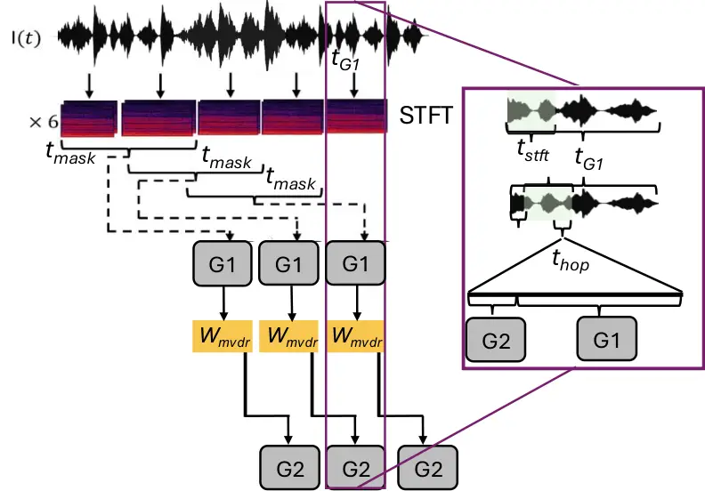
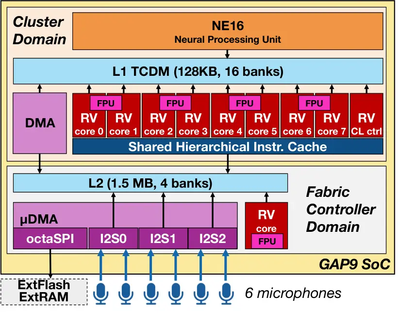
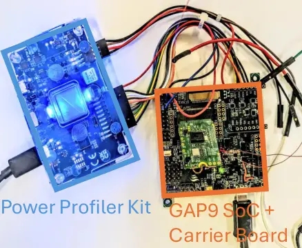
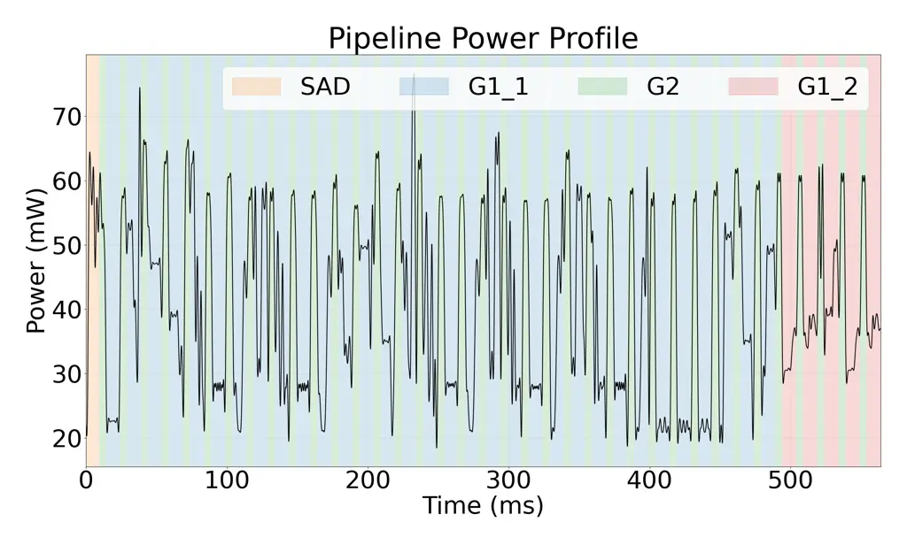

# Transformer-based Neural Beamforming for Real-Time Speech Enhancement on Smart Low-Power Hearable Devices

Luca Bompani Affiliation: Electrical, Electronic and Information
Engineering (DEI), University of Bologna, Italy    Marco Fariselli   
Giovanni Oltrecolli Affiliation: Electrical, Electronic and Information
Engineering (DEI), University of Bologna, Italy    Francesco Conti
Affiliation: Electrical, Electronic and Information Engineering (DEI),
University of Bologna, Italy

###### Abstract

Accurate, efficient, and low-latency spatial beamforming is a key
component in emerging smart hearable devices, enhancing speech while
suppressing noise and interference. However, handling multiple input
sources under strict real-time constraints pose significant challenges
for the low-power, resource-constrained microcontroller units (MCUs)
used in hearables. We present an optimized methodology for the real-time
execution of a neural-network-based minimum variance distortionless
response (MVDR) beamformer on MCUs. Using six microphones and a
three-stage mixed-precision scheme (float32 MVDR, int8 CNN, float16
Transformer), the pipeline pairs a CNN that estimates the MVDR weights
with a lightweight Transformer that applies a per-frame correction. By
time-slicing weight estimation with beamforming, it achieves a 15 ms
per-frame latency while refreshing a complete set of CNN-derived weights
every 564 ms. The deployed mixed-precision pipeline attains a short-time
objective intelligibility (STOI) of 97.65%, a scale-invariant
signal-to-noise ratio (SI-SNR) of 20.26 dB, and a wideband PESQ of 3.676
at an average power of 45.9 mW. A speech activity detection (SAD) module
(98.5% accuracy, 0.62 mJ per inference) bypasses the pipeline during
silence; under realistic deployment conditions, the system exceeds the
16 h all-day target on a 100 mAh battery, with an estimated lifetime of
up to $`\sim`$20 h. To our knowledge, this is the first real-time
multi-channel Transformer-based neural beamforming pipeline deployed on
an MCU-class device.

###### Index Terms: 

beamforming, speech enhancement, MCU, real-time, Transformers

## I Introduction

Speech enhancement (SE) is a critical component in hearable devices, as
it not only improves user communication by attenuating environmental
noise but also enhances the reliability of interactions with
voice-activated AI assistants. Most existing approaches operate on
single-channel inputs, since multi-channel processing imposes
substantially higher computational and memory demands \[1, 2, 3, 4\].
Despite this cost, multi-channel SE methods that use a microphone array,
such as neural beamforming \[5\], offer clear advantages: they suppress
background noise more effectively and, importantly, preserve the spatial
cues of the acoustic scene, maintaining the directionality of the target
signal \[6\]. These properties are particularly relevant for hearables,
where intelligibility and localization are central to the user
experience.

At the same time, hearable devices are constrained by limited size and
battery capacity, as they must fit unobtrusively inside or behind the
ear. These devices can only accommodate a small battery, which in turn
caps the power available to the processing electronics and limits
all-day operation and real-time performance. In practice, sustaining
several hours of continuous operation on a hearing-aid-class battery
limits the power budget to the order of 100 mW \[7\]. Such constraints
can only be met by microcontroller-class processors, which usually offer
just a few MB of on-chip memory and a few billion multiply-accumulate
(MAC) operations per second (GMAC/s), demanding careful co-design of the
algorithm and its hardware mapping.

This work extends our previous single-branch neural beamformer \[8\], in
which a single convolutional neural network (CNN) estimated the MVDR
weights, by introducing a hybrid architecture that separates the
estimation of the slowly varying acoustic scene from fast, per-frame
adaptation. A CNN estimates spectral masks used to compute minimum
variance distortionless response (MVDR) beamforming weights,
complex-valued per-frequency coefficients that, applied to the
multi-channel short-time Fourier transform (STFT) of the microphone
signals, perform spatial filtering to suppress noise while preserving
the target direction, and a lightweight Transformer \[9\] produces an
additive per-frame correction to those weights. Because the CNN captures
the near-stationary structure of the audio scene, its output can be held
over longer intervals; this lets the most demanding block of our
pipeline, the CNN itself, run at a lower frequency, thus achieving
higher energy efficiency, with no loss of quality.

The pipeline runs in a three-stage mixed-precision scheme: the MVDR
stage is retained in float32 for numerical stability, the CNN is
quantized to int8 and offloaded to the GAP9 NE16 accelerator, and the
Transformer exploits the platform’s native float16 SIMD instructions. To
meet the strict latency budget of our real-time constraint (15 ms), we
interleave execution: the lightweight Transformer correction and
beamforming run every frame to produce enhanced output in real time,
while the heavier CNN weight estimation is amortized across many frames.
The Transformer thus supplies fine-grained per-frame adaptability within
a slower CNN update cycle. We further integrate an efficient speech
activity detection (SAD) module to suppress computation during silence.
We evaluate the pipeline on GAP9, an ultra-low-power RISC-V SoC, across
both algorithmic accuracy and hardware deployment metrics, demonstrating
real-time operation while preserving enhancement quality and extending
advanced multi-channel SE to wearable microcontroller-class devices. Our
main contributions are summarized as follows:

- •
  We propose a hybrid CNN–Transformer neural beamforming architecture in
  which a lightweight causal Transformer produces an additive per-frame
  correction to MVDR beamforming weights from raw six-channel STFT
  input, extending our prior single-CNN beamformer with inference-time
  adaptability and a separation of temporal scales that improves both
  accuracy and deployment efficiency.
- •
  We deploy the pipeline under a three-stage mixed-precision scheme: a
  int8 CNN on the NE16 accelerator, a float16 Transformer exploiting the
  SoC’s native SIMD, and a float32 MVDR for numerical stability.
- •
  We deploy the complete pipeline on the GAP9 ultra-low-power SoC
  through hardware-aware optimization beyond the standard toolflow,
  achieving real-time operation with all-day autonomy on a 100 mAh Li-Po
  battery.

On the VoiceBank dataset \[10\], the proposed system achieves a STOI of
98.01% and a PESQ-WB of 3.768 at 24.2 mJ per inference. On a 100 mAh,
3.7 V battery representative of a behind-the-ear hearable, assuming
speech activity 30% of the time \[11\] and including six 0.9 mW MEMS
microphones as a conservative upper bound, the system sustains more than
20 h of continuous operation. To our knowledge, this is the first
real-time multi-channel Transformer-based neural beamforming pipeline
deployed directly on an MCU-class device. code avaiable
at https://github.com/Bomps4/Minimal_beamforming_Transformer.

## II Related Work

Speech enhancement algorithms deployed on MCUs have predominantly relied
on single-channel recurrent neural networks (RNNs). An early example is
TinyLSTM \[12\], deployed on the STM32F746VE microcontroller, where the
authors start from baseline LSTM-based SE architectures and
progressively compress them through structured pruning of hidden units,
skipping RNN state updates, and 8-bit quantization of weights and
activations. Employing training-aware quantization to reduce the
degradation introduced by quantization. Another representative solution
is given by the NNoM framework \[13\], which demonstrates the deployment
of the RNNoise \[14\] model on a single-core ARM Cortex-M MCU. Owing to
its compact GRU layers, roughly 87k parameters, and carefully
constrained activation ranges, RNNoise can be effectively quantized to 8
bits with minimal loss in quality. Both of these approaches, however,
are limited to relatively simple mono-core MCUs. In contrast, more
recent work has explored multi-core MCUs such as GAP9. For instance,
Rusci et al. \[15\] introduced a mixed-precision deployment scheme that
quantizes recurrent layer parameters and activations to int8, while
retaining float16 precision for other tensors. This strategy achieves an
almost lossless deployment, with only a 0.007 degradation in STOI.

Despite these advances, all of the above methods remain restricted to a
single-channel SE, and none address the more challenging problem of
deploying multi-channel, beamforming-based SE pipelines under MCU-class
resource constraints. More recently, several neural architectures have
been proposed for multichannel SE \[16, 17, 18, 19\]. These approaches
span a broad design space, from UNet-like encoder–decoder
structures \[19\] to Transformer-based models \[16, 17, 18\], and
demonstrate strong denoising capabilities. However, despite their
promising accuracy and, in some cases, computational requirements
comparable to those of our pipeline  \[16\], none of these methods have
yet been deployed on real hardware platforms. Conversely, in this paper
we present an end-to-end deployed solution. This brings multichannel SE
with beamforming into an MCU-class device under realistic deployment
constraints.

Finally, we also report the work of Wanget al.\[20\]. They do not use
the MVDR beamformer for speech enhancement, but rather use it to
estimate the position of a sound source. They report taking 1.5 seconds
to run the MVDR algorithm (6.5$`\times`$ slower than our weight
estimation step) falling short of real-time on a 200 MHz PIC32MZ
microcontroller.

## III Methods

In the following paragraphs, we describe the beamforming algorithm,
according to the dataflow shown in Fig. 1, from the multichannel audio
input to the enhanced output. After conversion to the time-frequency
domain, the pipeline is divided into two main stages. G1 estimates the
beamforming weights and consists, following the implementation of
Ceolini et al. \[21\], of a neural mask-estimation stage (G1_1) followed
by MVDR weight computation (G1_2). G2 then applies the estimated weights
to produce the enhanced signal. We augment this formulation by adding a
Transformer network to directly predict a correction to the MVDR
weights.

### III-A Signal model and CNN neural beamforming

Fig. 1: Block diagram view of the elements in our neural beamforming
application.

We consider a single target speech source captured by $`M`$ microphones
in the presence of noise. Following the signal model adopted by Ceolini
et al. \[21\], the signal at microphone $`m`$ is modeled as

```math
y_{m}(t)=s(t)*r_{m}(t)+k_{m}(t), \tag{1}
```

where $`s(t)`$ is the clean speech signal, $`r_{m}(t)`$ is the room
impulse response, $`k_{m}(t)`$ is the additive noise, and $`*`$ denotes
convolution.

Under the narrowband approximation \[22\], applying the short-time
Fourier transform (STFT) \[23\] gives

```math
Y_{m}(\omega,n)=S(\omega,n)R_{m}(\omega,n)+K_{m}(\omega,n), \tag{2}
```

where $`\omega`$ denotes the frequency bin and $`n`$ the frame index. In
the following, we denote by $`t_{\mathrm{stft}}`$ the amount of audio
covered by each STFT window and by $`t_{\mathrm{hop}}`$ the stride
between consecutive windows, both expressed in milliseconds.

We perform speech enhancement using a minimum-variance distortionless
response (MVDR) beamformer, which minimizes interference while
preserving the target signal. Rather than estimating an explicit
steering vector, the adopted formulation derives the beamforming weights
from the spatial covariance matrices of speech and noise \[24\]. Since
the speech and noise components are not observed separately, these
covariance matrices cannot be computed directly. G1, therefore, first
employs a neural network to estimate speech and noise masks from the
STFT of a reference microphone (G1_1). The two masks are then used
together with the multichannel STFT observations to estimate the speech
and noise covariance matrices and compute the MVDR weights (G1_2).

For mask estimation, we employ the compact CNN referred to as MUDV4 C4
512 in \[21\]. The network operates on the STFT representation of a
single reference microphone, G1_1 in Figure 1. Since the STFT
coefficients are complex-valued, each coefficient is decomposed into its
real and imaginary components, which are stacked as two real-valued
channels. This Cartesian representation is a linear bijection between
$`\mathbb{C}`$ and $`\mathbb{R}^{2}`$ and, unlike a magnitude-phase
representation, does not introduce a nonlinear coordinate
transformation.

The CNN, whose design we take from  \[21\], consists of a fully
connected layer that expands the input dimensionality, followed by a
stack of dilated 2-D convolutions with residual connections, PReLU
activations, and normalization layers. A final projection produces a
single-channel speech mask

```math
M_{ss}\in\mathbb{R}^{F\times N}, \tag{3}
```

where $`F`$ is the number of frequency bins and $`N`$ the number of STFT
frames processed by the network. The corresponding noise mask is
obtained as

```math
M_{nn}=1-M_{ss}. \tag{4}
```

Avoiding a separate output head for the noise mask, together with the
small number of convolutional features, limits the network to
approximately 20 k parameters. Nevertheless, because the network
operates on one second of audio, a complete inference requires
approximately 342 MMACs.

The masks estimated by G1_1 are combined with the multichannel STFT
observations to estimate the spatial covariance matrices for speech and
noise. Denoting the multichannel observation at frequency $`\omega`$ and
frame $`n`$ by

```math
\mathbf{Y}(\omega,n)=[Y_{1}(\omega,n),\ldots,Y_{M}(\omega,n)]^{T}, \tag{5}
```

the covariance matrices are computed as

```math
\mathbf{\Phi}_{vv}(\omega)=\sum_{n=1}^{N}M_{vv}(\omega,n)\mathbf{Y}(\omega,n)\mathbf{Y}^{H}(\omega,n),\qquad vv\in\{ss,nn\}, \tag{6}
```

where $`(\cdot)^{H}`$ denotes the Hermitian transpose.

G1_2 then computes the minimum-variance distortionless response (MVDR)
beamforming weights. The MVDR beamformer minimizes interference energy
while preserving the target signal. Following the formulation of \[24\]
we get

```math
\mathbf{w}_{\mathrm{MVDR}}=\frac{\mathbf{\Phi}_{nn}^{-1}\mathbf{\Phi}_{ss}}{\operatorname{tr}\left(\mathbf{\Phi}_{nn}^{-1}\mathbf{\Phi}_{ss}\right)}, \tag{7}
```

where $`\mathbf{\Phi}_{nn}`$ and $`\mathbf{\Phi}_{ss}`$ denote the noise
and speech spatial covariance matrices, respectively, and
$`\operatorname{tr}(\cdot)`$ denotes the trace. This completes the
weight estimation performed by G1.

### III-B Transformer-based beamforming weight correction

To improve the adaptability of the estimated beamforming weights at
inference time, we introduce a lightweight Transformer network in the
Beamforming block (G2) that produces a causal, additive correction to
the MVDR weights. The correction is estimated directly from the raw
multi-channel STFT input, without access to the CNN’s internal
representations or the MVDR-computed weights. The input to the
correction network is formed by stacking the STFT of the current and
previous frames across all M microphones. Each frame is decomposed into
real and imaginary parts, yielding an input tensor of shape
F$`\times`$D, where F is the number of frequency bins and
D$`=2\cdot 2\cdot M`$ is the model dimension, accounting for two frames,
two components (real and imaginary), and M microphones. In our case
M$`=6`$, giving D$`=24`$.

The network consists of two stages. First, a 1D convolutional layer
applied along the frequency axis processes the input tensor, extracting
local frequency-domain patterns while preserving the model dimension D.
Second the output is then fed into a single Multi-head Attention encoder
layer with H$`=`$ 2M $`=`$ 12 attention heads, treating the frequency
bins as the sequence dimension. Each attention head therefore operates
on a subspace of dimension $`{\text{D}}/{\text{H}}=2`$, corresponding to
one real-imaginary pair per microphone per frame. The outputs of all
heads are concatenated, recovering the full model dimension D, and
passed through a linear projection layer that maps the representation to
a complex-valued correction tensor of shape F $`\times`$ M, matching the
shape of the MVDR beamforming weights. The correction is added directly
to the MVDR weights prior to their application to the STFT frames:

```math
w_{\text{final}}(\omega)=w_{\text{MVDR}}(\omega)+\Delta w(\omega), \tag{8}
```

where $`w_{\text{MVDR}}`$($`\omega`$)$`\in\mathbb{C}^{M}`$ are the
weights produced by the CNN-MVDR pipeline and $`\Delta w`$($`\omega`$)
$`\in\mathbb{C}^{M}`$ is the correction output by the Transformer. The
corrected weights $`w_{\text{final}}`$($`\omega`$) are then normalized
and applied to the multi-channel STFT as described in the previous
section.

### III-C Speech Activity Detection (SAD) network

In the absence of speech, estimating speech–noise masks is an
ill-defined task; to avoid performing it, we introduce a lightweight SAD
network that skips mask estimation and beamforming entirely when no
speech is detected. The network is a 1-D ResNet-8 \[25\] operating on
the raw waveform prior to the STFT, composed of an initial convolution,
three residual blocks (the first without a pointwise convolution in the
skip path), ReLU activations, a global max-pooling layer, and a fully
connected head yielding a binary speech/non-speech decision. Although it
has 7.6k more parameters than the G1 CNN network (27.6k in total), it is
far cheaper to run, requiring $`6\times`$ fewer operations than the full
speech-enhancement pipeline (76 MMACs), and its structure has been tuned
to be efficiently executed on our platform, thereby avoiding substantial
latency increase during normal operation.

### III-D Interleaved execution strategy



Fig. 2: Execution schedule of our proposed neural beamforming pipeline.

The processing pipeline described so far comprises speech activity
detection (SAD), STFT computation, MVDR weight estimation,
Transformer-based weight correction, beamforming, and inverse STFT. If
executed sequentially at every processing pass, the full pipeline would
require 443.6 million MACs. Of this total, the SAD network accounts for
76 MMACs, while the speech-enhancement path accounts for the remaining
367.6 MMACs.

Within the speech-enhancement path, the STFT is first computed over the
six input channels, requiring 7.7 MMACs. The resulting multi-channel
spectral representation is then consumed by two subsequent processing
stages. The first stage, denoted as G1, estimates the MVDR beamforming
weights. It consists of the CNN-based mask estimator, G1_1, which
requires 342 MMACs, followed by the MVDR weight computation, G1_2, which
requires an additional 12 MMACs. Overall, G1 requires 354 MMACs, making
it by far the dominant computational component of the pipeline.

The second stage, denoted as G2, performs the operations required to
produce the enhanced output for each frame. In contrast to G1, G2 is
comparatively lightweight, requiring only 5.9 MMACs. Of these, 5.7 MMACs
are due to the Transformer-based weight correction, while the remaining
approximately 0.2 MMACs are due to the weighted summation and inverse
STFT.

The higher computational requirements of G1 motivate the introduction of
our interleaved execution strategy. As illustrated in Figure 2,
execution begins by buffering the required number of audio samples
($`\textit{t}_{\textit{mask}}`$) to compute the initial set of
beamforming weights. Once the first set of weights has been obtained, we
call the time necessary for this computation
$`\textit{t}_{\textit{G1}}`$, the system transitions into the
interleaved regime: at each hop ($`\textit{t}_{\textit{hop}}`$), the
current weights along with the transfomer produced correction are
applied to perform beamforming along with the inverse STFT (G2), while
the remaining computational budget within the same hop is used to
advance G1. In this manner, G1 progresses incrementally, typically one
neural network layer at a time, until the next set of weights is ready.
Crucially, although the full computation of new weights requires
$`\textit{t}_{\textit{G1}}`$, the execution of the G2 continues without
interruption during this period, ensuring that enhanced outputs are
generated in real time while weight estimation proceeds concurrently in
the background.

#### III-D1 Hardware platform & deployment

We deploy our neural beamforming application on the GAP9 SoC from
GreenWaves Technologies, see Figure 3. GAP9 is a low-power heterogeneous
platform that combines a RISC-V host (FC) core with 1.5 MB of scratchpad
L2 memory and a cluster (CL) of 9 RISC-V cores, supported by the NE16
neural engine accelerator and 4 floating-point units (FPUs). The host
and cluster cores run at up to 370 MHz at 0.80 V; both the supply
voltage and the clock frequency are configurable in software, with an
energy-optimal operating point at 240 MHz and 0.65 V. The cores feature
vector MAC instructions capable of performing 4$`\times`$8-bit dot
products per cycle, while the NE16 integrates 9$`\times`$9 $`\times`$16
8$`\times`$ 1-bit MAC units, sustaining up to 150 8-bit MAC operations
per cycle, about 5 $`\times`$ faster than the cores alone. The cluster
also provides a 128 kB single-cycle L1 scratchpad memory, complemented
by DMA engines that efficiently manage transfers to the larger L2 memory
and to external memories (32 MB RAM and 64 MB FLASH connected via
octaSPI).

We deploy our networks on the device using the GapFlow toolchain. Since
GapFlow does not provide optimized kernels for the attention mechanism
of Transformer layers, we implemented a custom attention kernel,
tailored to the cluster architecture and exploiting the float16 SIMD
capabilities of the FPUs, to efficiently execute the weight-correction
Transformer within the real-time budget.

As the beamforming pipeline requires six input spectrograms to run,
storing all of them in L2 would consume 800 kB of memory, impeding the
execution of G1*1. Since the six spectrograms are only needed from the
MVDR step onward, we keep them in the larger external RAM. To maximize
the efficiency of our most critical component, G2, we retain a buffer in
the faster L2 memory that holds data for each of the six microphones,
each storing up to $`2\times\textit{t}*{\textit{stft}}`$ of audio for
the G2 block.



Fig. 3: Simplified architecture of the GAP9 SoC in the investigated
configuration.



Fig. 4: Experimental setup

## IV Experimental Results

We evaluate the proposed neural beamforming pipeline on GAP9 across
memory, quantization, performance, and energy efficiency, and compare it
with state-of-the-art speech enhancement systems deployed on an MCU.

### IV-A Setup & model training

We evaluate our approach using a simulated multi-microphone scenario of
a single speaker in a reverberant environment with diffuse noise, which
we simulate using gpurir \[26\]. For beamforming experiments, following
the work of \[27\], we adopt the Voice Bank + DEMAND (VBD)
dataset \[28\]. The training set is generated by mixing clean speech
from 28 speakers of the Voice Bank corpus \[10\] with 10 types of noise
from the DEMAND corpus \[29\] at four signal-to-noise ratio (SNR) levels
(0, 5, 10, and 15 dB).

The test set uses the remaining 2 speakers and 5 noise types unseen
during training, mixed at SNR values of 2.5, 7.5, 12.5, and 17.5 dB. All
signals are sampled at 8 kHz following  \[21\]. For each sample, we
select a room size whose dimension are defined by uniforms distribution
over width, height and depth $`U(3,6)\times U(3,6)\times U(3,6)`$
meters, a reverberation time $`T_{60}\sim U(0.2,0.8)`$ seconds, one
noise recording, and the positions of six microphones and the source,
without imposing constraints on their relative distances. Following the
original implementation \[21\], the network is trained using the
scale-invariant signal-to-distortion ratio between the undistorted
signal and the one reconstructed by the beamforming pipeline. We use the
Adam optimizer, a learning rate of $`10^{-4}`$, and early stopping with
a patience of 2 epochs for regularization. The capabilities of our
pipeline are measured using the STOI \[30\] and ESTOI \[31\] metric for
intelligibility, while we use SI-SNR \[32\] and PESQ-wideband \[33\] to
measure audio quality.

For the SAD experiments, we start from the 121 noise types available by
combining the NoiseX-92 \[34\] dataset and DEMAND. To further enrich the
variability of background conditions, we augment the noise by
introducing composite noise types that mix pairs of noises drawn from
the two corpora, leading, in principle, to up to $`121\times 60`$
possible combinations. Together with the Voice Bank speech corpus, this
yields a dataset with the following statistics: training set of 15,034
samples (40.14% noise, 59.86% speech+noise), validation set of 1,726
samples (42.06% noise, 57.94% speech+noise), and test set of 1,300
samples (38.46% noise, 61.54% speech+noise). All signals are sampled at
8 kHz to be consistent with the beamforming pipeline. To train the SAD,
we use the Adam optimizer with a learning rate of $`10^{-4}`$ and a
binary cross-entropy loss. We evaluate the results on the test set,
reporting accuracy, precision, and recall; the latter is particularly
important, as a false negative means that the current speech would be
completely ignored by the entire pipeline.

Following the work of Ceolini \[21\], all experiments use an STFT window
length of $`\textit{t}_{\textit{stft}}=64`$ ms and hop size of
$`\textit{t}_{\textit{hop}}=15`$ ms. Each input sequence spans 1 s of
audio, corresponding to the total duration processed by the network
($`\textit{t}_{\textit{mask}}`$). For deployment on the GAP9 platform,
buffer sizes are determined directly from these time windows and the
signal’s data rate. The energy measurement have been performed using the
Nordic Power Profiler Kit, see Figure 4 for our experimental setup.

### IV-B Baselines

|                   |                   |                   |                    |                   |
| ----------------- | ----------------- | ----------------- | ------------------ | ----------------- |
| Model             | STOI (%)          | ESTOI (%)         | PESQ-WB            | SI-SNR (dB)       |
| Noisy             | 92.38 $`\pm`$0.28 | 86.97 $`\pm`$0.33 | 2.609 $`\pm`$0.034 | 10.15 $`\pm`$0.13 |
| CNN               | 94.19 $`\pm`$0.23 | 89.95 $`\pm`$0.47 | 2.947 $`\pm`$0.041 | 17.70 $`\pm`$0.31 |
| Transformer       | 95.98 $`\pm`$0.12 | 91.96 $`\pm`$0.17 | 3.262 $`\pm`$0.013 | 19.79 $`\pm`$0.10 |
| CNN + Transformer | 98.04 $`\pm`$0.07 | 95.52 $`\pm`$0.12 | 3.747 $`\pm`$0.018 | 22.02 $`\pm`$0.12 |

Table I: Speech enhancement performance of the CNN, Transformer, and
hybrid Transformer + CNN architectures, with the unprocessed noisy input
as reference. Values are mean $`\pm`$ std.

Table I evaluates our complete pipeline against the unprocessed noisy
input, which serves as reference. The pipeline raises SI-SNR from 10.15
to 22.02 dB (+11.87 dB), PESQ-WB from 2.61 to 3.75 (+1.14), STOI from
92.38 to 98.04, and ESTOI from 86.97 to 95.52.

To isolate the contribution of each stage, we evaluate the CNN and
Transformer independently. In isolation, the CNN operates as in the full
pipeline, estimating the masks which are used to derive the MVDR
weights, whereas the Transformer predicts the beamforming weights
directly; in the combined pipeline, it instead predicts a per-frame
correction to the MVDR weights.

As shown in Table I, their combination improves all metrics: +2.23 dB
SI-SNR, +3.56 ESTOI, +2.06 STOI, and +0.49 PESQ-WB over the standalone
Transformer, and +4.32 dB SI-SNR, +5.57 ESTOI, +3.85 STOI, and +0.80
PESQ-WB over the standalone CNN. Their composition requires no
additional fusion or projection layers, so these gains are achieved
without increasing model capacity.

The two stages operate on different temporal scales of the same STFT
representation. The CNN, via stacked causal convolutions, integrates a
receptive field of one second, capturing the slowly varying,
near-stationary structure of the scene, noise statistics and spatial
configuration. The Transformer, instead, operates over a short
($`\sim`$30 ms) window, giving it the flexibility to track fast
spectro-temporal details.

### IV-C Mixed-precision quantization

To reduce the memory footprint and computational cost of our deployed
application, we convert the trained float32 model into reduced-precision
formats (float16 or int8) using GAPflow’s post-training quantization
procedure, calibrating the quantization ranges on a randomly selected
subset of the training data. For on-device reproducibility, we fix the
random noise realisation so that all configurations are evaluated on an
identical input; under this fixed noise the noisy reference scores STOI
92.02%, ESTOI 86.21%, PESQ-WB 2.609, and SI-SNR 10.02 dB. The fully
float32 model raises these to STOI 98.01%, ESTOI 95.49%, PESQ-WB 3.768,
and SI-SNR 21.90 dB. Reduced precision affects the pipeline unevenly.
The neural components are robust: quantizing the CNN to int8 incurs only
marginal degradation (STOI 97.98%, ESTOI 95.42%, PESQ-WB 3.760, SI-SNR
21.54 dB), and quantizing the Transformer to float16 produces no
measurable change in any metric.

The MVDR beamforming stage, in contrast, is highly sensitive: it relies
on covariance estimation and matrix inversion, which are numerically
ill-conditioned \[35\], and quantizing it to int8 collapses the output
entirely, while even float16 degrades intelligibility below that of the
noisy input. We therefore retain the MVDR and beamforming stage (G1_2
and G2 weighted summation) in float32 in all configurations and apply
reduced precision only to the neural components.

### IV-D Latency Constraint on Weight Estimation

Fig. 5: Effect of the delay on the STOI and SI-SNR metrics. The extrema
indicate the cases where there is no delay and where the CNN estimation
is performed only once for the full utterance.

Before deploying the pipeline in the interleaved configuration described
in Section III-D, we evaluate the system’s tolerance to delays between
weight estimation and beamforming. As shown in Figure 5, holding the
CNN-derived weights fixed over a longer interval within a single
utterance yields better enhancement than continuously re-chasing the
estimate at every frame: quality improves monotonically as the hold
interval lengthens, and a single estimate held for the whole utterance
is optimal. This tolerance, however, does not justify estimating the
weights once and freezing them indefinitely. The per-utterance optimum
reflects the within-utterance stationarity of the acoustic scene; across
utterances the scene changes, a different speaker, a moved source, so
the weights must be refreshed to track these transitions. The system
must therefore continuously process the input stream and produce updated
weights at a rate that keeps pace with the incoming audio. This imposes
a latency constraint on G1: its effective weight-production interval
must not exceed the span of audio it consumes per update, so that lag
does not accumulate over a continuous stream.

Fig. 6: (left) Buffer memory allocation and data flow in GAP9 SoC.
(right) Beamforming pipeline resource allocation and scheduling in the
various execution phases.

### IV-E Deployment on GAP9 SoC

As established in the previous section, each processing stage must
complete within the time span of the input signal it consumes. In the
case of the mask-estimation CNN, the input is one second of audio;
therefore, its execution time must be less than one second to sustain
continuous real-time operation. This requirement rules out
floating-point deployment on the target platform. Even when operating at
the maximum clock frequency of 370 MHz, the CNN alone requires
approximately 1.1 s in float16 to process one second of audio.

Quantization to int8 is therefore required for real-time operation. In
this configuration, software execution on the general-purpose cores
still requires 176.2 M cycles for the mask estimator, corresponding to
476 ms at the maximum 370 MHz operating frequency. Offloading the same
computation to the NE16 accelerator, Figure  6, reduces the cost to 74 M
cycles, yielding a 2.38$`\times`$ reduction and lowering the measured
mask-estimation runtime to 203 ms.

The second block, G2, must instead respect the application’s per-frame
latency constraint (15 ms), since it executes on every output frame: it
applies the Transformer correction to the MVDR weights, performs the
weighted summation, and computes the inverse STFT.

#### IV-E1 Transformer Deployment

The Transformer deployment code generated by NNTool required
approximately 9.25 million cycles per execution and a total of 1.1 MB of
L2 memory together with 400 kB of off-chip L3 memory, exceeding both the
execution-time and memory budgets of the target platform. The reliance
on L3 memory, in particular, significantly increased execution time due
to higher access latency than on-chip memories. The reliance on the
external memory was due to the explicit materialization of the complete
(F $`\times`$ F) attention-score matrix, where (F) is the number of
frequency bins used as the sequence dimension ((F=257) in our case). We
have implemented a series of optimizations to overcome the limitation of
the NNtool’s baseline implementation; a summary of the optimizations is
reported in Table II.

A first refinement targeted the attention mechanism’s memory footprint
by restructuring the computation across attention heads. Instead of
materializing the full attention tensor for all heads simultaneously,
the computation was serialized over the head dimension, such that only
one (F $`\times`$ F) attention matrix is instantiated at a time. This
approach reduces peak memory usage compared to the baseline
implementation and lowers the execution time to approximately 3.70
million cycles. However, it still requires an additional L2 buffer of
(132, kB). Given that G1 already occupies most of the available memory,
this configuration exceeds the GAP9 L2 memory budget.

To address this limitation, the attention computation was reorganized so
that each core processes a single score row at a time, avoiding the need
to materialize the entire matrix for any head. The query-key product,
softmax, and score-value product are evaluated as matrix-vector
operations. All intermediate scores fit within L1 memory, which serves
as temporary working memory and requires no additional L2 allocation.
This row-wise implementation reduced the execution time to approximately
2.22 million cycles while eliminating the need for an additional L2
buffer.

Further improvements were achieved by fusing the query-key product,
softmax, and score-value product into a single FlashAttention-inspired
kernel \[36\]. This fusion avoids intermediate loads and stores that
would otherwise occur when executing the operations as separate kernels.
The online (streaming) softmax used in standard FlashAttention was also
evaluated; however, it proved less efficient in this configuration
because the additional exponential evaluations increased pressure on the
four available FPUs. The final fused implementation retains one score
row in L1 and executes the complete Transformer in approximately 1.65
million cycles, bringing the full G2 to 1.85 million cycles

|                                            |                      |                       |
| ------------------------------------------ | -------------------- | --------------------- |
| Implementation                             | Cycles               | Attention buffers     |
| NNTool baseline, full attention matrix     | $`9.25\,\mathrm{M}`$ | 942 kB L2 + 400 kB L3 |
| Sequential heads, one full matrix per head | $`3.70\,\mathrm{M}`$ | 132 kB L2             |
| Row-wise attention in L1                   | $`2.22\,\mathrm{M}`$ | L1 only               |
| Fused row-wise attention kernel            | $`1.65\,\mathrm{M}`$ | L1 only               |

Table II: Transformer attention optimizations.

#### IV-E2 Full application Deployment

|                                            |                                            |                                             |
| ------------------------------------------ | ------------------------------------------ | ------------------------------------------- |
|                                            | Base                                       | Optimized                                   |
|                                            | (G1 @ 0.8 V, 370 MHz) (G2 @ 0.8 V, 370 MH) | (G1 @ 0.65 V, 240 MHz) (G2 @ 0.8 V, 370 MH) |
| G1 execution time \[ms\]                   | 244                                        | 379                                         |
|    STFT (fp32, 2.4 M cyc.)                 | 6.5                                        | 10                                          |
|    Mask est. (int8, NE16)                  | 203                                        | 315                                         |
|    MVDR (fp32, 13 M cyc.)                  | 35                                         | 54                                          |
| G2 execution time (fp16,fp32, 1.85 M cyc.) | 5                                          | 5                                           |
| Full pipeline \[ms\]                       | 366                                        | 564                                         |
| G2 executions per inference                | 24                                         | 37                                          |
| Total energy per inference: G1 \[mJ\]      | 13.2                                       | 8.95                                        |
| Total energy per inference: G2 \[mJ\]      | 10.98                                      | 16.9                                        |
| Active power, G1 \[mW\]                    | 54.1                                       | 23.8                                        |
| Active power, G2 \[mW\]                    | 90.0                                       | 90.0                                        |
| Average system power \[mW\]                | 66.1                                       | 45.9                                        |

Table III: Timing and energy comsumption on GAP9 under interleaved
execution. We report for G2 the total energy consumed by all executions
in the time it takes for a G1’s inference to be completed.

We now report the memory, timing, and energy budget of the final
implementation. As shown in Figure 6, G1 is the most memory-hungry
stage, occupying about 3.14 MB of L3 (including the multichannel audio
and its STFT) and about 920 kB of L2 during execution. Adding the
resident program code (313 kB), the G2 input buffers kept in L2 for fast
access (24 kB), the G1_1 and Transformer weights (33 kB), and the
Transformer working memory (157 kB) yields a peak L2 occupation of
1447 kB, within the 1.5 MB L2 of GAP9.

Table III summarizes the timing and energy of the full pipeline deployed
on GAP9. Execution follows a static time-sliced schedule: each 15 ms
frame allots 10 ms to the weight-estimation block G1 and 5 ms to the
enhancement block G2, so the per-frame latency is 15 ms by construction.
With the whole SoC at 0.8 V and 370 MHz, G1 requires 244 ms of
standalone compute, i.e., 24.4 frame slices, yielding a new set of
beamforming weights every 366 ms, while G2 processes every frame with
the most recently available weights. Each inference costs 24.2 mJ
(13.2 mJ for G1 and 0.45 mJ for each of the 24 interleaved G2 ); since
G1 and G2 are time-multiplexed rather than concurrent, the average power
draw is the duty-cycle-weighted mean of their active powers, 66.1 mW.

Our analysis, presented in Section IV-D showed, however, that slowing
the mask-estimation CNN does not degrade the speech enhancement quality:
G1 can therefore be executed in a slower but more efficient operating
point (0.65 V, 240 MHz), stretching its execution time time to 379 ms,
moving the inference of the whole pipeline to 564 ms, this is shown in
the power profile of our application Figure  7, but cutting G1’s energy
per inference from 13.2 to 8.95 mJ. The energy per inference of the full
pipeline remains essentially unchanged ($`\sim`$25.9 mJ), but each
inference now requires 564 ms, lowering the average power draw to
45.9 mW, a 31% reduction. This operating point is only viable thanks to
the NE16 accelerator: without it, G1 would require 796 ms of standalone
compute at 240 MHz, i.e., an effective inference period of $`\sim`$1.2 s
under the interleaved schedule, violating the 1-second constraint of
Section IV-D: G1 would produce weights more slowly than it consumes
audio, so its delay would grow over a continuous stream. Overall, the
pipeline achieves 97.65 STOI, 94.84 ESTOI, 3.676 PESQ-WB, and 20.26 dB
Si-SNR at an average power of 45.9 mW.



Fig. 7: Power profile of our application.

### IV-F System-Level Evaluation

We consider a hearable powered by a 100 mAh, 3.7 V Li-Po battery, with
an energy budget of approximately 1330 J. As a worst-case scenario, we
consider the pipeline running continuously, with G1 working
continuously. This is pessimistic, since the delay analysis above shows
that the weights can be held over an entire utterance with no loss.
Including the six MEMS microphones (0.9 mW each, 5.4 mW total), the
system draws 51.3 mW, yielding a battery lifetime of about 7.2 h, short
of the $`\sim`$16 h expected for full-day use. Holding the MVDR weights
and re-estimating them only once per second, while G2 continues on every
frame, reduces the G1 contribution to 8.95 mW, for a total of 44.4 mW
and about 8.3 h. We notice that in this configuration, the energy budget
is now dominated by the G2 executions (Table  III).

To close the remaining gap toward full-day operation, we duty-cycle the
pipeline, activating it only during speech, which occupies no more than
approximately 30% of the day on average \[11\]. A lightweight
speech-activity detector (SAD), executed once per G1 execution
($`\sim`$564 ms), gates the remainder of the pipeline. The SAD runs in
int8 precision and requires 2.6 M cycles per inference (29.1 MAC/cycle);
quantization does not degrade its detection performance, with the int8
model retaining 98.5% accuracy, 97.8% precision, and 99.9% recall.
Microphones and SAD remains on at all times, adding a constant power
draw of 6.64 mW (5.4 mW for the microphones and 1.24 mW for the SAD).
Gating is applied identically under both G1 inference schedules. With
continuous re-estimation during speech, the average draw is 20.3 mW,
giving about 18.2 h of lifetime; holding the weights and re-estimating
once per second lowers power consumption to 18.2 mW, about 20.3 h of
lifetime. Both configurations exceed the $`\sim`$16 h all-day target.

## V Comparison with State-of-the-Art

|                 |      |                   |     |               |                  |        |         |        |       |
| --------------- | ---- | ----------------- | --- | ------------- | ---------------- | ------ | ------- | ------ | ----- |
| Model           | Mpar | Quantization      | QAT | Device        | Deployment       | ms/inf | MAC/cyc | GMAC/J | STOI  |
| TinyLSTM \[12\] | 0.33 | INT8              | yes | STM32F746VE   | N/A              | 4.26   | 0.36    | 0.14   | N/A   |
| TinyLSTM \[12\] | 0.46 | INT8              | yes | STM32F746VE   | N/A              | 2.39   | 0.36    | 0.14   | N/A   |
| RNNoise \[14\]  | 0.21 | INT8              | yes | STM32L476     | NNoM w/ CMSIS-NN | 3.28   | 0.45    | 1.84   | N/A   |
| LSTM256 \[15\]  | 1.24 | MixFP16-INT8      | no  | 9-core RISC-V | GAPFlow          | 2.50   | 2.11    | 17.78  | N/A   |
| GRU256 \[15\]   | 0.98 | MixFP16-INT8      | no  | 9-core RISC-V | GAPFlow          | 1.70   | 2.41    | 17.46  | N/A   |
| TCN ts=4 \[37\] | 0.83 | INT8-BFP16        | no  | 9-core RISC-V | GAPFlow          | 4.3    | 3.3     | 28.90  | 93.36 |
| CNN Only \[8\]  | 0.20 | MixFP32-INT8      | no  | 9-core RISC-V | GAPFlow          | 3.8    | 3.10    | 20.20  | 94.19 |
| Ours            | 0.25 | MixFP32-FP16-INT8 | no  | 9-core RISC-V | GAPFlow          | 5      | 3.14    | 23.94  | 97.65 |

Table IV: Comparison with other MCU-deployed SE pipelines.

Table IV compares our solution with state-of-the-art speech enhancement
approaches on MCUs. The baselines include TinyLSTM \[12\], evaluated on
an STM32F7 MCU, and RNNoise \[14\], deployed on a low-power STM32L4
using the NNoM framework with a CMSIS-NN backend \[38\]. Both run on
single-core devices with 8-bit quantization, which proves effective
thanks to quantization-aware training (QAT) and model constraints that
limit the numerical range of intermediate activations. We further
compare against the GAP9-based GRU256 and LSTM256 of Rusci et
al. \[15\], and against the streaming TCN of Mirsalari et al. \[37\].

Unlike the single-channel baselines, our solution processes six input
streams while retaining part of its computation in float32. Despite this
more demanding setting, it is more efficient than all of them but the
streaming TCN of Mirsalari et al. \[37\]: it achieves up to
7.0$`\times`$, 8.7$`\times`$, 1.30$`\times`$, and 1.49$`\times`$ higher
throughput in MAC/cycle than RNNoise, TinyLSTM, GRU256, and LSTM256,
respectively, and larger gains still in energy efficiency (GMAC/J),
reaching 13.0$`\times`$, over two orders of magnitude, 1.37$`\times`$,
and 1.35$`\times`$ over the same baselines, enabled by our quantization
strategy together with the hardware accelerator. The multi-timestep
streaming TCN is the sole exception, exceeding our pipeline both in
utilization (3.3 vs. 3.14 MAC/cycle) and in energy efficiency
($`\sim`$28.9 vs. 23.94 GMAC/J, derived from the figures reported
in \[37\]). This efficiency advantage, however, comes with a
single-channel formulation that cannot exploit spatial information,
limiting the enhancement it can deliver. To quantify this limitation, we
reimplemented and retrained their network, the complete training
pipeline not being publicly released, and evaluated it on our dataset,
obtaining 93.36 STOI, 87.87 ESTOI, 3.032 PESQ-WB, and 18.83 dB SI-SNR,
upon which our six-channel pipeline improves by +4.29 STOI, +6.97 ESTOI,
+0.64 PESQ-WB, and +1.43 dB SI-SNR. The two designs thus occupy
complementary points on the quality-efficiency trade-off. Comparing
instead with our preliminary results \[8\], which correspond to the CNN
branch of our pipeline, see Section IV-B, our pipeline matches its
MAC/cycle throughput (1.01$`\times`$) while improving energy efficiency
by 1.19$`\times`$, despite the added Transformer, and achieves an
increase of +2.56 dB SI-SNR, +4.49 ESTOI, +3.46 STOI, and +0.74 PESQ-WB.

Finally, we compare our design principle against SlowFast \[27\], which
addresses the same task under an ultra-low-latency constraint but
reports no MCU deployment. For this reason we restrict the comparison to
the architecture. Both systems decompose processing into a slow branch
and a fast branch. The difference lies in the timescale assigned to the
slow branch. SlowFast frames the slow branch with a window of at most
20 ms and updates it every 10 ms in its largest-reuse configuration,
whereas our CNN integrates over roughly 1 s. The longer input sequence
makes our slow branch tolerant to delay, because the CNN estimates a
near-stationary representation of the acoustic scene, and its output
remains valid over long intervals. SlowFast reports monotonic
degradation in enhancement quality as the reuse factor grows, because
its short slow-branch window captures structure that varies on a fast
timescale. Our system shows the opposite behavior, and Figure 5 reports
the effect of the recomputation interval on STOI and SI-SNR. Tolerance
to stale beamforming weights is the property our deployment exploits,
enabling a low update rate for the most expensive block in the pipeline.

## VI Conclusions

By combining a compact CNN for mask estimation with an MVDR beamformer
and a lightweight Transformer that applies a per-frame correction to the
beamforming weights, and by introducing an interleaved execution
strategy together with three-stage mixed-precision quantization and a
lightweight SAD, we developed a multi-microphone neural beamforming
pipeline that executes in real time at 24.2 mJ per inference. The hybrid
architecture separates the slowly varying acoustic scene, which the CNN
and MVDR part of our pipeline captures, from fast per-frame adaptation,
which the Transformer handles; this separation improves enhancement
quality over the standalone Transformer and the CNN + MVDR baselines. We
show that the pipeline can leave the CNN-derived weights unrefreshed for
long intervals, allowing the most demanding block to operate at a
lower-energy point with no loss of quality. Under a realistic duty cycle
($`\sim`$70% non-speech), the pipeline sustains 20 hours of continuous
operation on a 100 mAh battery, including microphone power,
demonstrating its practicality for all-day use in hearable devices. To
the best of our knowledge, this is the first real-time, multi-channel,
Transformer-based neural beamforming pipeline to run directly on an MCU.

## Acknowledgment

The authors disclose the usage of AI algorithms for grammar checking.

## References

- \[1\] F. Chang, M. Radfar, A. Mouchtaris, and M. Omologo (2021)
  Multi-channel transformer transducer for speech recognition.
  pp. 296–300. External Links:
  [Document](https://dx.doi.org/10.21437/Interspeech.2021-655) Cited by:
  §I.
- \[2\] M. Ohlenbusch, C. Rollwage, and S. Doclo (2024) Multi-microphone
  noise data augmentation for DNN-based own voice reconstruction for
  hearables in noisy environments. pp. 416–420. External Links:
  [Document](https://dx.doi.org/10.1109/ICASSP48485.2024.10447066) Cited
  by: §I.
- \[3\] N. L. Westhausen, H. Kayser, T. Jansen, and B. T. Meyer (2024)
  Real-time multichannel deep speech enhancement in hearing aids:
  comparing monaural and binaural processing in complex acoustic
  scenarios. IEEE/ACM Trans. Audio, Speech and Lang. Proc. 32,
  pp. 4596–4606. External Links: ISSN 2329-9290,
  [Link](https://doi.org/10.1109/TASLP.2024.3473315),
  [Document](https://dx.doi.org/10.1109/TASLP.2024.3473315) Cited by:
  §I.
- \[4\] P. U. Diehl, H. Zilly, F. Sattler, Y. Singer, K. Kepp, M.
  Berry, H. Hasemann, M. Zippel, M. Kaya, P. Meyer-Rachner, A.
  Pudszuhn, V. M. Hofmann, M. Vormann, and E. Sprengel (2023) Deep
  learning-based denoising streamed from mobile phones improves
  speech-in-noise understanding for hearing aid users. Frontiers in
  Medical Engineering Volume 1 - 2023. External Links:
  [Link](https://www.frontiersin.org/journals/medical-engineering/articles/10.3389/fmede.2023.1281904),
  [Document](https://dx.doi.org/10.3389/fmede.2023.1281904), ISSN
  2813-687X Cited by: §I.
- \[5\] A. Li, W. Liu, C. Zheng, and X. Li (2022) Embedding and
  beamforming: all-neural causal beamformer for multichannel speech
  enhancement. In ICASSP 2022 - 2022 IEEE International Conference on
  Acoustics, Speech and Signal Processing (ICASSP), Vol. ,
  pp. 6487–6491. External Links:
  [Document](https://dx.doi.org/10.1109/ICASSP43922.2022.9746432) Cited
  by: §I.
- \[6\] J. Pan, P. Shen, H. Zhang, and X. Zhang (2024) Efficient
  multi-channel speech enhancement with spherical harmonics injection
  for directional encoding. In ICASSP 2024-2024 IEEE International
  Conference on Acoustics, Speech and Signal Processing (ICASSP),
  pp. 9561–9565. Cited by: §I.
- \[7\] M. Itani, T. Chen, A. Raghavan, G. Kohlberg, and S.
  Gollakota (2025) Wireless hearables with programmable speech ai
  accelerators. In Proceedings of the 31st Annual International
  Conference on Mobile Computing and Networking, ACM MOBICOM ’25, New
  York, NY, USA, pp. 863–877. External Links: ISBN 9798400711299,
  [Link](https://doi.org/10.1145/3680207.3765251),
  [Document](https://dx.doi.org/10.1145/3680207.3765251) Cited by: §I.
- \[8\] L. Bompani, G. Oltrecolli, M. Fariselli, and F. Conti (2026)
  High-efficiency neural beamforming for real-time speech enhancement on
  smart low-power hearable devices. In 2026 Design, Automation & Test in
  Europe Conference (DATE), Vol. , pp. 1–3. External Links:
  [Document](https://dx.doi.org/10.23919/DATE69613.2026.11539604) Cited
  by: §I, TABLE IV, §V.
- \[9\] A. Vaswani, N. Shazeer, N. Parmar, J. Uszkoreit, L. Jones, A. N.
  Gomez, Ł. Kaiser, and I. Polosukhin (2017) Attention is all you need.
  In Advances in Neural Information Processing Systems, I. Guyon, U. V.
  Luxburg, S. Bengio, H. Wallach, R. Fergus, S. Vishwanathan, and R.
  Garnett (Eds.), Vol. 30, pp. . External Links:
  [Link](https://proceedings.neurips.cc/paper_files/paper/2017/file/3f5ee243547dee91fbd053c1c4a845aa-Paper.pdf)
  Cited by: §I.
- \[10\] C. Veaux, J. Yamagishi, and S. King (2013) The voice bank
  corpus: design, collection and data analysis of a large regional
  accent speech database. In 2013 International Conference Oriental
  COCOSDA held jointly with 2013 Conference on Asian Spoken Language
  Research and Evaluation (O-COCOSDA/CASLRE), Vol. , pp. 1–4. External
  Links: [Document](https://dx.doi.org/10.1109/ICSDA.2013.6709856) Cited
  by: §I, §IV-A.
- \[11\] K. Smeds, S. Gotowiec, F. Wolters, P. Herrlin, J. Larsson,
  and M. Dahlquist (2020) Selecting scenarios for hearing-related
  laboratory testing. Ear and Hearing 41. External Links: ISSN
  1538-4667,
  [Link](https://\urlhttps://journals.lww.com/ear-hearing/fulltext/2020/11001/selecting_scenarios_for_hearing_related_laboratory.3.aspx)
  Cited by: §I, §IV-F.
- \[12\] I. Fedorov, M. Stamenovic, C. R. Jensen, L. Yang, A.
  Mandell, Y. Gan, M. Mattina, and P. N. Whatmough (2020) TinyLSTMs:
  efficient neural speech enhancement for hearing aids. In Interspeech,
  External Links:
  [Link](https://api.semanticscholar.org/CorpusID:218862718) Cited by:
  §II, TABLE IV, TABLE IV, §V.
- \[13\] A higher-level Neural Network library on Microcontrollers
  (NNoM) External Links:
  [Document](https://dx.doi.org/10.5281/zenodo.4158710),
  [Link](https://doi.org/10.5281/zenodo.4158710) Cited by: §II.
- \[14\] J. Valin (2017) A hybrid DSP/deep learning approach to
  real-time full-band speech enhancement. 2018 IEEE 20th International
  Workshop on Multimedia Signal Processing (MMSP), pp. 1–5. External
  Links: [Link](https://api.semanticscholar.org/CorpusID:21722177) Cited
  by: §II, TABLE IV, §V.
- \[15\] M. Rusci, M. Fariselli, M. Croome, F. Paci, and E.
  Flamand (2023) Accelerating RNN-based speech enhancement
  on a multi-core MCU with mixed FP16-INT8 post-training quantization.
  In Machine Learning and Principles and Practice of Knowledge Discovery
  in Databases, Cham, pp. 606–617. External Links: ISBN
  978-3-031-23618-1 Cited by: §II, TABLE IV, TABLE IV, §V.
- \[16\] H. Yan, J. Zhang, C. Jiang, and S. Zhang (2025) LABNet: a
  lightweight attentive beamforming network for ad-hoc multichannel
  microphone invariant real-time speech enhancement. External Links:
  2507.16190, [Link](https://arxiv.org/abs/2507.16190) Cited by: §II.
- \[17\] A. Kovalyov, K. Patel, and I. Panahi (2023) DFSNet: a steerable
  neural beamformer invariant to microphone array configuration for
  real-time, low-latency speech enhancement. In Proceedings of
  Interspeech 2023, pp. 2493–2497. External Links:
  [Document](https://dx.doi.org/10.21437/Interspeech.2023-882) Cited by:
  §II.
- \[18\] D. Lee and J. Choi (2024) DeFTAN-II: efficient multichannel
  speech enhancement with subgroup processing. IEEE/ACM Transactions on
  Audio, Speech, and Language Processing. Cited by: §II.
- \[19\] X. Ren, X. Zhang, L. Chen, X. Zheng, C. Zhang, L. Guo, and B.
  Yu (2021) A causal U-Net based neural beamforming network for
  real-time multi-channel speech enhancement. pp. 1832–1836. External
  Links: [Document](https://dx.doi.org/10.21437/Interspeech.2021-1457)
  Cited by: §II.
- \[20\] J. Wang, P. T. Le, S. Kuo, T. Tai, K. Li, S. Chen, Z. Wang, T.
  Pham, Y. Li, and J. Wang (2024) Audio pre-processing and beamforming
  implementation on embedded systems. Electronics 13 (14). External
  Links: [Link](https://www.mdpi.com/2079-9292/13/14/2784), ISSN
  2079-9292, [Document](https://dx.doi.org/10.3390/electronics13142784)
  Cited by: §II.
- \[21\] E. Ceolini and S. Liu (2019) Combining deep neural networks and
  beamforming for real-time multi-channel speech enhancement using a
  wireless acoustic sensor network. In 2019 IEEE 29th International
  Workshop on Machine Learning for Signal Processing (MLSP), Vol. ,
  pp. 1–6. External Links:
  [Document](https://dx.doi.org/10.1109/MLSP.2019.8918787) Cited by:
  §III-A, §III-A, §III-A, §III, §IV-A, §IV-A.
- \[22\] E. Vincent, T. Virtanen, and S. Gannot (2018) Audio source
  separation and speech enhancement. pp. . External Links: ISBN
  9781119279891, [Document](https://dx.doi.org/10.1002/9781119279860)
  Cited by: §III-A.
- \[23\] S. Markovich-Golan, W. Kellermann, and S. Gannot (2018) Spatial
  filtering. In Audio Source Separation and Speech Enhancement,
  pp. 189–217. External Links: ISBN 9781119279860,
  [Document](https://dx.doi.org/https%3A//doi.org/10.1002/9781119279860.ch10),
  [Link](https://onlinelibrary.wiley.com/doi/abs/10.1002/9781119279860.ch10),
  https://onlinelibrary.wiley.com/doi/pdf/10.1002/9781119279860.ch10
  Cited by: §III-A.
- \[24\] H. Erdogan, J. Hershey, S. Watanabe, M. Mandel, and J. Le
  Roux (2016) Improved MVDR beamforming using single-channel mask
  prediction networks. pp. 1981–1985. External Links:
  [Document](https://dx.doi.org/10.21437/Interspeech.2016-552) Cited by:
  §III-A, §III-A.
- \[25\] K. He, X. Zhang, S. Ren, and J. Sun (2016) Deep Residual
  Learning for Image Recognition. In Proceedings of 2016 IEEE Conference
  on Computer Vision and Pattern Recognition, CVPR ’16, pp. 770–778.
  External Links: [Document](https://dx.doi.org/10.1109/CVPR.2016.90),
  ISSN 1063-6919, [Link](http://ieeexplore.ieee.org/document/7780459)
  Cited by: §III-C.
- \[26\] D. Diaz-Guerra, A. Miguel, and J. R. Beltran (2021) gpuRIR: a
  python library for room impulse response simulation with GPU
  acceleration. Multimedia Tools Appl. 80 (4), pp. 5653–5671. External
  Links: ISSN 1380-7501,
  [Link](https://doi.org/10.1007/s11042-020-09905-3),
  [Document](https://dx.doi.org/10.1007/s11042-020-09905-3) Cited by:
  §IV-A.
- \[27\] L. Cheng, A. Pandey, B. Xu, T. Delbruck, V. Ithapu, and S.
  Liu (2025) Modulating state space model with slowfast framework for
  compute-efficient ultra low-latency speech enhancement. pp. 1–5.
  External Links:
  [Document](https://dx.doi.org/10.1109/ICASSP49660.2025.10889061) Cited
  by: §IV-A, §V.
- \[28\] H. Yen, F. Germain, G. Wichern, and J. Le Roux (2023) Cold
  diffusion for speech enhancement. pp. 1–5. External Links:
  [Document](https://dx.doi.org/10.1109/ICASSP49357.2023.10096064) Cited
  by: §IV-A.
- \[29\] J. Thiemann, N. Ito, and E. Vincent (2013) The diverse
  environments multi-channel acoustic noise database (DEMAND): a
  database of multichannel environmental noise recordings. The Journal
  of the Acoustical Society of America 133, pp. 3591. External Links:
  [Document](https://dx.doi.org/10.1121/1.4806631) Cited by: §IV-A.
- \[30\] C. H. Taal, R. C. Hendriks, R. Heusdens, and J. Jensen (2010) A
  short-time objective intelligibility measure for time-frequency
  weighted noisy speech. In 2010 IEEE International Conference on
  Acoustics, Speech and Signal Processing, Vol. , pp. 4214–4217.
  External Links:
  [Document](https://dx.doi.org/10.1109/ICASSP.2010.5495701) Cited by:
  §IV-A.
- \[31\] J. Jensen and C. H. Taal (2016) An algorithm for predicting the
  intelligibility of speech masked by modulated noise maskers. IEEE/ACM
  Transactions on Audio, Speech, and Language Processing 24 (11),
  pp. 2009–2022. External Links:
  [Document](https://dx.doi.org/10.1109/TASLP.2016.2585878) Cited by:
  §IV-A.
- \[32\] J. L. Roux, S. Wisdom, H. Erdogan, and J. R. Hershey (2019) SDR
  – half-baked or well done?. In ICASSP 2019 - 2019 IEEE International
  Conference on Acoustics, Speech and Signal Processing (ICASSP), Vol. ,
  pp. 626–630. External Links:
  [Document](https://dx.doi.org/10.1109/ICASSP.2019.8683855) Cited by:
  §IV-A.
- \[33\] PESQ (perceptual evaluation of speech quality) wrapper for
  python users External Links:
  [Document](https://dx.doi.org/10.5281/zenodo.6549559),
  [Link](https://doi.org/10.5281/zenodo.6549559) Cited by: §IV-A.
- \[34\] A. Varga and H. J.M. Steeneken (1993) Assessment for automatic
  speech recognition: II. NOISEX-92: a database and an experiment to
  study the effect of additive noise on speech recognition systems.
  Speech Communication 12 (3), pp. 247–251. External Links: ISSN
  0167-6393,
  [Document](https://dx.doi.org/https%3A//doi.org/10.1016/0167-6393%2893%2990095-3),
  [Link](https://www.sciencedirect.com/science/article/pii/0167639393900953)
  Cited by: §IV-A.
- \[35\] S. Zhao and D. Jones (2012) A fast-converging adaptive
  frequency-domain MVDR beamformer for speech enhancement. Vol. 3, pp. .
  External Links:
  [Document](https://dx.doi.org/10.21437/Interspeech.2012-523) Cited by:
  §IV-C.
- \[36\] T. Dao, D. Y. Fu, S. Ermon, A. Rudra, and C. Ré (2022)
  FLASHATTENTION: fast and memory-efficient exact attention with
  io-awareness. In Proceedings of the 36th International Conference on
  Neural Information Processing Systems, NIPS ’22, Red Hook, NY, USA.
  External Links: ISBN 9781713871088 Cited by: §IV-E1.
- \[37\] S. A. Mirsalari, M. Fariselli, L. Bijar, F. Paci, L. Benini,
  and G. Tagliavini (2025) Enabling real-time streaming temporal
  convolution network inference on ultra-low-power microcontrollers. In
  2025 IEEE Computer Society Annual Symposium on VLSI (ISVLSI), Vol. 1,
  pp. 1–6. External Links:
  [Document](https://dx.doi.org/10.1109/ISVLSI65124.2025.11130291) Cited
  by: TABLE IV, §V, §V.
- \[38\] L. Lai, N. Suda, and V. Chandra (2018) CMSIS-NN: efficient
  neural network kernels for arm Cortex-M CPUs. ArXiv abs/1801.06601.
  External Links:
  [Link](https://api.semanticscholar.org/CorpusID:691340) Cited by: §V.
