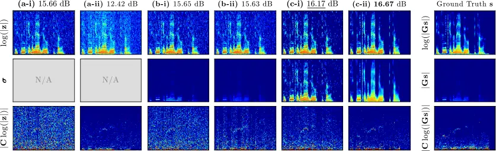

\CJKencfamily

UTF8mc\CJK@envStartUTF8

# Prox-friendly Log-magnitude prior on complex-valued signal

Kazuki Matsumoto    Keidai Arai    Kohei Yatabe ^(†)^(†)thanks: This
work was partly supported by JST FOREST Program (Grant Number
JPMJFR2330, Japan).

###### Abstract

The logarithmic transform is essential in audio signal processing since
human auditory perception is approximately logarithmic with respect to
magnitude. However, directly incorporating prior knowledge about signals
(e.g., harmonic structure) in the log-magnitude domain into optimization
problems solved by standard proximal splitting algorithms remains
challenging. To address this issue, this paper proposes a novel
regularizer termed EPILOG (Exponential Penalty for Imposing priors on
LOG-magnitude). EPILOG indirectly imposes prior knowledge on the
log-magnitude of a complex-valued signal through regularization of an
auxiliary variable that is shown to be linked with the log-magnitude.
Furthermore, we derive its variable-wise proximity operators and develop
a proximal splitting algorithm using these operators. Experiments on
speech dereverberation demonstrate the effectiveness of the proposed
regularizer, particularly in promoting cepstral-domain sparsity.

###### Index Terms: 

Log-magnitude spectrogram, cepstrum, proximity operator, alternating
direction method of multipliers (ADMM), speech dereverberation.

^(†)^(†)address: Tokyo University of Agriculture and Technology (TUAT),
Tokyo, Japan

## 1 Introduction

The _log-magnitude spectrogram_ serves as an essential time-frequency
representation in audio signal processing. It is constructed by applying
an element-wise logarithm to the magnitude of a complex-valued
spectrogram, which is obtained by the discrete Gabor transform (DGT)
\[1, 2\]. The log-magnitude is widely used because human auditory
perception exhibits an approximately logarithmic sensitivity to signal
magnitude \[3\]. Moreover, classical audio features, including the
cepstrum \[4\] and mel-frequency cepstral coefficients (MFCCs) \[5\],
are also based on log-magnitude representations, where a frequency
transform such as the discrete Fourier transform (DFT) or discrete
cosine transform (DCT) is applied to log-magnitude spectra. Thus, this
paper focuses on leveraging representations of the form
$`\mathbf{L}\log(|\mathbf{z}|)\in\mathbb{R}^{K}`$ within a signal
processing method, where $`\mathbf{L}\in\mathbb{R}^{K\times N}`$ is a
linear operator (e.g., DCT) and $`\mathbf{z}\in\mathbb{C}^{N}`$ is a
(vectorized) complex-valued spectrogram.

Optimization-based methods have been widely used in audio signal
processing, where regularization plays a key role in providing a
systematic way to incorporate prior knowledge of target signals into the
resulting algorithms. In particular, various structural properties of
audio signals in time-frequency domain, including low-rankness \[6, 7,
8\], smoothness \[9, 10, 11\], and harmonic structure \[12, 13\], have
been successfully utilized for many signal processing tasks.

Once such prior knowledge is introduced as a regularization term, an
algorithm for solving the associated problem is required. Proximal
splitting algorithms have been widely employed for this purpose \[14,
15, 16, 17, 18\], owing to their flexibility in handling a broad class
of optimization problems. However, directly imposing prior knowledge on
the log-magnitude, including sparsity of cepstrum, remains challenging
within this framework, since the composition of the log-magnitude
operation and a linear operator, as in $`\mathbf{L}\log(|\mathbf{z}|)`$,
complicates the derivation of proximal splitting algorithms.

To overcome this challenge, this paper proposes EPILOG (Exponential
Penalty for Imposing priors on LOG-magnitude), a regularization
technique for incorporating various prior knowledge in the log-magnitude
domain. Instead of directly regularizing the log-magnitude of a
complex-valued signal, EPILOG regularizes an auxiliary variable that is
linked with the log-magnitude, extending a recently developed
perspective-function-based method tailored to magnitude regularization
\[19, 20, 21, 22\]. Furthermore, we provide an example of promoting
cepstral-domain sparsity using EPILOG by imposing sparsity on the DCT
coefficients of the log-magnitude representation. In addition, we derive
the variable-wise proximity operators for the proposed regularizer and
develop an alternating direction method of multipliers (ADMM)–based
algorithm.

The main contributions of this paper are summarized as follows: (1) we
formulate the EPILOG regularizer to enable the incorporation of various
prior knowledge in the log-magnitude domain; (2) we derive the
variable-wise proximity operators for the EPILOG regularizer and develop
an ADMM-based algorithm using these operators; and (3) we demonstrate an
application of the proposed method in speech dereverberation,
experimentally confirming the effectiveness of the EPILOG regularizer
and cepstral-domain sparsity.

Notation: $`\mathbb{R}`$, $`\mathbb{R}_{+}`$, and $`\mathbb{C}`$ denote
the sets of all real numbers, nonnegative real numbers, and complex
numbers, respectively. Bold lowercase and uppercase letters represent
vectors and matrices, e.g.,
$`\mathbf{x}=(x_{n})_{n=1}^{N}\in\mathbb{R}^{N}`$ and
$`\mathbf{A}\in\mathbb{R}^{I\times J}`$, respectively. Operations
$`(\cdot)^{2}`$, $`|\cdot|`$, $`\sqrt{\cdot}`$, and $`\log(\cdot)`$ are
applied element-wise. The proximity operator for a function
$`F:\mathbb{R}^{N}\to\mathbb{R}\cup\{+\infty\}`$ and a parameter
$`\mu>0`$ is defined by
$`\operatorname{prox}_{\mu F}(\mathbf{u})\in\arg\min_{\mathbf{v}\in\mathbb{R}^{N}}(F(\mathbf{v})+\frac{1}{2\mu}\|\mathbf{v}-\mathbf{u}\|_{2}^{2})`$
\[23\].

## 2 Regularization of Magnitude Spectrogram

Optimization-based methods are effective in a wide range of signal
processing tasks. For example, an audio signal recovery task, which aims
to recover a signal $`\mathbf{s}\in\mathbb{R}^{L}`$ from a noisy and/or
degraded observation $`\mathbf{y}\in\mathbb{R}^{L}`$, is typically
formulated as

```math
\min_{\mathbf{x}\in\mathbb{R}^{L},\,\mathbf{z}\in\mathbb{C}^{N}}\left(F_{\mathbf{y}}(\mathbf{x})+\lambda\Omega(\mathbf{z})\right)\quad\mathrm{s.t.}\quad\mathbf{z}=\mathbf{G}\mathbf{x},\vskip-4.0pt \tag{1}
```

where $`\mathbf{x}\in\mathbb{R}^{L}`$ is the estimate of the signal
$`\mathbf{s}`$, $`\mathbf{z}\in\mathbb{C}^{N}`$ is the (vectorized)
complex-valued spectrogram of $`\mathbf{x}`$,
$`F_{\mathbf{y}}:\mathbb{R}^{L}\to\mathbb{R}\cup\{+\infty\}`$ is a
data-fidelity function ensuring the consistency with the observed signal
$`\mathbf{y}`$, $`\Omega:\mathbb{C}^{N}\to\mathbb{R}\cup\{+\infty\}`$ is
a regularization function inducing some prior knowledge about the signal
to be recovered, $`\lambda>0`$ is a regularization parameter, and
$`\mathbf{G}:\mathbb{R}^{L}\to\mathbb{C}^{N}`$ is a DGT operator.

Many practical audio applications assume that the magnitude
$`|\mathbf{z}|\in\mathbb{R}_{+}^{N}`$ of the complex-valued spectrogram
has a certain structure, such as low-rankness\[6, 7, 8\], smoothness\[9,
10, 11\], and harmonic structure\[12, 13\]. Promoting these structures
often requires a regularization function
$`\Omega(\mathbf{z})=R\left(\mathbf{L}|\mathbf{z}|\right)`$, where the
choice of a linear operator $`\mathbf{L}\in\mathbb{R}^{K\times N}`$ and
a function $`R:\mathbb{R}^{K}\to\mathbb{R}\cup\{+\infty\}`$ determines
the promoted structure (e.g., composition of a difference operator and a
squared $`\ell_{2}`$-norm promotes smoothness). However, such
formulation obstructs the direct application of proximal splitting
algorithms that handle $`R`$ by using its proximity operator, since the
composition of the nonlinear operator $`|\cdot|`$ and the linear
operator $`\mathbf{L}`$ makes it difficult to derive the algorithms.

To address this issue, a framework based on the properties of
_perspective functions_ \[24, 25, 26\] has recently been developed to
enable flexible magnitude regularization \[19, 20, 21, 22\]. This
framework introduces a function involving an auxiliary variable
$`\boldsymbol{\sigma}\in\mathbb{R}_{+}^{N}`$, given by

```math
\Omega_{\mathrm{Perspective}}^{(\mathbf{L},R,\gamma,\alpha)}(\mathbf{z})=\min_{\boldsymbol{\sigma}\in\mathbb{R}_{+}^{N}}\Bigg(\underbrace{\sum_{n=1}^{N}\phi^{(\alpha)}(z_{n},\sigma_{n})}_{=\Phi^{(\alpha)}(\mathbf{z},\boldsymbol{\sigma})}+\gamma R(\mathbf{L}\boldsymbol{\sigma})\Bigg),\vskip-1.5pt \tag{2}
```

where $`\gamma>0`$, $`\alpha>0`$, and
$`\phi^{(\alpha)}:\mathbb{C}\times\mathbb{R}_{+}\to\mathbb{R}\cup\{+\infty\}`$
is the perspective function of $`|\cdot|^{2}/2+\alpha^{2}/2`$ given as
follows \[26\]:

```math
\displaystyle\phi^{(\alpha)}(z,\sigma) \displaystyle=\left\{\begin{array}[]{cl}\frac{|z|^{2}}{2\sigma}+\frac{\alpha^{2}\sigma}{2},&(\sigma>0),\\
0&(z=0\text{ and }\sigma=0),\\
+\infty,&(\text{otherwise}).\end{array}\right.\vskip-1.5pt
```

The function
$`\Omega_{\mathrm{Perspective}}^{(\mathbf{L},R,\gamma,\alpha)}(\mathbf{z})`$
in Eq. (2) realizes indirect regularization of the magnitude
$`|\mathbf{z}|`$ through the term
$`\gamma R(\mathbf{L}\boldsymbol{\sigma})`$. The key mechanism is the
coupling between $`|\mathbf{z}|`$ and the auxiliary variable
$`\boldsymbol{\sigma}`$ induced by
$`\Phi^{(\alpha)}(\mathbf{z},\boldsymbol{\sigma})`$, as supported in the
following property \[20\].

###### Proposition 1 (Magnitude link).

For any fixed $`\mathbf{z}_{0}\in\mathbb{C}^{N}`$, the minimizer of
$`\Phi^{(\alpha)}(\mathbf{z}_{0},\cdot)`$ is given by
$`\boldsymbol{\sigma}^{\star}_{\mathbf{z}_{0}}=|\mathbf{z}_{0}|/{\alpha}\in\mathbb{R}_{+}^{N}`$.

Prop. 1 shows that minimizing
$`\Phi^{(\alpha)}(\mathbf{z},\boldsymbol{\sigma})`$ encourages
$`\boldsymbol{\sigma}`$ to match the magnitude $`|\mathbf{z}|`$ up to
the scaling factor $`1/\alpha`$. Accordingly, the structure imposed on
$`\boldsymbol{\sigma}`$ by the term
$`\gamma R(\mathbf{L}\boldsymbol{\sigma})`$ is reflected in
$`|\mathbf{z}|`$ through the weighted quadratic term
$`|z_{n}|^{2}/(2\sigma_{n})`$.

The term $`\Phi^{(\alpha)}(\mathbf{z},\boldsymbol{\sigma})`$ is
compatible with proximal splitting algorithms owing to its analytically
computable proximity operator \[19, 26\], and has been incorporated into
structured time-frequency analysis \[20\] and harmonic/percussive source
separation \[21\].

## 3 Proposed Method

We propose EPILOG, a technique designed for flexible regularization in
the log-magnitude domain. Our core methodology is to modify the
magnitude-link property of the perspective function described in
Prop. 1, enabling an auxiliary variable to be linked with the
_log-magnitude_ of a complex-valued variable.

### 3.1 EPILOG regularizer

We introduce a bivariate function
$`\psi^{(\alpha,\epsilon)}:\mathbb{C}\times\mathbb{R}\to\mathbb{R}`$
defined as

```math
\psi^{(\alpha,\epsilon)}(z,\sigma)=\frac{|z|^{2}+\epsilon}{2\exp(2\sigma)}+\alpha^{2}\sigma, \tag{6}
```

where $`\alpha>0`$ and $`\epsilon>0`$. As visualized in Fig. 1, for
fixed $`\sigma`$, this function is quadratic with respect to $`|z|`$
(right panel), whereas for fixed $`z`$, it consists of an exponential
term and a linear term with respect to $`\sigma`$ (middle panel). Note
that $`\sigma`$ is not constrained to be nonnegative unlike
$`\varphi^{(\alpha)}`$ in Eq. (2), hence $`\epsilon>0`$ is required to
keep $`\psi^{(\alpha,\epsilon)}`$ bounded below; if $`\epsilon=0`$,
$`\lim_{\sigma\to-\infty}\psi^{(\alpha,0)}(0,\sigma)=-\infty`$.

Using Eq. (6), we define the EPILOG regularizer by

```math
\Omega_{\mathrm{EPILOG}}^{(\mathbf{L},R,\gamma,\alpha,\epsilon)}(\mathbf{z})=\min_{\boldsymbol{\sigma}\in\mathbb{R}^{N}}\Bigg(\underbrace{\sum_{n=1}^{N}\psi^{(\alpha,\epsilon)}(z_{n},\sigma_{n})}_{=\Psi^{(\alpha,\epsilon)}(\mathbf{z},\boldsymbol{\sigma})}+\gamma R(\mathbf{L}\boldsymbol{\sigma})\Bigg),\vskip-2.0pt \tag{7}
```

where $`\mathbf{L}\in\mathbb{R}^{K\times N}`$,
$`R:\mathbb{R}^{K}\to\mathbb{R}\cup\{+\infty\}`$, and $`\gamma>0`$.
EPILOG realizes indirect regularization of the log-magnitude
$`\log(|\mathbf{z}|)`$, where
$`\gamma R(\mathbf{L}\boldsymbol{\sigma})`$ imposes structure on the
auxiliary variable $`\boldsymbol{\sigma}`$ and
$`\Psi^{(\alpha,\epsilon)}(\mathbf{z},\boldsymbol{\sigma})`$ transfers
it to $`\log(|\mathbf{z}|)`$. This structural transfer is enabled by the
following property of $`\psi^{(\alpha,\epsilon)}`$, which is analogous
to the magnitude-link property of the perspective function
$`\phi^{(\alpha)}`$ in Prop. 1.

###### Proposition 2 (Log-magnitude link).

For any fixed $`\mathbf{z}_{0}\in\mathbb{C}^{N}`$, the minimizer of
$`\Psi^{(\alpha,\epsilon)}(\mathbf{z}_{0},\cdot)`$, denoted by
$`\boldsymbol{\sigma}_{\mathbf{z}_{0}}^{\star}\in\mathbb{R}^{N}`$, is
given by

```math
\boldsymbol{\sigma}_{\mathbf{z}_{0}}^{\star}=\log\left(\!\sqrt{|\mathbf{z}_{0}|^{2}+\epsilon}\right)-\log(\alpha) \tag{8}
```

###### Proof sketch.

The result follows from the optimality condition. ∎

Prop. 2 shows that minimizing the term
$`\Psi^{(\alpha,\epsilon)}(\mathbf{z},\boldsymbol{\sigma})`$ encourages
$`\boldsymbol{\sigma}`$ to match
$`\log(\sqrt{|\mathbf{z}|^{2}+\epsilon})\approx\log(|\mathbf{z}|)`$ for
sufficiently small $`\epsilon`$, up to the offset $`-\log(\alpha)`$,
coupling $`\mathbf{z}`$ and $`\boldsymbol{\sigma}`$ in the log-magnitude
domain. The trajectory of
$`(z_{0},\sigma_{z_{0}}^{\star})\in\mathbb{R}^{2}`$ obtained by varying
$`z_{0}\in\mathbb{R}`$ (i.e., the red curve in the left panel of Fig. 1)
illustrates this property, where this curve approximates
$`\sigma=\log(|z|)`$.

Figure 1: Visualization of $`\psi^{(\alpha,\epsilon)}(z,\sigma)`$ in
Eq. (6) for $`(\alpha,\epsilon)=(1,0.1)`$, where $`z\in\mathbb{R}`$
here. The left panel shows the values of
$`\psi^{(\alpha,\epsilon)}(z,\sigma)`$, where brighter shades represent
larger values. The middle and right panels show its slices at
$`z=z_{0}=1`$ (blue dotted line) and
$`\sigma=\sigma_{z_{0}}^{\star}=\log(\sqrt{1+\epsilon})`$ (green dotted
line). The red star in the middle panel shows
$`\sigma_{z_{0}}^{\star}=\arg\min_{\sigma\in\mathbb{R}}\psi^{(\alpha,\epsilon)}(z_{0},\sigma)`$.
The red curve in the left panel is the trajectory of
$`(z_{0},\sigma_{{z}_{0}}^{\star})`$ obtained by varying
$`z_{0}\in\mathbb{R}`$, illustrating the log-magnitude-link property in
Prop. 2.

### 3.2 Example: Cepstral-domain sparsity via EPILOG

As a use case of the EPILOG regularizer, we propose _cepstral-domain
regularization_. Cepstral analysis \[4, 5\] applies a frequency
transformation $`\mathbf{L}`$ (such as DCT or DFT along the frequency
direction) to a log-magnitude spectrogram, expressed as
$`\mathbf{L}\log(|\mathbf{z}|)`$. This operation decomposes the spectrum
into a global spectral envelope and fine periodic structures. Since the
cepstrum of a clean speech signal is typically sparse, we exploit this
sparsity as prior knowledge.

By using the EPILOG regularizer
$`\Omega_{\mathrm{EPILOG}}^{(\mathbf{L},R,\gamma,\alpha,\epsilon)}(\mathbf{z})`$
in Eq. (7), the cepstral-domain sparsity can be imposed by setting
$`\mathbf{L}`$ as a DCT operator along the frequency direction and $`R`$
as a sparsity-inducing function. Since $`\boldsymbol{\sigma}`$ is linked
with the log-magnitude $`\log(|\mathbf{z}|)`$, the term
$`\gamma R(\mathbf{L}\boldsymbol{\sigma})`$ indirectly regularizes the
cepstrum $`\mathbf{L}\log(|\mathbf{z}|)`$.

Interestingly, the dependence of the EPILOG regularizer on the global
signal scale can be reduced by leaving the direct current (DC) component
unregularized. Indeed, for a globally scaled spectrogram $`s\mathbf{z}`$
with the scaling factor $`s>0`$, the log-magnitude-link property in
Eq. (8) gives
$`\boldsymbol{\sigma}^{\star}_{s\mathbf{z}}=\log(\!\sqrt{s^{2}|\mathbf{z}|^{2}+\epsilon})-\log(\alpha)\approx\log(|\mathbf{z}|)+\log(s/\alpha)`$
for sufficiently small $`\epsilon`$. Thus, the global scale $`s`$, as
well as the parameter $`\alpha`$, appears only as an additive constant
in $`\boldsymbol{\sigma}^{\star}_{s\mathbf{z}}`$, which is mapped by the
DCT to the DC coefficient. Therefore, excluding the DC coefficient from
regularization reduces the scale dependence. To this end, we employ the
weighted $`\ell_{1}`$-norm given by

```math
\|\mathbf{u}\|_{\mathbf{w}}=\|\mathbf{w}\odot\mathbf{u}\|_{1}, \tag{9}
```

where $`\odot`$ denotes element-wise multiplication and
$`\mathbf{w}\in\mathbb{R}_{+}^{N}`$ is a weight vector whose entries
corresponding to the DC coefficients are set to $`0`$, while the others
are set to $`1`$.

### 3.3 ADMM-based algorithm for EPILOG

This section aims to construct an optimization algorithm tailored to the
EPILOG regularizer. The function $`\psi^{(\alpha,\epsilon)}(z,\sigma)`$
is not jointly convex with respect to $`(z,\sigma)`$, and hence
uniqueness of its joint proximity operator is not guaranteed.
Nevertheless, it is convex with respect to each variable individually.
Based on this property, we derive the variable-wise proximity operators
of $`\psi^{(\alpha,\epsilon)}`$ as an ingredient for constructing
optimization algorithms for EPILOG regularization.

###### Proposition 3.

For $`\mu>0`$, the proximity operators of $`\psi^{(\alpha,\epsilon)}`$
in Eq. (6) with respect to $`z`$ and $`\sigma`$ are respectively given
by

```math
\displaystyle\!\!\!\!\operatorname{prox}_{\mu\psi^{(\alpha,\epsilon)}(\cdot,\sigma)}(x) \displaystyle=\frac{x}{1+\mu\exp(-2\sigma)}, \tag{10}
```

```math
\displaystyle\!\!\!\!\operatorname{prox}_{\mu\psi^{(\alpha,\epsilon)}(z,\cdot)}(\sigma) \displaystyle=-\frac{1}{2}\operatorname{prox}_{2\mu(|z|^{2}+\epsilon)\exp}(2(\mu\alpha^{2}-\sigma)), \tag{11}
```

where
$`\operatorname{prox}_{\widetilde{\mu}\exp}(u)=u-W_{0}(\widetilde{\mu}\exp(u))`$
and $`W_{0}`$ is the Lambert W-function, i.e., the inverse of
$`\xi\mapsto\xi\exp(\xi)`$ on $`\xi\in[-1,+\infty)`$.

###### Proof sketch.

The result follows from the basic properties of proximity operators
\[16\] and the proximity operator of $`\exp(\cdot)`$ \[23\]. ∎

Using these proximity operators, we propose an ADMM-based algorithm by
alternately minimizing the augmented Lagrangian with respect to the
primal variables. To simplify the algorithm, we assume that the DGT
operator $`\mathbf{G}`$ is Parseval tight \[27\], i.e.,
$`\mathbf{G}^{\mathsf{H}}\mathbf{G}=\mathbf{I}`$, where $`\mathbf{I}`$
is the identity matrix. We substitute the EPILOG regularizer in Eq. (7)
into Eq. (1) as
$`\Omega=\Omega_{\mathrm{EPILOG}}^{(\mathbf{L},R,\gamma,\alpha,\epsilon)}`$.
Then, we apply variable splitting to obtain the following optimization
problem:

```math
\begin{array}[]{cl}\displaystyle\min_{\begin{subarray}{c}\mathbf{x}\in\mathbb{R}^{L}\mathbf{z}\in\mathbb{C}^{N},\\
\boldsymbol{\sigma}\in\mathbb{R}^{N},\,\widetilde{\boldsymbol{\sigma}}\in\mathbb{R}^{N},\,\boldsymbol{\tau}\in\mathbb{R}^{K}\end{subarray}}&\!\!\!\!\!\!\!\!\!\left(F_{\mathbf{y}}(\mathbf{x})+\lambda\Psi^{(\alpha,\epsilon)}(\mathbf{z},\boldsymbol{\sigma})+\lambda\gamma R(\boldsymbol{\tau})\right)\\
\mathrm{s.t.}&\mathbf{z}=\mathbf{G}\mathbf{x},\quad\boldsymbol{\sigma}=\widetilde{\boldsymbol{\sigma}},\quad\boldsymbol{\tau}=\mathbf{L}\widetilde{\boldsymbol{\sigma}}.\end{array} \tag{12}
```

The augmented Lagrangian \[17\] associated with Eq. (12) is given by

```math
\displaystyle\begin{array}[]{@{}r@{\;}l@{\;}l@{\;}l@{}}\displaystyle\mathcal{L}_{\rho}&\displaystyle\!{}={}F_{\mathbf{y}}(\mathbf{x})&\displaystyle\!{}+{}\left\langle\boldsymbol{\zeta}_{\mathbf{z}},\mathbf{G}\mathbf{x}-\mathbf{z}\right\rangle&\displaystyle\!{}+{}\frac{\rho}{2}\left\|\mathbf{G}\mathbf{x}-\mathbf{z}\right\|_{2}^{2}\\[8.0pt]
&\displaystyle\!{}+{}\lambda\Psi^{(\alpha,\epsilon)}(\mathbf{z},\boldsymbol{\sigma})&\displaystyle\!{}+{}\left\langle\boldsymbol{\zeta}_{\boldsymbol{\sigma}},\widetilde{\boldsymbol{\sigma}}-\boldsymbol{\sigma}\right\rangle&\displaystyle\!{}+{}\frac{\rho}{2}\left\|\widetilde{\boldsymbol{\sigma}}-\boldsymbol{\sigma}\right\|_{2}^{2}\\[8.0pt]
&\displaystyle\!{}+{}\lambda\gamma R(\boldsymbol{\tau})&\displaystyle\!{}+{}\left\langle\boldsymbol{\zeta}_{\boldsymbol{\tau}},\mathbf{L}\widetilde{\boldsymbol{\sigma}}-\boldsymbol{\tau}\right\rangle&\displaystyle\!{}+{}\frac{\rho}{2}\left\|\mathbf{L}\widetilde{\boldsymbol{\sigma}}-\boldsymbol{\tau}\right\|_{2}^{2}.\end{array}
```

where $`\boldsymbol{\zeta}_{\mathbf{z}}\in\mathbb{C}^{N}`$,
$`\boldsymbol{\zeta}_{\boldsymbol{\sigma}}\in\mathbb{R}^{N}`$, and
$`\boldsymbol{\zeta}_{\boldsymbol{\tau}}\in\mathbb{R}^{K}`$ are unscaled
dual variables associated with the constraints in Eq. (12), $`\rho>0`$
is a parameter, and $`\langle\cdot,\cdot\rangle`$ denotes the real inner
product.

1:  Initialize $`\mathbf{x}^{[0]}`$, $`\mathbf{z}^{[0]}`$,
$`\boldsymbol{\sigma}^{[0]}`$,
$`\widetilde{\boldsymbol{\sigma}}^{[0]}`$, $`\boldsymbol{\tau}^{[0]}`$,
$`\widetilde{\boldsymbol{\zeta}}_{\mathbf{z}}^{[0]}`$,
$`\widetilde{\boldsymbol{\zeta}}_{\boldsymbol{\sigma}}^{[0]}`$, and
$`\widetilde{\boldsymbol{\zeta}}_{\boldsymbol{\tau}}^{[0]}`$.

2:  for $`k=0,1,2,\ldots`$ do

3:
   $`\displaystyle\mathbf{x}^{[k+1]}=\operatorname{prox}_{F_{\mathbf{y}}/\rho}(\mathbf{G}^{\mathsf{H}}(\mathbf{z}^{[k]}-\widetilde{\boldsymbol{\zeta}}_{\mathbf{z}}^{[k]}))`$

4:
  $`\displaystyle\widetilde{\boldsymbol{\sigma}}^{[k+1]}=(\mathbf{I}+\mathbf{L}^{\mathsf{T}}\mathbf{L})^{-1}(\boldsymbol{\sigma}^{[k]}-\widetilde{\boldsymbol{\zeta}}_{\boldsymbol{\sigma}}^{[k]}+\mathbf{L}^{\mathsf{T}}(\boldsymbol{\tau}^{[k]}-\widetilde{\boldsymbol{\zeta}}_{\boldsymbol{\tau}}^{[k]}))`$

5:
   $`\displaystyle\mathbf{z}^{[k+1]}=\operatorname{prox}_{(\lambda/\rho)\Psi^{(\alpha,\epsilon)}(\cdot,\boldsymbol{\sigma}^{[k]})}(\mathbf{G}\mathbf{x}^{[k+1]}+\widetilde{\boldsymbol{\zeta}}_{\mathbf{z}}^{[k]})`$
 $`\triangleright`$ Eq. (10)

6:
  $`\displaystyle\boldsymbol{\sigma}^{[k+1]}=\operatorname{prox}_{(\lambda/\rho)\Psi^{(\alpha,\epsilon)}(\mathbf{z}^{[k+1]},\cdot)}(\widetilde{\boldsymbol{\sigma}}^{[k+1]}+\widetilde{\boldsymbol{\zeta}}_{\boldsymbol{\sigma}}^{[k]})`$
 $`\triangleright`$ Eq. (11)

7:
  $`\displaystyle\boldsymbol{\tau}^{[k+1]}=\operatorname{prox}_{(\lambda\gamma/\rho)R}(\mathbf{L}\widetilde{\boldsymbol{\sigma}}^{[k+1]}+\widetilde{\boldsymbol{\zeta}}_{\boldsymbol{\tau}}^{[k]})`$

8:
   $`\displaystyle\widetilde{\boldsymbol{\zeta}}_{\mathbf{z}}^{[k+1]}=\widetilde{\boldsymbol{\zeta}}_{\mathbf{z}}^{[k]}+\mathbf{G}\mathbf{x}^{[k+1]}-\mathbf{z}^{[k+1]}`$

9:
   $`\displaystyle\widetilde{\boldsymbol{\zeta}}_{\boldsymbol{\sigma}}^{[k+1]}=\widetilde{\boldsymbol{\zeta}}_{\boldsymbol{\sigma}}^{[k]}+\widetilde{\boldsymbol{\sigma}}^{[k+1]}-\boldsymbol{\sigma}^{[k+1]}`$

10:
   $`\displaystyle\widetilde{\boldsymbol{\zeta}}_{\boldsymbol{\tau}}^{[k+1]}=\widetilde{\boldsymbol{\zeta}}_{\boldsymbol{\tau}}^{[k]}+\mathbf{L}\widetilde{\boldsymbol{\sigma}}^{[k+1]}-\boldsymbol{\tau}^{[k+1]}`$

11:  end for

Algorithm 1 Audio signal recovery with the EPILOG regularizer

The algorithm for solving Eq. (12) is summarized in Algorithm 1, where
$`\mathcal{L}_{\rho}`$ is alternately minimized with respect to the
primal variables $`\mathbf{x}`$, $`\widetilde{\boldsymbol{\sigma}}`$,
$`\mathbf{z}`$, $`\boldsymbol{\sigma}`$, and $`\boldsymbol{\tau}`$,
while the scaled dual variables
$`(\widetilde{\boldsymbol{\zeta}}_{\mathbf{z}},\widetilde{\boldsymbol{\zeta}}_{\boldsymbol{\sigma}},\widetilde{\boldsymbol{\zeta}}_{\boldsymbol{\tau}})=(\boldsymbol{\zeta}_{\mathbf{z}},\boldsymbol{\zeta}_{\boldsymbol{\sigma}},\boldsymbol{\zeta}_{\boldsymbol{\tau}})/\rho`$
are updated by the corresponding gradient-ascent steps. The proximity
operators for $`\Psi^{(\alpha,\epsilon)}`$ with respect to
$`\mathbf{z}`$ and $`\boldsymbol{\sigma}`$ are evaluated element-wise
using the proximity operators of $`\psi^{(\alpha,\epsilon)}`$ derived in
Prop. 3. The convergence analysis of this algorithm is left as future
work.



Figure 2: Examples of the variables obtained by each method. The left
six columns show the results of (a-i)–(c-ii), where (c-ii) is the
proposed method that promotes _cepstral-domain sparsity_. The above
numbers indicate the SI-SNR scores in dB, where bold and underlined
numbers represent the best and second-best scores, respectively. The top
and middle rows show the log-magnitude spectrograms
$`\log(|\mathbf{z}|)`$ of the estimated signals $`\mathbf{z}`$ and its
corresponding auxiliary variables $`\boldsymbol{\sigma}`$, respectively;
methods (a) have no auxiliary variables and hence “N/A” is shown. The
bottom row shows the magnitudes of the DCT coefficients (i.e., the
magnitudes of the cepstral coefficients)
$`|\mathbf{C}\log(|\mathbf{z}|)|`$, where $`\mathbf{C}`$ denotes the DCT
operator along the frequency direction. The rightmost column shows the
ground-truth signal in the log-magnitude domain
$`\log(|\mathbf{G}\mathbf{s}|)`$ (top), in the magnitude domain
$`|\mathbf{G}\mathbf{s}|`$ (middle), and in the cepstral domain
$`|\mathbf{C}\log(|\mathbf{G}\mathbf{s}|)|`$ (bottom), where
$`\mathbf{G}`$ is the DGT operator.

## 4 Application to Speech Dereverberation

We conducted an experiment on speech dereverberation to confirm the
effectiveness of the EPILOG regularizer. The observed signal was
generated by $`\mathbf{y}=\mathbf{A}\mathbf{s}+\mathbf{n}`$, where
$`\mathbf{s}\in\mathbb{R}^{L}`$ is a clean speech signal,
$`\mathbf{A}\in\mathbb{R}^{L\times L}`$ is a convolution matrix
corresponding to a room impulse response (RIR), and
$`\mathbf{n}\in\mathbb{R}^{L}`$ is additive Gaussian noise. Clean speech
signals were taken from the LibriTTS-R test-clean dataset \[28\], and
RIRs were taken from the BUT Reverb Database \[29\]. All the signals
used in the experiment were resampled to 8 kHz. For the DGT, we used a
Parseval-tight Hann window with a length of 256 samples and a hop size
of 128 samples. The signals were truncated to 128 time frames in the DGT
domain. The noise level was set to $`-20`$ dB relative to
$`\mathbf{A}\mathbf{s}`$. The signal $`\mathbf{s}`$ and the matrix
$`\mathbf{A}`$ were normalized so that both $`\mathbf{s}`$ and
$`\mathbf{A}\mathbf{s}`$ have the root mean square of 1.

### 4.1 Algorithms and parameters

We compared six methods to solve the dereverberation problem formulated
in Eq. (1), where the data-fidelity function is set to
$`F_{\mathbf{y}}(\mathbf{x})=(1/2)\|\mathbf{A}\mathbf{x}-\mathbf{y}\|_{2}^{2}`$.
The methods are categorized into groups (a), (b), and (c) based on their
regularization domains:

- (a)
  complex-valued: $`\Omega(\mathbf{z})=R(\mathbf{L}\mathbf{z})`$,
- (b)
  magnitude:
  $`\Omega(\mathbf{z})=\Omega_{\mathrm{Perspective}}^{(\mathbf{L},R,\gamma,\alpha)}(\mathbf{z})`$
  in Eq. (2),
- (c)
  log-magnitude:
  $`\Omega(\mathbf{z})=\Omega_{\mathrm{EPILOG}}^{(\mathbf{L},R,\gamma,\alpha,\epsilon)}(\mathbf{z})`$
  in Eq. (7).

For each domain, we consider two regularization settings, labeled (i)
and (ii). The setting (i) serves as a baseline without DCT.
Specifically, for (a-i), we set $`\mathbf{L}=\mathbf{I}`$ and
$`R=\|\cdot\|_{1}`$. For (b-i) and (c-i), we set
$`\mathbf{L}=\mathbf{I}`$ and $`R=0`$ to exclude the term
$`\gamma R(\mathbf{L}\boldsymbol{\sigma})`$. In the setting (ii), we set
$`\mathbf{L}`$ to the DCT matrix and $`R=\|\cdot\|_{\mathbf{w}}`$ as
defined in Eq. (9). The setting (c-ii) corresponds to the
cepstral-domain sparsity proposed in Sect. 3.2. All the algorithms were
derived using the variable splitting scheme, detailed in Sect. 3.3. The
number of iterations was set to 1000. The methods were evaluated on 10
random pairs of speech signals and RIRs.

For each method, all the parameters were tuned to maximize SI-SNR
\[30\]. Five pairs of speech signals and RIRs were used for this tuning,
which were distinct from those used for evaluation¹¹ 1 The optimized
parameters $`(\rho,\lambda,\alpha,\gamma,\epsilon)`$ for each method
were (a-i): $`(0.95,0.35,\text{N/A},\text{N/A},\text{N/A})`$, (a-ii):
$`(0.95,0.31,\text{N/A},\text{N/A},\text{N/A})`$, (b-i):
$`(3.8\times 10^{-3},0.78,0.44,2.93\times 10^{-5},\text{N/A})`$, (b-ii):
$`(0.67,0.66,`$ $`0.50,0.11,\text{N/A})`$, (c-i):
$`(0.99,0.83,0.89,0.82,0.13)`$, and (c-ii): $`(0.99,`$
$`0.82,0.89,0.83,0.13)`$, where N/A indicates an unused parameter. .

### 4.2 Results

First, we visually investigate the obtained signals. Fig. 2 displays the
estimated spectrogram $`\mathbf{z}`$ and its corresponding auxiliary
variable $`\boldsymbol{\sigma}`$ obtained by each method, where
$`\mathbf{z}`$ is presented in the log-magnitude domain
$`\log(|\mathbf{z}|)`$ and the cepstral-domain
$`|\mathrm{DCT}(\log(|\mathbf{z}|))|`$. For methods (b), which aim to
regularize the magnitude, the auxiliary variable $`\boldsymbol{\sigma}`$
(middle) exhibited a typical structure of a magnitude spectrogram (see
$`|\mathbf{Gs}|`$ in the rightmost-middle panel in Fig. 2 for
comparison). In contrast, for the proposed methods (c), which aim to
regularize the log-magnitude, $`\boldsymbol{\sigma}`$ (middle) closely
resembled $`\log(|\mathbf{z}|)`$ (top), visually confirming the
log-magnitude-link property of the EPILOG regularizer. Moreover, the
method (c-ii) yielded a sparser and smoother log-magnitude spectrogram
$`\log(|\mathbf{z}|)`$ (top), resulting in fewer artifacts and improved
performance compared to (c-i). This improvement is attributed to the
cepstral-domain sparsity of $`\mathbf{z}`$ realized by regularizing the
auxiliary variable $`\boldsymbol{\sigma}`$ (middle). The cepstral
representation $`|\mathrm{DCT}(\log(|\mathbf{z}|))|`$ (bottom) obtained
by (c-ii) is sparser than that of (c-i), illustrating the effect of
cepstral-domain regularization via EPILOG in Sect. 3.2.

Next, we compare the methods quantitatively. Table 1 summarizes the
average dereverberation performance in terms of SI-SNR, STOI \[31\], and
ViSQOL \[32\]. The method (a-ii) noticeably degraded performance
compared to (a-i), indicating that directly imposing DCT-domain sparsity
on the complex-valued spectrogram was ineffective in this experiment.
The method (b-ii), which promotes harmonic structure by imposing
DCT-domain sparsity on the magnitude, showed competitive performance,
though it did not reach the best score. On the other hand, the proposed
EPILOG-based methods (c-i) and (c-ii) outperformed the other methods.
The method (c-i), where the regularization effect of
$`\gamma R(\mathbf{L}\boldsymbol{\sigma})`$ in Eq. (7) is excluded,
achieved high performance, suggesting that the term
$`\Psi^{(\alpha,\epsilon)}(\mathbf{z},\boldsymbol{\sigma})`$ itself
serves as an effective sparsity-inducing regularizer. Indeed, as shown
in the top row of Fig. 2, the log-magnitude spectrogram
$`\log(|\mathbf{z}|)`$ obtained by (c-i) is sparser than those of (a)
and (b). Furthermore, the method (c-ii), where $`\mathbf{L}`$
corresponds to DCT, consistently achieved the highest performance across
all metrics. This result demonstrates the effectiveness of promoting
cepstral-domain sparsity via the EPILOG regularizer.

Domain $`\mathbf{L}`$ $`\!\!\!R`$ SI-SNR $`(\uparrow)`$ STOI
$`(\uparrow)`$ ViSQOL $`(\uparrow)`$ (a-i) $`\mathbf{I}`$
$`\|\cdot\|_{1}`$ 15.260 0.911 3.314 (a-ii) Complex $`\mathrm{DCT}`$
$`\|\cdot\|_{\mathbf{w}}`$ 11.440 0.883 3.024 (b-i) $`\mathbf{I}`$
$`\!\!\!0`$ 15.250 0.910 3.310 (b-ii) Mag. $`\mathrm{DCT}`$
$`\|\cdot\|_{\mathbf{w}}`$ 15.216 0.915 3.382 (c-i) $`\mathbf{I}`$
$`\!\!\!0`$ 15.670 0.906 3.437 (c-ii) Log-Mag. (ours) $`\mathrm{DCT}`$
$`\|\cdot\|_{\mathbf{w}}`$ 15.871 0.917 3.497

Table 1: Average dereverberation performance. The labels (a)–(c)
indicate the regularization domain, and (i) and (ii) indicate
regularization without and with the DCT, respectively. Bold and
underlined numbers represent the best and second-best values,
respectively.

## 5 CONCLUSION

We proposed the EPILOG regularizer, a flexible technique for
incorporating various prior knowledge in the log-magnitude domain. We
established its log-magnitude-link property, derived its variable-wise
proximity operators, and developed the proximal splitting algorithm
tailored to EPILOG. The speech dereverberation experiment demonstrated
the effectiveness of cepstral-domain sparsity realized by EPILOG. The
proposed methodology opens the door to integrating a broader range of
audio-specific priors in the log-magnitude domain into
optimization-based signal processing. Future work includes developing
the algorithm with convergence guarantee and extending the application
of EPILOG to a variety of signal processing tasks.

## References

- \[1\] H. G. Feichtinger and T. Strohmer (2012) Gabor analysis and
  algorithms: theory and applications. Springer Sci. Bus. Media. Cited
  by: §1.
- \[2\] K. Gröchenig (2001) Foundations of time-frequency analysis.
  Springer Sci. Bus. Media. Cited by: §1.
- \[3\] H. Fastl and E. Zwicker (2006) Psychoacoustics: facts and
  models. Vol. 22, Springer Science & Business Media. Cited by: §1.
- \[4\] A.V. Oppenheim and R.W. Schafer (2004) From frequency to
  quefrency: a history of the cepstrum. IEEE Signal Process. Mag. 21
  (5), pp. 95–106. Cited by: §1, §3.2.
- \[5\] S. Davis and P. Mermelstein (1980) Comparison of parametric
  representations for monosyllabic word recognition in continuously
  spoken sentences. IEEE Trans. Acoust. Speech Signal Process. 28 (4),
  pp. 357–366. Cited by: §1, §3.2.
- \[6\] T. Virtanen, A. T. Cemgil, and S. Godsill (2008) Bayesian
  extensions to non-negative matrix factorisation for audio signal
  modelling. IEEE Int. Conf. Acoust. Speech Signal Process. (ICASSP),
  pp. 1825–1828. Cited by: §1, §2.
- \[7\] H. Sawada, H. Kameoka, S. Araki, and N. Ueda (2013) Multichannel
  extensions of non-negative matrix factorization with complex-valued
  data. IEEE Trans. Audio Speech Lang. Process. 21 (5), pp. 971–982.
  Cited by: §1, §2.
- \[8\] H. Sawada, N. Ono, H. Kameoka, D. Kitamura, and H.
  Saruwatari (2019) A review of blind source separation methods: two
  converging routes to ILRMA originating from ICA and NMF. APSIPA Trans.
  Signal Inf. Process. 8. Cited by: §1, §2.
- \[9\] H. Tachibana, N. Ono, H. Kameoka, and S. Sagayama (2014)
  Harmonic/percussive sound separation based on anisotropic smoothness
  of spectrograms. IEEE/ACM Trans. Audio Speech Lang. Process. 22 (12),
  pp. 2059–2073. Cited by: §1, §2.
- \[10\] F. J. Canadas-Quesada, P. Vera-Candeas, N. Ruiz-Reyes, J.
  Carabias-Orti, and P. Cabanas-Molero (2014) Percussive/harmonic sound
  separation by non-negative matrix factorization with
  smoothness/sparseness constraints. EURASIP J. Audio Speech Music
  Process. 26 (1), pp. 1–17. Cited by: §1, §2.
- \[11\] Y. Masuyama, K. Yatabe, and Y. Oikawa (2019) Phase-aware
  harmonic/percussive source separation via convex optimization. IEEE
  Int. Conf. Acoust. Speech Signal Process. (ICASSP), pp. 985–989. Cited
  by: §1, §2.
- \[12\] K. Yatabe and D. Kitamura (2021) Determined BSS based on
  time-frequency masking and its application to harmonic vector
  analysis. IEEE/ACM Trans. Audio Speech Lang. Process. 29,
  pp. 1609–1625. Cited by: §1, §2.
- \[13\] C. Zhang, M. Fan, F. Yang, and J. Yang (2026) Cepstrum
  enhancement-based nonnegative matrix factorization for blind source
  separation. IEEE Signal Process. Lett. 33, pp. 1376–1380. Cited by:
  §1, §2.
- \[14\] P. L. Combettes and J.-C. Pesquet (2011) Proximal splitting
  methods in signal processing. In Fixed-Point Algorithms Inverse Probl.
  Sci. Eng., pp. 185–212. Cited by: §1.
- \[15\] L. Condat, D. Kitahara, A. Contreras, and A. Hirabayashi (2023)
  Proximal splitting algorithms for convex optimization: a tour of
  recent advances, with new twists. SIAM Rev. 65 (2), pp. 375–435. Cited
  by: §1.
- \[16\] N. Parikh and S. Boyd (2014) Proximal algorithms. Found. Trends
  Optim. 1 (3), pp. 127–239. Cited by: §1, §3.3.
- \[17\] S. Boyd, N. Parikh, E. Chu, B. Peleato, and J. Eckstein (2011)
  Distributed optimization and statistical learning via the alternating
  direction method of multipliers. Found. Trends Mach. Learn. 3 (1),
  pp. 1–122. External Links:
  [Link](http://dx.doi.org/10.1561/2200000016) Cited by: §1, §3.3.
- \[18\] Y. Wang, W. Yin, and J. Zeng (2019) Global convergence of ADMM
  in nonconvex nonsmooth optimization. J. Sci. Comput. 78, pp. 29–63.
  Cited by: §1.
- \[19\] H. Kuroda and D. Kitahara (2022) Block-sparse recovery with
  optimal block partition. IEEE Trans. Signal Process. 70,
  pp. 1506–1520. Cited by: §1, §2, §2.
- \[20\] K. Arai, K. Yamada, and K. Yatabe (2023) Versatile
  time-frequency representations realized by convex penalty on magnitude
  spectrogram. IEEE Signal Process. Lett. 30, pp. 1082–1086. Cited by:
  §1, §2, §2, §2.
- \[21\] N. Akaishi, K. Yamada, and K. Yatabe (2024) Harmonic/percussive
  source separation based on anisotropic smoothness of magnitude
  spectrograms via convex optimization. IEEE Signal Process. Lett. 31,
  pp. 2575–2579. Cited by: §1, §2, §2.
- \[22\] H. Kuroda (2025) A convex-nonconvex framework for enhancing
  minimization induced penalties. J. Frankl. Inst. 362 (15),
  pp. 107969. Cited by: §1, §2.
- \[23\] H. H. Bauschke and P. L. Combettes (2017) Convex Analysis and
  Monotone Operator Theory in Hilbert Spaces. CMS Books in Mathematics,
  Springer International Publishing. Cited by: §1, §3.3.
- \[24\] P. L. Combettes (2018) Perspective functions: properties,
  constructions, and examples. Set-Valued Var. Anal. 26 (2),
  pp. 247–264. Cited by: §2.
- \[25\] P. L. Combettes and C. L. Müller (2018) Perspective functions:
  proximal calculus and applications in high-dimensional statistics. J.
  Math. Anal. Appl. 457 (2), pp. 1283–1306. Cited by: §2.
- \[26\] P. L. Combettes and C. L. Müller (2020) Perspective maximum
  likelihood-type estimation via proximal decomposition. Electron. J.
  Stat. 14 (1), pp. 207–238. Cited by: §2, §2, §2.
- \[27\] A. J. E. M. Janssen and T. Strohmer (2002) Characterization and
  computation of canonical tight windows for Gabor frames. J. Fourier
  Anal. Appl. 8 (1), pp. 1–28. Cited by: §3.3.
- \[28\] Y. Koizumi, H. Zen, S. Karita, Y. Ding, K. Yatabe, N.
  Morioka, M. Bacchiani, Y. Zhang, W. Han, and A. Bapna (2023)
  LibriTTS-R: a restored multi-speaker text-to-speech corpus. In
  Interspeech, pp. 5496–5500. Cited by: §4.
- \[29\] I. Szöke, M. Skácel, L. Mošner, J. Paliesek, and J.
  Černocký (2019) Building and evaluation of a real room impulse
  response dataset. IEEE J. Sel. Top. Signal Process. 13 (4),
  pp. 863–876. Cited by: §4.
- \[30\] J. Le Roux, S. Wisdom, H. Erdogan, and J. R. Hershey (2019) SDR
  – half-baked or well done?. In IEEE Int. Conf. Acoust. Speech Signal
  Process. (ICASSP), pp. 626–630. Cited by: §4.1.
- \[31\] C. H. Taal, R. C. Hendriks, R. Heusdens, and J. Jensen (2010) A
  short-time objective intelligibility measure for time-frequency
  weighted noisy speech. In Int. Conf. Acoust. Speech Signal Process.
  (ICASSP), pp. 4214–4217. Cited by: §4.2.
- \[32\] A. Hines, J. Skoglund, A. Kokaram, and N. Harte (2012) ViSQOL:
  the virtual speech quality objective listener. In Int. Workshop
  Acoust. Signal Enhanc. (IWAENC), pp. 1–4. Cited by: §4.2.

\CJK@envEnd
