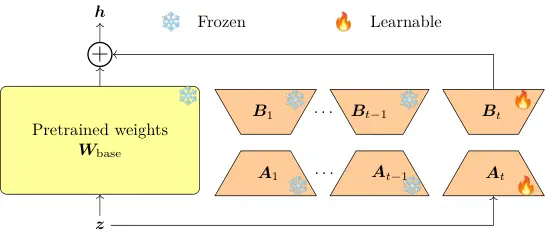

# Domain-Incremental Learning for Generative Speech Enhancement

Manjunath Mulimani    Annamaria Mesaros    Minje Kim    Jesper Rindom
Jensen ^(†)^(†)thanks: We acknowledge the EuroHPC supercomputer LUMI,
hosted by CSC (Finland) and the LUMI consortium.

###### Abstract

We propose a domain-incremental learning framework for generative speech
enhancement (SE) that learns from a sequence of datasets or domains
recorded under diverse acoustic conditions. Fine-tuning a pretrained
model on continuously evolving domains leads to catastrophic forgetting
of previously acquired knowledge, while zero-shot generalization often
fails to adequately adapt to unseen domains. To address these
challenges, we first develop a novel language model-based generative SE
model that we then use as a pretrained backbone and incrementally adapt
it to acoustically mismatched domains using lightweight domain-specific
Low-Rank Adaptation. The proposed framework enables the model to acquire
enhancement capabilities for new domains while preserving performance on
previously learned domains. Evaluated on four heterogeneous speech
datasets, our approach effectively adapts to new domains without
forgetting previously learned domains.

###### Index Terms: 

Domain-incremental learning, generative speech enhancement, Low-Rank
Adaptation, generalization, fine-tuning

^(†)^(†)address: ¹ Aalborg University, Department of Electronic Systems,
Denmark  
² Tampere University, Signal Processing Research Centre, Finland  
³ University of Illinois Urbana-Champaign, Siebel School of Computing
and Data Science, USA

## 1 Introduction

The objective of speech enhancement (SE) is to improve the
intelligibility and perceptual quality of speech signals corrupted by
adverse acoustic conditions. Existing approaches fall into two broad
categories: discriminative and generative. Discriminative models learn a
direct mapping from noisy speech to clean speech; however, they often
overlook the rich semantic information embedded in speech, which can be
crucial for achieving high perceptual quality. In contrast, generative
models leverage semantic representations to generate more natural and
perceptually pleasing speech while effectively suppressing background
noise.

A wide range of generative models have been successfully applied to
speech enhancement, including variational autoencoders (VAEs) \[4\],
generative adversarial networks (GANs) \[7\], flow-based models \[20\],
diffusion probabilistic models \[15\], \[13\], and, more recently,
discrete token-based language models (LMs) \[29, 28, 31, 14\]. However,
generalization to unseen domains remains a major challenge for SE
systems. Studies have shown that generative speech enhancement models
generalize more effectively to unseen domains than conventional
discriminative methods \[4\], \[15\]. Among these approaches, LM-based
generative models have demonstrated particularly better generalization
capabilities \[31\], \[14\].

Despite their architectural differences, most generative SE systems are
trained under the assumption of a fixed training distribution. In
practice, deployed SE systems encounter variations in speakers,
background noise, languages, dialects, recording devices, and other
acoustic conditions. The zero-shot generalization capability of these
models enables them to handle unseen domains to some extent, but their
performance can degrade substantially when significant domain shifts
exist between the training and deployment conditions. In contrast,
fine-tuning a model on a new domain leads to a deterioration in SE
performance on those earlier domains, a phenomenon known as
_catastrophic forgetting_. A straightforward solution is to store data
from all domains and completely retrain the model whenever new data
become available. However, such an approach is often impractical due to
privacy concerns, storage requirements, and computational constraints in
real-world applications.

In this work, we aim to develop a domain-incremental learning (DIL)
framework for a generative SE system that learns to enhance speech from
different domains that arrive sequentially over time. DIL differs
fundamentally from existing domain adaptation (DA) studies in SE \[5\],
\[21\]. DA typically considers two domains: source and target, and aims
to transfer knowledge from the source domain to improve performance on
the target domain. In contrast, DIL involves a sequence of multiple
domains that arrive over time and must be learned incrementally, and
evaluates the overall performance across all domains observed so far.

DIL has been successfully applied to sound event classification across
different datasets \[1\], acoustic scene classification across different
cities \[19\], and speech recognition \[6\], \[9\]. However, these tasks
involve predicting a predefined set of class labels or linguistic units.
In contrast, DIL for SE requires preserving the ability to generate
high-quality clean speech across previously encountered domains while
adapting to new acoustic conditions, making it fundamentally different
and more challenging than classification-based DIL.

(a)



(b)

Figure 1: An overview of the proposed DIL for generative speech
enhancement. (a) The base model $`\mathcal{M}`$ is trained on domain
$`\mathcal{D}_{0}`$. (b) LoRA is added to $`\mathcal{M}`$ for each
incremental domain $`\mathcal{D}_{t}`$.

A few studies have investigated DIL for SE. For example, \[12\] proposes
a regularization-based approach to mitigate catastrophic forgetting,
whereas \[30\] introduces an adapter-based framework that achieves
improved performance in the DIL setting. However, both methods are
developed for discriminative SE models. Whether such DIL strategies
remain effective for LM-based generative SE models, which formulate
enhancement as an autoregressive token-generation task, remains largely
unexplored. Furthermore, existing DIL-based SE studies primarily
consider domain shifts arising from the introduction of new noise types.
In contrast, we investigate DIL for a generative SE model under broader
domain shifts arising from different speech enhancement datasets. To
address these limitations, we propose a DIL framework for generative SE.

The main contributions of this work are as follows: (1) we develop a
GPT-based generative SE model that we train from scratch using discrete
semantic and global speech tokens from the Spark-TTS BiCodec tokenizer
\[27\] and investigate its generalization and adaptation capabilities
across acoustically mismatched domains; (2) we propose a
domain-incremental learning framework that adapts the pretrained
generative SE model to sequentially arriving domains using
domain-specific LoRA adapters while preserving domain-shared knowledge
in the frozen base model; and (3) we evaluate the proposed framework on
four heterogeneous speech enhancement datasets that exhibit substantial
shifts in speech characteristics, speakers, recording conditions,
acoustic environments, and noise distributions, providing a benchmark
for DIL generative SE.

## 2 Method

### 2.1 DIL tasks setup and notations

In our domain-incremental learning (DIL) setup, we first train a base
language model $`\mathcal{M}`$ for SE on a large-scale dataset
$`\mathcal{D}_{0}`$. Subsequently, the pretrained model $`\mathcal{M}`$
is exposed to a sequence of $`T`$ tasks, defined by additional datasets,
$`\mathcal{D}_{1},\mathcal{D}_{2},\ldots,\mathcal{D}_{T}`$, which are
available to the model sequentially over time. Each domain consists of
its own dataset $`\mathcal{D}_{t}`$, which contains noisy speech
recordings and their corresponding clean speech signals, collected under
acoustic conditions assumed to differ from those of other domains,
although a certain level of overlap between the domains is unavoidable.

At each incremental step, $`\mathcal{M}`$ is trained to enhance speech
from a newly arriving domain whose underlying data distribution may
mismatch previously observed domains. Importantly, data from previously
encountered domains are unavailable during the training of the current
domain. During inference, the performance of $`\mathcal{M}`$ is
evaluated on all SE tasks seen so far. Throughout this work, we use the
terms _task_, _dataset_, and _domain_ interchangeably to refer to
$`\mathcal{D}_{t}`$.

### 2.2 Base model for generative speech enhancement

The generative SE model autoregressively predicts a sequence of discrete
tokens corresponding to the target clean speech signal, conditioned on
acoustic embeddings extracted from the degraded speech signal. The
generated tokens are subsequently decoded to reconstruct the enhanced
speech waveform. Fig. 1a illustrates the proposed GPT-2 Small generative
SE base model $`\mathcal{M}`$, which is trained from scratch to perform
this token generation task.

To construct the acoustic embeddings used for conditioning, we encode
the noisy speech signal using WavLM-Large \[2\], a pretrained speech
foundation model. Specifically, representations extracted from the sixth
transformer layer are used as an acoustic prefix, producing a
1,024-dimensional embedding every 20 ms frame. We tokenize the
corresponding clean speech into discrete semantic and global tokens
using the Spark-TTS BiCodec tokenizer \[27\]. The tokenizer generates 50
semantic tokens per second and a fixed set of 32 global tokens for each
speech utterance. Semantic tokens are obtained through vector
quantization (VQ) using a single codebook of size 8,192. Global tokens
are generated by quantizing ECAPA-TDNN \[3\] speaker embeddings with
Finite Scalar Quantization (FSQ) \[17\], which uses six quantization
dimensions with four levels per dimension, i.e., $`4^{6}=4,096`$ as the
codebook size.

The model $`\mathcal{M}`$ is trained to maximize the posterior
probability of the clean speech utterance $`\bm{s}`$ given its noisy
observation $`\bm{x}\in\mathbb{R}^{n}`$:
$`p(\bm{s}|\bm{x})=\prod_{i=1}^{n}p(s_{i}\mid s_{1},\ldots,s_{i-1},g_{1\ldots G},e_{1\ldots n})`$,
where $`s_{i}`$ denotes the semantic tokens at time index $`i`$ and
$`g_{k}`$ denotes the global tokens, generated in a similar
autoregressive manner:
$`p(\bm{g}|\bm{x})=\prod_{k=1}^{G}p(g_{k}\mid g_{1}\ldots,g_{k-1},e_{1\ldots n})`$,
where $`e_{i}\leftarrow\mathcal{E}(x_{i})`$ denotes the embeddings
extracted from WavLM-Large $`\mathcal{E}`$, $`n`$ is the total number of
frames, and $`G`$ is the total number of global tokens per utterance.

The vocabulary of $`\mathcal{M}`$ consists of $`4,096+8,192+2`$ tokens,
corresponding to the global tokens, semantic tokens, and the special
\<Beginning of Sequence\> (BoS) and \<End of Sequence\> (EoS) tokens.
During training, the input sequence to $`\mathcal{M}`$ is structured as
”\<BoS\>, embeddings from WavLM-Large (prefix), global tokens, semantic
tokens, \<EoS\>”. Each token is represented using a 768-dimensional
embedding in GPT-2 Small. To match this embedding space, the
1,024-dimensional WavLM representations are projected to 768 dimensions
before being concatenated with the token embeddings and fed into
$`\mathcal{M}`$.

During inference, noisy embeddings $`e`$ together with \<BoS\>are
provided to the model $`\mathcal{M}`$ as a prefix. Conditioned on this
prefix, $`\mathcal{M}`$ first generates a fixed-length sequence of
global tokens, followed by frame-level semantic tokens until the
\<EoS\>  token is produced. The generated global and semantic tokens are
subsequently passed to the BiCodec decoder, which reconstructs the
enhanced speech.

### 2.3 DIL for generative speech enhancement

We introduce LoRA adapters into the pretrained base model
$`\mathcal{M}`$ for each incremental speech enhancement domain
$`\mathcal{D}_{t}`$, as illustrated in Fig. 1b. Specifically, LoRA adds
low-rank decomposition matrices
$`\bm{A}_{t}\in\mathbb{R}^{d_{\text{in}}\times r}`$ and
$`\bm{B}_{t}\in\mathbb{R}^{r\times d_{\text{out}}}`$ for each domain
$`\mathcal{D}_{t}`$ to a weight matrix
$`\bm{W}_{\text{base}}\in\mathbb{R}^{d_{\text{in}}\times d_{\text{out}}}`$
of $`\mathcal{M}`$ as:
$`\bm{W}_{\text{base}}+\bm{\Delta W_{t}}=\bm{W}_{\text{base}}+\bm{A}_{t}\bm{B}_{t}`$,
where rank $`r\ll\min(d_{\text{in}},d_{\text{out}})`$. During training,
$`\bm{W}_{\text{base}}`$ remains frozen and is shared across all
domains, while only the lightweight domain-specific LoRA parameters
$`\bm{A}_{t}`$ and $`\bm{B}_{t}`$ are optimized for a corresponding
adaptation task for the $`t`$-th domain. For a given input $`\bm{z}`$,
the original forward pass $`\bm{h}=\bm{W}_{\text{base}}\bm{z}`$ is
modified as:
$`\bm{h}=\bm{W}_{\text{base}}\bm{z}+\bm{A}_{t}\bm{B}_{t}\bm{z}`$, where
$`\bm{h}`$ is the hidden output. This enables the model $`\mathcal{M}`$
to acquire domain-specific knowledge through a small number of trainable
parameters while preserving the domain-invariant knowledge encoded in
the frozen base model.

During inference, the SE performance of $`\mathcal{M}`$ depends on the
choice of the specific LoRA module, while the optimal choice $`t^{*}`$
is not known. We propose two selection strategies:: _domain-aware_ and
_domain-agnostic_. In the domain-aware setting, both the ground-truth
domain identity $`t^{*}`$ and the test sample are provided to
$`\mathcal{M}`$. The domain identity is used to select the corresponding
LoRA parameters, which are then employed to generate the clean global
and semantic tokens for the noisy input speech. However, domain
information may not always be available in practical deployment
scenarios. Therefore, we also consider a domain-agnostic setting, where
only the noisy test sample is provided to $`\mathcal{M}`$. In this case,
inspired by \[19\], the most suitable domain-specific LoRA adapter is
selected based on the predictive uncertainty of the model. Specifically,
the test sample $`\bm{x}`$ is forwarded through all LoRA adapters
associated with the domains observed so far, producing a probability
distribution over the vocabulary for each adapter. We then compute the
prediction uncertainty for domain $`\mathcal{D}_{t}`$ using the entropy
of the predicted distribution:

```math
\mathcal{U}(\mathcal{D}_{t})=-\sum_{v=1}^{V}p\left(\bm{y}^{(\mathcal{D}_{t})}_{v}\mid\bm{x}\right)\log p\left(\bm{y}^{(\mathcal{D}_{t})}_{v}\mid\bm{x}\right), \tag{1}
```

where $`\bm{y}`$ is the output on $`\mathcal{D}_{t}`$ parameters
($`\bm{W}_{\text{base}}+\bm{\Delta}\bm{W}_{t}`$) and $`V`$ is size of
the vocabulary in $`\mathcal{M}`$. The LoRA adapter yielding the minimum
entropy is selected, i.e.,
$`\hat{t^{*}}=\text{arg min}_{t}\mathcal{U}(\mathcal{D}_{t})`$, as lower
entropy indicates higher confidence and lower predictive uncertainty.
For brevity, we hereafter refer to the proposed domain-incremental
learning framework for generative speech enhancement as DIL-GenSE.

## 3 Evaluation and Results

### 3.1 Datasets, training setup, and baselines

To construct the domain-incremental learning benchmark we use five
datasets recorded under diverse acoustic conditions:

•  $`\mathcal{D}_{0}`$ (Base training dataset): We use English clean
speech from the Emilia-Large dataset \[8\], excluding the Emilia-YODAS
split. Approximately 10,400 hours of clean speech with a DNSMOS score
greater than 3.40 are selected. To generate noisy-clean speech pairs, we
use 180 hours of noise recordings from the DNS Challenge 2020 dataset
\[22\]. We synthesize noisy speech at SNR levels from $`-5`$ to $`20`$
dB without reverberation. All remaining parameters follow the
recommendations of \[14\].

•  $`\mathcal{D}_{1}`$ (DNS): For incremental adaptation, we use 500
hours of clean speech together with the same 180 hours of noise data
used in $`\mathcal{D}_{0}`$ to generate 100 hours of noisy-clean speech
pairs using the official DNS2020 data-generation script. Although the
noise sources are shared with $`\mathcal{D}_{0}`$, we use different
speech sources to create a domain shift arising from variations in
speech characteristics and recording conditions. The training and
validation splits follow \[11\], while the DNS2020 test set without
reverberation is used for evaluation.

•  $`\mathcal{D}_{2}`$ (EARS): This domain consists of noisy-clean
speech pairs from the EARS-WHAM_v2 dataset. The training, validation,
and test splits are selected according to the protocol described in
\[11\].

•  $`\mathcal{D}_{3}`$ (LibriTTS-R): We use 100 hours of speech from the
LibriTTS-R dataset for training and select 5,000 utterances from the
remaining 360-hour portion for validation. The test set contains 4,837
utterances. Noise recordings are drawn from the TUT Urban Acoustic
Scenes 2018 Development dataset \[18\] recorded in Europe and the
CochlScene dataset \[10\] recorded in Korea. Following the DNS2020
data-generation procedure, 100 hours of noisy-clean speech pairs are
synthesized for training.

•  $`\mathcal{D}_{4}`$ (VoiceBank): This domain is constructed using
clean speech from VoiceBank \[26\] and noise recordings from DEMAND
\[25\]. Training, validation, and test sets are generated following the
protocol of \[11\] using the DNS2020 data-generation script.

Base model $`\mathcal{M}`$ is trained on $`\mathcal{D}_{0}`$ and other
datasets are learned incrementally in the order
$`\mathcal{D}_{1}\rightarrow\mathcal{D}_{2}\rightarrow\mathcal{D}_{3}\rightarrow\mathcal{D}_{4}`$.
At each incremental step, the model has access only to the current
domain while being evaluated on all previously encountered domains.
While the domain order is not expected to substantially affect the
domain-aware setting, it may influence the domain-agnostic setting due
to the adapter-selection process. We leave the investigation of
alternative domain sequences to future work. We compare the proposed
DIL-GenSE against three competitive baselines commonly used to assess
the generalization and adaptation capabilities of pretrained generative
models: (1) Generalization (GRL): We evaluate the out-of-domain
generalization capability of the pretrained base model $`\mathcal{M}`$
without any adaptation to the incremental domains. (2) Fine-tuning (FT):
For each incremental domain, we adapt the $`\mathcal{M}`$ incrementally
by fine-tuning only the linear layers, namely the output prediction head
and the WavLM projection layer, while keeping all other model parameters
frozen. (3) Joint fine-tuning (Joint FT): For each incremental domain,
the linear layers of the $`\mathcal{M}`$ are fine-tuned using data from
all domains encountered up to the current learning stage. Although it
violates the incremental learning setup, we included it for
completeness.

### 3.2 Implementation details and evaluation metrics

The base model $`\mathcal{M}`$ is trained on $`\mathcal{D}_{0}`$ with a
batch size of 256 for approximately 185k optimization steps, using AdamW
optimizer with a learning rate of $`5\times 10^{-5}`$ and 1,000 warmup
steps. For domain-incremental adaptation, LoRA with rank $`r=8`$ is
inserted into the GPT-2 attention and feed-forward layers, while bias
parameters remain frozen. The LoRA parameters are trained for 10 epochs
with a learning rate of $`2\times 10^{-4}`$ and a cosine learning-rate
schedule with 200 warm-up steps. For FT, we set the learning rate to
$`1\times 10^{-3}`$, keeping other settings the same as LoRA.

Following the standard practice in incremental learning \[16\], we
evaluate the performance of each method after learning the current
domain $`\mathcal{D}_{t}`$ using the average SpeechBertScore \[24\]
(SBS) and average forgetting over all domains encountered so far. The
average SBS is defined as:
$`\text{SBS}_{t}=\frac{1}{t}\sum_{j=1}^{t}\text{SBS}_{t,j}`$, where
$`\text{SBS}_{t,j}`$ is the SBS of $`j`$-th domain after learning the
$`t`$-th domain. Based on this, average forgetting is defined as:
$`\text{FR}_{t}=\frac{1}{t-1}\sum_{j=1}^{t-1}\left(\max_{\hat{t}\in\{1,\ldots,t-1\}}\text{SBS}_{\hat{t},j}-\text{SBS}_{t,j}\right),`$
where $`\text{SBS}_{\hat{t},j}`$ represents the best (highest) SBS
achieved on domain $`\mathcal{D}_{j}`$ before learning the current
domain. Lower forgetting values indicate better retention of previously
acquired knowledge. We additionally report DNSMOS \[23\] scores,
computed using the toolkits and settings provided in \[31\],\[14\].
These metrics are also used to compare our DIL-GenSE with the
state-of-the-art generative SE model GenSE \[31\].

### 3.3 Results

|           |                         |                          |                                |                               |
| --------- | ----------------------- | ------------------------ | ------------------------------ | ----------------------------- |
| Method    | $`\mathcal{D}_{1}`$ DNS | $`\mathcal{D}_{2}`$ EARS | $`\mathcal{D}_{3}`$ LibriTTS-R | $`\mathcal{D}_{4}`$ VoiceBank |
| GRL       | 0.89                    | 0.82                     | 0.84                           | 0.83                          |
| FT        | 0.85                    | 0.78                     | 0.74                           | 0.73                          |
| Joint FT  | 0.85                    | 0.80                     | 0.82                           | 0.83                          |
| DIL-GenSE | 0.90                    | 0.87                     | 0.88                           | 0.88                          |

Table 1: Average $`\text{SBS}_{t}`$ ($`\uparrow`$) across the current
domain $`\mathcal{D}_{t}`$ and all previously seen domains
$`\mathcal{D}_{1,\ldots,t-1}`$ under the domain-aware setup.

Domain-aware: The average performance ($`\text{SBS}_{t}`$) of the
proposed DIL-GenSE is compared with the baselines after learning each
domain $`\mathcal{D}_{t}`$ in Table 1. For a more detailed analysis,
Fig. 2a presents the SBS achieved by each method on individual domains
before averaging. The pretrained base model $`\mathcal{M}`$ has
previously seen DNS2020 noise recordings during training, which are also
used to construct $`\mathcal{D}_{1}`$. As a result, $`\mathcal{D}_{1}`$
exhibits a smaller distribution shift relative to the pretraining data,
leading to better zero-shot generalization performance and a higher SBS
compared with the remaining domains. The lower SBS of the GRL on the
EARS domain suggests a greater domain mismatch between EARS and the
pretraining data compared to the other domains. This observation
highlights the need for domain-specific adaptation under substantial
domain shifts. The introduction of LoRA adapters enables $`\mathcal{M}`$
to capture domain-specific acoustic characteristics while preserving the
domain-shared knowledge encoded in the frozen base model, thereby
outperforming the GRL.

(a)

(b)

Figure 2: Comparison of the proposed DIL-GenSE with zero-shot
generalization and fine-tuning. (a) SBS ($`\uparrow`$) of the
generalization and the DIL-GenSE method in the current domain
$`\mathcal{D}_{t}`$. (b) SBS ($`\uparrow`$) at the $`\mathcal{D}_{t}`$
and average forgetting $`\text{FR}_{t}`$ over the previously encountered
domains $`\mathcal{D}_{1,\ldots,t-1}`$ learned for the FT.

We further compare the proposed method with the fine-tuning baseline
(FT) in Table 1 and Fig. 2b. Fine-tuning the linear layers of
$`\mathcal{M}`$ on the DNS domain overwrites part of the model’s
pretrained generalization capability, leading to a reduced SBS.
Interestingly, the SBS achieved by FT on LibriTTS-R is comparable to
that of the GRL baseline. This observation suggests that the
distribution shift between LibriTTS-R and the previously encountered
domains is relatively small. Consequently, adapting the linear layers
introduces only a limited bias in the learned feature representations,
resulting in performance similar to that of GRL. A similar trend can be
observed for DIL-GenSE, whose SBS on LibriTTS-R is also close to that of
GRL. This indicates that the contribution of the domain-specific LoRA
parameters is less significant when the target domain closely resembles
the domains already represented by the base model.

However, once the model is fine-tuned on $`\mathcal{D}_{3}`$
(LibriTTS-R), the SBS on the previously learned domain
$`\mathcal{D}_{2}`$ (EARS) decreases substantially, leading to a higher
forgetting score ($`\text{FR}_{t}`$), as shown in Fig. 2a. This behavior
is mainly due to the larger distribution mismatch between the EARS and
LibriTTS-R domains, which causes the fine-tuned linear layers to become
biased toward the current domain at the expense of previously acquired
knowledge. A similar trend is observed after adapting to the VoiceBank
domain, where the FT baseline performs worse than both GRL and
DIL-GenSE.

Domain-specific LoRA adapters in DIL-GenSE effectively adapt to highly
mismatched domains while preserving performance on previously learned
domains, thereby outperforming both GRL and FT. In contrast to FT, which
is susceptible to forgetting, DIL-GenSE retains domain-shared knowledge
in the frozen base model and learns only domain-specific adaptations
through lightweight LoRA parameters. As expected, joint FT benefits from
access to data from all previously encountered domains and consequently
achieves better performance than FT. However, combining data from
multiple domains provides only limited gains, as the model tends to
become biased toward the dominant domains in the training set.
Interestingly, despite having access only to the current domain during
adaptation, DIL-GenSE consistently outperforms joint FT, demonstrating
its ability to effectively balance domain adaptation and knowledge
retention in the domain-incremental learning setting.

|                         |                          |                                |                               |
| ----------------------- | ------------------------ | ------------------------------ | ----------------------------- |
| $`\mathcal{D}_{1}`$ DNS | $`\mathcal{D}_{2}`$ EARS | $`\mathcal{D}_{3}`$ LibriTTS-R | $`\mathcal{D}_{4}`$ VoiceBank |
| 0.90                    | 0.79                     | 0.80                           | 0.76                          |

Table 2: Average $`\text{SBS}_{t}`$ ($`\uparrow`$) across the current
domain $`\mathcal{D}_{t}`$ and all previously seen domains
$`\mathcal{D}_{1,\ldots,t-1}`$ under the domain-agnostic setup.

Domain-agnostic: The performance of DIL-GenSE in the domain-agnostic
setup is reported in Table 2 and strongly depends on accurately
identifying the appropriate LoRA adapter using the uncertainty measure
in Eq. (1). Imperfect adapter selection can lead to suboptimal
performance compared with the domain-aware setup. These results suggest
that the primary limitation of the domain-agnostic framework lies in the
adapter-selection mechanism rather than the LoRA-based adaptation
itself. Nevertheless, DIL-GenSE consistently outperforms the FT
baseline, indicating that domain-specific LoRA adaptation remains
effective even when the domain identity is unavailable during inference.
Therefore, developing more reliable adapter-selection strategies has the
potential to further improve domain-agnostic performance.

|                    |                    |      |      |                 |
| ------------------ | ------------------ | ---- | ---- | --------------- |
|                    | DNSMOS$`\uparrow`$ |      |      |                 |
| Method             | SIG                | BAK  | OVL  | SBS$`\uparrow`$ |
| GenSE\[31\]        | 2.60               | 3.22 | 2.14 | 0.52            |
| DIL-GenSE Agnostic | 3.39               | 3.99 | 3.16 | 0.74            |
| DIL-GenSE Aware    | 3.56               | 4.05 | 3.31 | 0.84            |

Table 3: Comparison of proposed DIL-GenSE with GenSE \[31\] on the EARS
domain.

We further compare the proposed DIL-GenSE with the state-of-the-art
generative speech enhancement model GenSE \[31\] on the EARS domain in
Table 3. A comparison on the remaining domains would be unfair, as GenSE
is pretrained using a mixture of clean speech from the DNS, LibriTTS,
and VoiceBank datasets, together with noise recordings from the WHAM!
and DEMAND datasets. Therefore, we select the EARS domain for
evaluation, as it provides the fairest comparison between the two
methods, despite the presence of WHAM! noise in EARS. The proposed
DIL-GenSE in a domain-aware setup outperforms GenSE across all
evaluation metrics. It is worth noting that GenSE relies on two LM
decoders for speech enhancement, whereas DIL-GenSE employs a single
decoder together with lightweight domain-specific LoRA adapters. Despite
its lower architectural complexity, DIL-GenSE consistently outperforms
GenSE on the highly mismatched EARS domain in both the domain-aware and
domain-agnostic settings.

## 4 Conclusion

We presented DIL-GenSE, a domain-incremental learning framework for
generative speech enhancement. DIL-GenSE employs lightweight
domain-specific LoRA adapters to enable incremental learning on new
domains while mitigating catastrophic forgetting. Each LoRA adapter
contains only 1.18M parameters, about 1.1% of the base model’s.
Experimental results show that DIL-GenSE consistently outperforms the
baseline methods in the domain-aware setting while requiring only a
small number of additional parameters. Although DIL-GenSE also improves
over fine-tuning in the domain-agnostic setting, its performance remains
dependent on accurate adapter selection. Improving domain-agnostic
adaptation therefore constitutes an important direction for future
research.

## References

- \[1\] R. Casciotti, M. Mulimani, M. Harju, J. R. Jensen, and A.
  Mesaros (2026) Domain-agnostic incremental learning for sound
  classification. a DCASE 2026 challenge task. In Detect. Classif.
  Acoust. Scenes Events Workshop, Cited by: §1.
- \[2\] S. Chen, C. Wang, Z. Chen, Y. Wu, Liu, et al. (2022) WavLM:
  large-scale self-supervised pre-training for full stack speech
  processing. IEEE J. Sel. Topics Signal Process. 16 (6), pp. 1505–1518.
  Cited by: §2.2.
- \[3\] B. Desplanques, J. Thienpondt, and K. Demuynck (2020)
  ECAPA-TDNN: emphasized channel attention, propagation and aggregation
  in TDNN based speaker verification. In INTERSPEECH, pp. 3830–3834.
  Cited by: §2.2.
- \[4\] H. Fang, G. Carbajal, S. Wermter, and T. Gerkmann (2021)
  Variational autoencoder for speech enhancement with a noise-aware
  encoder. In IEEE Int. Conf. Acoust., Speech Signal Process. (ICASSP),
  pp. 676–680. Cited by: §1.
- \[5\] L. Frenkel, J. Goldberger, and S. E. Chazan (2023) Domain
  adaptation for speech enhancement in a large domain gap. In
  INTERSPEECH, pp. 2458–2462. Cited by: §1.
- \[6\] L. Fu, X. Li, L. Zi, Z. Zhang, Y. Wu, X. He, and B. Zhou (2021)
  Incremental learning for end-to-end automatic speech recognition. In
  IEEE Autom. Speech Recognit. Understand. Workshop (ASRU), pp. 320–327.
  Cited by: §1.
- \[7\] S. Fu, C. Liao, Y. Tsao, and S. Lin (2019) MetricGAN: generative
  adversarial networks based black-box metric scores optimization for
  speech enhancement. In Int. Conf. Mach. Learn., pp. 2031–2041. Cited
  by: §1.
- \[8\] H. He, Z. Shang, C. Wang, X. Li, Y. Gu, H. Hua, L. Liu, C.
  Yang, J. Li, P. Shi, et al. (2024) Emilia: an extensive, multilingual,
  and diverse speech dataset for large-scale speech generation. In IEEE
  Spoken Lang. Technol. Workshop, pp. 885–890. Cited by: §3.1.
- \[9\] T. Javed, K. Bhogale, and M. M. Khapra (2025) NIRANTAR:
  continual learning with new languages and domains on real-world speech
  data. In INTERSPEECH, pp. 918–922. Cited by: §1.
- \[10\] I. Jeong and J. Park (2022) Cochlscene: acquisition of acoustic
  scene data using crowdsourcing. In APSIPA Annu. Summit Conf.,
  pp. 17–21. Cited by: §3.1.
- \[11\] N. L. Kühne, J. Jensen, J. Østergaard, and Z. Tan (2026)
  MambAttention: mamba with multi-head attention for generalizable
  single-channel speech enhancement. IEEE Trans. Audio, Speech, Lang.
  Process.. Cited by: §3.1, §3.1, §3.1.
- \[12\] C. Lee, Y. Lin, H. Lin, H. Wang, and Y. Tsao (2020) SERIL:
  noise adaptive speech enhancement using regularization-based
  incremental learning. In INTERSPEECH, pp. 2432–2436. Cited by: §1.
- \[13\] J. Lemercier, J. Richter, S. Welker, and T. Gerkmann (2023)
  StoRM: a diffusion-based stochastic regeneration model for speech
  enhancement and dereverberation. IEEE/ACM Trans. Audio, Speech, Lang.
  Process. 31, pp. 2724–2737. Cited by: §1.
- \[14\] X. Li, H. Xie, Z. Wang, Z. Zhang, L. Xiao, S. Wang, and L.
  Xie (2025) SenSE: semantic-aware high-fidelity universal speech
  enhancement. arXiv preprint arXiv:2509.24708. Cited by: §1, §3.1,
  §3.2.
- \[15\] Y. Lu, Z. Wang, S. Watanabe, A. Richard, C. Yu, and Y.
  Tsao (2022) Conditional diffusion probabilistic model for speech
  enhancement. In IEEE Int. Conf. Acoust., Speech Signal Process.
  (ICASSP), pp. 7402–7406. Cited by: §1.
- \[16\] M. D. McDonnell, D. Gong, A. Parvaneh, E. Abbasnejad, and A.
  Van den Hengel (2023) Ranpac: random projections and pre-trained
  models for continual learning. Adv. Neural Inf. Process. Syst.
  (NeurIPS) 36, pp. 12022–12053. Cited by: §3.2.
- \[17\] F. Mentzer, D. Minnen, E. Agustsson, and M. Tschannen (2024)
  Finite scalar quantization: VQ-VAE made simple. In Int. Conf. Learn.
  Representations, Vol. 2024, pp. 51772–51783. Cited by: §2.2.
- \[18\] A. Mesaros, T. Heittola, and T. Virtanen (2018) A multi-device
  dataset for urban acoustic scene classification. In Detect. Classif.
  Acoust. Scenes Events Workshop, pp. 9–13. Cited by: §3.1.
- \[19\] M. Mulimani and A. Mesaros (2025) Domain-incremental learning
  for audio classification. In IEEE Int. Conf. Acoust., Speech Signal
  Process. (ICASSP), pp. 1–5. Cited by: §1, §2.3.
- \[20\] A. A. Nugraha, K. Sekiguchi, and K. Yoshii (2020) A flow-based
  deep latent variable model for speech spectrogram modeling and
  enhancement. IEEE/ACM Trans. Audio, Speech, Lang. Process. 28,
  pp. 1104–1117. Cited by: §1.
- \[21\] T. Raichle, N. Edinger, and B. Yang (2026) Test-time adaptation
  for speech enhancement via domain invariant embedding transformation.
  IEEE Open J. Signal Process.. Cited by: §1.
- \[22\] C. K. A. Reddy, V. Gopal, R. Cutler, Beyrami, et al. (2020) The
  INTERSPEECH 2020 deep noise suppression challenge: datasets,
  subjective testing framework, and challenge results. In INTERSPEECH,
  pp. 2492–2496. Cited by: §3.1.
- \[23\] C. K. A. Reddy, V. Gopal, and R. Cutler (2022) DNSMOS P.835: a
  non-intrusive perceptual objective speech quality metric to evaluate
  noise suppressors. In IEEE Int. Conf. Acoust., Speech Signal Process.
  (ICASSP), pp. 886–890. Cited by: §3.2.
- \[24\] T. Saeki, S. Maiti, S. Takamichi, S. Watanabe, and H.
  Saruwatari (2024) SpeechBERTScore: reference-aware automatic
  evaluation of speech generation leveraging nlp evaluation metrics. In
  INTERSPEECH, pp. 4943–4947. Cited by: §3.2.
- \[25\] J. Thiemann, N. Ito, and E. Vincent (2013) The diverse
  environments multi-channel acoustic noise database (DEMAND): a
  database of multichannel environmental noise recordings. In Meet.
  Acoust., Vol. 19, pp. 035081. Cited by: §3.1.
- \[26\] C. Veaux, J. Yamagishi, and S. King (2013) The voice bank
  corpus: design, collection and data analysis of a large regional
  accent speech database. In O-COCOSDA/CASLRE, pp. 1–4. Cited by: §3.1.
- \[27\] X. Wang, M. Jiang, Z. Ma, Z. Zhang, S. Liu, L. Li, Z. Liang, Q.
  Zheng, R. Wang, X. Feng, et al. (2025) Spark-TTS: an efficient
  LLM-based text-to-speech model with single-stream decoupled speech
  tokens. arXiv preprint arXiv:2503.01710. Cited by: §1, §2.2.
- \[28\] Z. Wang, X. Zhu, Z. Zhang, Y. Lv, N. Jiang, G. Zhao, and L.
  Xie (2024) SELM: speech enhancement using discrete tokens and language
  models. In IEEE Int. Conf. Acoust., Speech Signal Process. (ICASSP),
  pp. 11561–11565. Cited by: §1.
- \[29\] H. Yang, J. Su, M. Kim, and Z. Jin (2024) Genhancer:
  high-fidelity speech enhancement via generative modeling on discrete
  codec tokens. In INTERSPEECH, pp. 1170–1174. Cited by: §1.
- \[30\] Z. Yang, X. Song, J. Chen, C. Richard, and I. Cohen (2024)
  Learning noise adapters for incremental speech enhancement. IEEE
  Signal Process. Lett. 31, pp. 2915–2919. Cited by: §1.
- \[31\] J. Yao, H. Liu, C. Chen, Y. Hu, E. Chng, and L. Xie (2025)
  GenSE: generative speech enhancement via language models using
  hierarchical modeling. In Int. Conf. Learn. Representations, Vol.
  2025, pp. 69229–69249. Cited by: §1, §3.2, §3.3, Table 3, Table 3.
