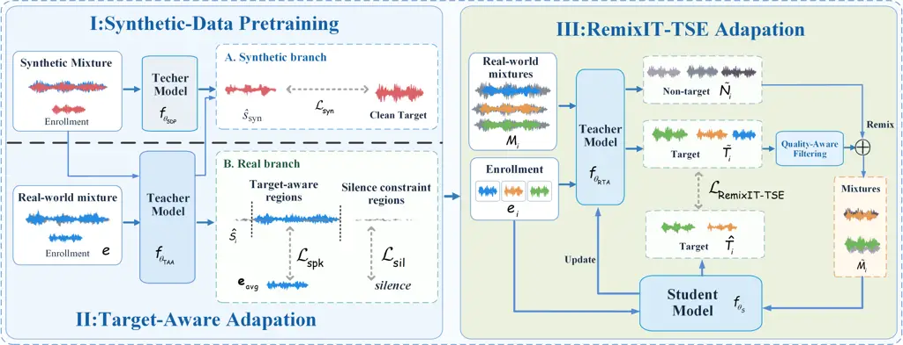

# RemixIT-TSE: Progressive Synthetic-to-Real Adaptation for Target Speech Extraction via Target-Aware Supervision and RemixingThanks: ^(∗)indicates the corresponding author. This work was sponsored by Natural Science Foundation of Shanghai (Grant No.25ZR1401277).

Yu Wang    Haixin Guan    Shuang Wei    Yanhua Long

###### Abstract

Target Speech Extraction (TSE) in real-world conversational scenarios
suffers from severe performance degradation due to the domain gap
between synthetic training data and complex acoustic environments, where
signal-level ground truth is typically unavailable. To address this
challenge, we make the first attempt to extend RemixIT from speech
enhancement to TSE and propose a progressive synthetic-to-real
adaptation framework for real-world TSE with two fine-tuning stages. The
first stage leverages region-wise speaker similarity and silence
constraints within a target-aware adaptation framework to jointly
optimize the model using synthetic and weakly supervised real-world
data, injecting real-world traits while preserving synthetic-learned
capabilities. The second stage further adapts the model using only
real-world data through our RemixIT-TSE, where quality-filtered teacher
pseudo targets, which guarantee reliable student training, provide
signal-level supervision via SI-SNR loss. Experiments on the real
conversational evaluation set (EVAL-2) of the SLT 2026 REAL-TSE
Challenge, the proposed method achieves a 6.53% relative TER reduction,
together with relative improvements of 21.84% in speaker similarity,
9.89% in DNSMOS-P808, and 4.10% in target-activity F1 over the
source-domain baseline, demonstrating its effectiveness under unseen
real-world conditions. Source code at
[https://github.com/YuWang-Speech/RemixIT-TSE](https://github.com/YuWang-Speech/RemixIT-TSE).

###### Index Terms: 

target speech extraction, semi-supervised learning, domain adaptation

^(†)^(†)address: ¹Shanghai Normal University, Shanghai, China  
²Unisound AI Technology Co., Ltd., Beijing, China  
wwy97717@gmail.com , yanhua@shnu.edu.cn



Figure 1: Overview of the proposed RemixIT-TSE framework. Stage I
performs supervised synthetic-data pretraining. Stage II jointly adapts
the model using synthetic supervision and region-wise speaker and
silence constraints on real recordings. Stage III performs
real-data-only RemixIT-TSE adaptation using quality-filtered targets,
and SI-SNR-based student optimization.

## 1 Introduction

Target Speech Extraction (TSE) aims to isolate a target speaker’s speech
from a multi-talker mixture using auxiliary information, typically an
enrollment utterance \[1, 2, 3, 4\]. By enabling speaker-specific speech
recovery in complex acoustic scenes, TSE is a key front-end technology
for real-world applications including multi-party conversations, smart
meetings, and speech interaction.

Despite remarkable advances in TSE\[5, 6, 7, 8\], most systems are
trained on synthetic mixtures such as WHAMR\![9\] and Libri2Mix\[10\],
where clean target signals are available for supervision. Real
conversational recordings, however, contain reverberation, background
noise, irregular overlap, and recording-condition mismatch, causing a
substantial domain gap and severe performance degradation. Meanwhile,
real-world mixtures generally lack signal-level ground truth, but often
provide weak annotations such as speaker labels and speaker-attributed,
time-aligned transcripts, which can be exploited for real-world
adaptation.

Unsupervised and semi-supervised adaptation has been increasingly
studied in related speech tasks. MixIT \[11\] enables unsupervised
speech separation from mixtures of mixtures, while RemixIT \[12\]
provides an effective teacher–student paradigm for speech enhancement
adaptation without clean target references. However, such adaptation
remains largely unexplored for TSE. The closest prior work \[13\] mainly
considers noise-free conditions; its extension to noisy scenarios
requires additional clean speech, limiting its applicability to
real-world recordings where clean target signals are unavailable.

To address the aforementioned challenges, this paper presents
RemixIT-TSE, a novel semi-supervised framework for progressive
synthetic-to-real domain adaptation in real-world target speech
extraction. The main contributions of this work are summarized as
follows:

- •
  To the best of our knowledge, we are the first to extend RemixIT from
  speech enhancement to real-world TSE adaptation, bridging the
  synthetic-to-real domain gap without requiring signal-level clean
  target references.
- •
  We design a progressive synthetic-to-real adaptation strategy that
  first performs mixed-domain weakly supervised fine-tuning with
  region-wise speaker similarity and silence constraints, and then
  transitions to real-data-only RemixIT-TSE adaptation.
- •
  We propose a pseudo-label generation pipeline that constructs
  enrollments from single-speaker segments and performs quality-aware
  filtering based on Speaker Similarity (SIM) and Token Error Rate
  (TER).
- •
  Experiments on the SLT 2026 REAL-TSE Challenge evaluation sets
  demonstrate consistent improvements in TER, SIM, Mean Opinion Score
  (MOS), and target-speaker activity F1 over the source-domain baseline.

## 2 Proposed Method

### 2.1 Overview of the Framework

The proposed RemixIT-TSE framework progressively adapts a
synthetic-trained TSE model to real-world recordings through three
stages, as illustrated in Fig. 1. Synthetic-Data Pretraining (SDP) first
learns the source-domain model $`f_{\theta_{\mathrm{SDP}}}`$ from
synthetic data. Target-Aware Adaptation (TAA) then jointly exploits
synthetic supervision and region-level weak supervision on real
recordings to obtain $`f_{\theta_{\mathrm{TAA}}}`$. Finally, RemixIT-TSE
Adaptation (RTA) uses only real-world data to obtain
$`f_{\theta_{\mathrm{RTA}}}`$. Accordingly, training progressively
shifts from synthetic-only supervision to joint synthetic-real
adaptation and finally to real-only adaptation.

### 2.2 Enrollment and Pseudo-Target Generation

Real-world conversational corpora typically lack clean target references
but provide speaker-attributed, time-aligned annotations. We use
non-overlapped single-speaker intervals to construct enrollment
utterances $`e`$. For target-aware adaptation, five enrollment
utterances from the same target speaker are encoded and averaged to form
the speaker centroid

```math
e_{\rm avg}=\frac{1}{5}\sum_{k=1}^{5}\phi(e^{(k)}) \tag{1}
```

where $`\phi()`$ denotes the WeSpeaker ResNet-34 \[14\].

For RemixIT-TSE adaptation, $`f_{\theta_{\mathrm{TAA}}}`$ initializes
the Stage-III teacher $`f_{\theta_{\mathrm{RTA}}}`$. Given a real-world
mixture $`M_{i}`$ and its enrollment $`e_{i}`$, the teacher generates
the target and non-target components as

```math
\tilde{T}_{i}=f_{\theta_{\mathrm{RTA}}}(M_{i},e_{i}),\ \tilde{N}_{i}=M_{i}-\tilde{T}_{i} \tag{2}
```

### 2.3 Quality-Aware Pseudo-Label Filtering

Unlike speech enhancement, the pseudo target $`\tilde{T}_{i}`$ in TSE
may contain interfering-speaker leakage that is inconsistent with the
target enrollment $`e_{i}`$. Such errors may be reinforced during
subsequent remixing. We therefore apply quality-aware filtering to
$`\tilde{T}_{i}`$, using SIM as the primary speaker-identity criterion
and TER as a complementary content criterion:

```math
\mathrm{SIM}_{i}\geq\tau_{\rm SIM},\ \mathrm{TER}_{i}\leq\tau_{\rm TER} \tag{3}
```

Filtering is applied only to the pseudo target $`\tilde{T}_{i}`$; the
corresponding non-target $`\tilde{N}_{i}`$ is not independently
filtered. This process filters the real-world recordings to retain a
small fraction of high-confidence data for subsequent adaptation.

### 2.4 Progressive Synthetic-to-Real Adaptation

Motivated by the insight that a model’s foundational extraction
capabilities are best established on supervised synthetic data prior to
real-world deployment, we propose a progressive synthetic-to-real
adaptation framework. The framework consists of the following stages:

I: Synthetic-Data Pretraining. The model $`f_{\theta_{\mathrm{SDP}}}`$
is trained using synthetic mixtures, enrollments, and clean target
references. Its supervised objective combines SI-SNR
($`\mathcal{L}_{\rm SI\mbox{-}SNR})`$ \[14\], compressed-magnitude
reconstruction($`\mathcal{L}_{\rm mag}`$), and centroid-based speaker
consistency ($`\mathcal{L}_{\rm C\mbox{-}SC}`$, an advanced variant of
target speaker similarity loss) \[15\] :

```math
\mathcal{L}_{\rm syn}=\lambda_{\rm sisnr}\mathcal{L}_{\rm SI\mbox{-}SNR}+\lambda_{\rm mag}\mathcal{L}_{\rm mag}+\lambda_{\rm csc}\mathcal{L}_{\rm C\mbox{-}SC} \tag{4}
```

where $`\mathcal{L}_{\texttt{C-SC}}`$ loss is defined as:

```math
\mathcal{L}_{\rm C\mbox{-}SC}=-\log\frac{\exp\left(\cos(\phi(\mathbf{z}),\mathbf{c}_{y})\right)}{\sum_{\mathbf{c}_{k}\in\mathcal{C}}\exp\left(\cos(\phi(\mathbf{z}),\mathbf{c}_{k})\right)} \tag{5}
```

where $`\mathbf{z}`$ is the TSE extracted target speech,
$`\mathbf{c}_{y}`$ is the enrollment target-speaker centroid , and
$`\mathcal{C}`$ denotes the set of enrollment target-speaker centroids
across the dataset.

II: Target-Aware Adaptation. In the target-aware adaption stage, the
teacher model $`f_{\theta_{\mathrm{TAA}}}`$ is first initialized by the
well-trained Stage-I model $`f_{\theta_{\mathrm{SDP}}}`$, and then
further jointly optimized by the synthetic branch
$`\mathcal{L}_{\rm syn}`$ and the real branches as shown in Fig. 1. For
a real-world mixture, let $`\hat{s}_{i}(t)`$ denote the $`t`$-th frame
of the TSE extracted target speech, and let
$`m_{i}^{\rm tar}(t)\in\{0,1\}`$ denote the target-speaker activity mask
derived from the time-aligned annotations, where
$`m_{i}^{\rm tar}(t)=1`$ indicates a target-speaker active region. The
corresponding non-target mask is defined as
$`m_{i}^{\rm non\mbox{-}tar}(t)=1-m_{i}^{\rm tar}(t)`$.

Then, the real-branch optimization objective is formulated as the
combination of $`\mathcal{L}_{\rm spk}`$ and $`\mathcal{L}_{\rm sil}`$.
$`\mathcal{L}_{\rm spk}`$ is defined as:

```math
\mathcal{L}_{\rm spk}=\mathcal{L}_{\rm C\mbox{-}SC}\left(\phi(m_{i}^{\rm tar}(t)\hat{s}_{i}(t)),e_{\rm avg}\right) \tag{6}
```

and $`\mathcal{L}_{\rm sil}`$ is also introduced to enforce silence in
the non-target regions as:

```math
\mathcal{L}_{\rm sil}=\frac{\sum_{t}|\hat{s}_{i}(t)|m_{i}^{\rm non\mbox{-}tar}(t)}{\sum_{t}m_{i}^{\rm non\mbox{-}tar}(t)} \tag{7}
```

Finally, the joint objective loss for the teacher model
($`f_{\theta_{\mathrm{TAA}}}`$) training is given by:

```math
\mathcal{L}_{\rm TAA}=\mathcal{L}_{\rm syn}+\lambda_{\rm r}\left(\lambda_{\rm spk}\mathcal{L}_{\rm spk}+\lambda_{\rm sil}\mathcal{L}_{\rm sil}\right) \tag{8}
```

III: RemixIT-TSE Adaptation. As illustrated in Fig. 1, Stage-III adopts
a teacher-student RemixIT framework \[12\]. Specifically, the Stage-II
model $`f_{\theta_{\mathrm{TAA}}}`$ serves as the teacher model
$`f_{\theta_{\mathrm{RTA}}}`$ and also initializes the student model
$`f_{\theta_{S}}`$. Training in this stage exclusively utilizes
real-world data. For real-world mixtures, the teacher model first
performs target speaker extraction to obtain the estimated target speech
recordings $`\tilde{T}_{i}`$.

Compared to the standard RemixIT framework, our approach introduces two
key modifications tailored for TSE. First, we apply a quality-aware
pseudo-label filtering mechanism to ensure high-confidence supervision
as described in Section 2.3. Following this filtering, each selected
target–non-target pair $`(\tilde{T}_{i},\tilde{N}_{i})`$, the non-target
components are randomly permuted within the same batch (while strictly
avoiding pairing with the same speaker) and remixed to generate
bootstrapped mixtures:

```math
\tilde{M}_{i}=\tilde{T}_{i}+\tilde{N}_{\pi(i)}, \tag{9}
```

where $`\pi(i)`$ denotes the permuted non-target index assigned to the
$`i`$-th target. Then student model $`f_{\theta_{S}}`$ takes
$`\tilde{M}_{i}`$ and the corresponding $`e_{i}`$ as input to estimate
the target speech:

```math
\hat{T}_{i}=f_{\theta_{S}}(\tilde{M}_{i},e_{i}). \tag{10}
```

Second, unlike the original RemixIT in \[12\] which aligns both the
speech and residual noise signals, we focus the optimization solely on
the target supervision target speaker consistency. Therefore, the
student model is optimized against the detached teacher pseudo-target
using the negative SI-SNR loss:

```math
\mathcal{L}_{\rm RemixIT\mbox{-}TSE}=-\mathrm{SI\mbox{-}SNR}\left(\hat{T}_{i},\tilde{T}_{i}\right). \tag{11}
```

Finally, the teacher parameters are updated from the student model via
an exponential moving average (EMA) strategy.

## 3 Experimental Setup

### 3.1 Datasets

We use WHAMR! and Libri2Mix train-100 as synthetic source-domain
datasets for supervised TSE pretraining. For real-world adaptation, we
collect conversational recordings from the training portions of
AMI \[16\], AliMeeting \[17\], AISHELL-4 \[18\], and CHiME-6 \[19\]. We
retain mixture segments with both target-speech duration and overlap
duration exceeding 5 seconds, resulting in approximately 51.03 hours of
real-world mixtures used in the real branch of TAA. These recordings do
not provide signal-level clean target references, but contain
speaker-attributed, time-aligned annotations. From this corpus, our
Quality-Aware Pseudo-Label Filtering extracts 4.2 hours of
high-confidence teacher-target data for subsequent RemixIT-TSE
adaptation. We evaluate all systems on the development \[20\] and
evaluation sets of the 2026 REAL-TSE Challenge \[21\]. Specifically, DEV
and EVAL-1 comprise mixture-enrollment pairs from seen source corpora,
while EVAL-2 consists of pairs from unseen conversational scenarios to
assess cross-environment generalization.

### 3.2 Configurations

We adopt USEF-TFGridNet \[22\]as the TSE backbone, following the
original configuration except for using a causal architecture and 16-kHz
audio. All three stages are optimized using Adam\[23\]. SDP uses a fixed
learning rate of $`1\times 10^{-4}`$. TAA uses a learning rate of
$`1.2\times 10^{-5}`$ with a 5-epoch linear warmup, followed by a fixed
learning rate. RTA uses a fixed learning rate of $`8\times 10^{-6}`$ .
Gradient clipping \[24\]with a maximum norm of 5 is applied throughout.
For TAA, we set $`\lambda_{\rm sisnr}=0.9`$, $`\lambda_{\rm mag}=0.05`$,
and $`\lambda_{\rm csc}=0.1`$ in $`\mathcal{L}_{\rm syn}`$. For the
real-data objective, $`\lambda_{\rm spk}=\lambda_{\rm sil}=0.5`$ and
$`\lambda_{\rm r}=2.0`$.For RTA, we set $`\tau_{\rm SIM}=`$
$`\tau_{\rm TER}=0.7`$. The teacher is updated from the student using
EMA \[25\]with momentum of 0.99.

| ID  | Method                        | TER$`\downarrow`$ | SIM$`\uparrow`$ | SIG$`\uparrow`$ | BAK$`\uparrow`$ | OVRL$`\uparrow`$ | P808$`\uparrow`$ | Precision$`\uparrow`$ | Recall$`\uparrow`$ | F1$`\uparrow`$ |
| --- | ----------------------------- | ----------------- | --------------- | --------------- | --------------- | ---------------- | ---------------- | --------------------- | ------------------ | -------------- |
| 1A  | SDP (Baseline)                | 0.662             | 0.441           | 2.815           | 2.515           | 2.075            | 2.897            | 0.787                 | 0.930              | 0.837          |
| 1B  | SDP + SAMoM (synthetic clean) | 0.807             | 0.428           | 1.870           | 2.086           | 1.491            | 2.612            | 0.775                 | 0.886              | 0.807          |
| 2B  | SDP + SAMoM (real single-spk) | 0.753             | 0.499           | 1.811           | 1.668           | 1.421            | 2.726            | 0.762                 | 0.965              | 0.840          |
| 1C  | SDP + TAA                     | 0.661             | 0.459           | 2.884           | 2.822           | 2.221            | 3.103            | 0.772                 | 0.949              | 0.848          |
| 2C  | SDP + TAA + RTA (RemixIT-TSE) | 0.621             | 0.501           | 2.544           | 2.892           | 2.016            | 2.977            | 0.804                 | 0.940              | 0.854          |

Table 1: Comparison of different adaptation strategies on the REAL-TSE
Challenge development set.

### 3.3 Evaluation Metrics

Following the SLT 2026 REAL-TSE Challenge protocol \[21\], we evaluate
TER for target-speech intelligibility, SIM for speaker consistency,
DNSMOS P.835 (SIG, BAK, OVRL) \[26\] and DNSMOS-P808 \[27\] for
perceptual quality, and target speaker presence rate for temporal
activity prediction. TER is computed using Zipformer ASR \[28\] as WER
for English and CER for Mandarin. Additionally, the target speaker
presence rate is measured by temporal Precision, Recall, and F1 using
FireRedVAD \[29\].

## 4 Results and Analysis

### 4.1 Comparison of Adaptation Strategies

Table 1 compares different adaptation strategies on the SLT 2026
REAL-TSE Challenge development set. Starting from the SDP baseline, we
evaluate two comparison systems adapted from the noisy-scenario
extension of \[13\]: SAMoM (synthetic clean) and SAMoM (real
single-spk). Specifically, SAMoM (synthetic clean), which employs clean
speech from WHAMR! and LibriMix, degrades TER from 0.662 to 0.807 and
P808 from 2.897 to 2.612. Replacing it with SAMoM (real single-spk),
which utilizes 5.1 hours of filtered real single-speaker speech,
improves SIM to 0.505, but TER and P808 still degrade to 0.753 and
2.726. This indicates that directly extending remix-based
semi-supervision to real recordings is difficult, since real mixtures
are substantially more complex and the available single-speaker segments
are not signal-level clean target references.

In contrast, TAA preserves the baseline TER while improving P808 from
2.897 to 3.103 and F1 from 0.837 to 0.848, providing a stable
synthetic-to-real transition. Subsequent RTA further reduces TER to
0.621 and improves SIM and F1 to 0.501 and 0.854, respectively, showing
the benefit of progressive adaptation.

| Set     | System      | TER$`\downarrow`$ | SIM$`\uparrow`$ | OVRL$`\uparrow`$ | P808$`\uparrow`$ | F1$`\uparrow`$ |
| ------- | ----------- | ----------------- | --------------- | ---------------- | ---------------- | -------------- |
| EVAL-1  | SDP         | 0.726             | 0.485           | 2.049            | 2.923            | 0.824          |
| EVAL-1  | RemixIT-TSE | 0.680             | 0.533           | 2.173            | 3.088            | 0.837          |
| EVAL-2  | SDP         | 0.763             | 0.335           | 1.850            | 2.710            | 0.804          |
| EVAL-2  | RemixIT-TSE | 0.713             | 0.408           | 2.040            | 2.978            | 0.837          |
| Overall | SDP         | 0.748             | 0.395           | 1.929            | 2.790            | 0.812          |
| Overall | RemixIT-TSE | 0.700             | 0.458           | 2.093            | 3.022            | 0.837          |

Table 2: Performance comparison on the REAL-TSE Challenge evaluation
sets.

### 4.2 Results on REAL-TSE Evaluation Sets

Table 2 reports the performance comparison on the REAL-TSE Challenge
evaluation sets. RemixIT-TSE consistently outperforms the SDP baseline
across both seen (EVAL-1) and unseen (EVAL-2) conditions. Specifically,
on the EVAL-1, our method yields solid improvements across all
perceptual and tracking metrics. More importantly, on the challenging
unseen EVAL-2, RemixIT-TSE achieves substantial gains, such as reducing
TER from 0.763 to 0.713 and boosting P808 by 0.268, demonstrating its
robust cross-environment generalization capability. Overall, across the
combined evaluation set, the proposed approach demonstrates
comprehensive performance improvements, validating the effectiveness of
our progressive adaptation framework.

| Configuration    | Data (hrs) | TER$`\downarrow`$ | SIM$`\uparrow`$ | OVRL$`\uparrow`$ | P808$`\uparrow`$ | F1$`\uparrow`$ |
| ---------------- | ---------- | ----------------- | --------------- | ---------------- | ---------------- | -------------- |
| RemixIT-TSE      | 4.2        | 0.621             | 0.501           | 2.016            | 2.977            | 0.854          |
| w/ residual loss | 4.2        | 0.752             | 0.498           | 1.421            | 2.714            | 0.841          |
| w/o filtering    | 51.03      | 0.703             | 0.449           | 1.450            | 2.649            | 0.792          |

Table 3: Ablation study of the modifications to RemixIT for RemixIT-TSE
on the REAL-TSE development set.

### 4.3 Analysis of Modifications for RemixIT-TSE

Table 3 verifies the two key modifications for adapting RemixIT to TSE.
Without filtering, using 51.03 hours of real data degrades all metrics,
whereas only 4.2 hours of filtered high-confidence data, with merely 471
iterations, achieves the best performance, showing that pseudo-target
quality is more important than data quantity. Moreover, restoring the
original residual supervision also degrades performance, as the
non-target component may contain interfering speakers, noise, and
teacher errors. Therefore, RemixIT-TSE uses quality-filtered teacher
targets with target-only supervision.

## 5 Conclusion

This work introduces RemixIT-TSE, first extend the RemixIT paradigm from
speech enhancement to real-world target speech extraction, with two key
modifications: quality-aware pseudo-target filtering and target-only
supervision. By combining weak speaker-attributed annotations with
target-aware adaptation and quality-filtered pseudo-target learning, the
proposed progressive synthetic-to-real adaptation gradually transfers a
synthetic-trained TSE model to real recordings without requiring
signal-level clean target references. Experiments on the REAL-TSE
Challenge demonstrate consistent improvements in extraction accuracy,
speaker similarity, perceptual quality, and target-speaker activity
prediction. Future work will investigate extensions to more challenging
conditions, including extremely noisy environments, and scenarios with
dynamically changing target and interfering speakers.

## References

- \[1\] J. Han, Y. Long, L. Burget, and J. Černocký (2022) DPCCN:
  densely-connected pyramid complex convolutional network for robust
  speech separation and extraction. In Proc. ICASSP, Vol. ,
  pp. 7292–7296. Cited by: §1.
- \[2\] Z. Huang, H. Guan, H. Wei, and Y. Long (2025) SEF-PNet: speaker
  encoder-free personalized speech enhancement with local and global
  contexts aggregation. In Proc. ICASSP, pp. 1–5. Cited by: §1.
- \[3\] Y. Hu, H. Xu, Z. Guo, H. Huang, and L. He (2024) SMMA-Net: an
  audio clue-based target speaker extraction network with spectrogram
  matching and mutual attention. In Proc. ICASSP, pp. 1496–1500. Cited
  by: §1.
- \[4\] B. Tang, B. Zeng, and M. Li (2025) TSELM: target speaker
  extraction using discrete tokens and language models. In National
  Conference on Man-Machine Speech Communication, pp. 459–469. Cited by:
  §1.
- \[5\] F. Hao, A. Li, X. Li, and C. Zheng (2025) DSINet: towards
  real-time target speaker extraction with dynamic speaker information
  fusion. In Proc. ICASSP, pp. 1–5. Cited by: §1.
- \[6\] B. Tang, B. Zeng, and M. Li (2025) LauraTSE: target speaker
  extraction using auto-regressive decoder-only language models. Proc.
  IEEE Automatic Speech Recognition and Understanding Workshop (ASRU).
  Cited by: §1.
- \[7\] X. Yang, C. Bao, J. Zhou, and X. Chen (2024) Target speaker
  extraction by directly exploiting contextual information in the
  time-frequency domain. In Proc. ICASSP, pp. 10476–10480. Cited by: §1.
- \[8\] X. Yang, C. Bao, and X. Chen (2024) Coarse-to-fine target
  speaker extraction based on contextual information exploitation.
  IEEE/ACM Transactions on Audio, Speech, and Language Processing 32,
  pp. 3795–3810. Cited by: §1.
- \[9\] G. Wichern, J. Antognini, M. Flynn, L. R. Zhu, E. McQuinn, D.
  Crow, E. Manilow, and J. L. Roux (2019) WHAM!: extending speech
  separation to noisy environments. arXiv preprint arXiv:1907.01160.
  Cited by: §1.
- \[10\] J. Cosentino, M. Pariente, S. Cornell, A. Deleforge, and E.
  Vincent (2020) Librimix: an open-source dataset for generalizable
  speech separation. arXiv preprint arXiv:2005.11262. Cited by: §1.
- \[11\] S. Wisdom, E. Tzinis, H. Erdogan, R. J. Weiss, K. Wilson,
  and J. R. Hershey (2020) Unsupervised sound separation using mixture
  invariant training. In Proc. NeurIPS, Vol. 33, pp. 3846–3857. Cited
  by: §1.
- \[12\] E. Tzinis, Y. Adi, V. K. Ithapu, B. Xu, P. Smaragdis, and A.
  Kumar (2022) RemixIT: continual self-training of speech enhancement
  models via bootstrapped remixing. IEEE J. Sel. Topics Signal Process.
  16 (6), pp. 1329–1341. External Links:
  [Document](https://dx.doi.org/10.1109/JSTSP.2022.3200911) Cited by:
  §1, §2.4, §2.4.
- \[13\] Z. Zhao, R. Gu, D. Yang, J. Tian, and Y. Zou (2022)
  Speaker-aware mixture of mixtures training for weakly supervised
  speaker extraction. In Proc. Interspeech, pp. 5318–5322. External
  Links: [Document](https://dx.doi.org/10.21437/Interspeech.2022-96)
  Cited by: §1, §4.1.
- \[14\] H. Wang, C. Liang, S. Wang, Z. Chen, B. Zhang, X. Xiang, Y.
  Deng, and Y. Qian (2023) Wespeaker: a research and production oriented
  speaker embedding learning toolkit. In Proc. ICASSP, pp. 1–5. Cited
  by: §2.2.
- \[15\] S. Wu, A. Qi, Y. Xie, and X. Xie (2025) Enhancing target
  speaker extraction with explicit speaker consistency modeling. arXiv
  preprint arXiv:2507.09510. Cited by: §2.4.
- \[16\] J. Carletta, S. Ashby, S. Bourban, et al. (2006) The AMI
  meeting corpus: a pre-announcement. In Machine Learning for Multimodal
  Interaction, pp. 28–39. Cited by: §3.1.
- \[17\] F. Yu, S. Zhang, Y. Fu, L. Xie, et al. (2022) M2MeT: the ICASSP
  2022 multi-channel multi-party meeting transcription challenge. In
  Proc. ICASSP, pp. 6167–6171. Cited by: §3.1.
- \[18\] Y. Fu, L. Cheng, S. Lv, Y. Jv, Y. Kong, Z. Chen, Y. Hu, L.
  Xie, J. Wu, H. Bu, X. Xu, J. Du, and J. Chen (2021) AISHELL-4: an open
  source dataset for speech enhancement, separation, recognition and
  speaker diarization in conference scenario. In Proc. Interspeech,
  pp. 3665–3669. Cited by: §3.1.
- \[19\] S. Watanabe, M. Mandel, J. Barker, et al. (2020) CHiME-6
  challenge: tackling multispeaker speech recognition for unsegmented
  recordings. In Proc. CHiME, pp. 1–7. Cited by: §3.1.
- \[20\] S. Li, S. Wang, J. Han, K. Zhang, W. Wang, and H. Li (2025)
  REAL-T: real conversational mixtures for target speaker extraction. In
  Proc. Interspeech, pp. 1923–1927. Cited by: §3.1.
- \[21\] REAL-TSE Challenge Organizers (2026) REAL-TSE Challenge:
  real-world target speaker extraction challenge. Note:
  [https://real-tse.github.io/challenge/](https://real-tse.github.io/challenge/)A
  satellite challenge of IEEE Spoken Language Technology Workshop
  (SLT) 2026. Accessed: 2026-06-29 Cited by: §3.1, §3.3.
- \[22\] B. Zeng and M. Li (2025) USEF-TSE: universal speaker embedding
  free target speaker extraction. IEEE/ACM Transactions on Audio, Speech
  and Language Processing 33, pp. 2110–2124. Cited by: §3.2.
- \[23\] D. P. Kingma and J. Ba (2015) Adam: a method for stochastic
  optimization. In International Conference on Learning Representations
  (ICLR), Cited by: §3.2.
- \[24\] J. Zhang, T. He, S. Sra, and A. Jadbabaie (2019) Why gradient
  clipping accelerates training: a theoretical justification for
  adaptivity. arXiv preprint arXiv:1905.11881. Cited by: §3.2.
- \[25\] A. Tarvainen and H. Valpola (2017) Mean teachers are better
  role models: weight-averaged consistency targets improve
  semi-supervised deep learning results. In Proc. NeurIPS,
  pp. 1195–1204. Cited by: §3.2.
- \[26\] C. K. Reddy, V. Gopal, and R. Cutler (2022) DNSMOS P. 835: a
  non-intrusive perceptual objective speech quality metric to evaluate
  noise suppressors. In Proc. ICASSP, pp. 886–890. Cited by: §3.3.
- \[27\] C. K. A. Reddy, V. Gopal, and R. Cutler (2021) DNSMOS: a
  non-intrusive perceptual objective speech quality metric to evaluate
  noise suppressors. In Proc. ICASSP, pp. 6493–6497. Cited by: §3.3.
- \[28\] Z. Yao, L. Guo, X. Yang, W. Kang, F. Kuang, Y. Yang, Z. Jin, L.
  Lin, and D. Povey (2024) Zipformer: a faster and better encoder for
  automatic speech recognition. In Proc. ICLR, Vol. 2024,
  pp. 44440–44455. Cited by: §3.3.
- \[29\] K. Xu, Y. Jia, K. Huang, J. Chen, W. Li, K. Liu, F.-L. Xie, X.
  Tang, and Y. Hu (2026) FireRedASR2S: a state-of-the-art
  industrial-grade all-in-one automatic speech recognition system. arXiv
  preprint arXiv:2603.10420. Cited by: §3.3.
