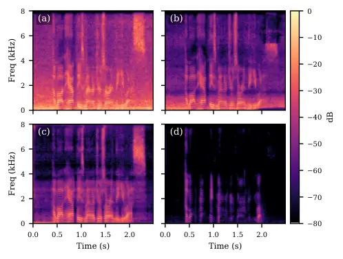

# UltraM2M: Leveraging Text Transcripts and Mixture Constraints for Weakly-Supervised Speech Enhancement

Jiachen Liu    Fulin Wu    Zhong-Qiu Wang

###### Abstract

We propose UltraM2M, a weakly-supervised speech enhancement algorithm
building upon the recent unsupervised mixture-to-mixture (M2M)
algorithm. M2M realizes unsupervised speech enhancement by training deep
neural networks on a set of real-recorded noisy-reverberant
multi-channel mixture signals to estimate target speech and non-target
signals. The two estimated signals are penalized by a so-called
mixture-constraint (MC) loss, which constrains them to reconstruct the
observed mixture signals. Although shown to be effective, the mixture
constraint may be too weak to enable sufficient noise reduction. To deal
with this, UltraM2M extends M2M by further leveraging text transcripts
of real-recorded mixtures to design an automatic speech recognition
(ASR) loss to penalize the estimated speech signal. The ASR loss can be
viewed as a form of weak supervision that could help unsupervised
enhancement. Evaluation results on the CHiME-$`4`$ dataset show the
effectiveness of UltraM2M.

###### Index Terms: 

weakly-supervised speech enhancement, robust automatic speech
recognition, unsupervised speech enhancement

^(†)^(†)address: Southern University of Science and Technology,
Shenzhen, China  
{liu.ameth, wang.zhongqiu41}@gmail.com

## 1 Introduction

The current dominant approach for speech enhancement (SE) is supervised
learning, where clean speech signals are synthetically mixed with noise
and reverberation to create simulated pairs of clean speech and
noisy-reverberant mixture signals for training supervised models such as
deep neural networks (DNNs) \[1, 2\]. Although obtaining strong SE
performance on simulated test data whose distribution is similar to that
of the simulated training set, the trained models often exhibit limited
generalizability to real-recorded mixture signals\[3, 4, 5, 6\], largely
due to the mismatches between simulated training and real-recorded test
conditions. In this context, unsupervised or weakly-supervised SE, which
trains DNN models directly on real-recorded data in the target domain,
has shown strong potential in addressing such mismatches \[7, 8, 9, 10,
11, 12, 13, 14\]. Compared with unsupervised methods, weakly-supervised
SE can obtain better performance, as it has some supervision to leverage
during training \[9, 10, 12, 11, 13, 14\].

Among various types of weakly-supervised SE methods \[12, 11, 13, 14\],
using automatic speech recognition (ASR) models to help train SE models
on real-recorded data is a practical choice \[13\], since annotating
real-recorded mixtures to produce the text transcripts required by ASR
models is inexpensive and straightforward. ASR systems, however, are
complicated: their effectiveness in improving SE is highly sensitive to
how they are exploited during training, and different strategies can
yield remarkably different enhancement performance. Therefore, steering
ASR systems toward an operating regime that reliably improves SE remains
a non-trivial challenge.

To exploit the weak supervision afforded by text transcripts, a natural
strategy is end-to-end joint training. Some studies first pre-train an
SE model and then jointly train it with an ASR model, optimizing only
the ASR loss \[15, 16, 17\]. Although better ASR performance is
reported, a practical limitation is that the ASR models used at run time
are often owned by third parties and closed-source, and therefore cannot
be used to train SE models. In addition, end-to-end training causes the
ASR model to adapt to artifacts introduced by the SE model, making the
two tightly coupled \[18, 19\]. This often renders the enhanced speech
less useful for other downstream tasks. Another strategy is multi-task
training, which optimizes both the enhancement and the ASR loss. There
are various ways to implement it, such as alternative training \[20\],
gradient remedy training \[21, 22\], and feature fusion training \[23\].
In these studies, the SE branch is usually designed for supervised
training and thus assumes the availability of clean target speech. Such
supervision, however, is unavailable for real-recorded mixtures, which
typically lack paired clean speech.

M2M training \[24\] trains DNN to produce an estimate for target speech
and another for non-target signals, such that the two estimates, after
being properly linearly-filtered and summated, can reconstruct the
observed mixtures. Building on this scheme, we propose UltraM2M, which
extends M2M by further exploiting text transcripts. Specifically,
UltraM2M employs pretrained, frozen ASR models to exploit the text
transcripts of real-recorded data. In addition to training on
real-recorded data, UltraM2M also inherits the co-learning strategy from
SuperM2M \[25\], which trains the same DNN model by alternating between
simulated and real-recorded mixtures. Unlike SuperM2M, where the
supervised training aims to avoid source permutation, frequency
permutation, and source ambiguity, the supervised training in UltraM2M
serves more as an auxiliary constraint. We therefore pack each
mini-batch with both simulated and real-recorded mixtures, so that both
data types contribute to the same parameter update. UltraM2M thus allows
us to exploit the weak supervision from text transcripts, which can be
obtained through inexpensive annotation, while mitigating its potential
drift by regularizing it with the MC loss and with supervised training
on simulated mixtures. On the CHiME-$`4`$ dataset \[26\], UltraM2M
obtains much better WER than SuperM2M on the real-recorded sets, as well
as much better speech quality in multi-channel settings.

## 2 Review of M2M

Figure 1: Overview of UltraM2M training. (A) supervised training on
simulated mixtures; and (B) M2M training with ASR loss on real-recorded
mixtures.

This section reviews M2M \[24\]. In a noisy-reverberant environment with
a compact $`P`$-microphone far-field array and a single target speaker,
the physical model for each recorded mixture can be formulated, in the
short-time Fourier transform (STFT) domain, as
$`Y_{p}(t,f)=X_{p}(t,f)+V_{p}(t,f)`$, where $`Y_{p}(t,f)`$,
$`X_{p}(t,f)`$, and $`V_{p}(t,f)`$ respectively denote the STFT
coefficients of the mixture, reverberant speech of the target speaker,
and non-speech signals captured by the far-field microphone $`p`$ at
time $`t`$ and frequency bin $`f`$. We aim to suppress non-speech
signals and reconstruct the reverberant target speech at a reference
microphone $`q`$ (i.e., $`X_{q}`$), based on the multi-channel input
mixture $`\mathbf{Y}=\{Y_{p}\}_{p=1}^{P}`$.

M2M is designed to train unsupervised SE models solely based on a set of
real-recorded mixtures. To employ M2M training, a DNN takes in far-field
mixtures as input and produces $`\hat{X}_{q}`$ and $`\hat{V}_{q}`$
respectively for the target signal and non-target signals at the
reference microphone $`q`$. Each estimated signal is then linearly
filtered by forward convolutive prediction (FCP) \[27\] and used to
optimize a mixture-constraint (MC) loss, which enforces the two
DNN-estimated signals to be able to reconstruct each of the far-field
mixture signals. The MC loss can be defined as follows:

```math
\mathcal{L}_{\text{MC}}=\mathcal{L}_{\text{MC},q}+\frac{1}{P-1}\sum\nolimits_{p=1,p\neq q}^{P}\mathcal{L}_{\text{MC},p}, \tag{1}
```

where $`\mathcal{L}_{\text{MC},q}`$ and $`\mathcal{L}_{\text{MC},p}`$
are respectively the MC losses at the reference microphone and each
non-reference microphone. At the reference microphone $`q`$, the sum of
the two estimates is constrained to be equal to the mixture:

```math
\mathcal{L}_{\text{MC},q}=\sum\nolimits_{t,f}\mathcal{F}\Big(Y_{q}(t,f),\;\hat{X}_{q}(t,f)+\hat{V}_{q}(t,f)\Big), \tag{2}
```

where the distance function $`\mathcal{F}`$ is defined as

```math
\displaystyle\mathcal{F}(a,b) \displaystyle={\mathcal{G}(a,b)}\big/\sum\nolimits_{t^{\prime},f^{\prime}}|a(t^{\prime},f^{\prime})|, \tag{3}
```

```math
\displaystyle\mathcal{G}(a,b) \displaystyle=\big|\mathcal{R}(a)-\mathcal{R}(b)\big|+\big|\mathcal{I}(a)-\mathcal{I}(b)\big|+\big||a|-|b|\big|, \tag{4}
```

with $`\mathcal{R}(\cdot)`$, $`\mathcal{I}(\cdot)`$, and $`|\cdot|`$
respectively extracting the real, imaginary, and magnitude components.
At each non-reference microphone $`p`$ ($`\neq q`$), since the estimates
are produced at microphone $`q`$, multi-frame linear filtering based on
FCP \[27\] is applied to account for inter-channel differences:

```math
\mathcal{L}_{\text{MC},p}=\sum\nolimits_{t,f}\mathcal{F}\Big(Y_{p}(t,f),\hat{\mathbf{h}}_{p}(f)^{\mathsf{H}}\overline{\hat{\mathbf{X}}}_{q}(t,f)+\hat{\mathbf{r}}_{p}(f)^{\mathsf{H}}\overline{\hat{\mathbf{V}}}_{q}(t,f)\Big), \tag{5}
```

where
$`{\overline{\hat{\mathbf{X}}}}_{q}(t,f)=[\hat{X}_{q}(t-I+1,f),\dots,\hat{X}_{q}(t+J,f)]^{\mathsf{T}}\in\mathbb{C}^{I+J}`$
stacks a window of $`I+J`$ T-F units of $`\hat{X}_{q}`$,
$`{\overline{\hat{\mathbf{V}}}}_{q}(t,f)`$ is analogously defined for
$`\hat{V}_{q}`$, and the filter taps $`I`$ and $`J`$ are
hyper-parameters. Taking $`\hat{\mathbf{h}}_{p}(f)`$ as an example, the
filter can be computed by FCP \[27\] by solving the following
minimization problem:

```math
\displaystyle\hat{\mathbf{h}}_{p}(f)=\underset{\textbf{h}_{p}(f)}{\text{argmin}}\sum\limits_{t}\frac{|Y_{p}(t,f)-\textbf{h}_{p}(f)^{\mathsf{H}}\overline{\hat{\textbf{X}}}_{q}(t,f)|^{2}}{\hat{\lambda}_{p}(t,f)}, \tag{6}
```

where
$`\hat{\lambda}_{p}(t,f)=\xi\cdot\max(|Y_{p}|^{2})+|Y_{p}(t,f)|^{2}`$
floors the denominator, and $`\xi`$ is a hyper-parameter to tune.

## 3 UltraM2M

This section presents UltraM2M, which (a) trains the DNN on
real-recorded mixtures with a frozen ASR loss and the MC loss, (b) keeps
a supervised loss on simulated mixtures, and (c) integrates the two
branches by using both simulated and real-recorded mixtures for model
training. See Fig. 1 for an illustration.

### 3.1 Weakly-Supervised Training on Real-Recorded Mixtures

Fig. 1 (B) illustrates UltraM2M weakly-supervised training on
real-recorded data. For each real mixture, the enhancement model takes a
fixed number of microphones of the input mixture as its input and
produces a target signal estimate and a non-target signal estimate.
Based on the two estimates, we take all microphones and use them to
compute the MC loss $`\mathcal{L}_{\text{MC}}`$ defined in Section 2.
Note that the MC loss constrains only the sum of the two estimates, and
thus cannot by itself tell which estimate corresponds to the target
speech; it therefore provides only a weak constraint for speech
enhancement. Using a pretrained, frozen ASR model, an ASR loss
$`\mathcal{L}_{\text{ASR}}`$ is employed to resolve this ambiguity by
penalizing the designated speech estimate when it does not match the
annotated transcript. Here we designate the first output as the speech
estimate, which is consistent with the following supervised training
branch. UltraM2M is not tied to a particular ASR model or ASR loss, so
it can be instantiated with any pretrained ASR backend. The loss for
training on real-recorded mixtures is defined as

```math
\mathcal{L}_{\text{REAL}}=\mathcal{L}_{\text{MC}}+\beta\times\mathcal{L}_{\text{ASR}}, \tag{7}
```

where $`\mathcal{L}_{\text{MC}}`$ is defined in Eq. (1) and $`\beta`$
controls the weight of the ASR loss.

The MC loss is computed from all the microphones of the training
mixture, whereas the DNN can take only a subset of the microphones as
its input. For example, we can feed the mixture at the reference
microphone to the DNN, while computing the MC loss over all the
microphones. Moreover, the ASR loss also only requires the DNN output
and transcripts. This way, the DNN can perform monaural enhancement at
run time.

### 3.2 Supervised Training on Simulated Mixtures

For simulated mixtures, the DNN is trained with a supervised loss as an
auxiliary constraint:

```math
\displaystyle\mathcal{L}_{X,q} \displaystyle=\frac{1}{{\sum_{t,f}|Y_{q}(t,f)|}}{\sum\nolimits_{t,f}\mathcal{G}\big(X_{q}(t,f),\hat{X}_{q}(t,f)\big)}, \tag{8}
```

```math
\displaystyle\mathcal{L}_{V,q} \displaystyle=\frac{1}{\sum\nolimits_{t,f}|Y_{q}(t,f)|}{\sum\nolimits_{t,f}\mathcal{G}\big(V_{q}(t,f),\hat{V}_{q}(t,f)\big)}, \tag{9}
```

where $`X_{q}`$ and $`V_{q}`$ are respectively the ground-truth
reverberant speech and non-speech components of the simulated mixture,
and the normalization and the distance $`\mathcal{G}(\cdot)`$ are the
same as in Eq. (4).

### 3.3 Batch Training with Both Simulated and Real Mixtures

During training, we compute each parameter update using both simulated
and real-recorded mixtures, rather than using only one type of mixture
per training step and alternating between the two losses across steps
\[20\]. Under an alternating schedule, an update is constrained by only
one of the two objectives; mixing both types in every update instead
lets the supervised loss on simulated mixtures regularize each update
and anchor the target/non-target assignment of the DNN, while the
real-recorded mixtures keep the model adapted to the target domain.
Because of memory limitations, we implement this by accumulating
gradients over five mini-batches of size $`1`$, whose mixture types are
drawn at random, so that each update typically aggregates both types of
mixtures. The parameters are updated once every five mini-batches.

## 4 Experimental Setup

We validate UltraM2M on the CHiME-$`4`$ dataset \[26, 28\]. The corpus
provides both simulated (SIMU) and real-recorded (REAL) mixtures for
training and testing. The signals are recorded with a tablet equipped
with $`6`$ microphones, with the second microphone located on the rear
and the others facing forward. The recording environments include buses,
cafeterias, streets, and pedestrian areas. The training, validation, and
test sets respectively contain $`7{,}138`$, $`1{,}640`$, and $`1{,}320`$
simulated mixtures, and $`1{,}600`$, $`1{,}640`$, and $`1{,}320`$ real
mixtures. All signals are sampled at $`16`$ kHz.

Figure 2: Robust ASR evaluation pipeline.

For ASR evaluation, we reproduce a strong ASR system in ESPnet \[29\]
released by Chang et al. \[30\]. It is based on an encoder-decoder
transformer trained on WavLM features \[31\] with a Transformer-based
language model for decoding. It achieves the best WER so far on
unprocessed mixtures. See Fig. 2 for the entire pipeline for ASR
evaluation, where the enhanced speech produced by our SE model is fed to
the ASR model for recognition.

To train the UltraM2M model, we investigate three architecturally
different ASR models: wav2vec 2.0 \[32\], which is encoder-only and
trained with connectionist temporal classification (CTC) loss;
Whisper-Base \[33\], which is encoder-decoder-based and trained with
cross-entropy (CE) loss; and the same Chang et al. model, which is
encoder-decoder-based and is trained by combining CE and CTC losses.
Note that at run time, we always use Chang et al.’s ASR model for
decoding, while we can use a different ASR model for UltraM2M training.

For UltraM2M, the STFT window size is $`32`$ ms, the hop size is $`8`$
ms, and the square-root Hann window is used as the analysis window. We
employ TF-GridNet \[34\] as the DNN architecture of UltraM2M. Using the
symbols defined in Table I of \[34\], we set
$`B=4,I=1,J=1,H=200,L=4,D=128`$ and $`E=4`$. For the M2M algorithm, we
set $`I=20,J=1`$ and $`\xi=10^{-2}`$. For the ASR backends, we set
$`\beta`$ to $`0,5`$, $`1.0`$, and $`0.05`$ respectively for the
Whisper-Base, wav2vec 2.0, and ESPnet backends, and we call these three
variants UltraM2M-Whis, UltraM2M-Wav2, and UltraM2M-ESPn. We train the
DNN with $`1`$-, $`2`$-, and $`6`$-microphone inputs, while all $`6`$
microphones are used to compute the MC loss. We take the fifth
microphone as the reference microphone for the cases of using $`1`$- and
$`6`$-channel inputs. For the case of using $`2`$-channel input, we use
the reference microphone and another microphone sampled from the other
four front microphones. DNSMOS OVRL \[35\] and word error rate (WER) are
used as the evaluation metrics. In training, we first train a DNN using
the SuperM2M method \[25\] without using close-talk mixtures to
initialize a common SE base model. Starting from this initialization, we
use UltraM2M to fine-tune the model. The initial learning rates for
SuperM2M and UltraM2M are respectively set to $`10^{-3}`$ and
$`10^{-4}`$. We employ early stopping with a patience of $`2`$ and a
decay factor of $`0.5`$. We also fine-tune the SE base model with the
ASR loss alone to isolate the contribution of the MC loss.

|                                                                                                     |                    |              |                         |          |                       |           |          |           |
| --------------------------------------------------------------------------------------------------- | ------------------ | ------------ | ----------------------- | -------- | --------------------- | --------- | -------- | --------- |
|                                                                                                     |                    |              | DNSMOS OVRL$`\uparrow`$ |          | WER (%)$`\downarrow`$ |           |          |           |
|                                                                                                     |                    | Input \#mics | Val.                    | Test     | Val.                  |           | Test     |           |
| Row                                                                                                 | System             |              | REAL                    | REAL     | SIMU                  | REAL      | SIMU     | REAL      |
| 0                                                                                                   | Mixture \[30\]     | $`1`$        | $`1.52`$                | $`1.39`$ | $`5.93`$              | $`4.03`$  | $`8.25`$ | $`4.47`$  |
| 1                                                                                                   | IRIS \[30\]        | $`1`$        | \-                      | \-       | 3.16                  | $`2.03`$  | 6.12     | $`3.92`$  |
| 2a                                                                                                  | Supervised         | $`1`$        | 3.33                    | 3.18     | $`3.53`$              | $`2.15`$  | $`8.05`$ | $`4.83`$  |
| 2b                                                                                                  | SuperM2M \[25\]    | $`1`$        | $`3.30`$                | $`3.14`$ | $`3.29`$              | $`2.05`$  | $`6.92`$ | $`3.60`$  |
| 2c                                                                                                  | UltraM2M-Whis      | $`1`$        | $`3.11`$                | $`2.91`$ | $`3.31`$              | 1.86      | $`6.94`$ | 3.12      |
| 2d                                                                                                  | UltraM2M-Wav2      | $`1`$        | $`3.06`$                | $`2.92`$ | $`3.55`$              | $`2.01`$  | $`7.14`$ | $`3.41`$  |
| 2e                                                                                                  | UltraM2M-ESPn      | $`1`$        | $`2.95`$                | $`2.71`$ | $`3.34`$              | $`1.91`$  | $`6.77`$ | $`3.13`$  |
| 3                                                                                                   | MultiIRIS \[36\]   | $`2`$        | \-                      | \-       | $`2.04`$              | $`1.66`$  | 2.04     | $`2.65`$  |
| 4a                                                                                                  | Supervised         | $`2`$        | 2.99                    | 2.83     | 1.54                  | $`11.93`$ | $`2.29`$ | $`23.18`$ |
| 4b                                                                                                  | SuperM2M \[25\]    | $`2`$        | $`1.81`$                | $`1.64`$ | $`1.57`$              | $`2.71`$  | $`2.22`$ | $`2.85`$  |
| 4c                                                                                                  | UltraM2M-Whis      | $`2`$        | $`2.71`$                | $`2.53`$ | $`1.90`$              | $`1.55`$  | $`2.12`$ | $`2.21`$  |
| 4d                                                                                                  | UltraM2M-Wav2      | $`2`$        | $`2.84`$                | $`2.62`$ | $`1.95`$              | 1.48      | $`2.37`$ | 2.16      |
| 4e                                                                                                  | UltraM2M-ESPn      | $`2`$        | $`2.64`$                | $`2.36`$ | $`1.97`$              | $`2.06`$  | $`2.98`$ | $`2.17`$  |
| 4f                                                                                                  | MIMO-Speech \[13\] | $`2`$        | $`1.99`$                | $`1.83`$ | $`5.57`$              | $`4.42`$  | $`8.04`$ | $`4.36`$  |
| 5                                                                                                   | MultiIRIS \[36\]   | $`6`$        | \-                      | \-       | $`1.22`$              | $`1.33`$  | $`1.24`$ | $`1.77`$  |
| 6a                                                                                                  | Supervised         | $`6`$        | $`2.36`$                | $`2.03`$ | 0.83                  | $`41.76`$ | $`1.31`$ | $`67.26`$ |
| 6b                                                                                                  | SuperM2M \[25\]    | $`6`$        | $`1.84`$                | $`1.63`$ | 0.83                  | $`2.42`$  | $`1.34`$ | $`2.26`$  |
| 6c                                                                                                  | UltraM2M-Whis      | $`6`$        | 2.66                    | 2.40     | $`1.01`$              | 1.41      | $`1.19`$ | $`1.90`$  |
| 6d                                                                                                  | UltraM2M-Wav2      | $`6`$        | $`2.65`$                | $`2.39`$ | $`1.03`$              | $`1.51`$  | 1.09     | $`1.86`$  |
| 6e                                                                                                  | UltraM2M-ESPn      | $`6`$        | $`2.40`$                | $`2.08`$ | $`1.25`$              | $`1.67`$  | $`1.50`$ | $`1.92`$  |
| 6f                                                                                                  | MIMO-Speech \[13\] | $`6`$        | $`1.54`$                | $`1.43`$ | $`4.25`$              | $`6.93`$  | $`4.68`$ | $`8.24`$  |
| Notes: \[25\] uses close-talk mixtures as an additional training loss. Here close-talk mixtures are |                    |              |                         |          |                       |           |          |           |
| assumed unavailable, so the SuperM2M results are reproduced without using them.                     |                    |              |                         |          |                       |           |          |           |

Table 1: DNSMOS and WER results on CHiME-$`4`$.

|     |               |              |             |                       |           |                         |          |
| --- | ------------- | ------------ | ----------- | --------------------- | --------- | ----------------------- | -------- |
|     |               | \#input mics |             | WER (%)$`\downarrow`$ |           | DNSMOS OVRL$`\uparrow`$ |          |
| Row | System        |              | Dataset     | Val.                  | Test      | Val.                    | Test     |
| 1   | Supervised    | $`6`$        | SIMU        | $`41.76`$             | $`67.26`$ | $`2.36`$                | $`2.03`$ |
|     | UltraM2M-Whis |              |             |                       |           |                         |          |
| 2   | w/ MC         | $`6`$        | SIMU + REAL | 1.41                  | 1.90      | 2.66                    | 2.40     |
| 3   | w/o MC        | $`6`$        | SIMU + REAL | $`1.56`$              | $`2.12`$  | $`2.53`$                | $`2.17`$ |
| 4   | w/ MC         | $`6`$        | REAL        | $`1.59`$              | $`2.32`$  | $`2.60`$                | $`2.29`$ |
| 5   | w/o MC        | $`6`$        | REAL        | $`1.54`$              | $`2.04`$  | $`2.29`$                | $`2.04`$ |
| 6   | w/ MC         | $`1`$        | SIMU + REAL | 1.86                  | 3.12      | 3.11                    | 2.91     |
| 7   | w/o MC        | $`1`$        | SIMU + REAL | $`2.53`$              | $`4.76`$  | $`2.46`$                | $`2.23`$ |

Table 2: Evaluation of MC loss on CHiME-$`4`$ REAL sets with
UltraM2M-Whis variants. Rows $`2`$ and $`6`$ are respectively the $`6`$-
and $`1`$-channel UltraM2M-Whis systems of Table 1.



Figure 3: Enhancement results of an example CHiME-$`4`$ mixture: (a)
Unprocessed mixture; (b) SuperM2M; (c) UltraM2M-Whis and (d) Supervised.

## 5 Evaluation Results and Discussion

Table 1 reports the DNSMOS-OVRL and WER results on the CHiME-$`4`$
simulated and real-recorded validation and test sets. The purely
supervised model (denoted as “Supervised”) is trained on simulated
mixtures only. We observe that it generalizes poorly to real-recorded
data in terms of ASR performance, consistent with the observations in
\[25\], whereas SuperM2M clearly improves on real-recorded data, showing
the effectiveness of M2M training. Relative to SuperM2M, UltraM2M
reduces WER on the REAL test set for every ASR backend and channel
count, and in conditions with $`2`$- and $`6`$-channel input it also
improves DNSMOS. This simultaneous gain in perceptual quality and
recognition accuracy confirms the effectiveness of UltraM2M.

Fig. 3 provides a mixture example to qualitatively illustrate the
effectiveness of UltraM2M. The mixture spectrogram is dominated by
background noise. SuperM2M suppresses the noise to some extent, but the
speech harmonics remain unclear. UltraM2M, driven by an ASR loss,
suppresses the noise more aggressively and yields clearer harmonic
structure, while retaining more of the original signal structure than
the purely supervised model, which tends to over-suppress especially in
mismatched test conditions. Note that, although the three ASR backends
differ in architecture and in the training criterion they provide, the
Whisper-Base and wav2vec 2.0 variants deliver consistently better
perceptual quality and comparable or better recognition accuracy on the
real-recorded sets, indicating that the proposed training does not
depend on a specific ASR backend.

MIMO-Speech \[13\] is another weakly-supervised speech enhancement
method, also leveraging text transcripts as supervision. However, its
enhancement result is obtained via time-invariant beamforming which
often has limited performance in conditions with strong reverberation,
diffuse noises and limited microphone counts. We reproduce it on
CHiME-$`4`$ using TF-GridNet as the masking network for its MVDR
beamformer, the same wav2vec 2.0 backend as UltraM2M-Wav2, and the same
combination of simulated and real-recorded training mixtures. Unlike
MIMO-Speech, the MC loss is designed for noisy-reverberant environments
and can work reasonably well even for input signals with a limited
number of microphones. UltraM2M obtains consistently better results on
both metrics, showing more robust effectiveness. Moreover, UltraM2M
outperforms IRIS \[30\] and MultiIRIS \[36\] in $`1`$- and $`2`$-channel
conditions, and remains competitive with MultiIRIS in $`6`$-channel
conditions, where IRIS and MultiIRIS are the previous best.

One further observation from Table 1 is that the ASR loss helps more in
the multi-channel settings, where SuperM2M’s perceptual quality is
markedly lower than in the monaural setting. With more input channels
but only a weak MC constraint, the DNN receives less guidance on which
spectro-temporal structure to retain and which to discard, and the ASR
loss resolves much of this ambiguity, thereby preventing the perceptual
quality from collapsing. Overall, the transcript-level supervision
improves recognition consistently and yields additional noise reduction
in the multi-channel settings, while the MC loss and the supervised
branch are designed to prevent this transcript-driven training from
drifting into a degraded regime.

Table 2 isolates the contribution of each constraint. Adding the MC loss
improves DNSMOS OVRL consistently, both when real-recorded mixtures are
used alone and when simulated mixtures are added. Its effect on WER,
however, depends on the data regime: with real-recorded mixtures only,
the MC loss trades a small amount of recognition accuracy for that
perceptual gain. When simulated mixtures are also used, in contrast, the
MC loss is what makes the system generalize; without it, the gap between
the validation and the test results widens. This motivates keeping
supervised training on simulated mixtures as an auxiliary constraint,
rather than training on real-recorded mixtures alone.

## 6 Conclusions

We have proposed UltraM2M, a weakly-supervised SE method that leverages
the text transcripts of real-recorded mixtures through pretrained,
frozen ASR models. M2M training and the co-learning strategy with
simulated mixtures provide the constraints that make this weak
supervision effective. We find that text transcripts are helpful for
weakly-supervised SE, and that the enhancement quality improves when
they are used under suitable constraints. UltraM2M could therefore be a
practical solution for realistic SE problems where clean reference
speech is usually unavailable, but text transcripts are cheap to
annotate and readily accessible.

## References

- \[1\] G. Huang, J. R. Jensen, J. Chen, J. Benesty, M. G.
  Christensen, A. Sugiyama, G. Elko, and T. Gaensler (2025) Advances in
  microphone array processing and multichannel speech enhancement. In
  Proc. ICASSP, pp. 1–5. Cited by: §1.
- \[2\] Y. Yurtay, H. Demirci, H. Tiryaki, T. Altun, and N.
  Yurtay (2026) A Comprehensive Review of Noise Reduction Techniques for
  Speech Enhancement. Neurocomputing, pp. 133738. Cited by: §1.
- \[3\] E. Vincent, S. Watanabe, A. A. Nugraha, J. Barker, and R.
  Marxer (2017) An Analysis of Environment, Microphone and Data
  Simulation Mismatches in Robust Speech Recognition. Computer Speech &
  Language 46, pp. 535–557. Cited by: §1.
- \[4\] W. Zhang, J. Shi, C. Li, S. Watanabe, and Y. Qian (2021) Closing
  the Gap between Time-domain Multi-channel Speech Enhancement on Real
  and Simulation Conditions. In Proc. WASPAA, pp. 146–150. Cited by: §1.
- \[5\] J. Zhang, C. Zorila, R. Doddipatla, and J. Barker (2022) On
  Monoaural Speech Enhancement for Automatic Recognition of Real Noisy
  Speech using Mixture Invariant Training. In Proc. Interspeech, Cited
  by: §1.
- \[6\] Z. Cui, C. Cui, T. Wang, M. He, H. Shi, M. Ge, C. Gong, L. Wang,
  and J. Dang (2025) Reducing the Gap between Pretrained Speech
  Enhancement and Recognition Models using a Real Speech-Trained
  Bridging Module. In Proc. ICASSP, pp. 1–5. Cited by: §1.
- \[7\] N. Saleem, M. I. Khattak, and E. Verdú (2020) On Improvement of
  Speech Intelligibility and Quality: A Survey of Unsupervised Single
  Channel Speech Enhancement Algorithms. Int. J. Interact. Multimed.
  Artif. Intell. 6 (2), pp. 78–89. Cited by: §1.
- \[8\] P. Ochieng (2023) Deep Neural Network Techniques for Monaural
  Speech Enhancement and Separation: State of the Art Analysis: P.
  Ochieng. Artificial Intelligence Review 56 (Suppl 3), pp. 3651–3703.
  Cited by: §1.
- \[9\] S. Leglaive, L. Borne, E. Tzinis, M. Sadeghi, M. Fraticelli, S.
  Wisdom, M. Pariente, D. Pressnitzer, and J. R. Hershey (2023) The
  CHiME-7 UDASE Task: Unsupervised Domain Adaptation for Conversational
  Speech Enhancement. In Proc. CHiME, pp. 7–12. Cited by: §1.
- \[10\] B. Nortier, M. Sadeghi, and R. Serizel (2024) Unsupervised
  Speech Enhancement with Diffusion-Based Generative Models. In Proc.
  ICASSP, pp. 12481–12485. Cited by: §1.
- \[11\] F. Pishdadian, G. Wichern, and J. Le Roux (2020) Finding
  Strength in Weakness: Learning to Separate Sounds with Weak
  Supervision. IEEE/ACM Trans. Audio, Speech, Lang. Process. 28,
  pp. 2386–2399. Cited by: §1, §1.
- \[12\] M. Maciejewski and S. Cornell (2026) Exploiting Noise
  Inseparability for Weakly-Supervised Discriminative Speech Denoising
  Using Noisy Targets. In Proc. IWAENC, Cited by: §1, §1.
- \[13\] X. Chang, W. Zhang, Y. Qian, J. Le Roux, and S. Watanabe (2019)
  MIMO-SPEECH: End-to-End Multi-Channel Multi-Speaker Speech
  Recognition. In Proc. ASRU, pp. 237–244. Cited by: §1, §1, Table 1,
  Table 1, §5.
- \[14\] Z. Xu, X. Fan, Z. Wang, X. Jiang, and R. Roy Choudhury (2025)
  ArrayDPS: Unsupervised Blind Speech Separation with a Diffusion Prior.
  In Proc. ICML, Cited by: §1, §1.
- \[15\] Z. Wang and D. Wang (2015) Joint Training of Speech Separation,
  Filterbank and Acoustic Model for Robust Automatic Speech Recognition.
  In Proc. Interspeech, pp. 2839–2843. Cited by: §1.
- \[16\] Z. Wang and D. Wang (2016) A Joint Training Framework for
  Robust Automatic Speech Recognition. IEEE/ACM Trans. Audio, Speech,
  Lang. Process. 24 (4), pp. 796–806. Cited by: §1.
- \[17\] Y. Masuyama, X. Chang, W. Zhang, S. Cornell, Z. Wang, N.
  Ono, Y. Qian, and S. Watanabe (2026) An End-to-End Integration of
  Speech Separation and Recognition with Self-Supervised Learning
  Representation. Computer Speech & Language 95, pp. 101813. Cited by:
  §1.
- \[18\] K. Iwamoto, T. Ochiai, M. Delcroix, R. Ikeshita, H. Sato, S.
  Araki, and S. Katagiri (2022) How Bad are Artifacts?: Analyzing the
  Impact of Speech Enhancement Errors on ASR. In Proc. Interspeech,
  pp. 5418–5422. Cited by: §1.
- \[19\] K. Iwamoto, T. Ochiai, M. Delcroix, R. Ikeshita, H. Sato, S.
  Araki, and S. Katagiri (2024) How Does End-to-End Speech Recognition
  Training Impact Speech Enhancement Artifacts?. In Proc. ICASSP,
  pp. 11031–11035. Cited by: §1.
- \[20\] S. E. Eskimez, X. Wang, M. Tang, H. Yang, Z. Zhu, Z. Chen, H.
  Wang, and T. Yoshioka (2021) Human Listening and Live Captioning:
  Multi-Task Training for Speech Enhancement. In Proc. Interspeech,
  pp. 2686–2690. Cited by: §1, §3.3.
- \[21\] Y. Hu, C. Chen, R. Li, Q. Zhu, and E. S. Chng (2023) Gradient
  Remedy for Multi-task Learning in End-to-End Noise-robust Speech
  Recognition. In Proc. ICASSP, pp. 1–5. Cited by: §1.
- \[22\] C. Lee, Y. Tsao, H. Wang, and C. Chen (2023) D4AM: A General
  Denoising Framework for Downstream Acoustic Models. In Proc. ICLR,
  Cited by: §1.
- \[23\] C. Fan, J. Yi, J. Tao, Z. Tian, B. Liu, and Z. Wen (2020) Gated
  Recurrent Fusion with Joint Training Framework for Robust End-to-End
  Speech Recognition. IEEE/ACM Trans. Audio, Speech, Lang. Process. 29,
  pp. 198–209. Cited by: §1.
- \[24\] Z. Wang (2024) Mixture to Mixture: Leveraging Close-Talk
  Mixtures as Weak-Supervision for Speech Separation. IEEE Signal
  Process. Lett. 31, pp. 1715–1719. Cited by: §1, §2.
- \[25\] Z. Wang (2025) SuperM2M: Supervised and Mixture-To-Mixture
  Co-Learning for Speech Enhancement and Noise-Robust ASR. Neural
  Networks 188, pp. 107408. Cited by: §1, Table 1, Table 1, Table 1,
  Table 1, §4, §5.
- \[26\] J. Barker, R. Marxer, E. Vincent, and S. Watanabe (2016) The
  fourth ‘CHiME’ Speech Separation and Recognition Challenge: Dataset,
  Task and Baselines. In Proc. Interspeech, pp. 1765–1769. Cited by: §1,
  §4.
- \[27\] Z. Wang, G. Wichern, and J. L. Roux (2021) Convolutive
  Prediction for Monaural Speech Dereverberation and Noisy-Reverberant
  Speaker Separation. IEEE/ACM Trans. Audio, Speech, Lang. Process. 29,
  pp. 3476–3490. Cited by: §2, §2, §2.
- \[28\] J. Barker, R. Marxer, E. Vincent, and S. Watanabe (2015) The
  Third ‘CHiME’ Speech Separation and Recognition Challenge: Dataset,
  Task and Baselines. In Proc. ASRU, pp. 504–511. Cited by: §4.
- \[29\] S. Watanabe, T. Hori, S. Karita, T. Hayashi, J. Nishitoba, Y.
  Unno, N. Enrique Yalta Soplin, J. Heymann, M. Wiesner, N. Chen, A.
  Renduchintala, and T. Ochiai (2018) ESPnet: End-to-End Speech
  Processing Toolkit. In Proc. Interspeech, pp. 2207–2211. External
  Links: [Document](https://dx.doi.org/10.21437/Interspeech.2018-1456),
  ISSN 2958-1796 Cited by: §4.
- \[30\] X. Chang, T. Maekaku, Y. Fujita, and S. Watanabe (2022)
  End-to-End Integration of Speech Recognition, Speech Enhancement, and
  Self-Supervised Learning Representation. In Proc. Interspeech,
  pp. 3819–3823. Cited by: Table 1, Table 1, §4, §5.
- \[31\] S. Chen, C. Wang, Z. Chen, Y. Wu, S. Liu, Z. Chen, J. Li, N.
  Kanda, T. Yoshioka, X. Xiao, et al. (2022) Wavlm: Large-Scale
  Self-Supervised Pre-Training for Full Stack Speech Processing. IEEE J.
  Sel. Top. Signal Process. 16 (6), pp. 1505–1518. Cited by: §4.
- \[32\] A. Baevski, Y. Zhou, A. Mohamed, and M. Auli (2020) wav2vec
  2.0: A Framework for Self-Supervised Learning of Speech
  Representations. In Proc. NeurIPS, Vol. 33, pp. 12449–12460. Cited by:
  §4.
- \[33\] A. Radford, J. W. Kim, T. Xu, G. Brockman, C. McLeavey, and I.
  Sutskever (2023) Robust Speech Recognition via Large-Scale Weak
  Supervision. In Proc. ICML, pp. 28492–28518. Cited by: §4.
- \[34\] Z. Wang, S. Cornell, S. Choi, Y. Lee, B. Kim, and S.
  Watanabe (2023) TF-GridNet: Integrating Full- and Sub-Band Modeling
  for Speech Separation. IEEE/ACM Trans. Audio, Speech, Lang. Process.
  31, pp. 3221–3236. Cited by: §4.
- \[35\] C. K. A. Reddy, V. Gopal, and R. Cutler (2022) Dnsmos P.835: A
  Non-Intrusive Perceptual Objective Speech Quality Metric to Evaluate
  Noise Suppressors. In Proc. ICASSP, pp. 886–890. Cited by: §4.
- \[36\] Y. Masuyama, X. Chang, S. Cornell, S. Watanabe, and N.
  Ono (2023) End-to-End Integration of Speech Recognition,
  Dereverberation, Beamforming, and Self-Supervised Learning
  Representation. In Proc. SLT, pp. 260–265. Cited by: Table 1, Table 1,
  §5.
