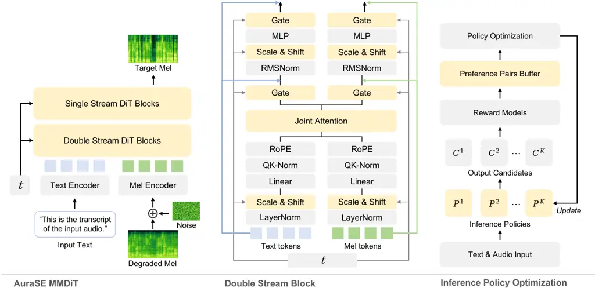

# AuraSE: Low-Hallucination Generative Speech Enhancement via Multimodal Flow Matching and Inference Policy Optimization

Yingda Shen    Yao Qian    Yuxuan Hu    Junan Zhang    Yuxiang Wang   
Hardik Hansrajbhai Chauhan    Yudong Li    Yufei Xia    Yufei Liu   
Zhizheng Wu

###### Abstract

Generative speech enhancement models can produce cleaner and more
natural-sounding speech than conventional discriminative approaches, but
may hallucinate by changing speech content or speaker identity, even
with transcript conditioning. We present AuraSE, a flow-matching
framework that addresses hallucination through complementary modality
and inference designs. First, a double-stream-to-single-stream
multimodal Diffusion Transformer (MMDiT) allows transcript and acoustic
representations to interact while preserving a dedicated pathway for the
degraded input. Second, we find that the best decoder configuration,
governed by guidance scale, sampling temperature, and step count, varies
substantially across utterances. This observation motivates Inference
Policy Optimization (IPO), an online, on-policy preference optimization
method. IPO generates multiple candidates from the current model under
different inference configurations, ranks them with a multi-objective
reward, and learns from their relative preferences. AuraSE-IPO ranks
first on $`11`$ of $`12`$ metrics across the synthetic test sets and
obtains the highest DNSMOS and blind-listening scores among the
evaluated systems on the real DNS blind test set. At deployment, it uses
a fixed $`10`$-step ODE decoder without classifier-free guidance (CFG)
or per-utterance configuration search.

¹The Chinese University of Hong Kong, Shenzhen

²Microsoft Research

## Introduction

Speech enhancement recovers clean, intelligible speech from degraded
recordings. Classical neural systems predict masks, spectra, or
waveforms under deterministic objectives (Défossez et al. 2020; Zhao et
al. 2022; Wang et al. 2023); they are stable and efficient but struggle
when the degradation is severe, reverberant, or out of distribution.
Recent generative models, especially diffusion- and flow-based
systems (Welker et al. 2022; Richter et al. 2023; Lemercier et al. 2023;
Liu et al. 2024b; Wang et al. 2025), are more expressive, modeling a
conditional distribution of clean speech given the noisy observation,
and achieve impressive perceptual quality in difficult acoustic scenes.

This generative capacity introduces a failure mode that is especially
damaging for speech: _hallucination_. A model can produce fluent,
high-quality audio while changing words, inserting phonetic content,
dropping weak speech, or drifting from the speaker (Saijo et al. 2025;
Rong et al. 2026a; Rong et al. 2026b). Such errors corrupt the content
the system should preserve; a “better sounding” output is not
necessarily a better enhancement.

Our first lever against hallucination is _modality_. An estimated
transcript can provide linguistic evidence that is difficult to recover
from severely degraded acoustics alone. We therefore build AuraSE around
a text-speech multimodal DiT: a double-stream-to-single-stream MMDiT in
which a mel stream (flow state plus degraded mel) and a text stream
interact through joint attention before merging into single-stream
blocks (Peebles and Xie 2023; Esser et al. 2024; Chen et al. 2025).
Retaining separate early representations is important when the
transcript is imperfect: text can reinforce weak phonetic evidence
without replacing the degraded acoustics that constrain speaker and
signal characteristics (Koizumi et al. 2023b; Wang et al. 2025).

Our second lever is _inference_. Diffusion and flow matching (Lipman et
al. 2022) generate from a random latent and are sensitive to
classifier-free guidance (CFG) scale (Ho and Salimans 2022), sampling
temperature, and step count, yet enhancement research typically reports
one fixed setting. We examine eight configurations and find strong
sample dependence: no configuration performs best for every utterance,
while per-utterance best-of-eight selection yields a substantially
better quality and fidelity trade-off than each tested fixed
configuration. Exhaustive per-utterance selection, however, is too
expensive to deploy.

We close this gap with Inference Policy Optimization (IPO), which
converts inference diversity into a training signal. At each round, the
current model decodes the same input under multiple configurations and a
multi-objective reward forms relative preferences between the
model-generated outputs. IPO optimizes these pairs with the
flow-matching energy surrogate used in prior FM-DPO (Zhang et al. 2026),
then refreshes both candidates and reference from the updated model.
This online, on-policy loop retains the deterministic ODE sampler while
keeping preference data aligned with the evolving model, unlike static
offline pairs or the SDE rollouts used by flow-matching GRPO (Shao et
al. 2024; Liu et al. 2026; Wang et al. 2026). At deployment, one fixed
configuration captures gains exposed by multi-configuration exploration
without per-utterance search.

Empirically, the double-stream MMDiT uses ASR and ground-truth
transcripts more effectively than a single-stream design. IPO then
improves the quality and fidelity trade-off over the AuraSE base and our
DPO and GRPO reproductions, while its buffered updates yield smoother
reward trajectories. AuraSE-IPO ranks first on $`11`$ of $`12`$
synthetic-set metrics and achieves the best DNSMOS and blind-listening
scores among the evaluated systems on real recordings.

Our contributions are as follows:

- •
  AuraSE, a low-hallucination generative enhancer. A
  double-stream-to-single-stream MMDiT integrates transcript and
  acoustic evidence, yielding strong content- and speaker-fidelity
  metrics together with the highest input-referenced human score among
  the evaluated systems.
- •
  A systematic study of decoder sensitivity. Across eight evaluated
  configurations, the reward-best configuration varies by utterance, and
  best-of-eight selection reveals gains unavailable to any tested fixed
  configuration.
- •
  IPO, on-policy RL from self-generated inference diversity. IPO
  repeatedly generates multi-configuration candidates from the current
  model and folds their relative preferences into a single fixed ODE
  decoder through buffered, on-policy updates.

## Related Work

### Generative Speech Enhancement

Speech enhancement has shifted from discriminative masking and mapping
toward generative modeling, which we group into three families.
Autoregressive (AR) language models cast enhancement as
sequence-to-sequence prediction over audio tokens, as in SELM (Wang et
al. 2024), GenSE (Yao et al. 2025), and LLaSE-G1 (Kang et al. 2025).
Masked generative models (MGM), including discrete-diffusion approaches,
iteratively refine tokenized audio for general restoration (MaskSR (Li
et al. 2024), AnyEnhance (Zhang et al. 2025)) and enhancement
(Genhancer (Yang et al. 2024)). Diffusion and flow-matching (DF) models
learn a continuous denoising map through score-SDE (Welker et al. 2022;
Richter et al. 2023), Schrödinger bridges (Li et al. 2025a), latent
diffusion (Liu et al. 2024b), and flow matching (Wang et al. 2025; Liu
et al. 2024a; Ku et al. 2024); AuraSE is a DF model.

Across all three families, generative expressiveness can cause
_hallucination_, namely fluent output that alters words or speaker
identity, as highlighted by the URGENT challenge (Saijo et al. 2025). A
growing line of work therefore injects linguistic or phonetic priors:
Miipher (Koizumi et al. 2023b) conditions restoration on text and
self-supervised features, FlowSE (Wang et al. 2025) feeds the transcript
as an auxiliary input, and PASE and UniPASE (Rong et al. 2026a; Rong et
al. 2026b) exploit a WavLM phonological prior. AuraSE instead fuses text
and acoustics through a double-stream-to-single-stream MMDiT and uses
inference-configuration sensitivity as supervision.

### Post-Training and Reinforcement Learning

Post-training with reinforcement learning is now standard for aligning
generative models with human preference across text (Ouyang et al. 2022;
Rafailov et al. 2023), vision (Wallace et al. 2024), and speech (Zhang
et al. 2024). Speech-restoration methods have optimized PESQ
adversarially (MetricGAN (Fu et al. 2019)), a learned NISQA predictor
via PPO (Kumar et al. 2025), or UTMOS via DPO (Li et al. 2025b). Closest
to us, offline DPO (Zhang et al. 2026) constructs a static preference
corpus, while online GRPO based on Flow-GRPO (Liu et al. 2026; Wang et
al. 2026) collects SDE rollouts and optimizes transition likelihoods.
IPO instead explores multiple ODE inference configurations and refreshes
pairwise supervision from the evolving model.

## Method



Figure 1: Overview of AuraSE. (left) A double-stream-to-single-stream
MMDiT enhances the degraded mel conditioned on the transcript,
predicting the flow velocity. (center) A double-stream block: mel and
text tokens attend jointly but keep separate projections. (right) IPO
decodes each input under diverse inference policies, scores the
candidates, forms self-generated preference pairs in a buffer, and
updates the model in a closed loop.

Given a noisy waveform, we extract a degraded mel-spectrogram $`y`$ and
seek to generate a clean mel-spectrogram $`x_{1}`$. The enhanced
waveform is reconstructed by a neural vocoder. AuraSE consists of a
multimodal flow-matching backbone (Fig. 1) and an inference policy
optimization stage.

### Multimodal Flow Matching

We adopt a conditional flow-matching objective. Let
$`z\sim\mathcal{N}(0,I)`$, sample $`u\sim\mathcal{U}(0,1)`$, and set
$`t=1-\cos(\pi u/2)`$ using the cosine schedule. Here, $`t=0`$
corresponds to noise and $`t=1`$ to an approximately clean endpoint,
with residual noise controlled by $`\sigma_{\min}`$. We define a
conditional optimal transport path

```math
x_{t}=\left(1-(1-\sigma_{\min})t\right)z+tx_{1}, \tag{1}
```

with target velocity

```math
u_{t}=x_{1}-(1-\sigma_{\min})z. \tag{2}
```

The enhancement model $`v_{\theta}`$ predicts the velocity field
conditioned on the degraded mel $`y`$ and optional text tokens $`c`$:

```math
\mathcal{L}_{\mathrm{FM}}(\theta)=\mathbb{E}_{x_{1},y,c,z,t}\left[\left\|v_{\theta}(x_{t},t,y,c)-u_{t}\right\|_{2}^{2}\right]. \tag{3}
```

For variable-length utterances, the loss is masked over valid mel
frames.

At inference time, the model integrates the learned velocity field from
noise toward clean speech:

```math
x_{t_{k+1}}=x_{t_{k}}+(t_{k+1}-t_{k})v_{\theta}(x_{t_{k}},t_{k},y,c), \tag{4}
```

where $`t_{k}=1-\cos(\pi k/(2K))`$ applies the same cosine schedule over
$`K`$ integration steps. The CFG scale, a sampling temperature $`\tau`$
applied to the initial latent $`z`$, and $`K`$ define the inference
policies studied below.

### Text-Speech Double-Stream MMDiT

The backbone follows a double-stream-to-single-stream transformer
design. The mel stream receives the concatenation of the current flow
state and the degraded mel, while the text stream embeds the tokenized
transcript:

```math
h_{m}^{0}=W_{m}[x_{t};y],\qquad h_{c}^{0}=\mathrm{Emb}(c), \tag{5}
```

The text stream is then refined by a one-dimensional ConvNeXt-V2
pre-net, and a shared timestep embedding modulates all transformer
blocks through adaptive normalization.

In each double-stream block, mel tokens and text tokens keep separate
projections but attend jointly over the concatenated sequence:

```math
Q=[Q_{m};Q_{c}],\quad K=[K_{m};K_{c}],\quad V=[V_{m};V_{c}], \tag{6}
```

followed by standard scaled dot-product attention
$`\mathrm{softmax}(QK^{\top}/\sqrt{d})\,V`$, where $`d`$ is the
attention-head dimension. The attention output is split back into mel
and text streams, each followed by its own output projection and
feed-forward network. After several double-stream blocks, we concatenate
the two streams and process them with single-stream DiT blocks:

```math
h^{\ell}=\mathrm{DiTBlock}^{\ell}([h_{m};h_{c}],t). \tag{7}
```

Only the mel tokens are passed to the final projection head to predict
the velocity. Text therefore influences acoustic generation through
attention, while the degraded input retains a dedicated representation
throughout the double-stream stages.

### Reinforcement Learning Baselines: DPO and GRPO

| Property                 | DPO (Zhang et al. 2026)  | GRPO (Wang et al. 2026) | IPO (Ours)                      |
| ------------------------ | ------------------------ | ----------------------- | ------------------------------- |
| Preference data          | Static off-policy corpus | On-policy SDE rollouts  | Refreshed on-policy buffer      |
| Policy regime            | Off-policy               | On-policy               | On-policy                       |
| Sampler (train / deploy) | ODE / matched            | SDE / mismatched        | ODE / matched                   |
| Multi-policy candidates  | ✗                        | ✗                       | ✓                               |
| Trajectory likelihood    | Not needed               | Per-step Gaussian       | Not needed                      |
| Learning signal          | Pairwise contrastive     | Policy gradient         | Pairwise contrastive            |
| Rollout + reward cost    | One-time (amortized)     | Every step              | Amortized over rollout interval |

Table 1: Reinforcement-learning setups compared in this work; DPO and
GRPO denote our reproductions. IPO retains ODE sampling, builds pairs
from multi-configuration outputs, and periodically refreshes its
on-policy buffer.

We post-train the base model with reinforcement learning from a
multi-objective reward. We adopt the two closest flow-matching
enhancement schemes as baselines: offline DPO (Zhang et al. 2026) and
online GRPO (Wang et al. 2026). Their complementary designs motivate
IPO’s combination of pairwise updates, on-policy data refresh, and ODE
sampling.

Given a chosen candidate $`x^{+}`$ and a rejected candidate $`x^{-}`$
for the same input $`(y,c)`$, DPO maximizes a reference-anchored
log-ratio margin:

```math
\mathcal{L}_{\mathrm{DPO}}=-\,\mathbb{E}\!\left[\log\sigma\!\big(\beta\,[\,\Delta_{\theta}(x^{+})-\Delta_{\theta}(x^{-})\,]\big)\right], \tag{8}
```

```math
\Delta_{\theta}(x)=\log\pi_{\theta}(x\mid y,c)-\log\pi_{\mathrm{ref}}(x\mid y,c), \tag{9}
```

where $`\pi_{\mathrm{ref}}`$ is a _frozen_ copy of the base model.
Deterministic flow matching admits no tractable sample likelihood, so we
follow the standard FM-DPO construction (Zhang et al. 2026): the
per-sample flow-matching error serves as a timestep-wise energy
surrogate, with policy and reference evaluated on shared $`(t,z)`$:

```math
E_{\theta}(x;y,c)=\mathbb{E}_{t,z}\!\left\|v_{\theta}(x_{t},t,y,c)-u_{t}\right\|_{2}^{2}, \tag{10}
```

Following this surrogate mapping,
$`\log\pi_{\theta}(x\mid y,c)\propto-E_{\theta}(x;y,c)`$ and
$`\Delta_{\theta}(x)=E_{\mathrm{ref}}(x)-E_{\theta}(x)`$. DPO thus
lowers velocity error on $`x^{+}`$ relative to $`x^{-}`$ against a
frozen anchor. It keeps the deterministic ODE sampler, but its
preference corpus is generated once; as the model evolves, these static
candidates may become less representative of its current output
distribution.

GRPO optimizes rewards on-policy following Flow-GRPO (Liu et al. 2026).
For each input, it generates a group of SDE trajectories by injecting
Gaussian noise into selected flow transitions, scores the final outputs,
and normalizes each reward within its group to obtain $`A_{i,k}`$. The
Gaussian transitions provide tractable log probabilities. Let
$`\rho_{i,k}`$ be the product of current-to-old transition likelihood
ratios along the selected SDE steps and
$`\bar{\rho}_{i,k}=\mathrm{clip}(\rho_{i,k},1-\epsilon,1+\epsilon)`$,
where $`\epsilon`$ is the clipping threshold. GRPO minimizes

```math
\mathcal{L}_{\mathrm{GRPO}}=-\mathbb{E}_{i,k}\!\left[\min\!\left(\rho_{i,k}A_{i,k},\bar{\rho}_{i,k}A_{i,k}\right)\right]. \tag{11}
```

FlowSE-GRPO (Wang et al. 2026) applies this construction to speech
enhancement. It explores through stochastic perturbations of one decoder
configuration and recomputes transition likelihoods during training.
Consequently, it trains with an SDE but returns to the original ODE for
deployment, whereas IPO uses ODE outputs throughout and requires no
trajectory likelihood.

### Inference Policy Optimization

Figure 2: Flow-matching inference is sample-dependent and a dense
preference source. Each of $`300`$ utterances is decoded under $`8`$
policies (CFG $`\in\{0,1\}`$, temp. $`\in\{0.7,1.0\}`$,
steps $`\in\{10,20\}`$) and scored by the reward. (a) Best-of-eight
selection improves on every tested fixed policy; (b) no policy dominates
the per-utterance winner; (c) reward gaps supply many potential
preference pairs.

IPO combines pairwise updates with periodically refreshed on-policy data
while retaining the deployment ODE (Table 1). Decoding the same input
under inference policies $`p_{j}=(\gamma_{j},\tau_{j},K_{j})`$, defined
by CFG scale, sampling temperature, and step count, yields candidates
with informative reward differences. Unlike reseeding one decoder, these
policies deliberately vary conditioning strength, latent scale, and
solver resolution, exposing structured quality and fidelity
alternatives. IPO uses the eight-policy set detailed in the
supplementary material, which also underlies Fig. 2.

Concretely, IPO runs a closed loop (Fig. 1, right). The current model
decodes each input under multiple inference policies; reward models
score the outputs, and sampled preference pairs populate a buffer for
policy optimization. The updated model then generates the next round.
For input $`i`$ with $`M`$ inference policies, we draw

```math
\mathcal{Y}_{i}=\big\{\hat{x}_{i}^{(j)}=\mathrm{Sample}_{\theta}(y_{i},c_{i};p_{j})\big\}_{j=1}^{M}, \tag{12}
```

and score each candidate with a multi-objective reward

```math
R(\hat{x},x_{1},y,c)=\sum_{q}w_{q}\,r_{q}(\hat{x},x_{1},y,c), \tag{13}
```

combining perceptual quality, WER, speaker similarity, and speech
BERTScore. We enumerate pairs with a positive reward gap and sample one
per utterance with probability proportional to that gap. This favors
informative contrasts without always collapsing supervision to the
single best-worst pair. Both members are model-generated; clean
references enter only through ranking metrics, never as preference
candidates.

Crucially, IPO is _on-policy and online_. At each round, candidates are
generated by the current model, whose parameters
$`\theta_{\mathrm{old}}`$ also serve as the round’s reference anchor;
after $`T_{\mathrm{r}}`$ bounded-reuse optimization steps, we replace
the buffer $`\mathcal{B}`$ with fresh candidates from the updated model
and re-sync the anchor to it. Writing $`\theta`$ for the updated model,
the IPO objective is

```math
\mathcal{L}_{\mathrm{IPO}}=-\,\mathbb{E}_{(x^{+},x^{-})\sim\mathcal{B}}\!\left[\log\sigma\!\big(\beta\,[\,\Delta^{\mathrm{on}}_{\theta}(x^{+})-\Delta^{\mathrm{on}}_{\theta}(x^{-})\,]\big)\right], \tag{14}
```

```math
\Delta^{\mathrm{on}}_{\theta}(x)=E_{\theta_{\mathrm{old}}}(x;y,c)-E_{\theta}(x;y,c). \tag{15}
```

This shares DPO’s pairwise form but changes both data collection and the
reference update. Offline DPO reuses candidates generated once and
contrasts the policy against a frozen base. IPO instead contrasts the
updated model with the previous-round model that produced the current
buffer; at the next refresh, both candidates and reference advance with
the model. The objective therefore trains on recent model outputs while
limiting each round’s update relative to its generating policy.

Bounded buffer reuse amortizes rollout and reward cost over
$`T_{\mathrm{r}}`$ updates while preserving recent-policy supervision.
Frequent refreshes more closely track the evolving model; longer reuse
improves amortization but eventually makes pairs stale.

## Experiments

### Experimental Setup

Model. The AuraSE backbone is a double-stream-to-single-stream
MMDiT (Peebles and Xie 2023; Esser et al. 2024; Chen et al. 2025)
operating on $`128`$-dimensional log-mel features at $`24`$ kHz. It uses
hidden size $`1024`$ and $`27`$ transformer blocks ($`9`$ double-stream
$`+`$ $`18`$ single-stream), with $`16`$ attention heads (head dim
$`64`$) and a feed-forward multiplier of $`3`$; text tokens are embedded
and refined by a $`4`$-layer ConvNeXt-V2 (Woo et al. 2023) pre-net, and
a shared timestep modulates all blocks through adaptive normalization. A
pretrained Vocos (Siuzdak 2023) vocoder reconstructs the waveform. Full
architecture and training hyperparameters are given in the supplementary
material.

|               | DPO  | GRPO | IPO  |
| ------------- | ---- | ---- | ---- |
| Reward spread | 0.53 | 0.54 | 0.58 |
| Mean reward   | 7.32 | 7.25 | 7.38 |

Table 2: Inference-policy variation yields a larger reward spread and
higher mean reward than stochastic reseeding or SDE perturbation
(randomly sampled $`20`$-utterance post-hoc diagnostic subset, $`8`$
candidates/utterance, reward max $`10`$; reward spread = mean
per-utterance best$`-`$worst reward gap).

Training. Training proceeds in three stages. _(i) Pretraining_ and _(ii)
continued pretraining_ use clean English speech from Emilia (He et al. 2024) as targets, with noise from the INTERSPEECH 2021 DNS Challenge
set (Reddy et al. 2021) and room impulse responses from
OpenSLR-26/28 (Ko et al. 2017); noisy inputs are synthesized on the fly
across varied SNRs, mixing modes, and reverberation. Pretraining masks
part of the degraded mel and uses a $`0.30`$ training CFG-drop rate to
strengthen text representations; continued pretraining removes masking
and reduces this rate to $`0.15`$, yielding the AuraSE base model.
_(iii) Post-training_ applies reinforcement learning on this base with
higher-quality LibriTTS-R (Koizumi et al. 2023a) speech and the same
noise and reverberation sources; IPO is our full method. Optimization
hyperparameters are in the supplementary material.

Test sets. We evaluate on three sets. _(i)_ A _simulated_ test set
constructed following FlowSE (Wang et al. 2025) by mixing clean
VCTK (Yamagishi et al. 2019) speech with unseen noise from
WHAM! (Wichern et al. 2019) and DEMAND (Thiemann et al. 2013) at SNRs
from $`-5`$ to $`10`$ dB, in a non-reverberant and a reverberant version
($`824`$ utterances each). _(ii)_ The _real-recording_ DNS
Challenge 2021 blind test set (Reddy et al. 2021), which has no clean
reference and probes robustness to genuine microphones and rooms.
_(iii)_ For efficient ablation, a $`300`$-utterance _ablation subset_
obtained by sampling $`150`$ utterances from each of the two
$`824`$-utterance simulated sets.

|             |      |             |       |       |        |       |       |                |       |       |        |       |       |
| ----------- | ---- | ----------- | ----- | ----- | ------ | ----- | ----- | -------------- | ----- | ----- | ------ | ----- | ----- |
|             |      | With Reverb |       |       |        |       |       | Without Reverb |       |       |        |       |       |
| Model       | Type | SIG         | BAK   | OVRL  | WER    | SIM   | SBS   | SIG            | BAK   | OVRL  | WER    | SIM   | SBS   |
| Noisy Input | \-   | 2.279       | 2.185 | 1.817 | 10.82% | 0.763 | 0.840 | 3.063          | 2.690 | 2.371 | 9.02%  | 0.859 | 0.862 |
| Baselines   |      |             |       |       |        |       |       |                |       |       |        |       |       |
| VoiceFixer  | \-   | 3.393       | 4.010 | 3.099 | 18.80% | 0.564 | 0.881 | 3.425          | 4.047 | 3.142 | 13.10% | 0.655 | 0.891 |
| PASE        | \-   | 3.231       | 3.854 | 2.865 | 10.39% | 0.716 | 0.882 | 3.492          | 4.066 | 3.209 | 8.05%  | 0.803 | 0.903 |
| LLaSE-G1    | AR   | 3.019       | 3.504 | 2.570 | 28.78% | 0.386 | 0.845 | 3.135          | 3.671 | 2.716 | 17.62% | 0.465 | 0.856 |
| AnyEnhance  | MGM  | 3.437       | 4.106 | 3.183 | 12.96% | 0.689 | 0.872 | 3.474          | 4.118 | 3.215 | 9.18%  | 0.782 | 0.899 |
| SGMSE       | DF   | 3.122       | 3.464 | 2.624 | 22.15% | 0.693 | 0.852 | 3.432          | 3.594 | 2.924 | 10.08% | 0.839 | 0.881 |
| StoRM       | DF   | 3.170       | 3.744 | 2.762 | 27.61% | 0.651 | 0.851 | 3.399          | 3.911 | 3.051 | 9.84%  | 0.849 | 0.887 |
| FlowSE      | DF   | 3.064       | 3.859 | 2.747 | 10.20% | 0.660 | 0.845 | 3.347          | 4.072 | 3.095 | 9.06%  | 0.719 | 0.883 |
| Ours        |      |             |       |       |        |       |       |                |       |       |        |       |       |
| AuraSE      | DF   | 3.463       | 4.123 | 3.197 | 9.65%  | 0.730 | 0.896 | 3.426          | 4.117 | 3.169 | 8.43%  | 0.772 | 0.906 |
| AuraSE-IPO  | DF   | 3.603       | 4.173 | 3.367 | 8.22%  | 0.757 | 0.907 | 3.575          | 4.167 | 3.338 | 6.98%  | 0.787 | 0.919 |

Table 3: Main results on the synthetic benchmark ($`824`$ reverberant
$`+`$ $`824`$ non-reverberant). Higher is better except WER;
bold/underline = best/second among enhancement systems, excluding the
noisy-input reference.

|             |       |       |       |                               |
| ----------- | ----- | ----- | ----- | ----------------------------- |
| Model       | SIG   | BAK   | OVRL  | Human$`\uparrow`$             |
| Noisy Input | 3.053 | 2.509 | 2.255 | \-                            |
| Baselines   |       |       |       |                               |
| VoiceFixer  | 3.291 | 3.959 | 2.991 | \-                            |
| PASE        | 3.490 | 4.057 | 3.203 | $`3.33{\pm}0.15`$             |
| LLaSE-G1    | 3.257 | 4.014 | 2.987 | \-                            |
| AnyEnhance  | 3.488 | 3.977 | 3.161 | $`3.43{\pm}0.16`$             |
| SGMSE       | 3.382 | 3.516 | 2.883 | \-                            |
| StoRM       | 3.341 | 3.648 | 2.898 | \-                            |
| FlowSE      | 3.257 | 3.787 | 2.880 | $`2.79{\pm}0.18`$             |
| Ours        |       |       |       |                               |
| AuraSE      | 3.441 | 4.044 | 3.144 | $`\underline{3.60{\pm}0.13}`$ |
| AuraSE-IPO  | 3.618 | 4.160 | 3.365 | $`\mathbf{3.74{\pm}0.13}`$    |

Table 4: Real-world DNS Challenge blind test set. SIG/BAK/OVRL are
non-intrusive DNSMOS scores; Human reports the input-referenced
blind-listening composite (mean $`{\pm}`$ 95% CI half-width).

| Model                         | OVRL  | WER    | SIM   | SBS   |
| ----------------------------- | ----- | ------ | ----- | ----- |
| Noisy                         | 2.101 | 9.91%  | 0.817 | 0.854 |
| Single-stream design          |       |        |       |       |
| w/ ASR text                   | 3.202 | 10.97% | 0.734 | 0.894 |
| w/ GT text                    | 3.193 | 10.97% | 0.735 | 0.894 |
| w/o text                      | 3.196 | 11.24% | 0.727 | 0.892 |
| Double-stream design (AuraSE) |       |        |       |       |
| w/ ASR text                   | 3.204 | 8.81%  | 0.758 | 0.902 |
| w/ GT text                    | 3.211 | 7.69%  | 0.763 | 0.904 |
| w/o text                      | 3.192 | 12.51% | 0.724 | 0.888 |

Table 5: Architecture and text-conditioning ablation ($`300`$-utterance
subset): single-stream vs. AuraSE’s double-stream design, each with
ground-truth text, ASR text, and no text.

Baselines. For overall enhancement we compare against representative
discriminative and generative systems: SGMSE (Welker et al. 2022),
StoRM (Lemercier et al. 2023), VoiceFixer (Liu et al. 2022), the
low-hallucination system PASE (Rong et al. 2026a), LLaSE-G1 (Kang et al.
2025), AnyEnhance (Zhang et al. 2025), and FlowSE (Wang et al. 2025). We
use their official checkpoints and recommended configurations; FlowSE
and AuraSE receive transcripts produced from the noisy input by the same
Whisper model. For reinforcement-learning post-training, we reproduce
the closely related DPO (Zhang et al. 2026) and GRPO (Wang et al. 2026)
methods on the shared AuraSE base model.

Metrics and reward. We report DNSMOS (Reddy et al. 2022) SIG, BAK, and
OVRL (reference-free) for perceptual quality; WER
(Whisper-large-v3 (Radford et al. 2023), scored against the reference
transcript) for lexical insertions, deletions, and substitutions;
speaker similarity (SIM, WavLM-based (Chen et al. 2022), against the
clean reference) for identity preservation; and Speech BERTScore
(SBS (Saeki et al. 2024), against the clean reference) for semantic
consistency. These metrics directly quantify the corresponding
observable failure dimensions: WER and SBS measure lexical and semantic
content hallucination, while SIM measures speaker drift. Following
multi-metric DPO and GRPO (Zhang et al. 2026; Wang et al. 2026), the
normalized reward weights OVRL, WER, SIM, and SBS by $`4{:}2{:}2{:}2`$.
This assigns $`40\%`$ to perceptual quality and $`60\%`$ collectively to
fidelity, mitigating single-metric reward hacking and better matching
human preference than a single reward (Zhang et al. 2026) (details in
the supplementary material).

|                                    |       |        |       |       |
| ---------------------------------- | ----- | ------ | ----- | ----- |
| Method                             | OVRL  | WER    | SIM   | SBS   |
| AuraSE (base)                      | 3.204 | 8.81%  | 0.758 | 0.902 |
| Oracle^(‡)                         | 3.271 | 5.87%  | 0.772 | 0.900 |
| Offline RL                         |       |        |       |       |
| GT-DPO                             | 3.113 | 13.35% | 0.636 | 0.889 |
| DPO                                | 3.251 | 9.42%  | 0.742 | 0.905 |
| IPO$`{}_{\mathrm{off}}^{\dagger}`$ | 3.280 | 7.97%  | 0.764 | 0.909 |
| Online RL                          |       |        |       |       |
| DPO$`{}_{\mathrm{on}}^{\dagger}`$  | 3.297 | 11.23% | 0.699 | 0.895 |
| GRPO                               | 3.324 | 10.91% | 0.751 | 0.907 |
| IPO (ours)                         | 3.373 | 7.59%  | 0.775 | 0.917 |

Table 6: RL ablation ($`300`$-utterance subset; shared AuraSE base).
DPO (Zhang et al. 2026) (offline) and GRPO (Wang et al. 2026) (online)
are prior baselines; $`\dagger`$ marks ablation-only variants (online
DPO, offline IPO) isolating the preference _source_ from the
offline/online axis; GT-DPO is a ground-truth-reference control;
$`\ddagger`$ is the non-deployable per-sample oracle (best of $`8`$ base
policies).

### The Inference Landscape Is Sample-Dependent

We first test IPO’s premise that flow-matching inference is
sample-dependent. On the $`300`$-utterance subset, we decode every
utterance under $`8`$ inference policies spanning CFG scale,
temperature, and step count and score all candidates with the reward
(Fig. 2). Three findings emerge. (i) Best-of-eight selection yields a
better WER and quality trade-off than every tested fixed policy. (ii) No
setting dominates: the per-utterance winner spreads across all $`8`$
policies, with the most frequent taking only $`18.3\%`$ (vs. $`12.5\%`$
uniform). (iii) The resulting reward gaps provide a dense source of
pairwise preferences. This configuration diversity therefore supplies
the supervision used by IPO.

Crucially, _how_ candidates are generated determines the quality of this
signal. Table 2 compares three preference sources on the same base
model: reseeding the default policy with fresh ODE noise (as in DPO), a
single-window SDE perturbation matched to GRPO training, and our
inference-policy variation. On this post-hoc diagnostic subset, varying
the inference policy gives the largest reward spread and highest mean
reward, supporting its use as IPO’s candidate source.

### Main Results on Synthetic Test Sets

Unless stated otherwise, AuraSE is conditioned on ASR transcripts of the
noisy input from Whisper-large-v3, which is also used to compute WER;
ground-truth-text results appear only in the ablation. Table 3 shows the
synthetic benchmark with and without reverberation. The base AuraSE is
competitive with the strongest baselines, including the
low-hallucination system PASE, and stands out on content faithfulness:
diffusion baselines such as SGMSE and StoRM suffer severe content loss
under reverberation (WER above $`20\%`$), whereas AuraSE keeps WER low
while matching or exceeding their perceptual quality. Adding IPO lowers
WER while raising DNSMOS, SIM, and SBS. AuraSE-IPO ranks first on $`11`$
of $`12`$ metrics; the exception is speaker similarity without
reverberation. Deployment uses the fixed policy
$`(\gamma,\tau,K)=(0,1.0,10)`$ with no per-utterance search, although
transcript generation remains an external ASR cost.

### Real-World Evaluation

On the real DNS blind test set, AuraSE-IPO attains the best
non-intrusive DNSMOS on all three axes among the evaluated systems
(Table 4). We also conduct an input-referenced blind test through a
custom website. Fifteen experienced listeners evaluate random subsets of
$`200`$ enhanced clips ($`40`$ inputs $`\times`$ five systems), with at
least five ratings per clip. The instructions explicitly identify
semantic inconsistency and speaker change as hallucination. Listeners
compare each anonymized enhancement with its noisy input and assign a
$`1`$–$`5`$ composite score covering clarity, content fidelity, speaker
similarity, hallucination, residual noise, and distortion. Thus, this
score evaluates both perceptual quality and hallucination rather than
generic audio quality alone. Both AuraSE variants outperform the three
representative baselines in mean score, with AuraSE-IPO highest at
$`3.74{\pm}0.13`$ (95% CI).

### Architecture and Text-Conditioning Ablation

We isolate the two design choices behind AuraSE’s faithfulness: the
double-stream architecture and how text is consumed. Table 5 compares a
single-stream design (text and mel concatenated from the input layer)
against AuraSE’s double-stream design, each with ground-truth text, ASR
text, and no text. Two effects stand out. First, the double-stream
design uses text far more effectively: with ground-truth text it reaches
$`7.69\%`$ WER versus $`10.97\%`$ single-stream, while also improving
SIM and SBS. This is consistent with a separate acoustic pathway that
lets text correct content while preserving speaker and signal detail.
Second, the gain is driven by content, not the mere presence of a text
stream: removing text degrades WER sharply ($`12.51\%`$), while ASR text
retains most of the gain ($`8.81\%`$).

### Reinforcement Learning Results

We now fix the AuraSE base model and isolate RL post-training on the
$`300`$-utterance subset (Table 6). Two reference points frame the
result. The per-sample _oracle_, the reward-best of eight base policies
per utterance, shows what static per-sample selection can offer (OVRL
$`3.271`$, WER $`5.87\%`$) and provides a non-deployable reference
point. _GT-DPO_, which pairs the ground-truth reference against a
default decode, reduces OVRL and sharply degrades WER and SIM. This
reproduces the GT-winner collapse reported for generative
speech-restoration alignment (Zhang et al. 2026) and underscores the
value of model-generated relative preferences.

Against these anchors the pattern is consistent. Holding the
offline/online setting fixed, inference-policy candidates improve every
metric: offline IPO\_(off) beats DPO, and full online IPO beats online
DPO. IPO also outperforms GRPO as an overall method. DPO and GRPO raise
perceptual quality but worsen WER, trading content faithfulness for
noise suppression. IPO instead improves OVRL and WER together and is
best on every metric among the trained methods. IPO also surpasses the
best-of-eight base reference on OVRL, SIM, and SBS, showing gains beyond
static per-sample selection.

Figure 3 inspects the observed optimization trajectories. In this
comparison, an intermediate buffer has the smoothest EMA reward
trajectory and reaches the highest reward, while an over-large buffer
retains stale pairs and settles lower. Buffer-free IPO still beats GRPO
and online DPO, supporting inference-policy candidates as the main
source of the gain. The reward spread among rollout policies shrinks
during training, consistent with distilling configuration-dependent
gains into one model, although reduced output diversity may also
contribute.

Figure 3: Online training dynamics vs. compute (GPU-hours,
EMA-smoothed). (a) Mean rollout reward for five online schemes; (b)
reward spread among rollout policies over training.

## Discussion

IPO treats inference behavior as supervision: multi-configuration
decoding surfaces sample-level preferences that on-policy optimization
folds back into the model. WER directly measures lexical changes, SBS
measures semantic drift, and SIM measures speaker drift, covering the
content and identity components of hallucination. Reusing these task
metrics as rewards is intentional and follows prior multi-metric DPO and
GRPO (Zhang et al. 2026; Wang et al. 2026); combining complementary
rewards is less susceptible to single-metric hacking and better aligned
with human preference (Zhang et al. 2026). Our evidence is not limited
to reward scores: improvements transfer to held-out synthetic
conditions, previously unseen real recordings, and an independent
input-referenced blind test that does not use the training reward models
and explicitly evaluates semantic and speaker hallucination. For ASR,
the transcript is generated once from each noisy input and fixed across
AuraSE variants, while the same Whisper decoding protocol evaluates
every system output. Importantly, WER is scored against the reference
transcript rather than the conditioning transcript, so copying an
erroneous ASR condition is penalized rather than rewarded, although
dependence on an external recognizer remains. Online RL remains costly
because each rollout requires vocoding and metric evaluation, so we
scope our claims to flow-matching speech enhancement.

## Conclusion

We presented AuraSE, a multimodal flow-matching framework for
low-hallucination speech enhancement. A double-stream MMDiT uses
transcript information as a content anchor, while IPO turns
sample-dependent decoder behavior into relative supervision from the
current model. Periodically refreshed rollouts keep this supervision
aligned with the evolving policy and distill gains exposed by multiple
inference configurations into one fixed ODE decoder. AuraSE-IPO achieves
leading hallucination-sensitive content metrics and strong speaker
fidelity while improving perceptual quality on synthetic speech; on real
recordings, it obtains the best DNSMOS and input-referenced
blind-listening scores among the evaluated systems. These results
support high-quality, low-hallucination enhancement without
per-utterance configuration search at deployment.

## References

- Chen et al. (2022) S. Chen, C. Wang, Z. Chen, Y. Wu, S. Liu, Z.
  Chen, J. Li, N. Kanda, T. Yoshioka, X. Xiao, et al. Wavlm: large-scale
  self-supervised pre-training for full stack speech processing. IEEE
  Journal of Selected Topics in Signal Processing 16 (6), pp. 1505–1518.
  Cited by: Experimental Setup.
- Chen et al. (2025) Y. Chen, Z. Niu, Z. Ma, K. Deng, C. Wang, J.
  JianZhao, K. Yu, and X. Chen F5-tts: a fairytaler that fakes fluent
  and faithful speech with flow matching. In Proceedings of the 63rd
  Annual Meeting of the Association for Computational Linguistics
  (Volume 1: Long Papers), pp. 6255–6271. Cited by: Introduction,
  Experimental Setup.
- Défossez et al. (2020) A. Défossez, G. Synnaeve, and Y. Adi Real time
  speech enhancement in the waveform domain. In Proceedings of the
  Conference of the International Speech Communication Association,
  External Links:
  [Document](https://dx.doi.org/10.21437/INTERSPEECH.2020-2409) Cited
  by: Introduction.
- Esser et al. (2024) P. Esser, S. Kulal, A. Blattmann, R. Entezari, J.
  Müller, H. Saini, Y. Levi, D. Lorenz, A. Sauer, F. Boesel, et al.
  Scaling rectified flow transformers for high-resolution image
  synthesis. In Forty-first international conference on machine
  learning, Cited by: Introduction, Experimental Setup.
- Fu et al. (2019) S. Fu, C. Liao, Y. Tsao, and S. Lin Metricgan:
  generative adversarial networks based black-box metric scores
  optimization for speech enhancement. In International Conference on
  Machine Learning, pp. 2031–2041. Cited by: Post-Training and
  Reinforcement Learning.
- He et al. (2024) H. He, Z. Shang, C. Wang, X. Li, Y. Gu, H. Hua, L.
  Liu, C. Yang, J. Li, P. Shi, et al. Emilia: an extensive,
  multilingual, and diverse speech dataset for large-scale speech
  generation. arXiv preprint arXiv:2407.05361. Cited by: Experimental
  Setup.
- Ho and Salimans (2022) J. Ho and T. Salimans Classifier-free diffusion
  guidance. arXiv preprint arXiv:2207.12598. Cited by: Introduction.
- Kang et al. (2025) B. Kang, X. Zhu, Z. Zhang, Z. Ye, M. Liu, Z.
  Wang, Y. Zhu, G. Ma, J. Chen, L. Xiao, et al. LLaSE-g1: incentivizing
  generalization capability for llama-based speech enhancement. arXiv
  preprint arXiv:2503.00493. Cited by: Generative Speech Enhancement,
  Experimental Setup.
- Ko et al. (2017) T. Ko, V. Peddinti, D. Povey, M. L. Seltzer, and S.
  Khudanpur A study on data augmentation of reverberant speech for
  robust speech recognition. In 2017 IEEE international conference on
  acoustics, speech and signal processing (ICASSP), pp. 5220–5224. Cited
  by: Experimental Setup.
- Koizumi et al. (2023a) Y. Koizumi, H. Zen, S. Karita, Y. Ding, K.
  Yatabe, N. Morioka, M. Bacchiani, Y. Zhang, W. Han, and A. Bapna
  Libritts-r: a restored multi-speaker text-to-speech corpus. Cited by:
  Experimental Setup.
- Koizumi et al. (2023b) Y. Koizumi, H. Zen, S. Karita, Y. Ding, K.
  Yatabe, N. Morioka, Y. Zhang, W. Han, A. Bapna, and M. Bacchiani
  Miipher: a robust speech restoration model integrating self-supervised
  speech and text representations. In 2023 IEEE Workshop on Applications
  of Signal Processing to Audio and Acoustics (WASPAA), pp. 1–5. Cited
  by: Introduction, Generative Speech Enhancement.
- Ku et al. (2024) P. Ku, A. H. Liu, R. Korostik, S. Huang, S. Fu,
  and A. Jukić Generative speech foundation model pretraining for
  high-quality speech extraction and restoration. arXiv preprint
  arXiv:2409.16117. Cited by: Generative Speech Enhancement.
- Kumar et al. (2025) A. Kumar, A. Perrault, and D. S. Williamson Using
  rlhf to align speech enhancement approaches to mean-opinion quality
  scores. In IEEE International Conference on Acoustics, Speech and
  Signal Processing, pp. 1–5. Cited by: Post-Training and Reinforcement
  Learning.
- Lemercier et al. (2023) J. Lemercier, J. Richter, S. Welker, and T.
  Gerkmann Storm: a diffusion-based stochastic regeneration model for
  speech enhancement and dereverberation. IEEE/ACM Transactions on
  Audio, Speech, and Language Processing. Cited by: Introduction,
  Experimental Setup.
- Li et al. (2025a) C. Li, Z. Chen, F. Bao, and J. Zhu Bridge-sr:
  schrödinger bridge for efficient sr. In IEEE International Conference
  on Acoustics, Speech and Signal Processing, pp. 1–5. Cited by:
  Generative Speech Enhancement.
- Li et al. (2025b) H. Li, N. Hou, Y. Hu, J. Yao, S. M. Siniscalchi,
  and E. S. Chng Aligning generative speech enhancement with human
  preferences via direct preference optimization. arXiv preprint
  arXiv:2507.09929. Cited by: Post-Training and Reinforcement Learning.
- Li et al. (2024) X. Li, Q. Wang, and X. Liu MaskSR: masked language
  model for full-band speech restoration. arXiv preprint
  arXiv:2406.02092. Cited by: Generative Speech Enhancement.
- Lipman et al. (2022) Y. Lipman, R. T. Chen, H. Ben-Hamu, M. Nickel,
  and M. Le Flow matching for generative modeling. arXiv preprint
  arXiv:2210.02747. Cited by: Introduction.
- Liu et al. (2024a) A. H. Liu, M. Le, A. Vyas, B. Shi, A. Tjandra,
  and W. Hsu Generative pre-training for speech with flow matching. In
  Proceedings of the Twelfth International Conference on Learning
  Representations, Cited by: Generative Speech Enhancement.
- Liu et al. (2024b) H. Liu, K. Chen, Q. Tian, W. Wang, and M. D.
  Plumbley AudioSR: versatile audio super-resolution at scale. In
  Proceedings of the IEEE International Conference on Acoustics, Speech
  and Signal Processing, Cited by: Introduction, Generative Speech
  Enhancement.
- Liu et al. (2022) H. Liu, X. Liu, Q. Kong, Q. Tian, Y. Zhao, D.
  Wang, C. Huang, and Y. Wang Voicefixer: a unified framework for
  high-fidelity speech restoration. arXiv preprint arXiv:2204.05841.
  Cited by: Experimental Setup.
- Liu et al. (2026) J. Liu, G. Liu, J. Liang, Y. Li, J. Liu, X. Wang, P.
  Wan, D. Zhang, and W. Ouyang Flow-grpo: training flow matching models
  via online rl. Advances in neural information processing systems 38,
  pp. 40783–40818. Cited by: Introduction, Post-Training and
  Reinforcement Learning, Reinforcement Learning Baselines: DPO and
  GRPO.
- Ouyang et al. (2022) L. Ouyang, J. Wu, X. Jiang, D. Almeida, C.
  Wainwright, P. Mishkin, C. Zhang, S. Agarwal, K. Slama, A. Ray, et al.
  Training language models to follow instructions with human feedback.
  Advances in neural information processing systems 35, pp. 27730–27744.
  Cited by: Post-Training and Reinforcement Learning.
- Peebles and Xie (2023) W. Peebles and S. Xie Scalable diffusion models
  with transformers. In Proceedings of the IEEE/CVF international
  conference on computer vision, pp. 4195–4205. Cited by: Introduction,
  Experimental Setup.
- Radford et al. (2023) A. Radford, J. W. Kim, T. Xu, G. Brockman, C.
  McLeavey, and I. Sutskever Robust speech recognition via large-scale
  weak supervision. In International conference on machine learning,
  pp. 28492–28518. Cited by: Experimental Setup.
- Rafailov et al. (2023) R. Rafailov, A. Sharma, E. Mitchell, C. D.
  Manning, S. Ermon, and C. Finn Direct preference optimization: your
  language model is secretly a reward model. Advances in Neural
  Information Processing Systems 36, pp. 53728–53741. Cited by:
  Post-Training and Reinforcement Learning.
- Reddy et al. (2021) C. K. Reddy, H. Dubey, K. Koishida, A. Nair, V.
  Gopal, R. Cutler, S. Braun, H. Gamper, R. Aichner, and S. Srinivasan
  Interspeech 2021 deep noise suppression challenge. Cited by:
  Experimental Setup, Experimental Setup.
- Reddy et al. (2022) C. K. Reddy, V. Gopal, and R. Cutler DNSMOS p.835:
  a non-intrusive perceptual objective speech quality metric to evaluate
  noise suppressors. In Proceedings of the IEEE International Conference
  on Acoustics, Speech and Signal Processing, Cited by: Experimental
  Setup.
- Richter et al. (2023) J. Richter, S. Welker, J. Lemercier, B. Lay,
  and T. Gerkmann Speech enhancement and dereverberation with
  diffusion-based generative models. IEEE/ACM Transactions on Audio,
  Speech, and Language Processing. Cited by: Introduction, Generative
  Speech Enhancement.
- Rong et al. (2026a) X. Rong, Q. Hu, M. Yesilbursa, K. Wojcicki, and J.
  Lu PASE: leveraging the phonological prior of wavlm for
  low-hallucination generative speech enhancement. In Proceedings of the
  AAAI Conference on Artificial Intelligence, Vol. 40, pp. 32826–32834.
  Cited by: Introduction, Generative Speech Enhancement, Experimental
  Setup.
- Rong et al. (2026b) X. Rong, Z. Wang, Y. Wang, J. Gao, and J. Lu
  UniPASE: a generative model for universal speech enhancement with high
  fidelity and low hallucinations. arXiv preprint arXiv:2604.14606.
  Cited by: Introduction, Generative Speech Enhancement.
- Saeki et al. (2024) T. Saeki, S. Maiti, S. Takamichi, S. Watanabe,
  and H. Saruwatari SpeechBERTScore: reference-aware automatic
  evaluation of speech generation leveraging nlp evaluation metrics.
  arXiv preprint arXiv:2401.16812. Cited by: Experimental Setup.
- Saijo et al. (2025) K. Saijo, W. Zhang, S. Cornell, R. Scheibler, C.
  Li, Z. Ni, A. Kumar, M. Sach, Y. Fu, W. Wang, et al. Interspeech 2025
  urgent speech enhancement challenge. arXiv preprint arXiv:2505.23212.
  Cited by: Introduction, Generative Speech Enhancement.
- Shao et al. (2024) Z. Shao, P. Wang, Q. Zhu, R. Xu, J. Song, X. Bi, H.
  Zhang, M. Zhang, Y. Li, Y. Wu, et al. Deepseekmath: pushing the limits
  of mathematical reasoning in open language models. arXiv preprint
  arXiv:2402.03300. Cited by: Introduction.
- Siuzdak (2023) H. Siuzdak Vocos: closing the gap between time-domain
  and fourier-based neural vocoders for high-quality audio synthesis.
  arXiv preprint arXiv:2306.00814. Cited by: Experimental Setup.
- Thiemann et al. (2013) J. Thiemann, N. Ito, and E. Vincent The diverse
  environments multi-channel acoustic noise database (demand): a
  database of multichannel environmental noise recordings. In
  Proceedings of Meetings on Acoustics, Vol. 19, pp. 035081. Cited by:
  Experimental Setup.
- Wallace et al. (2024) B. Wallace, M. Dang, R. Rafailov, L. Zhou, A.
  Lou, S. Purushwalkam, S. Ermon, C. Xiong, S. Joty, and N. Naik
  Diffusion model alignment using direct preference optimization. In
  Proceedings of the IEEE/CVF Conference on Computer Vision and Pattern
  Recognition, pp. 8228–8238. Cited by: Post-Training and Reinforcement
  Learning.
- Wang et al. (2026) H. Wang, B. Tian, Y. Jiang, Z. Pan, S. Zhao, B.
  Ma, D. Chen, and X. Li FlowSE-grpo: training flow matching speech
  enhancement via online reinforcement learning. In Proceedings of the
  IEEE International Conference on Acoustics, Speech and Signal
  Processing, External Links:
  [Document](https://dx.doi.org/10.1109/ICASSP55912.2026.11461623) Cited
  by: Introduction, Post-Training and Reinforcement Learning,
  Reinforcement Learning Baselines: DPO and GRPO, Reinforcement Learning
  Baselines: DPO and GRPO, Table 1, Experimental Setup, Experimental
  Setup, Table 6, Discussion.
- Wang et al. (2023) Z. Wang, S. Cornell, S. Choi, Y. Lee, B. Kim,
  and S. Watanabe TF-gridnet: integrating full-and sub-band modeling for
  speech separation. IEEE/ACM Transactions on Audio, Speech, and
  Language Processing. Cited by: Introduction.
- Wang et al. (2025) Z. Wang, Z. Liu, X. Zhu, Y. Zhu, M. Liu, J.
  Chen, L. Xiao, C. Weng, and L. Xie FlowSE: efficient and high-quality
  speech enhancement via flow matching. arXiv preprint arXiv:2505.19476.
  Cited by: Introduction, Introduction, Generative Speech Enhancement,
  Generative Speech Enhancement, Experimental Setup, Experimental Setup.
- Wang et al. (2024) Z. Wang, X. Zhu, Z. Zhang, Y. Lv, N. Jiang, G.
  Zhao, and L. Xie SELM: speech enhancement using discrete tokens and
  language models. In Proceedings of the IEEE International Conference
  on Acoustics, Speech and Signal Processing, Cited by: Generative
  Speech Enhancement.
- Welker et al. (2022) S. Welker, J. Richter, and T. Gerkmann Speech
  enhancement with score-based generative models in the complex stft
  domain. arXiv preprint arXiv:2203.17004. Cited by: Introduction,
  Generative Speech Enhancement, Experimental Setup.
- Wichern et al. (2019) G. Wichern, J. Antognini, M. Flynn, L. R.
  Zhu, E. McQuinn, D. Crow, E. Manilow, and J. L. Roux Wham!: extending
  speech separation to noisy environments. Cited by: Experimental Setup.
- Woo et al. (2023) S. Woo, S. Debnath, R. Hu, X. Chen, Z. Liu, I. S.
  Kweon, and S. Xie Convnext v2: co-designing and scaling convnets with
  masked autoencoders. In Proceedings of the IEEE/CVF conference on
  computer vision and pattern recognition, pp. 16133–16142. Cited by:
  Experimental Setup.
- Yamagishi et al. (2019) J. Yamagishi, C. Veaux, and K. MacDonald CSTR
  VCTK Corpus: english multi-speaker corpus for CSTR voice cloning
  toolkit. University of Edinburgh. The Centre for Speech Technology
  Research. External Links:
  [Document](https://dx.doi.org/10.7488/ds/2645) Cited by: Experimental
  Setup.
- Yang et al. (2024) H. Yang, J. Su, M. Kim, and Z. Jin Genhancer:
  high-fidelity speech enhancement via generative modeling on discrete
  codec tokens. In Proceedings of the Conference of the International
  Speech Communication Association, Cited by: Generative Speech
  Enhancement.
- Yao et al. (2025) J. Yao, H. Liu, C. Chen, Y. Hu, E. Chng, and L. Xie
  GenSE: generative speech enhancement via language models using
  hierarchical modeling. In Proceedings of the Thirteenth International
  Conference on Learning Representations, Cited by: Generative Speech
  Enhancement.
- Zhang et al. (2024) D. Zhang, Z. Li, S. Li, X. Zhang, P. Wang, Y.
  Zhou, and X. Qiu SpeechAlign: aligning speech generation to human
  preferences. In The Thirty-eighth Annual Conference on Neural
  Information Processing Systems, Cited by: Post-Training and
  Reinforcement Learning.
- Zhang et al. (2025) J. Zhang, J. Yang, Z. Fang, Y. Wang, Z. Zhang, Z.
  Wang, F. Fan, and Z. Wu AnyEnhance: a unified generative model with
  prompt-guidance and self-critic for voice enhancement. IEEE
  Transactions on Audio, Speech and Language Processing. Cited by:
  Generative Speech Enhancement, Experimental Setup.
- Zhang et al. (2026) J. Zhang, X. Zhang, J. Yang, Y. Wang, F. Fan,
  and Z. Wu Multi-metric preference alignment for generative speech
  restoration. In Proceedings of the AAAI Conference on Artificial
  Intelligence, pp. 34737–34745. Cited by: Introduction, Post-Training
  and Reinforcement Learning, Reinforcement Learning Baselines: DPO and
  GRPO, Reinforcement Learning Baselines: DPO and GRPO, Table 1,
  Experimental Setup, Experimental Setup, Reinforcement Learning
  Results, Table 6, Discussion.
- Zhao et al. (2022) S. Zhao, B. Ma, K. N. Watcharasupat, and W. Gan
  FRCRN: boosting feature representation using frequency recurrence for
  monaural speech enhancement. In Proceedings of the IEEE International
  Conference on Acoustics, Speech and Signal Processing, Cited by:
  Introduction.
