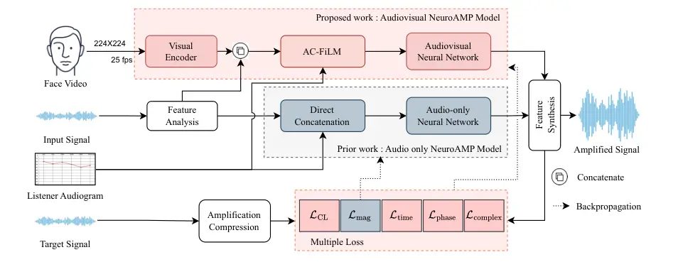
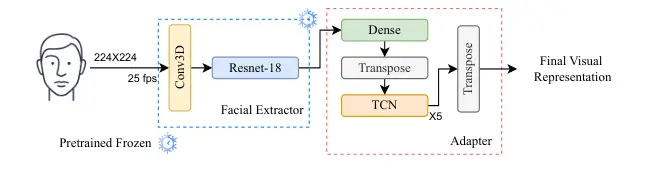
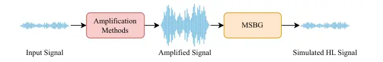

# Audiovisual joint learning for end-to-end hearing aids

You-Jin Li Affiliation:  Graduate Institute of Communication
Engineering, National Taiwan University, Taipei, Taiwan    Yu Tsao
Email: <yu.tsao@citi.sinica.edu.tw> Affiliation:  Research Center for
Information Technology Innovation, Academia Sinica, Taipei, Taiwan   
Borching Su Affiliation:  Graduate Institute of Communication
Engineering, National Taiwan University, Taipei, Taiwan    Kuan-Chung
Ting Affiliation:  Department of Otolaryngology-Head and Neck Surgery,
Taipei Veterans General Hospital, Taipei, Taiwan Affiliation:  School of
Medicine, National Yang Ming Chiao Tung University, Taipei, Taiwan   
Fan-Gang Zeng Affiliation:  Center for Hearing Research, University of
California, Irvine, California, USA

###### Abstract

Speech understanding in noise remains challenging for hearing-aid users,
particularly in the presence of competing speakers. Conventional hearing
aids typically perform speech enhancement (SE) and hearing-loss
compensation in separate stages, which may cause enhancement errors and
signal distortions to carry over to the amplification stage. Moreover,
audio-only SE often provides limited benefits under competing-speech
conditions because the target and interfering speech share similar
acoustic characteristics, making them difficult to separate. To address
these limitations, we propose AV-NeuroAMP, an end-to-end audiovisual
framework that integrates noisy speech, target-talker video, and the
listener’s audiogram to jointly perform SE, personalized amplification,
and dynamic-range compression. We further introduce
audiogram-conditioned feature-wise linear modulation (AC-FiLM) to
effectively incorporate listener-specific hearing profiles. Objective
evaluations showed that AV-NeuroAMP outperformed conventional
amplification, the audio-only NeuroAMP model, and two-stage systems on
an in-domain English test set, and that these improvements were retained
on an unseen Mandarin test set. Listening tests involving normal-hearing
participants under simulated hearing loss and listeners with hearing
loss further demonstrated improvements in speech quality and
intelligibility, with the greatest benefits observed under
competing-speech conditions. These findings support end-to-end
audiovisual personalized amplification as a promising approach for
improving hearing-aid performance in challenging acoustic environments.

## I Introduction

More than 430 million people experience disabling hearing loss, and this
number is expected to continue rising \[90\]. Hearing impairment is
associated with communication difficulties that may lead to social
isolation, depression, and reduced quality of life \[79, 55, 25\]. It
has also been identified as a potentially modifiable risk factor for
dementia in the 2024 report of the Lancet Standing Commission \[59,
58\]. Hearing aids remain the primary intervention for improving speech
audibility \[27\] and may alter the neural encoding of speech in older
adults with hearing loss \[44\]. However, their benefits are often
limited in the presence of background noise, reverberation, or competing
speech \[41, 32, 5\], contributing to user dissatisfaction and
inconsistent use \[63\]. These persistent challenges, particularly those
involving competing speech, motivate further advances in hearing-aid
signal processing.

Most current hearing aids compensate for hearing loss through
prescriptive amplification and dynamic-range compression. The National
Acoustic Laboratories–Revised (NAL-R) prescription \[17\] specifies
frequency-dependent linear gain, whereas nonlinear prescriptions, such
as NAL-NL1 \[16\], NAL-NL2 \[51\], and DSL m\[i/o\] \[78\], specify gain
as a function of both frequency and input level. Wide dynamic range
compression (WDRC) \[45\] provides level-dependent gain to accommodate
the reduced auditory dynamic range associated with hearing loss. It has
also been reported that applying insertion gain at 10 kHz can
successfully restore audibility for approximately 40% of ears with
mild-to-moderate hearing loss \[67\].

In addition to amplification-compression, modular hearing-aid systems
commonly incorporate speech enhancement (SE) to facilitate listening in
noisy environments \[50\]. Conventional single-channel SE methods
include spectral subtraction \[12, 8\] and statistical estimation \[77,
33, 80, 62\]; however, their performance may deteriorate under
nonstationary noise and competing-speech conditions \[26, 22, 87\].
Multichannel beamforming \[86, 28\] is another widely used approach, but
its performance may also be degraded by reverberation, source or head
movement, microphone mismatch, and wind noise \[9, 81, 94\]. Beyond
these challenges, optimizing SE and amplification-compression separately
may fail to account for the final listener-specific output, allowing
residual interference to be amplified along with the target speech \[5,
15\]. These limitations motivate approaches that jointly address SE and
listener-specific compensation.

Deep learning has advanced a wide range of speech-processing
applications \[42, 87\]. It has also substantially improved SE
performance, leading to the development of numerous architectures,
including convolutional networks \[36, 72\], recurrent and long
short-term memory networks \[84, 89\], Transformers \[60\], Mamba-based
models \[19\], and hybrid architectures \[1, 88\]. Perceptually
motivated training objectives have also been studied \[35, 53, 37\].

Recently, deep learning has also been applied to improve hearing-aid
signal processing \[95, 49, 31, 29, 30, 56, 4\]. For hearing-loss
compensation, auditory-model inversion trains a neural network, such
that the simulated response of an impaired auditory periphery
approximates a normal-hearing reference \[31, 29, 30\], typically using
differentiable approximations of computational auditory models \[56\].
Another approach combines learned noise reduction with controllable
WDRC \[95\]. Meanwhile, a neural-network-based amplification system,
termed NeuroAMP, was proposed to learn a direct mapping from an acoustic
input and a listener’s audiogram to a hearing-loss-compensated
output \[4\]. However, these hearing-loss compensation approaches do not
incorporate visual cues. Audio-only processing may still struggle under
strong interference and competing-speech conditions, where it may fail
to fully separate the target speech or introduce distortions that
degrade perceived quality \[13, 52\]. In this study, we extend neural
compensation by incorporating visual cues to address these remaining
challenges.

Auditory and visual cues provide partially independent yet complementary
information. Visual signals convey articulatory configurations and
place-of-articulation information, including viseme-related cues \[71\],
whereas auditory temporal-envelope and spectral cues convey consonant
distinctions that may be visually ambiguous \[85\]. The frequency-band
importance function for consonant recognition also changes when visual
cues are available, indicating that visual information complements
rather than duplicates acoustic information in specific frequency
bands \[7\]. The audiovisual benefit observed in listeners with hearing
loss has been attributed to these complementary cues \[40\]. Seeing a
talker’s face also helps children with hearing loss recognize speech in
noise \[54\].

Complementary visual information has also been leveraged to develop deep
learning–based audiovisual speech-enhancement (AVSE) models. Numerous
studies have demonstrated that incorporating visual cues enables AVSE
models to outperform audio-only SE systems, particularly at low
signal-to-noise ratios (SNRs) and under competing-talker
conditions \[43, 34, 65, 23, 38, 91\]. A diverse range of deep-learning
architectures has been explored for AVSE, ranging from convolutional and
recurrent fusion networks \[65, 43, 24\] to Transformer-based \[3\] and
Mamba-based \[21\] models. To facilitate efficient online processing,
lightweight architectures have also been developed to reduce
computational complexity \[61\].

In this study, we extend NeuroAMP \[4\], which demonstrated the
potential benefits of jointly optimizing SE and neural hearing-loss
compensation through end-to-end training, by incorporating visual cues
into the proposed AV-NeuroAMP framework. AV-NeuroAMP jointly performs
AVSE and listener-specific hearing-loss compensation. We further
introduce audiogram-conditioned feature-wise linear modulation (AC-FiLM)
to effectively integrate listener-specific audiogram information into
the framework.

To evaluate AV-NeuroAMP, we conducted comprehensive objective and
subjective experiments, along with band-specific gain analyses and an
ablation study assessing the effectiveness of AC-FiLM. The results
demonstrate that AV-NeuroAMP outperforms competing baselines, including
conventional hearing-loss compensation, the audio-only NeuroAMP model,
and two-stage SE–compensation systems in objective and subjective
evaluations under noisy conditions. They also show that AC-FiLM
outperforms direct audiogram concatenation within the same audiovisual
backbone. Finally, AV-NeuroAMP demonstrates promising cross-lingual
generalization.

The main contributions of this work are fourfold: (1) We propose
AV-NeuroAMP, the first framework to integrate an audiovisual front end
with neural hearing-loss compensation, achieving promising performance
under challenging noisy conditions. (2) We develop AC-FiLM, which
effectively incorporates listener-specific audiogram information into
the neural amplification framework through frequency-dependent feature
modulation. (3) Through objective evaluations, ablation studies, and
band-specific gain analyses, we demonstrate that AV-NeuroAMP outperforms
competing baselines and exhibits promising cross-lingual generalization.
(4) We validate the perceptual benefits of AV-NeuroAMP through listening
tests involving both listeners with hearing loss and normal-hearing
listeners under simulated hearing loss. The results demonstrate improved
speech quality and intelligibility, particularly under competing-speech
conditions.

Collectively, these contributions highlight the potential of integrating
multimodal information with neural hearing-loss compensation to advance
the design of next-generation hearing aids.

## II Methods

Given an input speech signal $`\mathbf{y}`$, consisting of target speech
$`\mathbf{s}`$, background noise $`\mathbf{b}`$, and interfering speech
$`\mathbf{i}`$, such that
$`\mathbf{y}=\mathbf{s}+\mathbf{b}+\mathbf{i}`$, a hearing-aid system
processes $`\mathbf{y}`$ together with the listener’s audiogram
$`\mathbf{a}`$ to produce a listener-specific amplified output
$`\mathbf{s}_{\mathrm{Amp}}`$. Conventional hearing-aid systems
typically adopt a two-stage architecture, in which an SE front end first
enhances $`\mathbf{y}`$, followed by a hearing-loss compensation stage
that generates the final output $`\mathbf{s}_{\mathrm{Amp}}`$ based on
the listener’s audiogram $`\mathbf{a}`$.

NeuroAMP employs an end-to-end neural network to directly estimate
$`\mathbf{s}_{\mathrm{Amp}}`$ from $`\mathbf{y}`$ and $`\mathbf{a}`$,
with the training target generated by applying NAL-R and WDRC to the
clean target speech. AV-NeuroAMP further incorporates visual cues
$`\mathbf{v}`$ to jointly perform SE and personalized hearing-loss
compensation. To facilitate neural hearing-loss compensation, each
listener is represented by an audiogram vector containing hearing
thresholds at six standard audiometric frequencies.

```math
\mathbf{a}=[a_{250},a_{500},a_{1000},a_{2000},a_{4000},a_{6000}]\in\mathbb{R}^{6}, \tag{1}
```

where each element is expressed in decibels hearing level (dB HL). To
facilitate model training, the audiogram values are scaled by a fixed
constant $`C_{A}`$, such that
$`\widetilde{\mathbf{a}}=\mathbf{a}/C_{A}`$. This scaling operation is
referred to as LevelNorm in the following discussion.

Figure 1 compares NeuroAMP with AV-NeuroAMP (Sec. II.2). The gray region
represents the audio-only NeuroAMP pathway, whereas the pink region
represents AV-NeuroAMP. The main extensions from NeuroAMP to AV-NeuroAMP
include the incorporation of a visual input, AC-FiLM, and a
multi-objective loss function. In the following section, we first
describe NeuroAMP and then detail the proposed AV-NeuroAMP framework in
the subsequent section.



Figure 1: Overview of NeuroAMP \[4\] and AV-NeuroAMP. The gray regions
denote the audio-only NeuroAMP pathway with a direct audiogram
concatenation and a spectral MSE loss. The pink regions denote
AV-NeuroAMP, which includes a visual encoder, AC-FiLM, and a multi-loss
function. Unfilled blocks represent shared operations or inputs,
including speech analysis, speech synthesis, and the amplification and
compression process. Dotted arrows indicate the training backpropagation
paths.

### II.1 NeuroAMP: audio-only neural amplification

NeuroAMP \[4\] directly maps noisy speech and a listener-specific
audiogram to personalized amplified speech. The input speech
$`\mathbf{y}`$ is transformed into spectral features $`\mathbf{Y}`$
through a speech analysis operation. The mapping of the audiogram
encoder, $`\mathcal{F}_{\mathrm{audiogram}}`$, converts the
six-dimensional normalized audiogram vector, $`\widetilde{\mathbf{a}}`$,
to generate an audiogram representation $`\mathbf{H}_{\mathrm{A}}`$, a
representation that is compatible with the spectral features for direct
concatenation. In \[4\], the audiogram encoder is implemented as a
neural network comprising two linear layers with a SiLU activation
between them.

NeuroAMP then estimates the amplified spectral features from the
concatenated representation of $`\mathbf{Y}`$ and
$`\mathbf{H}_{\mathrm{A}}`$:

```math
\hat{\mathbf{S}}^{\mathrm{NeuroAMP}}_{\mathrm{Amp}}=\mathcal{F}_{\mathrm{NeuroAMP}}(\left[\mathbf{Y}\|\mathbf{H}_{\mathrm{A}}\right]). \tag{2}
```

where $`\left[\cdot\,\|\,\cdot\right]`$ denotes concatenation along the
channel dimension, and $`\mathcal{F}_{\mathrm{NeuroAMP}}`$ denotes the
overall mapping performed by the NeuroAMP model. The model was trained
using a spectral-domain mean squared error (MSE) loss between the
predicted amplified spectrum and the corresponding ground-truth
spectrum. During inference, the input speech is first transformed into
spectral features through the speech analysis operation and then
processed by $`\mathcal{F}_{\mathrm{NeuroAMP}}`$. The resulting spectral
features, $`\hat{\mathbf{S}}_{\mathrm{Amp}}^{\mathrm{NeuroAMP}}`$, are
then converted into the time-domain amplified speech signal,
$`\hat{\mathbf{s}}_{\mathrm{Amp}}^{\mathrm{NeuroAMP}}`$, through a
speech synthesis operation. In NeuroAMP \[4\] (and AV-NeuroAMP in this
study), the short-time Fourier transform (STFT) and inverse STFT (iSTFT)
are used as the speech analysis and synthesis operations, respectively.

NeuroAMP has been implemented using convolutional, long short-term
memory, convolutional recurrent, and Transformer architectures \[4\]. In
this study, we adopted the Transformer variant, which achieved the best
performance in \[4\], as the audio-only NeuroAMP baseline (Sec. II.4).

### II.2 AV-NeuroAMP: audiovisual neural amplification

The overall architecture of AV-NeuroAMP is illustrated by the pink
regions in Fig. 1. Compared with NeuroAMP, AV-NeuroAMP incorporates a
visual encoder that extracts a visual representation,
$`\mathbf{H}_{\mathrm{V}}`$, from the visual input and combines it with
the spectral features, $`\mathbf{Y}`$. The AC-FiLM module then
conditions the fused features on the listener’s audiogram, and a
multi-objective loss function is used to train the overall model.

#### II.2.1 Visual feature extraction

The visual encoder in AV-NeuroAMP comprises two components: a facial
extractor module and an adapter module (Fig. 2). Given the input video
sequence,
$`\mathbf{V}=[\mathbf{v}_{1},\ldots,\mathbf{v}_{T_{\mathrm{V}}}]`$,
comprising $`T_{\mathrm{V}}`$ frames, the facial extractor module
applies a three-dimensional convolution followed by an 18-layer residual
network to extract a face-only representation,
$`\mathbf{H}_{\mathrm{face}}`$, where
$`\mathbf{H}_{\mathrm{face}}=\mathcal{F}_{\mathrm{ResNet\text{-}18}}\left(\operatorname{Conv3D}(\mathbf{V})\right).`$
The adapter module, whose mapping is indicated by
$`\mathcal{F}_{\mathrm{VC}}`$, is implemented as a temporal
convolutional network (TCN) comprising a linear projection followed by
five residual one-dimensional convolutional blocks. By processing
$`\mathbf{H}_{\mathrm{face}}`$ through the adapter module, the final
visual representation, $`\mathbf{H}_{\mathrm{V}}`$, is obtained via:
$`\mathbf{H}_{\mathrm{V}}=\mathcal{F}_{\mathrm{VC}}\left(\mathbf{H}_{\mathrm{face}}\right)`$.

Because training a robust facial feature extractor requires a large
amount of data, limited training data may result in biased
representations. Therefore, we pretrained the facial feature extractor
on the Second Audio-Visual Speech Enhancement Challenge (AVSEC-2)
dataset \[11\] and froze its parameters during AV-NeuroAMP training. In
contrast, the TCN-based adapter module was jointly trained with the
other components of AV-NeuroAMP.



Figure 2: Diagram of AV-NeuroAMP visual encoder: a frozen pretrained
facial extractor followed by an adapter module whose output is aligned
with the audio features.

#### II.2.2 Audiogram-conditioned feature-wise linear modulation (AC-FiLM)

In NeuroAMP, the audiogram representation is directly concatenated with
the audio features, as described in Sec. II.1. In AV-NeuroAMP, the
visual representation $`\mathbf{H}_{\mathrm{V}}`$ (Sec. II.2.1) is
additionally combined with the audio features to form an audiovisual
representation. When direct concatenation is used to incorporate the
audiogram representation, AV-NeuroAMP generates the final compensated
spectral features as

```math
\hat{\mathbf{S}}^{\mathrm{AV-NeuroAMP}}_{\mathrm{Amp}}=\mathcal{F}_{\mathrm{AV-NeuroAMP}}(\left[\mathbf{Y}\|\mathbf{H}_{\mathrm{V}}\|\mathbf{H}_{\mathrm{A}}\right]). \tag{3}
```

where $`\mathcal{F}_{\mathrm{AV-NeuroAMP}}`$ denotes the overall mapping
performed by the AV-NeuroAMP model.

Although direct concatenation offers a straightforward and previously
validated approach to incorporating an audiogram into an audio
representation, it has inherent limitations. An audiogram is a
low-dimensional, time-invariant profile, whereas an audiovisual
representation is high-dimensional and temporally varying. When the
fused features are subsequently processed using instance
normalization \[83\], their channel-wise means are removed and variances
are normalized. This operation may weaken listener-specific information
encoded in absolute feature offsets or scales, making audiograms with
similar frequency-dependent patterns but different overall degrees of
hearing loss less distinguishable. This structural limitation of
applying audiogram conditioning before normalization highlights the need
for careful design of end-to-end hearing-loss compensation frameworks.

Recently, feature-wise linear modulation (FiLM) has emerged as a more
explicit mechanism for conditional feature adaptation \[75, 10, 64\].
Rather than directly concatenating a conditioning vector with the input,
FiLM transforms the vector into feature-wise scaling and shifting
parameters that modulate an intermediate representation. The scaling
parameters enable the conditioning information to emphasize or suppress
specific features, whereas the shifting parameters introduce
condition-dependent offsets. FiLM therefore establishes both
multiplicative and additive interactions between the conditioning
information and the target representation. Its effectiveness as an
alternative to concatenation-based conditioning has been demonstrated in
various audio-processing models \[92, 70\].

Building on this principle, we propose audiogram-conditioned
feature-wise linear modulation (AC-FiLM), which incorporates
listener-specific hearing information into the audiovisual
representation after instance normalization. AC-FiLM extends
conventional FiLM in three key respects. First, it employs complementary
local- and global-conditioning branches to capture frequency-specific
variations in hearing thresholds and listener-level characteristics
shared across frequency regions, respectively. Second, it generates
channel- and frequency-dependent scaling and shifting parameters,
enabling fine-grained modulation of the audiovisual representation.
Third, AC-FiLM introduces a gated residual connection that adaptively
controls the strength of audiogram conditioning while preserving the
original audiovisual features. This design follows the general principle
of gated residual conditioning adopted in adaLN-Zero, in which
condition-dependent scaling, shifting, and gating parameters are
incorporated into a zero-initialized residual block \[73\]. Unlike
adaLN-Zero, however, AC-FiLM employs a sigmoid-activated gate and
derives its modulation parameters specifically from the listener’s
audiogram. Applying these parameters after instance normalization
prevents the audiogram information from being normalized together with
the audiovisual features, thereby providing a more explicit mechanism
for preserving both frequency-specific hearing-loss patterns and
information about the listener’s overall hearing-loss level.

Figure 3 illustrates the overall architecture of the proposed AC-FiLM
module. First, the audio and visual features are concatenated to form
$`\left[\mathbf{Y}\|\mathbf{H}_{\mathrm{V}}\right]`$ and are
subsequently processed by the audiovisual feature encoder to produce
$`\mathbf{H}_{\mathrm{AV}}`$. This operation maps the input
time–frequency representation into a higher-dimensional audiovisual
feature space comprising channel, time, and frequency dimensions.

In parallel, the normalized audiogram vector $`\widetilde{\mathbf{a}}`$
is processed by two complementary conditioning branches. The
local-conditioning branch generates an audiogram representation that
varies across frequency bins and feature channels. The
global-conditioning branch produces a channel-dependent representation
that is shared across all frequency bins, providing a common
listener-level condition at each frequency position. Although both
branches receive the complete audiogram, they produce complementary
conditioning features: the local-conditioning features vary across
frequency bins, whereas the global-conditioning features are shared
across all frequency bins. These conditions are subsequently fused and
mapped to the scaling, shifting, and gating parameters used to modulate
the encoded audiovisual representation. The resulting representation,
$`\mathbf{H}_{\mathrm{fusion}}`$, therefore incorporates
listener-specific audiogram information without directly concatenating
the audiogram with the audiovisual features.

The local-conditioning branch, $`\mathcal{F}_{\mathrm{FD}}`$, comprises
the same audiogram encoder used in the direct-concatenation method,
followed by a channel-mapping layer implemented as a single linear
layer. This branch transforms the six-dimensional normalized audiogram
vector, $`\widetilde{\mathbf{a}}`$, into a frequency-dependent
conditioning representation, $`\mathbf{H}_{\mathrm{fd}}`$, where
$`\mathbf{H}_{\mathrm{fd}}=\mathcal{F}_{\mathrm{FD}}\left(\widetilde{\mathbf{a}}\right)`$.
The dimensions of $`\mathbf{H}_{\mathrm{fd}}`$ are matched to those of
$`\mathbf{H}_{\mathrm{AV}}`$, enabling the audiogram-derived condition
to be aligned with the corresponding frequency bins and feature
channels.

The global-conditioning branch $`\mathcal{F}_{\mathrm{FS}}`$ uses a
single linear layer to project the normalized audiogram vector
$`\widetilde{\mathbf{a}}`$ to a $`C`$-dimensional vector, where $`C`$ is
the number of channels in the encoded audiovisual representation. This
vector is then broadcast across the $`F^{\prime}`$ frequency bins to
form the global conditioning feature
$`\mathbf{H}_{\mathrm{fs}}\in\mathbb{R}^{C\times F^{\prime}}`$. Thus,
each frequency bin receives the same channel-dependent audiogram
representation. The complete mapping, including the linear projection
and broadcasting, is expressed as
$`\mathbf{H}_{\mathrm{fs}}=\mathcal{F}_{\mathrm{FS}}(\widetilde{\mathbf{a}})`$.

Then, the global-conditioning feature$`\mathbf{H}_{\mathrm{fs}}`$ is
fused with the local-conditioning feature $`\mathbf{H}_{\mathrm{fd}}`$
to form a unified audiogram conditioning feature
$`\mathbf{H}_{\mathrm{AC}}`$ containing both global characteristics and
frequency-specific details.

```math
\mathbf{H}_{\mathrm{AC}}=\mathbf{H}_{\mathrm{fd}}+\mathbf{H}_{\mathrm{fs}}. \tag{4}
```

To convert the unified audiogram conditioning feature into the
modulation parameters, we employ a control module $`\mathcal{F}_{CM}`$
consisting of a SiLU activation followed by a linear layer. The module
maps the unified audiogram conditioning feature,
$`\mathbf{H}_{\mathrm{AC}}`$, to three outputs of the same size,
corresponding to the scaling parameter $`\bm{\gamma}`$, shifting
parameter $`\bm{\beta}`$, and gating parameter $`\mathbf{g}`$,
respectively. The operation is expressed as

```math
\left[\bm{\gamma}\mathbin{\|}\bm{\beta}\mathbin{\|}\mathbf{g}\right]=\mathcal{F}_{\mathrm{CM}}\left(\mathbf{H}_{\mathrm{AC}}\right)\in\mathbb{R}^{3C\times F^{\prime}}, \tag{5}
```

Finally, the learned scaling $`\bm{\gamma}`$, shifting $`\bm{\beta}`$,
and gating $`\mathbf{g}`$ parameters are applied to the audiovisual
encoded representation $`\mathbf{H}_{\mathrm{AV}}`$. Because the
audiogram remains fixed throughout an utterance, these parameters are
broadcast along the time dimension, providing consistent
listener-specific conditioning across all time frames. The AC-FiLM
modulation is formulated as follows:

```math
\mathbf{H}_{\mathrm{fusion}}=\mathbf{H}_{\mathrm{AV}}+\sigma(\mathbf{g})\odot\left[\bm{\gamma}\odot\operatorname{IN}(\mathbf{H}_{\mathrm{AV}})+\bm{\beta}\right], \tag{6}
```

where $`\operatorname{IN}(\cdot)`$ denotes instance normalization,
$`\sigma(\cdot)`$ is the sigmoid function, and $`\odot`$ represents
element-wise multiplication. Before modulation, $`\bm{\gamma}`$,
$`\bm{\beta}`$, and $`\mathbf{g}`$ are expanded along the time dimension
and shared across all time frames. The scaling parameter $`\bm{\gamma}`$
adjusts the response of each channel frequency position, while the
shifting parameter $`\bm{\beta}`$ introduces an audiogram-dependent
offset after normalization. The gating parameter $`\mathbf{g}`$
adaptively controls the contribution of the conditioned features through
$`\sigma(\mathbf{g})`$.

The residual connection in Eq. (6) preserves the original audiovisual
representation while introducing listener-specific modifications. This
prevents the audiogram-conditioned modulation from overwriting the audio
and visual information contained in $`\mathbf{H}_{\mathrm{AV}}`$. In
addition, the output layer of the control module is initialized to zero.
Consequently, the modulation term is initially zero and
$`\mathbf{H}_{\mathrm{fusion}}`$ approximates
$`\mathbf{H}_{\mathrm{AV}}`$ at the beginning of training. The model can
therefore gradually learn the required listener-specific modulation
without disrupting the original audiovisual representation.

Taken together, AC-FiLM provides an explicit alternative to direct
audiogram concatenation. The local-conditioning branch produces the
frequency-dependent feature $`\mathbf{H}_{\mathrm{fd}}`$, which
represents variations in hearing thresholds across frequency regions,
whereas the global-conditioning branch produces the frequency-shared
feature $`\mathbf{H}_{\mathrm{fs}}`$, which provides a listener-level
summary derived from the entire audiogram. Their combination,
$`\mathbf{H}_{\mathrm{AC}}`$, serves as the conditioning signal from
which the scaling, shifting, and gating parameters are generated.
Because these parameters are applied after instance normalization, the
audiogram information is not directly normalized together with the
audiovisual representation. The resulting feature,
$`\mathbf{H}_{\mathrm{fusion}}`$, therefore retains the original
audiovisual information while incorporating both the frequency-dependent
pattern and the overall severity of the listener’s hearing loss. This
listener-specific audiovisual representation is subsequently passed to
the decoders to generate the personalized amplified speech.

Figure 3: Overview of the proposed AC-FiLM module. The normalized
audiogram is processed by local-conditioning and global-conditioning
branches to produce complementary frequency-varying and frequency-shared
conditions. Their fused representation is mapped by the control module
to generate the scaling parameter $`\bm{\gamma}`$, shifting parameter
$`\bm{\beta}`$, and gating parameter $`\mathbf{g}`$. These parameters
modulate the instance-normalized audiovisual features, while the
residual connection preserves the encoded audiovisual representation,
producing the listener-specific fusion embedding
$`\mathbf{H}_{\mathrm{fusion}}`$.

#### II.2.3 Training target and loss function

The proposed AV-NeuroAMP estimates a personalized SE and amplification
target, $`\mathbf{S}_{\mathrm{Amp}}`$, generated by applying NAL-R and
WDRC to clean target speech. In this study, we implemented the
audiovisual neural network in Fig. 1 based on the state-of-the-art:
AVMamba \[21\]. Because AVMamba employs a dual-path architecture to
estimate both the magnitude and phase of the target speech, the model is
trained using a combined loss, $`\mathcal{L}_{\mathrm{Total}}`$,
formulated as follows:

```math
\mathcal{L}_{\mathrm{Total}}=c_{1}\mathcal{L}_{\mathrm{CL}}+c_{2}\mathcal{L}_{\mathrm{time}}+c_{3}\mathcal{L}_{\mathrm{mag}}+c_{4}\mathcal{L}_{\mathrm{complex}}+c_{5}\mathcal{L}_{\mathrm{phase}}, \tag{7}
```

where $`\mathcal{L}_{\mathrm{CL}}`$, $`\mathcal{L}_{\mathrm{time}}`$,
$`\mathcal{L}_{\mathrm{mag}}`$, $`\mathcal{L}_{\mathrm{complex}}`$, and
$`\mathcal{L}_{\mathrm{phase}}`$ denote the consistency \[93\],
time-domain, magnitude, complex-spectral, and phase losses,
respectively. The corresponding loss coefficients are provided in
Sec. II.5 and follow the configuration reported in \[21, 19\].

### II.3 Audiovisual datasets and audiograms

In this study, we used listener-specific hearing-loss data from the
Clarity Challenge \[39\]. For the audiovisual data, we used
AVSEC-2 \[11\] for model training and in-domain evaluation, and the
Taiwan Mandarin Speech with Video (TMSV) corpus \[24\] for cross-lingual
out-of-domain evaluation and subjective listening tests.

#### II.3.1 Clarity audiograms

The Clarity Challenge provides 272 ear-specific audiograms: 166 for
training and 106 for testing \[39\]. Each contains air-conduction
thresholds at 250, 500, 1000, 2000, 3000, 4000, 6000, and 8000 Hz,
covering the conventional pure-tone audiometric range \[6\]. The six
thresholds at 250, 500, 1000, 2000, 4000, and 6000 Hz were used as model
inputs and for the NAL-R prescription.

#### II.3.2 AVSEC-2: training and in-domain evaluation

AVSEC-2, constructed from the Lip Reading Sentences 3 (LRS3)
corpus \[2\], contains synchronized noisy audiovisual scenes and their
clean-speech references. Interference includes competing speech from
LRS3 and environmental noise from the Clarity \[39\], DEMAND \[82\], and
Deep Noise Suppression Challenge \[76\] datasets.

The training set contains 34,524 audiovisual scene pairs, including
clean speech, noisy speech, and face visual. These scenes were generated
from 605 target speakers, 405 competing speakers, and 7,346 noisy
recordings, covering 15 categories. Four audio samples were randomly
selected from 166 training audiograms for each scene, resulting in
138,096 audiogram-conditioned training pairs via the NAL-R/WDRC process.
The development set, used for in-domain evaluation according to the
official AVSEC-2 protocol, contains 3,306 scenes from 85 target
speakers, 30 competing speakers, and 1,825 noisy recordings; the target
speakers were not present in the training set. One audiogram sample was
randomly selected from 106 test audiograms for each scene, generating
3,306 personalized evaluation pairs.

#### II.3.3 TMSV: out-of-domain evaluation and subjective listening tests

A subset of TMSV \[24\] was used for cross-lingual objective evaluation
and listening tests. It contains 240 phonetically balanced Mandarin
utterances from one male and one female talker, each contributing 120
ten-character sentences lasting approximately 2–4 s. For the present
study, noisy utterances were generated with background talkers, pink
noise, babble noise, engine noise, and street noise at SNRs of $`8`$,
$`5`$, $`2`$, $`-1`$, and $`-4`$ dB, yielding 6,000 noisy samples. For
objective evaluation, each utterance was assigned one of the 106 test
audiograms to generate its NAL-R/WDRC target. In the listening
experiment with listeners with hearing loss, targets were generated from
the audiogram of the tested ear.

### II.4 Competing baseline systems

In this study, four competing baseline systems and the proposed system
were compared:

1\. Conventional: A system that directly amplifies the noisy input using
NAL-R/WDRC personalized amplification $`Y_{A}mp`$.

2\. Two-stage(A): Two-stage audio-only SE and personalized
amplification, in which SEMamba \[19\] is finetuned on the training set
described in Section II.3.2 to serve as the audio-only SE processor,
followed by NAL-R/WDRC-based personalized amplification of the enhanced
output.

3\. Two-stage(AV): A system configured similarly to the Two-stage (A)
system, in which AVMamba \[21\] is fine-tuned on the training set
described in Section II.3.2 to serve as the audiovisual SE processor,
followed by NAL-R/WDRC-based personalized amplification of the enhanced
output.

4\. NeuroAMP: An audio-only end-to-end baseline based on the Transformer
variant of NeuroAMP, which achieved the best performance in \[4\]. The
model is trained from scratch using the in-domain training set described
in Section II.3.2.

5\. AV-NeuroAMP: The proposed AV-NeuroAMP methods.

In this study, the implementation and processing settings of NAL-R/WDRC
are based on the Clarity Challenge GitHub code repository ¹¹ 1
[https://github.com/claritychallenge/clarity](https://github.com/claritychallenge/clarity).

### II.5 Model implementation details

This section details the implementation of the proposed AV-NeuroAMP
model. Audio samples are taken at a frequency of 16 kHz and analyzed
using a 512-point STFT. A periodic Hann window is employed, with 128
samples hopping to obtain 257 frequency intervals. Power-law compression
with an exponent of 0.3 is used for amplitude. The video is a 25
frames/second, 224×224 pixel full-face video, converted to grayscale and
scaled to the \[0,1\] interval. During training, a synchronized 2-second
segment (32,000 audio samples and 50 frames of video) is randomly
cropped from the audio and video, with shorter samples zero-padding.

Except for the AC-FiLM module, the parameter settings of the AV-NeuroAMP
model are largely consistent with AVMamba \[21\]. After feature
extraction, the signal is processed through eight time-frequency Mamba
modules, followed by a magnitude and phase decoder to obtain the
estimated signal. The AV-NeuroAMP model was trained on four NVIDIA H100
GPUs for 200 epochs with a global batch size of 16. The AdamW optimizer
was used for training, with an initial learning rate of
$`5\times 10^{-4}`$, $`\beta_{1}=0.8`$, $`\beta_{2}=0.99`$, and an
exponential learning rate decay factor of $`0.99`$ per epoch. The
combined loss coefficients
$`\left[c_{1},c_{2},c_{3},c_{4},c_{5}\right]=\left[0.1,0.2,0.9,0.1,0.3\right]`$.
During the inference phase, complete speech was processed without
segmentation, and the output waveform matched the original length.

The AV-NeuroAMP model contains 18.019 million parameters, comprising
6.834 million trainable parameters and 11.185 million frozen parameters
in the visual front end. Table 1 presents a module-wise complexity
analysis. The visual encoder accounts for the largest share of the
parameters, whereas the audiovisual neural network (AVNN) accounts for
the largest share of the computational cost (137.38 GMACs), followed by
the visual encoder (94.78 GMACs). In contrast, AC-FiLM contains only
21,824 trainable parameters and requires fewer than 0.01 GMACs; this
overhead is negligible relative to the 232.16 GMACs required to process
a two-second audiovisual input.

| Module              | Parameters | Trainable | GMAC      |
| ------------------- | ---------- | --------- | --------- |
| Visual encoder      | 14.627 M   | 3.442 M   | 94.78     |
| AVNN                | 3.370 M    | 3.370 M   | 137.38    |
| AC-FiLM conditioner | 0.022 M    | 0.022 M   | $`<0.01`$ |
| Total               | 18.019 M   | 6.834 M   | 232.16    |

Table 1: Parameter count and computational cost of AV-NeuroAMP by
module, for a 2-s audiovisual input. The frozen facial extractor module
is used at inference and is therefore included in the GMAC count.
Parameter counts are rounded to 0.001 M; parameter totals are the sums
of the displayed module values.

### II.6 Objective evaluation metrics

To evaluate the effectiveness of the proposed AV-NeuroAMP, the Hearing
Aid Speech Perception Index (HASPI, version 2) \[46, 48\] and the
Hearing Aid Speech Quality Index (HASQI, version 2) \[47\] were used to
assess the intelligibility and quality, respectively, of the
personalized amplified speech. Audiometric thresholds at 250, 500, 1000,
2000, 4000, and 6000 Hz were used in the evaluation. MSE was employed to
measure waveform-level consistency between the model output and the
target personalized amplified speech, while the signal-to-noise ratio
(SNR) was used to evaluate the overall noise-reduction capability.

To verify whether the proposed method can jointly perform SE and
personalized amplification across all frequency bands, we introduce the
Multi-Band Short-Time Gain Error (MBGE), a new metric that measures the
consistency between the model output and the target in terms of
short-time, band-specific signal levels. Spectral analysis is performed
using a 512-point STFT with a Hann window and a hop size of 128 samples.
The power-law-compressed magnitude is first restored to the linear
domain using the inverse compression factor. The frequency range is then
divided into six non-overlapping bands centered at 250, 500, 1000, 2000,
4000, and 6000 Hz. Let $`R_{f,t}(\mathbf{Z})`$ denote the
root-mean-square magnitude of spectrum $`\mathbf{Z}`$ within frequency
band $`f`$ at frame $`t`$. The short-time gain error is defined as
follows:

```math
e_{f,t}^{\mathrm{gain}}=\left|20\log_{10}\left(\frac{R_{f,t}(\hat{\mathbf{S}}_{\mathrm{Amp}})+\epsilon}{R_{f,t}(\mathbf{S}_{\mathrm{Amp}})+\epsilon}\right)\right|, \tag{8}
```

where $`\hat{\mathbf{S}}_{\mathrm{Amp}}`$ and
$`\mathbf{S}_{\mathrm{Amp}}`$ are the model output and the corresponding
NAL-R/WDRC target signal, respectively. Voice activity detection (VAD)
is performed using the RMS values of the six frequency bands of the
clean signal $`\mathbf{S}`$ to obtain the active frames
$`\mathcal{A}_{f}`$ for each frequency band. Then, the MBGE of each band
is calculated by averaging the effective ranges of:

```math
\mathrm{MBGE}_{f}=\frac{1}{\mathcal{A}_{f}}\sum_{t\in\mathcal{A}_{f}}e_{f,t}^{\mathrm{gain}} \tag{9}
```

Finally, the average MBGE per band can be obtained as the total MBGE
over all bands:

```math
\mathrm{MBGE}=\frac{1}{6}\sum_{f\in 6}\mathrm{MBGE}_{f} \tag{10}
```

An MBGE score is computed for each speech input, and the table reports
the mean and standard deviation across all inputs under each condition.
A lower MBGE indicates greater consistency between the model output and
the target in terms of short-time, band-specific signal levels. For
noisy inputs, the error may reflect both residual interference and
deviations from the prescribed amplification gain. We believe that this
new metric provides a more precise measure of the differences between
the target amplified speech and the model output across time and
frequency bands.

### II.7 Audiogram-conditioning ablation study

To demonstrate the effectiveness of the proposed AC-FiLM, an ablation
experiment compared the objective evaluation scores of two different
audiogram fusion methods within the same audiovisual backbone
network: 1. direct concatenation, and 2. AC-FiLM. Both methods utilize
the same training data, listener-specific training objectives, loss
function, optimization settings, and evaluation protocol, differing only
in the audiogram encoding and concatenation fusion methods.

### II.8 Listening tests

To demonstrate the clinical effectiveness of the proposed AV-NeuroAMP
method, we conducted two listening experiments: (1) a subjective
evaluation involving normal-hearing listeners under simulated
hearing-loss conditions and (2) an evaluation involving listeners with
hearing loss. Before describing the experimental procedures, we first
introduce the speech materials, processing conditions, and analysis
methods used in these experiments.

#### II.8.1 Test stimuli and processing

For the subjective listening tests, we selected 90 speech samples from
the out-of-domain test set: 30 clean samples, 30 samples mixed with
street noise (nonstationary environmental noise), and 30 samples
containing interfering speech. The noisy samples were generated at SNRs
of $`-1`$ and $`5`$ dB.

In the listening tests, we compared the Conventional, NeuroAMP, and
AV-NeuroAMP methods (see Sec. II.4). Although video data was used to
generate the test stimuli, the visual information was not presented to
the listeners during the testing process; they listened only to the
processed audio. The listening tests utilized Mandarin speech, which is
from out-of-domain data. For listeners with hearing loss, the audiogram
data from the test ear was used to design the compensation.

#### II.8.2 Listening procedure and statistical analysis

For each stimulus, listeners completed two evaluation tasks. Speech
quality was rated without a reference signal on a scale from 0 (worst)
to 5 (best), with the analysis focusing on within-listener differences
across methods. Speech intelligibility was measured as the proportion of
Chinese characters correctly identified in each 10-character utterance,
yielding scores from 0 to 1. Listeners were allowed to replay each
stimulus once; therefore, each stimulus could be presented no more than
twice.

The experiment used a MacBook as the playback device, and the stimuli
were presented through Sennheiser IE 200 in-ear headphones. Prior to the
formal listening test, participants listened to a set of sample audio
recordings to adjust the volume to a safe and comfortable level. These
sample audio recordings were used only for volume adjustment and
familiarization with the environment and were not included in the formal
assessment. The sample audio recordings included clean speech processed
with NAL-R/WDRC, mixed street noise speech with a signal-to-noise ratio
of -1 dB (also processed with NAL-R/WDRC), and the same noisy speech
processed with AV-NeuroAMP. These examples were selected from the
out-of-domain test set and did not overlap with the sentences used in
the formal listening test. During the formal assessment, the order of
the stimuli was randomized.

The same analysis was applied to both experiments, with the listener as
the unit of analysis in Experiment 1 (Sec. II.8.3) and the test ear in
Experiment 2 (Sec. II.8.4). For each unit, scores were first averaged
over the sentences in each of the nine method $`\times`$ condition cells
(three processing methods: Conventional, NeuroAMP, and AV-NeuroAMP;
three acoustic conditions: clean, street noise, and competing speech).
The cell means were submitted to a two-way repeated-measures analysis of
variance (ANOVA) with method and condition as within-subject factors;
Greenhouse–Geisser correction was applied to the degrees of freedom, and
effect sizes are reported as partial $`\eta^{2}`$. Because the
method $`\times`$ condition interaction was significant for both
outcomes, pairwise method comparisons were carried out within each
condition using two-sided paired $`t`$-tests, with Holm correction
applied across the nine comparisons for each outcome; effect sizes are
reported as Cohen’s $`d_{z}`$. Results are summarized as means, standard
deviations, and 95% $`t`$-based confidence intervals. Statistical
significance was defined as a Holm-adjusted $`p<0.05`$.

#### II.8.3 Experiment 1: normal-hearing listeners under simulated hearing loss

In the simulated hearing loss experiment, the process of generating the
listening test signal is shown in Figure 4. We used the
Moore-Stone-Baer-Glasberg (MSBG) hearing loss simulation model  \[66,
68\], which can generate a simulated hearing loss function based on a
given audiogram. Next, we obtained a personalized amplified signal from
the input speech signal based on the given audiogram, and then input the
amplified signal into the hearing loss simulation function to obtain the
final listening test signal. This listening test experiment was
conducted by 29 subjects with normal hearing, including 14 women and 15
men, aged between 20 and 50 years. This experiment can be considered a
preliminary experiment aimed at verifying the effectiveness of the
proposed method compared with other methods under simulated hearing loss
conditions.

#### II.8.4 Experiment 2: listeners with hearing loss

In our listening testing experiment with hearing aid users, we recruited
12 participants with hearing loss, including 8 women and 4 men, with a
mean age of 65.75 years (standard deviation 12.88, age range 44–81
years). A total of 20 ears were tested: 8 participants underwent
binaural testing, and 4 participants underwent unilateral testing. The
test was conducted using a single ear, with each ear receiving a
different test corpus. To avoid the same participant hearing the same
data repeatedly, we divided a corpus of 90 sentences into two
non-overlapping sets of 45 sentences each, assigned to each
participant’s two ears. Each set of sentences contained 15 sentences
from each of the three testing methods and was processed using
audiograms from the tested ear. There was a 5–10 second interval between
sentences to allow participants time to respond.

Across the 20 test ears, the mean four-frequency pure-tone average(PTA4;
0.5, 1, 2, and 4 kHz) \[18\] was 59.2 dB HL (standard deviation 14.6;
range 41.3–91.3 dB HL). Mean hearing thresholds increased with
frequency, from 40.2 dB HL at 250 Hz to 56.8 dB HL at 1 kHz, 68.8 dB HL
at 4 kHz, and 81.8 dB HL at 8 kHz. Based on the WHO PTA4
classification \[18\], six ears had moderate hearing loss, seven had
moderately severe hearing loss, five had severe hearing loss, and two
had profound hearing loss. Based on audiogram configuration, 11 ears
exhibited a sloping pattern, defined as a mean threshold at 2–4 kHz at
least 15 dB higher than that at 250–500 Hz, whereas the remaining nine
ears exhibited a flat pattern. Among the eight listeners tested
bilaterally, the mean absolute interaural difference in PTA4 was 3.4 dB
and did not exceed 8.8 dB, indicating broadly similar hearing-loss
severity between the two ears.



Figure 4: Signal path of the preliminary experiment with normal-hearing
listeners: hearing-aid processing followed by MSBG simulation of the
corresponding hearing loss.

## III Results

This section presents the objective evaluation results, followed by the
results of the two listening experiments.

### III.1 Objective evaluation results

The objective evaluation results include five parts: in-domain
performance, gain error in specific frequency bands, comparison of
end-to-end processing and two-stage processing, out-of-domain
performance, and ablation experiment for the audiogram conditioning
methods.

#### III.1.1 In-domain performance

Table  2 reports the in-domain objective results for all systems under
clean and noisy input conditions.

Under clean input conditions, the performance of the two end-to-end
systems (NeuroAMP and AV-NeuroAMP) is close to that of
Conventional($`\mathbf{S}_{\mathrm{Amp}}`$). AV-NeuroAMP scores 0.925
and 0.932 for HASPI and HASQI, respectively; NeuroAMP scores 0.917 and
0.902, and Conventional($`\mathbf{S}_{\mathrm{Amp}}`$) scores 0.928 and
0.944, respectively. Furthermore, compared to NeuroAMP, AV-NeuroAMP
reduced MSE from $`1.6\times 10^{-3}`$ to $`2.6\times 10^{-4}`$, MBGE
from 1.30 dB to 0.79 dB, and increased the target reference SNR from
18.59 dB to 20.73 dB.

In noisy-input conditioning, Conventional($`\mathbf{Y}_{\mathrm{Amp}}`$)
scored 0.449 and 0.283 on HASPI and HASQI, respectively, while NeuroAMP
scored 0.419 and 0.268. AV-NeuroAMP improved these scores to 0.780 and
0.625, respectively. Compared to NeuroAMP, AV-NeuroAMP reduces MSE from
$`2.6\times 10^{-2}`$ to $`1.1\times 10^{-3}`$, MBGE from 11.30 dB to
3.48 dB, and increases the target reference SNR from -2.98 dB to 10.20
dB.

|                                              |                            |                            |                                |                           |                            |
| -------------------------------------------- | -------------------------- | -------------------------- | ------------------------------ | ------------------------- | -------------------------- |
| Method                                       | HASPI $`\uparrow`$         | HASQI $`\uparrow`$         | MSE $`\downarrow`$             | MBGE (dB) $`\downarrow`$  | SNR (dB) $`\uparrow`$      |
| Clean input                                  |                            |                            |                                |                           |                            |
| Conventional ($`\mathbf{S}_{\mathrm{Amp}}`$) | $`0.928\pm 0.16`$          | $`0.944\pm 0.08`$          | –                              | –                         | –                          |
| Two-stage(A)                                 | $`0.901\pm 0.16`$          | $`0.843\pm 0.12`$          | $`\mathbf{7.8\times 10^{-5}}`$ | $`3.58\pm 2.38`$          | $`\mathbf{23.81\pm 5.78}`$ |
| Two-stage(AV)                                | $`0.879\pm 0.18`$          | $`0.696\pm 0.16`$          | $`9.9\times 10^{-3}`$          | $`6.74\pm 3.04`$          | $`-0.37\pm 5.09`$          |
| NeuroAMP                                     | $`0.917\pm 0.16`$          | $`0.902\pm 0.13`$          | $`1.6\times 10^{-3}`$          | $`1.30\pm 1.93`$          | $`18.59\pm 4.94`$          |
| AV-NeuroAMP                                  | $`\mathbf{0.925\pm 0.15}`$ | $`\mathbf{0.932\pm 0.07}`$ | $`2.6\times 10^{-4}`$          | $`\mathbf{0.79\pm 0.49}`$ | $`20.73\pm 5.16`$          |
| Noisy input                                  |                            |                            |                                |                           |                            |
| Conventional ($`\mathbf{Y}_{\mathrm{Amp}}`$) | $`0.449\pm 0.34`$          | $`0.283\pm 0.20`$          | $`1.9\times 10^{-2}`$          | $`10.51\pm 4.72`$         | $`-2.04\pm 6.57`$          |
| Two-stage(A)                                 | $`0.482\pm 0.38`$          | $`0.363\pm 0.28`$          | $`1.0\times 10^{-2}`$          | $`9.90\pm 4.51`$          | $`4.70\pm 8.91`$           |
| Two-stage(AV)                                | $`0.590\pm 0.31`$          | $`0.317\pm 0.20`$          | $`4.6\times 10^{-2}`$          | $`11.36\pm 3.65`$         | $`-7.66\pm 5.20`$          |
| NeuroAMP                                     | $`0.419\pm 0.35`$          | $`0.268\pm 0.20`$          | $`2.6\times 10^{-2}`$          | $`11.30\pm 5.23`$         | $`-2.98\pm 7.18`$          |
| AV-NeuroAMP                                  | $`\mathbf{0.780\pm 0.24}`$ | $`\mathbf{0.625\pm 0.15}`$ | $`\mathbf{1.1\times 10^{-3}}`$ | $`\mathbf{3.48\pm 1.27}`$ | $`\mathbf{10.20\pm 3.73}`$ |

Table 2: Results of an objective evaluation of the in-domain test set.
System definitions are given in Section  II.4, and metric definitions
are given in Section  II.6; Conventional($`\mathbf{S}_{\mathrm{Amp}}`$)
is the reference system. Best performance under each condition, except
for the reference system is shown in bold.

#### III.1.2 Band-specific gain error

To examine how the MBGE in Table  2 varies with frequency, we summarized
the band errors from the in-domain tests. Figure 5 shows the results for
clean and noisy inputs.

For clean input, NeuroAMP’s errors are relatively consistent across the
250–2000 Hz band (1.11, 1.09, 1.04, and 1.06 dB, respectively), while
the errors are larger at 4 kHz and 6 kHz (1.46 and 2.05 dB,
respectively). Under noisy conditions, the errors increase significantly
and exhibit an approximately U-shaped distribution across the bands:
12.32 dB at 250 Hz, a minimum of 9.54 dB at 500 Hz, and a maximum of
13.12 dB at 6 kHz.

In contrast, the AV-NeuroAMP’s errors are all below 1 dB, with a maximum
error at 250 Hz and a minimum error at 6 kHz decreasing with frequency
for clean input. The overall error values across all frequency bands
exhibit a flat distribution, similar to the performance of NeuroAMP.
Under noisy input, the AV-NeuroAMP shows a maximum error of 4 dB at 6
kHz and a minimum of 3.4 dB at 1 kHz. The overall error values across
all frequency bands also show a flat distribution. Compared to NeuroAMP,
AV-NeuroAMP reduces the error by 6.21-–9.16 dB in each frequency band.

Figure 5: Band-specific gain error relative to the listener-specific
target on the in-domain test set. Blue and orange curves represent
noisy- and clean-input conditions, respectively; shades and marker
shapes distinguish NeuroAMP from AV-NeuroAMP, as indicated in the
legend. Shaded bands around the curves indicate 95% confidence
intervals. Light blue and orange backgrounds, separated by a dashed
line, visually distinguish the two input conditions. Braces mark the
largest between-system difference for each condition.

#### III.1.3 End-to-end versus two-stage processing

Table  2 compares the performance of end-to-end methods (NeuroAMP and
AV-NeuroAMP) with two-stage methods (Two-stage(A) and Two-stage (AV)).

For clean input, Two-stage(A) achieved the lowest MSE
($`7.8\times 10^{-5}`$) and the highest target-referenced SNR (23.81 dB)
among all learning-based systems; its HASPI and HASQI scores,
respectively, were 0.901 and 0.843, outperforming Two-stage (AV) but
remaining lower than those of NeuroAMP and AV-NeuroAMP. In contrast,
Two-stage (AV) yielded the lowest HASQI score (0.696) and a negative
target-referenced SNR ($`-0.37`$ dB).

For noisy input, HASPI and HASQI were 0.482 and 0.363 for the
Two-stage(A) and 0.590 and 0.317 for the Two-stage (AV). AV-NeuroAMP
obtained the best score on all five metrics in this condition.

#### III.1.4 Out-of-domain performance

Table 3 presents the objective evaluation results on the Mandarin
out-of-domain test set.

For clean input, the end-to-end systems, NeuroAMP and AV-NeuroAMP,
achieved similar performance, with both yielding results close to those
of Conventional. More specifically compared with NeuroAMP, AV-NeuroAMP
achieved a lower HASPI score (0.879), a higher HASQI score (0.887), a
higher MSE ($`1.4\times 10^{-3}`$), a lower MBGE (1.48 dB), and a higher
target-referenced SNR (19.28 dB).

For noisy input, AV-NeuroAMP achieved the best performance across all
evaluation metrics. Its HASPI and HASQI scores were 0.598 and 0.454,
respectively, compared with 0.475 and 0.292 for Conventional and 0.449
and 0.303 for NeuroAMP. AV-NeuroAMP also achieved an MSE of
$`3.4\times 10^{-3}`$, an MBGE of 6.04 dB, and a target-referenced SNR
of 7.35 dB, outperforming both NeuroAMP and the Conventional method.

Although AV-NeuroAMP achieved lower scores for out-of-domain noisy
inputs than for in-domain noisy inputs, it still outperformed all other
systems on the out-of-domain test set.

|                                              |                            |                            |                                |                           |                            |
| -------------------------------------------- | -------------------------- | -------------------------- | ------------------------------ | ------------------------- | -------------------------- |
| Method                                       | HASPI $`\uparrow`$         | HASQI $`\uparrow`$         | MSE $`\downarrow`$             | MBGE (dB) $`\downarrow`$  | SNR (dB) $`\uparrow`$      |
| Clean input                                  |                            |                            |                                |                           |                            |
| Conventional ($`\mathbf{S}_{\mathrm{Amp}}`$) | $`0.896\pm 0.21`$          | $`0.905\pm 0.11`$          | –                              | –                         | –                          |
| NeuroAMP                                     | $`\mathbf{0.884}\pm 0.22`$ | $`0.877\pm 0.13`$          | $`\mathbf{8.4\times 10^{-4}}`$ | $`1.68\pm 1.77`$          | $`16.20\pm 4.77`$          |
| AV-NeuroAMP                                  | $`0.879\pm 0.23`$          | $`\mathbf{0.887}\pm 0.16`$ | $`1.4\times 10^{-3}`$          | $`\mathbf{1.48}\pm 2.43`$ | $`\mathbf{19.28}\pm 7.90`$ |
| Noisy input                                  |                            |                            |                                |                           |                            |
| Conventional ($`\mathbf{Y}_{\mathrm{Amp}}`$) | $`0.475\pm 0.31`$          | $`0.292\pm 0.15`$          | $`9.5\times 10^{-3}`$          | $`10.84\pm 3.29`$         | $`3.08\pm 4.55`$           |
| NeuroAMP                                     | $`0.449\pm 0.31`$          | $`0.303\pm 0.15`$          | $`6.0\times 10^{-3}`$          | $`9.36\pm 2.40`$          | $`4.21\pm 3.05`$           |
| AV-NeuroAMP                                  | $`\mathbf{0.598\pm 0.31}`$ | $`\mathbf{0.454\pm 0.18}`$ | $`\mathbf{3.4\times 10^{-3}}`$ | $`\mathbf{6.04\pm 2.00}`$ | $`\mathbf{7.35\pm 3.12}`$  |

Table 3: Objective results on the Mandarin out-of-domain test set.
Systems, metrics, and conventions are as in Table 2.

#### III.1.5 AC-FiLM versus direct concatenation

Table 4 shows the ablation experimental results for the two audiogram
conditioning methods. As shown in the table, regardless of whether the
input signal is clean or noisy, AC-FiLM outperforms direct concatenation
in all five metrics. With a clean input signal, compared to direct
concatenation, AC-FiLM improves HASPI from 0.920 to 0.925, HASQI from
0.913 to 0.932, MSE from $`3.7\times 10^{-4}`$ to $`2.6\times 10^{-4}`$,
MBGE from 1.07 dB to 0.79 dB, and the target reference signal-to-noise
ratio (SNR) from 19.01 dB to 20.73 dB. For noisy input, HASPI increased
from 0.738 to 0.780, and HASQI increased from 0.563 to 0.625. MSE
decreased from $`1.4\times 10^{-3}`$ to $`1.1\times 10^{-3}`$, MBGE
decreased from 4.15 dB to 3.48 dB, while the target reference SNR
increased from 8.85 dB to 10.20 dB.

Figure 6 shows the band-specific results of the AC-FiLM exhibits lower
errors across all bands under both clean and noisy input conditions.
Under clean input conditions, the AC-FiLM effectively reduces gain error
by 0.16 dB to 0.38 dB compared to direct concatenation, from 500 Hz to 6
kHz. Under noisy input conditions, the gain error is reduced by 0.48 dB
to 0.83 dB (250 Hz to 6 kHz).

Figure 6: Band-specific gain error for the two audiogram-conditioning
strategies, over the in-domain test set. Blue and orange curves
represent noisy- and clean-input conditions, respectively; shades and
marker shapes distinguish the two conditioning strategies. Shaded bands
around the curves indicate 95% confidence intervals. Light blue and
orange backgrounds, separated by a dashed line, visually distinguish the
two input conditions. Braces mark the largest between-strategy
difference for each condition.

|                      |                            |                            |                                |                           |                            |
| -------------------- | -------------------------- | -------------------------- | ------------------------------ | ------------------------- | -------------------------- |
| Fusion strategy      | HASPI $`\uparrow`$         | HASQI $`\uparrow`$         | MSE $`\downarrow`$             | MBGE (dB) $`\downarrow`$  | SNR (dB) $`\uparrow`$      |
| Clean input          |                            |                            |                                |                           |                            |
| Direct Concatenation | $`0.920\pm 0.16`$          | $`0.913\pm 0.08`$          | $`3.7\times 10^{-4}`$          | $`1.07\pm 0.83`$          | $`19.01\pm 5.43`$          |
| AC-FiLM              | $`\mathbf{0.925}\pm 0.15`$ | $`\mathbf{0.932}\pm 0.07`$ | $`\mathbf{2.6\times 10^{-4}}`$ | $`\mathbf{0.79}\pm 0.49`$ | $`\mathbf{20.73}\pm 5.16`$ |
| Noisy input          |                            |                            |                                |                           |                            |
| Direct Concatenation | $`0.738\pm 0.25`$          | $`0.563\pm 0.16`$          | $`1.4\times 10^{-3}`$          | $`4.15\pm 1.43`$          | $`8.85\pm 3.68`$           |
| AC-FiLM              | $`\mathbf{0.780}\pm 0.24`$ | $`\mathbf{0.625}\pm 0.15`$ | $`\mathbf{1.1\times 10^{-3}}`$ | $`\mathbf{3.48}\pm 1.27`$ | $`\mathbf{10.20}\pm 3.73`$ |

Table 4: Audiogram-conditioning ablation study on the in-domain test
set, using the same audiovisual backbone and training and evaluation
protocols (Sec. II.7). Reporting conventions follow Table 2. The best
score for each metric is shown in bold.

### III.2 Listening-test results

In this section, we first present the listening-test results for
normal-hearing participants under simulated hearing loss, followed by
those for hearing-aid users.

#### III.2.1 Experiment 1: normal-hearing listeners under simulated hearing loss

Figure 7 shows the results of MSBG simulated hearing loss in 29
normal-hearing subjects.

In clean speech, we observed no significant differences among the three
methods (Conventional, NeuroAMP, and AV-NeuroAMP): quality scores ranged
from 3.35 to 3.43, and intelligibility scores ranged from 0.868 to
0.885.

Under street-noise conditions, both end-to-end systems outperformed
Conventional in terms of speech quality and intelligibility, with
significance tests confirming that all improvements were statistically
significant ($`p<0.001`$). No statistically significant differences were
observed between NeuroAMP and AV-NeuroAMP for either metric.
Specifically, the quality scores for the Conventional method, NeuroAMP,
and AV-NeuroAMP were $`2.43\pm 0.98`$, $`3.19\pm 1.09`$, and
$`3.20\pm 1.04`$, respectively, while the corresponding intelligibility
scores were $`0.774\pm 0.250`$, $`0.834\pm 0.259`$, and
$`0.836\pm 0.239`$, respectively.

Under competing-speech conditions, NeuroAMP performed significantly
worse than Conventional, whereas AV-NeuroAMP significantly outperformed
both methods in terms of speech quality and intelligibility
($`p<0.001`$). Specifically, the quality scores for Conventional,
NeuroAMP, and AV-NeuroAMP were $`1.75\pm 0.81`$, $`1.34\pm 0.62`$, and
$`2.23\pm 0.78`$, respectively, while the corresponding intelligibility
scores were $`0.497\pm 0.210`$, $`0.165\pm 0.188`$, and
$`0.572\pm 0.195`$, respectively.

\figcolumn\fig

Figure7a.5(A) \figFigure7b.5(B)

Figure 7: (A) Speech quality scores, top, and (B) speech intelligibility
scores, bottom, for the preliminary experiment with normal-hearing
listeners under MSBG-simulated hearing loss ($`n=29`$). Quality was
rated on a 0–5 scale; the intelligibility score is the proportion of
correctly identified Mandarin characters, ranging from 0 to 1. Bars are
means and error bars are 95% confidence intervals. Holm correction was
applied across the pairwise comparisons within each outcome, and only
significant pairs are annotated: $`{}^{*}p<0.05`$, $`{}^{**}p<0.01`$,
$`{}^{***}p<0.001`$.

#### III.2.2 Experiment 2: listeners with hearing loss

Figure 8 shows the subjective listening test results of 12 patients with
hearing loss (20 test ears in total).

In clean speech, we observed no significant differences among the three
methods (Conventional, NeuroAMP, and AV-NeuroAMP) (all Holm-adjusted
$`p>0.05`$). Quality scores were $`3.38\pm 1.51`$, $`3.26\pm 1.55`$, and
$`3.28\pm 1.55`$, respectively, while intelligibility scores were
$`0.638\pm 0.365`$, $`0.612\pm 0.378`$, and $`0.640\pm 0.374`$,
respectively.

Under street-noise conditions, the quality scores for Conventional,
NeuroAMP, and AV-NeuroAMP were $`1.95\pm 0.96`$, $`2.76\pm 1.21`$, and
$`3.13\pm 1.36`$, respectively. Compared with Conventional, NeuroAMP and
AV-NeuroAMP improved the quality score by 0.81 and 1.18 points,
respectively. AV-NeuroAMP also achieved a 0.37-point improvement over
NeuroAMP. All three pairwise differences in quality were statistically
significant after Holm correction $`(p_{\mathrm{Holm}}<0.05)`$. The
corresponding normalized intelligibility scores were $`0.260\pm 0.281`$,
$`0.490\pm 0.314`$, and $`0.606\pm 0.346`$, respectively. Relative to
Conventional, NeuroAMP and AV-NeuroAMP improved the normalized
intelligibility score by 0.230 and 0.346, respectively, while
AV-NeuroAMP improved it by 0.116 relative to NeuroAMP. All three
pairwise differences in intelligibility were statistically significant
after Holm correction $`(p_{\mathrm{Holm}}<0.01)`$.

In competing speech, AV-NeuroAMP achieved the highest quality and
intelligibility scores, while NeuroAMP achieved the lowest. The quality
scores for Conventional, NeuroAMP, and AV-NeuroAMP were
$`1.68\pm 0.70`$, $`1.37\pm 0.62`$, and $`2.05\pm 0.88`$, respectively.
while the intelligibility scores were $`0.167\pm 0.161`$,
$`0.027\pm 0.050`$, and $`0.264\pm 0.212`$, respectively. Compared to
NeuroAMP, AV-NeuroAMP improved quality and intelligibility by 0.68 and
0.237 points, respectively. Compared to Conventional, AV-NeuroAMP
improved quality and intelligibility by 0.37 and 0.097 points,
respectively. Conventional also outperformed NeuroAMP by 0.31 points in
quality and 0.140 points in intelligibility. All pairwise differences
were statistically significant after Holm correction (all
$`p_{\mathrm{Holm}}<0.01`$).

\figcolumn\fig

Figure8a.5(A) \figFigure8b.5(B)

Figure 8: Subjective listening-test results for hearing-aid users (12
listeners, 20 test ears): (A) speech-quality ratings and (B)
speech-intelligibility scores. Quality was rated on a 0–5 scale, whereas
intelligibility was measured as the proportion of correctly identified
Mandarin characters, ranging from 0 to 1. Bars represent means, and
error bars indicate 95% confidence intervals. Significant improvements
are annotated: $`{}^{*}p<0.05`$, $`{}^{**}p<0.01`$, and
$`{}^{***}p<0.001`$.

## IV Discussion

This study investigated whether an end-to-end audiovisual neural
amplifier could jointly perform SE and listener-specific hearing-loss
compensation, particularly under competing-speech conditions, where
audio-only processing remains challenging. The results support three
main conclusions. First, AV-NeuroAMP provided substantial objective and
perceptual benefits under noisy conditions while maintaining performance
close to the prescribed target for clean speech. Second, its advantage
was strongly dependent on the acoustic condition and was most pronounced
under competing-speech interference. Third, AC-FiLM provided more
effective audiogram conditioning than direct concatenation within the
same audiovisual backbone. Together, these findings suggest that
combining visual cues with effective audiogram conditioning enables
end-to-end neural amplification to better address both target-speech
enhancement and listener-specific hearing-loss compensation, with the
greatest perceptual benefits observed under competing-speech conditions.

### IV.1 Perceptual benefits given by visual cues

In the subjective listening tests, hearing-aid users exhibited trends
consistent with those observed in normal-hearing participants under
simulated hearing loss. Under clean-speech conditions, no significant
differences were observed among the three methods in either experiment.
These findings indicate that, in quiet environments, neither end-to-end
learning-based method degrades speech quality or intelligibility. Thus,
both methods effectively provide listener-specific amplification while
achieving performance similar to that of Conventional.

Under street-noise conditions, both end-to-end learning-based methods
significantly improved speech quality and intelligibility compared with
Conventional. In the listening tests involving hearing-aid users,
AV-NeuroAMP significantly outperformed NeuroAMP on both metrics. These
results indicate that audio-only end-to-end processing can improve the
listening experience in background noise, while the proposed
AV-NeuroAMP, incorporating AC-FiLM for more effective audiogram
conditioning, can provide further improvements in speech quality and
intelligibility.

The differences among the three methods were most pronounced under
competing-speech conditions. In both listening tests, AV-NeuroAMP
achieved the highest speech-quality and intelligibility scores, followed
by Conventional and then NeuroAMP, with all pairwise differences being
statistically significant. NeuroAMP’s poorer performance relative to
Conventional indicates that audio-only end-to-end neural amplification
is not inherently advantageous in the presence of competing speech.
Because the target and interfering speech share similar spectral and
temporal characteristics, an audio-only model may inadvertently preserve
the interfering speech or suppress portions of the target speech,
thereby reducing target-speech intelligibility. Although Conventional
cannot separate the target speech from the interference, it avoids the
target-selection errors and associated distortions that may arise from
imperfect enhancement. In contrast, AV-NeuroAMP uses facial movements as
complementary articulatory cues to identify and extract the target
speech more accurately, thereby reducing interference amplification and
target-speech distortion. Notably, listeners heard only the processed
audio during the experiments; therefore, the observed benefits did not
result from audiovisual integration by the listeners themselves. Rather,
AV-NeuroAMP used visual information to guide signal generation and
identify the target speaker. These findings demonstrate that visual
information can facilitate hearing-aid signal processing even when no
visual content is presented to the user.

### IV.2 End-to-end processing and out-of-domain performance

The in-domain objective results support the direct optimization of the
final listener-specific output under noisy conditions. AV-NeuroAMP
outperformed all evaluated audio-only and audiovisual two-stage systems
across the five objective metrics. One likely advantage of end-to-end
processing is that the model is optimized directly toward the final
NAL-R/WDRC target. In contrast, the SE component of a two-stage system
is optimized to estimate clean speech without explicitly accounting for
subsequent listener-specific amplification and compression.
Consequently, residual interference, speech distortion, or level errors
introduced during the SE stage may propagate to or be amplified by the
compensation stage. Joint optimization enables SE, amplification, and
compression to be coordinated within a unified mapping.

The results indicate that audio-only end-to-end processing is not
superior under every condition or evaluation metric. For clean input,
the audio-only two-stage system achieved the lowest MSE and highest
target-referenced SNR among all systems, whereas AV-NeuroAMP yielded
higher HASPI and HASQI scores and a lower MBGE. These differences
illustrate that small signal-level errors do not necessarily correspond
to better predicted perceptual quality or more accurate short-time gain
across frequency bands. AV-NeuroAMP maintained its advantage on the
out-of-domain Mandarin dataset, achieving the best noisy-input
performance across all five objective metrics. This finding is
particularly encouraging because the training and evaluation datasets
differed in language, speakers, and acoustic conditions.

### IV.3 Audiogram conditioning and gain accuracy

The audiogram-conditioning ablation study provides direct evidence for
the effectiveness of AC-FiLM relative to direct concatenation. Because
both systems used the same audiovisual backbone, training data, target,
loss function, and evaluation protocol, the improvements can be
attributed to the conditioning strategy as a whole. AC-FiLM outperformed
direct concatenation on all five metrics for both clean and noisy input.
Its lower MBGE further indicates that the model output more closely
followed the listener-specific target levels over short-time frequency
bands. The band-specific analysis confirmed lower gain errors across all
evaluated bands, rather than an improvement confined to only one
audiometric region.

These findings are consistent with the motivation for applying audiogram
conditioning after instance normalization. Direct concatenation treats
the audiogram as an additional input feature and requires subsequent
layers to learn its interaction with the audiovisual representation
implicitly. Absolute offsets or scales associated with the audiogram may
be attenuated when the fused representation is subsequently normalized.
AC-FiLM employs local and global conditional branches to transform the
normalized audiogram into audiogram frequency details and global
conditional features, which are then processed by a control module to
obtain scaling, shifting, and gating parameters. The gating residual
path allows the model to incorporate listener-specific modifications
without discarding crucial information from the original audiovisual
representation.

### IV.4 Limitations and future work

Several limitations are noted and should be investigated in future work.
First, while the perceptual results support the full scope of the
AV-NeuroAMP system, the current framework assumes that the provided
video corresponds to the intended speaker. In real-world multi-person
conversational settings, goals may need to be inferred from gaze, head
orientation, user choice, or other behavioral cues \[91\]. Expanding the
framework to incorporate these cues could allow hearing aids to adapt
not only to the listener’s hearing loss but also to the listener’s
current communication goals, consistent with the broader goals of
personalized artificial hearing systems \[57\].

Second, consistency with the NAL-R/WDRC goal does not imply that the
goal is optimal for all listeners. NAL-R is a linear prescription, while
current fittings typically use non-linear prescriptions, such as
NAL-NL2 \[51\]. Therefore, the current results should be interpreted as
evidence that AV-NeuroAMP can learn selected listener-specific
processing goals, rather than evidence of optimal clinical fitting.
Future research should evaluate non-linear prescriptions, personalized
comfort constraints, alternative compression settings, and direct
optimization based on perception or intelligibility. Monaural evaluation
also does not address binaural processing, including the preservation of
binaural cues that may be affected by nonlinear processing \[14, 74\].

Finally, the current system processes complete utterances and is not yet
designed for causal wearable operation. Practical deployment will
require a streaming implementation with controlled algorithmic latency,
memory use, and power consumption. The visual encoder accounts for most
of the parameters and about 41% of the computational cost, suggesting
that lightweight visual processing, model compression, quantization,
pruning, distillation, or event-triggered visual analysis may be
needed \[61\]. Given recent advances in AI algorithms \[20\] and
hardware \[69\], we believe that the proposed AV-NeuroAMP system could
be implemented on wearable devices, such as smart glasses or earphones,
to enable real-time processing in the near future.

## V Conclusions

AV-NeuroAMP extends personalized neural amplification with target-talker
video and audiogram-conditioning feature modulation. This Mamba-based
end-to-end model uses noisy audio, synchronized video, and an audiogram
to estimate the final listener-specific NAL-R/WDRC target, jointly
learning SE and hearing-loss compensation.

The main findings were:

- •
  With noisy input, AV-NeuroAMP outperformed Conventional and audio-only
  NeuroAMP on all five objective metrics in both English in-domain and
  Mandarin out-of-domain evaluations.
- •
  Under noisy in-domain conditions, AV-NeuroAMP outperformed the
  two-stage SE–amplification cascades on all five objective metrics,
  supporting direct estimation of the final listener-specific target.
- •
  AC-FiLM outperformed direct audiogram concatenation on all five
  objective metrics with in-domain clean and noisy input, including
  closer agreement with the listener-specific multiband gain target.
- •
  In listeners with hearing loss, the method-by-condition interaction
  was significant. No significant method differences were detected for
  clean speech. In street noise, all three pairwise method comparisons
  were significant for both quality and intelligibility, with
  AV-NeuroAMP achieving the highest scores, followed by NeuroAMP and
  Conventional. In competing speech, AV-NeuroAMP achieved the highest
  quality and intelligibility scores, followed by Conventional and
  NeuroAMP, with all pairwise differences reaching significance.

Collectively, these results support extending existing neural
amplification frameworks with visual cues to better address challenging
listening conditions, particularly competing speech, relative to the
evaluated NeuroAMP baseline.

Future work should focus on developing causal, low-latency
implementations for wearable devices, evaluating the framework through
larger counterbalanced speech-recognition trials, and exploring its
applications to cochlear implants and closed-loop neural or cognitive
conditioning.

## AUTHOR DECLARATIONS

### Conflict of Interest

F.G.Z. owns stock in Axonics, Neocortix, Nurotron, Syntiant, and Xense.
The other authors declare no competing interests. All co-authors have
seen and agree with the contents of the manuscript. We certify that the
submission is original work and is not under review at any other
publication.

### Ethics Approval

All experimental procedures involving human participants were approved
by the Institutional Review Board on Biomedical Science Research,
Academia Sinica (protocol No. AS-IRB-BM-25049). All participants
provided written informed consent prior to participation, and the
experiments were conducted in accordance with the approved protocol.

## DATA AVAILABILITY

The audiovisual corpora used in this study are the Taiwan Mandarin
Speech with Video corpus \[24\] and the second Audio-Visual Speech
Enhancement Challenge dataset \[11\]. Audiograms used for training and
objective evaluation were obtained from the Clarity Challenge \[39\].

## References

- \[1\] S. Abdulatif, R. Cao, and B. Yang (2024) CMGAN: Conformer-based
  metric-gan for monaural speech enhancement. IEEE/ACM Trans. Audio
  Speech Lang. Process. 32, pp. 2477–2493. Cited by: §I.
- \[2\] T. Afouras, J. S. Chung, and A. Zisserman (2018) LRS3-TED: a
  large-scale dataset for visual speech recognition. Note: arXiv
  preprint External Links: 1809.00496,
  [Link](https://arxiv.org/abs/1809.00496) Cited by: §II.3.2.
- \[3\] V. Ahmadi Kalkhorani, A. Kumar, K. Tan, B. Xu, and D.
  Wang (2023) Time-domain Transformer-based audiovisual speaker
  separation. In Proc. Interspeech, pp. 3472–3476. External Links:
  [Document](https://dx.doi.org/10.21437/Interspeech.2023-2098) Cited
  by: §I.
- \[4\] S. Ahmed, R. E. Zezario, H.-G. Yuan, A. Hussain, H.-M. Wang,
  W.-H. Chung, and Y. Tsao (2026) NeuroAMP: a novel end-to-end general
  purpose deep neural amplifier for personalized hearing aids. IEEE
  Trans. Artif. Intell. 7 (3), pp. 1610–1625. Cited by: §I, §I, Figure
  1, §II.1, §II.1, §II.1, §II.4.
- \[5\] M. A. Akeroyd, W. Bailey, J. Barker, T. J. Cox, J. F.
  Culling, S. Graetzer, G. Naylor, Z. Podwińska, and Z. Tu (2023) The
  2nd Clarity enhancement challenge for hearing aid speech
  intelligibility enhancement: overview and outcomes. In Proc. ICASSP,
  pp. 1–5. Cited by: §I, §I.
- \[6\] American Speech-Language-Hearing Association (2005) Guidelines
  for manual pure-tone threshold audiometry. American
  Speech-Language-Hearing Association, Rockville, MD. Note: (Last viewed
  August 24, 2026) External Links:
  [Link](https://www.asha.org/policy/gl2005-00014/) Cited by: §II.3.1.
- \[7\] J. G. W. Bernstein, J. H. Venezia, and K. W. Grant (2020)
  Auditory and auditory-visual frequency-band importance functions for
  consonant recognition. J. Acoust. Soc. Am. 147 (5), pp. 3712–3727.
  External Links: [Document](https://dx.doi.org/10.1121/10.0001301)
  Cited by: §I.
- \[8\] M. Berouti, R. Schwartz, and J. Makhoul (1979) Enhancement of
  speech corrupted by acoustic noise. In Proc. ICASSP, Vol. 4,
  pp. 208–211. External Links:
  [Document](https://dx.doi.org/10.1109/ICASSP.1979.1170788) Cited by:
  §I.
- \[9\] V. Best, E. Roverud, T. Streeter, C. R. Mason, and G.
  Kidd (2017) The benefit of a visually guided beamformer in a dynamic
  speech task. Trends Hear. 21. External Links:
  [Document](https://dx.doi.org/10.1177/2331216517722304) Cited by: §I.
- \[10\] S. Birnbaum, V. Kuleshov, S. Z. Enam, P. W. Koh, and S.
  Ermon (2019) Temporal FiLM: capturing long-range sequence dependencies
  with feature-wise modulations. In Adv. Neural Inf. Process. Syst.,
  Vol. 32, pp. 10287–10298. Cited by: §II.2.2.
- \[11\] A. L. A. Blanco, C. Valentini-Botinhao, O. Klejch, M.
  Gogate, K. Dashtipour, A. Hussain, and P. Bell (2023) AVSE challenge:
  Audio-visual speech enhancement challenge. In Proc. SLT, pp. 465–471.
  Cited by: §II.2.1, §II.3, DATA AVAILABILITY.
- \[12\] S. Boll (1979) Suppression of acoustic noise in speech using
  spectral subtraction. IEEE Trans. Acoust. Speech Signal Process. 27
  (2), pp. 113–120. External Links:
  [Document](https://dx.doi.org/10.1109/TASSP.1979.1163209) Cited by:
  §I.
- \[13\] I. Brons, R. Houben, and W. A. Dreschler (2014) Effects of
  noise reduction on speech intelligibility, perceived listening effort,
  and personal preference in hearing-impaired listeners. Trends Hear.
  18, pp. 2331216514553924. Cited by: §I.
- \[14\] A. D. Brown, F. A. Rodriguez, C. D. F. Portnuff, M. J. Goupell,
  and D. J. Tollin (2016) Time-varying distortions of binaural
  information by bilateral hearing aids: effects of nonlinear frequency
  compression. Trends Hear. 20, pp. 2331216516668303. External Links:
  [Document](https://dx.doi.org/10.1177/2331216516668303) Cited by:
  §IV.4.
- \[15\] J. M. Browning, E. Buss, M. Flaherty, T. Vallier, and L. J.
  Leibold (2019) Effects of adaptive hearing aid directionality and
  noise reduction on masked speech recognition for children who are hard
  of hearing. Am. J. Audiol. 28 (1), pp. 101–113. Cited by: §I.
- \[16\] D. Byrne, H. Dillon, T. Ching, R. Katsch, and G. Keidser (2001)
  NAL-NL1 procedure for fitting nonlinear hearing aids: characteristics
  and comparisons with other procedures. J. Am. Acad. Audiol. 12 (1),
  pp. 37–51. Cited by: §I.
- \[17\] D. Byrne and H. Dillon (1986) The National Acoustic
  Laboratories’ (NAL) new procedure for selecting the gain and frequency
  response of a hearing aid. Ear Hear. 7 (4), pp. 257–265. External
  Links: [Document](https://dx.doi.org/10.1097/00003446-198608000-00007)
  Cited by: §I.
- \[18\] S. Chadha, K. Kamenov, and A. Cieza (2021) The world report on
  hearing. Bull. World Health Organ. 99 (4), pp. 242. Cited by: §II.8.4.
- \[19\] R. Chao, W.-H. Cheng, M. La Quatra, S. M. Siniscalchi, C.-H. H.
  Yang, S.-W. Fu, and Y. Tsao (2024) An investigation of incorporating
  Mamba for speech enhancement. In Proc. SLT, pp. 302–308. External
  Links: [Document](https://dx.doi.org/10.1109/SLT61566.2024.10832332)
  Cited by: §I, §II.2.3, §II.4.
- \[20\] R. Chao, S.-F. Huang, M. La Quatra, S. M. Siniscalchi, W.-H.
  Cheng, S.-W. Fu, and Y. Tsao (2026) RT-SEMamba: real-time speech
  enhancement mamba via progressive knowledge distillation. In Proc.
  Interspeech, Cited by: §IV.4.
- \[21\] R. Chao, W. Ren, Y.-J. Li, K.-H. Hung, S.-F. Huang, S.-W. Fu,
  W.-H. Cheng, and Y. Tsao (2025) Leveraging Mamba with full-face vision
  for audio-visual speech enhancement. Note: arXiv preprint External
  Links: 2508.13624, [Link](https://arxiv.org/abs/2508.13624) Cited by:
  §I, §II.2.3, §II.2.3, §II.4, §II.5.
- \[22\] E. C. Cherry (1953) Some experiments on the recognition of
  speech, with one and with two ears. J. Acoust. Soc. Am. 25 (5),
  pp. 975–979. Cited by: §I.
- \[23\] S.-Y. Chuang, Y. Tsao, C.-C. Lo, and H.-M. Wang (2020) Lite
  audio-visual speech enhancement. In Proc. Interspeech, Cited by: §I.
- \[24\] S.-Y. Chuang, H.-M. Wang, and Y. Tsao (2022) Improved lite
  audio-visual speech enhancement. IEEE/ACM Trans. Audio Speech Lang.
  Process. 30, pp. 1345–1359. External Links:
  [Document](https://dx.doi.org/10.1109/TASLP.2022.3153265) Cited by:
  §I, §II.3.3, §II.3, DATA AVAILABILITY.
- \[25\] A. Ciorba, C. Bianchini, S. Pelucchi, and A. Pastore (2012) The
  impact of hearing loss on the quality of life of elderly adults. Clin.
  Interv. Aging 7, pp. 159–163. Cited by: §I.
- \[26\] I. Cohen and B. Berdugo (2001) Speech enhancement for
  non-stationary noise environments. Signal Process. 81 (11),
  pp. 2403–2418. Cited by: §I.
- \[27\] H. Dillon (2012) Hearing aids. Thieme Medical Publishers. Cited
  by: §I.
- \[28\] S. Doclo, W. Kellermann, S. Makino, and S. E. Nordholm (2015)
  Multichannel signal enhancement algorithms for assisted listening
  devices: exploiting spatial diversity using multiple microphones. IEEE
  Signal Process. Mag. 32 (2), pp. 18–30. Cited by: §I.
- \[29\] F. Drakopoulos, A. Van Den Broucke, and S. Verhulst (2023) A
  DNN-based hearing-aid strategy for real-time processing: one size fits
  all. In Proc. ICASSP, pp. 1–5. Cited by: §I.
- \[30\] F. Drakopoulos and S. Verhulst (2022) A differentiable
  optimisation framework for the design of individualised DNN-based
  hearing-aid strategies. In Proc. ICASSP, pp. 351–355. Cited by: §I.
- \[31\] F. Drakopoulos and S. Verhulst (2023) A neural-network
  framework for the design of individualised hearing-loss compensation.
  IEEE/ACM Trans. Audio Speech Lang. Process. 31, pp. 2395–2409. Cited
  by: §I.
- \[32\] B. Edwards (2007) The future of hearing aid technology. Trends
  Amplif. 11 (1), pp. 31–45. External Links:
  [Document](https://dx.doi.org/10.1177/1084713806298004) Cited by: §I.
- \[33\] Y. Ephraim and D. Malah (1984) Speech enhancement using a
  minimum mean-square error short-time spectral amplitude estimator.
  IEEE Trans. Acoust. Speech Signal Process. 32 (6), pp. 1109–1121.
  Cited by: §I.
- \[34\] A. Ephrat, I. Mosseri, O. Lang, T. Dekel, K. Wilson, A.
  Hassidim, W. T. Freeman, and M. Rubinstein (2018) Looking to listen at
  the cocktail party: a speaker-independent audio-visual model for
  speech separation. In Proc. SIGGRAPH, Cited by: §I.
- \[35\] S.-W. Fu, C.-F. Liao, Y. Tsao, and S.-D. Lin (2019) MetricGAN:
  generative adversarial networks based black-box metric scores
  optimization for speech enhancement. In Proc. PMLR, pp. 2031–2041.
  Cited by: §I.
- \[36\] S.-W. Fu, Y. Tsao, X. Lu, and H. Kawai (2017) Raw
  waveform-based speech enhancement by fully convolutional networks. In
  Proc. APSIPA ASC, Cited by: §I.
- \[37\] S.-W. Fu, C. Yu, T.-A. Hsieh, P. Plantinga, M. Ravanelli, X.
  Lu, and Y. Tsao (2021) MetricGAN+: an improved version of metricgan
  for speech enhancement. In Proc. Interspeech, pp. 201–205. External
  Links: [Document](https://dx.doi.org/10.21437/Interspeech.2021-599)
  Cited by: §I.
- \[38\] M. Gogate, K. Dashtipour, A. Adeel, and A. Hussain (2020)
  CochleaNet: a robust language-independent audio-visual model for
  real-time speech enhancement. Inf. Fusion 63, pp. 273–285. Cited by:
  §I.
- \[39\] S. Graetzer, J. Barker, T. J. Cox, M. Akeroyd, J. F.
  Culling, G. Naylor, E. Porter, and R. Viveros Muñoz (2021)
  Clarity-2021 challenges: machine learning challenges for advancing
  hearing aid processing. In Proc. Interspeech, pp. 686–690. External
  Links: [Document](https://dx.doi.org/10.21437/Interspeech.2021-1574)
  Cited by: §II.3.1, §II.3.2, §II.3, DATA AVAILABILITY.
- \[40\] K. W. Grant, B. E. Walden, and P. F. Seitz (1998)
  Auditory-visual speech recognition by hearing-impaired subjects:
  consonant recognition, sentence recognition, and auditory-visual
  integration. J. Acoust. Soc. Am. 103 (5), pp. 2677–2690. External
  Links: [Document](https://dx.doi.org/10.1121/1.422788) Cited by: §I.
- \[41\] B. Gygi and D. A. Hall (2016) Background sounds and hearing-aid
  users: a scoping review. Int. J. Audiol. 55 (1), pp. 1–10. External
  Links: [Document](https://dx.doi.org/10.3109/14992027.2015.1072773)
  Cited by: §I.
- \[42\] G. Hinton, L. Deng, D. Yu, G. E. Dahl, A.-R. Mohamed, N.
  Jaitly, A. Senior, V. Vanhoucke, P. Nguyen, T. N. Sainath, and B.
  Kingsbury (2012) Deep neural networks for acoustic modeling in speech
  recognition: the shared views of four research groups. IEEE Signal
  Process. Mag. 29 (6), pp. 82–97. Cited by: §I.
- \[43\] J.-C. Hou, S.-S. Wang, Y.-H. Lai, Y. Tsao, H.-W. Chang, and
  H.-M. Wang (2018) Audio-visual speech enhancement using multimodal
  deep convolutional neural networks. IEEE Trans. Emerg. Top. Comput.
  Intell. 2 (2), pp. 117–128. Cited by: §I.
- \[44\] K. A. Jenkins, C. Fodor, A. Presacco, and S. Anderson (2018)
  Effects of amplification on neural phase locking, amplitude, and
  latency to a speech syllable. Ear Hear. 39 (4), pp. 810–824. External
  Links: [Document](https://dx.doi.org/10.1097/AUD.0000000000000538)
  Cited by: §I.
- \[45\] L. M. Jenstad, R. C. Seewald, L. E. Cornelisse, and J.
  Shantz (1999) Comparison of linear gain and wide dynamic range
  compression hearing aid circuits: aided speech perception measures.
  Ear Hear. 20 (2), pp. 117–126. External Links:
  [Document](https://dx.doi.org/10.1097/00003446-199904000-00003) Cited
  by: §I.
- \[46\] J. M. Kates and K. H. Arehart (2014) The hearing-aid speech
  perception index (HASPI). Speech Commun. 65, pp. 75–93. Cited by:
  §II.6.
- \[47\] J. M. Kates and K. H. Arehart (2014) The hearing-aid speech
  quality index (HASQI) version 2. J. Audio Eng. Soc. 62 (3),
  pp. 99–117. Cited by: §II.6.
- \[48\] J. M. Kates and K. H. Arehart (2021) The hearing-aid speech
  perception index (HASPI) version 2. Speech Commun. 131, pp. 35–46.
  Cited by: §II.6.
- \[49\] H. Kayser, H. Hermansky, and B. T. Meyer (2022) Spatial speech
  detection for binaural hearing aids using deep phoneme classifiers.
  Acta Acust. 6, pp. 25. Cited by: §I.
- \[50\] H. Kayser, T. Herzke, P. Maanen, M. Zimmermann, G. Grimm,
  and V. Hohmann (2022) Open community platform for hearing aid
  algorithm research: open master hearing aid (openMHA). SoftwareX 17,
  pp. 100953. Cited by: §I.
- \[51\] G. Keidser, H. Dillon, M. Flax, T. Ching, and S. Brewer (2011)
  The NAL-NL2 prescription procedure. Audiol. Res. 1 (1), pp. e24.
  External Links:
  [Document](https://dx.doi.org/10.4081/audiores.2011.e24) Cited by: §I,
  §IV.4.
- \[52\] M. Kolbæk, Z.-H. Tan, and J. Jensen (2017) Speech
  intelligibility potential of general and specialized deep neural
  network based speech enhancement systems. IEEE/ACM Trans. Audio Speech
  Lang. Process. 25 (1), pp. 153–167. Cited by: §I.
- \[53\] M. Kolbæk, Z.-H. Tan, and J. Jensen (2018) Monaural speech
  enhancement using deep neural networks by maximizing a short-time
  objective intelligibility measure. In Proc. ICASSP, pp. 5059–5063.
  Cited by: §I.
- \[54\] K. Lalonde, E. Buss, M. K. Miller, and L. J. Leibold (2022)
  Face masks impact auditory and audiovisual consonant recognition in
  children with and without hearing loss. Front. Psychol. 13,
  pp. 874345. Cited by: §I.
- \[55\] B. J. Lawrence, D. M. P. Jayakody, R. J. Bennett, R. H.
  Eikelboom, N. Gasson, and P. L. Friedland (2020) Hearing loss and
  depression in older adults: a systematic review and meta-analysis.
  Gerontologist 60 (3), pp. e137–e154. Cited by: §I.
- \[56\] P. Leer, J. Jensen, Z.-H. Tan, J. Østergaard, and L.
  Bramsløw (2024) How to train your ears: auditory-model emulation for
  large-dynamic-range inputs and mild-to-severe hearing losses. IEEE/ACM
  Trans. Audio Speech Lang. Process. 32, pp. 2006–2020. Cited by: §I.
- \[57\] N. A. Lesica, N. Mehta, J. G. Manjaly, L. Deng, B. S. Wilson,
  and F.-G. Zeng (2021) Harnessing the power of artificial intelligence
  to transform hearing healthcare and research. Nat. Mach. Intell. 3,
  pp. 840–849. External Links:
  [Document](https://dx.doi.org/10.1038/s42256-021-00394-z) Cited by:
  §IV.4.
- \[58\] F. R. Lin, K. Yaffe, J. Xia, Q.-L. Xue, T. B. Harris, E.
  Purchase-Helzner, S. Satterfield, H. N. Ayonayon, L. Ferrucci,
  and E. M. Simonsick (2013) Hearing loss and cognitive decline in older
  adults. JAMA Intern. Med. 173 (4), pp. 293–299. Cited by: §I.
- \[59\] G. Livingston, J. Huntley, K. Y. Liu, S. G. Costafreda, G.
  Selbaek, S. Alladi, D. Ames, S. Banerjee, A. Burns, C. Brayne, N. C.
  Fox, C. P. Ferri, L. N. Gitlin, R. Howard, H. C. Kales, M.
  Kivimaki, E. B. Larson, N. Nakasujja, K. Rockwood, Q. Samus, K.
  Shirai, A. Singh-Manoux, L. S. Schneider, S. Walsh, Y. Yao, A.
  Sommerlad, and N. Mukadam (2024) Dementia prevention, intervention,
  and care: 2024 report of the lancet standing commission. Lancet 404
  (10452), pp. 572–628. Cited by: §I.
- \[60\] Y.-J. Lu, C.-Y. Chang, C. Yu, C.-F. Liu, J.-W. Hung, S.
  Watanabe, and Y. Tsao (2023) Improving speech enhancement performance
  by leveraging contextual broad phonetic class information. IEEE/ACM
  Trans. Audio Speech Lang. Process. 31, pp. 2738–2750. External Links:
  [Document](https://dx.doi.org/10.1109/TASLP.2023.3288418) Cited by:
  §I.
- \[61\] H. Martel, J. Richter, K. Li, X. Hu, and T. Gerkmann (2023)
  Audio-visual speech separation in noisy environments with a
  lightweight iterative model. In Proc. Interspeech, pp. 1673–1677.
  External Links:
  [Document](https://dx.doi.org/10.21437/Interspeech.2023-1753) Cited
  by: §I, §IV.4.
- \[62\] R. Martin (2001) Noise power spectral density estimation based
  on optimal smoothing and minimum statistics. IEEE Trans. Speech Audio
  Process. 9 (5), pp. 504–512. External Links:
  [Document](https://dx.doi.org/10.1109/89.928915) Cited by: §I.
- \[63\] A. McCormack and H. Fortnum (2013) Why do people fitted with
  hearing aids not wear them?. Int. J. Audiol. 52 (5), pp. 360–368.
  Cited by: §I.
- \[64\] G. Meseguer-Brocal and G. Peeters (2019) Conditioned-U-Net:
  introducing a control mechanism in the U-Net for multiple source
  separation. In Proc. ISMIR, Cited by: §II.2.2.
- \[65\] D. Michelsanti, Z.-H. Tan, S.-X. Zhang, Y. Xu, M. Yu, D. Yu,
  and J. Jensen (2021) An overview of deep-learning-based audio-visual
  speech enhancement and separation. IEEE/ACM Trans. Audio Speech Lang.
  Process. 29, pp. 1368–1396. Cited by: §I.
- \[66\] B. C. J. Moore, B. R. Glasberg, and T. Baer (1997) A model for
  the prediction of thresholds, loudness, and partial loudness. J.
  Audio Eng. Soc. 45, pp. 224–240. Cited by: §II.8.3.
- \[67\] B. C. J. Moore, M. A. Stone, C. Füllgrabe, B. R. Glasberg,
  and S. Puria (2008) Spectro-temporal characteristics of speech at high
  frequencies, and the potential for restoration of audibility to people
  with mild-to-moderate hearing loss. Ear Hear. 29 (6), pp. 907–922.
  External Links:
  [Document](https://dx.doi.org/10.1097/AUD.0b013e31818246f6) Cited by:
  §I.
- \[68\] Y. Nejime and B. C. Moore (1997) Simulation of the effect of
  threshold elevation and loudness recruitment combined with reduced
  frequency selectivity on the intelligibility of speech in noise. J.
  Acoust. Soc. Am. 102 (1), pp. 603–615. Cited by: §II.8.3.
- \[69\] X. Ni, D. Xu, U. Anwar, and T. Arslan (2026) A real-time
  FPGA-accelerated causal spectro-temporal reconstruction network for
  speech enhancement in hearing aids. IEEE Trans. Very Large Scale
  Integr. (VLSI) Syst., pp. 1–12. External Links:
  [Document](https://dx.doi.org/10.1109/TVLSI.2026.3716946) Cited by:
  §IV.4.
- \[70\] Y. Ni, R. Liang, X. Hao, J. Cheng, Q. Wang, C. Huang, C.
  Zou, W. Zhou, W. Ding, and B. W. Schuller (2026) Affine
  modulation-based audiogram fusion network for joint noise reduction
  and hearing loss compensation. Inf. Fusion 127, pp. 103726. External
  Links: [Document](https://dx.doi.org/10.1016/j.inffus.2025.103726)
  Cited by: §II.2.2.
- \[71\] E. Owens and B. Blazek (1985) Visemes observed by
  hearing-impaired and normal-hearing adult viewers. J. Speech Hear.
  Res. 28 (3), pp. 381–393. External Links:
  [Document](https://dx.doi.org/10.1044/jshr.2803.381) Cited by: §I.
- \[72\] A. Pandey and D. Wang (2020) Densely connected neural network
  with dilated convolutions for real-time speech enhancement in the time
  domain. In Proc. ICASSP, pp. 6629–6633. Cited by: §I.
- \[73\] W. Peebles and S. Xie (2023) Scalable diffusion models with
  transformers. In Proc. ICCV, pp. 4172–4182. External Links:
  [Document](https://dx.doi.org/10.1109/ICCV51070.2023.00387) Cited by:
  §II.2.2.
- \[74\] Z. E. Peng and R. Y. Litovsky (2022) Novel approaches to
  measure spatial release from masking in children with bilateral
  cochlear implants. Ear Hear. 43 (1), pp. 101–114. External Links:
  [Document](https://dx.doi.org/10.1097/AUD.0000000000001080) Cited by:
  §IV.4.
- \[75\] E. Perez, F. Strub, H. de Vries, V. Dumoulin, and A.
  Courville (2018) FiLM: visual reasoning with a general conditioning
  layer. In Proc. AAAI, Vol. 32. Cited by: §II.2.2.
- \[76\] C. K. Reddy, H. Dubey, V. Gopal, R. Cutler, S. Braun, H.
  Gamper, R. Aichner, and S. Srinivasan (2021) ICASSP 2021 deep noise
  suppression challenge. In Proc. ICASSP, pp. 6623–6627. Cited by:
  §II.3.2.
- \[77\] P. Scalart and J. V. Filho (1996) Speech enhancement based on a
  priori signal-to-noise estimation. In Proc. ICASSP, Vol. 2,
  pp. 629–632. External Links:
  [Document](https://dx.doi.org/10.1109/ICASSP.1996.543199) Cited by:
  §I.
- \[78\] S. Scollie, R. Seewald, L. Cornelisse, S. Moodie, M.
  Bagatto, D. Laurnagaray, S. Beaulac, and J. Pumford (2005) The Desired
  Sensation Level multistage input/output algorithm. Trends Amplif. 9
  (4), pp. 159–197. External Links:
  [Document](https://dx.doi.org/10.1177/108471380500900403) Cited by:
  §I.
- \[79\] A. Shukla, M. Harper, E. Pedersen, A. Goman, J. J. Suen, C.
  Price, J. Applebaum, M. Hoyer, F. R. Lin, and N. S. Reed (2020)
  Hearing loss, loneliness, and social isolation: a systematic review.
  Otolaryngol. Head Neck Surg. 162 (5), pp. 622–633. External Links:
  [Document](https://dx.doi.org/10.1177/0194599820910377) Cited by: §I.
- \[80\] I. Y. Soon, S. N. Koh, and C. K. Yeo (1999) Improved noise
  suppression filter using self-adaptive estimator of probability of
  speech absence. Signal Process. 75 (2), pp. 151–159. Cited by: §I.
- \[81\] A. Spriet, M. Moonen, and J. Wouters (2005) Robustness analysis
  of multichannel wiener filtering and generalized sidelobe cancellation
  for multimicrophone noise reduction in hearing aid applications. IEEE
  Trans. Speech Audio Process. 13 (4), pp. 487–503. Cited by: §I.
- \[82\] J. Thiemann, N. Ito, and E. Vincent (2013) The diverse
  environments multi-channel acoustic noise database (demand): a
  database of multichannel environmental noise recordings. Proc. Meet.
  Acoust. 19, pp. 035081. External Links:
  [Document](https://dx.doi.org/10.1121/1.4799597) Cited by: §II.3.2.
- \[83\] D. Ulyanov, A. Vedaldi, and V. Lempitsky (2016) Instance
  normalization: the missing ingredient for fast stylization. arXiv
  preprint arXiv:1607.08022. Cited by: §II.2.2.
- \[84\] C. Valentini-Botinhao, X. Wang, S. Takaki, and J.
  Yamagishi (2016) Investigating RNN-based speech enhancement methods
  for noise-robust text-to-speech. In Proc. SSW, Cited by: §I.
- \[85\] D. J. Van Tasell, S. D. Soli, V. M. Kirby, and G. P.
  Widin (1987) Speech waveform envelope cues for consonant recognition.
  J. Acoust. Soc. Am. 82 (4), pp. 1152–1161. External Links:
  [Document](https://dx.doi.org/10.1121/1.395251) Cited by: §I.
- \[86\] B. D. Van Veen and K. M. Buckley (1988) Beamforming: a
  versatile approach to spatial filtering. IEEE ASSP Mag. 5 (2),
  pp. 4–24. Cited by: §I.
- \[87\] D. Wang and J. Chen (2018) Supervised speech separation based
  on deep learning: an overview. IEEE/ACM Trans. Audio Speech Lang.
  Process. 26 (10), pp. 1702–1726. Cited by: §I, §I.
- \[88\] Z.-Q. Wang, S. Cornell, S. Choi, Y. Lee, B.-Y. Kim, and S.
  Watanabe (2023) TF-GridNet: integrating full-and sub-band modeling for
  speech separation. IEEE/ACM Trans. Audio Speech Lang. Process. 31,
  pp. 3221–3236. Cited by: §I.
- \[89\] F. Weninger, H. Erdogan, S. Watanabe, E. Vincent, J. Le
  Roux, J. R. Hershey, and B. Schuller (2015) Speech enhancement with
  LSTM recurrent neural networks and its application to noise-robust
  ASR. In Proc. LVA/ICA, External Links:
  [Document](https://dx.doi.org/10.1007/978-3-319-22482-4%5F11) Cited
  by: §I.
- \[90\] World Health Organization (2026) Deafness and hearing loss.
  External Links:
  [Link](https://www.who.int/news-room/fact-sheets/detail/deafness-and-hearing-loss)
  Cited by: §I.
- \[91\] H.-C. Yang, Y.-J. Li, R. Chao, Y. Tsao, B. Su, and S.-Y.
  Chien (2026) Tracking listener attention: gaze-guided audio-visual
  speech enhancement framework. In Proc. ICASSP, pp. 18932–18936.
  External Links:
  [Document](https://dx.doi.org/10.1109/ICASSP55912.2026.11461886) Cited
  by: §I, §IV.4.
- \[92\] Y.-T. Yeh, W.-Y. Hsiao, and Y.-H. Yang (2024) Hyper recurrent
  neural network: condition mechanisms for black-box audio effect
  modeling. In Proc. DAFx, Cited by: §II.2.2.
- \[93\] V. Zadorozhnyy, Q. Ye, and K. Koishida (2023) SCP-GAN:
  self-correcting discriminator optimization for training consistency
  preserving metric gan on speech enhancement tasks. In Proc.
  Interspeech, pp. 2463–2467. External Links:
  [Document](https://dx.doi.org/10.21437/Interspeech.2023-456) Cited by:
  §II.2.3.
- \[94\] J. A. Zakis (2011) Wind noise at microphones within and across
  hearing aids at wind speeds below and above microphone saturation. J.
  Acoust. Soc. Am. 129 (6), pp. 3897–3907. Cited by: §I.
- \[95\] H. Zhang, B. C. J. Moore, F. Jiang, M. Diao, F. Ji, X. Li,
  and C. Zheng (2025) Neural-WDRC: a deep learning wide dynamic range
  compression method combined with controllable noise reduction for
  hearing aids. Trends Hear. 29. External Links:
  [Document](https://dx.doi.org/10.1177/23312165241309301) Cited by: §I.
