# LIFT-SE: Linguistic Inference Followed by Flow Transformation for Generative Speech Enhancement

Haoyin Yan    Chengwei Liu    Zheng Xue    Xiaotao Liang    Jifa Cai   
Zeyu Zhao    Jingjing Wang

###### Abstract

Generative speech enhancement (SE) is prone to linguistic hallucination
when semantic constraint is unreliable under severe noise and
reverberation. Moreover, approaches that generate discrete codec tokens
are bounded by the quantization error of the codec decoder, regardless
of token-prediction accuracy. We propose LIFT-SE, a two-stage generative
framework that decouples linguistic inference from acoustic synthesis
within QRes-Codec, which exposes a quantized latent and its
residual-completed continuous form. The first stage predicts clean codec
tokens autoregressively, conditioned on frame-aligned features from a
self-supervised front-end distilled toward clean speech. The second
stage applies conditional flow matching to transport Gaussian noise to
the continuous latent conditioned on the predicted tokens, and the
frozen decoder reconstructs the enhanced waveform. Discrete generation
provides naturalness, while continuous refinement restores signal
fidelity. Experiments on the DNS1 and URGENT benchmarks show that
LIFT-SE attains favorable linguistic consistency under reverberant
conditions together with competitive perceptual quality, and systematic
ablations verify the necessity of both stages. Code will be released in
the future.

###### Index Terms: 

Speech enhancement, autoregressive language model, conditional flow
matching, neural audio codec, self-supervised feature distillation

^(†)^(†)address: Qwen Business Unit of Alibaba  
Hangzhou, China

## 1 Introduction

Speech enhancement (SE) aims to recover clean speech from noisy
mixtures, improving perceptual quality and intelligibility for both
human listeners and downstream applications such as automatic speech
recognition (ASR) \[1\] and speaker verification \[2\].
Deep-learning-based SE methods can be broadly grouped into
discriminative approaches \[3, 4\], which estimate clean speech or its
representations from noisy input, and generative approaches, which
synthesize enhanced speech from learned speech priors. The latter
include diffusion models \[5, 6\], flow matching models \[7, 8\], and
language-model (LM)-based approaches \[9, 10, 11\]. Generative SE can
produce highly natural-sounding speech, but this capability entails a
fundamental risk: perceptual plausibility does not guarantee content
faithfulness, i.e., linguistic hallucination \[12, 13\].

Achieving content faithfulness becomes particularly challenging when
noise or reverberation obscures the acoustic evidence for the spoken
words. Many LM-based SE systems generate discrete speech tokens, such as
codec tokens, conditioned on representations of the degraded signal
\[14, 11\]. When the conditioning is corrupted by severe noise or
reverberation, the autoregressive prior dominates and the model produces
fluent yet linguistically incorrect content \[15\]. Continuous
generative models similarly drift toward plausible but unfaithful speech
in the absence of an explicit semantic anchor \[7, 5\]. Existing work
strengthens semantic guidance through noise-invariant representations:
L3-SE distills noisy-speech representations toward clean acoustic and
semantic teachers and reports strong linguistic consistency under
reverberant conditions \[15\]; PASE and StuPASE instead constrain
generation in the continuous domain with a distilled
self-supervised-learning (SSL) phonological prior \[13, 8\]. However,
the discrete modeling of L3-SE leaves reconstruction quality bounded by
the quantization loss of the codec decoder, whereas the
continuous-representation modeling of PASE and StuPASE falls short of
autoregressive generation in naturalness. SenSE combines discrete token
generation with flow-based waveform synthesis, but its token predictions
and flow targets use different representations, requiring a mapping
between the two stages \[16\]. These observations motivate a framework
that performs discrete linguistic inference and continuous acoustic
refinement over a shared underlying speech representation.

Figure 1: Overview of LIFT-SE. A LoRA-adapted self-supervised front-end
and a frozen QRes-Codec encoder form the frame-aligned conditioning.
Stage 1 predicts clean codec tokens, and Stage 2 refines their quantized
latents into continuous latents before waveform reconstruction by the
frozen QRes-Codec decoder.

We therefore propose LIFT-SE, a two-stage generative SE framework that
decouples linguistic inference from acoustic synthesis. LIFT-SE is built
on QRes-Codec, which exposes a quantized latent $`z_{q}`$ for discrete
prediction and its residual-completed continuous form
$`z_{q}+z_{\mathrm{res}}`$ for high-fidelity reconstruction. Concretely,
the first stage is a conditional autoregressive (AR) model that predicts
clean discrete codec tokens, conditioned on frame-aligned features from
an SSL front-end and a frozen codec encoder that are injected as
prepended key–value pairs at every decoder layer. The SSL front-end is
adapted with low-rank adaptation (LoRA) and distilled toward the
clean-speech representations of the same frozen backbone, which thus
serves as its own teacher. The second stage is a conditional flow
matching (CFM) refiner \[17\] that transports Gaussian noise to the
continuous latent of QRes-Codec, conditioned on the AR-predicted tokens;
the frozen codec decoder then reconstructs the enhanced waveform.

Our contributions are as follows. First, we present QRes-Codec, in which
discrete prediction and continuous refinement share a single
representation space, eliminating the cross-representation conversion
required when tokens and flow targets come from different
representations. Second, we design a two-stage framework in which
discrete autoregressive generation provides naturalness and an explicit
causal decision over linguistic content, while continuous refinement
recovers the information that quantization discards, lifting restoration
quality beyond the fidelity of the discrete path. Third, on the DNS1 and
URGENT benchmarks, LIFT-SE compares favorably with strong generative
baselines under reverberant conditions while maintaining competitive
perceptual quality. Removing either stage degrades the result,
indicating that the two stages are complementary.

## 2 Proposed method

### 2.1 Overview

Figure 1 presents LIFT-SE, which enhances a noisy waveform $`x`$ in two
stages that share a frozen QRes-Codec. QRes-Codec represents speech at a
frame rate of $`50`$ Hz as a discrete token sequence
$`\mathbf{c}=(c_{1},\ldots,c_{T})`$ and a continuous latent sequence.
Let $`\mathbf{Q}\in\mathbb{R}^{K\times 32}`$ denote the dequantization
table, where $`K=4096`$ is the codebook size. A table lookup maps tokens
to quantized latents, $`z_{q}=\mathbf{Q}[\mathbf{c}]`$, allowing both
stages to operate on representations defined by the same codec.

Stage 1 predicts clean codec tokens autoregressively from the noisy
input and obtains $`z_{q}`$ by table lookup. Stage 2 uses conditional
flow matching to estimate the target continuous latent
$`z=z_{q}+z_{\mathrm{res}}`$, where $`z_{\mathrm{res}}`$ restores
information omitted by quantization. The frozen codec decoder converts
the refined latent $`\hat{z}`$ into the enhanced waveform $`\hat{x}`$.
QRes-Codec and the self-supervised backbone (w2v-BERT-2.0) \[18\] remain
frozen, whereas the LoRA adapters, AR model, and CFM refiner are
trained.

### 2.2 QRes-Codec with semantic distillation

Inspired by the homogeneous Transformer autoencoder design of
MOSS-Audio-Tokenizer \[19\], QRes-Codec (Figure 2) processes $`16`$-kHz
waveforms using non-causal Transformer blocks. The waveform is divided
into $`320`$-sample patches, yielding a frame rate of $`50`$ Hz; both
the encoder and decoder contain $`20`$ Transformer layers with a hidden
dimension of $`768`$. Two projection heads each map the encoder output
to a $`32`$-dimensional latent. The first head produces
$`z_{\mathrm{vq}}`$, which is quantized with finite scalar quantization
(FSQ) \[20\] using levels $`[4,4,4,4,4,4]`$. The resulting single
codebook contains $`4^{6}=4096`$ entries and has a bit rate of $`600`$
bps. The second head produces the residual $`z_{\mathrm{res}}`$. A
single decoder reconstructs speech from $`z_{q}`$ in the discrete path
and from $`z_{q}+z_{\mathrm{res}}`$ in the continuous path.

Figure 2: The frozen QRes-Codec provides a quantized latent $`z_{q}`$
for discrete prediction and a continuous latent
$`z_{q}+z_{\mathrm{res}}`$ for high-fidelity reconstruction. Semantic
distillation is applied to the quantized branch.

QRes-Codec is trained independently and then frozen for speech
enhancement. Its objective combines reconstruction, residual, semantic,
adversarial, and feature-matching terms:

```math
\displaystyle\mathcal{L}_{\mathrm{codec}}={} \displaystyle 10\mathcal{L}_{\mathrm{mel}}^{q}+10\mathcal{L}_{\mathrm{mel}}^{q+r}+10\mathcal{L}_{\mathrm{res}}+5\mathcal{L}_{\mathrm{sem}}
```

```math
\displaystyle+\mathcal{L}_{\mathrm{adv}}+\mathcal{L}_{\mathrm{fm}}, \tag{1}
```

where $`\mathcal{L}_{\mathrm{mel}}^{q}`$ and
$`\mathcal{L}_{\mathrm{mel}}^{q+r}`$ denote multi-resolution log-mel
losses for the discrete and continuous paths, respectively. During
training, the quantized latent is detached in the continuous path, and
$`\mathcal{L}_{\mathrm{res}}=\lVert z_{\mathrm{res}}\rVert_{2}^{2}`$
encourages the codes to retain the principal information. Multi-period
and multi-resolution discriminators provide
$`\mathcal{L}_{\mathrm{adv}}`$ and $`\mathcal{L}_{\mathrm{fm}}`$.
Following semantic codec training \[21\], a lightweight semantic module
built on ConvNeXt \[22\] maps $`z_{q}`$ to the layer-17 representation
of a frozen w2v-BERT-2.0 model \[18\]; the mean-squared error defines
$`\mathcal{L}_{\mathrm{sem}}`$. This loss encourages the quantized
representation to retain linguistic information. Gaussian noise with a
standard deviation of $`0.05`$ is added only to
$`z_{q}+z_{\mathrm{res}}`$ during codec training, improving the
robustness of the downstream refiner.

### 2.3 Stage 1: conditional autoregressive token prediction

Conditioning front-end. We extract features from noisy speech $`x`$
using w2v-BERT-2.0, whose pretrained weights are frozen. Each of its
$`25`$ hidden states is normalized by its own precomputed
root-mean-square constant, and the normalized states are combined using
learned softmax weights. The result is concatenated with the
frame-aligned representation from the frozen codec encoder and projected
to a sequence of fusion tokens $`h\in\mathbb{R}^{T\times 1024}`$.
Rank-$`16`$ LoRA adapters are added to the query, key, value, and output
projections of each w2v-BERT-2.0 attention layer.

The LoRA adapters learn noise-invariant conditioning by aligning
noisy-speech features with the clean-speech features of the same frozen
backbone, following the noisy-to-clean representation distillation in
PASE \[13\]. Let $`f_{\mathrm{L}}`$ denote the backbone with LoRA
enabled and $`f_{0}`$ the backbone with LoRA disabled. The latter is
evaluated without gradients and serves as the teacher:

```math
\mathcal{L}_{\mathrm{ssl}}=\left\lVert\mathrm{LN}\!\left(f_{\mathrm{L}}(x)\right)-\mathrm{LN}\!\left(f_{0}(x^{\mathrm{clean}})\right)\right\rVert_{2}^{2}. \tag{2}
```

Here, $`\mathrm{LN}(\cdot)`$ denotes layer normalization. Thus, the
teacher exists but requires no additional training.

Autoregressive model. The AR model is a decoder-only Transformer that
follows the Qwen2 architecture \[23\]. It contains $`12`$ layers with a
hidden dimension of $`768`$, $`12`$ attention heads, an intermediate
dimension of $`3072`$, and a vocabulary of $`4096`$ codec tokens. No
end-of-sequence token is needed because the output length equals the
conditioning length. The model factorizes the clean token sequence as

```math
p_{\theta}(\mathbf{c}\mid h)=\prod_{t=1}^{T}p_{\theta}(c_{t}\mid c_{<t},h). \tag{3}
```

Frame-aligned conditioning. At each decoder layer, an independent
projection maps the fusion tokens $`h`$ to conditional key and value
vectors, which are prepended to the keys and values derived from the
AR-token states. After attention, outputs at the fusion-token positions
are discarded, and only the outputs at the AR-token positions are
propagated to the next layer. The fusion tokens and AR tokens share
rotary indices $`0,\ldots,T-1`$; consequently, the two tokens at the
same frame have zero relative rotary distance, independent of $`T`$.
This framewise alignment allows inference to accommodate input audio of
arbitrary duration.

Objective and inference. Stage 1 is trained with teacher forcing under

```math
\mathcal{L}_{1}=\mathcal{L}_{\mathrm{CE}}+\mathcal{L}_{\mathrm{ssl}}, \tag{4}
```

where $`\mathcal{L}_{\mathrm{CE}}`$ is the token cross-entropy. At
inference, greedy generation produces $`T`$ tokens and the
dequantization table maps them to $`z_{q}`$.

### 2.4 Stage 2: conditional flow matching refinement

Stage 2 refines $`z_{q}`$ in the continuous codec representation rather
than in a mel-spectrogram space. The $`32`$-dimensional codec latent is
lower-dimensional than typical mel-spectrogram representations, and it
can be decoded directly without a separately trained vocoder. Let
$`s_{1}=z=z_{q}^{\mathrm{clean}}+z_{\mathrm{res}}^{\mathrm{clean}}`$ be
the target continuous latent, where the superscript $`\mathrm{clean}`$
marks latents obtained from the corresponding clean speech, and let
$`s_{0}\sim\mathcal{N}(0,I)`$ be the noise endpoint. For flow time
$`\tau\sim\mathcal{U}(0,1)`$, we use the optimal-transport path \[17\]

```math
\phi_{\tau}=(1-\tau)s_{0}+\tau s_{1},\qquad u_{\tau}=s_{1}-s_{0}, \tag{5}
```

and train the velocity field with

```math
\mathcal{L}_{2}=\mathbb{E}_{s_{0},s_{1},\tau}\left[\left\lVert v_{\theta}(\phi_{\tau},\tau\mid h,z_{q})-u_{\tau}\right\rVert_{2}^{2}\right]. \tag{6}
```

Here, $`z_{q}`$ is obtained from Stage 1, and the fusion tokens $`h`$
provide the noisy-speech evidence used by both stages.

The refiner consists of eight bidirectional Transformer blocks with a
hidden dimension of $`512`$, eight attention heads, and an intermediate
dimension of $`2048`$. Its condition is

```math
g=W_{h}h+W_{q}z_{q}. \tag{7}
```

The condition $`g`$ and $`W_{x}\phi_{\tau}`$ are concatenated along the
time axis, and the two segments use the same frame indices for rotary
position encoding. Here, $`W_{h}`$, $`W_{q}`$, and $`W_{x}`$ are
learnable linear projections that map the fusion tokens $`h`$, quantized
latent $`z_{q}`$, and interpolated latent $`\phi_{\tau}`$, respectively,
to the refiner hidden dimension. The velocity prediction head is applied
only to the outputs corresponding to the latent segment. A sinusoidal
embedding of $`\tau`$ modulates every Transformer block through adaptive
layer normalization \[24\]. During training, the entire condition is
dropped with probability $`0.2`$ to enable classifier-free guidance
\[25\].

At inference, Stage 1 first generates $`\hat{\mathbf{c}}`$ greedily, and
the dequantization table yields $`z_{q}=\mathbf{Q}[\hat{\mathbf{c}}]`$.
Starting from $`s^{(0)}=s_{0}`$, Euler integration updates

```math
s^{(i+1)}=s^{(i)}+\Delta\tau_{i}\left[v_{\mathrm{c}}+\gamma\left(v_{\mathrm{c}}-v_{\mathrm{u}}\right)\right], \tag{8}
```

where $`v_{\mathrm{c}}`$ and $`v_{\mathrm{u}}`$ are the velocities
predicted with and without the condition, respectively, $`\gamma`$ is
the guidance strength, and $`\Delta\tau_{i}`$ is the step size of the
$`i`$-th integration step. The final latent $`\hat{z}`$ is passed to the
frozen codec decoder to obtain $`\hat{x}`$.

## 3 Experiments

### 3.1 Datasets

QRes-Codec is trained on VoxBox \[26\], which contains approximately
$`100{,}000`$ hours of speech. For SE training, clean speech is drawn
from Multilingual LibriSpeech \[27\] and Emilia \[28\], about
$`3{,}000`$ hours in total, and the noise collection, about $`330`$
hours in total, comprises the DNS Challenge noise set \[29\], DESED
\[30\], DISCO \[31\], WHAM! \[32\], FSD50K \[33\], ESC-50 \[34\], DEMAND
\[35\], MUSAN \[36\], and TUT Urban Acoustic Scenes 2018 \[37\]. All
training mixtures are generated online at $`16`$ kHz. We apply a
simulated room impulse response (RIR) from SLR28 with probability
$`0.5`$; the corresponding target is generated with the same RIR
truncated $`1`$ ms after its direct-path peak. Noise is added with
probability $`0.8`$ at an SNR sampled uniformly from $`[-5,15]`$ dB,
after which the mixture is normalized to a level sampled from
$`[-30,-15]`$ dB. We add three further distortions to the simulation to
obtain a universal enhancement version, LIFT-SE-U: bandwidth limitation
with probability $`0.2`$, which band-limits the signal to a sampling
rate drawn from $`\{3,4,6,8,11.025,12,16\}`$ kHz; clipping with
probability $`0.2`$, with the lower and upper thresholds set at sample
quantiles drawn from $`[0,0.1]`$ and $`[0.9,1]`$; and packet loss with
probability $`0.15`$, which drops $`20`$ ms packets at a loss rate drawn
from $`[0.05,0.25]`$.

QRes-Codec is evaluated on the full LibriSpeech test-clean split \[38\]
($`2620`$ utterances) as a clean-speech reconstruction task without
simulated degradation. SE is evaluated on the synthetic DNS1 test set
\[29\], which contains a no-reverb and a with-reverb subset of $`150`$
utterances each. For with-reverb, the reference is the anechoic clean
speech, so the evaluation covers dereverberation as well as denoising.
LIFT-SE-U is additionally evaluated on the non-blind test set of the
Interspeech 2025 URGENT challenge \[39\], which contains $`1000`$
multilingual utterances degraded by up to five of seven distortion
types: additive noise, reverberation, clipping, bandwidth limitation,
codec distortion, packet loss, and wind noise. The input sampling rates
range from $`8`$ to $`48`$ kHz and are uniformly resampled to $`16`$ kHz
for processing.

### 3.2 Baselines

We compare QRes-Codec with EnCodec \[40\], DAC \[41\], X-Codec \[42\],
WavTokenizer \[43\], UniCodec \[44\], X-Codec2 \[45\], and BiCodec
\[26\]. For SE, we include representative discriminative,
continuous-domain, discrete-token, and hybrid systems. TF-GridNet \[3\]
is evaluated using the URGENT 2025 baseline checkpoint \[39\]. PASE
\[13\], UniPASE \[46\], and StuPASE \[8\] use distilled self-supervised
representations, with StuPASE performing CFM generation. UniSE \[11\]
predicts discrete codec tokens autoregressively, and SenSE \[16\]
combines discrete semantic tokens with flow matching. We run all systems
from their official checkpoints and apply the same evaluation pipeline
to their outputs.

Model FPS $`N_{q}`$ BPS PESQ$`\uparrow`$ STOI$`\uparrow`$
UTMOS$`\uparrow`$ SIM$`\uparrow`$ WER$`\downarrow`$ Ground truth – – –
4.64 1.00 4.09 1.00 2.43 EnCodec 75 8 6000 2.77 0.94 3.09 0.89 2.64 DAC
50 4 2000 1.42 0.84 1.83 0.60 4.32 X-Codec 50 2 1000 2.33 0.86 4.21 0.72
3.13 WavTokenizer 75 1 900 2.39 0.91 4.00 0.68 5.43 UniCodec 75 1 900
2.56 0.92 4.00 0.76 4.23 X-Codec2 50 1 800 2.43 0.92 4.13 0.82 3.53
BiCodec 50 1 650 2.51 0.92 4.18 0.80 3.23 QRes-Codec ($`z_{q}`$) 50 1
600 2.22 0.91 4.19 0.69 5.64 QRes-Codec ($`z_{q}+z_{\mathrm{res}}`$) 50
– – 3.75 0.97 4.22 0.92 2.72

Table 1: QRes-Codec reconstruction on LibriSpeech test-clean. FPS
denotes frames per second, $`N_{q}`$ the number of codebooks, and BPS
the bit rate in bits per second. Bold marks the best result excluding
ground truth.

DNS1 no-reverb DNS1 with-reverb Model DNSMOS$`\uparrow`$
UTMOS$`\uparrow`$ SBS$`\uparrow`$ LPS$`\uparrow`$ SIM$`\uparrow`$
dWER$`\downarrow`$ DNSMOS$`\uparrow`$ UTMOS$`\uparrow`$ SBS$`\uparrow`$
LPS$`\uparrow`$ SIM$`\uparrow`$ dWER$`\downarrow`$ Noisy 2.48 2.36 0.88
0.90 0.96 3.81 1.39 1.30 0.74 0.63 0.79 10.99 TF-GridNet 3.30 3.88 0.94
0.97 0.96 3.61 2.60 1.41 0.83 0.88 0.80 9.35 PASE 3.38 4.02 0.94 0.97
0.92 2.99 2.70 1.64 0.86 0.90 0.75 10.27 StuPASE 3.39 3.92 0.94 0.97
0.88 2.48 3.37 3.91 0.89 0.92 0.70 8.88 UniPASE 3.38 4.04 0.95 0.97 0.95
2.71 3.32 3.61 0.90 0.93 0.76 9.00 SenSE 3.39 3.85 0.94 0.97 0.92 5.78
3.38 3.56 0.88 0.92 0.76 11.72 UniSE 3.42 4.09 0.91 0.93 0.78 8.64 3.41
3.78 0.80 0.74 0.75 35.56 LIFT-SE 3.35 4.05 0.95 0.97 0.91 3.35 3.40
4.15 0.90 0.93 0.81 8.85 LIFT-SE-U 3.37 4.07 0.95 0.97 0.92 4.00 3.40
4.12 0.90 0.93 0.80 8.94

Table 2: Speech enhancement results on the DNS1 test set. Bold marks the
best result.

### 3.3 Evaluation metrics

We assess the outputs from four perspectives.

- •
  Perceptual quality: DNSMOS P.835 \[47\] and UTMOS \[48\], which
  predict perceived quality without a reference. We report the overall
  (OVRL) score of DNSMOS; because DNSMOS is sensitive to signal level,
  each enhanced output is scaled to the root-mean-square level of its
  noisy input before scoring.
- •
  Signal fidelity: wideband PESQ \[49\] and STOI \[50\], which compare
  the output with the reference waveform.
- •
  Linguistic consistency: SpeechBERTScore (SBS) \[51\], Levenshtein
  phoneme similarity (LPS) \[12\], and word error rate, where SBS and
  LPS follow the URGENT 2025 challenge implementation \[39\]. For
  QRes-Codec, WER is computed against the ground-truth text with a
  HuBERT-Large model.¹¹ 1
  [https://huggingface.co/facebook/hubert-large-ls960-ft](https://huggingface.co/facebook/hubert-large-ls960-ft)
  DNS1 provides no transcripts, so for SE we report the differential WER
  (dWER) between the Whisper large-v3 \[52\] transcripts of the enhanced
  speech and of the clean reference. For URGENT 2025, we report the WER
  between the transcripts of the output speech and the reference text.
- •
  Speaker preservation: speaker similarity (SIM), the cosine similarity
  between speaker embeddings of the output and the reference, extracted
  by a speaker verification model based on WavLM-Large features
  \[53\].²² 2
  [https://github.com/microsoft/UniSpeech/tree/main/downstreams/speaker_verification](https://github.com/microsoft/UniSpeech/tree/main/downstreams/speaker_verification)

For QRes-Codec, we report PESQ, STOI, UTMOS, SIM, and WER; for SE, we
report DNSMOS, UTMOS, SBS, LPS, SIM, dWER, and WER. WER and dWER are
reported as percentages. Higher is better for all metrics except WER and
dWER.

### 3.4 Implementation details

QRes-Codec contains approximately $`307`$M parameters and is trained
with AdamW using a learning rate of $`1.8\times 10^{-4}`$ for both the
generator and the discriminators and gradient clipping at $`5.0`$; it
remains frozen in all SE experiments. The $`580`$M-parameter
w2v-BERT 2.0 backbone is also frozen, while rank-$`16`$ LoRA adapters
with $`\alpha=32`$ and dropout $`0.05`$ are applied to the query, key,
value, and output projections of every attention layer, adding
approximately $`3.1`$M trainable parameters. The $`140`$M-parameter AR
model is trained for $`80`$k updates using AdamW with a peak learning
rate of $`3\times 10^{-4}`$. The $`49.5`$M-parameter CFM refiner is
trained for $`50`$k updates with the same optimizer settings while
Stage 1 is frozen, with token conditions sampled from teacher-forced
Stage 1 predictions. At inference, Stage 1 decodes greedily, and the
refiner uses $`4`$ Euler steps ($`6`$ for LIFT-SE-U) on a sway-sampled
time grid with coefficient $`-1`$ \[54\] and guidance strength
$`\gamma=0.5`$. LIFT-SE contains approximately $`193`$M trainable
parameters.

### 3.5 QRes-Codec evaluation

Table 1 compares the discrete and continuous reconstruction paths of
QRes-Codec. At $`600`$ bps, the quantized path obtains a UTMOS of
$`4.19`$, but its PESQ, SIM, and WER indicate a substantial loss of fine
acoustic detail, speaker characteristics, and linguistic content. Since
UTMOS is a learned non-intrusive predictor, values above that of the
ground-truth recordings should not be interpreted as higher
reconstruction fidelity \[55\].

The continuous path retains similar predicted naturalness while
improving PESQ, STOI, SIM, and WER to $`3.75`$, $`0.97`$, $`0.92`$, and
$`2.72`$, respectively, indicating that $`z_{\mathrm{res}}`$ contains
acoustic information critical to improving fidelity. The contrast
between the two paths motivates the proposed decomposition: Stage 1
predicts the discrete representation, and Stage 2 recovers the
information absent from that representation.

### 3.6 Speech enhancement results

Table 2 compares the systems on DNS1. On no-reverb, LIFT-SE performs
competitively in predicted naturalness and phonetic preservation. Under
reverberant conditions, LIFT-SE attains the lowest dWER together with
the highest UTMOS and speaker similarity, exhibiting a favorable balance
across naturalness, speaker similarity, and linguistic fidelity. In
contrast, the high DNSMOS and UTMOS of UniSE do not translate into
comparable dWER, underscoring the need to assess generative SE with both
perceptual and content-based metrics. LIFT-SE-U performs comparably to
LIFT-SE on both subsets, indicating that training on a wider range of
distortions does not degrade performance in conventional scenarios.
Spectrograms and transcripts of selected with-reverb utterances are
provided in Appendix A.

### 3.7 Evaluation on URGENT 2025

| Model      | DNSMOS$`\uparrow`$ | UTMOS$`\uparrow`$ | SBS$`\uparrow`$ | LPS$`\uparrow`$ | SIM$`\uparrow`$ | WER$`\downarrow`$ |
| ---------- | ------------------ | ----------------- | --------------- | --------------- | --------------- | ----------------- |
| Noisy      | 1.83               | 1.56              | 0.75            | 0.62            | 0.81            | 27.99             |
| TF-GridNet | 2.96               | 2.13              | 0.86            | 0.79            | 0.86            | 27.67             |
| UniPASE    | 3.21               | 3.00              | 0.89            | 0.84            | 0.83            | 27.78             |
| UniSE      | 3.26               | 3.08              | 0.78            | 0.60            | 0.58            | 54.90             |
| LIFT-SE-U  | 3.24               | 3.22              | 0.87            | 0.84            | 0.81            | 23.11             |

Table 3: Results on the URGENT 2025 non-blind test set. Bold marks the
best result among the enhancement systems.

We evaluate LIFT-SE-U on the URGENT 2025 non-blind test set to assess
its performance on universal speech enhancement. As shown in table 3,
all enhancement systems raise DNSMOS and UTMOS well above the noisy
input. UniSE obtains the highest DNSMOS, but its WER is very high,
whereas TF-GridNet and UniPASE keep the WER close to that of the noisy
input. Although LIFT-SE-U sees no codec distortion or wind noise during
training, it still obtains the best UTMOS, WER, and LPS. However, its
SIM is lower than that of TF-GridNet, a purely discriminative model,
possibly because generative modeling tends to restore natural-sounding
speech under more complex distortions at the cost of some speaker
characteristics.

### 3.8 Ablation study

DNS1 no-reverb DNS1 with-reverb Variant DNSMOS$`\uparrow`$
UTMOS$`\uparrow`$ SBS$`\uparrow`$ LPS$`\uparrow`$ SIM$`\uparrow`$
dWER$`\downarrow`$ DNSMOS$`\uparrow`$ UTMOS$`\uparrow`$ SBS$`\uparrow`$
LPS$`\uparrow`$ SIM$`\uparrow`$ dWER$`\downarrow`$ LIFT-SE (CFM refiner)
3.35 4.05 0.95 0.97 0.91 3.35 3.40 4.15 0.90 0.93 0.81 8.85 Stage 1 only
3.42 4.19 0.92 0.94 0.73 6.72 3.40 4.20 0.88 0.91 0.67 11.28 w/o
$`\mathcal{L}_{\mathrm{ssl}}`$ 3.43 4.19 0.92 0.93 0.73 7.77 3.40 4.16
0.88 0.91 0.66 12.21 w/o LoRA 3.42 4.19 0.91 0.93 0.72 8.34 3.38 4.09
0.85 0.84 0.61 21.42 w/o SSL features 3.43 4.16 0.88 0.88 0.69 17.06
3.39 3.94 0.80 0.71 0.52 43.64 w/o codec-encoder features 3.40 4.22 0.91
0.94 0.72 6.76 3.38 4.17 0.88 0.91 0.66 11.29 CFM $`\rightarrow`$
regression refiner 3.42 4.25 0.95 0.97 0.90 3.61 3.43 4.24 0.90 0.93
0.77 9.11 trained on generated tokens 3.33 4.05 0.95 0.97 0.91 3.52 3.39
4.08 0.90 0.93 0.80 8.63 w/o $`z_{q}`$ (no Stage 1) 3.34 4.04 0.95 0.97
0.91 4.08 3.36 4.08 0.90 0.93 0.80 9.22

Table 4: Ablations on DNS1. Stage 1 variants are decoded directly from
$`z_{q}`$ without the refiner and are compared with the Stage 1-only
system; refiner variants are compared with LIFT-SE. Bold marks the best
result.

Table 4 isolates the design choices of each stage. Comparing
Stage 1-only decoding with LIFT-SE shows that continuous refinement
improves speaker similarity and linguistic fidelity while retaining high
predicted naturalness, supporting the intended division of labor between
the two stages.

Stage 1 conditioning. Removing the SSL features causes the largest
degradation across linguistic, phonetic, and speaker-related metrics,
particularly under reverberation. Removing LoRA also substantially
weakens linguistic consistency, whereas removing the distillation loss
and the codec-encoder features produces a smaller but consistent
decline. These trends show that the SSL representation provides the main
linguistic constraint and that noisy-to-clean adaptation makes this
constraint more robust to reverberation.

Refiner. The regression refiner obtains higher DNSMOS and UTMOS, whereas
CFM yields higher speaker similarity and a lower dWER on both subsets.
Removing the $`z_{q}`$ condition raises the dWER, reflecting the
contribution of Stage 1 to linguistic fidelity. Training the refiner on
generated tokens, i.e., on tokens that Stage 1 generates
autoregressively as at inference instead of teacher-forced predictions,
yields the lowest with-reverb dWER among the refiner variants,
accompanied by slight reductions in predicted perceptual quality. This
result suggests that exposure to Stage 1 generation errors may help the
refiner correct some of these errors under reverberation at the cost of
slightly reduced naturalness.

Figure 3: Effect of the number of Euler steps on DNS1 with-reverb for
LIFT-SE. The red marker and the dashed line denote the default four
steps.

Number of flow steps. As shown in Figure 3, all metrics change little
with the number of Euler steps. Therefore, we utilize four steps to
provide a good balance between quality and inference cost.

## 4 Conclusion

We presented LIFT-SE, a two-stage generative SE system that separates
discrete linguistic inference from continuous acoustic refinement within
the representation space of QRes-Codec. Evaluations of QRes-Codec and
LIFT-SE consistently show that autoregressive token prediction primarily
establishes speech naturalness, while refinement in the continuous
latent improves signal fidelity, speaker preservation, and linguistic
consistency. On DNS1, LIFT-SE is particularly competitive under
reverberation, and the ablations support the complementary roles of the
two stages. Extending the training simulation to more distortion types
largely maintains this behavior on DNS1 and yields a favorable word
error rate on the multi-distortion URGENT 2025 non-blind test set. Some
limitations remain: sequential autoregressive decoding increases
inference latency, and speaker similarity in complex scenarios still has
room for improvement. Future work will consider improved speaker
preservation and more efficient token generation.

## References

- \[1\] X. Chang, T. Maekaku, Y. Fujita, and S. Watanabe (2022)
  End-to-end integration of speech recognition, speech enhancement, and
  self-supervised learning representation. In Interspeech 2022,
  pp. 3819–3823. Cited by: §1.
- \[2\] A. Katav, Y. Moshe, and I. Cohen (2025) A framework for robust
  speaker verification in highly noisy environments leveraging both
  noisy and enhanced audio. In 2025 33rd European Signal Processing
  Conference (EUSIPCO), pp. 41–45. Cited by: §1.
- \[3\] Z. Wang, S. Cornell, S. Choi, Y. Lee, B. Kim, and S.
  Watanabe (2023) TF-GridNet: integrating full- and sub-band modeling
  for speech separation. IEEE/ACM Transactions on Audio, Speech, and
  Language Processing 31, pp. 3221–3236. External Links:
  [Document](https://dx.doi.org/10.1109/TASLP.2023.3304482) Cited by:
  §1, §3.2.
- \[4\] J. Yu and Y. Luo (2023) Efficient monaural speech enhancement
  with universal sample rate band-split RNN. In IEEE International
  Conference on Acoustics, Speech and Signal Processing (ICASSP),
  pp. 1–5. External Links:
  [Document](https://dx.doi.org/10.1109/ICASSP49357.2023.10096020) Cited
  by: §1.
- \[5\] J. Lemercier, J. Richter, S. Welker, and T. Gerkmann (2023)
  StoRM: a diffusion-based stochastic regeneration model for speech
  enhancement and dereverberation. IEEE/ACM Transactions on Audio,
  Speech, and Language Processing 31, pp. 2724–2737. External Links:
  [Document](https://dx.doi.org/10.1109/TASLP.2023.3294692) Cited by:
  §1, §1.
- \[6\] Y. Lu, Z. Wang, S. Watanabe, A. Richard, C. Yu, and Y.
  Tsao (2022) Conditional diffusion probabilistic model for speech
  enhancement. In IEEE International Conference on Acoustics, Speech and
  Signal Processing (ICASSP), pp. 7402–7406. External Links:
  [Document](https://dx.doi.org/10.1109/ICASSP43922.2022.9746901) Cited
  by: §1.
- \[7\] Z. Wang, Z. Liu, X. Zhu, Y. Zhu, M. Liu, J. Chen, L. Xiao, C.
  Weng, and L. Xie (2025) FlowSE: efficient and high-quality speech
  enhancement via flow matching. In Proceedings of Interspeech,
  pp. 4858–4862. Note: Wang et al., Interspeech 2025. Distinct from Lee
  et al., ICASSP 2025, which uses the same short name FlowSE. External
  Links: [Document](https://dx.doi.org/10.21437/Interspeech.2025-1745)
  Cited by: §1, §1.
- \[8\] X. Rong, J. Gao, Z. Wang, M. Yesilbursa, K. Wojcicki, and J.
  Lu (2026) StuPASE: towards low-hallucination studio-quality generative
  speech enhancement. arXiv preprint arXiv:2603.09234. External Links:
  [Link](https://arxiv.org/abs/2603.09234) Cited by: §1, §1, §3.2.
- \[9\] J. Yao, H. Liu, C. Chen, Y. Hu, E. S. Chng, and L. Xie (2025)
  GenSE: generative speech enhancement via language models using
  hierarchical modeling. In The Thirteenth International Conference on
  Learning Representations (ICLR), External Links:
  [Link](https://openreview.net/forum?id=1p6xFLBU4J) Cited by: §1.
- \[10\] B. Kang, X. Zhu, Z. Zhang, Z. Ye, M. Liu, Z. Wang, Y. Zhu, G.
  Ma, J. Chen, L. Xiao, C. Weng, W. Xue, and L. Xie (2025) LLaSE-G1:
  incentivizing generalization capability for LLaMA-based speech
  enhancement. In Proceedings of the 63rd Annual Meeting of the
  Association for Computational Linguistics (Volume 1: Long Papers),
  Vienna, Austria, pp. 13292–13305. External Links:
  [Document](https://dx.doi.org/10.18653/v1/2025.acl-long.651) Cited by:
  §1.
- \[11\] H. Yan, C. Liu, S. Xue, X. Liang, Y. Liu, Y. Kong, and Z.
  Xue (2025) UniSE: a unified framework for decoder-only autoregressive
  LM-based speech enhancement. arXiv preprint arXiv:2510.20441. Note:
  Accepted to Interspeech 2026 (arXiv v2 comment). External Links:
  [Link](https://arxiv.org/abs/2510.20441) Cited by: §1, §1, §3.2.
- \[12\] J. Pirklbauer, M. Sach, K. Fluyt, W. Tirry, W. Wardah, S.
  Moeller, and T. Fingscheidt (2023) Evaluation metrics for generative
  speech enhancement methods: issues and perspectives. In Speech
  Communication; 15th ITG Conference, pp. 265–269. Cited by: §1, 3rd
  item.
- \[13\] X. Rong, Q. Hu, M. Yesilbursa, K. Wojcicki, and J. Lu (2026)
  PASE: leveraging the phonological prior of WavLM for low-hallucination
  generative speech enhancement. In Proceedings of the AAAI Conference
  on Artificial Intelligence, Vol. 40, pp. 32826–32834. External Links:
  [Document](https://dx.doi.org/10.1609/aaai.v40i39.40562),
  [Link](https://arxiv.org/abs/2511.13300) Cited by: §1, §1, §2.3, §3.2.
- \[14\] Z. Wang, X. Zhu, Z. Zhang, Y. Lv, N. Jiang, G. Zhao, and L.
  Xie (2024) SELM: speech enhancement using discrete tokens and language
  models. In IEEE International Conference on Acoustics, Speech and
  Signal Processing (ICASSP), pp. 11561–11565. External Links:
  [Document](https://dx.doi.org/10.1109/ICASSP48485.2024.10447464) Cited
  by: §1.
- \[15\] Z. Wang, X. Rong, H. Su, T. Tan, J. Wu, L. Fan, Z. Luo, J.
  Luan, and J. Lu (2026) Reducing linguistic hallucination in LM-based
  speech enhancement via noise-invariant acoustic-semantic distillation.
  arXiv preprint arXiv:2605.08608. External Links:
  [Link](https://arxiv.org/abs/2605.08608) Cited by: §1.
- \[16\] X. Li, H. Xie, Z. Wang, Z. Zhang, L. Xiao, S. Wang, and L.
  Xie (2025) SenSE: semantic-aware high-fidelity universal speech
  enhancement. arXiv preprint arXiv:2509.24708. Note: Accepted to ICME
  2026 (arXiv v2 comment). External Links:
  [Link](https://arxiv.org/abs/2509.24708) Cited by: §1, §3.2.
- \[17\] Y. Lipman, R. T. Q. Chen, H. Ben-Hamu, M. Nickel, and M.
  Le (2023) Flow matching for generative modeling. In The Eleventh
  International Conference on Learning Representations (ICLR), External
  Links: [Link](https://openreview.net/forum?id=PqvMRDCJT9t) Cited by:
  §1, §2.4.
- \[18\] Y. Chung, Y. Zhang, W. Han, C. Chiu, J. Qin, R. Pang, and Y.
  Wu (2021) w2v-BERT: combining contrastive learning and masked language
  modeling for self-supervised speech pre-training. In IEEE Automatic
  Speech Recognition and Understanding Workshop (ASRU), External Links:
  [Document](https://dx.doi.org/10.1109/ASRU51503.2021.9688253) Cited
  by: §2.1, §2.2.
- \[19\] Y. Gong, K. Chen, Z. Fei, X. Yang, K. Chen, Y. Wang, K.
  Huang, M. Chen, R. Li, Q. Cheng, S. Li, and X. Qiu (2026)
  MOSS-Audio-Tokenizer: scaling audio tokenizers for future audio
  foundation models. arXiv preprint arXiv:2602.10934. External Links:
  [Link](https://arxiv.org/abs/2602.10934) Cited by: §2.2.
- \[20\] F. Mentzer, D. Minnen, E. Agustsson, and M. Tschannen (2024)
  Finite scalar quantization: VQ-VAE made simple. In The Twelfth
  International Conference on Learning Representations (ICLR), External
  Links: [Link](https://openreview.net/forum?id=8ishA3LxN8) Cited by:
  §2.2.
- \[21\] J. Li, X. Lin, Z. Li, S. Huang, Y. Wang, C. Wang, Z. Zhan,
  and Z. Wu (2025) DualCodec: a low-frame-rate, semantically-enhanced
  neural audio codec for speech generation. In Interspeech 2025,
  External Links: [Link](https://arxiv.org/abs/2505.13000) Cited by:
  §2.2.
- \[22\] Z. Liu, H. Mao, C. Wu, C. Feichtenhofer, T. Darrell, and S.
  Xie (2022) A ConvNet for the 2020s. In Proceedings of the IEEE/CVF
  Conference on Computer Vision and Pattern Recognition (CVPR),
  pp. 11976–11986. External Links:
  [Document](https://dx.doi.org/10.1109/CVPR52688.2022.01167) Cited by:
  §2.2.
- \[23\] A. Yang, B. Yang, B. Hui, B. Zheng, B. Yu, C. Zhou, C. Li, C.
  Li, D. Liu, F. Huang, et al. (2024) Qwen2 technical report. arXiv
  preprint arXiv:2407.10671. External Links:
  [Link](https://arxiv.org/abs/2407.10671) Cited by: §2.3.
- \[24\] W. Peebles and S. Xie (2023) Scalable diffusion models with
  transformers. In IEEE/CVF International Conference on Computer Vision
  (ICCV), pp. 4172–4182. External Links:
  [Document](https://dx.doi.org/10.1109/ICCV51070.2023.00387) Cited by:
  §2.4.
- \[25\] J. Ho and T. Salimans (2021) Classifier-free diffusion
  guidance. In NeurIPS 2021 Workshop on Deep Generative Models and
  Downstream Applications, External Links:
  [Link](https://arxiv.org/abs/2207.12598) Cited by: §2.4.
- \[26\] X. Wang, M. Jiang, Z. Ma, Z. Zhang, S. Liu, L. Li, Z. Liang, Q.
  Zheng, R. Wang, X. Feng, W. Bian, Z. Ye, S. Cheng, R. Yuan, Z.
  Zhao, X. Zhu, J. Pan, L. Xue, P. Zhu, Y. Chen, Z. Li, X. Chen, L.
  Xie, Y. Guo, and W. Xue (2025) Spark-TTS: an efficient LLM-based
  text-to-speech model with single-stream decoupled speech tokens. arXiv
  preprint arXiv:2503.01710. External Links:
  [Link](https://arxiv.org/abs/2503.01710) Cited by: §3.1, §3.2.
- \[27\] V. Pratap, Q. Xu, A. Sriram, G. Synnaeve, and R.
  Collobert (2020) MLS: a large-scale multilingual dataset for speech
  research. In Proc. Interspeech, pp. 2757–2761. External Links:
  [Document](https://dx.doi.org/10.21437/Interspeech.2020-2826) Cited
  by: §3.1.
- \[28\] H. He, Z. Shang, C. Wang, X. Li, Y. Gu, H. Hua, L. Liu, C.
  Yang, J. Li, P. Shi, et al. (2024) Emilia: an extensive, multilingual,
  and diverse speech dataset for large-scale speech generation. In IEEE
  Spoken Language Technology Workshop (SLT), pp. 885–890. External
  Links: [Document](https://dx.doi.org/10.1109/SLT61566.2024.10832365)
  Cited by: §3.1.
- \[29\] C. K. A. Reddy, V. Gopal, R. Cutler, E. Beyrami, R. Cheng, H.
  Dubey, S. Matusevych, R. Aichner, A. Aazami, S. Braun, P. Rana, S.
  Srinivasan, and J. Gehrke (2020) The INTERSPEECH 2020 deep noise
  suppression challenge: datasets, subjective testing framework, and
  challenge results. In Proceedings of Interspeech, pp. 2492–2496.
  External Links:
  [Document](https://dx.doi.org/10.21437/Interspeech.2020-3038) Cited
  by: §3.1, §3.1.
- \[30\] N. Turpault, R. Serizel, A. Parag Shah, and J. Salamon (2019)
  Sound event detection in domestic environments with weakly labeled
  data and soundscape synthesis. In Proceedings of the Detection and
  Classification of Acoustic Scenes and Events Workshop (DCASE),
  pp. 253–257. External Links:
  [Document](https://dx.doi.org/10.33682/006b-jx26) Cited by: §3.1.
- \[31\] N. Furnon, R. Serizel, S. Essid, and I. Illina (2021) DNN-based
  mask estimation for distributed speech enhancement in spatially
  unconstrained microphone arrays. IEEE/ACM Transactions on Audio,
  Speech, and Language Processing 29, pp. 2310–2323. External Links:
  [Document](https://dx.doi.org/10.1109/TASLP.2021.3092838) Cited by:
  §3.1.
- \[32\] G. Wichern, J. Antognini, M. Flynn, L. R. Zhu, E. McQuinn, D.
  Crow, E. Manilow, and J. Le Roux (2019) WHAM!: extending speech
  separation to noisy environments. In Proceedings of Interspeech,
  pp. 1368–1372. External Links:
  [Document](https://dx.doi.org/10.21437/Interspeech.2019-2821) Cited
  by: §3.1.
- \[33\] E. Fonseca, X. Favory, J. Pons, F. Font, and X. Serra (2022)
  FSD50K: an open dataset of human-labeled sound events. IEEE/ACM
  Transactions on Audio, Speech, and Language Processing 30,
  pp. 829–852. External Links:
  [Document](https://dx.doi.org/10.1109/TASLP.2021.3133208) Cited by:
  §3.1.
- \[34\] K. J. Piczak (2015) ESC: dataset for environmental sound
  classification. In Proceedings of the 23rd ACM International
  Conference on Multimedia, pp. 1015–1018. External Links:
  [Document](https://dx.doi.org/10.1145/2733373.2806390) Cited by: §3.1.
- \[35\] J. Thiemann, N. Ito, and E. Vincent (2013) The diverse
  environments multi-channel acoustic noise database (DEMAND): a
  database of multichannel environmental noise recordings. In
  Proceedings of Meetings on Acoustics, Vol. 19, pp. 035081. External
  Links: [Document](https://dx.doi.org/10.1121/1.4799597) Cited by:
  §3.1.
- \[36\] D. Snyder, G. Chen, and D. Povey (2015) MUSAN: a music, speech,
  and noise corpus. arXiv preprint arXiv:1510.08484. External Links:
  [Link](https://arxiv.org/abs/1510.08484) Cited by: §3.1.
- \[37\] A. Mesaros, T. Heittola, and T. Virtanen (2018) A multi-device
  dataset for urban acoustic scene classification. In Proceedings of the
  Detection and Classification of Acoustic Scenes and Events Workshop
  (DCASE), pp. 9–13. External Links:
  [Link](https://arxiv.org/abs/1807.09840) Cited by: §3.1.
- \[38\] V. Panayotov, G. Chen, D. Povey, and S. Khudanpur (2015)
  LibriSpeech: an ASR corpus based on public domain audio books. In IEEE
  International Conference on Acoustics, Speech and Signal Processing
  (ICASSP), pp. 5206–5210. External Links:
  [Document](https://dx.doi.org/10.1109/ICASSP.2015.7178964) Cited by:
  §3.1.
- \[39\] K. Saijo, W. Zhang, S. Cornell, R. Scheibler, C. Li, Z. Ni, A.
  Kumar, M. Sach, Y. Fu, W. Wang, T. Fingscheidt, and S. Watanabe (2025)
  Interspeech 2025 URGENT speech enhancement challenge. In Proceedings
  of Interspeech, pp. 858–862. External Links:
  [Document](https://dx.doi.org/10.21437/Interspeech.2025-1363) Cited
  by: 3rd item, §3.1, §3.2.
- \[40\] A. Défossez, J. Copet, G. Synnaeve, and Y. Adi (2023) High
  fidelity neural audio compression. Transactions on Machine Learning
  Research (TMLR). External Links:
  [Link](https://openreview.net/forum?id=ivCd8z8zR2) Cited by: §3.2.
- \[41\] R. Kumar, P. Seetharaman, A. Luebs, I. Kumar, and K.
  Kumar (2023) High-fidelity audio compression with improved RVQGAN. In
  Advances in Neural Information Processing Systems (NeurIPS), Vol. 36,
  pp. 27980–27993. External Links:
  [Document](https://dx.doi.org/10.52202/075280-1214) Cited by: §3.2.
- \[42\] Z. Ye, P. Sun, J. Lei, H. Lin, X. Tan, Z. Dai, Q. Kong, J.
  Chen, J. Pan, Q. Liu, Y. Guo, and W. Xue (2025) Codec does matter:
  exploring the semantic shortcoming of codec for audio language model.
  In Proceedings of the AAAI Conference on Artificial Intelligence, Vol.
  39, pp. 25697–25705. Note: X-Codec. External Links:
  [Document](https://dx.doi.org/10.1609/aaai.v39i24.34761) Cited by:
  §3.2.
- \[43\] S. Ji, Z. Jiang, W. Wang, Y. Chen, M. Fang, J. Zuo, Q. Yang, X.
  Cheng, Z. Wang, R. Li, Z. Zhang, X. Yang, R. Huang, Y. Jiang, Q.
  Chen, S. Zheng, and Z. Zhao (2025) WavTokenizer: an efficient acoustic
  discrete codec tokenizer for audio language modeling. In The
  Thirteenth International Conference on Learning Representations
  (ICLR), External Links:
  [Link](https://openreview.net/forum?id=yBlVlS2Fd9) Cited by: §3.2.
- \[44\] Y. Jiang, Q. Chen, S. Ji, Y. Xi, W. Wang, C. Zhang, X. Yue, S.
  Zhang, and H. Li (2025) UniCodec: unified audio codec with single
  domain-adaptive codebook. In Proceedings of the 63rd Annual Meeting of
  the Association for Computational Linguistics (Volume 1: Long Papers),
  pp. 19112–19124. External Links:
  [Document](https://dx.doi.org/10.18653/v1/2025.acl-long.937) Cited by:
  §3.2.
- \[45\] Z. Ye, X. Zhu, C. Chan, X. Wang, X. Tan, J. Lei, Y. Peng, H.
  Liu, Y. Jin, Z. Dai, H. Lin, J. Chen, X. Du, L. Xue, Y. Chen, Z.
  Li, L. Xie, Q. Kong, Y. Guo, and W. Xue (2025) Llasa: scaling
  train-time and inference-time compute for LLaMA-based speech
  synthesis. arXiv preprint arXiv:2502.04128. External Links:
  [Link](https://arxiv.org/abs/2502.04128) Cited by: §3.2.
- \[46\] X. Rong, Z. Wang, Y. Wang, J. Gao, and J. Lu (2026) UniPASE: a
  generative model for universal speech enhancement with high fidelity
  and low hallucinations. IEEE Transactions on Audio, Speech and
  Language Processing 34, pp. 3901–3915. External Links:
  [Document](https://dx.doi.org/10.1109/TASLPRO.2026.3717231) Cited by:
  §3.2.
- \[47\] C. K. A. Reddy, V. Gopal, and R. Cutler (2022) DNSMOS P.835: a
  non-intrusive perceptual objective speech quality metric to evaluate
  noise suppressors. In IEEE International Conference on Acoustics,
  Speech and Signal Processing (ICASSP), pp. 886–890. External Links:
  [Document](https://dx.doi.org/10.1109/ICASSP43922.2022.9746108) Cited
  by: 1st item.
- \[48\] T. Saeki, D. Xin, W. Nakata, T. Koriyama, S. Takamichi, and H.
  Saruwatari (2022) UTMOS: UTokyo-SaruLab system for VoiceMOS Challenge 2022. In Proceedings of Interspeech, pp. 4521–4525. External Links:
  [Document](https://dx.doi.org/10.21437/Interspeech.2022-439) Cited by:
  1st item.
- \[49\] ITU-T Recommendation P.862 (2001) Perceptual evaluation of
  speech quality (PESQ): an objective method for end-to-end speech
  quality assessment of narrow-band telephone networks and speech
  codecs. Note: International Telecommunication Union Cited by: 2nd
  item.
- \[50\] C. H. Taal, R. C. Hendriks, R. Heusdens, and J. Jensen (2011)
  An algorithm for intelligibility prediction of time–frequency weighted
  noisy speech. IEEE Transactions on Audio, Speech, and Language
  Processing 19 (7), pp. 2125–2136. Note: STOI. External Links:
  [Document](https://dx.doi.org/10.1109/TASL.2011.2114881) Cited by: 2nd
  item.
- \[51\] T. Saeki, S. Maiti, S. Takamichi, S. Watanabe, and H.
  Saruwatari (2024) SpeechBERTScore: reference-aware automatic
  evaluation of speech generation leveraging NLP evaluation metrics. In
  Proceedings of Interspeech, pp. 4943–4947. External Links:
  [Document](https://dx.doi.org/10.21437/Interspeech.2024-1508) Cited
  by: 3rd item.
- \[52\] A. Radford, J. W. Kim, T. Xu, G. Brockman, C. Mcleavey, and I.
  Sutskever (2023) Robust speech recognition via large-scale weak
  supervision. In International Conference on Machine Learning (ICML),
  Vol. 202, pp. 28492–28518. Cited by: 3rd item.
- \[53\] S. Chen, C. Wang, Z. Chen, Y. Wu, S. Liu, Z. Chen, J. Li, N.
  Kanda, T. Yoshioka, X. Xiao, et al. (2022) WavLM: large-scale
  self-supervised pre-training for full stack speech processing. IEEE
  Journal of Selected Topics in Signal Processing 16 (6), pp. 1505–1518.
  External Links:
  [Document](https://dx.doi.org/10.1109/JSTSP.2022.3188113) Cited by:
  4th item.
- \[54\] Y. Chen, Z. Niu, Z. Ma, K. Deng, C. Wang, J. Zhao, K. Yu,
  and X. Chen (2025) F5-TTS: a fairytaler that fakes fluent and faithful
  speech with flow matching. In Proceedings of the 63rd Annual Meeting
  of the Association for Computational Linguistics (Volume 1: Long
  Papers), Vienna, Austria, pp. 6255–6271. External Links:
  [Document](https://dx.doi.org/10.18653/v1/2025.acl-long.313) Cited by:
  §3.4.
- \[55\] C. Liu, H. Yan, S. Xue, X. Liang, Y. Liu, Z. Xue, G. Song,
  and B. Zhou (2025) UniTok-Audio: a unified audio generation framework
  via generative modeling on discrete codec tokens. arXiv preprint
  arXiv:2510.26372. Note: Source of the codec baseline numbers (Table
  2). External Links: [Link](https://arxiv.org/abs/2510.26372) Cited by:
  §3.5.

## Appendix A Spectrogram comparison on DNS1 with-reverb samples

Figures A1 to A4 show four utterances from the DNS1 with-reverb test
set, one per figure. Each card contains the spectrogram of one system
output (0–8 kHz, normalized to its own peak with an $`80`$ dB range),
the WER of its Whisper large-v3 transcript with the numbers of
substituted (S), deleted (D), and inserted (I) words, and the transcript
itself. The test set provides no transcripts, so the reference is the
Whisper transcript of the clean (anechoic) recording, as in the dWER of
section 3.3. Transcripts are shown after the text normalization used for
scoring (lower-casing and removal of punctuation), and words that are
substituted or inserted relative to the reference are marked in red.

Noisy  
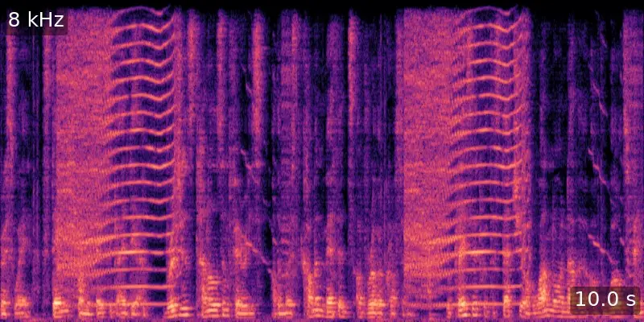 WER 9.7%
(S2, D1, I0)  
stays from the basic idea bridges tunnels and ferries are the most
common methods of river crossing replace it with the statue of one or
another of the worlds famous

TF-GridNet  
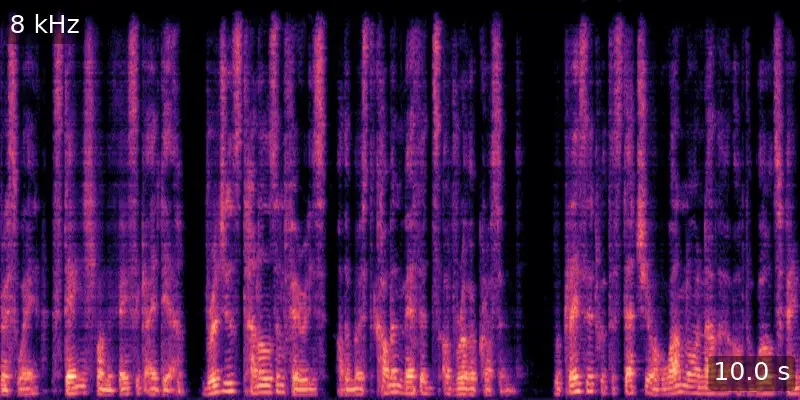 WER 9.7%
(S2, D1, I0)  
stange from the basic idea bridges tunnels and ferries are the most
common methods of river crossing replace it with the statue of one or
another of the worlds famous

PASE  
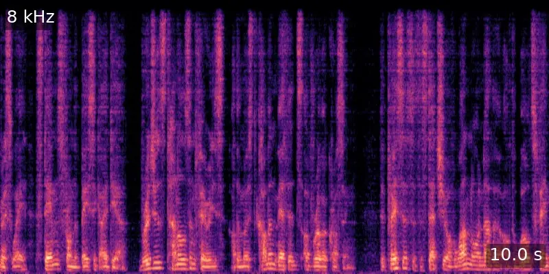 WER 16.1%
(S5, D0, I0)  
railway stems from the basic idea bridges tunnels and ferries are the
most common methods of river crossing the places is the statue of one or
another of the worlds famous

StuPASE  
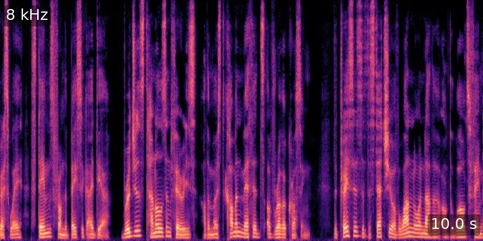 WER 12.9%
(S4, D0, I0)  
way stems from the basic idea bridges tunnels and ferries are the most
common methods of river crossing the traces of the statue of one or
another of the worlds famous

UniPASE  
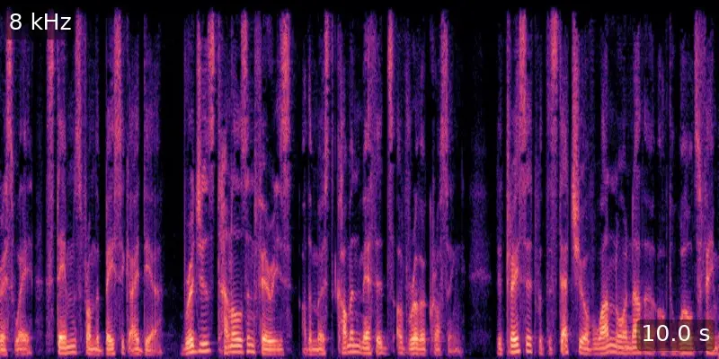 WER 9.7%
(S2, D0, I1)  
way stems from the basic idea bridges tunnels and ferries are the most
common methods of river crossing they trace it with the statue of one or
another of the worlds famous

SenSE  
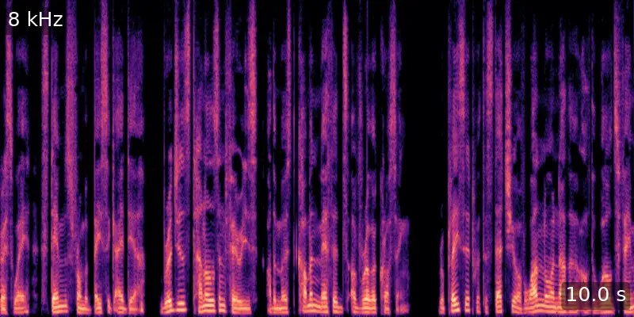 WER 9.7%
(S3, D0, I0)  
way stems from a basic idea bridges tunnels and ferries are the most
common methods of river crossing replace it with a statue of one or
another of the worlds famous

UniSE  
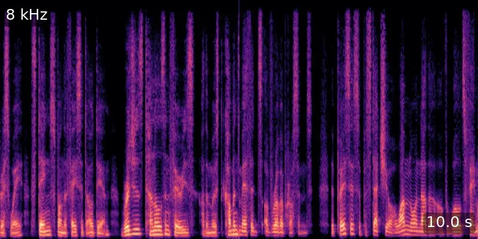 WER 38.7%
(S5, D4, I3)  
railway stains from the face at our dam bridges tunnels and ferries are
the most common methods of river crossings the process of pistachio one
or another of the worlds

LIFT-SE (Ours)  
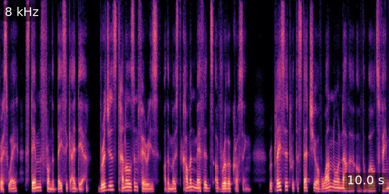 WER 3.2%
(S1, D0, I0)  
way stems from the basic idea bridges tunnels and ferries are the most
common methods of river crossing replace it with the statue of one or
another of the worlds famous

Clean  
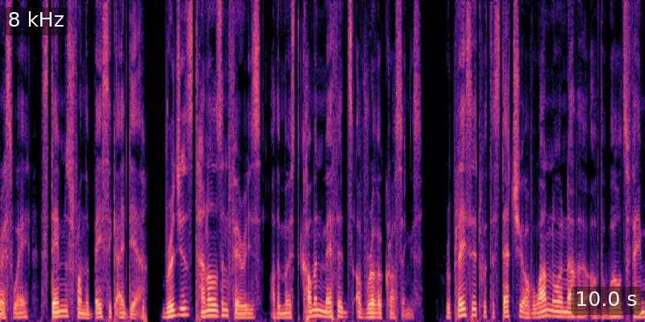 Reference
transcript  
way stems from the basic idea bridges tunnels and ferries are the most
common methods of river crossings replace it with the statue of one or
another of the worlds famous

Figure A1: Spectrograms and Whisper large-v3 transcripts of DNS1
with-reverb utterance fileid_76.

Noisy  
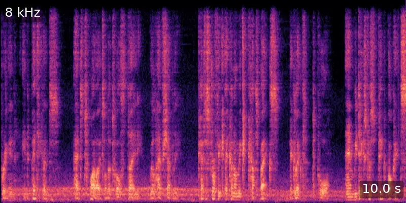 WER 9.5%
(S2, D0, I0)  
bring in in petticoats at twilight on the twelfth day well have shadley
catastrophic economic cutbacks neglect to poor ambidextrous pickpockets

TF-GridNet  
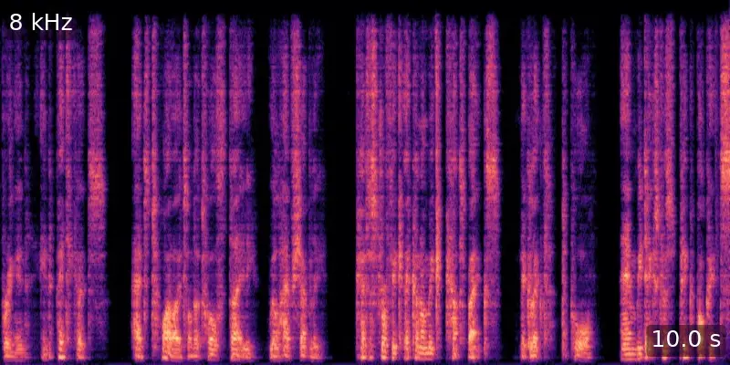 WER 9.5%
(S2, D0, I0)  
bring in in petticoats add twilight on the twelfth day well have shadley
catastrophic economic cutbacks neglect the poor ambidextrous pickpockets

PASE  
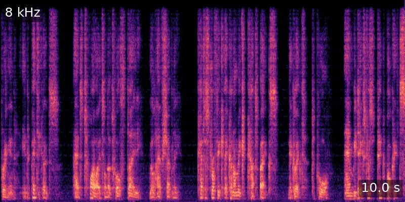 WER 9.5%
(S2, D0, I0)  
bring in in petticoats at twilight on the twelfth day well have shadley
catastrophic economic cutbacks neglect to poor ambidextrous pickpockets

StuPASE  
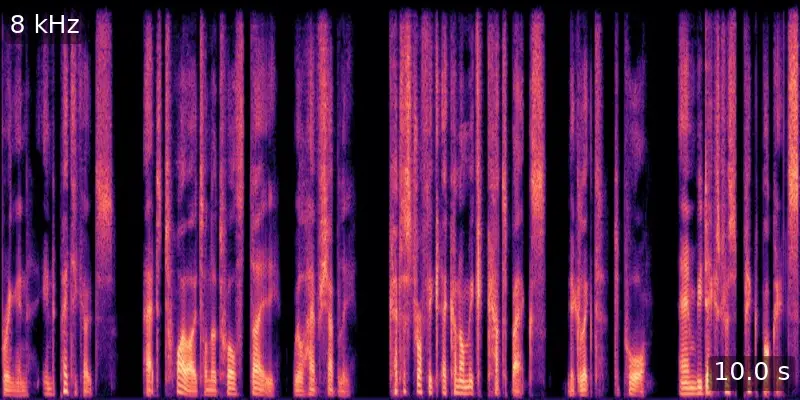 WER 9.5%
(S0, D2, I0)  
in petticoats at twilight on the twelfth day well have shabbily
catastrophic economic cutbacks neglect the poor ambidextrous pickpockets

UniPASE  
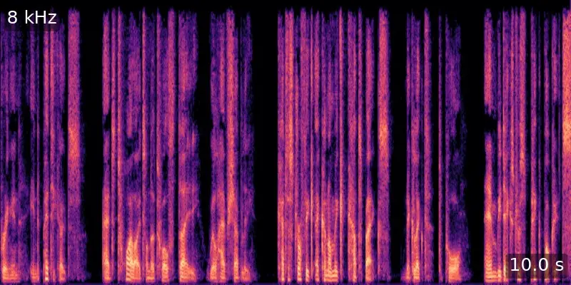 WER 9.5%
(S2, D0, I0)  
bring in in petticoats add twilight on the twelfth day well have
shabbily catastrophic economic cutbacks neglect to poor ambidextrous
pickpockets

SenSE  
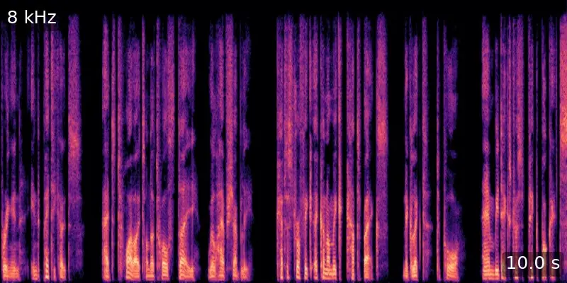 WER 14.3%
(S2, D1, I0)  
springing in petticoats at twilight on the twelfth day well have
shabbily catastrophic economic cutbacks neglect to poor ambidextrous
pickpockets

UniSE  
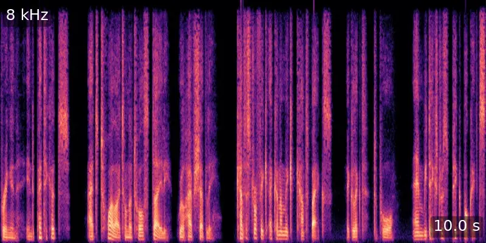 WER 23.8%
(S4, D0, I1)  
bring in in the petticoats at twilight on the twelfth daily well have
sheveley catastrophic economic cutbacks eclect to poor ambidextrous
pickpockets

LIFT-SE (Ours)  
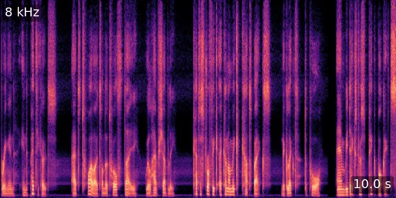 WER 4.8%
(S1, D0, I0)  
bring in in petticoats at twilight on the twelfth day well have shabbily
catastrophic economic cutbacks neglect to poor ambidextrous pickpockets

Clean  
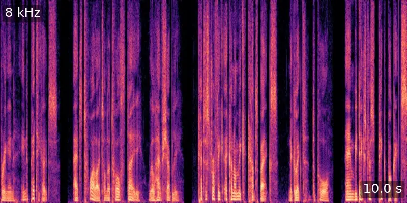 Reference
transcript  
bring in in petticoats at twilight on the twelfth day well have shabbily
catastrophic economic cutbacks neglect the poor ambidextrous pickpockets

Figure A2: Spectrograms and Whisper large-v3 transcripts of DNS1
with-reverb utterance fileid_96.

Noisy  
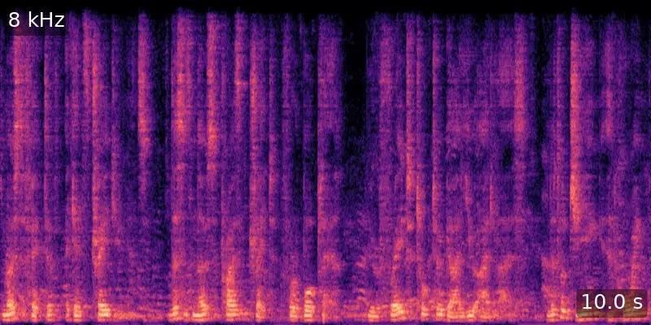 WER 11.5%
(S2, D0, I1)  
most effective against trade unions this is no surprising trait for a
board player youre afraid to talk to a guy you idolize little jeeing and
hawing

TF-GridNet  
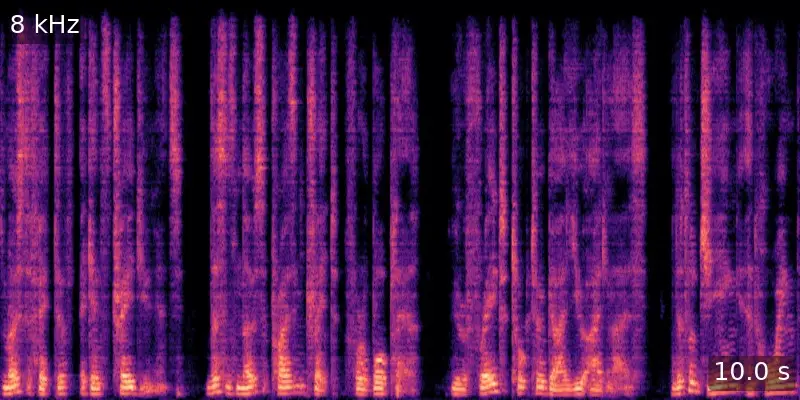 WER 7.7%
(S1, D0, I1)  
most effective against trade unions this is no surprising trait for a
board player youre afraid to talk to a guy you idolize little geeing and
hawing

PASE  
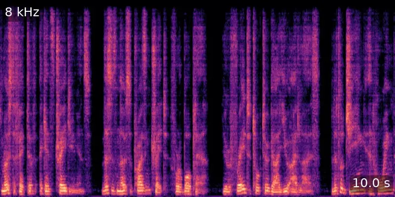 WER 11.5%
(S2, D0, I1)  
most effective against trade unions this is no surprising trait for a
board player youre afraid to talk to a guy you idolize little ging and
hawing

StuPASE  
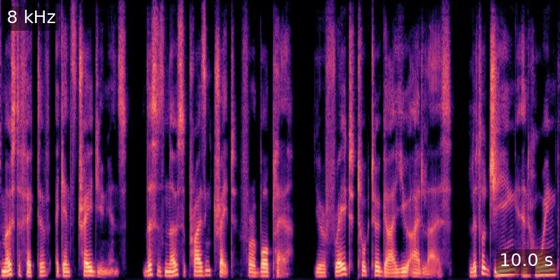 WER 0.0%
(S0, D0, I0)  
most effective against trade unions this is no surprising trait for a
ballplayer youre afraid to talk to a guy you idolize little geeing and
hawing

UniPASE  
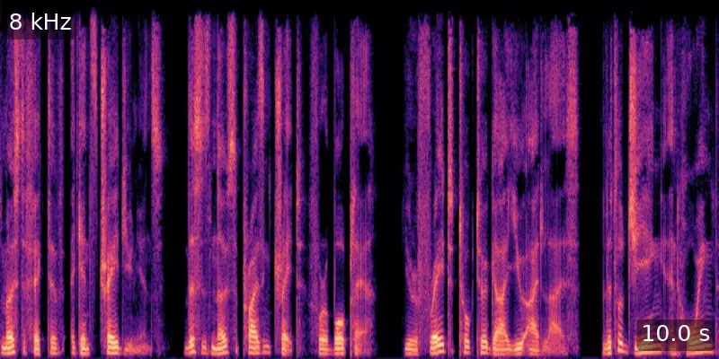 WER 0.0%
(S0, D0, I0)  
most effective against trade unions this is no surprising trait for a
ballplayer youre afraid to talk to a guy you idolize little geeing and
hawing

SenSE  
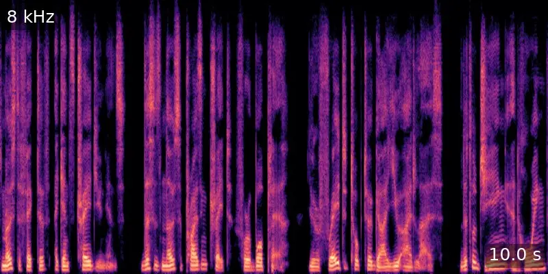 WER 0.0%
(S0, D0, I0)  
most effective against trade unions this is no surprising trait for a
ballplayer youre afraid to talk to a guy you idolize little geeing and
hawing

UniSE  
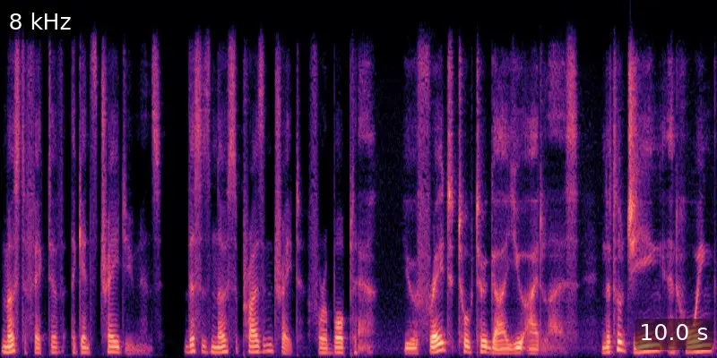 WER 15.4%
(S3, D1, I0)  
most effective against tradeunions this is no surprising trait for a
ballplayer youre afraid to talk to a guy you idolize little jeeing and
hoeing

LIFT-SE (Ours)  
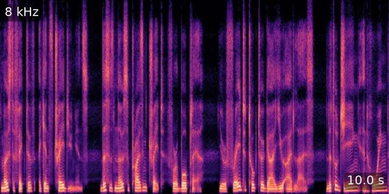 WER 0.0%
(S0, D0, I0)  
most effective against trade unions this is no surprising trait for a
ballplayer youre afraid to talk to a guy you idolize little geeing and
hawing

Clean  
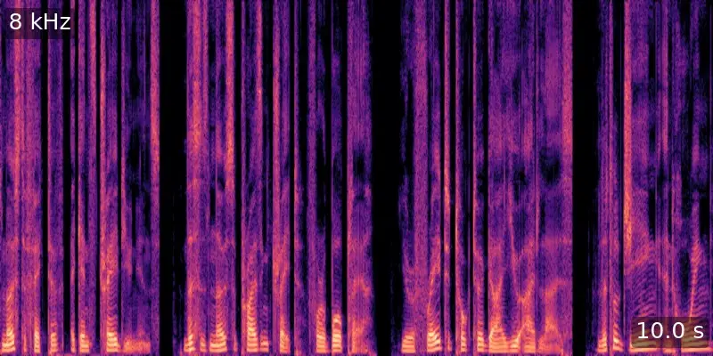 Reference
transcript  
most effective against trade unions this is no surprising trait for a
ballplayer youre afraid to talk to a guy you idolize little geeing and
hawing

Figure A3: Spectrograms and Whisper large-v3 transcripts of DNS1
with-reverb utterance fileid_21.

Noisy  
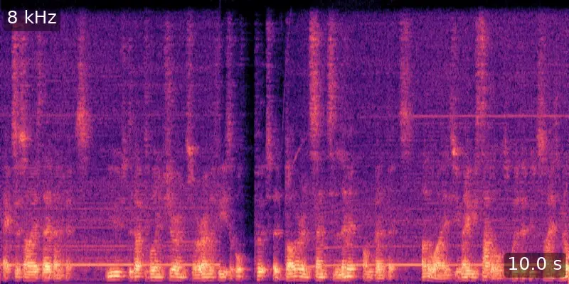 WER 12.0%
(S2, D0, I1)  
exercise their benefits use deductible insurance wherever feasible put a
dollar and cent limit on benefits otherwise you may be saddled with a
bootsized milk cart

TF-GridNet  
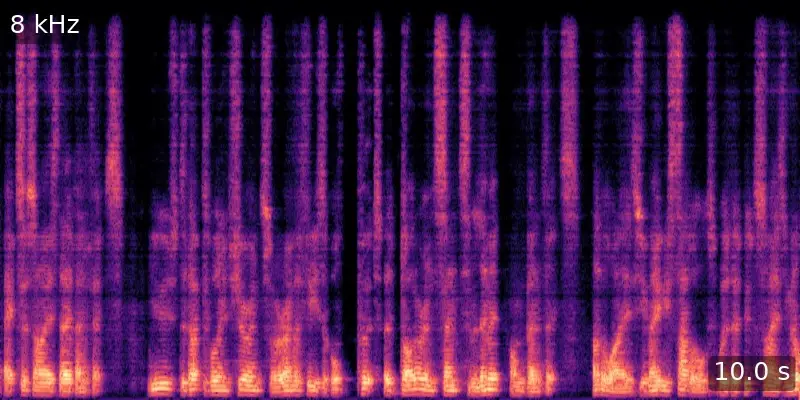 WER 8.0%
(S2, D0, I0)  
exercise their benefits use deductible insurance wherever feasible put a
dollar and cent limit on benefits otherwise you may be saddled with a
goodsized mil

PASE  
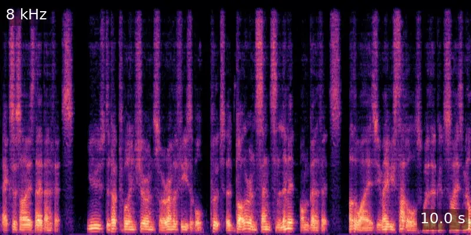 WER 12.0%
(S1, D0, I2)  
exercise their benefits use deductible insurance or are more feasible
put a dollar and cents limit on benefits otherwise you may be saddled
with a goodsized milk

StuPASE  
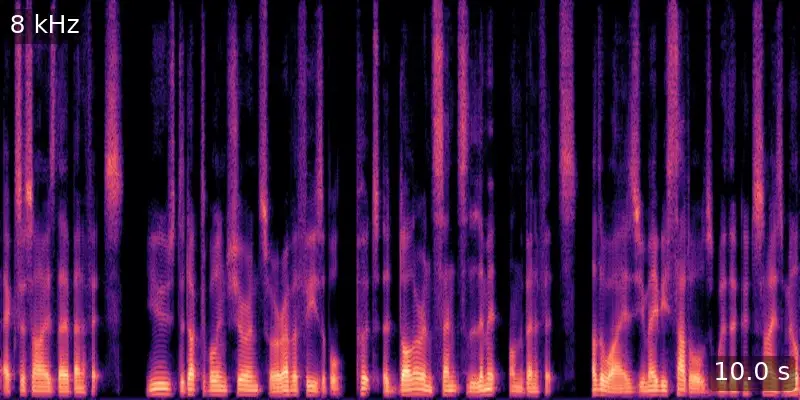 WER 12.0%
(S1, D0, I2)  
exercise their benefits use deductible insurance wherever feasible put a
dollar and cents limit on the benefits otherwise you may be saddled with
a good sized milk

UniPASE  
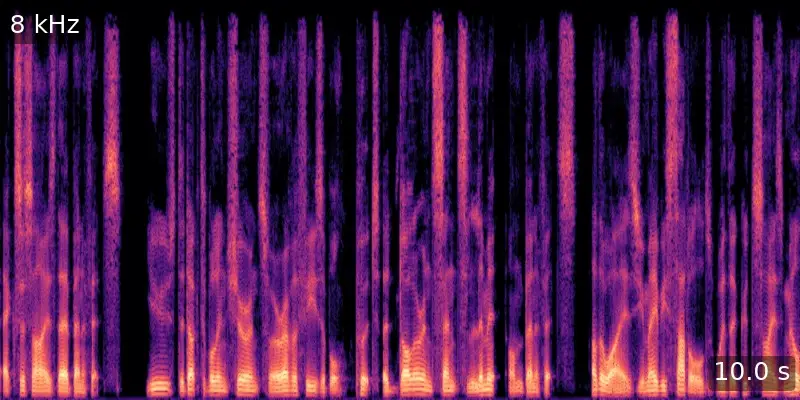 WER 0.0%
(S0, D0, I0)  
exercise their benefits use deductible insurance wherever feasible put a
dollar and cents limit on benefits otherwise you may be saddled with a
goodsized milk

SenSE  
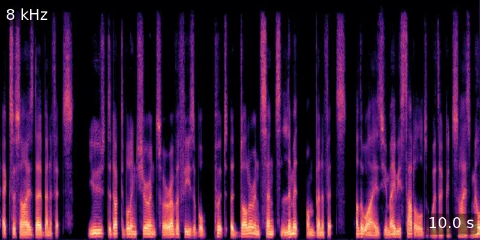 WER 4.0%
(S0, D1, I0)  
exercise their benefits use deductible insurance wherever feasible put a
dollar and cents limit on benefits otherwise you may be saddled with a
goodsized

UniSE  
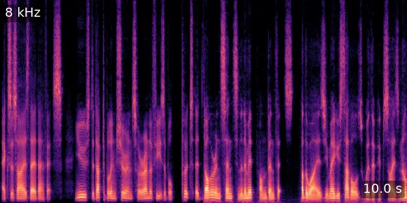 WER 36.0%
(S4, D1, I4)  
exercise their benefits use deductible insurance for a runner feasible
put a dollar and cents in the limit on benefits otherwise you may use
saddles with a poopsized

LIFT-SE (Ours)  
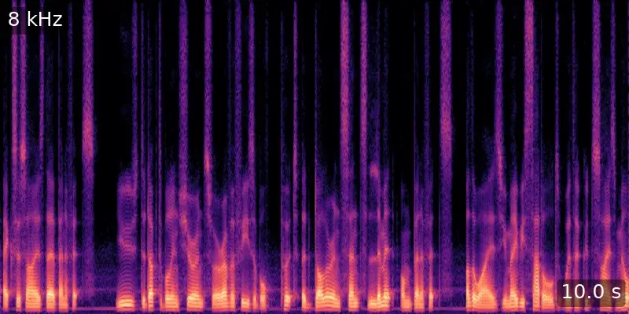 WER 8.0%
(S1, D0, I1)  
exercise their benefits use deductible insurance wherever feasible put a
dollar and cents limit on benefits otherwise you may be saddled with a
good size milk

Clean  
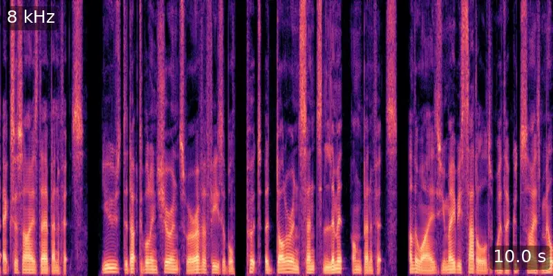 Reference
transcript  
exercise their benefits use deductible insurance wherever feasible put a
dollar and cents limit on benefits otherwise you may be saddled with a
goodsized milk

Figure A4: Spectrograms and Whisper large-v3 transcripts of DNS1
with-reverb utterance fileid_73.
